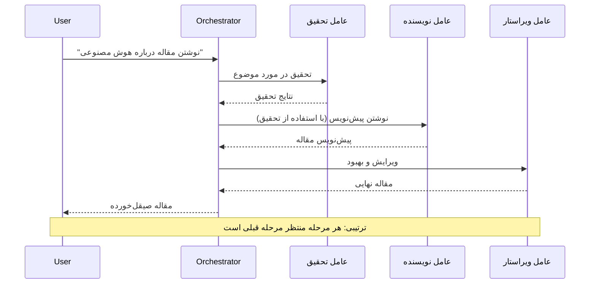
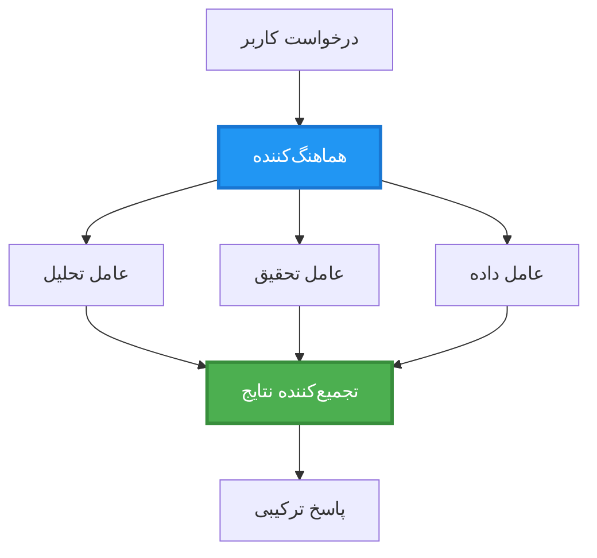
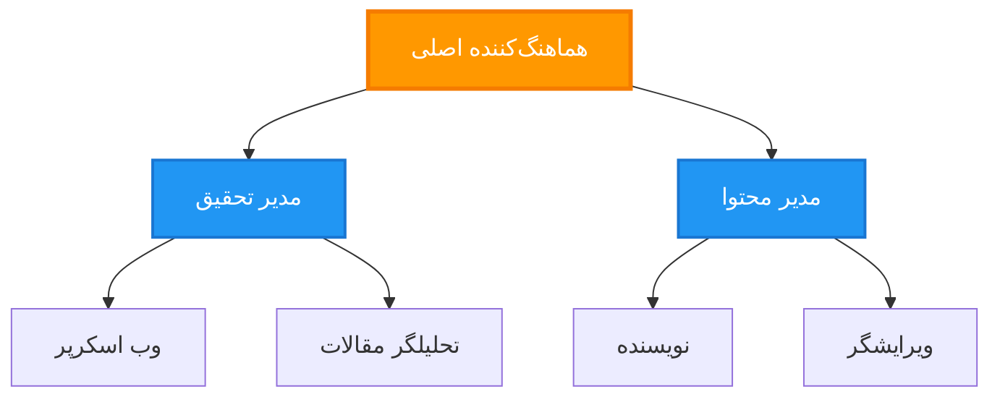
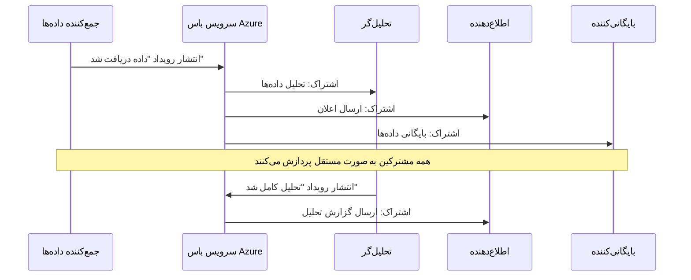
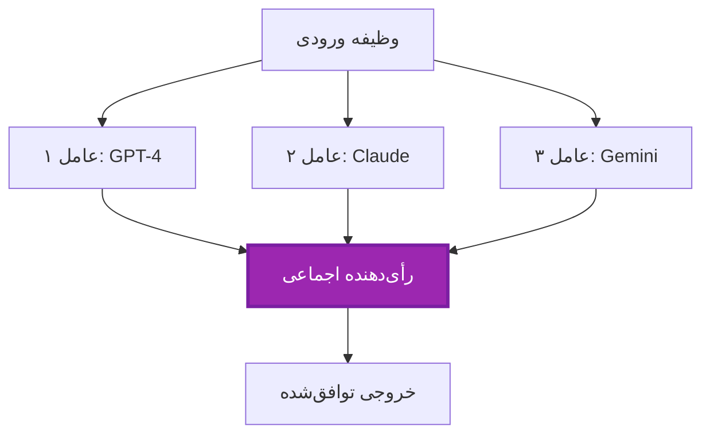
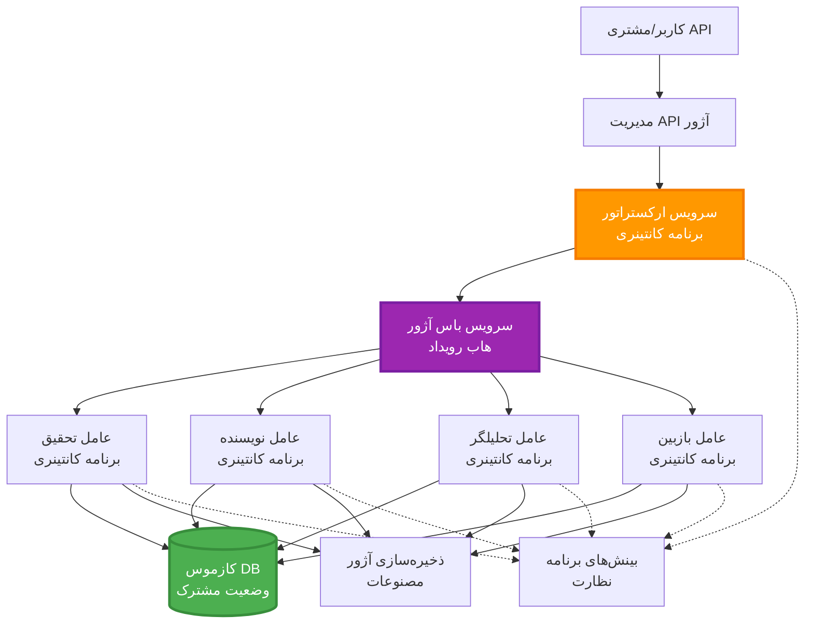

<!--
CO_OP_TRANSLATOR_METADATA:
{
  "original_hash": "bcefbd5d0107691ef3e6e33ba694d6f4",
  "translation_date": "2025-11-20T02:29:22+00:00",
  "source_file": "docs/pre-deployment/coordination-patterns.md",
  "language_code": "fa"
}
-->
# الگوهای هماهنگی چند عاملی

⏱️ **زمان تخمینی**: 60-75 دقیقه | 💰 **هزینه تخمینی**: ~100-300 دلار در ماه | ⭐ **پیچیدگی**: پیشرفته

**📚 مسیر یادگیری:**
- ← قبلی: [برنامه‌ریزی ظرفیت](capacity-planning.md) - استراتژی‌های اندازه‌گیری و مقیاس‌بندی منابع
- 🎯 **شما اینجا هستید**: الگوهای هماهنگی چند عاملی (ارکستراسیون، ارتباطات، مدیریت وضعیت)
- → بعدی: [انتخاب SKU](sku-selection.md) - انتخاب خدمات مناسب Azure
- 🏠 [صفحه اصلی دوره](../../README.md)

---

## آنچه یاد خواهید گرفت

با تکمیل این درس، شما:
- الگوهای معماری **چند عاملی** و زمان استفاده از آنها را درک خواهید کرد
- الگوهای **ارکستراسیون** (متمرکز، غیرمتمرکز، سلسله مراتبی) را پیاده‌سازی خواهید کرد
- استراتژی‌های **ارتباط عامل** (همزمان، غیرهمزمان، مبتنی بر رویداد) را طراحی خواهید کرد
- **وضعیت مشترک** را در میان عوامل توزیع‌شده مدیریت خواهید کرد
- سیستم‌های **چند عاملی** را در Azure با AZD مستقر خواهید کرد
- الگوهای **هماهنگی** را برای سناریوهای واقعی هوش مصنوعی اعمال خواهید کرد
- سیستم‌های عامل توزیع‌شده را نظارت و اشکال‌زدایی خواهید کرد

## چرا هماهنگی چند عاملی مهم است

### تکامل: از عامل واحد به چند عاملی

**عامل واحد (ساده):**
```
User → Agent → Response
```
- ✅ آسان برای درک و پیاده‌سازی
- ✅ سریع برای وظایف ساده
- ❌ محدود به قابلیت‌های یک مدل
- ❌ نمی‌تواند وظایف پیچیده را موازی‌سازی کند
- ❌ بدون تخصص

**سیستم چند عاملی (پیشرفته):**
```
           ┌─────────────┐
           │ Orchestrator│
           └──────┬──────┘
        ┌─────────┼─────────┐
        │         │         │
    ┌───▼──┐  ┌──▼───┐  ┌──▼────┐
    │Agent1│  │Agent2│  │Agent3 │
    │(Plan)│  │(Code)│  │(Review)│
    └──────┘  └──────┘  └───────┘
```
- ✅ عوامل تخصصی برای وظایف خاص
- ✅ اجرای موازی برای سرعت
- ✅ ماژولار و قابل نگهداری
- ✅ بهتر در جریان‌های کاری پیچیده
- ⚠️ نیاز به منطق هماهنگی

**تشبیه**: عامل واحد مانند یک نفر است که همه وظایف را انجام می‌دهد. سیستم چند عاملی مانند یک تیم است که هر عضو مهارت‌های تخصصی دارد (محقق، برنامه‌نویس، بازبین، نویسنده) و با هم کار می‌کنند.

---

## الگوهای اصلی هماهنگی

### الگو 1: هماهنگی ترتیبی (زنجیره مسئولیت)

**زمان استفاده**: وظایف باید به ترتیب خاصی کامل شوند، هر عامل بر اساس خروجی قبلی کار می‌کند.


**مزایا:**
- ✅ جریان داده واضح
- ✅ آسان برای اشکال‌زدایی
- ✅ ترتیب اجرای قابل پیش‌بینی

**محدودیت‌ها:**
- ❌ کندتر (بدون موازی‌سازی)
- ❌ یک شکست کل زنجیره را مسدود می‌کند
- ❌ نمی‌تواند وظایف وابسته را مدیریت کند

**موارد استفاده مثال:**
- خط تولید محتوا (تحقیق → نوشتن → ویرایش → انتشار)
- تولید کد (برنامه‌ریزی → پیاده‌سازی → آزمایش → استقرار)
- تولید گزارش (جمع‌آوری داده → تحلیل → تجسم → خلاصه)

---

### الگو 2: هماهنگی موازی (Fan-Out/Fan-In)

**زمان استفاده**: وظایف مستقل می‌توانند به طور همزمان اجرا شوند، نتایج در پایان ترکیب می‌شوند.


**مزایا:**
- ✅ سریع (اجرای موازی)
- ✅ مقاوم در برابر خطا (نتایج جزئی قابل قبول)
- ✅ مقیاس‌پذیری افقی

**محدودیت‌ها:**
- ⚠️ نتایج ممکن است خارج از ترتیب برسند
- ⚠️ نیاز به منطق تجمیع
- ⚠️ مدیریت وضعیت پیچیده

**موارد استفاده مثال:**
- جمع‌آوری داده از منابع متعدد (APIها + پایگاه‌های داده + وب‌اسکرپینگ)
- تحلیل رقابتی (مدل‌های متعدد راه‌حل‌ها را تولید می‌کنند، بهترین انتخاب می‌شود)
- خدمات ترجمه (ترجمه به زبان‌های متعدد به طور همزمان)

---

### الگو 3: هماهنگی سلسله مراتبی (مدیر-کارگر)

**زمان استفاده**: جریان‌های کاری پیچیده با وظایف فرعی، نیاز به تفویض دارند.


**مزایا:**
- ✅ مدیریت جریان‌های کاری پیچیده
- ✅ ماژولار و قابل نگهداری
- ✅ مرزهای مسئولیت واضح

**محدودیت‌ها:**
- ⚠️ معماری پیچیده‌تر
- ⚠️ تأخیر بالاتر (لایه‌های هماهنگی متعدد)
- ⚠️ نیاز به ارکستراسیون پیشرفته

**موارد استفاده مثال:**
- پردازش اسناد سازمانی (طبقه‌بندی → مسیر → پردازش → بایگانی)
- خطوط داده چند مرحله‌ای (ورود → پاکسازی → تبدیل → تحلیل → گزارش)
- جریان‌های کاری اتوماسیون پیچیده (برنامه‌ریزی → تخصیص منابع → اجرا → نظارت)

---

### الگو 4: هماهنگی مبتنی بر رویداد (Publish-Subscribe)

**زمان استفاده**: عوامل نیاز دارند به رویدادها واکنش نشان دهند، اتصال آزاد مطلوب است.


**مزایا:**
- ✅ اتصال آزاد بین عوامل
- ✅ آسان برای افزودن عوامل جدید (فقط اشتراک)
- ✅ پردازش غیرهمزمان
- ✅ مقاوم (پایداری پیام)

**محدودیت‌ها:**
- ⚠️ سازگاری نهایی
- ⚠️ اشکال‌زدایی پیچیده
- ⚠️ چالش‌های ترتیب پیام

**موارد استفاده مثال:**
- سیستم‌های نظارت بلادرنگ (هشدارها، داشبوردها، گزارش‌ها)
- اعلان‌های چند کاناله (ایمیل، پیامک، پوش، Slack)
- خطوط پردازش داده (مصرف‌کنندگان متعدد از داده یکسان)

---

### الگو 5: هماهنگی مبتنی بر اجماع (رأی‌گیری/Quorum)

**زمان استفاده**: نیاز به توافق از چندین عامل قبل از ادامه.


**مزایا:**
- ✅ دقت بالاتر (نظرات متعدد)
- ✅ مقاوم در برابر خطا (شکست اقلیت قابل قبول)
- ✅ تضمین کیفیت داخلی

**محدودیت‌ها:**
- ❌ گران (تماس‌های مدل متعدد)
- ❌ کندتر (انتظار برای همه عوامل)
- ⚠️ نیاز به حل تعارض

**موارد استفاده مثال:**
- تعدیل محتوا (مدل‌های متعدد محتوا را بررسی می‌کنند)
- بررسی کد (لینترها/تحلیلگرهای متعدد)
- تشخیص پزشکی (مدل‌های هوش مصنوعی متعدد، اعتبارسنجی کارشناسان)

---

## نمای کلی معماری

### سیستم کامل چند عاملی در Azure


**اجزای کلیدی:**

| جزء | هدف | سرویس Azure |
|-----|-----|-------------|
| **API Gateway** | نقطه ورود، محدودیت نرخ، احراز هویت | API Management |
| **Orchestrator** | هماهنگی جریان‌های کاری عامل | Container Apps |
| **Message Queue** | ارتباط غیرهمزمان | Service Bus / Event Hubs |
| **Agents** | کارگران هوش مصنوعی تخصصی | Container Apps / Functions |
| **State Store** | وضعیت مشترک، ردیابی وظایف | Cosmos DB |
| **Artifact Storage** | اسناد، نتایج، گزارش‌ها | Blob Storage |
| **Monitoring** | ردیابی توزیع‌شده، گزارش‌ها | Application Insights |

---

## پیش‌نیازها

### ابزارهای مورد نیاز

```bash
# تأیید CLI توسعه‌دهنده Azure
azd version
# ✅ مورد انتظار: نسخه azd 1.0.0 یا بالاتر

# تأیید CLI Azure
az --version
# ✅ مورد انتظار: azure-cli نسخه 2.50.0 یا بالاتر

# تأیید Docker (برای آزمایش محلی)
docker --version
# ✅ مورد انتظار: نسخه Docker 20.10 یا بالاتر
```

### الزامات Azure

- اشتراک فعال Azure
- مجوز برای ایجاد:
  - Container Apps
  - نام‌های فضای Service Bus
  - حساب‌های Cosmos DB
  - حساب‌های ذخیره‌سازی
  - Application Insights

### پیش‌نیازهای دانش

شما باید تکمیل کرده باشید:
- [مدیریت پیکربندی](../getting-started/configuration.md)
- [احراز هویت و امنیت](../getting-started/authsecurity.md)
- [مثال میکروسرویس‌ها](../../../../examples/microservices)

---

## راهنمای پیاده‌سازی

### ساختار پروژه

```
multi-agent-system/
├── azure.yaml                    # AZD configuration
├── infra/
│   ├── main.bicep               # Main infrastructure
│   ├── core/
│   │   ├── servicebus.bicep     # Message queue
│   │   ├── cosmos.bicep         # State store
│   │   ├── storage.bicep        # Artifact storage
│   │   └── monitoring.bicep     # Application Insights
│   └── app/
│       ├── orchestrator.bicep   # Orchestrator service
│       └── agent.bicep          # Agent template
└── src/
    ├── orchestrator/            # Orchestration logic
    │   ├── app.py
    │   ├── workflows.py
    │   └── Dockerfile
    ├── agents/
    │   ├── research/            # Research agent
    │   ├── writer/              # Writer agent
    │   ├── analyst/             # Analyst agent
    │   └── reviewer/            # Reviewer agent
    └── shared/
        ├── state_manager.py     # Shared state logic
        └── message_handler.py   # Message handling
```

---

## درس 1: الگوی هماهنگی ترتیبی

### پیاده‌سازی: خط تولید محتوا

بیایید یک خط تولید ترتیبی بسازیم: تحقیق → نوشتن → ویرایش → انتشار

### 1. پیکربندی AZD

**فایل: `azure.yaml`**

```yaml
name: content-pipeline
metadata:
  template: multi-agent-sequential@1.0.0

services:
  orchestrator:
    project: ./src/orchestrator
    language: python
    host: containerapp
  
  research-agent:
    project: ./src/agents/research
    language: python
    host: containerapp
  
  writer-agent:
    project: ./src/agents/writer
    language: python
    host: containerapp
  
  editor-agent:
    project: ./src/agents/editor
    language: python
    host: containerapp
```

### 2. زیرساخت: Service Bus برای هماهنگی

**فایل: `infra/core/servicebus.bicep`**

```bicep
param name string
param location string
param tags object = {}

resource serviceBusNamespace 'Microsoft.ServiceBus/namespaces@2022-10-01-preview' = {
  name: name
  location: location
  tags: tags
  sku: {
    name: 'Standard'
    tier: 'Standard'
  }
  properties: {
    minimumTlsVersion: '1.2'
  }
}

// Queue for orchestrator → research agent
resource researchQueue 'Microsoft.ServiceBus/namespaces/queues@2022-10-01-preview' = {
  parent: serviceBusNamespace
  name: 'research-tasks'
  properties: {
    maxDeliveryCount: 3
    lockDuration: 'PT5M'
    deadLetteringOnMessageExpiration: true
  }
}

// Queue for research agent → writer agent
resource writerQueue 'Microsoft.ServiceBus/namespaces/queues@2022-10-01-preview' = {
  parent: serviceBusNamespace
  name: 'writer-tasks'
  properties: {
    maxDeliveryCount: 3
    lockDuration: 'PT5M'
  }
}

// Queue for writer agent → editor agent
resource editorQueue 'Microsoft.ServiceBus/namespaces/queues@2022-10-01-preview' = {
  parent: serviceBusNamespace
  name: 'editor-tasks'
  properties: {
    maxDeliveryCount: 3
    lockDuration: 'PT5M'
  }
}

output namespace string = serviceBusNamespace.name
output connectionString string = listKeys('${serviceBusNamespace.id}/AuthorizationRules/RootManageSharedAccessKey', serviceBusNamespace.apiVersion).primaryConnectionString
```

### 3. مدیر وضعیت مشترک

**فایل: `src/shared/state_manager.py`**

```python
from azure.cosmos import CosmosClient, PartitionKey
from datetime import datetime
import os

class StateManager:
    """Manages shared state across agents using Cosmos DB"""
    
    def __init__(self):
        endpoint = os.environ['COSMOS_ENDPOINT']
        key = os.environ['COSMOS_KEY']
        
        self.client = CosmosClient(endpoint, key)
        self.database = self.client.get_database_client('agent-state')
        self.container = self.database.get_container_client('tasks')
    
    def create_task(self, task_id: str, task_type: str, input_data: dict):
        """Create a new task"""
        task = {
            'id': task_id,
            'type': task_type,
            'status': 'pending',
            'input': input_data,
            'created_at': datetime.utcnow().isoformat(),
            'steps': []
        }
        self.container.create_item(task)
        return task
    
    def update_task_step(self, task_id: str, step_name: str, result: dict):
        """Update task with completed step"""
        task = self.container.read_item(task_id, partition_key=task_id)
        
        task['steps'].append({
            'name': step_name,
            'completed_at': datetime.utcnow().isoformat(),
            'result': result
        })
        
        self.container.replace_item(task_id, task)
        return task
    
    def complete_task(self, task_id: str, final_result: dict):
        """Mark task as complete"""
        task = self.container.read_item(task_id, partition_key=task_id)
        task['status'] = 'completed'
        task['result'] = final_result
        task['completed_at'] = datetime.utcnow().isoformat()
        self.container.replace_item(task_id, task)
        return task
    
    def get_task(self, task_id: str):
        """Retrieve task state"""
        return self.container.read_item(task_id, partition_key=task_id)
```

### 4. سرویس ارکستراتور

**فایل: `src/orchestrator/app.py`**

```python
from flask import Flask, request, jsonify
from azure.servicebus import ServiceBusClient, ServiceBusMessage
import json
import uuid
import os
from shared.state_manager import StateManager

app = Flask(__name__)
state_manager = StateManager()

# اتصال سرویس باس
servicebus_connection_str = os.environ['SERVICEBUS_CONNECTION_STRING']
servicebus_client = ServiceBusClient.from_connection_string(servicebus_connection_str)

@app.route('/health', methods=['GET'])
def health():
    return jsonify({'status': 'healthy', 'service': 'orchestrator'})

@app.route('/create-content', methods=['POST'])
def create_content():
    """
    Sequential workflow: Research → Write → Edit → Publish
    """
    data = request.json
    topic = data.get('topic')
    
    if not topic:
        return jsonify({'error': 'Topic required'}), 400
    
    # ایجاد وظیفه در ذخیره‌سازی حالت
    task_id = str(uuid.uuid4())
    task = state_manager.create_task(
        task_id=task_id,
        task_type='content_creation',
        input_data={'topic': topic}
    )
    
    # ارسال پیام به عامل تحقیق (مرحله اول)
    sender = servicebus_client.get_queue_sender('research-tasks')
    message = ServiceBusMessage(
        body=json.dumps({
            'task_id': task_id,
            'topic': topic,
            'next_queue': 'writer-tasks'  # محل ارسال نتایج
        }),
        content_type='application/json'
    )
    
    with sender:
        sender.send_messages(message)
    
    return jsonify({
        'task_id': task_id,
        'status': 'started',
        'workflow': 'sequential',
        'steps': ['research', 'write', 'edit', 'publish'],
        'message': 'Content creation pipeline initiated'
    }), 202

@app.route('/task/<task_id>', methods=['GET'])
def get_task_status(task_id):
    """Check task status"""
    try:
        task = state_manager.get_task(task_id)
        return jsonify(task)
    except Exception as e:
        return jsonify({'error': str(e)}), 404

if __name__ == '__main__':
    app.run(host='0.0.0.0', port=8080)
```

### 5. عامل تحقیق

**فایل: `src/agents/research/app.py`**

```python
from azure.servicebus import ServiceBusClient, ServiceBusMessage
from openai import AzureOpenAI
import json
import os
import time
from shared.state_manager import StateManager

# مشتری‌ها را مقداردهی اولیه کنید
state_manager = StateManager()
servicebus_client = ServiceBusClient.from_connection_string(
    os.environ['SERVICEBUS_CONNECTION_STRING']
)

openai_client = AzureOpenAI(
    api_key=os.environ['AZURE_OPENAI_API_KEY'],
    api_version="2024-02-01",
    azure_endpoint=os.environ['AZURE_OPENAI_ENDPOINT']
)

def process_research_task(message_data):
    """Process research request and pass to writer"""
    task_id = message_data['task_id']
    topic = message_data['topic']
    next_queue = message_data['next_queue']
    
    print(f"🔬 Researching: {topic}")
    
    # برای تحقیق، Azure OpenAI را فراخوانی کنید
    response = openai_client.chat.completions.create(
        model="gpt-4",
        messages=[
            {"role": "system", "content": "You are a research assistant. Provide comprehensive research on the given topic."},
            {"role": "user", "content": f"Research this topic thoroughly: {topic}"}
        ],
        max_tokens=1500
    )
    
    research_results = response.choices[0].message.content
    
    # وضعیت را به‌روزرسانی کنید
    state_manager.update_task_step(
        task_id=task_id,
        step_name='research',
        result={'research': research_results}
    )
    
    # به عامل بعدی (نویسنده) ارسال کنید
    sender = servicebus_client.get_queue_sender(next_queue)
    message = ServiceBusMessage(
        body=json.dumps({
            'task_id': task_id,
            'topic': topic,
            'research': research_results,
            'next_queue': 'editor-tasks'
        }),
        content_type='application/json'
    )
    
    with sender:
        sender.send_messages(message)
    
    print(f"✅ Research complete for task {task_id}")

def main():
    """Listen to research queue"""
    receiver = servicebus_client.get_queue_receiver('research-tasks')
    
    print("🔬 Research Agent started, listening for tasks...")
    
    with receiver:
        while True:
            messages = receiver.receive_messages(max_wait_time=5)
            for message in messages:
                try:
                    message_data = json.loads(str(message))
                    process_research_task(message_data)
                    receiver.complete_message(message)
                except Exception as e:
                    print(f"❌ Error processing message: {e}")
                    receiver.abandon_message(message)

if __name__ == '__main__':
    main()
```

### 6. عامل نویسنده

**فایل: `src/agents/writer/app.py`**

```python
from azure.servicebus import ServiceBusClient, ServiceBusMessage
from openai import AzureOpenAI
import json
import os
from shared.state_manager import StateManager

state_manager = StateManager()
servicebus_client = ServiceBusClient.from_connection_string(
    os.environ['SERVICEBUS_CONNECTION_STRING']
)

openai_client = AzureOpenAI(
    api_key=os.environ['AZURE_OPENAI_API_KEY'],
    api_version="2024-02-01",
    azure_endpoint=os.environ['AZURE_OPENAI_ENDPOINT']
)

def process_writing_task(message_data):
    """Write article based on research"""
    task_id = message_data['task_id']
    topic = message_data['topic']
    research = message_data['research']
    next_queue = message_data['next_queue']
    
    print(f"✍️ Writing article: {topic}")
    
    # تماس با Azure OpenAI برای نوشتن مقاله
    response = openai_client.chat.completions.create(
        model="gpt-4",
        messages=[
            {"role": "system", "content": "You are a professional writer. Write engaging, well-structured articles."},
            {"role": "user", "content": f"Based on this research:\n\n{research}\n\nWrite a comprehensive article about: {topic}"}
        ],
        max_tokens=2000
    )
    
    article_draft = response.choices[0].message.content
    
    # به‌روزرسانی وضعیت
    state_manager.update_task_step(
        task_id=task_id,
        step_name='writing',
        result={'draft': article_draft}
    )
    
    # ارسال به ویراستار
    sender = servicebus_client.get_queue_sender(next_queue)
    message = ServiceBusMessage(
        body=json.dumps({
            'task_id': task_id,
            'topic': topic,
            'draft': article_draft
        }),
        content_type='application/json'
    )
    
    with sender:
        sender.send_messages(message)
    
    print(f"✅ Article draft complete for task {task_id}")

def main():
    """Listen to writer queue"""
    receiver = servicebus_client.get_queue_receiver('writer-tasks')
    
    print("✍️ Writer Agent started, listening for tasks...")
    
    with receiver:
        while True:
            messages = receiver.receive_messages(max_wait_time=5)
            for message in messages:
                try:
                    message_data = json.loads(str(message))
                    process_writing_task(message_data)
                    receiver.complete_message(message)
                except Exception as e:
                    print(f"❌ Error: {e}")
                    receiver.abandon_message(message)

if __name__ == '__main__':
    main()
```

### 7. عامل ویرایشگر

**فایل: `src/agents/editor/app.py`**

```python
from azure.servicebus import ServiceBusClient
from openai import AzureOpenAI
import json
import os
from shared.state_manager import StateManager

state_manager = StateManager()
servicebus_client = ServiceBusClient.from_connection_string(
    os.environ['SERVICEBUS_CONNECTION_STRING']
)

openai_client = AzureOpenAI(
    api_key=os.environ['AZURE_OPENAI_API_KEY'],
    api_version="2024-02-01",
    azure_endpoint=os.environ['AZURE_OPENAI_ENDPOINT']
)

def process_editing_task(message_data):
    """Edit and finalize article"""
    task_id = message_data['task_id']
    topic = message_data['topic']
    draft = message_data['draft']
    
    print(f"📝 Editing article: {topic}")
    
    # تماس با Azure OpenAI برای ویرایش
    response = openai_client.chat.completions.create(
        model="gpt-4",
        messages=[
            {"role": "system", "content": "You are an expert editor. Improve grammar, clarity, and structure."},
            {"role": "user", "content": f"Edit and improve this article:\n\n{draft}"}
        ],
        max_tokens=2000
    )
    
    final_article = response.choices[0].message.content
    
    # علامت‌گذاری وظیفه به عنوان کامل
    state_manager.complete_task(
        task_id=task_id,
        final_result={
            'topic': topic,
            'final_article': final_article,
            'word_count': len(final_article.split())
        }
    )
    
    print(f"✅ Article finalized for task {task_id}")

def main():
    """Listen to editor queue"""
    receiver = servicebus_client.get_queue_receiver('editor-tasks')
    
    print("📝 Editor Agent started, listening for tasks...")
    
    with receiver:
        while True:
            messages = receiver.receive_messages(max_wait_time=5)
            for message in messages:
                try:
                    message_data = json.loads(str(message))
                    process_editing_task(message_data)
                    receiver.complete_message(message)
                except Exception as e:
                    print(f"❌ Error: {e}")
                    receiver.abandon_message(message)

if __name__ == '__main__':
    main()
```

### 8. استقرار و آزمایش

```bash
# مقداردهی اولیه و استقرار
azd init
azd up

# دریافت آدرس URL هماهنگ‌کننده
ORCHESTRATOR_URL=$(azd env get-values | grep ORCHESTRATOR_URL | cut -d '=' -f2 | tr -d '"')

# ایجاد محتوا
curl -X POST $ORCHESTRATOR_URL/create-content \
  -H "Content-Type: application/json" \
  -d '{"topic": "The Future of AI in Healthcare"}'
```

**✅ خروجی مورد انتظار:**
```json
{
  "task_id": "a1b2c3d4-e5f6-7890-abcd-ef1234567890",
  "status": "started",
  "workflow": "sequential",
  "steps": ["research", "write", "edit", "publish"],
  "message": "Content creation pipeline initiated"
}
```

**بررسی پیشرفت وظیفه:**
```bash
TASK_ID="a1b2c3d4-e5f6-7890-abcd-ef1234567890"
curl $ORCHESTRATOR_URL/task/$TASK_ID
```

**✅ خروجی مورد انتظار (تکمیل شده):**
```json
{
  "id": "a1b2c3d4-e5f6-7890-abcd-ef1234567890",
  "type": "content_creation",
  "status": "completed",
  "steps": [
    {
      "name": "research",
      "completed_at": "2025-11-19T10:30:00Z",
      "result": {"research": "..."}
    },
    {
      "name": "writing",
      "completed_at": "2025-11-19T10:32:00Z",
      "result": {"draft": "..."}
    }
  ],
  "result": {
    "topic": "The Future of AI in Healthcare",
    "final_article": "...",
    "word_count": 1500
  }
}
```

---

## درس 2: الگوی هماهنگی موازی

### پیاده‌سازی: جمع‌آوری‌کننده تحقیق چند منبعی

بیایید یک سیستم موازی بسازیم که اطلاعات را از منابع متعدد به طور همزمان جمع‌آوری کند.

### ارکستراتور موازی

**فایل: `src/orchestrator/parallel_workflow.py`**

```python
from flask import Flask, request, jsonify
from azure.servicebus import ServiceBusClient, ServiceBusMessage
import json
import uuid
import os
from shared.state_manager import StateManager

app = Flask(__name__)
state_manager = StateManager()

servicebus_client = ServiceBusClient.from_connection_string(
    os.environ['SERVICEBUS_CONNECTION_STRING']
)

@app.route('/research-parallel', methods=['POST'])
def research_parallel():
    """
    Parallel workflow: Multiple agents work simultaneously
    """
    data = request.json
    query = data.get('query')
    
    task_id = str(uuid.uuid4())
    task = state_manager.create_task(
        task_id=task_id,
        task_type='parallel_research',
        input_data={
            'query': query,
            'agents': ['web', 'academic', 'news', 'social']
        }
    )
    
    # ارسال به همه عوامل به طور همزمان
    agents = [
        ('web-research-queue', 'web'),
        ('academic-research-queue', 'academic'),
        ('news-research-queue', 'news'),
        ('social-research-queue', 'social')
    ]
    
    for queue_name, agent_type in agents:
        sender = servicebus_client.get_queue_sender(queue_name)
        message = ServiceBusMessage(
            body=json.dumps({
                'task_id': task_id,
                'query': query,
                'agent_type': agent_type,
                'result_queue': 'aggregation-queue'
            }),
            content_type='application/json'
        )
        
        with sender:
            sender.send_messages(message)
    
    return jsonify({
        'task_id': task_id,
        'status': 'started',
        'workflow': 'parallel',
        'agents_dispatched': 4,
        'message': 'Parallel research initiated'
    }), 202

if __name__ == '__main__':
    app.run(host='0.0.0.0', port=8080)
```

### منطق تجمیع

**فایل: `src/agents/aggregator/app.py`**

```python
from azure.servicebus import ServiceBusClient
import json
import os
from collections import defaultdict
from shared.state_manager import StateManager

state_manager = StateManager()
servicebus_client = ServiceBusClient.from_connection_string(
    os.environ['SERVICEBUS_CONNECTION_STRING']
)

# نتایج را برای هر وظیفه پیگیری کنید
task_results = defaultdict(list)
expected_agents = 4  # وب، علمی، اخبار، اجتماعی

def process_result(message_data):
    """Aggregate results from parallel agents"""
    task_id = message_data['task_id']
    agent_type = message_data['agent_type']
    result = message_data['result']
    
    # ذخیره نتیجه
    task_results[task_id].append({
        'agent': agent_type,
        'data': result
    })
    
    print(f"📊 Received result from {agent_type} agent ({len(task_results[task_id])}/{expected_agents})")
    
    # بررسی کنید که آیا همه عوامل تکمیل شده‌اند (تجمع)
    if len(task_results[task_id]) == expected_agents:
        print(f"✅ All agents completed for task {task_id}. Aggregating...")
        
        # ترکیب نتایج
        aggregated = {
            'query': message_data['query'],
            'sources': task_results[task_id],
            'summary': generate_summary(task_results[task_id])
        }
        
        # علامت‌گذاری به عنوان تکمیل شده
        state_manager.complete_task(task_id, aggregated)
        
        # پاکسازی کنید
        del task_results[task_id]
        
        print(f"✅ Aggregation complete for task {task_id}")

def generate_summary(results):
    """Generate summary from all sources"""
    summaries = [r['data'].get('summary', '') for r in results]
    return '\n\n'.join(summaries)

def main():
    """Listen to aggregation queue"""
    receiver = servicebus_client.get_queue_receiver('aggregation-queue')
    
    print("📊 Aggregator started, listening for results...")
    
    with receiver:
        while True:
            messages = receiver.receive_messages(max_wait_time=5)
            for message in messages:
                try:
                    message_data = json.loads(str(message))
                    process_result(message_data)
                    receiver.complete_message(message)
                except Exception as e:
                    print(f"❌ Error: {e}")
                    receiver.abandon_message(message)

if __name__ == '__main__':
    main()
```

**مزایای الگوی موازی:**
- ⚡ **4 برابر سریع‌تر** (عوامل به طور همزمان اجرا می‌شوند)
- 🔄 **مقاوم در برابر خطا** (نتایج جزئی قابل قبول)
- 📈 **مقیاس‌پذیر** (افزودن عوامل بیشتر آسان است)

---

## تمرین‌های عملی

### تمرین 1: افزودن مدیریت زمان‌بندی ⭐⭐ (متوسط)

**هدف**: منطق زمان‌بندی را پیاده‌سازی کنید تا جمع‌آوری‌کننده برای عوامل کند منتظر نماند.

**مراحل**:

1. **افزودن ردیابی زمان‌بندی به جمع‌آوری‌کننده:**

```python
from datetime import datetime, timedelta

task_timeouts = {}  # شناسه وظیفه -> زمان انقضا

def process_result(message_data):
    task_id = message_data['task_id']
    
    # تنظیم زمان انتظار بر روی اولین نتیجه
    if task_id not in task_timeouts:
        task_timeouts[task_id] = datetime.utcnow() + timedelta(seconds=30)
    
    task_results[task_id].append({
        'agent': message_data['agent_type'],
        'data': message_data['result']
    })
    
    # بررسی کنید که آیا کامل شده یا زمان آن به پایان رسیده است
    if len(task_results[task_id]) == expected_agents or \
       datetime.utcnow() > task_timeouts[task_id]:
        
        print(f"📊 Aggregating with {len(task_results[task_id])}/{expected_agents} results")
        
        aggregated = {
            'query': message_data['query'],
            'sources': task_results[task_id],
            'completed_agents': len(task_results[task_id]),
            'timed_out': len(task_results[task_id]) < expected_agents
        }
        
        state_manager.complete_task(task_id, aggregated)
        
        # پاکسازی
        del task_results[task_id]
        del task_timeouts[task_id]
```

2. **آزمایش با تأخیرهای مصنوعی:**

```python
# در یک عامل، تأخیر اضافه کنید تا پردازش کند را شبیه‌سازی کنید
import time
time.sleep(35)  # از محدودیت زمانی ۳۰ ثانیه‌ای فراتر می‌رود
```

3. **استقرار و تأیید:**

```bash
azd deploy aggregator

# ارسال وظیفه
curl -X POST $ORCHESTRATOR_URL/research-parallel \
  -H "Content-Type: application/json" \
  -d '{"query": "AI safety research"}'

# نتایج را پس از ۳۰ ثانیه بررسی کنید
curl $ORCHESTRATOR_URL/task/$TASK_ID
```

**✅ معیارهای موفقیت:**
- ✅ وظیفه پس از 30 ثانیه تکمیل می‌شود حتی اگر عوامل کامل نشده باشند
- ✅ پاسخ نشان‌دهنده نتایج جزئی است (`"timed_out": true`)
- ✅ نتایج موجود بازگردانده می‌شوند (3 از 4 عامل)

**زمان**: 20-25 دقیقه

---

### تمرین 2: پیاده‌سازی منطق تلاش مجدد ⭐⭐⭐ (پیشرفته)

**هدف**: وظایف عامل‌های شکست‌خورده را به طور خودکار قبل از تسلیم شدن دوباره امتحان کنید.

**مراحل**:

1. **افزودن ردیابی تلاش مجدد به ارکستراتور:**

```python
from dataclasses import dataclass
from typing import Dict

@dataclass
class RetryConfig:
    max_retries: int = 3
    backoff_seconds: int = 5

retry_counts: Dict[str, int] = {}  # شناسه پیام -> تعداد تلاش مجدد

def send_with_retry(queue_name: str, message_data: dict, retry_config: RetryConfig):
    """Send message with retry metadata"""
    message_id = message_data.get('message_id', str(uuid.uuid4()))
    message_data['message_id'] = message_id
    message_data['retry_count'] = retry_counts.get(message_id, 0)
    message_data['max_retries'] = retry_config.max_retries
    
    sender = servicebus_client.get_queue_sender(queue_name)
    message = ServiceBusMessage(
        body=json.dumps(message_data),
        content_type='application/json',
        message_id=message_id
    )
    
    with sender:
        sender.send_messages(message)
```

2. **افزودن مدیریت تلاش مجدد به عوامل:**

```python
def process_with_retry(message, receiver, process_func):
    """Process message with automatic retry on failure"""
    try:
        message_data = json.loads(str(message))
        
        # پردازش پیام
        process_func(message_data)
        
        # موفقیت - تکمیل شد
        receiver.complete_message(message)
        
    except Exception as e:
        message_id = message.message_id
        retry_count = message_data.get('retry_count', 0)
        max_retries = message_data.get('max_retries', 3)
        
        if retry_count < max_retries:
            # تلاش مجدد: رها کردن و صف‌بندی مجدد با شمارش افزایش‌یافته
            print(f"⚠️ Retry {retry_count + 1}/{max_retries} for message {message_id}")
            
            message_data['retry_count'] = retry_count + 1
            
            # ارسال مجدد به همان صف با تأخیر
            time.sleep(5 * (retry_count + 1))  # بازگشت نمایی
            send_with_retry(queue_name, message_data, RetryConfig())
            
            receiver.complete_message(message)  # حذف اصلی
        else:
            # تعداد تلاش‌های مجدد بیش از حد - انتقال به صف نامه‌های مرده
            print(f"❌ Max retries exceeded for message {message_id}")
            receiver.dead_letter_message(
                message,
                reason="MaxRetriesExceeded",
                error_description=str(e)
            )
```

3. **نظارت بر صف پیام‌های مرده:**

```python
def monitor_dead_letters():
    """Check dead letter queue for failed messages"""
    receiver = servicebus_client.get_queue_receiver(
        'research-queue',
        sub_queue='deadletter'
    )
    
    with receiver:
        messages = receiver.receive_messages(max_wait_time=5)
        for message in messages:
            print(f"☠️ Dead letter: {message.message_id}")
            print(f"Reason: {message.dead_letter_reason}")
            print(f"Description: {message.dead_letter_error_description}")
```

**✅ معیارهای موفقیت:**
- ✅ وظایف شکست‌خورده به طور خودکار دوباره امتحان می‌شوند (تا 3 بار)
- ✅ تأخیر افزایشی بین تلاش‌ها (5 ثانیه، 10 ثانیه، 15 ثانیه)
- ✅ پس از تلاش‌های حداکثری، پیام‌ها به صف پیام‌های مرده می‌روند
- ✅ صف پیام‌های مرده قابل نظارت و بازپخش است

**زمان**: 30-40 دقیقه

---

### تمرین 3: پیاده‌سازی مدار شکن ⭐⭐⭐ (پیشرفته)

**هدف**: از شکست‌های زنجیره‌ای با توقف درخواست‌ها به عوامل شکست‌خورده جلوگیری کنید.

**مراحل**:

1. **ایجاد کلاس مدار شکن:**

```python
from enum import Enum
from datetime import datetime, timedelta

class CircuitState(Enum):
    CLOSED = "closed"      # عملیات عادی
    OPEN = "open"          # شکست، درخواست‌ها را رد کنید
    HALF_OPEN = "half_open"  # آزمایش برای بررسی بازیابی

class CircuitBreaker:
    def __init__(self, failure_threshold=5, timeout_seconds=60):
        self.failure_threshold = failure_threshold
        self.timeout_seconds = timeout_seconds
        self.failure_count = 0
        self.last_failure_time = None
        self.state = CircuitState.CLOSED
    
    def call(self, func):
        """Execute function with circuit breaker protection"""
        if self.state == CircuitState.OPEN:
            # بررسی کنید که آیا زمان انتظار منقضی شده است
            if datetime.utcnow() - self.last_failure_time > timedelta(seconds=self.timeout_seconds):
                self.state = CircuitState.HALF_OPEN
                print("🔄 Circuit breaker: HALF_OPEN (testing)")
            else:
                raise Exception(f"Circuit breaker OPEN for agent. Try again in {self.timeout_seconds}s")
        
        try:
            result = func()
            
            # موفقیت
            if self.state == CircuitState.HALF_OPEN:
                self.state = CircuitState.CLOSED
                self.failure_count = 0
                print("✅ Circuit breaker: CLOSED (recovered)")
            
            return result
            
        except Exception as e:
            self.failure_count += 1
            self.last_failure_time = datetime.utcnow()
            
            if self.failure_count >= self.failure_threshold:
                self.state = CircuitState.OPEN
                print(f"🔴 Circuit breaker: OPEN (too many failures)")
            
            raise e
```

2. **اعمال به تماس‌های عامل:**

```python
# در ارکستراتور
agent_circuits = {
    'web': CircuitBreaker(failure_threshold=5, timeout_seconds=60),
    'academic': CircuitBreaker(failure_threshold=5, timeout_seconds=60),
    'news': CircuitBreaker(failure_threshold=5, timeout_seconds=60),
    'social': CircuitBreaker(failure_threshold=5, timeout_seconds=60)
}

def send_to_agent(agent_type, message_data):
    """Send with circuit breaker protection"""
    circuit = agent_circuits[agent_type]
    
    try:
        circuit.call(lambda: send_message(agent_type, message_data))
    except Exception as e:
        print(f"⚠️ Skipping {agent_type} agent: {e}")
        # ادامه با عوامل دیگر
```

3. **آزمایش مدار شکن:**

```bash
# شبیه‌سازی شکست‌های مکرر (توقف یک عامل)
az containerapp stop --name web-research-agent --resource-group rg-agents

# ارسال درخواست‌های متعدد
for i in {1..10}; do
  curl -X POST $ORCHESTRATOR_URL/research-parallel \
    -H "Content-Type: application/json" \
    -d '{"query": "test query '$i'"}'
  sleep 2
done

# بررسی گزارش‌ها - باید بعد از ۵ شکست مدار باز دیده شود
azd logs orchestrator --tail 50
```

**✅ معیارهای موفقیت:**
- ✅ پس از 5 شکست، مدار باز می‌شود (درخواست‌ها را رد می‌کند)
- ✅ پس از 60 ثانیه، مدار نیمه‌باز می‌شود (بازیابی را آزمایش می‌کند)
- ✅ عوامل دیگر به طور عادی کار می‌کنند
- ✅ مدار به طور خودکار زمانی که عامل بازیابی می‌شود بسته می‌شود

**زمان**: 40-50 دقیقه

---

## نظارت و اشکال‌زدایی

### ردیابی توزیع‌شده با Application Insights

**فایل: `src/shared/tracing.py`**

```python
from opencensus.ext.azure.log_exporter import AzureLogHandler
from opencensus.ext.azure.trace_exporter import AzureExporter
from opencensus.trace import config_integration
from opencensus.trace.tracer import Tracer
from opencensus.trace.samplers import AlwaysOnSampler
import logging
import os

# پیکربندی ردیابی
config_integration.trace_integrations(['requests', 'logging'])

connection_string = os.environ.get('APPLICATIONINSIGHTS_CONNECTION_STRING')

# ایجاد ردیاب
tracer = Tracer(
    exporter=AzureExporter(connection_string=connection_string),
    sampler=AlwaysOnSampler()
)

# پیکربندی ثبت‌وقایع
logger = logging.getLogger(__name__)
logger.addHandler(AzureLogHandler(connection_string=connection_string))
logger.setLevel(logging.INFO)

def trace_agent_call(agent_name, task_id, operation):
    """Trace agent operations"""
    with tracer.span(name=f'{agent_name}.{operation}') as span:
        span.add_attribute('agent', agent_name)
        span.add_attribute('task_id', task_id)
        span.add_attribute('operation', operation)
        
        try:
            result = operation()
            span.add_attribute('status', 'success')
            return result
        except Exception as e:
            span.add_attribute('status', 'error')
            span.add_attribute('error', str(e))
            raise
```

### پرسش‌های Application Insights

**ردیابی جریان‌های کاری چند عاملی:**

```kusto
// Trace complete workflow for a task
traces
| where customDimensions.task_id == "a1b2c3d4-..."
| project timestamp, message, customDimensions.agent, customDimensions.operation
| order by timestamp asc
```

**مقایسه عملکرد عامل:**

```kusto
// Compare agent execution times
dependencies
| where name contains "agent"
| summarize 
    avg_duration = avg(duration),
    p95_duration = percentile(duration, 95),
    count = count()
  by agent = tostring(customDimensions.agent)
| order by avg_duration desc
```

**تحلیل شکست‌ها:**

```kusto
// Find which agents fail most
exceptions
| where customDimensions.agent != ""
| summarize 
    failure_count = count(),
    unique_errors = dcount(outerMessage)
  by agent = tostring(customDimensions.agent)
| order by failure_count desc
```

---

## تحلیل هزینه

### هزینه‌های سیستم چند عاملی (برآورد ماهانه)

| جزء | پیکربندی | هزینه |
|-----|----------|-------|
| **Orchestrator** | 1 Container App (1 vCPU، 2GB) | $30-50 |
| **4 Agents** | 4 Container Apps (0.5 vCPU، 1GB هر کدام) | $60-120 |
| **Service Bus** | سطح استاندارد، 10M پیام | $10-20 |
| **Cosmos DB** | سرورلس، 5GB ذخیره‌سازی، 1M RUs | $25-50 |
| **Blob Storage** | 10GB ذخیره‌سازی، 100K عملیات | $5-10 |
| **Application Insights** | 5GB ورودی | $10-15 |
| **Azure OpenAI** | GPT-4، 10M توکن | $100-300 |
| **مجموع** | | **$240-565/ماه** |

### استراتژی‌های بهینه‌سازی هزینه

1. **استفاده از سرورلس در صورت امکان:**
   ```bicep
   // Cosmos DB serverless (no minimum cost)
   properties: {
     databaseAccountOfferType: 'Standard'
     capabilities: [{ name: 'EnableServerless' }]
   }
   ```

2. **مقیاس‌گذاری عوامل به صفر در زمان بیکار:**
   ```bicep
   scale: {
     minReplicas: 0  // Scale to zero when no messages
     maxReplicas: 10
   }
   ```

3. **استفاده از دسته‌بندی برای Service Bus:**
   ```python
   # ارسال پیام‌ها به صورت دسته‌ای (ارزان‌تر)
   sender.send_messages([message1, message2, message3])
   ```

4. **کش کردن نتایج پر استفاده:**
   ```python
   # از Azure Cache برای Redis استفاده کنید
   if cache.exists(query_hash):
       return cache.get(query_hash)
   ```

---

## بهترین شیوه‌ها

### ✅ انجام دهید:

1. **استفاده از عملیات‌های بدون اثر تکراری**
   ```python
   # عامل می‌تواند پیام مشابه را چندین بار با خیال راحت پردازش کند
   def process_task(task_id):
       if state_manager.task_exists(task_id):
           print(f"Task {task_id} already processed, skipping")
           return
       # پردازش وظیفه...
   ```

2. **پیاده‌سازی گزارش‌گیری جامع**
   ```python
   logger.info(f"Agent: {agent_name}, Task: {task_id}, Action: {action}")
   ```

3. **استفاده از شناسه‌های همبستگی**
   ```python
   # شناسه وظیفه را از طریق کل جریان کاری عبور دهید
   message_data = {
       'task_id': task_id,  # شناسه همبستگی
       'timestamp': datetime.utcnow().isoformat()
   }
   ```

4. **تنظیم TTL پیام (زمان زندگی)**
   ```bicep
   properties: {
     defaultMessageTimeToLive: 'PT1H'  // 1 hour max
   }
   ```

5. **نظارت بر صف پیام‌های مرده**
   ```python
   # نظارت منظم بر پیام‌های ناموفق
   monitor_dead_letters()
   ```

### ❌ انجام ندهید:

1. **ایجاد وابستگی‌های دایره‌ای**
   ```python
   # ❌ بد: عامل A → عامل B → عامل A (حلقه بی‌نهایت)
   # ✅ خوب: تعریف گراف جهت‌دار غیرمدور (DAG)
   ```

2. **مسدود کردن رشته‌های عامل**
   ```python
   # ❌ بد: انتظار همگام
   while not task_complete:
       time.sleep(1)
   
   # ✅ خوب: استفاده از بازخوانی‌های صف پیام
   ```

3. **نادیده گرفتن شکست‌های جزئی**
   ```python
   # ❌ بد: کل جریان کاری را در صورت شکست یک عامل متوقف کنید
   # ✅ خوب: نتایج جزئی را با نشانگرهای خطا بازگردانید
   ```

4. **استفاده از تلاش‌های بی‌نهایت**
   ```python
   # ❌ بد: تلاش مجدد برای همیشه
   # ✅ خوب: max_retries = 3، سپس نامه مرده
   ```

---
## راهنمای رفع اشکال

### مشکل: پیام‌ها در صف گیر کرده‌اند

**علائم:**
- پیام‌ها در صف انباشته می‌شوند
- عوامل پردازش نمی‌کنند
- وضعیت وظیفه در حالت "در انتظار" باقی می‌ماند

**تشخیص:**
```bash
# بررسی عمق صف
az servicebus queue show \
  --namespace-name mybus \
  --name research-tasks \
  --query "countDetails"

# بررسی سلامت عامل
azd logs research-agent --tail 50
```

**راه‌حل‌ها:**

1. **افزایش تعداد نسخه‌های عامل:**
   ```bash
   az containerapp update \
     --name research-agent \
     --min-replicas 3 \
     --max-replicas 10
   ```

2. **بررسی صف نامه‌های مرده:**
   ```bash
   az servicebus queue show \
     --namespace-name mybus \
     --name research-tasks \
     --query "countDetails.deadLetterMessageCount"
   ```

---

### مشکل: زمان‌بندی وظیفه/هرگز کامل نمی‌شود

**علائم:**
- وضعیت وظیفه در حالت "در حال انجام" باقی می‌ماند
- برخی عوامل کامل می‌شوند، برخی دیگر نه
- هیچ پیام خطایی وجود ندارد

**تشخیص:**
```bash
# بررسی وضعیت وظیفه
curl $ORCHESTRATOR_URL/task/$TASK_ID

# بررسی Application Insights
# اجرای پرس و جو: traces | where customDimensions.task_id == "..."
```

**راه‌حل‌ها:**

1. **پیاده‌سازی زمان‌بندی در جمع‌کننده (تمرین 1)**

2. **بررسی خرابی عوامل:**
   ```bash
   azd logs --follow | grep "ERROR\|FAIL"
   ```

3. **اطمینان از اجرای همه عوامل:**
   ```bash
   az containerapp list \
     --resource-group rg-agents \
     --query "[].{name:name, status:properties.runningStatus}"
   ```

---

## اطلاعات بیشتر

### مستندات رسمی
- [Azure Service Bus](https://learn.microsoft.com/azure/service-bus-messaging/service-bus-messaging-overview)
- [Cosmos DB](https://learn.microsoft.com/azure/cosmos-db/introduction)
- [Container Apps DAPR](https://learn.microsoft.com/azure/container-apps/dapr-overview)
- [الگوهای طراحی چند عاملی](https://learn.microsoft.com/azure/architecture/guide/ai/multi-agent-systems)

### مراحل بعدی در این دوره
- ← قبلی: [برنامه‌ریزی ظرفیت](capacity-planning.md)
- → بعدی: [انتخاب SKU](sku-selection.md)
- 🏠 [صفحه اصلی دوره](../../README.md)

### مثال‌های مرتبط
- [مثال میکروسرویس‌ها](../../../../examples/microservices) - الگوهای ارتباط سرویس
- [مثال Azure OpenAI](../../../../examples/azure-openai-chat) - یکپارچه‌سازی هوش مصنوعی

---

## خلاصه

**شما یاد گرفتید:**
- ✅ پنج الگوی هماهنگی (ترتیبی، موازی، سلسله‌مراتبی، مبتنی بر رویداد، اجماع)
- ✅ معماری چند عاملی در Azure (Service Bus، Cosmos DB، Container Apps)
- ✅ مدیریت وضعیت در میان عوامل توزیع‌شده
- ✅ مدیریت زمان‌بندی، تلاش مجدد، و قطع‌کننده مدار
- ✅ نظارت و رفع اشکال سیستم‌های توزیع‌شده
- ✅ استراتژی‌های بهینه‌سازی هزینه

**نکات کلیدی:**
1. **الگوی مناسب را انتخاب کنید** - ترتیبی برای جریان‌های کاری منظم، موازی برای سرعت، مبتنی بر رویداد برای انعطاف‌پذیری
2. **وضعیت را با دقت مدیریت کنید** - از Cosmos DB یا مشابه آن برای وضعیت مشترک استفاده کنید
3. **خرابی‌ها را به‌خوبی مدیریت کنید** - زمان‌بندی، تلاش مجدد، قطع‌کننده مدار، صف نامه‌های مرده
4. **همه چیز را نظارت کنید** - ردیابی توزیع‌شده برای رفع اشکال ضروری است
5. **هزینه‌ها را بهینه کنید** - مقیاس‌گذاری به صفر، استفاده از سرورلس، پیاده‌سازی کش

**مراحل بعدی:**
1. تمرین‌های عملی را کامل کنید
2. یک سیستم چند عاملی برای مورد استفاده خود بسازید
3. مطالعه [انتخاب SKU](sku-selection.md) برای بهینه‌سازی عملکرد و هزینه

---

<!-- CO-OP TRANSLATOR DISCLAIMER START -->
**سلب مسئولیت**:  
این سند با استفاده از سرویس ترجمه هوش مصنوعی [Co-op Translator](https://github.com/Azure/co-op-translator) ترجمه شده است. در حالی که ما تلاش می‌کنیم دقت را حفظ کنیم، لطفاً توجه داشته باشید که ترجمه‌های خودکار ممکن است شامل خطاها یا نادرستی‌ها باشند. سند اصلی به زبان اصلی آن باید به عنوان منبع معتبر در نظر گرفته شود. برای اطلاعات حیاتی، ترجمه حرفه‌ای انسانی توصیه می‌شود. ما مسئولیتی در قبال سوء تفاهم‌ها یا تفسیرهای نادرست ناشی از استفاده از این ترجمه نداریم.
<!-- CO-OP TRANSLATOR DISCLAIMER END -->