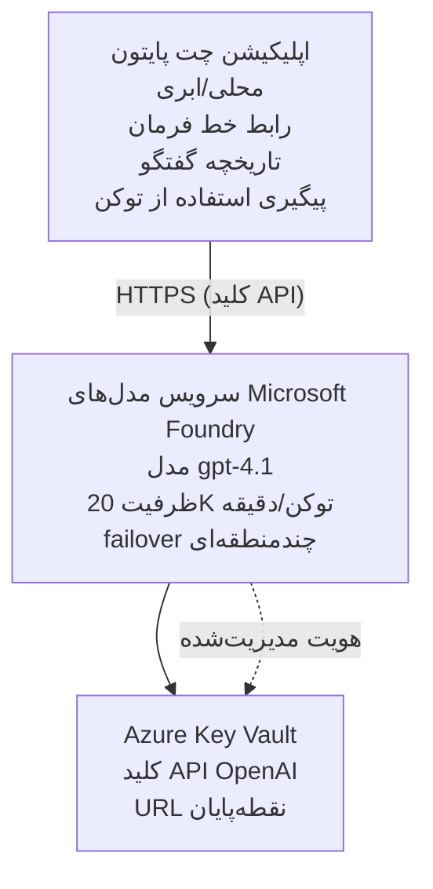

# برنامه چت Microsoft Foundry Models

**مسیر یادگیری:** متوسط ⭐⭐ | **زمان:** 35-45 دقیقه | **هزینه:** $50-200/month

یک برنامه چت کامل Microsoft Foundry Models که با استفاده از Azure Developer CLI (azd) مستقر شده است. این مثال استقرار gpt-4.1، دسترسی امن به API و یک رابط چت ساده را نشان می‌دهد.

## 🎯 آنچه خواهید آموخت

- استقرار سرویس Microsoft Foundry Models با مدل gpt-4.1
- ایمن‌سازی کلیدهای API OpenAI با Key Vault
- ساخت یک رابط چت ساده با Python
- نظارت بر مصرف توکن و هزینه‌ها
- پیاده‌سازی محدودیت نرخ و مدیریت خطا

## 📦 موارد شامل

✅ **Microsoft Foundry Models Service** - استقرار مدل gpt-4.1  
✅ **Python Chat App** - رابط چت ساده خط فرمان  
✅ **Key Vault Integration** - ذخیره امن کلیدهای API  
✅ **ARM Templates** - زیرساخت کامل به‌عنوان کد  
✅ **Cost Monitoring** - ردیابی مصرف توکن  
✅ **Rate Limiting** - جلوگیری از خالی شدن سهمیه  

## معماری



## پیش‌نیازها

### ضروری

- **Azure Developer CLI (azd)** - [راهنمای نصب](https://learn.microsoft.com/azure/developer/azure-developer-cli/install-azd)
- **اشتراک Azure** با دسترسی به OpenAI - [درخواست دسترسی](https://aka.ms/oai/access)
- **Python 3.9+** - [نصب Python](https://www.python.org/downloads/)

### تأیید پیش‌نیازها

```bash
# نسخه azd را بررسی کنید (نیاز به 1.5.0 یا بالاتر)
azd version

# وضعیت ورود به Azure را بررسی کنید
azd auth login

# نسخه پایتون را بررسی کنید
python --version  # یا python3 --version

# دسترسی به OpenAI را بررسی کنید (در پرتال Azure بررسی کنید)
az cognitiveservices account list-skus \
  --kind OpenAI \
  --location eastus
```

> **⚠️ مهم:** سرویس Microsoft Foundry Models نیاز به تأیید درخواست دارد. اگر درخواست نداده‌اید، به [aka.ms/oai/access](https://aka.ms/oai/access) مراجعه کنید. تأیید معمولاً 1-2 روز کاری طول می‌کشد.

## ⏱️ زمان‌بندی استقرار

| Phase | Duration | What Happens |
|-------|----------|--------------|
| Prerequisites check | 2-3 minutes | Verify OpenAI quota availability |
| Deploy infrastructure | 8-12 minutes | Create OpenAI, Key Vault, model deployment |
| Configure application | 2-3 minutes | Set up environment and dependencies |
| **مجموع** | **12-18 دقیقه** | آماده چت با gpt-4.1 |

**توجه:** اولین استقرار OpenAI ممکن است به‌دلیل تهیه مدل زمان بیشتری ببرد.

## شروع سریع

```bash
# به مثال بروید
cd examples/azure-openai-chat

# محیط را مقداردهی اولیه کنید
azd env new myopenai

# همه چیز را مستقر کنید (زیرساخت + پیکربندی)
azd up
# از شما خواسته می‌شود:
# 1. اشتراک Azure را انتخاب کنید
# 2. مکانی را انتخاب کنید که OpenAI در آن در دسترس باشد (مثلاً eastus، eastus2، westus)
# 3. برای استقرار 12 تا 18 دقیقه صبر کنید

# وابستگی‌های پایتون را نصب کنید
pip install -r requirements.txt

# شروع به گفتگو کنید!
python chat.py
```

**خروجی مورد انتظار:**
```
🤖 Microsoft Foundry Models Chat Application
Connected to: gpt-4.1 (eastus)
Type your message (or 'quit' to exit)

You: Hello! Tell me about Microsoft Foundry Models.
Assistant: Microsoft Foundry Models Service provides REST API access to OpenAI's powerful language models including gpt-4.1, GPT-3.5-Turbo, and Embeddings...

[Tokens used: 145 | Estimated cost: $0.0044]
```

## ✅ تأیید استقرار

### گام ۱: بررسی منابع Azure

```bash
# مشاهده منابع مستقر شده
azd show

# خروجی مورد انتظار نشان می‌دهد:
# - سرویس OpenAI: (نام منبع)
# - مخزن کلید: (نام منبع)
# - استقرار: gpt-4.1
# - مکان: eastus (یا منطقه انتخابی شما)
```

### گام ۲: آزمایش OpenAI API

```bash
# دریافت نقطهٔ پایانی و کلید OpenAI
OPENAI_ENDPOINT=$(azd env get-value AZURE_OPENAI_ENDPOINT)
OPENAI_KEY=$(azd env get-value AZURE_OPENAI_API_KEY)

# آزمایش فراخوانی API
curl "$OPENAI_ENDPOINT/openai/deployments/gpt-4.1/chat/completions?api-version=2024-08-01-preview" \
  -H "Content-Type: application/json" \
  -H "api-key: $OPENAI_KEY" \
  -d '{
    "messages": [{"role": "user", "content": "Say hello!"}],
    "max_tokens": 50
  }'
```

**پاسخ مورد انتظار:**
```json
{
  "choices": [
    {
      "message": {
        "role": "assistant",
        "content": "Hello! How can I assist you today?"
      }
    }
  ],
  "usage": {
    "prompt_tokens": 8,
    "completion_tokens": 9,
    "total_tokens": 17
  }
}
```

### گام ۳: تأیید دسترسی به Key Vault

```bash
# فهرست اسرار در Key Vault
KV_NAME=$(azd env get-value AZURE_KEY_VAULT_NAME)

az keyvault secret list \
  --vault-name $KV_NAME \
  --query "[].name" \
  --output table
```

**مقادیر مخفی مورد انتظار:**
- `openai-api-key`
- `openai-endpoint`

**معیارهای موفقیت:**
- ✅ سرویس OpenAI با gpt-4.1 مستقر شده است
- ✅ فراخوان API پاسخ مناسبی برمی‌گرداند
- ✅ مقادیر مخفی در Key Vault ذخیره شده‌اند
- ✅ ردیابی مصرف توکن کار می‌کند

## ساختار پروژه

```
azure-openai-chat/
├── README.md                   ✅ This guide
├── azure.yaml                  ✅ AZD configuration
├── infra/                      ✅ Infrastructure as Code
│   ├── main.bicep             ✅ Main Bicep template
│   ├── main.parameters.json   ✅ Parameters
│   └── openai.bicep           ✅ OpenAI resource definition
├── src/                        ✅ Application code
│   ├── chat.py                ✅ Chat interface
│   ├── config.py              ✅ Configuration loader
│   └── requirements.txt       ✅ Python dependencies
└── .gitignore                  ✅ Git ignore rules
```

## ویژگی‌های برنامه

### رابط چت (`chat.py`)

برنامه چت شامل:

- **تاریخچه مکالمه** - نگهداری زمینه بین پیام‌ها
- **شمارش توکن** - پیگیری مصرف و برآورد هزینه‌ها
- **مدیریت خطا** - مدیریت مؤدبانه محدودیت نرخ و خطاهای API
- **برآورد هزینه** - محاسبه هزینه در زمان واقعی به ازای هر پیام
- **پشتیبانی از استریم** - پاسخ‌های استریم اختیاری

### دستورات

در حین چت، می‌توانید از:
- `quit` or `exit` - پایان جلسه
- `clear` - پاک کردن تاریخچه مکالمه
- `tokens` - نمایش مجموع مصرف توکن‌ها
- `cost` - نمایش هزینه کل تخمینی

### پیکربندی (`config.py`)

پیکربندی را از متغیرهای محیطی بارگذاری می‌کند:
```python
AZURE_OPENAI_ENDPOINT  # از Key Vault
AZURE_OPENAI_API_KEY   # از Key Vault
AZURE_OPENAI_MODEL     # پیش‌فرض: gpt-4.1
AZURE_OPENAI_MAX_TOKENS # پیش‌فرض: ۸۰۰
```

## نمونه‌های استفاده

### چت پایه

```bash
python chat.py
```

### چت با مدل سفارشی

```bash
export AZURE_OPENAI_MODEL=gpt-35-turbo
python chat.py
```

### چت با استریم

```bash
python chat.py --stream
```

### مثال مکالمه

```
You: Explain Microsoft Foundry Models Service in 3 sentences.
Assistant: Microsoft Foundry Models Service is Microsoft Azure's cloud platform offering 
that provides access to OpenAI's powerful language models. It enables developers 
to integrate capabilities like gpt-4.1 into their applications with enterprise-grade 
security and compliance. The service includes features for content filtering, 
abuse monitoring, and responsible AI practices.

[Tokens used: 89 | Estimated cost: $0.0027]

You: What models are available?
Assistant: Microsoft Foundry Models Service offers several model families including gpt-4.1 
(most capable), GPT-3.5-Turbo (faster and cost-effective), and Embeddings models 
for vector search. Each model has different capabilities, pricing, and token limits.

[Tokens used: 67 | Estimated cost: $0.0020]

Total session: 156 tokens | $0.0047
```

## مدیریت هزینه

### قیمت‌گذاری توکن (gpt-4.1)

| Model | Input (per 1K tokens) | Output (per 1K tokens) |
|-------|----------------------|------------------------|
| gpt-4.1 | $0.03 | $0.06 |
| GPT-3.5-Turbo | $0.0015 | $0.002 |

### هزینه‌های تخمینی ماهانه

براساس الگوهای استفاده:

| سطح استفاده | پیام‌ها/روز | توکن‌ها/روز | هزینه ماهانه |
|-------------|--------------|------------|--------------|
| **سبک** | 20 messages | 3,000 tokens | $3-5 |
| **متوسط** | 100 messages | 15,000 tokens | $15-25 |
| **سنگین** | 500 messages | 75,000 tokens | $75-125 |

**هزینه زیرساخت پایه:** $1-2/month (Key Vault + محاسبات حداقلی)

### نکات بهینه‌سازی هزینه

```bash
# 1. برای کارهای ساده‌تر از GPT-3.5-Turbo استفاده کنید (۲۰ برابر ارزان‌تر)
export AZURE_OPENAI_MODEL=gpt-35-turbo

# 2. برای پاسخ‌های کوتاه‌تر، حداکثر توکن‌ها را کاهش دهید
export AZURE_OPENAI_MAX_TOKENS=400

# 3. مصرف توکن‌ها را پایش کنید
python chat.py --show-tokens

# 4. هشدارهای بودجه را تنظیم کنید
az consumption budget create \
  --budget-name "openai-budget" \
  --amount 50 \
  --time-grain Monthly
```

## نظارت

### مشاهده مصرف توکن

```bash
# در پورتال Azure:
# منبع OpenAI → متریک‌ها → انتخاب "Token Transaction"

# یا از طریق Azure CLI:
az monitor metrics list \
  --resource $(azd env get-value AZURE_OPENAI_RESOURCE_ID) \
  --metric "TokenTransaction" \
  --start-time $(date -u -d '1 hour ago' '+%Y-%m-%dT%H:%M:%S') \
  --interval PT1M
```

### مشاهده لاگ‌های API

```bash
# پخش لاگ‌های تشخیصی
az monitor diagnostic-settings create \
  --resource $(azd env get-value AZURE_OPENAI_RESOURCE_ID) \
  --name openai-logs \
  --logs '[{"category": "Audit", "enabled": true}]' \
  --workspace $(azd env get-value LOG_ANALYTICS_WORKSPACE_ID)

# لاگ‌های پرس‌وجو
az monitor log-analytics query \
  --workspace $(azd env get-value LOG_ANALYTICS_WORKSPACE_ID) \
  --analytics-query "AzureDiagnostics | where Category == 'Audit' | top 10 by TimeGenerated"
```

## رفع اشکال

### مشکل: "Access Denied" Error

**نشانه‌ها:** 403 Forbidden هنگام فراخوانی API

**راه‌حل‌ها:**
```bash
# 1. تأیید کنید که دسترسی به OpenAI مجاز است
az cognitiveservices account show \
  --name $(azd env get-value AZURE_OPENAI_NAME) \
  --resource-group $(azd env get-value AZURE_RESOURCE_GROUP)

# 2. بررسی کنید که کلید API صحیح است
azd env get-value AZURE_OPENAI_API_KEY

# 3. فرمت URL نقطه پایانی را بررسی کنید
azd env get-value AZURE_OPENAI_ENDPOINT
# باید باشد: https://[name].openai.azure.com/
```

### مشکل: "Rate Limit Exceeded"

**نشانه‌ها:** 429 Too Many Requests

**راه‌حل‌ها:**
```bash
# 1. بررسی سهمیه فعلی
az cognitiveservices account deployment show \
  --name $(azd env get-value AZURE_OPENAI_NAME) \
  --resource-group $(azd env get-value AZURE_RESOURCE_GROUP) \
  --deployment-name gpt-4.1

# 2. درخواست افزایش سهمیه (در صورت نیاز)
# به پورتال Azure → منبع OpenAI → سهمیه‌ها → درخواست افزایش

# 3. پیاده‌سازی منطق تلاش مجدد (قبلاً در chat.py موجود است)
# برنامه به‌طور خودکار تلاش‌های مجدد را با عقب‌نشینی نمایی انجام می‌دهد
```

### مشکل: "Model Not Found"

**نشانه‌ها:** 404 error for deployment

**راه‌حل‌ها:**
```bash
# 1. فهرست استقرارهای موجود
az cognitiveservices account deployment list \
  --name $(azd env get-value AZURE_OPENAI_NAME) \
  --resource-group $(azd env get-value AZURE_RESOURCE_GROUP)

# 2. نام مدل را در محیط بررسی کنید
echo $AZURE_OPENAI_MODEL

# 3. نام استقرار را به نام صحیح به‌روزرسانی کنید
export AZURE_OPENAI_MODEL=gpt-4.1  # یا gpt-35-turbo
```

### مشکل: تأخیر زیاد

**نشانه‌ها:** زمان پاسخ‌دهی کند (>5 ثانیه)

**راه‌حل‌ها:**
```bash
# ۱. تأخیر منطقه‌ای را بررسی کنید
# آن را در نزدیک‌ترین منطقه به کاربران مستقر کنید

# ۲. برای پاسخ‌های سریع‌تر max_tokens را کاهش دهید
export AZURE_OPENAI_MAX_TOKENS=400

# ۳. برای تجربه کاربری بهتر از استریمینگ استفاده کنید
python chat.py --stream
```

## بهترین شیوه‌های امنیتی

### 1. محافظت از کلیدهای API

```bash
# کلیدها را هرگز در کنترل نسخه ثبت نکنید
# از Key Vault استفاده کنید (قبلاً پیکربندی شده است)

# کلیدها را به‌طور منظم بچرخانید
az cognitiveservices account keys regenerate \
  --name $(azd env get-value AZURE_OPENAI_NAME) \
  --resource-group $(azd env get-value AZURE_RESOURCE_GROUP) \
  --key-name key1
```

### 2. پیاده‌سازی فیلتر محتوا

```python
# مدل‌های Microsoft Foundry دارای فیلتر محتوای داخلی هستند
# پیکربندی در پرتال Azure:
# منبع OpenAI → فیلترهای محتوا → ایجاد فیلتر سفارشی

# دسته‌بندی‌ها: نفرت، جنسی، خشونت، خودآسیبی
# سطوح: فیلترینگ پایین، متوسط، بالا
```

### 3. استفاده از Managed Identity (در محیط تولید)

```bash
# برای استقرار در محیط تولید، از هویت مدیریت‌شده استفاده کنید
# به‌جای کلیدهای API (نیازمند میزبانی برنامه روی Azure است)

# فایل infra/openai.bicep را به‌روزرسانی کنید تا شامل موارد زیر شود:
# identity: { type: 'SystemAssigned' }
```

## توسعه

### اجرای محلی

```bash
# وابستگی‌ها را نصب کنید
pip install -r src/requirements.txt

# متغیرهای محیطی را تنظیم کنید
export AZURE_OPENAI_ENDPOINT="https://[name].openai.azure.com/"
export AZURE_OPENAI_API_KEY="your-api-key"
export AZURE_OPENAI_MODEL="gpt-4.1"

# برنامه را اجرا کنید
python src/chat.py
```

### اجرای تست‌ها

```bash
# وابستگی‌های تست را نصب کنید
pip install pytest pytest-cov

# تست‌ها را اجرا کنید
pytest tests/ -v

# با پوشش کد
pytest tests/ --cov=src --cov-report=html
```

### به‌روزرسانی استقرار مدل

```bash
# استقرار نسخه متفاوت مدل
az cognitiveservices account deployment create \
  --name $(azd env get-value AZURE_OPENAI_NAME) \
  --resource-group $(azd env get-value AZURE_RESOURCE_GROUP) \
  --deployment-name gpt-35-turbo \
  --model-name gpt-35-turbo \
  --model-version "0613" \
  --model-format OpenAI \
  --sku-capacity 20 \
  --sku-name "Standard"
```

## پاک‌سازی

```bash
# تمام منابع Azure را حذف کنید
azd down --force --purge

# این موارد را حذف می‌کند:
# - سرویس OpenAI
# - مخزن کلید (با حذف نرم ۹۰ روزه)
# - گروه منابع
# - همه استقرارها و پیکربندی‌ها
```

## گام‌های بعدی

### گسترش این مثال

1. **افزودن رابط وب** - ساخت فرانت‌اند با React/Vue
   ```bash
   # افزودن سرویس فرانت‌اند به azure.yaml
   # استقرار در Azure Static Web Apps
   ```

2. **پیاده‌سازی RAG** - افزودن جستجوی اسناد با Azure AI Search
   ```python
   # یکپارچه‌سازی Azure AI Search
   # بارگذاری اسناد و ایجاد شاخص برداری
   ```

3. **افزودن فراخوانی توابع** - فعال‌سازی استفاده از ابزارها
   ```python
   # توابع را در chat.py تعریف کنید
   # به gpt-4.1 اجازه دهید تا APIهای خارجی را فراخوانی کند
   ```

4. **پشتیبانی چندمدلی** - استقرار چندین مدل
   ```bash
   # افزودن مدل‌های gpt-35-turbo و مدل‌های امبدینگ
   # پیاده‌سازی منطق مسیر‌یابی مدل
   ```

### مثال‌های مرتبط

- **[چندعامل خرده‌فروشی](../retail-scenario.md)** - معماری چندعامل پیشرفته
- **[برنامه پایگاه‌داده](../../../../examples/database-app)** - افزودن ذخیره‌سازی پایدار
- **[Container Apps](../../../../examples/container-app)** - استقرار به‌عنوان سرویس کانتینری

### منابع یادگیری

- 📚 [دوره AZD برای مبتدیان](../../README.md) - صفحه اصلی دوره
- 📚 [مستندات Microsoft Foundry Models](https://learn.microsoft.com/azure/ai-services/openai/) - مستندات رسمی
- 📚 [مرجع API OpenAI](https://platform.openai.com/docs/api-reference) - جزئیات API
- 📚 [هوش مصنوعی مسئولیت‌پذیر](https://www.microsoft.com/ai/responsible-ai) - بهترین شیوه‌ها

## منابع اضافی

### مستندات
- **[Microsoft Foundry Models Service](https://learn.microsoft.com/azure/ai-services/openai/)** - راهنمای کامل
- **[gpt-4.1 Models](https://learn.microsoft.com/azure/ai-services/openai/concepts/models)** - قابلیت‌های مدل
- **[Content Filtering](https://learn.microsoft.com/azure/ai-services/openai/concepts/content-filter)** - ویژگی‌های ایمنی
- **[Azure Developer CLI](https://learn.microsoft.com/azure/developer/azure-developer-cli/)** - مرجع azd

### آموزش‌ها
- **[OpenAI Quickstart](https://learn.microsoft.com/azure/ai-services/openai/quickstart)** - اولین استقرار
- **[Chat Completions](https://learn.microsoft.com/azure/ai-services/openai/how-to/chatgpt)** - ساخت برنامه‌های چت
- **[Function Calling](https://learn.microsoft.com/azure/ai-services/openai/how-to/function-calling)** - ویژگی‌های پیشرفته

### ابزارها
- **[Microsoft Foundry Models Studio](https://oai.azure.com/)** - محیط آزمایشی وب
- **[Prompt Engineering Guide](https://platform.openai.com/docs/guides/prompt-engineering)** - نوشتن پرامپت‌های بهتر
- **[Token Calculator](https://platform.openai.com/tokenizer)** - برآورد مصرف توکن

### جامعه
- **[Azure AI Discord](https://discord.gg/azure)** - دریافت کمک از جامعه
- **[GitHub Discussions](https://github.com/Azure-Samples/openai/discussions)** - انجمن پرسش و پاسخ
- **[Azure Blog](https://azure.microsoft.com/blog/tag/azure-openai-service/)** - آخرین به‌روزرسانی‌ها

---

**🎉 تبریک!** شما Microsoft Foundry Models را مستقر کرده‌اید و یک برنامه چت عملی ساخته‌اید. شروع به کاوش قابلیت‌های gpt-4.1 کنید و با پرامپت‌ها و موارد استفاده مختلف آزمایش نمایید.

**سؤالی دارید؟** [یک issue باز کنید](https://github.com/microsoft/AZD-for-beginners/issues) یا بخش [سؤالات متداول](../../resources/faq.md) را بررسی کنید

**هشدار هزینه:** به یاد داشته باشید پس از اتمام تست‌ها دستور `azd down` را اجرا کنید تا از هزینه‌های مداوم جلوگیری شود (~$50-100/month برای استفاده فعال).

---

<!-- CO-OP TRANSLATOR DISCLAIMER START -->
**سلب مسئولیت**:
این سند با استفاده از سرویس ترجمه هوش مصنوعی [Co-op Translator](https://github.com/Azure/co-op-translator) ترجمه شده است. در حالی که ما در تلاش برای دقت هستیم، لطفاً توجه داشته باشید که ترجمه‌های خودکار ممکن است شامل خطاها یا نادرستی‌هایی باشند. سند اصلی به زبان مادری خود باید به عنوان منبع معتبر در نظر گرفته شود. برای اطلاعات حیاتی، ترجمه حرفه‌ای انسانی توصیه می‌شود. ما در قبال هرگونه سوء تفاهم یا برداشت نادرست ناشی از استفاده از این ترجمه مسئولیتی نداریم.
<!-- CO-OP TRANSLATOR DISCLAIMER END -->