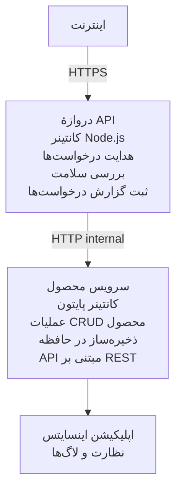

# معماری میکروسرویس‌ها - مثال Container App

⏱️ **زمان تخمینی**: 25-35 دقیقه | 💰 **هزینه تخمینی**: ~$50-100/ماه | ⭐ **سطح دشواری**: پیشرفته

یک معماری میکروسرویس ساده‌سازی‌شده اما کاربردی که به Azure Container Apps با استفاده از AZD CLI مستقر شده است. این مثال ارتباط سرویس با سرویس، ارکستراسیون کانتینر و نظارت را با یک تنظیم عملی با ۲ سرویس نشان می‌دهد.

> **📚 روش یادگیری**: این مثال با یک معماری حداقلی ۲ سرویسی (API Gateway + سرویس بک‌اند) شروع می‌کند که می‌توانید آن را عملاً مستقر کنید و از آن یاد بگیرید. پس از تسلط بر این پایه، راهنمایی‌هایی برای گسترش به یک اکوسیستم کامل میکروسرویس‌ها ارائه می‌دهیم.

## چه چیزهایی می‌آموزید

با تکمیل این مثال، شما:
- چندین کانتینر را به Azure Container Apps مستقر خواهید کرد
- ارتباط سرویس‌به‌سرویس را با شبکه داخلی پیاده‌سازی خواهید کرد
- مقیاس‌پذیری مبتنی بر محیط و بررسی سلامت را پیکربندی خواهید کرد
- برنامه‌های توزیع‌شده را با Application Insights نظارت خواهید کرد
- الگوها و بهترین شیوه‌های استقرار میکروسرویس‌ها را درک خواهید کرد
- یاد خواهید گرفت چگونه به‌صورت تدریجی از معماری ساده به معماری پیچیده گسترش دهید

## معماری

### فاز 1: چیزی که می‌سازیم (شامل این مثال)


**چرا ساده شروع کنیم؟**
- ✅ استقرار و درک سریع (25-35 دقیقه)
- ✅ یادگیری الگوهای اصلی میکروسرویس بدون پیچیدگی
- ✅ کد عملی که می‌توانید آن را تغییر داده و آزمایش کنید
- ✅ هزینه کمتر برای یادگیری (~$50-100/ماه در مقابل $300-1400/ماه)
- ✅ ایجاد اعتماد به نفس قبل از افزودن پایگاه‌داده‌ها و صف‌های پیام

**تشبیه**: تصور کنید این مانند یاد گرفتن رانندگی است. با یک پارکینگ خالی شروع می‌کنید (۲ سرویس)، اصول را یاد می‌گیرید، سپس به ترافیک شهری (۵+ سرویس با پایگاه‌داده‌ها) می‌روید.

### فاز 2: گسترش آینده (معماری مرجع)

پس از تسلط بر معماری ۲ سرویسی، می‌توانید گسترش دهید به:

```
Full Architecture (Not Included - For Reference)
├── API Gateway (✅ Included)
├── Product Service (✅ Included)
├── Order Service (🔜 Add next)
├── User Service (🔜 Add next)
├── Notification Service (🔜 Add last)
├── Azure Service Bus (🔜 For async communication)
├── Cosmos DB (🔜 For product persistence)
├── Azure SQL (🔜 For order management)
└── Azure Storage (🔜 For file storage)
```

به بخش "راهنمای گسترش" در انتها برای دستورالعمل مرحله‌به‌مرحله مراجعه کنید.

## ویژگی‌های شامل شده

✅ **کشف سرویس (Service Discovery)**: کشف خودکار مبتنی بر DNS بین کانتینرها  
✅ **تعادل بار**: تعادل بار داخلی بین نمونه‌ها  
✅ **مقیاس خودکار**: مقیاس مستقل برای هر سرویس بر اساس درخواست‌های HTTP  
✅ **نظارت سلامت**: پروب‌های liveness و readiness برای هر دو سرویس  
✅ **ثبت توزیع‌شده**: ثبت متمرکز با Application Insights  
✅ **شبکه داخلی**: ارتباط امن سرویس‌به‌سرویس  
✅ **ارکستراسیون کانتینر**: استقرار و مقیاس‌دهی خودکار  
✅ **به‌روزرسانی بدون زمان توقف**: به‌روزرسانی‌های رولینگ با مدیریت revision

## پیش‌نیازها

### ابزارهای مورد نیاز

قبل از شروع، بررسی کنید که این ابزارها را نصب دارید:

1. **[Azure Developer CLI (azd)](https://learn.microsoft.com/azure/developer/azure-developer-cli/install-azd)** (نسخه 1.0.0 یا بالاتر)
   ```bash
   azd version
   # خروجی مورد انتظار: نسخهٔ azd 1.0.0 یا بالاتر
   ```

2. **[Azure CLI](https://learn.microsoft.com/cli/azure/install-azure-cli)** (نسخه 2.50.0 یا بالاتر)
   ```bash
   az --version
   # خروجی مورد انتظار: azure-cli 2.50.0 یا بالاتر
   ```

3. **[Docker](https://www.docker.com/get-started)** (برای توسعه/تست محلی - اختیاری)
   ```bash
   docker --version
   # خروجی مورد انتظار: نسخه داکر ۲۰٫۱۰ یا بالاتر
   ```

### نیازمندی‌های Azure

- یک **اشتراک Azure** فعال ([حساب رایگان بسازید](https://azure.microsoft.com/free/))
- مجوز برای ایجاد منابع در اشتراک شما
- نقش **Contributor** در اشتراک یا گروه منابع

### پیش‌نیازهای دانشی

این یک مثال در سطح **پیشرفته** است. شما باید:
- نمونه [Simple Flask API example](../../../../../examples/container-app/simple-flask-api) را تکمیل کرده باشید
- درک پایه‌ای از معماری میکروسرویس‌ها داشته باشید
- آشنایی با REST APIها و HTTP
- درک مفاهیم کانتینرها

**جدید با Container Apps؟** ابتدا با نمونه [Simple Flask API example](../../../../../examples/container-app/simple-flask-api) شروع کنید تا اصول را بیاموزید.

## شروع سریع (مرحله‌به‌مرحله)

### مرحله 1: کلون و ورود

```bash
git clone https://github.com/microsoft/AZD-for-beginners.git
cd AZD-for-beginners/examples/container-app/microservices
```

**✓ بررسی موفقیت**: مطمئن شوید که `azure.yaml` را می‌بینید:
```bash
ls
# انتظار می‌رود: README.md، azure.yaml، infra/، src/
```

### مرحله 2: احراز هویت با Azure

```bash
azd auth login
```

این مرورگر شما را برای احراز هویت Azure باز می‌کند. با اطلاعات کاربری Azure خود وارد شوید.

**✓ بررسی موفقیت**: باید ببینید:
```
Logged in to Azure.
```

### مرحله 3: مقداردهی اولیه محیط

```bash
azd init
```

**ورودی‌هایی که مشاهده خواهید کرد**:
- **نام محیط**: یک نام کوتاه وارد کنید (مثلاً `microservices-dev`)
- **اشتراک Azure**: اشتراک خود را انتخاب کنید
- **منطقه Azure**: یک منطقه انتخاب کنید (مثلاً `eastus`، `westeurope`)

**✓ بررسی موفقیت**: باید ببینید:
```
SUCCESS: New project initialized!
```

### مرحله 4: استقرار زیرساخت و سرویس‌ها

```bash
azd up
```

**چه اتفاقی می‌افتد** (۸-۱۲ دقیقه طول می‌کشد):
1. ایجاد محیط Container Apps
2. ایجاد Application Insights برای نظارت
3. ساخت کانتینر API Gateway (Node.js)
4. ساخت کانتینر Product Service (Python)
5. استقرار هر دو کانتینر در Azure
6. پیکربندی شبکه و بررسی‌های سلامت
7. راه‌اندازی نظارت و ثبت لاگ

**✓ بررسی موفقیت**: باید ببینید:
```
SUCCESS: Your application was deployed to Azure in X minutes Y seconds.
Endpoint: https://api-gateway-<unique-id>.azurecontainerapps.io
```

**⏱️ زمان**: 8-12 دقیقه

### مرحله 5: آزمایش استقرار

```bash
# نقطهٔ پایانی دروازه را دریافت کنید
GATEWAY_URL=$(azd env get-values | grep API_GATEWAY_URL | cut -d '=' -f2 | tr -d '"')

# بررسی سلامت دروازهٔ API
curl $GATEWAY_URL/health

# خروجی مورد انتظار:
# {"وضعیت":"سالم","سرویس":"api-gateway","زمان":"2025-11-19T10:30:00Z"}
```

**آزمایش سرویس محصول از طریق API Gateway**:
```bash
# لیست محصولات
curl $GATEWAY_URL/api/products

# خروجی مورد انتظار:
# [
#   {"id":1,"name":"لپ‌تاپ","price":999.99,"stock":50},
#   {"id":2,"name":"ماوس","price":29.99,"stock":200},
#   {"id":3,"name":"کیبورد","price":79.99,"stock":150}
# ]
```

**✓ بررسی موفقیت**: هر دو endpoint داده JSON را بدون خطا برمی‌گردانند.

---

**🎉 تبریک!** شما یک معماری میکروسرویس را در Azure مستقر کرده‌اید!

## ساختار پروژه

تمام فایل‌های پیاده‌سازی شامل شده‌اند—این یک مثال کامل و عملی است:

```
microservices/
│
├── README.md                         # This file
├── azure.yaml                        # AZD configuration
├── .gitignore                        # Git ignore patterns
│
├── infra/                           # Infrastructure as Code (Bicep)
│   ├── main.bicep                   # Main orchestration
│   ├── abbreviations.json           # Naming conventions
│   ├── core/                        # Shared infrastructure
│   │   ├── container-apps-environment.bicep  # Container environment + registry
│   │   └── monitor.bicep            # Application Insights + Log Analytics
│   └── app/                         # Service definitions
│       ├── api-gateway.bicep        # API Gateway container app
│       └── product-service.bicep    # Product Service container app
│
└── src/                             # Application source code
    ├── api-gateway/                 # Node.js API Gateway
    │   ├── app.js                   # Express server with routing
    │   ├── package.json             # Node dependencies
    │   └── Dockerfile               # Container definition
    └── product-service/             # Python Product Service
        ├── main.py                  # Flask API with product data
        ├── requirements.txt         # Python dependencies
        └── Dockerfile               # Container definition
```

**هر جزء چه کاری انجام می‌دهد:**

**Infrastructure (infra/)**:
- `main.bicep`: هماهنگ‌کننده تمام منابع Azure و وابستگی‌های آن‌ها
- `core/container-apps-environment.bicep`: ایجاد محیط Container Apps و Azure Container Registry
- `core/monitor.bicep`: راه‌اندازی Application Insights برای ثبت لاگ توزیع‌شده
- `app/*.bicep`: تعریف‌های هر برنامه کانتینری با مقیاس‌دهی و پروب‌های سلامت

**API Gateway (src/api-gateway/)**:
- سرویس روبه‌عموم که درخواست‌ها را به سرویس‌های بک‌اند هدایت می‌کند
- پیاده‌سازی ثبت لاگ، مدیریت خطا و فوروارد درخواست‌ها
- نمایش ارتباط HTTP سرویس‌به‌سرویس

**Product Service (src/product-service/)**:
- سرویس داخلی با فهرست محصولات (در حافظه برای سادگی)
- API REST با پروب‌های سلامت
- نمونه‌ای از الگوی میکروسرویس بک‌اند

## نمای کلی سرویس‌ها

### API Gateway (Node.js/Express)

**پورت**: 8080  
**دسترسی**: عمومی (ورودی خارجی)  
**هدف**: هدایت درخواست‌های ورودی به سرویس‌های بک‌اند مربوطه  

**مسیرها**:
- `GET /` - اطلاعات سرویس
- `GET /health` - نقطه بررسی سلامت
- `GET /api/products` - فوروارد به سرویس محصول (لیست همه)
- `GET /api/products/:id` - فوروارد به سرویس محصول (دریافت بر اساس شناسه)

**ویژگی‌های کلیدی**:
- مسیریابی درخواست با axios
- ثبت لاگ متمرکز
- مدیریت خطا و تایم‌اوت
- کشف سرویس از طریق متغیرهای محیطی
- ادغام با Application Insights

**نمونه کد برجسته** (`src/api-gateway/app.js`):
```javascript
// ارتباط داخلی سرویس
app.get('/api/products', async (req, res) => {
  const response = await axios.get(`${PRODUCT_SERVICE_URL}/products`);
  res.json(response.data);
});
```

### Product Service (Python/Flask)

**پورت**: 8000  
**دسترسی**: فقط داخلی (بدون ورودی خارجی)  
**هدف**: مدیریت فهرست محصولات با داده در حافظه  

**مسیرها**:
- `GET /` - اطلاعات سرویس
- `GET /health` - نقطه بررسی سلامت
- `GET /products` - لیست همه محصولات
- `GET /products/<id>` - دریافت محصول بر اساس شناسه

**ویژگی‌های کلیدی**:
- API RESTful با Flask
- ذخیره‌سازی محصولات در حافظه (ساده، بدون نیاز به پایگاه‌داده)
- نظارت سلامت با پروب‌ها
- ثبت لاگ ساختاریافته
- ادغام با Application Insights

**مدل داده**:
```python
{
  "id": 1,
  "name": "Laptop",
  "description": "High-performance laptop",
  "price": 999.99,
  "stock": 50
}
```

**چرا فقط داخلی؟**
سرویس محصول به‌صورت عمومی در دسترس نیست. تمام درخواست‌ها باید از طریق API Gateway عبور کنند که مزایای زیر را فراهم می‌کند:
- امنیت: نقطه دسترسی کنترل‌شده
- انعطاف‌پذیری: می‌توان بک‌اند را بدون تاثیر بر کلاینت‌ها تغییر داد
- نظارت: ثبت متمرکز درخواست‌ها

## درک ارتباط سرویس‌ها

### چگونه سرویس‌ها با هم صحبت می‌کنند

در این مثال، API Gateway با سرویس محصول از طریق **فراخوانی‌های HTTP داخلی** ارتباط برقرار می‌کند:

```javascript
// درگاه API (src/api-gateway/app.js)
const PRODUCT_SERVICE_URL = process.env.PRODUCT_SERVICE_URL;

// ارسال درخواست HTTP داخلی
const response = await axios.get(`${PRODUCT_SERVICE_URL}/products`);
```

**نکات کلیدی**:

1. **کشف مبتنی بر DNS**: Container Apps به‌صورت خودکار DNS برای سرویس‌های داخلی فراهم می‌کند
   - FQDN سرویس محصول: `product-service.internal.<environment>.azurecontainerapps.io`
   - ساده‌شده به: `http://product-service` (Container Apps آن را حل می‌کند)

2. **عدم افشای عمومی**: سرویس محصول در Bicep دارای `external: false` است
   - تنها در داخل محیط Container Apps در دسترس است
   - از اینترنت قابل دسترسی نیست

3. **متغیرهای محیطی**: آدرس سرویس‌ها در زمان استقرار تزریق می‌شوند
   - Bicep FQDN داخلی را به دروازه منتقل می‌کند
   - آدرس‌ها در کد برنامه به‌صورت هاردکد وجود ندارند

**تشبیه**: این مثل اتاق‌های یک دفتر است. API Gateway میز پذیرش (روبرو با عموم) است و سرویس محصول یک اتاق دفتر (فقط داخلی). بازدیدکنندگان باید از پذیرش عبور کنند تا به هر اتاق برسند.

## گزینه‌های استقرار

### استقرار کامل (توصیه‌شده)

```bash
# زیرساخت و هر دو سرویس را مستقر کنید
azd up
```

این موارد را مستقر می‌کند:
1. محیط Container Apps
2. Application Insights
3. Container Registry
4. کانتینر API Gateway
5. کانتینر Product Service

**زمان**: 8-12 دقیقه

### استقرار سرویس فردی

```bash
# فقط یک سرویس را مستقر کنید (پس از اجرای اولیه azd up)
azd deploy api-gateway

# یا سرویس محصول را مستقر کنید
azd deploy product-service
```

**مورد استفاده**: وقتی کد یک سرویس را به‌روز کرده‌اید و می‌خواهید تنها آن سرویس را مجدداً مستقر کنید.

### به‌روزرسانی پیکربندی

```bash
# پارامترهای مقیاس‌بندی را تغییر دهید
azd env set GATEWAY_MAX_REPLICAS 30

# با پیکربندی جدید مجدداً مستقر کنید
azd up
```

## پیکربندی

### پیکربندی مقیاس‌پذیری

هر دو سرویس در فایل‌های Bicep خود با مقیاس خودکار مبتنی بر HTTP پیکربندی شده‌اند:

**API Gateway**:
- حداقل نسخه‌ها: 2 (همیشه حداقل ۲ برای دسترسی)
- حداکثر نسخه‌ها: 20
- تریگر مقیاس: 50 درخواست همزمان به ازای هر نسخه

**Product Service**:
- حداقل نسخه‌ها: 1 (در صورت نیاز می‌تواند به صفر مقیاس کند)
- حداکثر نسخه‌ها: 10
- تریگر مقیاس: 100 درخواست همزمان به ازای هر نسخه

**سفارشی‌سازی مقیاس** (در `infra/app/*.bicep`):
```bicep
scale: {
  minReplicas: 1
  maxReplicas: 10
  rules: [
    {
      name: 'http-scale-rule'
      http: {
        metadata: {
          concurrentRequests: '100'  // Adjust this
        }
      }
    }
  ]
}
```

### تخصیص منابع

**API Gateway**:
- CPU: 1.0 vCPU
- حافظه: 2 GiB
- دلیل: مدیریت تمام ترافیک خارجی

**Product Service**:
- CPU: 0.5 vCPU
- حافظه: 1 GiB
- دلیل: عملیات سبک مبتنی بر حافظه

### بررسی‌های سلامت

هر دو سرویس شامل پروب‌های liveness و readiness هستند:

```bicep
probes: [
  {
    type: 'Liveness'
    httpGet: {
      path: '/health'
      port: 8080
    }
    initialDelaySeconds: 10
    periodSeconds: 30
  }
  {
    type: 'Readiness'
    httpGet: {
      path: '/health'
      port: 8080
    }
    initialDelaySeconds: 5
    periodSeconds: 10
  }
]
```

**این به چه معناست**:
- **Liveness**: اگر بررسی سلامت ناموفق باشد، Container Apps کانتینر را ری‌استارت می‌کند
- **Readiness**: اگر آماده نباشد، Container Apps ترافیک را به آن نسخه هدایت نمی‌کند


## نظارت و قابلیت مشاهده

### مشاهده لاگ‌های سرویس

```bash
# لاگ‌ها را با azd monitor مشاهده کنید
azd monitor --logs

# یا برای Container Apps خاص از Azure CLI استفاده کنید:
# لاگ‌ها را از API Gateway استریم کنید
az containerapp logs show --name api-gateway --resource-group $RG_NAME --follow

# لاگ‌های اخیر سرویس محصول را مشاهده کنید
az containerapp logs show --name product-service --resource-group $RG_NAME --tail 100
```

**خروجی مورد انتظار**:
```
[api-gateway] API Gateway listening on port 8080
[api-gateway] Product Service URL: http://product-service
[api-gateway] GET /api/products 200 - 45ms
[product-service] Retrieved 5 products
```

### کوئری‌های Application Insights

به Application Insights در پورتال Azure دسترسی پیدا کنید، سپس این کوئری‌ها را اجرا کنید:

**پیدا کردن درخواست‌های کند**:
```kusto
requests
| where timestamp > ago(1h)
| where duration > 1000  // Requests taking >1 second
| summarize count() by name, cloud_RoleName
| order by count_ desc
```

**ردیابی فراخوانی‌های سرویس‌به‌سرویس**:
```kusto
dependencies
| where timestamp > ago(1h)
| where type == "Http"
| project timestamp, name, target, duration, success
| order by timestamp desc
```

**نرخ خطا بر اساس سرویس**:
```kusto
exceptions
| where timestamp > ago(24h)
| summarize errorCount = count() by cloud_RoleName, type
| order by errorCount desc
```

**حجم درخواست‌ها در طول زمان**:
```kusto
requests
| where timestamp > ago(1h)
| summarize requestCount = count() by bin(timestamp, 5m), cloud_RoleName
| render timechart
```

### دسترسی به داشبورد نظارت

```bash
# دریافت جزئیات Application Insights
azd env get-values | grep APPLICATIONINSIGHTS

# باز کردن بخش مانیتورینگ در پورتال Azure
az monitor app-insights component show \
  --app $(azd env get-values | grep APPLICATIONINSIGHTS_CONNECTION_STRING | cut -d '=' -f2) \
  --resource-group $(azd env get-values | grep AZURE_RESOURCE_GROUP | cut -d '=' -f2) \
  --query "appId" -o tsv
```

### متریک‌های زنده

1. به Application Insights در پورتال Azure بروید
2. روی "Live Metrics" کلیک کنید
3. درخواست‌ها، شکست‌ها و عملکرد را در زمان واقعی ببینید
4. تست با اجرای: `curl $(azd env get-values | grep API_GATEWAY_URL | cut -d '=' -f2 | tr -d '"')/api/products`

## تمرین‌های عملی

[توجه: به تمرین‌های کامل بالا در بخش "تمرین‌های عملی" برای دستورالعمل‌های مرحله‌به‌مرحله شامل تایید استقرار، تغییر داده، تست‌های autoscaling، مدیریت خطا و افزودن سرویس سوم مراجعه کنید.]

## تحلیل هزینه

### هزینه‌های ماهانه تخمینی (برای این مثال ۲ سرویس)

| منبع | پیکربندی | هزینهٔ تخمینی |
|----------|--------------|----------------|
| API Gateway | 2-20 نسخه، 1 vCPU، 2GB RAM | $30-150 |
| Product Service | 1-10 نسخه، 0.5 vCPU، 1GB RAM | $15-75 |
| Container Registry | Basic tier | $5 |
| Application Insights | 1-2 GB/month | $5-10 |
| Log Analytics | 1 GB/month | $3 |
| **مجموع** | | **$58-243/month** |

**شکست هزینه بر اساس استفاده**:
- **ترافیک سبک** (تست/یادگیری): ~ $60/ماه
- **ترافیک متوسط** (تولید کوچک): ~ $120/ماه
- **ترافیک سنگین** (دوران اوج): ~ $240/ماه

### نکات بهینه‌سازی هزینه

1. **مقیاس تا صفر برای توسعه**:
   ```bicep
   scale: {
     minReplicas: 0  // Save $30-40/month when not in use
     maxReplicas: 10
   }
   ```

2. **استفاده از Consumption Plan برای Cosmos DB** (وقتی آن را اضافه می‌کنید):
   - فقط برای آنچه استفاده می‌کنید پرداخت کنید
   - هیچ هزینه حداقلی ندارد

3. **تنظیم Sampling در Application Insights**:
   ```javascript
   appInsights.defaultClient.config.samplingPercentage = 50; // نمونه‌برداری از ۵۰٪ درخواست‌ها
   ```

4. **پاک‌سازی وقتی لازم نیست**:
   ```bash
   azd down
   ```

### گزینه‌های سطح رایگان

برای یادگیری/تست، در نظر بگیرید:
- از اعتبار رایگان Azure استفاده کنید (۳۰ روز اول)
- تعداد تکرارها را در کمترین حد نگه دارید
- پس از آزمایش حذف کنید (هیچ هزینه‌ای در جریان نباشد)

---

## پاک‌سازی

برای جلوگیری از هزینه‌های جاری، همه منابع را حذف کنید:

```bash
azd down --force --purge
```

**درخواست تایید**:
```
? Total resources to delete: 6, are you sure you want to continue? (y/N)
```

برای تأیید `y` را تایپ کنید.

**مواردی که حذف می‌شوند**:
- محیط Container Apps
- هر دو Container App (gateway & product service)
- Container Registry
- Application Insights
- Log Analytics Workspace
- Resource Group

**✓ تایید پاک‌سازی**:
```bash
az group list --query "[?starts_with(name,'rg-microservices')]" --output table
```

باید خالی برگردد.

---

## راهنمای گسترش: از ۲ تا ۵+ سرویس

وقتی این معماری ۲ سرویسی را خوب یاد گرفتید، این‌طور می‌توانید گسترش دهید:

### فاز ۱: افزودن نگهداری پایگاه‌داده (گام بعدی)

**افزودن Cosmos DB برای سرویس محصول**:

1. ایجاد `infra/core/cosmos.bicep`:
   ```bicep
   resource cosmosAccount 'Microsoft.DocumentDB/databaseAccounts@2023-04-15' = {
     name: name
     location: location
     kind: 'GlobalDocumentDB'
     properties: {
       databaseAccountOfferType: 'Standard'
       locations: [{ locationName: location, failoverPriority: 0 }]
     }
   }
   ```

2. بروزرسانی سرویس محصول برای استفاده از Cosmos DB به جای داده‌های در حافظه

3. هزینه اضافی تخمینی: ~$25/ماه (بدون‌سرور)

### فاز ۲: افزودن سرویس سوم (مدیریت سفارش‌ها)

**ایجاد سرویس سفارش**:

1. پوشه جدید: `src/order-service/` (Python/Node.js/C#)
2. فایل Bicep جدید: `infra/app/order-service.bicep`
3. بروزرسانی API Gateway برای مسیردهی `/api/orders`
4. افزودن Azure SQL Database برای نگهداری سفارش‌ها

**معماری تبدیل می‌شود به**:
```
API Gateway → Product Service (Cosmos DB)
           → Order Service (Azure SQL)
```

### فاز ۳: افزودن ارتباط غیرهمزمان (Service Bus)

**پیاده‌سازی معماری رویدادمحور**:

1. افزودن Azure Service Bus: `infra/core/servicebus.bicep`
2. سرویس محصول رویدادهای "ProductCreated" را منتشر می‌کند
3. سرویس سفارش به رویدادهای محصول مشترک می‌شود
4. افزودن سرویس اعلان برای پردازش رویدادها

**الگو**: درخواست/پاسخ (HTTP) + رویدادمحور (Service Bus)

### فاز ۴: افزودن احراز هویت کاربر

**پیاده‌سازی سرویس کاربر**:

1. ایجاد `src/user-service/` (Go/Node.js)
2. افزودن Azure AD B2C یا احراز هویت JWT سفارشی
3. API Gateway توکن‌ها را اعتبارسنجی می‌کند
4. سرویس‌ها مجوزهای کاربر را بررسی می‌کنند

### فاز ۵: آماده‌سازی برای تولید

**افزودن این مؤلفه‌ها**:
- Azure Front Door (توزیع بار جهانی)
- Azure Key Vault (مدیریت اسرار)
- Azure Monitor Workbooks (داشبوردهای سفارشی)
- خط لوله CI/CD (GitHub Actions)
- استقرار Blue-Green
- Managed Identity برای همه سرویس‌ها

**هزینه کل معماری تولید**: ~$300-1,400/ماه

---

## اطلاعات بیشتر

### مستندات مرتبط
- [مستندات Azure Container Apps](https://learn.microsoft.com/azure/container-apps/)
- [راهنمای معماری میکروسرویس‌ها](https://learn.microsoft.com/azure/architecture/guide/architecture-styles/microservices)
- [Application Insights برای ردیابی توزیع‌شده](https://learn.microsoft.com/azure/azure-monitor/app/distributed-tracing)
- [مستندات Azure Developer CLI](https://learn.microsoft.com/azure/developer/azure-developer-cli/)

### گام‌های بعدی در این دوره
- ← قبلی: [API ساده Flask](../../../../../examples/container-app/simple-flask-api) - مثال مبتدی تک‌کانتینری
- → بعدی: [راهنمای یکپارچه‌سازی AI](../../../../../examples/docs/ai-foundry) - افزودن قابلیت‌های هوش مصنوعی
- 🏠 [خانه دوره](../../README.md)

### مقایسه: چه زمانی از چه چیزی استفاده کنیم

**برنامه تک‌کانتینری** (مثال Simple Flask API):
- ✅ برنامه‌های ساده
- ✅ معماری تک‌تکه
- ✅ سریع برای استقرار
- ❌ مقیاس‌پذیری محدود
- **هزینه**: ~$15-50/ماه

**میکروسرویس‌ها** (این مثال):
- ✅ برنامه‌های پیچیده
- ✅ مقیاس‌بندی مستقل برای هر سرویس
- ✅ خودمختاری تیمی (سرویس‌های مختلف، تیم‌های مختلف)
- ❌ مدیریت پیچیده‌تر
- **هزینه**: ~$60-250/ماه

**کوبرنتیز (AKS)**:
- ✅ حداکثر کنترل و انعطاف‌پذیری
- ✅ قابلیت حمل در چند ابر
- ✅ شبکه‌بندی پیشرفته
- ❌ نیازمند تخصص در Kubernetes
- **هزینه**: حداقل ~$150-500/ماه

**توصیه**: با Container Apps شروع کنید (این مثال)، تنها در صورتی به AKS منتقل شوید که به ویژگی‌های خاص Kubernetes نیاز داشته باشید.

---

## سوالات متداول

**س: چرا فقط ۲ سرویس به جای ۵+؟**  
ج: پیشرفت آموزشی. اصول پایه (ارتباط سرویس‌ها، پایش، مقیاس‌بندی) را با یک مثال ساده بیاموزید قبل از افزودن پیچیدگی. الگوهایی که اینجا یاد می‌گیرید برای معماری‌های ۱۰۰ سرویسی نیز کاربرد دارند.

**س: آیا می‌توانم خودم سرویس‌های بیشتری اضافه کنم؟**  
ج: قطعاً! از راهنمای گسترش بالا پیروی کنید. هر سرویس جدید از همان الگو پیروی می‌کند: ایجاد پوشه src، ایجاد فایل Bicep، بروزرسانی azure.yaml، استقرار.

**س: آیا این آماده تولید است؟**  
ج: این یک پایه‌ی محکم است. برای تولید، اضافه کنید: managed identity، Key Vault، پایگاه‌داده‌های پایدار، خط لوله CI/CD، اعلان‌های پایش، و استراتژی پشتیبان‌گیری.

**س: چرا از Dapr یا سایر سرویس‌مش‌ها استفاده نکنیم؟**  
ج: برای یادگیری ساده نگهش دارید. وقتی شبکه‌بندی بومی Container Apps را فهمیدید، می‌توانید Dapr را برای سناریوهای پیشرفته اضافه کنید.

**س: چگونه به‌صورت محلی اشکال‌زدایی کنم؟**  
ج: سرویس‌ها را به‌صورت محلی با Docker اجرا کنید:
```bash
cd src/api-gateway
docker build -t local-gateway .
docker run -p 8080:8080 -e PRODUCT_SERVICE_URL=http://localhost:8000 local-gateway
```

**س: آیا می‌توانم از زبان‌های برنامه‌نویسی مختلف استفاده کنم؟**  
ج: بله! این مثال نشان‌دهنده Node.js (gateway) + Python (product service) است. می‌توانید هر زبانی را که در کانتینر اجرا می‌شود ترکیب کنید.

**س: اگر اعتبار Azure نداشته باشم چه؟**  
ج: از لایه رایگان Azure استفاده کنید (۳۰ روز اول برای حساب‌های جدید) یا برای دوره‌های آزمایشی کوتاه مستقر کرده و بلافاصله حذف کنید.

---

> **🎓 خلاصه مسیر یادگیری**: شما یاد گرفته‌اید چگونه یک معماری چندسرویسی با مقیاس خودکار، شبکه‌بندی داخلی، پایش متمرکز و الگوهای آماده تولید را مستقر کنید. این پایه شما را برای سیستم‌های توزیع‌شده پیچیده و معماری‌های میکروسرویسی سازمانی آماده می‌کند.

**📚 ناوبری دوره:**
- ← قبلی: [API ساده Flask](../../../../../examples/container-app/simple-flask-api)
- → بعدی: [مثال ادغام پایگاه‌داده](../../../../../examples/database-app)
- 🏠 [خانه دوره](../../../README.md)
- 📖 [بهترین روش‌های Container Apps](../../../docs/chapter-04-infrastructure/deployment-guide.md)

---

<!-- CO-OP TRANSLATOR DISCLAIMER START -->
**سلب مسئولیت**:
این سند با استفاده از سرویس ترجمهٔ هوش مصنوعی [Co-op Translator](https://github.com/Azure/co-op-translator) ترجمه شده است. در حالی که ما برای دقت تلاش می‌کنیم، لطفاً آگاه باشید که ترجمه‌های خودکار ممکن است حاوی خطاها یا نادرستی‌هایی باشند. سند اصلی به زبان مادری خود باید به عنوان منبع معتبر در نظر گرفته شود. برای اطلاعات حساس یا حیاتی، توصیه می‌شود از ترجمهٔ حرفه‌ای انسانی استفاده کنید. ما در قبال هرگونه سوءتفاهم یا تفسیر نادرستی که از استفاده از این ترجمه ناشی شود، مسئولیتی نداریم.
<!-- CO-OP TRANSLATOR DISCLAIMER END -->