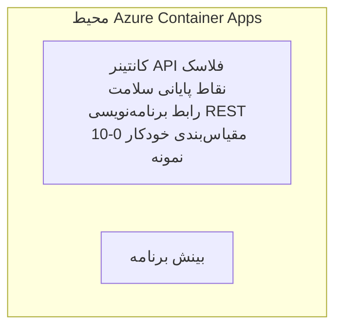

# مثال ساده API Flask - نمونه برنامه Container App

**مسیر یادگیری:** مبتدی ⭐ | **زمان:** 25-35 دقیقه | **هزینه:** $0-15/ماه

یک REST API کامل و عملی با Python Flask که با استفاده از Azure Developer CLI (azd) در Azure Container Apps مستقر شده است. این مثال اصول استقرار کانتینر، مقیاس‌دهی خودکار و مقدمات پایش را نشان می‌دهد.

## 🎯 آنچه خواهید آموخت

- استقرار یک برنامه پایتون کانتینری شده در Azure
- پیکربندی مقیاس‌دهی خودکار با مقیاس به صفر
- پیاده‌سازی پروب‌های سلامت و بررسی‌های readiness
- پایش لاگ‌ها و معیارهای برنامه
- استفاده از Azure Developer CLI برای استقرار سریع

## 📦 آنچه شامل است

✅ **برنامه Flask** - REST API کامل با عملیات CRUD (`src/app.py`)  
✅ **Dockerfile** - پیکربندی کانتینر آماده تولید  
✅ **زیرساخت Bicep** - محیط Container Apps و استقرار API  
✅ **پیکربندی AZD** - راه‌اندازی استقرار با یک فرمان  
✅ **پروب‌های سلامت** - بررسی‌های liveness و readiness پیکربندی شده  
✅ **مقیاس‌دهی خودکار** - 0-10 نسخه بر اساس بار HTTP  

## معماری



## پیش‌نیازها

### موارد مورد نیاز
- **Azure Developer CLI (azd)** - [راهنمای نصب](https://learn.microsoft.com/azure/developer/azure-developer-cli/install-azd)
- **Azure subscription** - [حساب رایگان](https://azure.microsoft.com/free/)
- **Docker Desktop** - [نصب Docker](https://www.docker.com/products/docker-desktop/) (برای تست محلی)

### بررسی پیش‌نیازها

```bash
# نسخه azd را بررسی کنید (نیاز به 1.5.0 یا بالاتر)
azd version

# ورود به Azure را تأیید کنید
azd auth login

# Docker را بررسی کنید (اختیاری، برای تست محلی)
docker --version
```

## ⏱️ جدول زمانی استقرار

| فاز | مدت زمان | چه اتفاقی می‌افتد |
|-------|----------|--------------||
| راه‌اندازی محیط | 30 ثانیه | ایجاد محیط azd |
| ساخت کانتینر | 2-3 دقیقه | اجرای Docker build برای برنامه Flask |
| تأمین زیرساخت | 3-5 دقیقه | ایجاد Container Apps، رجیستری، مانیتورینگ |
| استقرار برنامه | 2-3 دقیقه | ارسال ایمیج و استقرار در Container Apps |
| **جمع** | **8-12 دقیقه** | استقرار کامل آماده |

## شروع سریع

```bash
# به مثال بروید
cd examples/container-app/simple-flask-api

# محیط را مقداردهی اولیه کنید (یک نام یکتا انتخاب کنید)
azd env new myflaskapi

# همه چیز را مستقر کنید (زیرساخت + برنامه)
azd up
# از شما خواسته می‌شود:
# 1. اشتراک Azure را انتخاب کنید
# 2. مکان را انتخاب کنید (مثلاً eastus2)
# 3. برای استقرار ۸–۱۲ دقیقه صبر کنید

# نقطه انتهایی API خود را دریافت کنید
azd env get-values

# API را آزمایش کنید
curl $(azd env get-value API_ENDPOINT)/health
```

**خروجی مورد انتظار:**
```json
{
  "status": "healthy",
  "timestamp": "2025-11-19T10:30:00Z",
  "service": "simple-flask-api",
  "version": "1.0.0"
}
```

## ✅ بررسی استقرار

### گام 1: بررسی وضعیت استقرار

```bash
# مشاهده سرویس‌های مستقر
azd show

# خروجی مورد انتظار به صورت زیر است:
# - سرویس: api
# - نقطهٔ انتهایی: https://ca-api-[env].xxx.azurecontainerapps.io
# - وضعیت: در حال اجرا
```

### گام 2: تست نقاط انتهایی API

```bash
# دریافت نقطهٔ پایانی API
API_URL=$(azd env get-value API_ENDPOINT)

# تست سلامت
curl $API_URL/health

# تست نقطهٔ پایانی ریشه
curl $API_URL/

# ایجاد یک مورد
curl -X POST $API_URL/api/items \
  -H "Content-Type: application/json" \
  -d '{"name": "Test Item", "description": "My first item"}'

# دریافت همه موارد
curl $API_URL/api/items
```

**شاخص‌های موفقیت:**
- ✅ نقطه سلامت پاسخ HTTP 200 برمی‌گرداند
- ✅ نقطه ریشه اطلاعات API را نمایش می‌دهد
- ✅ درخواست POST آیتم ایجاد می‌کند و HTTP 201 بازمی‌گرداند
- ✅ درخواست GET آیتم‌های ایجادشده را برمی‌گرداند

### گام 3: مشاهده لاگ‌ها

```bash
# لاگ‌های زنده را با azd monitor پخش کنید
azd monitor --logs

# یا از Azure CLI استفاده کنید:
az containerapp logs show --name api --resource-group $RG_NAME --follow

# شما باید ببینید:
# - پیام‌های راه‌اندازی Gunicorn
# - لاگ‌های درخواست HTTP
# - لاگ‌های اطلاعاتی برنامه
```

## ساختار پروژه

```
simple-flask-api/
├── azure.yaml              # AZD configuration
├── infra/
│   ├── main.bicep         # Main infrastructure
│   ├── main.parameters.json
│   └── app/
│       ├── container-env.bicep
│       └── api.bicep
└── src/
    ├── app.py             # Flask application
    ├── requirements.txt
    └── Dockerfile
```

## نقاط انتهایی API

| مسیر | متد | توضیحات |
|----------|--------|-------------|
| `/health` | GET | بررسی سلامت |
| `/api/items` | GET | فهرست همه آیتم‌ها |
| `/api/items` | POST | ایجاد آیتم جدید |
| `/api/items/{id}` | GET | دریافت آیتم مشخص |
| `/api/items/{id}` | PUT | به‌روزرسانی آیتم |
| `/api/items/{id}` | DELETE | حذف آیتم |

## پیکربندی

### متغیرهای محیطی

```bash
# پیکربندی سفارشی را تنظیم کنید
azd env set PORT 8000
azd env set LOG_LEVEL info
azd env set MAX_REPLICAS 20
```

### پیکربندی مقیاس‌دهی

API به‌صورت خودکار بر اساس ترافیک HTTP مقیاس می‌یابد:
- **حداقل نسخه‌ها**: 0 (در حالت بیکاری مقیاس به صفر می‌رود)
- **حداکثر نسخه‌ها**: 10
- **درخواست‌های همزمان به ازای هر نسخه**: 50

## توسعه

### اجرای محلی

```bash
# نصب وابستگی‌ها
cd src
pip install -r requirements.txt

# اجرای برنامه
python app.py

# تست به‌صورت محلی
curl http://localhost:8000/health
```

### ساخت و تست کانتینر

```bash
# ساخت ایمیج داکر
docker build -t flask-api:local ./src

# اجرای کانتینر به صورت محلی
docker run -p 8000:8000 flask-api:local

# تست کانتینر
curl http://localhost:8000/health
```

## استقرار

### استقرار کامل

```bash
# استقرار زیرساخت و برنامه
azd up
```

### استقرار فقط کد

```bash
# فقط کد برنامه را مستقر کنید (زیرساخت بدون تغییر)
azd deploy api
```

### به‌روزرسانی پیکربندی

```bash
# متغیرهای محیطی را به‌روزرسانی کنید
azd env set API_KEY "new-api-key"

# با پیکربندی جدید مجدداً مستقر کنید
azd deploy api
```

## پایش

### مشاهده لاگ‌ها

```bash
# لاگ‌های زنده را با azd monitor پخش کنید
azd monitor --logs

# یا از Azure CLI برای Container Apps استفاده کنید:
az containerapp logs show --name api --resource-group $RG_NAME --follow

# 100 خط آخر را مشاهده کنید
az containerapp logs show --name api --resource-group $RG_NAME --tail 100
```

### پایش معیارها

```bash
# باز کردن داشبورد Azure Monitor
azd monitor --overview

# مشاهده معیارهای خاص
az monitor metrics list \
  --resource $(azd show --output json | jq -r '.services.api.resourceId') \
  --metric "Requests,ResponseTime"
```

## تست

### بررسی سلامت

```bash
curl $(azd show --output json | jq -r '.services.api.endpoint')/health
```

پاسخ مورد انتظار:
```json
{
  "status": "healthy",
  "timestamp": "2025-11-19T10:30:00Z"
}
```

### ایجاد آیتم

```bash
curl -X POST $(azd show --output json | jq -r '.services.api.endpoint')/api/items \
  -H "Content-Type: application/json" \
  -d '{"name": "Test Item", "description": "A test item"}'
```

### دریافت همه آیتم‌ها

```bash
curl $(azd show --output json | jq -r '.services.api.endpoint')/api/items
```

## بهینه‌سازی هزینه

این استقرار از مقیاس تا صفر استفاده می‌کند، بنابراین تنها زمانی هزینه پرداخت می‌کنید که API در حال پردازش درخواست‌ها باشد:

- **هزینه بیکاری**: تقریباً $0/ماه (مقیاس به صفر)
- **هزینه فعال**: تقریباً $0.000024/ثانیه به ازای هر نسخه
- **هزینه ماهانه مورد انتظار** (استفاده کم): $5-15

### کاهش بیشتر هزینه‌ها

```bash
# حداکثر تعداد کپی‌ها را برای محیط توسعه کاهش دهید
azd env set MAX_REPLICAS 3

# از تایم‌اوت بیکار کوتاه‌تری استفاده کنید
azd env set SCALE_TO_ZERO_TIMEOUT 300  # ۵ دقیقه
```

## رفع اشکال

### کانتینر شروع نمی‌شود

```bash
# با استفاده از Azure CLI لاگ‌های کانتینر را بررسی کنید
az containerapp logs show --name api --resource-group $RG_NAME --tail 100

# ساخت ایمیج Docker به‌صورت محلی را تأیید کنید
docker build -t test ./src
```

### دسترسی به API امکان‌پذیر نیست

```bash
# تأیید کنید که اینگرس خارجی است
az containerapp show --name api --resource-group rg-simple-flask-api \
  --query properties.configuration.ingress.external
```

### زمان پاسخ‌دهی بالا

```bash
# استفاده از CPU/حافظه را بررسی کنید
az monitor metrics list \
  --resource $(azd show --output json | jq -r '.services.api.resourceId') \
  --metric "CPUPercentage,MemoryPercentage"

# در صورت نیاز منابع را افزایش دهید
az containerapp update --name api --resource-group rg-simple-flask-api \
  --cpu 1.0 --memory 2Gi
```

## پاک‌سازی

```bash
# همه منابع را حذف کنید
azd down --force --purge
```

## مراحل بعدی

### گسترش این مثال

1. **افزودن پایگاه‌داده** - ادغام Azure Cosmos DB یا SQL Database
   ```bash
   # ماژول Cosmos DB را به infra/main.bicep اضافه کنید
   # app.py را با اتصال به پایگاه داده به‌روزرسانی کنید
   ```

2. **افزودن احراز هویت** - پیاده‌سازی Microsoft Entra ID یا کلیدهای API
   ```python
   # افزودن میان‌افزار احراز هویت به app.py
   from functools import wraps
   ```

3. **راه‌اندازی CI/CD** - گردش‌کار GitHub Actions
   ```yaml
   # Create .github/workflows/deploy.yml
   name: Deploy to Azure
   on: [push]
   ```

4. **افزودن Managed Identity** - امن‌سازی دسترسی به سرویس‌های Azure
   ```bicep
   # Update infra/app/api.bicep
   identity: { type: 'SystemAssigned' }
   ```

### مثال‌های مرتبط

- **[Database App](../../../../../examples/database-app)** - مثال کامل با SQL Database
- **[Microservices](../../../../../examples/container-app/microservices)** - معماری چندسرویسی
- **[Container Apps Master Guide](../README.md)** - تمام الگوهای Container Apps

### منابع یادگیری

- 📚 [AZD For Beginners Course](../../../README.md) - صفحه اصلی دوره
- 📚 [Container Apps Patterns](../README.md) - الگوهای بیشتر استقرار
- 📚 [AZD Templates Gallery](https://azure.github.io/awesome-azd/) - قالب‌های جامعه

## منابع اضافی

### مستندات
- **[Flask Documentation](https://flask.palletsprojects.com/)** - راهنمای فریم‌ورک Flask
- **[Azure Container Apps](https://learn.microsoft.com/azure/container-apps/)** - مستندات رسمی Azure
- **[Azure Developer CLI](https://learn.microsoft.com/azure/developer/azure-developer-cli/)** - مرجع دستورات azd

### آموزش‌ها
- **[Container Apps Quickstart](https://learn.microsoft.com/azure/container-apps/quickstart-portal)** - استقرار اولین برنامه خود
- **[Python on Azure](https://learn.microsoft.com/azure/developer/python/)** - راهنمای توسعه با Python
- **[Bicep Language](https://learn.microsoft.com/azure/azure-resource-manager/bicep/)** - زیرساخت به‌عنوان کد

### ابزارها
- **[Azure Portal](https://portal.azure.com)** - مدیریت منابع به‌صورت تصویری
- **[VS Code Azure Extension](https://marketplace.visualstudio.com/items?itemName=ms-azuretools.vscode-azurecontainerapps)** - ادغام با IDE

---

**🎉 تبریک!** شما یک API Flask آماده تولید را با مقیاس‌دهی خودکار و پایش در Azure Container Apps مستقر کردید.

**سؤالی دارید؟** [یک issue باز کنید](https://github.com/microsoft/AZD-for-beginners/issues) یا بخش [سؤالات متداول](../../../resources/faq.md) را بررسی کنید

---

<!-- CO-OP TRANSLATOR DISCLAIMER START -->
**سلب مسئولیت**:
این سند با استفاده از سرویس ترجمه هوش مصنوعی [Co-op Translator](https://github.com/Azure/co-op-translator) ترجمه شده است. در حالی که ما در تلاش برای دقت هستیم، لطفاً توجه داشته باشید که ترجمه‌های خودکار ممکن است شامل خطاها یا نادرستی‌هایی باشند. سند اصلی به زبان مادری خود باید به عنوان منبع معتبر در نظر گرفته شود. برای اطلاعات حیاتی، ترجمه حرفه‌ای انسانی توصیه می‌شود. ما در قبال هرگونه سوء تفاهم یا برداشت نادرست ناشی از استفاده از این ترجمه مسئولیتی نداریم.
<!-- CO-OP TRANSLATOR DISCLAIMER END -->