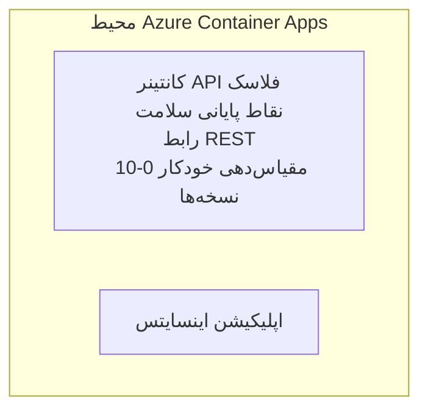

# نمونه ساده Flask API - مثال اپ Container App

**مسیر یادگیری:** مبتدی ⭐ | **زمان:** 25-35 دقیقه | **هزینه:** $0-15/ماه

یک API REST کامل و عملی با Python و Flask که با استفاده از Azure Developer CLI (azd) در Azure Container Apps مستقر شده است. این مثال مبانی استقرار کانتینر، مقیاس‌بندی خودکار و نظارت را نشان می‌دهد.

## 🎯 آنچه می‌آموزید

- استقرار یک برنامه‌ی پایتون کانتینری شده در Azure
- پیکربندی مقیاس‌بندی خودکار با مقیاس تا صفر
- پیاده‌سازی probes سلامت و بررسی‌های آمادگی
- مشاهده‌ی لاگ‌ها و متریک‌های برنامه
- استفاده از Azure Developer CLI برای استقرار سریع

## 📦 موارد شامل

✅ **برنامه‌ی Flask** - API REST کامل با عملیات CRUD (`src/app.py`)  
✅ **Dockerfile** - پیکربندی کانتینر آماده تولید  
✅ **زیرساخت Bicep** - محیط Container Apps و استقرار API  
✅ **پیکربندی AZD** - راه‌اندازی استقرار با یک فرمان  
✅ **Probes سلامت** - بررسی‌های Liveness و Readiness پیکربندی شده  
✅ **مقیاس‌بندی خودکار** - 0-10 نمونه بر اساس بار HTTP  

## معماری


## ملزومات

### مورد نیاز
- **Azure Developer CLI (azd)** - [راهنمای نصب](https://learn.microsoft.com/azure/developer/azure-developer-cli/install-azd)
- **اشتراک Azure** - [حساب رایگان](https://azure.microsoft.com/free/)
- **Docker Desktop** - [نصب Docker](https://www.docker.com/products/docker-desktop/) (برای آزمایش محلی)

### بررسی ملزومات

```bash
# نسخه azd را بررسی کنید (نیاز به 1.5.0 یا بالاتر)
azd version

# ورود به Azure را تأیید کنید
azd auth login

# Docker را بررسی کنید (اختیاری، برای تست محلی)
docker --version
```

## ⏱️ زمان‌بندی استقرار

| Phase | Duration | What Happens |
|-------|----------|--------------||
| Environment setup | 30 seconds | Create azd environment |
| Build container | 2-3 minutes | Docker build Flask app |
| Provision infrastructure | 3-5 minutes | Create Container Apps, registry, monitoring |
| Deploy application | 2-3 minutes | Push image and deploy to Container Apps |
| **Total** | **8-12 minutes** | Complete deployment ready |

## شروع سریع

```bash
# به مثال بروید
cd examples/container-app/simple-flask-api

# محیط را مقداردهی اولیه کنید (یک نام یکتا انتخاب کنید)
azd env new myflaskapi

# همه چیز را مستقر کنید (زیرساخت + برنامه)
azd up
# از شما خواسته می‌شود:
# ۱. اشتراک Azure را انتخاب کنید
# ۲. منطقه را انتخاب کنید (برای مثال، eastus2)
# ۳. برای استقرار ۸–۱۲ دقیقه صبر کنید

# نقطه پایانی API خود را دریافت کنید
azd env get-values

# API را آزمایش کنید
curl $(azd env get-value API_ENDPOINT)/health
```

**خروجی مورد انتظار:**
```json
{
  "status": "healthy",
  "timestamp": "2025-11-19T10:30:00Z",
  "service": "simple-flask-api",
  "version": "1.0.0"
}
```

## ✅ تأیید استقرار

### گام 1: بررسی وضعیت استقرار

```bash
# مشاهده سرویس‌های مستقر شده
azd show

# خروجی مورد انتظار نشان می‌دهد:
# - سرویس: api
# - نقطه پایانی: https://ca-api-[env].xxx.azurecontainerapps.io
# - وضعیت: در حال اجرا
```

### گام 2: آزمون نقاط انتهایی API

```bash
# دریافت نقطهٔ پایانی API
API_URL=$(azd env get-value API_ENDPOINT)

# بررسی سلامت
curl $API_URL/health

# بررسی نقطهٔ پایانی ریشه
curl $API_URL/

# ایجاد یک مورد
curl -X POST $API_URL/api/items \
  -H "Content-Type: application/json" \
  -d '{"name": "Test Item", "description": "My first item"}'

# دریافت همهٔ موارد
curl $API_URL/api/items
```

**معیارهای موفقیت:**
- ✅ endpoint سلامت پاسخ HTTP 200 برمی‌گرداند
- ✅ endpoint ریشه اطلاعات API را نشان می‌دهد
- ✅ درخواست POST آیتم ایجاد می‌کند و HTTP 201 برمی‌گرداند
- ✅ درخواست GET آیتم‌های ایجادشده را بازمی‌گرداند

### گام 3: مشاهده لاگ‌ها

```bash
# لاگ‌های زنده را با azd monitor پخش کنید
azd monitor --logs

# یا از Azure CLI استفاده کنید:
az containerapp logs show --name api --resource-group $RG_NAME --follow

# شما باید ببینید:
# - پیام‌های راه‌اندازی Gunicorn
# - لاگ‌های درخواست‌های HTTP
# - لاگ‌های اطلاعات برنامه
```

## ساختار پروژه

```
simple-flask-api/
├── azure.yaml              # AZD configuration
├── infra/
│   ├── main.bicep         # Main infrastructure
│   ├── main.parameters.json
│   └── app/
│       ├── container-env.bicep
│       └── api.bicep
└── src/
    ├── app.py             # Flask application
    ├── requirements.txt
    └── Dockerfile
```

## نقاط انتهایی API

| Endpoint | Method | Description |
|----------|--------|-------------|
| `/health` | GET | بررسی سلامت |
| `/api/items` | GET | فهرست تمام آیتم‌ها |
| `/api/items` | POST | ایجاد آیتم جدید |
| `/api/items/{id}` | GET | دریافت آیتم مشخص |
| `/api/items/{id}` | PUT | به‌روزرسانی آیتم |
| `/api/items/{id}` | DELETE | حذف آیتم |

## پیکربندی

### متغیرهای محیطی

```bash
# پیکربندی سفارشی را تنظیم کنید
azd env set PORT 8000
azd env set LOG_LEVEL info
azd env set MAX_REPLICAS 20
```

### پیکربندی مقیاس‌بندی

API به‌صورت خودکار بر اساس ترافیک HTTP مقیاس می‌یابد:
- **حداقل نمونه‌ها**: 0 (در حالت بیکار تا صفر مقیاس می‌یابد)
- **حداکثر نمونه‌ها**: 10
- **درخواست‌های همزمان به ازای هر نمونه**: 50

## توسعه

### اجرا به‌صورت محلی

```bash
# نصب وابستگی‌ها
cd src
pip install -r requirements.txt

# اجرای برنامه
python app.py

# تست به‌صورت محلی
curl http://localhost:8000/health
```

### ساخت و تست کانتینر

```bash
# ساخت ایمیج داکر
docker build -t flask-api:local ./src

# اجرای کانتینر به‌صورت محلی
docker run -p 8000:8000 flask-api:local

# آزمایش کانتینر
curl http://localhost:8000/health
```

## استقرار

### استقرار کامل

```bash
# استقرار زیرساخت و برنامه
azd up
```

### استقرار فقط کد

```bash
# فقط کد برنامه را مستقر کنید (زیرساخت بدون تغییر)
azd deploy api
```

### به‌روزرسانی پیکربندی

```bash
# به‌روزرسانی متغیرهای محیطی
azd env set API_KEY "new-api-key"

# استقرار مجدد با پیکربندی جدید
azd deploy api
```

## نظارت

### مشاهده لاگ‌ها

```bash
# پخش زنده لاگ‌ها با استفاده از azd monitor
azd monitor --logs

# یا از Azure CLI برای Container Apps استفاده کنید:
az containerapp logs show --name api --resource-group $RG_NAME --follow

# آخرین ۱۰۰ خط را مشاهده کنید
az containerapp logs show --name api --resource-group $RG_NAME --tail 100
```

### نظارت بر متریک‌ها

```bash
# باز کردن داشبورد Azure Monitor
azd monitor --overview

# مشاهده متریک‌های مشخص
az monitor metrics list \
  --resource $(azd show --output json | jq -r '.services.api.resourceId') \
  --metric "Requests,ResponseTime"
```

## تست

### بررسی سلامت

```bash
curl $(azd show --output json | jq -r '.services.api.endpoint')/health
```

پاسخ مورد انتظار:
```json
{
  "status": "healthy",
  "timestamp": "2025-11-19T10:30:00Z"
}
```

### ایجاد آیتم

```bash
curl -X POST $(azd show --output json | jq -r '.services.api.endpoint')/api/items \
  -H "Content-Type: application/json" \
  -d '{"name": "Test Item", "description": "A test item"}'
```

### دریافت همه آیتم‌ها

```bash
curl $(azd show --output json | jq -r '.services.api.endpoint')/api/items
```

## بهینه‌سازی هزینه

این استقرار از مقیاس تا صفر استفاده می‌کند، بنابراین تنها هنگام پردازش درخواست‌ها هزینه پرداخت می‌کنید:

- **هزینه در حالت بیکار**: ~$0/ماه (مقیاس تا صفر)
- **هزینه فعال**: ~$0.000024/ثانیه به ازای هر نمونه
- **هزینه ماهیانه مورد انتظار** (استفاده سبک): $5-15

### کاهش بیشتر هزینه‌ها

```bash
# حداکثر تعداد نسخه‌ها را برای محیط توسعه کاهش دهید
azd env set MAX_REPLICAS 3

# از تایم‌اوت بیکاری کوتاه‌تری استفاده کنید
azd env set SCALE_TO_ZERO_TIMEOUT 300  # ۵ دقیقه
```

## عیب‌یابی

### کانتینر راه‌اندازی نمی‌شود

```bash
# با استفاده از Azure CLI لاگ‌های کانتینر را بررسی کنید
az containerapp logs show --name api --resource-group $RG_NAME --tail 100

# اطمینان حاصل کنید که ایمیج Docker به‌صورت محلی ساخته می‌شود
docker build -t test ./src
```

### دسترسی به API امکان‌پذیر نیست

```bash
# بررسی کنید که اینگرس خارجی است
az containerapp show --name api --resource-group rg-simple-flask-api \
  --query properties.configuration.ingress.external
```

### زمان پاسخ‌گویی بالا

```bash
# مصرف CPU/حافظه را بررسی کنید
az monitor metrics list \
  --resource $(azd show --output json | jq -r '.services.api.resourceId') \
  --metric "CPUPercentage,MemoryPercentage"

# در صورت نیاز منابع را افزایش دهید
az containerapp update --name api --resource-group rg-simple-flask-api \
  --cpu 1.0 --memory 2Gi
```

## پاک‌سازی

```bash
# تمام منابع را حذف کنید
azd down --force --purge
```

## مراحل بعدی

### گسترش این مثال

1. **افزودن پایگاه داده** - ادغام Azure Cosmos DB یا SQL Database
   ```bash
   # افزودن ماژول Cosmos DB به infra/main.bicep
   # به‌روزرسانی app.py با اتصال به پایگاه‌داده
   ```

2. **افزودن احراز هویت** - پیاده‌سازی Azure AD یا کلیدهای API
   ```python
   # میان‌افزار احراز هویت را به app.py اضافه کنید
   from functools import wraps
   ```

3. **راه‌اندازی CI/CD** - workflowهای GitHub Actions
   ```yaml
   # Create .github/workflows/deploy.yml
   name: Deploy to Azure
   on: [push]
   ```

4. **افزودن Managed Identity** - دسترسی امن به سرویس‌های Azure
   ```bicep
   # Update infra/app/api.bicep
   identity: { type: 'SystemAssigned' }
   ```

### مثال‌های مرتبط

- **[Database App](../../../../../examples/database-app)** - مثال کامل با SQL Database
- **[Microservices](../../../../../examples/container-app/microservices)** - معماری چندسرویسی
- **[Container Apps Master Guide](../README.md)** - تمام الگوهای کانتینر

### منابع یادگیری

- 📚 [AZD For Beginners Course](../../../README.md) - صفحه اصلی دوره
- 📚 [Container Apps Patterns](../README.md) - الگوهای استقرار بیشتر
- 📚 [AZD Templates Gallery](https://azure.github.io/awesome-azd/) - قالب‌های جامعه

## منابع اضافی

### مستندات
- **[Flask Documentation](https://flask.palletsprojects.com/)** - راهنمای فریم‌ورک Flask
- **[Azure Container Apps](https://learn.microsoft.com/azure/container-apps/)** - مستندات رسمی Azure
- **[Azure Developer CLI](https://learn.microsoft.com/azure/developer/azure-developer-cli/)** - مرجع دستورات azd

### آموزش‌ها
- **[Container Apps Quickstart](https://learn.microsoft.com/azure/container-apps/quickstart-portal)** - استقرار اولین برنامه‌ی شما
- **[Python on Azure](https://learn.microsoft.com/azure/developer/python/)** - راهنمای توسعه پایتون
- **[Bicep Language](https://learn.microsoft.com/azure/azure-resource-manager/bicep/)** - زیرساخت به‌عنوان کد

### ابزارها
- **[Azure Portal](https://portal.azure.com)** - مدیریت بصری منابع
- **[VS Code Azure Extension](https://marketplace.visualstudio.com/items?itemName=ms-azuretools.vscode-azurecontainerapps)** - یکپارچه‌سازی IDE

---

**🎉 تبریک!** شما یک API Flask آماده‌ی تولید را در Azure Container Apps با مقیاس‌بندی خودکار و نظارت مستقر کرده‌اید.

**سؤالی دارید؟** [ایجاد یک issue](https://github.com/microsoft/AZD-for-beginners/issues) یا بررسی [سؤالات متداول](../../../resources/faq.md)

---

<!-- CO-OP TRANSLATOR DISCLAIMER START -->
**سلب مسئولیت**:
این سند با استفاده از سرویس ترجمهٔ هوش مصنوعی [Co-op Translator](https://github.com/Azure/co-op-translator) ترجمه شده است. در حالی که ما در تلاش برای دقت هستیم، لطفاً توجه داشته باشید که ترجمه‌های خودکار ممکن است حاوی اشتباهات یا نادرستی‌هایی باشند. نسخهٔ اصلی سند به زبان بومی آن باید به عنوان منبع معتبر در نظر گرفته شود. برای اطلاعات حساس یا حیاتی، ترجمهٔ حرفه‌ای انسانی توصیه می‌شود. ما در قبال هرگونه سوءتفاهم یا تفسیر نادرست ناشی از استفاده از این ترجمه مسئولیتی نداریم.
<!-- CO-OP TRANSLATOR DISCLAIMER END -->