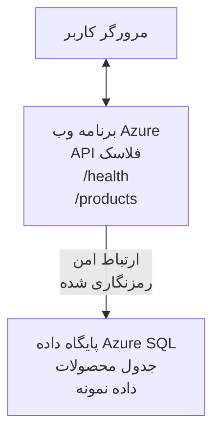

# استقرار یک پایگاه‌داده Microsoft SQL و وب‌اپ با AZD

⏱️ **زمان تخمینی**: 20-30 دقیقه | 💰 **هزینه تخمینی**: ~$15-25/ماه | ⭐ **پیچیدگی**: متوسط

این مثال کامل و عملی نشان می‌دهد چگونه از [Azure Developer CLI (azd)](https://learn.microsoft.com/azure/developer/azure-developer-cli/) برای استقرار یک برنامه وب Python Flask با یک پایگاه‌داده Microsoft SQL در Azure استفاده کنید. تمام کدها گنجانده و آزمایش شده‌اند—هیچ وابستگی خارجی لازم نیست.

## آنچه خواهید آموخت

با تکمیل این مثال، شما:
- یک برنامه چندلایه (وب‌اپ + پایگاه‌داده) را با استفاده از زیرساخت به‌عنوان‌کد مستقر خواهید کرد
- اتصالات امن به پایگاه‌داده را بدون کدگذاری سخت رمز عبور پیکربندی می‌کنید
- سلامت برنامه را با Application Insights مانیتور می‌کنید
- منابع Azure را با AZD CLI به‌طور کارآمد مدیریت می‌کنید
- از بهترین شیوه‌های Azure برای امنیت، بهینه‌سازی هزینه و قابلیت مشاهده پیروی می‌کنید

## مرور سناریو
- **وب‌اپ**: API REST با Python Flask و اتصال به پایگاه‌داده
- **پایگاه‌داده**: Azure SQL Database با داده نمونه
- **زیرساخت**: تأمین شده با Bicep (قابل مدولار و قابل استفاده مجدد)
- **استقرار**: کاملاً خودکار با دستورات `azd`
- **نظارت**: Application Insights برای لاگ‌ها و تله‌متری

## پیش‌نیازها

### ابزارهای مورد نیاز

قبل از شروع، مطمئن شوید این ابزارها نصب شده‌اند:

1. **[Azure CLI](https://learn.microsoft.com/cli/azure/install-azure-cli)** (نسخه 2.50.0 یا بالاتر)
   ```sh
   az --version
   # خروجی مورد انتظار: azure-cli 2.50.0 یا بالاتر
   ```

2. **[Azure Developer CLI (azd)](https://learn.microsoft.com/azure/developer/azure-developer-cli/install-azd)** (نسخه 1.0.0 یا بالاتر)
   ```sh
   azd version
   # خروجی مورد انتظار: نسخهٔ azd 1.0.0 یا بالاتر
   ```

3. **[Python 3.8+](https://www.python.org/downloads/)** (برای توسعه محلی)
   ```sh
   python --version
   # خروجی مورد انتظار: پایتون ۳.۸ یا بالاتر
   ```

4. **[Docker](https://www.docker.com/get-started)** (اختیاری، برای توسعه محلی کانتینری)
   ```sh
   docker --version
   # خروجی مورد انتظار: نسخه داکر 20.10 یا بالاتر
   ```

### نیازمندی‌های Azure

- یک **اشتراک Azure** فعال ([ایجاد حساب رایگان](https://azure.microsoft.com/free/))
- دسترسی برای ایجاد منابع در اشتراک شما
- نقش **Owner** یا **Contributor** در اشتراک یا گروه منابع

### پیش‌نیازهای دانش

این یک مثال سطح **متوسط** است. شما باید با موارد زیر آشنایی داشته باشید:
- عملیات پایه خط فرمان
- مفاهیم پایه ابر (منابع، گروه منابع)
- درک پایه از برنامه‌های وب و پایگاه‌داده‌ها

**جدید با AZD؟** ابتدا با راهنمای [Getting Started](../../docs/chapter-01-foundation/azd-basics.md) شروع کنید.

## معماری

این مثال یک معماری دو لایه با یک برنامه وب و یک پایگاه‌داده SQL مستقر می‌کند:



**استقرار منابع:**
- **Resource Group**: محفظه‌ای برای همه منابع
- **App Service Plan**: میزبانی مبتنی بر لینوکس (رده B1 برای صرفه‌جویی در هزینه)
- **Web App**: Runtime Python 3.11 با برنامه Flask
- **SQL Server**: سرور مدیریت‌شده پایگاه‌داده با حداقل TLS 1.2
- **SQL Database**: رده Basic (2GB، مناسب توسعه/تست)
- **Application Insights**: مانیتورینگ و لاگ‌برداری
- **Log Analytics Workspace**: ذخیره‌سازی متمرکز لاگ‌ها

**تمثیل**: این را مانند یک رستوران در نظر بگیرید (وب‌اپ) با یک فریزر راه‌رویی (پایگاه‌داده). مشتریان از منو سفارش می‌دهند (endpointهای API)، و آشپزخانه (برنامه Flask) مواد را از فریزر برمی‌دارد. مدیر رستوران (Application Insights) همه چیز را دنبال می‌کند.

## ساختار پوشه‌ها

تمام فایل‌ها در این مثال گنجانده شده‌اند—هیچ وابستگی خارجی لازم نیست:

```
examples/database-app/
│
├── README.md                    # This file
├── azure.yaml                   # AZD configuration file
├── .env.sample                  # Sample environment variables
├── .gitignore                   # Git ignore patterns
│
├── infra/                       # Infrastructure as Code (Bicep)
│   ├── main.bicep              # Main orchestration template
│   ├── abbreviations.json      # Azure naming conventions
│   └── resources/              # Modular resource templates
│       ├── sql-server.bicep    # SQL Server configuration
│       ├── sql-database.bicep  # Database configuration
│       ├── app-service-plan.bicep  # Hosting plan
│       ├── app-insights.bicep  # Monitoring setup
│       └── web-app.bicep       # Web application
│
└── src/
    └── web/                    # Application source code
        ├── app.py              # Flask REST API
        ├── requirements.txt    # Python dependencies
        └── Dockerfile          # Container definition
```

**وظیفه هر فایل:**
- **azure.yaml**: به AZD می‌گوید چه چیزی را کجا مستقر کند
- **infra/main.bicep**: هماهنگ‌کننده تمامی منابع Azure
- **infra/resources/*.bicep**: تعریف‌های هر منبع به صورت جداگانه (قابل مدولار برای استفاده مجدد)
- **src/web/app.py**: برنامه Flask با منطق پایگاه‌داده
- **requirements.txt**: وابستگی‌های پکیج پایتون
- **Dockerfile**: دستورالعمل‌های کانتینری‌سازی برای استقرار

## شروع سریع (مرحله‌به‌مرحله)

### مرحله 1: کلون و ناوبری

```sh
git clone https://github.com/microsoft/AZD-for-beginners.git
cd AZD-for-beginners/examples/database-app
```

**✓ بررسی موفقیت**: مطمئن شوید `azure.yaml` و پوشه `infra/` را می‌بینید:
```sh
ls
# انتظار می‌رود: README.md، azure.yaml، infra/، src/
```

### مرحله 2: احراز هویت با Azure

```sh
azd auth login
```

این کار مرورگر شما را برای احراز هویت Azure باز می‌کند. با اطلاعات کاربری Azure خود وارد شوید.

**✓ بررسی موفقیت**: شما باید ببینید:
```
Logged in to Azure.
```

### مرحله 3: مقداردهی اولیه محیط

```sh
azd init
```

**چه اتفاقی می‌افتد**: AZD یک پیکربندی محلی برای استقرار شما ایجاد می‌کند.

**پرسش‌هایی که مشاهده خواهید کرد**:
- **Environment name**: یک نام کوتاه وارد کنید (مثلاً `dev`، `myapp`)
- **Azure subscription**: اشتراک خود را از لیست انتخاب کنید
- **Azure location**: یک منطقه انتخاب کنید (مثلاً `eastus`، `westeurope`)

**✓ بررسی موفقیت**: شما باید ببینید:
```
SUCCESS: New project initialized!
```

### مرحله 4: تأمین منابع Azure

```sh
azd provision
```

**چه اتفاقی می‌افتد**: AZD همه زیرساخت را مستقر می‌کند (۵-۸ دقیقه طول می‌کشد):
1. ایجاد resource group
2. ایجاد SQL Server و Database
3. ایجاد App Service Plan
4. ایجاد Web App
5. ایجاد Application Insights
6. پیکربندی شبکه و امنیت

**از شما پرسیده خواهد شد**:
- **SQL admin username**: یک نام کاربری وارد کنید (مثلاً `sqladmin`)
- **SQL admin password**: یک رمز عبور قوی وارد کنید (آن را ذخیره کنید!)

**✓ بررسی موفقیت**: شما باید ببینید:
```
SUCCESS: Your application was provisioned in Azure in X minutes Y seconds.
You can view the resources created under the resource group rg-<env-name> in Azure Portal:
https://portal.azure.com/#@/resource/subscriptions/.../resourceGroups/rg-<env-name>
```

**⏱️ زمان**: 5-8 دقیقه

### مرحله 5: استقرار برنامه

```sh
azd deploy
```

**چه اتفاقی می‌افتد**: AZD برنامه Flask شما را می‌سازد و مستقر می‌کند:
1. بسته‌بندی برنامه پایتون
2. ساخت کانتینر Docker
3. ارسال به Azure Web App
4. مقداردهی اولیه پایگاه‌داده با داده نمونه
5. راه‌اندازی برنامه

**✓ بررسی موفقیت**: شما باید ببینید:
```
SUCCESS: Your application was deployed to Azure in X minutes Y seconds.
You can view the resources created under the resource group rg-<env-name> in Azure Portal:
https://portal.azure.com/#@/resource/subscriptions/.../resourceGroups/rg-<env-name>
```

**⏱️ زمان**: 3-5 دقیقه

### مرحله 6: مرور برنامه

```sh
azd browse
```

این آدرس وب‌اپ مستقرشده را در مرورگر باز می‌کند: `https://app-<unique-id>.azurewebsites.net`

**✓ بررسی موفقیت**: شما باید خروجی JSON ببینید:
```json
{
  "message": "Welcome to the Database App API",
  "endpoints": {
    "/": "This help message",
    "/health": "Health check endpoint",
    "/products": "List all products",
    "/products/<id>": "Get product by ID"
  }
}
```

### مرحله 7: آزمون endpointهای API

**بررسی سلامت** (اتصال به پایگاه‌داده را تأیید کنید):
```sh
curl https://app-<your-id>.azurewebsites.net/health
```

**پاسخ مورد انتظار**:
```json
{
  "status": "healthy",
  "database": "connected"
}
```

**فهرست محصولات** (داده نمونه):
```sh
curl https://app-<your-id>.azurewebsites.net/products
```

**پاسخ مورد انتظار**:
```json
[
  {
    "id": 1,
    "name": "Laptop",
    "description": "High-performance laptop",
    "price": 1299.99,
    "created_at": "2025-11-19T10:30:00"
  },
  ...
]
```

**دریافت یک محصول تکی**:
```sh
curl https://app-<your-id>.azurewebsites.net/products/1
```

**✓ بررسی موفقیت**: تمام endpointها داده JSON را بدون خطا بازمی‌گردانند.

---

**🎉 تبریک!** شما با موفقیت یک برنامه وب با یک پایگاه‌داده را در Azure با استفاده از AZD مستقر کردید.

## بررسی عمقی پیکربندی

### متغیرهای محیطی

رمزها به‌صورت امن از طریق پیکربندی App Service در Azure مدیریت می‌شوند—**هیچ‌گاه در کد منبع به‌صورت سخت‌کد ذخیره نشوند**.

**به‌صورت خودکار توسط AZD پیکربندی می‌شود**:
- `SQL_CONNECTION_STRING`: رشته اتصال به پایگاه‌داده با اطلاعات رمزنگاری‌شده
- `APPLICATIONINSIGHTS_CONNECTION_STRING`: نقطه‌پایان تله‌متری مانیتورینگ
- `SCM_DO_BUILD_DURING_DEPLOYMENT`: فعال‌سازی نصب خودکار وابستگی‌ها

**محل ذخیره رمزها**:
1. در طی `azd provision`، شما اطلاعات شناسه SQL را از طریق پرسش‌های امن وارد می‌کنید
2. AZD آن‌ها را در فایل محلی `.azure/<env-name>/.env` ذخیره می‌کند (در git نادیده گرفته می‌شود)
3. AZD آن‌ها را در پیکربندی Azure App Service وارد می‌کند (رمزنگاری‌شده در حالت استراحت)
4. برنامه در زمان اجرا آن‌ها را از طریق `os.getenv()` می‌خواند

### توسعه محلی

برای تست محلی، یک فایل `.env` از نمونه ایجاد کنید:

```sh
cp .env.sample .env
# فایل .env را با اطلاعات اتصال پایگاه‌دادهٔ محلی خود ویرایش کنید.
```

**فرآیند توسعه محلی**:
```sh
# نصب وابستگی‌ها
cd src/web
pip install -r requirements.txt

# تنظیم متغیرهای محیطی
export SQL_CONNECTION_STRING="your-local-connection-string"

# اجرای برنامه
python app.py
```

**تست به‌صورت محلی**:
```sh
curl http://localhost:8000/health
# مقدار مورد انتظار: {"وضعیت": "سالم", "پایگاه داده": "متصل"}
```

### زیرساخت به‌عنوان کد

تمام منابع Azure در قالب‌های **Bicep** (`infra/` پوشه) تعریف شده‌اند:

- **طراحی مدولار**: هر نوع منبع فایل مخصوص به خود را برای استفاده مجدد دارد
- **پارامتردهی‌شده**: قابل تنظیم برای SKUها، مناطق، قواعد نام‌گذاری
- **بهترین شیوه‌ها**: از استانداردهای نام‌گذاری و تنظیمات امنیتی پیش‌فرض Azure پیروی می‌کند
- **کنترل نسخه**: تغییرات زیرساخت در Git دنبال می‌شوند

**نمونه سفارشی‌سازی**:
برای تغییر رده پایگاه‌داده، فایل `infra/resources/sql-database.bicep` را ویرایش کنید:
```bicep
sku: {
  name: 'Standard'  // Changed from 'Basic'
  tier: 'Standard'
  capacity: 10
}
```

## بهترین شیوه‌های امنیتی

این مثال از بهترین شیوه‌های امنیتی Azure پیروی می‌کند:

### 1. **هیچ رمزی در کد منبع قرار نگیرد**
- ✅ اطلاعات احراز هویت در پیکربندی Azure App Service ذخیره می‌شود (رمزنگاری‌شده)
- ✅ فایل‌های `.env` از طریق `.gitignore` از Git حذف شده‌اند
- ✅ رمزها از طریق پارامترهای امن در هنگام تأمین عبور داده می‌شوند

### 2. **اتصالات رمزنگاری‌شده**
- ✅ حداقل TLS 1.2 برای SQL Server
- ✅ فقط HTTPS برای Web App اجباری است
- ✅ اتصالات پایگاه‌داده از کانال‌های رمزنگاری‌شده استفاده می‌کنند

### 3. **امنیت شبکه**
- ✅ فایروال SQL Server طوری پیکربندی شده که فقط خدمات Azure مجاز باشند
- ✅ دسترسی شبکه عمومی محدود است (می‌توان با Private Endpoints بیشتر امن کرد)
- ✅ FTPS در Web App غیرفعال شده است

### 4. **احراز هویت و مجوزدهی**
- ⚠️ **فعلی**: احراز هویت SQL (نام‌کاربری/رمز عبور)
- ✅ **توصیه برای تولید**: استفاده از Managed Identity Azure برای احراز هویت بدون رمز عبور

**برای ارتقا به Managed Identity** (برای محیط تولید):
1. فعال کردن managed identity بر روی Web App
2. اعطای مجوزهای لازم به identity در SQL
3. به‌روزرسانی رشته اتصال برای استفاده از managed identity
4. حذف احراز هویت مبتنی بر رمز عبور

### 5. **حسابرسی و انطباق**
- ✅ Application Insights همه درخواست‌ها و خطاها را لاگ می‌کند
- ✅ حسابرسی SQL Database فعال است (قابل پیکربندی برای انطباق)
- ✅ همه منابع دارای تگ برای حاکمیت هستند

**چک‌لیست امنیتی قبل از تولید**:
- [ ] فعال‌سازی Azure Defender برای SQL
- [ ] پیکربندی Private Endpoints برای SQL Database
- [ ] فعال‌سازی Web Application Firewall (WAF)
- [ ] پیاده‌سازی Azure Key Vault برای چرخش رمزها
- [ ] پیکربندی احراز هویت Microsoft Entra ID
- [ ] فعال‌سازی لاگ‌برداری تشخیصی برای همه منابع

## بهینه‌سازی هزینه

**هزینه‌های ماهیانه تخمینی** (تا نوامبر 2025):

| Resource | SKU/Tier | Estimated Cost |
|----------|----------|----------------|
| App Service Plan | B1 (Basic) | ~$13/month |
| SQL Database | Basic (2GB) | ~$5/month |
| Application Insights | Pay-as-you-go | ~$2/month (low traffic) |
| **Total** | | **~$20/month** |

**💡 نکات صرفه‌جویی در هزینه**:

1. **برای یادگیری از رده رایگان استفاده کنید**:
   - App Service: رده F1 (رایگان، ساعات محدود)
   - SQL Database: استفاده از Azure SQL Database serverless
   - Application Insights: 5GB/ماه ورودی رایگان

2. **وقتی استفاده نمی‌کنید منابع را متوقف کنید**:
   ```sh
   # برنامه وب را متوقف کنید (پایگاه داده همچنان هزینه خواهد داشت)
   az webapp stop --name <app-name> --resource-group <rg-name>
   
   # در صورت نیاز مجدداً راه‌اندازی کنید
   az webapp start --name <app-name> --resource-group <rg-name>
   ```

3. **حذف همه چیز پس از تست**:
   ```sh
   azd down
   ```
   این کار همهٔ منابع را حذف می‌کند و هزینه‌ها را متوقف می‌سازد.

4. **SKUهای توسعه در مقابل تولید**:
   - **توسعه**: رده Basic (استفاده‌شده در این مثال)
   - **تولید**: رده Standard/Premium با تحمل خطا و افزونگی

**نظارت بر هزینه**:
- هزینه‌ها را در [Azure Cost Management](https://portal.azure.com/#view/Microsoft_Azure_CostManagement) مشاهده کنید
- هشدارهای هزینه تنظیم کنید تا از غافلگیری جلوگیری شود
- تمام منابع را با تگ `azd-env-name` برای ردیابی برچسب‌گذاری کنید

**جایگزین رده رایگان**:
برای اهداف یادگیری، می‌توانید `infra/resources/app-service-plan.bicep` را تغییر دهید:
```bicep
sku: {
  name: 'F1'  // Free tier
  tier: 'Free'
}
```
**توجه**: رده رایگان محدودیت‌هایی دارد (60 دقیقه/روز CPU، بدون always-on).

## نظارت و قابلیت‌مشاهده

### یکپارچه‌سازی Application Insights

این مثال شامل **Application Insights** برای مانیتورینگ جامع است:

**مواردی که زیر نظر گرفته می‌شوند**:
- ✅ درخواست‌های HTTP (lateny، کدهای وضعیت، endpointها)
- ✅ خطاها و استثناهای برنامه
- ✅ لاگ‌های سفارشی از برنامه Flask
- ✅ سلامت اتصال به پایگاه‌داده
- ✅ معیارهای عملکرد (CPU، حافظه)

**دسترسی به Application Insights**:
1. باز کردن [Azure Portal](https://portal.azure.com)
2. رفتن به گروه منابع شما (`rg-<env-name>`)
3. کلیک روی منبع Application Insights (`appi-<unique-id>`)

**کوئری‌های مفید** (Application Insights → Logs):

**نمایش همه درخواست‌ها**:
```kusto
requests
| where timestamp > ago(1h)
| order by timestamp desc
| project timestamp, name, url, resultCode, duration
```

**یافتن خطاها**:
```kusto
exceptions
| where timestamp > ago(24h)
| order by timestamp desc
| project timestamp, type, outerMessage, operation_Name
```

**بررسی endpoint سلامت**:
```kusto
requests
| where name contains "health"
| summarize count() by resultCode, bin(timestamp, 1h)
```

### حسابرسی SQL Database

**حسابرسی SQL Database فعال است** تا موارد زیر را پیگیری کند:
- الگوهای دسترسی به پایگاه‌داده
- تلاش‌های ورود ناموفق
- تغییرات اسکیمای پایگاه‌داده
- دسترسی به داده‌ها (برای انطباق)

**دسترسی به لاگ‌های حسابرسی**:
1. Azure Portal → SQL Database → Auditing
2. مشاهده لاگ‌ها در Log Analytics workspace

### مانیتورینگ بلادرنگ

**مشاهده معیارهای زنده**:
1. Application Insights → Live Metrics
2. مشاهده درخواست‌ها، خطاها و عملکرد در زمان واقعی

**راه‌اندازی آلارم‌ها**:
آلارم‌هایی برای رویدادهای بحرانی ایجاد کنید:
- خطاهای HTTP 500 > 5 در 5 دقیقه
- شکست‌های اتصال به پایگاه‌داده
- زمان پاسخ بالا (>2 ثانیه)

**نمونه ایجاد آلارم**:
```sh
az monitor metrics alert create \
  --name "High-Response-Time" \
  --resource-group <rg-name> \
  --scopes <app-insights-resource-id> \
  --condition "avg requests/duration > 2000" \
  --description "Alert when response time exceeds 2 seconds"
```

## رفع اشکال
### مسائل متداول و راه‌حل‌ها

#### 1. `azd provision` با خطای "Location not available" شکست می‌خورد

**نشانه**:
```
Error: The subscription is not registered for the resource type 'components' in the location 'centralus'.
```

**راه‌حل**:
یک ناحیه (region) متفاوت در Azure انتخاب کنید یا ارائه‌دهندهٔ منابع را ثبت کنید:
```sh
az provider register --namespace Microsoft.Insights
```

#### 2. اتصال SQL هنگام استقرار شکست می‌خورد

**نشانه**:
```
pyodbc.OperationalError: ('08001', '[08001] [Microsoft][ODBC Driver 18 for SQL Server]TCP Provider...')
```

**راه‌حل**:
- بررسی کنید فایروال SQL Server اجازهٔ دسترسی سرویس‌های Azure را می‌دهد (به‌صورت خودکار پیکربندی می‌شود)
- بررسی کنید رمز مدیر SQL در هنگام `azd provision` به‌درستی وارد شده است
- مطمئن شوید SQL Server کاملاً Provision شده است (ممکن است 2–3 دقیقه طول بکشد)

**بررسی اتصال**:
```sh
# از پورتال Azure به SQL Database → Query editor بروید
# سعی کنید با اطلاعات کاربری خود متصل شوید
```

#### 3. برنامه وب پیغام "Application Error" را نشان می‌دهد

**نشانه**:
مرورگر صفحهٔ خطای عمومی را نمایش می‌دهد.

**راه‌حل**:
لاگ‌های برنامه را بررسی کنید:
```sh
# مشاهده گزارش‌های اخیر
az webapp log tail --name <app-name> --resource-group <rg-name>
```

**علل رایج**:
- متغیرهای محیطی گم‌شده (در App Service → Configuration بررسی کنید)
- نصب بسته‌های Python ناموفق بوده است (لاگ‌های استقرار را بررسی کنید)
- خطای مقداردهی اولیهٔ پایگاه داده (اتصال SQL را بررسی کنید)

#### 4. `azd deploy` با "Build Error" شکست می‌خورد

**نشانه**:
```
Error: Failed to build project
```

**راه‌حل**:
- اطمینان حاصل کنید که `requirements.txt` خطای نحوی ندارد
- بررسی کنید که Python 3.11 در `infra/resources/web-app.bicep` مشخص شده باشد
- مطمئن شوید Dockerfile تصویر پایهٔ درستی دارد

**رفع‌خطا به‌صورت محلی**:
```sh
cd src/web
docker build -t test-app .
docker run -p 8000:8000 test-app
```

#### 5. هنگام اجرای دستورات AZD خطای "Unauthorized" رخ می‌دهد

**نشانه**:
```
ERROR: (Unauthorized) The client '<id>' with object id '<id>' does not have authorization
```

**راه‌حل**:
دوباره با Azure احراز هویت کنید:
```sh
# برای گردش‌کارهای AZD لازم است
azd auth login

# اختیاری است اگر مستقیماً از دستورات Azure CLI نیز استفاده می‌کنید
az login
```

بررسی کنید که مجوزهای صحیح (نقش Contributor) را روی subscription داشته باشید.

#### 6. هزینه‌های بالای پایگاه داده

**نشانه**:
صورتحساب Azure غیرمنتظره.

**راه‌حل**:
- بررسی کنید پس از تست فراموش نکرده‌اید `azd down` را اجرا کنید
- تایید کنید SQL Database در سطح Basic قرار دارد (نه Premium)
- هزینه‌ها را در Azure Cost Management بررسی کنید
- هشدارهای هزینه را تنظیم کنید

### دریافت کمک

**مشاهدهٔ همهٔ متغیرهای محیطی AZD**:
```sh
azd env get-values
```

**بررسی وضعیت استقرار**:
```sh
az webapp show --name <app-name> --resource-group <rg-name> --query state
```

**دسترسی به لاگ‌های برنامه**:
```sh
az webapp log download --name <app-name> --resource-group <rg-name> --log-file app-logs.zip
```

**به کمک بیشتری نیاز دارید؟**
- [راهنمای رفع اشکال AZD](../../docs/chapter-07-troubleshooting/common-issues.md)
- [رفع اشکال Azure App Service](https://learn.microsoft.com/azure/app-service/troubleshoot-diagnostic-logs)
- [رفع اشکال Azure SQL](https://learn.microsoft.com/azure/azure-sql/database/troubleshoot-common-errors-issues)

## تمرین‌های عملی

### تمرین 1: تأیید استقرار شما (مبتدی)

**هدف**: تأیید کنید همهٔ منابع استقرار یافته‌اند و برنامه در حال کار است.

**مراحل**:
1. تمام منابع در گروه منابع خود را فهرست کنید:
   ```sh
   az resource list --resource-group rg-<env-name> --output table
   ```
   **انتظار می‌رود**: 6–7 منبع (Web App, SQL Server, SQL Database, App Service Plan, Application Insights, Log Analytics)

2. همهٔ endpointهای API را تست کنید:
   ```sh
   curl https://app-<your-id>.azurewebsites.net/
   curl https://app-<your-id>.azurewebsites.net/health
   curl https://app-<your-id>.azurewebsites.net/products
   curl https://app-<your-id>.azurewebsites.net/products/1
   ```
   **انتظار می‌رود**: همهٔ موارد JSON معتبر بدون خطا برگردانند

3. Application Insights را بررسی کنید:
   - به Application Insights در Azure Portal بروید
   - به "Live Metrics" بروید
   - مرورگر را روی برنامه وب تازه‌سازی کنید
   **انتظار می‌رود**: درخواست‌ها در زمان واقعی ظاهر شوند

**معیار موفقیت**: همهٔ 6–7 منبع وجود دارند، همهٔ endpointها داده برمی‌گردانند، Live Metrics فعالیت را نشان می‌دهد.

---

### تمرین 2: اضافه کردن یک endpoint جدید به API (متوسط)

**هدف**: برنامهٔ Flask را با یک endpoint جدید گسترش دهید.

**کد آغازین**: endpointهای فعلی در `src/web/app.py`

**مراحل**:
1. فایل `src/web/app.py` را ویرایش کرده و یک endpoint جدید پس از تابع `get_product()` اضافه کنید:
   ```python
   @app.route('/products/search/<keyword>')
   def search_products(keyword):
       """Search products by name or description."""
       try:
           conn = get_db_connection()
           cursor = conn.cursor()
           cursor.execute(
               "SELECT id, name, description, price, created_at FROM products WHERE name LIKE ? OR description LIKE ?",
               (f'%{keyword}%', f'%{keyword}%')
           )
           
           products = []
           for row in cursor.fetchall():
               products.append({
                   'id': row[0],
                   'name': row[1],
                   'description': row[2],
                   'price': float(row[3]) if row[3] else None,
                   'created_at': row[4].isoformat() if row[4] else None
               })
           
           cursor.close()
           conn.close()
           
           logger.info(f"Search for '{keyword}' returned {len(products)} results")
           return jsonify(products), 200
           
       except Exception as e:
           logger.error(f"Error searching products: {str(e)}")
           return jsonify({'error': str(e)}), 500
   ```

2. برنامهٔ به‌روز شده را استقرار دهید:
   ```sh
   azd deploy
   ```

3. endpoint جدید را تست کنید:
   ```sh
   curl https://app-<your-id>.azurewebsites.net/products/search/laptop
   ```
   **انتظار می‌رود**: محصولاتی که با "laptop" مطابقت دارند بازگردانده شوند

**معیار موفقیت**: endpoint جدید کار می‌کند، نتایج فیلتر شده را بازمی‌گرداند، در لاگ‌های Application Insights نمایش داده می‌شود.

---

### تمرین 3: اضافه کردن مانیتورینگ و هشدارها (پیشرفته)

**هدف**: مانیتورینگ پیشگیرانه با هشدارها راه‌اندازی کنید.

**مراحل**:
1. یک هشدار برای خطاهای HTTP 500 ایجاد کنید:
   ```sh
   # دریافت شناسهٔ منبع Application Insights
   AI_ID=$(az monitor app-insights component show \
     --app appi-<your-id> \
     --resource-group rg-<env-name> \
     --query id -o tsv)
   
   # ایجاد هشدار
   az monitor metrics alert create \
     --name "High-Error-Rate" \
     --resource-group rg-<env-name> \
     --scopes $AI_ID \
     --condition "count requests/failed > 5" \
     --window-size 5m \
     --evaluation-frequency 1m \
     --description "Alert when >5 failed requests in 5 minutes"
   ```

2. با ایجاد خطاها هشدار را فعال کنید:
   ```sh
   # درخواست یک محصول غیرموجود
   for i in {1..10}; do curl https://app-<your-id>.azurewebsites.net/products/999; done
   ```

3. بررسی کنید آیا هشدار اجرا شده است:
   - Azure Portal → Alerts → Alert Rules
   - ایمیل خود را بررسی کنید (اگر پیکربندی شده باشد)

**معیار موفقیت**: قانون هشدار ایجاد شده، روی خطاها فعال می‌شود، اعلان‌ها دریافت می‌شوند.

---

### تمرین 4: تغییرات در اسکیمای پایگاه داده (پیشرفته)

**هدف**: جدول جدیدی اضافه کنید و برنامه را برای استفاده از آن تغییر دهید.

**مراحل**:
1. از طریق Query Editor در Azure Portal به SQL Database متصل شوید

2. یک جدول جدید `categories` ایجاد کنید:
   ```sql
   CREATE TABLE categories (
       id INT PRIMARY KEY IDENTITY(1,1),
       name NVARCHAR(50) NOT NULL,
       description NVARCHAR(200)
   );
   
   INSERT INTO categories (name, description) VALUES
   ('Electronics', 'Electronic devices and accessories'),
   ('Office Supplies', 'Office equipment and supplies');
   
   -- Add category to products table
   ALTER TABLE products ADD category_id INT;
   UPDATE products SET category_id = 1; -- Set all to Electronics
   ```

3. `src/web/app.py` را به‌روزرسانی کنید تا اطلاعات دسته‌بندی را در پاسخ‌ها شامل شود

4. استقرار و تست کنید

**معیار موفقیت**: جدول جدید وجود دارد، محصولات اطلاعات دسته‌بندی را نشان می‌دهند، برنامه همچنان کار می‌کند.

---

### تمرین 5: پیاده‌سازی کش (حرفه‌ای)

**هدف**: با اضافه کردن Azure Redis Cache عملکرد را بهبود دهید.

**مراحل**:
1. Redis Cache را به `infra/main.bicep` اضافه کنید
2. `src/web/app.py` را به‌روزرسانی کنید تا پرس‌وجوهای محصولات را کش کند
3. بهبود عملکرد را با Application Insights اندازه‌گیری کنید
4. زمان‌های پاسخ را قبل/بعد از کش مقایسه کنید

**معیار موفقیت**: Redis مستقر شده، کش کار می‌کند، زمان‌های پاسخ بیش از >50% بهبود یافته‌اند.

**راهنما**: با [Azure Cache for Redis documentation](https://learn.microsoft.com/azure/azure-cache-for-redis/) شروع کنید.

---

## پاک‌سازی

برای جلوگیری از هزینه‌های مداوم، پس از اتمام همهٔ منابع را حذف کنید:

```sh
azd down
```

**پیغام تأیید**:
```
? Total resources to delete: 7, are you sure you want to continue? (y/N)
```

برای تأیید `y` را تایپ کنید.

**✓ بررسی موفقیت**: 
- تمام منابع از Azure Portal حذف شده‌اند
- هیچ هزینهٔ مداوم وجود ندارد
- پوشهٔ محلی `.azure/<env-name>` را می‌توان حذف کرد

**گزینهٔ جایگزین** (نگه داشتن زیرساخت، حذف داده‌ها):
```sh
# فقط گروه منابع را حذف کنید (پیکربندی AZD را حفظ کنید)
az group delete --name rg-<env-name> --yes
```
## اطلاعات بیشتر

### مستندات مرتبط
- [Azure Developer CLI Documentation](https://learn.microsoft.com/azure/developer/azure-developer-cli/)
- [Azure SQL Database Documentation](https://learn.microsoft.com/azure/azure-sql/database/)
- [Azure App Service Documentation](https://learn.microsoft.com/azure/app-service/)
- [Application Insights Documentation](https://learn.microsoft.com/azure/azure-monitor/app/app-insights-overview)
- [Bicep Language Reference](https://learn.microsoft.com/azure/azure-resource-manager/bicep/)

### گام‌های بعدی در این دوره
- **[نمونهٔ Container Apps](../../../../examples/container-app)**: استقرار میکروسرویس‌ها با Azure Container Apps
- **[راهنمای یکپارچه‌سازی هوش مصنوعی](../../../../docs/ai-foundry)**: افزودن قابلیت‌های هوش مصنوعی به برنامهٔ شما
- **[بهترین شیوه‌های استقرار](../../docs/chapter-04-infrastructure/deployment-guide.md)**: الگوهای استقرار برای تولید

### موضوعات پیشرفته
- **Managed Identity**: حذف رمزها و استفاده از احراز هویت Microsoft Entra ID
- **Private Endpoints**: ایمن‌سازی اتصالات پایگاه داده درون شبکهٔ مجازی
- **CI/CD Integration**: خودکارسازی استقرارها با GitHub Actions یا Azure DevOps
- **Multi-Environment**: راه‌اندازی محیط‌های dev، staging و production
- **Database Migrations**: استفاده از Alembic یا Entity Framework برای نسخه‌بندی اسکیمای پایگاه داده

### مقایسه با رویکردهای دیگر

**AZD در مقابل ARM Templates**:
- ✅ AZD: انتزاع سطح بالاتر، دستورات ساده‌تر
- ⚠️ ARM: پرحجم‌تر، کنترل جزئی‌تر

**AZD در مقابل Terraform**:
- ✅ AZD: بومی Azure، یکپارچه با سرویس‌های Azure
- ⚠️ Terraform: پشتیبانی چندابری، اکوسیستم بزرگ‌تر

**AZD در مقابل Azure Portal**:
- ✅ AZD: قابل تکرار، تحت کنترل نسخه، قابل خودکارسازی
- ⚠️ Portal: کلیک‌های دستی، دشوار برای بازتولید

**به AZD به‌عنوان**: Docker Compose برای Azure فکر کنید — پیکربندی ساده‌شده برای استقرارهای پیچیده.

---

## سوالات متداول

**س: آیا می‌توانم از زبان برنامه‌نویسی دیگری استفاده کنم؟**  
ج: بله! `src/web/` را با Node.js، C#، Go یا هر زبان دیگری جایگزین کنید. `azure.yaml` و Bicep را مطابق تغییرات به‌روزرسانی کنید.

**س: چگونه می‌توانم پایگاه داده‌های بیشتری اضافه کنم؟**  
ج: یک ماژول SQL Database دیگر در `infra/main.bicep` اضافه کنید یا از PostgreSQL/MySQL از سرویس‌های پایگاه دادهٔ Azure استفاده کنید.

**س: آیا می‌توانم این را برای تولید استفاده کنم؟**  
ج: این یک نقطهٔ شروع است. برای تولید، مواردی مانند: managed identity، private endpoints، افزونگی، استراتژی پشتیبان‌گیری، WAF و مانیتورینگ پیشرفته را اضافه کنید.

**س: اگر بخواهم به‌جای استقرار کد از کانتینرها استفاده کنم چه؟**  
ج: نمونهٔ [Container Apps Example](../../../../examples/container-app) را بررسی کنید که در آن از کانتینرهای Docker در سراسر پروژه استفاده شده است.

**س: چگونه از ماشین محلی خود به پایگاه داده متصل شوم؟**  
ج: IP خود را به فایروال SQL Server اضافه کنید:
```sh
az sql server firewall-rule create \
  --resource-group rg-<env-name> \
  --server sql-<unique-id> \
  --name AllowMyIP \
  --start-ip-address <your-ip> \
  --end-ip-address <your-ip>
```

**س: آیا می‌توانم از یک پایگاه دادهٔ موجود به‌جای ایجاد یک پایگاه دادهٔ جدید استفاده کنم؟**  
ج: بله، `infra/main.bicep` را تغییر دهید تا به یک SQL Server موجود ارجاع دهد و پارامترهای رشتهٔ اتصال را به‌روزرسانی کنید.

---

> **توضیح:** این مثال بهترین شیوه‌ها برای استقرار یک برنامهٔ تحت وب با یک پایگاه داده با استفاده از AZD را نشان می‌دهد. شامل کد کاری، مستندسازی جامع و تمرین‌های عملی برای تقویت یادگیری است. برای استقرارهای تولیدی، امنیت، مقیاس‌پذیری، انطباق و نیازهای هزینه‌ای خاص سازمان خود را بازبینی کنید.

**📚 ناوبری دوره:**
- ← قبلی: [نمونهٔ Container Apps](../../../../examples/container-app)
- → بعدی: [راهنمای یکپارچه‌سازی هوش مصنوعی](../../../../docs/ai-foundry)
- 🏠 [صفحهٔ دوره](../../README.md)

---

<!-- CO-OP TRANSLATOR DISCLAIMER START -->
**سلب مسئولیت**:
این سند با استفاده از سرویس ترجمه هوش مصنوعی [Co-op Translator](https://github.com/Azure/co-op-translator) ترجمه شده است. در حالی که ما در تلاش برای دقت هستیم، لطفاً توجه داشته باشید که ترجمه‌های خودکار ممکن است شامل خطاها یا نادرستی‌هایی باشند. سند اصلی به زبان مادری خود باید به عنوان منبع معتبر در نظر گرفته شود. برای اطلاعات حیاتی، ترجمه حرفه‌ای انسانی توصیه می‌شود. ما در قبال هرگونه سوء تفاهم یا برداشت نادرست ناشی از استفاده از این ترجمه مسئولیتی نداریم.
<!-- CO-OP TRANSLATOR DISCLAIMER END -->