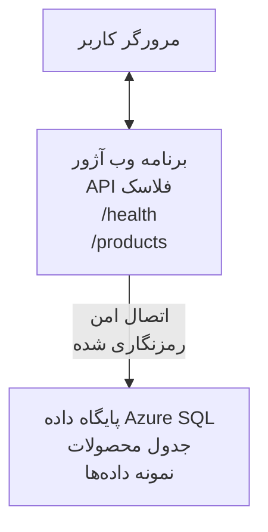

# استقرار یک پایگاه داده Microsoft SQL و برنامه وب با AZD

⏱️ **زمان تقریبی**: 20-30 دقیقه | 💰 **هزینه تقریبی**: ~$15-25/month | ⭐ **سطح دشواری**: متوسط

این **مثال کامل و عملی** نشان می‌دهد چگونه از [Azure Developer CLI (azd)](https://learn.microsoft.com/azure/developer/azure-developer-cli/) برای استقرار یک برنامه وب Python Flask همراه با یک پایگاه داده Microsoft SQL در Azure استفاده کنید. تمام کدها گنجانده شده و تست شده‌اند—هیچ وابستگی خارجی لازم نیست.

## آنچه خواهید آموخت

با تکمیل این مثال، شما:
- استقرار یک برنامه چند لایه (برنامه وب + پایگاه داده) با استفاده از زیرساخت به‌عنوان‌کد
- پیکربندی اتصالات امن به پایگاه داده بدون سخت‌کردن اسرار
- نظارت بر سلامت برنامه با Application Insights
- مدیریت کارآمد منابع Azure با AZD CLI
- دنبال‌کردن بهترین شیوه‌های Azure برای امنیت، بهینه‌سازی هزینه و قابل مشاهده بودن

## مرور سناریو
- **Web App**: API REST با Python Flask و قابلیت اتصال به پایگاه داده
- **Database**: Azure SQL Database با داده‌های نمونه
- **Infrastructure**: تهیه شده با استفاده از Bicep (قالب‌های ماژولار و قابل استفاده مجدد)
- **Deployment**: کاملاً خودکار با دستورات `azd`
- **Monitoring**: Application Insights برای لاگ‌ها و تله‌متری

## پیش‌نیازها

### ابزارهای مورد نیاز

قبل از شروع، بررسی کنید که این ابزارها نصب شده‌اند:

1. **[Azure CLI](https://learn.microsoft.com/cli/azure/install-azure-cli)** (نسخه 2.50.0 یا بالاتر)
   ```sh
   az --version
   # خروجی مورد انتظار: azure-cli 2.50.0 یا بالاتر
   ```

2. **[Azure Developer CLI (azd)](https://learn.microsoft.com/azure/developer/azure-developer-cli/install-azd)** (نسخه 1.0.0 یا بالاتر)
   ```sh
   azd version
   # خروجی مورد انتظار: azd نسخهٔ 1.0.0 یا بالاتر
   ```

3. **[Python 3.8+](https://www.python.org/downloads/)** (برای توسعه محلی)
   ```sh
   python --version
   # خروجی مورد انتظار: Python 3.8 یا بالاتر
   ```

4. **[Docker](https://www.docker.com/get-started)** (اختیاری، برای توسعه محلی کانتینری)
   ```sh
   docker --version
   # خروجی مورد انتظار: نسخهٔ داکر ۲۰.۱۰ یا بالاتر
   ```

### نیازمندی‌های Azure

- یک **اشتراک Azure فعال** ([create a free account](https://azure.microsoft.com/free/))
- دسترسی برای ایجاد منابع در اشتراک شما
- نقش **Owner** یا **Contributor** روی subscription یا resource group

### پیش‌نیازهای دانش

این یک مثال سطح **متوسط** است. شما باید با موارد زیر آشنا باشید:
- عملیات‌های پایه خط فرمان
- مفاهیم پایه ابر (منابع، resource groups)
- درک پایه‌ای از برنامه‌های وب و پایگاه‌های داده

**اگر با AZD آشنا نیستید؟** ابتدا با [Getting Started guide](../../docs/chapter-01-foundation/azd-basics.md) شروع کنید.

## معماری

این مثال یک معماری دو لایه شامل برنامه وب و پایگاه داده SQL را مستقر می‌کند:


**استقرار منابع:**
- **Resource Group**: محفظه‌ای برای تمامی منابع
- **App Service Plan**: میزبانی مبتنی بر Linux (tier B1 برای بهره‌وری هزینه)
- **Web App**: محیط اجرایی Python 3.11 با برنامه Flask
- **SQL Server**: سرور پایگاه داده مدیریت‌شده با حداقل TLS 1.2
- **SQL Database**: tier Basic (2GB، مناسب برای توسعه/آزمایش)
- **Application Insights**: نظارت و لاگ‌برداری
- **Log Analytics Workspace**: ذخیره‌سازی متمرکز لاگ‌ها

**مثال تمثیلی**: این را مانند یک رستوران تصور کنید (برنامه وب) با یک فریزر (پایگاه داده). مشتریان از منو سفارش می‌دهند (نقاط انتهایی API)، و آشپزخانه (برنامه Flask) مواد را از فریزر بیرون می‌آورد (داده‌ها). مدیر رستوران (Application Insights) همه چیز را پیگیری می‌کند.

## ساختار پوشه‌ها

تمام فایل‌ها در این مثال گنجانده شده‌اند—هیچ وابستگی خارجی لازم نیست:

```
examples/database-app/
│
├── README.md                    # This file
├── azure.yaml                   # AZD configuration file
├── .env.sample                  # Sample environment variables
├── .gitignore                   # Git ignore patterns
│
├── infra/                       # Infrastructure as Code (Bicep)
│   ├── main.bicep              # Main orchestration template
│   ├── abbreviations.json      # Azure naming conventions
│   └── resources/              # Modular resource templates
│       ├── sql-server.bicep    # SQL Server configuration
│       ├── sql-database.bicep  # Database configuration
│       ├── app-service-plan.bicep  # Hosting plan
│       ├── app-insights.bicep  # Monitoring setup
│       └── web-app.bicep       # Web application
│
└── src/
    └── web/                    # Application source code
        ├── app.py              # Flask REST API
        ├── requirements.txt    # Python dependencies
        └── Dockerfile          # Container definition
```

**هر فایل چه کاری انجام می‌دهد:**
- **azure.yaml**: به AZD می‌گوید چه چیزی را کجا مستقر کند
- **infra/main.bicep**: ارکستراسیون تمام منابع Azure
- **infra/resources/*.bicep**: تعریف‌های منابع تکی (ماژولار برای استفاده مجدد)
- **src/web/app.py**: برنامه Flask با منطق پایگاه داده
- **requirements.txt**: وابستگی‌های پکیج Python
- **Dockerfile**: دستورالعمل‌های کانتینرسازی برای استقرار

## راه‌اندازی سریع (گام‌به‌گام)

### گام 1: کلون و جابه‌جایی

```sh
git clone https://github.com/microsoft/AZD-for-beginners.git
cd AZD-for-beginners/examples/database-app
```

**✓ بررسی موفقیت**: بررسی کنید که `azure.yaml` و پوشه `infra/` را می‌بینید:
```sh
ls
# انتظار می‌رود: README.md، azure.yaml، infra/، src/
```

### گام 2: احراز هویت با Azure

```sh
azd auth login
```

این مرورگر شما را برای احراز هویت Azure باز می‌کند. با مشخصات Azure خود وارد شوید.

**✓ بررسی موفقیت**: شما باید مشاهده کنید:
```
Logged in to Azure.
```

### گام 3: مقداردهی اولیه محیط

```sh
azd init
```

**چه اتفاقی می‌افتد**: AZD یک پیکربندی محلی برای استقرار شما ایجاد می‌کند.

**پرسش‌هایی که مشاهده خواهید کرد**:
- **Environment name**: یک نام کوتاه وارد کنید (مثلاً `dev`, `myapp`)
- **Azure subscription**: اشتراک خود را از فهرست انتخاب کنید
- **Azure location**: یک منطقه انتخاب کنید (مثلاً `eastus`, `westeurope`)

**✓ بررسی موفقیت**: شما باید مشاهده کنید:
```
SUCCESS: New project initialized!
```

### گام 4: تأمین منابع Azure

```sh
azd provision
```

**چه اتفاقی می‌افتد**: AZD تمام زیرساخت را مستقر می‌کند (۵-۸ دقیقه طول می‌کشد):
1. ایجاد resource group
2. ایجاد SQL Server و Database
3. ایجاد App Service Plan
4. ایجاد Web App
5. ایجاد Application Insights
6. پیکربندی شبکه و امنیت

**از شما خواسته خواهد شد تا**:
- **SQL admin username**: یک نام کاربری وارد کنید (مثلاً `sqladmin`)
- **SQL admin password**: یک گذرواژه قوی وارد کنید (این را ذخیره کنید!)

**✓ بررسی موفقیت**: شما باید مشاهده کنید:
```
SUCCESS: Your application was provisioned in Azure in X minutes Y seconds.
You can view the resources created under the resource group rg-<env-name> in Azure Portal:
https://portal.azure.com/#@/resource/subscriptions/.../resourceGroups/rg-<env-name>
```

**⏱️ زمان**: 5-8 دقیقه

### گام 5: استقرار برنامه

```sh
azd deploy
```

**چه اتفاقی می‌افتد**: AZD برنامه Flask شما را می‌سازد و مستقر می‌کند:
1. بسته‌بندی برنامه Python
2. ساخت کانتینر Docker
3. ارسال به Azure Web App
4. مقداردهی اولیه پایگاه داده با داده‌های نمونه
5. راه‌اندازی برنامه

**✓ بررسی موفقیت**: شما باید مشاهده کنید:
```
SUCCESS: Your application was deployed to Azure in X minutes Y seconds.
You can view the resources created under the resource group rg-<env-name> in Azure Portal:
https://portal.azure.com/#@/resource/subscriptions/.../resourceGroups/rg-<env-name>
```

**⏱️ زمان**: 3-5 دقیقه

### گام 6: مرور برنامه

```sh
azd browse
```

این برنامه وب مستقرشده شما را در مرورگر باز می‌کند در آدرس `https://app-<unique-id>.azurewebsites.net`

**✓ بررسی موفقیت**: شما باید خروجی JSON را مشاهده کنید:
```json
{
  "message": "Welcome to the Database App API",
  "endpoints": {
    "/": "This help message",
    "/health": "Health check endpoint",
    "/products": "List all products",
    "/products/<id>": "Get product by ID"
  }
}
```

### گام 7: آزمایش نقاط انتهایی API

**بررسی سلامت** (اتصال به پایگاه داده را بررسی کنید):
```sh
curl https://app-<your-id>.azurewebsites.net/health
```

**پاسخ مورد انتظار**:
```json
{
  "status": "healthy",
  "database": "connected"
}
```

**لیست محصولات** (داده نمونه):
```sh
curl https://app-<your-id>.azurewebsites.net/products
```

**پاسخ مورد انتظار**:
```json
[
  {
    "id": 1,
    "name": "Laptop",
    "description": "High-performance laptop",
    "price": 1299.99,
    "created_at": "2025-11-19T10:30:00"
  },
  ...
]
```

**دریافت یک محصول**:
```sh
curl https://app-<your-id>.azurewebsites.net/products/1
```

**✓ بررسی موفقیت**: همه نقاط انتهایی داده‌های JSON را بدون خطا بازمی‌گردانند.

---

**🎉 تبریک!** شما با موفقیت یک برنامه وب با پایگاه داده را با استفاده از AZD در Azure مستقر کردید.

## بررسی عمیق پیکربندی

### متغیرهای محیطی

اسرار به‌صورت ایمن از طریق پیکربندی App Service در Azure مدیریت می‌شوند—**هرگز در کد منبع سخت‌نگاری نشوند**.

**به‌صورت خودکار توسط AZD پیکربندی می‌شوند**:
- `SQL_CONNECTION_STRING`: اتصال پایگاه داده با اعتبارنامه‌های رمزنگاری‌شده
- `APPLICATIONINSIGHTS_CONNECTION_STRING`: نقطه انتهایی تله‌متری نظارت
- `SCM_DO_BUILD_DURING_DEPLOYMENT`: فعال‌سازی نصب خودکار وابستگی‌ها

**اسرار کجا ذخیره می‌شوند**:
1. در طی `azd provision`، شما اعتبارنامه‌های SQL را از طریق پرسش‌های امن ارائه می‌دهید
2. AZD این موارد را در فایل محلی `.azure/<env-name>/.env` ذخیره می‌کند (در Git نادیده گرفته شده)
3. AZD آن‌ها را در پیکربندی App Service در Azure وارد می‌کند (رمزنگاری‌شده در حالت استراحت)
4. برنامه آن‌ها را در زمان اجرا از طریق `os.getenv()` می‌خواند

### توسعه محلی

برای آزمایش محلی، از نمونه یک فایل `.env` بسازید:

```sh
cp .env.sample .env
# فایل .env را با اطلاعات اتصال به پایگاه‌داده محلی خود ویرایش کنید
```

**گردش کار توسعه محلی**:
```sh
# نصب وابستگی‌ها
cd src/web
pip install -r requirements.txt

# تنظیم متغیرهای محیطی
export SQL_CONNECTION_STRING="your-local-connection-string"

# اجرای برنامه
python app.py
```

**آزمایش به‌صورت محلی**:
```sh
curl http://localhost:8000/health
# انتظار می‌رود: {"status": "سالم", "database": "متصل"}
```

### زیرساخت به‌عنوان کد

تمام منابع Azure در **قالب‌های Bicep** (`infra/` پوشه) تعریف شده‌اند:

- **طراحی ماژولار**: هر نوع منبع فایل مخصوص خود را برای قابلیت استفاده مجدد دارد
- **پارامتردهی‌شده**: SKUها، منطقه‌ها، و قوانین نام‌گذاری را سفارشی کنید
- **بهترین شیوه‌ها**: از استانداردهای نام‌گذاری و پیش‌فرض‌های امنیتی Azure پیروی می‌کند
- **کنترل نسخه**: تغییرات زیرساخت در Git پیگیری می‌شوند

**مثال سفارشی‌سازی**:
برای تغییر tier پایگاه داده، فایل `infra/resources/sql-database.bicep` را ویرایش کنید:
```bicep
sku: {
  name: 'Standard'  // Changed from 'Basic'
  tier: 'Standard'
  capacity: 10
}
```

## بهترین شیوه‌های امنیتی

این مثال از بهترین شیوه‌های امنیتی Azure پیروی می‌کند:

### 1. **عدم قرار دادن اسرار در کد منبع**
- ✅ اعتبارنامه‌ها در پیکربندی App Service در Azure ذخیره می‌شوند (رمزنگاری شده)
- ✅ فایل‌های `.env` از طریق `.gitignore` از Git خارج شده‌اند
- ✅ اسرار در طول تأمین از طریق پارامترهای امن منتقل می‌شوند

### 2. **اتصالات رمزنگاری‌شده**
- ✅ حداقل TLS 1.2 برای SQL Server
- ✅ HTTPS تنها برای Web App اعمال شده است
- ✅ اتصالات پایگاه داده از کانال‌های رمزنگاری‌شده استفاده می‌کنند

### 3. **امنیت شبکه**
- ✅ فایروال SQL Server پیکربندی شده است تا فقط خدمات Azure مجاز باشند
- ✅ دسترسی شبکه عمومی محدود شده است (می‌توان با Private Endpoints بیشتر محدود کرد)
- ✅ FTPS روی Web App غیرفعال است

### 4. **تأیید هویت و مجوزدهی**
- ⚠️ **وضعیت کنونی**: احراز هویت SQL (username/password)
- ✅ **توصیه برای تولید**: استفاده از Managed Identity برای احراز هویت بدون گذرواژه

**برای ارتقاء به Managed Identity** (برای محیط تولید):
1. فعال‌سازی managed identity روی Web App
2. اعطای دسترسی‌های مورد نیاز به identity برای SQL
3. بروز‌رسانی connection string برای استفاده از managed identity
4. حذف احراز هویت مبتنی بر گذرواژه

### 5. **حسابرسی و تطابق**
- ✅ Application Insights تمام درخواست‌ها و خطاها را لاگ می‌کند
- ✅ حسابرسی SQL Database فعال است (قابل پیکربندی برای انطباق)
- ✅ تمام منابع برای حاکمیت تگ‌گذاری شده‌اند

**چک‌لیست امنیتی قبل از تولید**:
- [ ] فعال‌سازی Azure Defender برای SQL
- [ ] پیکربندی Private Endpoints برای SQL Database
- [ ] فعال‌سازی Web Application Firewall (WAF)
- [ ] پیاده‌سازی Azure Key Vault برای گردش اسرار
- [ ] پیکربندی احراز هویت Azure AD
- [ ] فعال‌سازی لاگ‌برداری تشخیصی برای تمام منابع

## بهینه‌سازی هزینه

**هزینه‌های ماهانه تخمینی** (تا نوامبر 2025):

| Resource | SKU/Tier | Estimated Cost |
|----------|----------|----------------|
| App Service Plan | B1 (Basic) | ~$13/month |
| SQL Database | Basic (2GB) | ~$5/month |
| Application Insights | Pay-as-you-go | ~$2/month (low traffic) |
| **Total** | | **~$20/month** |

**💡 نکات صرفه‌جویی در هزینه**:

1. **استفاده از Tier رایگان برای یادگیری**:
   - App Service: tier F1 (رایگان، ساعات محدود)
   - SQL Database: استفاده از Azure SQL Database serverless
   - Application Insights: 5GB/ماه ورودی رایگان

2. **خاموش کردن منابع زمانی که استفاده نمی‌شوند**:
   ```sh
   # اپلیکیشن وب را متوقف کنید (پایگاه‌داده همچنان هزینه دارد)
   az webapp stop --name <app-name> --resource-group <rg-name>
   
   # در صورت نیاز دوباره راه‌اندازی کنید
   az webapp start --name <app-name> --resource-group <rg-name>
   ```

3. **حذف همه چیز پس از آزمایش**:
   ```sh
   azd down
   ```
   این تمام منابع را حذف کرده و هزینه‌ها را متوقف می‌کند.

4. **SKUهای توسعه در برابر تولید**:
   - **توسعه**: tier Basic (استفاده‌شده در این مثال)
   - **تولید**: tier Standard/Premium با افزونگی

**نظارت بر هزینه**:
- مشاهده هزینه‌ها در [Azure Cost Management](https://portal.azure.com/#view/Microsoft_Azure_CostManagement)
- تنظیم هشدارهای هزینه برای جلوگیری از شگفتی‌ها
- برچسب‌زدن تمام منابع با `azd-env-name` برای ردیابی

**جایگزین Tier رایگان**:
برای اهداف آموزشی، می‌توانید `infra/resources/app-service-plan.bicep` را تغییر دهید:
```bicep
sku: {
  name: 'F1'  // Free tier
  tier: 'Free'
}
```
**توجه**: Tier رایگان محدودیت‌هایی دارد (60 دقیقه/روز CPU، عدم always-on).

## نظارت و قابلیت مشاهده

### ادغام Application Insights

این مثال شامل **Application Insights** برای نظارت جامع است:

**چه چیزهایی تحت نظارت قرار می‌گیرند**:
- ✅ درخواست‌های HTTP (تاخیر، کدهای وضعیت، نقاط انتهایی)
- ✅ خطاها و استثناهای برنامه
- ✅ لاگ‌های سفارشی از برنامه Flask
- ✅ سلامت اتصال پایگاه داده
- ✅ معیارهای عملکرد (CPU، حافظه)

**دسترسی به Application Insights**:
1. باز کردن [Azure Portal](https://portal.azure.com)
2. رفتن به resource group شما (`rg-<env-name>`)
3. کلیک روی منبع Application Insights (`appi-<unique-id>`)

**پرس و جوهای مفید** (Application Insights → Logs):

**مشاهده همه درخواست‌ها**:
```kusto
requests
| where timestamp > ago(1h)
| order by timestamp desc
| project timestamp, name, url, resultCode, duration
```

**یافتن خطاها**:
```kusto
exceptions
| where timestamp > ago(24h)
| order by timestamp desc
| project timestamp, type, outerMessage, operation_Name
```

**بررسی نقطه سلامت**:
```kusto
requests
| where name contains "health"
| summarize count() by resultCode, bin(timestamp, 1h)
```

### حسابرسی پایگاه داده SQL

**حسابرسی SQL Database فعال است** تا موارد زیر را دنبال کند:
- الگوهای دسترسی به پایگاه داده
- تلاش‌های ناموفق برای ورود
- تغییرات اسکیما
- دسترسی به داده‌ها (برای انطباق)

**دسترسی به لاگ‌های حسابرسی**:
1. Azure Portal → SQL Database → Auditing
2. مشاهده لاگ‌ها در Log Analytics workspace

### نظارت زمان واقعی

**مشاهده متریک‌های زنده**:
1. Application Insights → Live Metrics
2. مشاهده درخواست‌ها، شکست‌ها و عملکرد در زمان واقعی

**راه‌اندازی هشدارها**:
هشدارهایی برای رخدادهای بحرانی ایجاد کنید:
- خطاهای HTTP 500 > 5 در 5 دقیقه
- شکست‌های اتصال به پایگاه داده
- زمان پاسخ بالا (>2 ثانیه)

**مثال ایجاد هشدار**:
```sh
az monitor metrics alert create \
  --name "High-Response-Time" \
  --resource-group <rg-name> \
  --scopes <app-insights-resource-id> \
  --condition "avg requests/duration > 2000" \
  --description "Alert when response time exceeds 2 seconds"
```

## عیب‌یابی
### مسائل رایج و راه‌حل‌ها

#### 1. `azd provision` با خطای "Location not available" شکست می‌خورد

**نشانه**:
```
Error: The subscription is not registered for the resource type 'components' in the location 'centralus'.
```

**راه‌حل**:
یک منطقه Azure متفاوت انتخاب کنید یا ارائه‌دهنده منابع را ثبت کنید:
```sh
az provider register --namespace Microsoft.Insights
```

#### 2. اتصال SQL در حین استقرار ناموفق است

**نشانه**:
```
pyodbc.OperationalError: ('08001', '[08001] [Microsoft][ODBC Driver 18 for SQL Server]TCP Provider...')
```

**راه‌حل**:
- مطمئن شوید فایروال SQL Server اجازه دسترسی سرویس‌های Azure را می‌دهد (به‌طور خودکار پیکربندی می‌شود)
- بررسی کنید رمز عبور مدیر SQL هنگام `azd provision` به‌درستی وارد شده باشد
- اطمینان حاصل کنید SQL Server کاملاً provision شده است (ممکن است 2-3 دقیقه طول بکشد)

**بررسی اتصال**:
```sh
# از پورتال Azure به SQL Database → ویرایشگر پرس‌وجو بروید
# سعی کنید با اطلاعات کاربری خود متصل شوید
```

#### 3. نمایش "Application Error" در وب اپ

**نشانه**:
مرورگر صفحه خطای عمومی نشان می‌دهد.

**راه‌حل**:
لاگ‌های برنامه را بررسی کنید:
```sh
# مشاهده گزارش‌های اخیر
az webapp log tail --name <app-name> --resource-group <rg-name>
```

**علل رایج**:
- متغیرهای محیطی گم‌شده (در App Service → Configuration بررسی کنید)
- نصب پکیج پایتون موفق نبوده است (لاگ‌های استقرار را بررسی کنید)
- خطای راه‌اندازی دیتابیس (اتصال SQL را بررسی کنید)

#### 4. `azd deploy` با "Build Error" شکست می‌خورد

**نشانه**:
```
Error: Failed to build project
```

**راه‌حل**:
- مطمئن شوید `requirements.txt` خطای نحوی ندارد
- بررسی کنید Python 3.11 در `infra/resources/web-app.bicep` مشخص شده باشد
- اطمینان حاصل کنید Dockerfile تصویر پایه صحیح دارد

**اشکال‌زدایی محلی**:
```sh
cd src/web
docker build -t test-app .
docker run -p 8000:8000 test-app
```

#### 5. هنگام اجرای دستورات AZD پیام "Unauthorized" دریافت می‌شود

**نشانه**:
```
ERROR: (Unauthorized) The client '<id>' with object id '<id>' does not have authorization
```

**راه‌حل**:
دوباره با Azure احراز هویت کنید:
```sh
azd auth login
az login
```

مطمئن شوید دسترسی‌های صحیح را روی اشتراک دارید (نقش Contributor).

#### 6. هزینه‌های بالای دیتابیس

**نشانه**:
صورتحساب غیرمنتظره Azure.

**راه‌حل**:
- بررسی کنید بعد از تست فراموش نکرده‌اید `azd down` را اجرا کنید
- اطمینان حاصل کنید SQL Database در سطح Basic است (نه Premium)
- هزینه‌ها را در Azure Cost Management بازبینی کنید
- هشدارهای هزینه‌ای تنظیم کنید

### دریافت کمک

**مشاهده تمام متغیرهای محیطی AZD**:
```sh
azd env get-values
```

**بررسی وضعیت استقرار**:
```sh
az webapp show --name <app-name> --resource-group <rg-name> --query state
```

**دسترسی به لاگ‌های برنامه**:
```sh
az webapp log download --name <app-name> --resource-group <rg-name> --log-file app-logs.zip
```

**نیاز به کمک بیشتر؟**
- [راهنمای عیب‌یابی AZD](../../docs/chapter-07-troubleshooting/common-issues.md)
- [عیب‌یابی Azure App Service](https://learn.microsoft.com/azure/app-service/troubleshoot-diagnostic-logs)
- [عیب‌یابی Azure SQL](https://learn.microsoft.com/azure/azure-sql/database/troubleshoot-common-errors-issues)

## تمرین‌های عملی

### تمرین 1: صحت‌سنجی استقرار شما (مبتدی)

**هدف**: تأیید اینکه همه منابع مستقر شده‌اند و برنامه در حال کار است.

**مراحل**:
1. همه منابع در گروه منابع خود را لیست کنید:
   ```sh
   az resource list --resource-group rg-<env-name> --output table
   ```
   **انتظار**: 6-7 منبع (Web App, SQL Server, SQL Database, App Service Plan, Application Insights, Log Analytics)

2. همه نقاط پایان API را تست کنید:
   ```sh
   curl https://app-<your-id>.azurewebsites.net/
   curl https://app-<your-id>.azurewebsites.net/health
   curl https://app-<your-id>.azurewebsites.net/products
   curl https://app-<your-id>.azurewebsites.net/products/1
   ```
   **انتظار**: همه پاسخ‌ها JSON معتبر بدون خطا برمی‌گردانند

3. Application Insights را بررسی کنید:
   - به Application Insights در Azure Portal بروید
   - به "Live Metrics" بروید
   - مرورگر خود را روی وب اپ تازه‌سازی کنید
   **انتظار**: در زمان واقعی درخواست‌ها را مشاهده کنید

**معیار موفقیت**: همه 6-7 منبع موجود باشند، همه نقاط پایان داده برگردانند، Live Metrics فعالیت را نشان دهد.

---

### تمرین 2: افزودن یک نقطه پایان API جدید (متوسط)

**هدف**: توسعه برنامه Flask با یک نقطه پایان جدید.

**کد شروع‌کننده**: نقاط پایان فعلی در `src/web/app.py`

**مراحل**:
1. فایل `src/web/app.py` را ویرایش کنید و بعد از تابع `get_product()` یک نقطه پایان جدید اضافه کنید:
   ```python
   @app.route('/products/search/<keyword>')
   def search_products(keyword):
       """Search products by name or description."""
       try:
           conn = get_db_connection()
           cursor = conn.cursor()
           cursor.execute(
               "SELECT id, name, description, price, created_at FROM products WHERE name LIKE ? OR description LIKE ?",
               (f'%{keyword}%', f'%{keyword}%')
           )
           
           products = []
           for row in cursor.fetchall():
               products.append({
                   'id': row[0],
                   'name': row[1],
                   'description': row[2],
                   'price': float(row[3]) if row[3] else None,
                   'created_at': row[4].isoformat() if row[4] else None
               })
           
           cursor.close()
           conn.close()
           
           logger.info(f"Search for '{keyword}' returned {len(products)} results")
           return jsonify(products), 200
           
       except Exception as e:
           logger.error(f"Error searching products: {str(e)}")
           return jsonify({'error': str(e)}), 500
   ```

2. برنامه به‌روزشده را مستقر کنید:
   ```sh
   azd deploy
   ```

3. نقطه پایان جدید را تست کنید:
   ```sh
   curl https://app-<your-id>.azurewebsites.net/products/search/laptop
   ```
   **انتظار**: محصولاتی که با "laptop" مطابقت دارند را برمی‌گرداند

**معیار موفقیت**: نقطه پایان جدید کار می‌کند، نتایج فیلترشده را برمی‌گرداند، در لاگ‌های Application Insights ظاهر می‌شود.

---

### تمرین 3: افزودن مانیتورینگ و هشدارها (پیشرفته)

**هدف**: راه‌اندازی مانیتورینگ پیشگیرانه با هشدارها.

**مراحل**:
1. یک هشدار برای خطاهای HTTP 500 ایجاد کنید:
   ```sh
   # شناسهٔ منبع Application Insights را دریافت کنید
   AI_ID=$(az monitor app-insights component show \
     --app appi-<your-id> \
     --resource-group rg-<env-name> \
     --query id -o tsv)
   
   # ایجاد هشدار
   az monitor metrics alert create \
     --name "High-Error-Rate" \
     --resource-group rg-<env-name> \
     --scopes $AI_ID \
     --condition "count requests/failed > 5" \
     --window-size 5m \
     --evaluation-frequency 1m \
     --description "Alert when >5 failed requests in 5 minutes"
   ```

2. با ایجاد خطاها هشدار را فعال کنید:
   ```sh
   # درخواست محصولی که وجود ندارد
   for i in {1..10}; do curl https://app-<your-id>.azurewebsites.net/products/999; done
   ```

3. بررسی کنید که هشدار فعال شده است یا خیر:
   - Azure Portal → Alerts → Alert Rules
   - ایمیل خود را بررسی کنید (اگر پیکربندی شده باشد)

**معیار موفقیت**: قانون هشدار ایجاد شده، در صورت خطا فعال می‌شود، اعلان‌ها دریافت می‌شوند.

---

### تمرین 4: تغییرات ساختار دیتابیس (پیشرفته)

**هدف**: افزودن یک جدول جدید و تغییر برنامه برای استفاده از آن.

**مراحل**:
1. از طریق Query Editor در Azure Portal به SQL Database متصل شوید

2. یک جدول جدید `categories` ایجاد کنید:
   ```sql
   CREATE TABLE categories (
       id INT PRIMARY KEY IDENTITY(1,1),
       name NVARCHAR(50) NOT NULL,
       description NVARCHAR(200)
   );
   
   INSERT INTO categories (name, description) VALUES
   ('Electronics', 'Electronic devices and accessories'),
   ('Office Supplies', 'Office equipment and supplies');
   
   -- Add category to products table
   ALTER TABLE products ADD category_id INT;
   UPDATE products SET category_id = 1; -- Set all to Electronics
   ```

3. `src/web/app.py` را بروز کنید تا اطلاعات دسته‌بندی را در پاسخ‌ها شامل کند

4. مستقر کرده و تست کنید

**معیار موفقیت**: جدول جدید وجود دارد، محصولات اطلاعات دسته‌بندی را نشان می‌دهند، برنامه همچنان کار می‌کند.

---

### تمرین 5: پیاده‌سازی کش (حرفه‌ای)

**هدف**: افزودن Azure Redis Cache برای بهبود عملکرد.

**مراحل**:
1. Redis Cache را به `infra/main.bicep` اضافه کنید
2. `src/web/app.py` را بروز کنید تا کوئری‌های محصولات را کش کند
3. بهبود عملکرد را با Application Insights اندازه‌گیری کنید
4. زمان‌های پاسخ قبل/بعد از کش را مقایسه کنید

**معیار موفقیت**: Redis مستقر شده، کش کار می‌کند، زمان پاسخ‌ها بیش از 50% بهبود یافته است.

**نکته**: با [مستندات Azure Cache for Redis](https://learn.microsoft.com/azure/azure-cache-for-redis/) شروع کنید.

---

## پاک‌سازی

برای اجتناب از هزینه‌های مداوم، پس از اتمام همه منابع را حذف کنید:

```sh
azd down
```

**پیغام تأیید**:
```
? Total resources to delete: 7, are you sure you want to continue? (y/N)
```

عبارت `y` را تایپ کنید تا تأیید شود.

**✓ بررسی موفقیت**: 
- همه منابع از Azure Portal حذف شده‌اند
- هیچ هزینه مداومی وجود ندارد
- پوشه محلی `.azure/<env-name>` قابل حذف است

**جایگزین** (نگه داشتن زیرساخت، حذف داده‌ها):
```sh
# فقط گروه منابع را حذف کنید (پیکربندی AZD را نگه دارید)
az group delete --name rg-<env-name> --yes
```
## اطلاعات بیشتر

### مستندات مرتبط
- [مستندات Azure Developer CLI](https://learn.microsoft.com/azure/developer/azure-developer-cli/)
- [مستندات Azure SQL Database](https://learn.microsoft.com/azure/azure-sql/database/)
- [مستندات Azure App Service](https://learn.microsoft.com/azure/app-service/)
- [مستندات Application Insights](https://learn.microsoft.com/azure/azure-monitor/app/app-insights-overview)
- [مرجع زبان Bicep](https://learn.microsoft.com/azure/azure-resource-manager/bicep/)

### گام‌های بعدی در این دوره
- **[نمونه Container Apps](../../../../examples/container-app)**: استقرار میکروسرویس‌ها با Azure Container Apps
- **[راهنمای یکپارچه‌سازی AI](../../../../docs/ai-foundry)**: افزودن قابلیت‌های هوش مصنوعی به برنامه شما
- **[راهنمای بهترین شیوه‌های استقرار](../../docs/chapter-04-infrastructure/deployment-guide.md)**: الگوهای استقرار در محیط تولید

### موضوعات پیشرفته
- **Managed Identity**: حذف رمزها و استفاده از احراز هویت Azure AD
- **Private Endpoints**: امن‌سازی اتصالات دیتابیس درون یک شبکه مجازی
- **ادغام CI/CD**: خودکارسازی استقرارها با GitHub Actions یا Azure DevOps
- **چند محیطی**: راه‌اندازی محیط‌های dev, staging و production
- **مهاجرت‌های دیتابیس**: استفاده از Alembic یا Entity Framework برای نسخه‌بندی اسکیمای دیتابیس

### مقایسه با رویکردهای دیگر

**AZD در مقابل ARM Templates**:
- ✅ AZD: انتزاع سطح بالاتر، دستورات ساده‌تر
- ⚠️ ARM: پرحجم‌تر، کنترل جزئی‌تر

**AZD در مقابل Terraform**:
- ✅ AZD: بومی Azure، یکپارچه با سرویس‌های Azure
- ⚠️ Terraform: پشتیبانی چندابری، اکوسیستم بزرگ‌تر

**AZD در مقابل Azure Portal**:
- ✅ AZD: قابل تکرار، نسخه‌بندی‌شده، قابل خودکارسازی
- ⚠️ Portal: کلیک‌های دستی، دشوار برای بازتولید

**AZD را این‌گونه تصور کنید**: Docker Compose برای Azure—پیکربندی ساده‌شده برای استقرارهای پیچیده.

---

## پرسش‌های متداول

**Q: آیا می‌توانم از یک زبان برنامه‌نویسی متفاوت استفاده کنم؟**  
A: بله! `src/web/` را با Node.js، C#، Go یا هر زبان دیگری جایگزین کنید. `azure.yaml` و Bicep را متناسب به‌روزرسانی کنید.

**Q: چگونه می‌توانم دیتابیس‌های بیشتری اضافه کنم؟**  
A: یک ماژول SQL Database دیگر در `infra/main.bicep` اضافه کنید یا از PostgreSQL/MySQL از سرویس‌های دیتابیس Azure استفاده کنید.

**Q: آیا می‌توانم از این برای تولید استفاده کنم؟**  
A: این یک نقطه شروع است. برای تولید، موارد زیر را اضافه کنید: managed identity، private endpoints، افزونگی، استراتژی بکاپ، WAF و مانیتورینگ ارتقا یافته.

**Q: اگر بخواهم به جای استقرار کد از کانتینر استفاده کنم چه؟**  
A: نمونه [Container Apps Example](../../../../examples/container-app) را ببینید که در آن از کانتینرهای Docker در سراسر جریان استفاده می‌شود.

**Q: چگونه از ماشین محلی خود به دیتابیس متصل شوم؟**  
A: IP خود را به فایروال SQL Server اضافه کنید:
```sh
az sql server firewall-rule create \
  --resource-group rg-<env-name> \
  --server sql-<unique-id> \
  --name AllowMyIP \
  --start-ip-address <your-ip> \
  --end-ip-address <your-ip>
```

**Q: آیا می‌توانم از یک دیتابیس موجود به جای ایجاد دیتابیس جدید استفاده کنم؟**  
A: بله، `infra/main.bicep` را تغییر دهید تا به یک SQL Server موجود اشاره کند و پارامترهای رشته اتصال را به‌روزرسانی کنید.

---

> **نکته:** این مثال بهترین شیوه‌ها برای استقرار یک وب اپ با دیتابیس با استفاده از AZD را نشان می‌دهد. شامل کد کاری، مستندات جامع و تمرین‌های عملی برای تقویت یادگیری است. برای استقرارهای تولیدی، امنیت، مقیاس‌پذیری، تطابق و نیازمندی‌های هزینه‌ای خاص سازمان خود را مرور کنید.

**📚 ناوبری دوره:**
- ← قبلی: [نمونه Container Apps](../../../../examples/container-app)
- → بعدی: [راهنمای یکپارچه‌سازی AI](../../../../docs/ai-foundry)
- 🏠 [صفحه اصلی دوره](../../README.md)

---

<!-- CO-OP TRANSLATOR DISCLAIMER START -->
**سلب مسئولیت**:
این سند با استفاده از سرویس ترجمهٔ هوش مصنوعی [Co-op Translator](https://github.com/Azure/co-op-translator) ترجمه شده است. در حالی که ما در تلاش برای دقت هستیم، لطفاً توجه داشته باشید که ترجمه‌های خودکار ممکن است حاوی اشتباهات یا نادرستی‌هایی باشند. سند اصلی به زبان مادری خود باید به عنوان منبع معتبر در نظر گرفته شود. برای اطلاعات حیاتی، ترجمهٔ حرفه‌ای انسانی توصیه می‌شود. ما در قبال هر گونه سوءتفاهم یا تفسیر نادرست ناشی از استفاده از این ترجمه مسئولیت نداریم.
<!-- CO-OP TRANSLATOR DISCLAIMER END -->