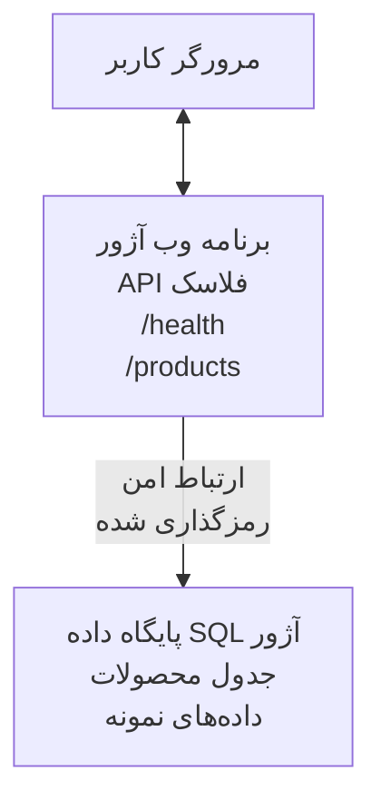

# Deploying a Microsoft SQL Database and Web App with AZD

⏱️ **زمان تقریبی**: 20-30 دقیقه | 💰 **هزینه تقریبی**: ~$15-25/month | ⭐ **پیچیدگی**: متوسط

این مثالِ کامل و عملی نشان می‌دهد چگونه از [Azure Developer CLI (azd)](https://learn.microsoft.com/azure/developer/azure-developer-cli/) برای استقرار یک برنامه وب Python Flask همراه با پایگاه داده Microsoft SQL در Azure استفاده کنید. تمامی کدها گنجانده و تست شده‌اند — نیازی به وابستگی‌های خارجی نیست.

## آنچه خواهید آموخت

با تکمیل این مثال، شما:
- یک برنامه چندلایه (وب‌اپ + پایگاه داده) را با استفاده از infrastructure-as-code مستقر می‌کنید
- پیکربندی اتصالات امن به پایگاه داده بدون جاسازی اسرار در کد
- سلامت برنامه را با Application Insights پایش می‌کنید
- منابع Azure را به‌صورت کارآمد با AZD CLI مدیریت می‌کنید
- از بهترین شیوه‌های Azure برای امنیت، بهینه‌سازی هزینه و قابلیت مشاهده پیروی می‌کنید

## نمای کلی سناریو
- **وب اپ**: API REST با Python Flask و اتصال به پایگاه داده
- **پایگاه داده**: Azure SQL Database با داده نمونه
- **زیرساخت**: تهیه‌شده با Bicep (الگوهای مدولار و قابل استفاده مجدد)
- **استقرار**: کاملاً خودکار با دستورات `azd`
- **مانیتورینگ**: Application Insights برای لاگ‌ها و تله‌متری

## پیش‌نیازها

### ابزارهای موردنیاز

پیش از شروع، بررسی کنید این ابزارها را نصب دارید:

1. **[Azure CLI](https://learn.microsoft.com/cli/azure/install-azure-cli)** (نسخه 2.50.0 یا بالاتر)
   ```sh
   az --version
   # خروجی مورد انتظار: azure-cli نسخهٔ 2.50.0 یا بالاتر
   ```

2. **[Azure Developer CLI (azd)](https://learn.microsoft.com/azure/developer/azure-developer-cli/install-azd)** (نسخه 1.0.0 یا بالاتر)
   ```sh
   azd version
   # خروجی مورد انتظار: نسخه azd 1.0.0 یا بالاتر
   ```

3. **[Python 3.8+](https://www.python.org/downloads/)** (برای توسعه محلی)
   ```sh
   python --version
   # خروجی مورد انتظار: پایتون ۳.۸ یا نسخهٔ بالاتر
   ```

4. **[Docker](https://www.docker.com/get-started)** (اختیاری، برای توسعه محلی کانتینری)
   ```sh
   docker --version
   # خروجی مورد انتظار: نسخهٔ Docker ۲۰.۱۰ یا بالاتر
   ```

### نیازمندی‌های Azure

- یک **اشتراک Azure** فعال ([create a free account](https://azure.microsoft.com/free/))
- مجوزهای ایجاد منابع در اشتراک شما
- نقش **Owner** یا **Contributor** در سطح اشتراک یا گروه منابع

### پیش‌نیازهای دانشی

این یک مثال در سطح **متوسط** است. باید با موارد زیر آشنا باشید:
- عملیات پایه خط فرمان
- مفاهیم پایه ابر (منابع، گروه‌های منابع)
- درک پایه‌ای از برنامه‌های وب و پایگاه‌های داده

**جدید با AZD؟** از راهنمای [Getting Started](../../docs/chapter-01-foundation/azd-basics.md) آغاز کنید.

## معماری

این مثال یک معماری دو لایه شامل وب اپ و پایگاه داده SQL مستقر می‌کند:


**استقرار منابع:**
- **Resource Group**: کانتینر برای همه منابع
- **App Service Plan**: میزبانی مبتنی بر لینوکس (رده B1 برای بهینگی هزینه)
- **Web App**: runtime Python 3.11 با برنامه Flask
- **SQL Server**: سرور پایگاه داده مدیریت‌شده با حداقل TLS 1.2
- **SQL Database**: رده Basic (2GB، مناسب توسعه/آزمایش)
- **Application Insights**: پایش و لاگ‌برداری
- **Log Analytics Workspace**: ذخیره‌سازی متمرکز لاگ‌ها

**تشبیه**: این را مانند یک رستوران در نظر بگیرید (وب اپ) با یک فریزر بزرگ (پایگاه داده). مشتریان از منو سفارش می‌دهند (endpointهای API)، و آشپزخانه (اپ Flask) مواد را از فریزر بیرون می‌آورد. مدیر رستوران (Application Insights) همه چیز را پیگیری می‌کند.

## ساختار پوشه

تمام فایل‌ها در این مثال گنجانده شده‌اند — نیازی به وابستگی‌های خارجی نیست:

```
examples/database-app/
│
├── README.md                    # This file
├── azure.yaml                   # AZD configuration file
├── .env.sample                  # Sample environment variables
├── .gitignore                   # Git ignore patterns
│
├── infra/                       # Infrastructure as Code (Bicep)
│   ├── main.bicep              # Main orchestration template
│   ├── abbreviations.json      # Azure naming conventions
│   └── resources/              # Modular resource templates
│       ├── sql-server.bicep    # SQL Server configuration
│       ├── sql-database.bicep  # Database configuration
│       ├── app-service-plan.bicep  # Hosting plan
│       ├── app-insights.bicep  # Monitoring setup
│       └── web-app.bicep       # Web application
│
└── src/
    └── web/                    # Application source code
        ├── app.py              # Flask REST API
        ├── requirements.txt    # Python dependencies
        └── Dockerfile          # Container definition
```

**هر فایل چه کاری انجام می‌دهد:**
- **azure.yaml**: به AZD می‌گوید چه چیزی را مستقر کند و کجا
- **infra/main.bicep**: هماهنگ‌کنندهٔ تمام منابع Azure
- **infra/resources/*.bicep**: تعریف‌های جداگانه منابع (مدولار برای استفاده مجدد)
- **src/web/app.py**: برنامه Flask با منطق پایگاه داده
- **requirements.txt**: وابستگی‌های پکیج Python
- **Dockerfile**: دستورالعمل‌های کانتینریزاسیون برای استقرار

## شروع سریع (گام‌به‌گام)

### گام 1: کلون و ورود به مسیر

```sh
git clone https://github.com/microsoft/AZD-for-beginners.git
cd AZD-for-beginners/examples/database-app
```

**✓ بررسی موفقیت**: مطمئن شوید `azure.yaml` و پوشه `infra/` را مشاهده می‌کنید:
```sh
ls
# انتظار می‌رود: README.md, azure.yaml, infra/, src/
```

### گام 2: احراز هویت با Azure

```sh
azd auth login
```

این مرورگر شما را برای احراز هویت Azure باز می‌کند. با اطلاعات حساب Azure وارد شوید.

**✓ بررسی موفقیت**: شما باید ببینید:
```
Logged in to Azure.
```

### گام 3: مقداردهی اولیه محیط

```sh
azd init
```

**چه اتفاقی می‌افتد**: AZD یک پیکربندی محلی برای استقرار شما ایجاد می‌کند.

**رمزپرسش‌هایی که می‌بینید**:
- **Environment name**: یک نام کوتاه وارد کنید (مثلاً `dev`, `myapp`)
- **Azure subscription**: اشتراک خود را از لیست انتخاب کنید
- **Azure location**: یک منطقه انتخاب کنید (مثلاً `eastus`, `westeurope`)

**✓ بررسی موفقیت**: شما باید ببینید:
```
SUCCESS: New project initialized!
```

### گام 4: فراهم‌سازی منابع Azure

```sh
azd provision
```

**چه اتفاقی می‌افتد**: AZD تمام زیرساخت را مستقر می‌کند (۵-۸ دقیقه طول می‌کشد):
1. ایجاد گروه منابع
2. ایجاد SQL Server و Database
3. ایجاد App Service Plan
4. ایجاد Web App
5. ایجاد Application Insights
6. پیکربندی شبکه و امنیت

**از شما خواسته خواهد شد**:
- **SQL admin username**: یک نام کاربری وارد کنید (مثلاً `sqladmin`)
- **SQL admin password**: یک رمز قوی وارد کنید (آن را ذخیره کنید!)

**✓ بررسی موفقیت**: شما باید ببینید:
```
SUCCESS: Your application was provisioned in Azure in X minutes Y seconds.
You can view the resources created under the resource group rg-<env-name> in Azure Portal:
https://portal.azure.com/#@/resource/subscriptions/.../resourceGroups/rg-<env-name>
```

**⏱️ زمان**: 5-8 دقیقه

### گام 5: استقرار برنامه

```sh
azd deploy
```

**چه اتفاقی می‌افتد**: AZD برنامه Flask شما را می‌سازد و مستقر می‌کند:
1. بسته‌بندی برنامه Python
2. ساخت کانتینر Docker
3. پوش کردن به Azure Web App
4. مقداردهی اولیه پایگاه داده با داده نمونه
5. راه‌اندازی برنامه

**✓ بررسی موفقیت**: شما باید ببینید:
```
SUCCESS: Your application was deployed to Azure in X minutes Y seconds.
You can view the resources created under the resource group rg-<env-name> in Azure Portal:
https://portal.azure.com/#@/resource/subscriptions/.../resourceGroups/rg-<env-name>
```

**⏱️ زمان**: 3-5 دقیقه

### گام 6: مرور برنامه

```sh
azd browse
```

این وب اپ مستقر شده شما را در مرورگر باز می‌کند در آدرس `https://app-<unique-id>.azurewebsites.net`

**✓ بررسی موفقیت**: باید خروجی JSON مشاهده کنید:
```json
{
  "message": "Welcome to the Database App API",
  "endpoints": {
    "/": "This help message",
    "/health": "Health check endpoint",
    "/products": "List all products",
    "/products/<id>": "Get product by ID"
  }
}
```

### گام 7: آزمون endpointهای API

**بررسی سلامت** (اتصال به پایگاه داده را تایید کنید):
```sh
curl https://app-<your-id>.azurewebsites.net/health
```

**پاسخ مورد انتظار**:
```json
{
  "status": "healthy",
  "database": "connected"
}
```

**لیست محصولات** (داده نمونه):
```sh
curl https://app-<your-id>.azurewebsites.net/products
```

**پاسخ مورد انتظار**:
```json
[
  {
    "id": 1,
    "name": "Laptop",
    "description": "High-performance laptop",
    "price": 1299.99,
    "created_at": "2025-11-19T10:30:00"
  },
  ...
]
```

**دریافت یک محصول مشخص**:
```sh
curl https://app-<your-id>.azurewebsites.net/products/1
```

**✓ بررسی موفقیت**: همه endpointها بدون خطا داده‌های JSON بازمی‌گردانند.

---

**🎉 تبریک!** شما با موفقیت یک برنامه وب همراه با پایگاه داده را با استفاده از AZD در Azure مستقر کردید.

## بررسی عمیق پیکربندی

### متغیرهای محیطی

اسرار به‌صورت امن از طریق پیکربندی Azure App Service مدیریت می‌شوند — **هرگز در کد منبع کدگذاری نشوند**.

**به‌صورت خودکار توسط AZD پیکربندی می‌شود**:
- `SQL_CONNECTION_STRING`: اتصال به پایگاه داده با اعتبارنامه‌های رمزنگاری‌شده
- `APPLICATIONINSIGHTS_CONNECTION_STRING`: نقطه‌های تله‌متری مانیتورینگ
- `SCM_DO_BUILD_DURING_DEPLOYMENT`: فعال‌سازی نصب خودکار وابستگی‌ها

**اسرار کجا ذخیره می‌شوند**:
1. در حین `azd provision`، شما اعتبارهای SQL را از طریق پرسش‌های امن وارد می‌کنید
2. AZD آن‌ها را در فایل محلی `.azure/<env-name>/.env` ذخیره می‌کند (در git نادیده گرفته شده)
3. AZD آن‌ها را در پیکربندی Azure App Service تزریق می‌کند (در حالت rest رمزنگاری شده)
4. برنامه آن‌ها را از طریق `os.getenv()` در زمان اجرا می‌خواند

### توسعه محلی

برای آزمون محلی، یک فایل `.env` از نمونه ایجاد کنید:

```sh
cp .env.sample .env
# فایل .env را با اطلاعات اتصال پایگاه‌داده محلی خود ویرایش کنید
```

**روند کاری توسعه محلی**:
```sh
# نصب وابستگی‌ها
cd src/web
pip install -r requirements.txt

# تنظیم متغیرهای محیطی
export SQL_CONNECTION_STRING="your-local-connection-string"

# اجرای برنامه
python app.py
```

**آزمون محلی**:
```sh
curl http://localhost:8000/health
# مورد انتظار: {"وضعیت": "سالم", "پایگاه‌داده": "متصل"}
```

### زیرساخت به‌عنوان کد

تمام منابع Azure در **الگوهای Bicep** (`infra/` پوشه) تعریف شده‌اند:

- **طراحی مدولار**: هر نوع منبع فایل مخصوص به خود را دارد برای استفاده مجدد
- **پارامترایز شده**: سفارشی‌سازی SKUs، مناطق، قراردادهای نام‌گذاری
- **بهترین شیوه‌ها**: پیروی از استانداردهای نام‌گذاری و پیش‌فرض‌های امنیتی Azure
- **کنترل نسخه**: تغییرات زیرساخت در Git ردیابی می‌شوند

**مثال سفارشی‌سازی**:
برای تغییر رده پایگاه داده، `infra/resources/sql-database.bicep` را ویرایش کنید:
```bicep
sku: {
  name: 'Standard'  // Changed from 'Basic'
  tier: 'Standard'
  capacity: 10
}
```

## بهترین شیوه‌های امنیتی

این مثال از بهترین شیوه‌های امنیتی Azure پیروی می‌کند:

### 1. **هیچ راز در کد منبع نیست**
- ✅ اعتبارنامه‌ها در پیکربندی Azure App Service ذخیره شده‌اند (رمزنگاری شده)
- ✅ فایل‌های `.env` از طریق `.gitignore` از Git مستثنا شده‌اند
- ✅ اسرار از طریق پارامترهای امن در حین فراهم‌سازی منتقل می‌شوند

### 2. **اتصالات رمزنگاری‌شده**
- ✅ حداقل TLS 1.2 برای SQL Server
- ✅ HTTPS-only برای Web App اجباری شده است
- ✅ اتصالات پایگاه داده از کانال‌های رمزنگاری‌شده استفاده می‌کنند

### 3. **امنیت شبکه**
- ✅ فایروال SQL Server طوری پیکربندی شده که فقط سرویس‌های Azure را مجاز بداند
- ✅ دسترسی شبکه عمومی محدود شده است (می‌توان با Private Endpoints بیشتر محدود کرد)
- ✅ FTPS در Web App غیرفعال شده است

### 4. **احراز هویت و مجوزدهی**
- ⚠️ **فعلی**: احراز هویت SQL (نام کاربری/رمز عبور)
- ✅ **پیشنهاد برای تولید**: استفاده از Managed Identity Azure برای احراز هویت بدون رمز

**برای ارتقا به Managed Identity** (برای تولید):
1. فعال‌سازی managed identity روی Web App
2. اعطای دسترسی‌های SQL به هویت
3. به‌روزرسانی رشته اتصال برای استفاده از managed identity
4. حذف احراز هویت مبتنی بر رمز عبور

### 5. **حسابرسی و تطابق**
- ✅ Application Insights همه درخواست‌ها و خطاها را لاگ می‌کند
- ✅ حسابرسی SQL Database فعال است (قابل پیکربندی برای تطابق)
- ✅ همه منابع برچسب‌گذاری شده‌اند برای حاکمیت

**چک‌لیست امنیت قبل از تولید**:
- [ ] فعال‌سازی Azure Defender برای SQL
- [ ] پیکربندی Private Endpoints برای SQL Database
- [ ] فعال‌سازی Web Application Firewall (WAF)
- [ ] پیاده‌سازی Azure Key Vault برای گردش اسرار
- [ ] پیکربندی احراز هویت Azure AD
- [ ] فعال‌سازی لاگ‌برداری تشخیصی برای همه منابع

## بهینه‌سازی هزینه

**هزینه‌های ماهیانه تقریبی** (تا نوامبر 2025):

| Resource | SKU/Tier | Estimated Cost |
|----------|----------|----------------|
| App Service Plan | B1 (Basic) | ~$13/month |
| SQL Database | Basic (2GB) | ~$5/month |
| Application Insights | Pay-as-you-go | ~$2/month (low traffic) |
| **Total** | | **~$20/month** |

**💡 نکات صرفه‌جویی در هزینه**:

1. **برای یادگیری از لایه رایگان استفاده کنید**:
   - App Service: رده F1 (رایگان، ساعات محدود)
   - SQL Database: استفاده از Azure SQL Database serverless
   - Application Insights: 5GB/ماه ورود رایگان

2. **وقتی استفاده نمی‌کنید منابع را متوقف کنید**:
   ```sh
   # برنامه وب را متوقف کنید (پایگاه‌داده همچنان هزینه دریافت می‌کند)
   az webapp stop --name <app-name> --resource-group <rg-name>
   
   # در صورت نیاز مجدداً راه‌اندازی کنید
   az webapp start --name <app-name> --resource-group <rg-name>
   ```

3. **بعد از آزمون همه چیز را حذف کنید**:
   ```sh
   azd down
   ```
   این همهٔ منابع را حذف می‌کند و هزینه‌ها را متوقف می‌سازد.

4. **SKUهای توسعه در مقابل تولید**:
   - **توسعه**: رده Basic (استفاده‌شده در این مثال)
   - **تولید**: رده Standard/Premium با افزونگی

**پایش هزینه**:
- هزینه‌ها را در [Azure Cost Management](https://portal.azure.com/#view/Microsoft_Azure_CostManagement) مشاهده کنید
- هشدارهای هزینه تنظیم کنید تا از شگفتی‌ها جلوگیری شود
- همه منابع را با `azd-env-name` برچسب‌گذاری کنید برای ردیابی

**جایگزین لایه رایگان**:
برای اهداف آموزشی، می‌توانید `infra/resources/app-service-plan.bicep` را تغییر دهید:
```bicep
sku: {
  name: 'F1'  // Free tier
  tier: 'Free'
}
```
**توجه**: لایه رایگان محدودیت‌هایی دارد (60 دقیقه/روز CPU، عدم always-on).

## مانیتورینگ و قابلیت مشاهده

### یکپارچه‌سازی Application Insights

این مثال شامل **Application Insights** برای پایش جامع است:

**چه چیزهایی پایش می‌شوند**:
- ✅ درخواست‌های HTTP (تاخیر، کدهای وضعیت، endpointها)
- ✅ خطاها و استثناهای برنامه
- ✅ لاگ‌ سفارشی از اپ Flask
- ✅ سلامت اتصال پایگاه داده
- ✅ شاخص‌های عملکرد (CPU، حافظه)

**دسترسی به Application Insights**:
1. باز کردن [Azure Portal](https://portal.azure.com)
2. رفتن به گروه منابع شما (`rg-<env-name>`)
3. کلیک روی منبع Application Insights (`appi-<unique-id>`)

**کوئری‌های مفید** (Application Insights → Logs):

**مشاهده همه درخواست‌ها**:
```kusto
requests
| where timestamp > ago(1h)
| order by timestamp desc
| project timestamp, name, url, resultCode, duration
```

**یافتن خطاها**:
```kusto
exceptions
| where timestamp > ago(24h)
| order by timestamp desc
| project timestamp, type, outerMessage, operation_Name
```

**بررسی endpoint سلامت**:
```kusto
requests
| where name contains "health"
| summarize count() by resultCode, bin(timestamp, 1h)
```

### حسابرسی SQL Database

**حسابرسی SQL Database فعال است** تا موارد زیر را پیگیری کند:
- الگوهای دسترسی به پایگاه داده
- تلاش‌های ورود ناموفق
- تغییرات اسکیمه
- دسترسی به داده‌ها (برای تطابق)

**دسترسی به لاگ‌های حسابرسی**:
1. Azure Portal → SQL Database → Auditing
2. مشاهده لاگ‌ها در Log Analytics workspace

### مانیتورینگ زمان واقعی

**مشاهده متریک‌های زنده**:
1. Application Insights → Live Metrics
2. درخواست‌ها، خطاها و عملکرد را در زمان واقعی ببینید

**تنظیم هشدارها**:
هشدار برای رویدادهای بحرانی ایجاد کنید:
- خطاهای HTTP 500 > 5 در ۵ دقیقه
- خرابی‌های اتصال پایگاه داده
- زمان پاسخ بالا (>2 ثانیه)

**نمونه ایجاد هشدار**:
```sh
az monitor metrics alert create \
  --name "High-Response-Time" \
  --resource-group <rg-name> \
  --scopes <app-insights-resource-id> \
  --condition "avg requests/duration > 2000" \
  --description "Alert when response time exceeds 2 seconds"
```

## Troubleshooting
### مسائل رایج و راه‌حل‌ها

#### 1. `azd provision` fails with "Location not available"

**نشانه**:
```
Error: The subscription is not registered for the resource type 'components' in the location 'centralus'.
```

**راه‌حل**:
یک منطقهٔ متفاوت Azure انتخاب کنید یا ارائه‌دهندهٔ منابع را ثبت کنید:
```sh
az provider register --namespace Microsoft.Insights
```

#### 2. SQL Connection Fails During Deployment

**نشانه**:
```
pyodbc.OperationalError: ('08001', '[08001] [Microsoft][ODBC Driver 18 for SQL Server]TCP Provider...')
```

**راه‌حل**:
- اطمینان حاصل کنید فایروال SQL Server اجازهٔ سرویس‌های Azure را می‌دهد (به‌طور خودکار پیکربندی می‌شود)
- بررسی کنید رمزعبور ادمین SQL به‌درستی هنگام `azd provision` وارد شده باشد
- اطمینان حاصل کنید SQL Server به‌طور کامل provision شده است (ممکن است 2-3 دقیقه طول بکشد)

**تأیید اتصال**:
```sh
# از پرتال Azure به پایگاه داده SQL → ویرایشگر پرس‌وجو بروید
# سعی کنید با اطلاعات ورود خود متصل شوید
```

#### 3. Web App Shows "Application Error"

**نشانه**:
مرورگر صفحهٔ خطای عمومی را نشان می‌دهد.

**راه‌حل**:
لاگ‌های برنامه را بررسی کنید:
```sh
# مشاهده لاگ‌های اخیر
az webapp log tail --name <app-name> --resource-group <rg-name>
```

**علل رایج**:
- متغیرهای محیطی مفقود (App Service → Configuration را بررسی کنید)
- نصب بسته‌های Python ناموفق بوده است (لاگ‌های استقرار را بررسی کنید)
- خطای مقداردهی اولیهٔ پایگاه‌داده (ارتباط با SQL را بررسی کنید)

#### 4. `azd deploy` Fails with "Build Error"

**نشانه**:
```
Error: Failed to build project
```

**راه‌حل**:
- اطمینان حاصل کنید `requirements.txt` فاقد خطاهای نحوی است
- بررسی کنید Python 3.11 در `infra/resources/web-app.bicep` مشخص شده باشد
- اطمینان حاصل کنید Dockerfile تصویر پایهٔ صحیح دارد

**اشکال‌زدایی به‌صورت محلی**:
```sh
cd src/web
docker build -t test-app .
docker run -p 8000:8000 test-app
```

#### 5. "Unauthorized" When Running AZD Commands

**نشانه**:
```
ERROR: (Unauthorized) The client '<id>' with object id '<id>' does not have authorization
```

**راه‌حل**:
دوباره با Azure احراز هویت کنید:
```sh
# برای گردش‌کارهای AZD لازم است
azd auth login

# در صورتی که مستقیماً از دستورات Azure CLI نیز استفاده می‌کنید، اختیاری است
az login
```

اطمینان حاصل کنید که در اشتراک نقش مناسب (Contributor) را دارید.

#### 6. High Database Costs

**نشانه**:
صورتحساب غیرمنتظرهٔ Azure.

**راه‌حل**:
- بررسی کنید آیا پس از تست فراموش کرده‌اید `azd down` را اجرا کنید
- تأیید کنید SQL Database از tier Basic استفاده می‌کند (نه Premium)
- هزینه‌ها را در Azure Cost Management مرور کنید
- هشدارهای هزینه را تنظیم کنید

### دریافت کمک

**مشاهدهٔ همهٔ متغیرهای محیطی AZD**:
```sh
azd env get-values
```

**بررسی وضعیت استقرار**:
```sh
az webapp show --name <app-name> --resource-group <rg-name> --query state
```

**دسترسی به لاگ‌های برنامه**:
```sh
az webapp log download --name <app-name> --resource-group <rg-name> --log-file app-logs.zip
```

**به کمک بیشتری نیاز دارید؟**
- [راهنمای عیب‌یابی AZD](../../docs/chapter-07-troubleshooting/common-issues.md)
- [عیب‌یابی Azure App Service](https://learn.microsoft.com/azure/app-service/troubleshoot-diagnostic-logs)
- [عیب‌یابی Azure SQL](https://learn.microsoft.com/azure/azure-sql/database/troubleshoot-common-errors-issues)

## تمرین‌های عملی

### تمرین 1: بررسی استقرار شما (مبتدی)

**هدف**: تأیید شود که همهٔ منابع مستقر شده‌اند و برنامه در حال کار است.

**مراحل**:
1. فهرست همهٔ منابع در گروه منابع خود را بیاورید:
   ```sh
   az resource list --resource-group rg-<env-name> --output table
   ```
   **انتظار می‌رود**: 6-7 منابع (Web App, SQL Server, SQL Database, App Service Plan, Application Insights, Log Analytics)

2. تمام endpointهای API را تست کنید:
   ```sh
   curl https://app-<your-id>.azurewebsites.net/
   curl https://app-<your-id>.azurewebsites.net/health
   curl https://app-<your-id>.azurewebsites.net/products
   curl https://app-<your-id>.azurewebsites.net/products/1
   ```
   **انتظار می‌رود**: همه JSON معتبر بدون خطا بازمی‌گردانند

3. Application Insights را بررسی کنید:
   - به Application Insights در Azure Portal بروید
   - به "Live Metrics" بروید
   - مرورگر خود را روی برنامهٔ وب رفرش کنید
   **انتظار می‌رود**: درخواست‌ها را به‌صورت بلادرنگ ببینید

**معیارهای موفقیت**: همهٔ 6-7 منبع وجود دارند، همهٔ endpoints داده بازمی‌گردانند، Live Metrics فعالیت را نشان می‌دهد.

---

### تمرین 2: افزودن یک endpoint جدید API (متوسط)

**هدف**: گسترش برنامهٔ Flask با یک endpoint جدید.

**کد آغازین**: Endpointهای فعلی در `src/web/app.py`

**مراحل**:
1. `src/web/app.py` را ویرایش کنید و یک endpoint جدید بعد از تابع `get_product()` اضافه کنید:
   ```python
   @app.route('/products/search/<keyword>')
   def search_products(keyword):
       """Search products by name or description."""
       try:
           conn = get_db_connection()
           cursor = conn.cursor()
           cursor.execute(
               "SELECT id, name, description, price, created_at FROM products WHERE name LIKE ? OR description LIKE ?",
               (f'%{keyword}%', f'%{keyword}%')
           )
           
           products = []
           for row in cursor.fetchall():
               products.append({
                   'id': row[0],
                   'name': row[1],
                   'description': row[2],
                   'price': float(row[3]) if row[3] else None,
                   'created_at': row[4].isoformat() if row[4] else None
               })
           
           cursor.close()
           conn.close()
           
           logger.info(f"Search for '{keyword}' returned {len(products)} results")
           return jsonify(products), 200
           
       except Exception as e:
           logger.error(f"Error searching products: {str(e)}")
           return jsonify({'error': str(e)}), 500
   ```

2. برنامهٔ به‌روز شده را استقرار دهید:
   ```sh
   azd deploy
   ```

3. endpoint جدید را تست کنید:
   ```sh
   curl https://app-<your-id>.azurewebsites.net/products/search/laptop
   ```
   **انتظار می‌رود**: محصولاتی که با "laptop" مطابقت دارند را بازمی‌گرداند

**معیارهای موفقیت**: endpoint جدید کار می‌کند، نتایج فیلترشده را بازمی‌گرداند، در لاگ‌های Application Insights ثبت می‌شود.

---

### تمرین 3: افزودن مانیتورینگ و هشدارها (پیشرفته)

**هدف**: راه‌اندازی مانیتورینگ پیشگیرانه با هشدارها.

**مراحل**:
1. یک هشدار برای خطاهای HTTP 500 ایجاد کنید:
   ```sh
   # دریافت شناسهٔ منبع Application Insights
   AI_ID=$(az monitor app-insights component show \
     --app appi-<your-id> \
     --resource-group rg-<env-name> \
     --query id -o tsv)
   
   # ایجاد هشدار
   az monitor metrics alert create \
     --name "High-Error-Rate" \
     --resource-group rg-<env-name> \
     --scopes $AI_ID \
     --condition "count requests/failed > 5" \
     --window-size 5m \
     --evaluation-frequency 1m \
     --description "Alert when >5 failed requests in 5 minutes"
   ```

2. با ایجاد خطاها هشدار را فعال کنید:
   ```sh
   # درخواست یک محصول غیرموجود
   for i in {1..10}; do curl https://app-<your-id>.azurewebsites.net/products/999; done
   ```

3. بررسی کنید آیا هشدار فعال شده است:
   - Azure Portal → Alerts → Alert Rules
   - ایمیل خود را بررسی کنید (اگر پیکربندی شده باشد)

**معیارهای موفقیت**: قانون هشدار ایجاد شده، در صورت بروز خطا فعال می‌شود، اعلان‌ها دریافت می‌شوند.

---

### تمرین 4: تغییرات در طرح پایگاه‌داده (پیشرفته)

**هدف**: افزودن یک جدول جدید و تغییر برنامه برای استفاده از آن.

**مراحل**:
1. از طریق Query Editor در Azure Portal به SQL Database متصل شوید

2. یک جدول جدید `categories` ایجاد کنید:
   ```sql
   CREATE TABLE categories (
       id INT PRIMARY KEY IDENTITY(1,1),
       name NVARCHAR(50) NOT NULL,
       description NVARCHAR(200)
   );
   
   INSERT INTO categories (name, description) VALUES
   ('Electronics', 'Electronic devices and accessories'),
   ('Office Supplies', 'Office equipment and supplies');
   
   -- Add category to products table
   ALTER TABLE products ADD category_id INT;
   UPDATE products SET category_id = 1; -- Set all to Electronics
   ```

3. `src/web/app.py` را به‌روزرسانی کنید تا اطلاعات دسته‌بندی را در پاسخ‌ها شامل شود

4. استقرار و تست

**معیارهای موفقیت**: جدول جدید وجود دارد، محصولات اطلاعات دسته‌بندی را نشان می‌دهند، برنامه همچنان کار می‌کند.

---

### تمرین 5: پیاده‌سازی کش (حرفه‌ای)

**هدف**: افزودن Azure Redis Cache برای بهبود عملکرد.

**مراحل**:
1. Redis Cache را به `infra/main.bicep` اضافه کنید
2. `src/web/app.py` را به‌روزرسانی کنید تا کوئری‌های محصولات را کش کند
3. بهبود عملکرد را با Application Insights اندازه‌گیری کنید
4. زمان‌های پاسخ را قبل/بعد از کش مقایسه کنید

**معیارهای موفقیت**: Redis مستقر شده، کش کار می‌کند، زمان‌های پاسخ بیش از 50% بهبود یافته‌اند.

**راهنما**: با [Azure Cache for Redis documentation](https://learn.microsoft.com/azure/azure-cache-for-redis/) شروع کنید.

---

## پاک‌سازی

برای جلوگیری از هزینه‌های جاری، پس از پایان همهٔ منابع را حذف کنید:

```sh
azd down
```

**پرسش تأیید**:
```
? Total resources to delete: 7, are you sure you want to continue? (y/N)
```

برای تأیید `y` را تایپ کنید.

**✓ بررسی موفقیت**: 
- همهٔ منابع از Azure Portal حذف شده‌اند
- هیچ هزینهٔ جاری نیست
- پوشهٔ محلی `.azure/<env-name>` قابل حذف است

**جایگزین** (حفظ زیرساخت، حذف داده‌ها):
```sh
# فقط گروه منابع را حذف کنید (پیکربندی AZD را نگه دارید)
az group delete --name rg-<env-name> --yes
```
## اطلاعات بیشتر

### مستندات مرتبط
- [Azure Developer CLI Documentation](https://learn.microsoft.com/azure/developer/azure-developer-cli/)
- [Azure SQL Database Documentation](https://learn.microsoft.com/azure/azure-sql/database/)
- [Azure App Service Documentation](https://learn.microsoft.com/azure/app-service/)
- [Application Insights Documentation](https://learn.microsoft.com/azure/azure-monitor/app/app-insights-overview)
- [Bicep Language Reference](https://learn.microsoft.com/azure/azure-resource-manager/bicep/)

### مراحل بعدی در این دوره
- **[Container Apps Example](../../../../examples/container-app)**: استقرار میکروسرویس‌ها با Azure Container Apps
- **[AI Integration Guide](../../../../docs/ai-foundry)**: افزودن قابلیت‌های AI به برنامهٔ شما
- **[Deployment Best Practices](../../docs/chapter-04-infrastructure/deployment-guide.md)**: الگوهای استقرار در محیط تولید

### مباحث پیشرفته
- **Managed Identity**: حذف رمزعبورها و استفاده از احراز هویت Azure AD
- **Private Endpoints**: امن‌سازی اتصال‌های پایگاه‌داده درون یک شبکهٔ مجازی
- **CI/CD Integration**: خودکارسازی استقرار با GitHub Actions یا Azure DevOps
- **Multi-Environment**: راه‌اندازی محیط‌های dev، staging و production
- **Database Migrations**: استفاده از Alembic یا Entity Framework برای نسخه‌بندی طرح

### مقایسه با رویکردهای دیگر

**AZD در مقابل ARM Templates**:
- ✅ AZD: انتزاع سطح بالاتر، دستورات ساده‌تر
- ⚠️ ARM: طولانی‌تر، کنترل دقیق‌تر

**AZD در مقابل Terraform**:
- ✅ AZD: بومی Azure، یکپارچه با سرویس‌های Azure
- ⚠️ Terraform: پشتیبانی چندابری، اکوسیستم بزرگ‌تر

**AZD در مقابل Azure Portal**:
- ✅ AZD: تکرارپذیر، کنترل‌شده با نسخه، قابل خودکارسازی
- ⚠️ Portal: کلیک‌های دستی، دشوار برای بازتولید

**AZD را این‌گونه تصور کنید**: Docker Compose برای Azure — پیکربندی ساده‌شده برای استقرارهای پیچیده.

---

## سوالات متداول

**س: آیا می‌توانم از زبان برنامه‌نویسی دیگری استفاده کنم؟**  
پاسخ: بله! `src/web/` را با Node.js، C#، Go یا هر زبان دیگری جایگزین کنید. `azure.yaml` و Bicep را مطابق نیاز به‌روزرسانی کنید.

**س: چگونه می‌توانم دیتابیس‌های بیشتری اضافه کنم؟**  
پاسخ: ماژول دیگری برای SQL Database در `infra/main.bicep` اضافه کنید یا از PostgreSQL/MySQL از سرویس‌های پایگاه‌دادهٔ Azure استفاده کنید.

**س: آیا می‌توانم از این برای محیط تولید استفاده کنم؟**  
پاسخ: این یک نقطهٔ شروع است. برای تولید، موارد زیر را اضافه کنید: managed identity، private endpoints، افزونگی، استراتژی پشتیبان‌گیری، WAF و مانیتورینگ پیشرفته.

**س: اگر بخواهم از کانتینرها به‌جای استقرار کد استفاده کنم چه؟**  
پاسخ: نمونهٔ [Container Apps Example](../../../../examples/container-app) را ببینید که از Docker containers در سراسر استفاده می‌کند.

**س: چگونه از ماشین محلی خود به پایگاه‌داده متصل شوم؟**  
پاسخ: IP خود را به فایروال SQL Server اضافه کنید:
```sh
az sql server firewall-rule create \
  --resource-group rg-<env-name> \
  --server sql-<unique-id> \
  --name AllowMyIP \
  --start-ip-address <your-ip> \
  --end-ip-address <your-ip>
```

**س: آیا می‌توانم از یک پایگاه‌دادهٔ موجود به‌جای ایجاد یک پایگاه‌دادهٔ جدید استفاده کنم؟**  
پاسخ: بله، `infra/main.bicep` را تغییر دهید تا به SQL Server موجود ارجاع دهد و پارامترهای connection string را به‌روزرسانی کنید.

---

> **توجه:** این مثال بهترین شیوه‌ها برای استقرار یک برنامهٔ وب با پایگاه‌داده با استفاده از AZD را نشان می‌دهد. شامل کد کاری، مستندات جامع و تمرین‌های عملی برای تقویت یادگیری است. برای استقرارهای تولیدی، امنیت، مقیاس‌پذیری، تطابق و نیازهای هزینه‌ای سازمان خود را بررسی کنید.

**📚 ناوبری دوره:**
- ← قبلی: [Container Apps Example](../../../../examples/container-app)
- → بعدی: [AI Integration Guide](../../../../docs/ai-foundry)
- 🏠 [Course Home](../../README.md)

---

<!-- CO-OP TRANSLATOR DISCLAIMER START -->
**سلب مسئولیت**:
این سند با استفاده از سرویس ترجمهٔ هوش مصنوعی [Co-op Translator](https://github.com/Azure/co-op-translator) ترجمه شده است. در حالی که ما در تلاش برای دقت هستیم، لطفاً توجه داشته باشید که ترجمه‌های خودکار ممکن است حاوی خطاها یا نادرستی‌هایی باشند. نسخهٔ اصلی سند به زبان مبدأ باید به‌عنوان منبع معتبر در نظر گرفته شود. برای اطلاعات حیاتی، ترجمهٔ حرفه‌ای انسانی توصیه می‌شود. ما در قبال هرگونه سوءتفاهم یا برداشت نادرستی که از استفاده از این ترجمه ناشی شود، مسئولیتی نداریم.
<!-- CO-OP TRANSLATOR DISCLAIMER END -->