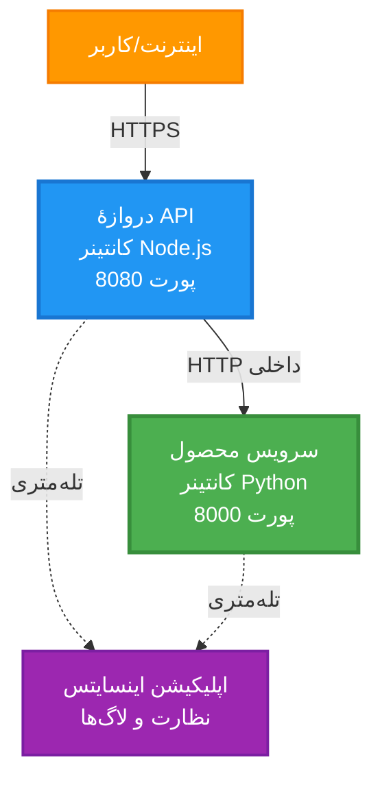
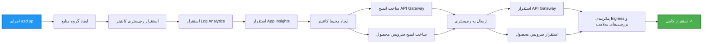
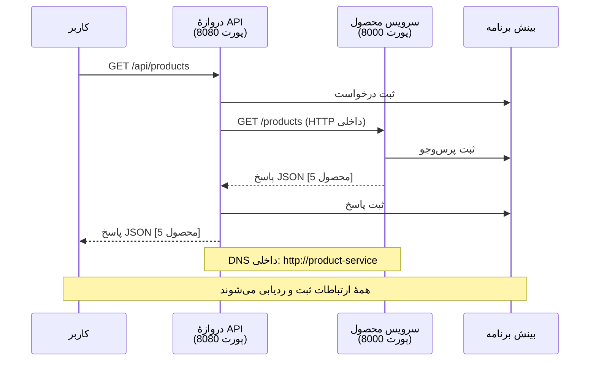

# معماری میکروسرویس‌ها - نمونه Container App

⏱️ **زمان تقریبی**: 25-35 دقیقه | 💰 **هزینه تقریبی**: ~$50-100/ماه | ⭐ **سطح دشواری**: پیشرفته

**📚 مسیر یادگیری:**
- ← قبلی: [API ساده Flask](../../../../examples/container-app/simple-flask-api) - مبانی تک کانتینر
- 🎯 **شما این‌جا هستید**: معماری میکروسرویس‌ها (پایه ۲ سرویسی)
- → بعدی: [ادغام هوش مصنوعی](../../../../docs/ai-foundry) - افزودن هوشمندی به سرویس‌های شما
- 🏠 [خانهٔ دوره](../../README.md)

---

یک معماری میکروسرویس ساده اما کاربردی که با AZD CLI به Azure Container Apps مستقر شده است. این مثال ارتباط سرویس به سرویس، ارکستراسیون کانتینر و مانیتورینگ را با یک پیاده‌سازی عملی ۲ سرویس نشان می‌دهد.

> **📚 رویکرد یادگیری**: این مثال با یک معماری حداقلی ۲ سرویس (API Gateway + سرویس بک‌اند) شروع می‌شود که واقعاً می‌توانید آن را مستقر کرده و از آن یاد بگیرید. پس از تسلط بر این پایه، راهنمایی برای گسترش به یک اکوسیستم کامل میکروسرویس ارائه می‌دهیم.

## آنچه خواهید آموخت

با تکمیل این مثال، شما:
- چندین کانتینر را در Azure Container Apps مستقر خواهید کرد
- ارتباط سرویس به سرویس را با شبکه‌بندی داخلی پیاده‌سازی خواهید کرد
- مقیاس‌بندی مبتنی بر محیط و بررسی‌های سلامت را پیکربندی خواهید کرد
- برنامه‌های توزیع‌شده را با Application Insights مانیتور خواهید کرد
- الگوها و بهترین شیوه‌های استقرار میکروسرویس را درک خواهید کرد
- یاد می‌گیرید چگونه تدریجی از معماری ساده به پیچیده گسترش دهید

## معماری

### فاز ۱: آنچه می‌سازیم (شامل این مثال)


**جزئیات اجزا:**

| Component | Purpose | Access | Resources |
|-----------|---------|--------|-----------|
| **API Gateway** | مسیردهی درخواست‌های خارجی به سرویس‌های بک‌اند | عمومی (HTTPS) | 1 vCPU, 2GB RAM, 2-20 replicas |
| **Product Service** | مدیریت کاتالوگ محصولات با داده‌های در حافظه | فقط داخلی | 0.5 vCPU, 1GB RAM, 1-10 replicas |
| **Application Insights** | ثبت لاگ متمرکز و ردیابی توزیع‌شده | Azure Portal | 1-2 GB/month data ingestion |

**چرا از ساده شروع می‌کنیم؟**
- ✅ سریع مستقر و فهمیده می‌شود (25-35 دقیقه)
- ✅ الگوهای اصلی میکروسرویس را بدون پیچیدگی یاد بگیرید
- ✅ کد قابل‌کار که می‌توانید آن را تغییر دهید و آزمایش کنید
- ✅ هزینه کمتر برای یادگیری (~$50-100/ماه در مقابل $300-1400/ماه)
- ✅ اعتمادبه‌نفس قبل از افزودن دیتابیس‌ها و صف‌های پیام

**تمثیل**: این را مانند یادگیری رانندگی تصور کنید. با یک پارکینگ خالی (۲ سرویس) شروع می‌کنید، مبانی را یاد می‌گیرید، سپس به ترافیک شهری (۵+ سرویس با دیتابیس‌ها) می‌روید.

### فاز ۲: گسترش آینده (معماری مرجع)

وقتی بر معماری ۲ سرویس مسلط شدید، می‌توانید گسترش دهید به:


برای دستورالعمل‌های گام‌به‌گام به بخش "راهنمای گسترش" در انتها مراجعه کنید.

## ویژگی‌های گنجانده شده

✅ **کشف سرویس**: کشف خودکار مبتنی بر DNS بین کانتینرها  
✅ **تعادل بار**: تعادل بار داخلی بین رپلیکاها  
✅ **مقیاس خودکار**: مقیاس مستقل برای هر سرویس بر اساس درخواست‌های HTTP  
✅ **نظارت سلامت**: پروب‌های Liveness و Readiness برای هر دو سرویس  
✅ **ثبت لاگ توزیع‌شده**: ثبت لاگ متمرکز با Application Insights  
✅ **شبکه‌بندی داخلی**: ارتباط امن سرویس به سرویس  
✅ **ارکستراسیون کانتینر**: استقرار و مقیاس خودکار  
✅ **بروزرسانی بدون قطعی**: بروزرسانی چرخشی با مدیریت نسخه‌ها  

## پیش‌نیازها

### ابزارهای مورد نیاز

قبل از شروع، بررسی کنید این ابزارها را نصب دارید:

1. **[Azure Developer CLI (azd)](https://learn.microsoft.com/azure/developer/azure-developer-cli/install-azd)** (نسخه 1.0.0 یا بالاتر)
   ```bash
   azd version
   # خروجی مورد انتظار: نسخه azd 1.0.0 یا بالاتر
   ```

2. **[Azure CLI](https://learn.microsoft.com/cli/azure/install-azure-cli)** (نسخه 2.50.0 یا بالاتر)
   ```bash
   az --version
   # خروجی مورد انتظار: azure-cli 2.50.0 یا بالاتر
   ```

3. **[Docker](https://www.docker.com/get-started)** (برای توسعه/تست محلی - اختیاری)
   ```bash
   docker --version
   # خروجی مورد انتظار: نسخهٔ Docker ۲۰.۱۰ یا بالاتر
   ```

### تایید تنظیمات شما

این دستورات را اجرا کنید تا مطمئن شوید آماده‌اید:

```bash
# بررسی Azure Developer CLI
azd version
# ✅ انتظار می‌رود: نسخهٔ azd 1.0.0 یا بالاتر

# بررسی Azure CLI
az --version
# ✅ انتظار می‌رود: نسخهٔ azure-cli 2.50.0 یا بالاتر

# بررسی Docker (اختیاری)
docker --version
# ✅ انتظار می‌رود: نسخهٔ Docker 20.10 یا بالاتر
```

**معیار موفقیت**: همه دستورات شماره نسخه‌هایی را برمی‌گردانند که برابر یا بالاتر از حداقل‌های مورد نیاز هستند.

### الزامات Azure

- یک **اشتراک Azure** فعال ([ساخت حساب رایگان](https://azure.microsoft.com/free/))
- دسترسی برای ایجاد منابع در اشتراک شما
- نقش **Contributor** روی اشتراک یا گروه منابع

### پیش‌نیازهای دانش

این مثال در سطح **پیشرفته** است. شما باید:
- مثال [API ساده Flask](../../../../examples/container-app/simple-flask-api) را انجام داده باشید
- درک پایه‌ای از معماری میکروسرویس‌ها داشته باشید
- آشنایی با REST APIها و HTTP
- درک مفاهیم کانتینرها

**تازه‌کار با Container Apps؟** ابتدا با مثال [API ساده Flask](../../../../examples/container-app/simple-flask-api) شروع کنید تا اصول را یاد بگیرید.

## شروع سریع (گام‌به‌گام)

### گام ۱: کلون و رفتن به مسیر

```bash
git clone https://github.com/microsoft/AZD-for-beginners.git
cd AZD-for-beginners/examples/microservices
```

**✓ بررسی موفقیت**: مطمئن شوید `azure.yaml` را می‌بینید:
```bash
ls
# انتظار می‌رود: README.md، azure.yaml، infra/، src/
```

### گام ۲: احراز هویت با Azure

```bash
azd auth login
```

این روش مرورگر شما را برای احراز هویت Azure باز می‌کند. با اطلاعات حساب Azure خود وارد شوید.

**✓ بررسی موفقیت**: شما باید ببینید:
```
Logged in to Azure.
```

### گام ۳: مقداردهی اولیه محیط

```bash
azd init
```

**پرسش‌هایی که خواهید دید**:
- **Environment name**: یک نام کوتاه وارد کنید (مثلاً `microservices-dev`)
- **Azure subscription**: اشتراک خود را انتخاب کنید
- **Azure location**: یک ناحیه انتخاب کنید (مثلاً `eastus`, `westeurope`)

**✓ بررسی موفقیت**: شما باید ببینید:
```
SUCCESS: New project initialized!
```

### گام ۴: استقرار زیرساخت و سرویس‌ها

```bash
azd up
```

**چه اتفاقی می‌افتد** (۸-۱۲ دقیقه طول می‌کشد):


**✓ بررسی موفقیت**: شما باید ببینید:
```
SUCCESS: Your application was deployed to Azure in X minutes Y seconds.
Endpoint: https://api-gateway-<unique-id>.azurecontainerapps.io
```

**⏱️ زمان**: 8-12 دقیقه

### گام ۵: تست استقرار

```bash
# دریافت نقطهٔ پایانی درگاه
GATEWAY_URL=$(azd env get-values | grep API_GATEWAY_URL | cut -d '=' -f2 | tr -d '"')

# آزمایش سلامت درگاه API
curl $GATEWAY_URL/health
```

**✅ خروجی مورد انتظار:**
```json
{
  "status": "healthy",
  "service": "api-gateway",
  "timestamp": "2025-11-19T10:30:00Z"
}
```

**تست سرویس محصول از طریق گیت‌وی**:
```bash
# فهرست محصولات
curl $GATEWAY_URL/api/products
```

**✅ خروجی مورد انتظار:**
```json
[
  {"id":1,"name":"Laptop","price":999.99,"stock":50},
  {"id":2,"name":"Mouse","price":29.99,"stock":200},
  {"id":3,"name":"Keyboard","price":79.99,"stock":150}
]
```

**✓ بررسی موفقیت**: هر دو اندپوینت بدون خطا داده‌های JSON بازمی‌گردانند.

---

**🎉 تبریک!** شما یک معماری میکروسرویس را در Azure مستقر کردید!

## ساختار پروژه

تمام فایل‌های پیاده‌سازی گنجانده شده‌اند—این یک مثال کامل و قابل‌کار است:

```
microservices/
│
├── README.md                         # This file
├── azure.yaml                        # AZD configuration
├── .gitignore                        # Git ignore patterns
│
├── infra/                           # Infrastructure as Code (Bicep)
│   ├── main.bicep                   # Main orchestration
│   ├── abbreviations.json           # Naming conventions
│   ├── core/                        # Shared infrastructure
│   │   ├── container-apps-environment.bicep  # Container environment + registry
│   │   └── monitor.bicep            # Application Insights + Log Analytics
│   └── app/                         # Service definitions
│       ├── api-gateway.bicep        # API Gateway container app
│       └── product-service.bicep    # Product Service container app
│
└── src/                             # Application source code
    ├── api-gateway/                 # Node.js API Gateway
    │   ├── app.js                   # Express server with routing
    │   ├── package.json             # Node dependencies
    │   └── Dockerfile               # Container definition
    └── product-service/             # Python Product Service
        ├── main.py                  # Flask API with product data
        ├── requirements.txt         # Python dependencies
        └── Dockerfile               # Container definition
```

**هر مؤلفه چه کاری انجام می‌دهد:**

**زیرساخت (infra/)**:
- `main.bicep`: orchestrates all Azure resources and their dependencies
- `core/container-apps-environment.bicep`: Creates the Container Apps environment and Azure Container Registry
- `core/monitor.bicep`: Sets up Application Insights for distributed logging
- `app/*.bicep`: Individual container app definitions with scaling and health checks

**API Gateway (src/api-gateway/)**:
- سرویس رو به بیرون که درخواست‌ها را به سرویس‌های بک‌اند مسیردهی می‌کند
- پیاده‌سازی لاگ‌گیری، مدیریت خطا و فوروارد درخواست‌ها
- نمونه‌ای از ارتباط HTTP سرویس به سرویس را نشان می‌دهد

**Product Service (src/product-service/)**:
- سرویس داخلی با کاتالوگ محصولات (در حافظه برای سادگی)
- REST API با بررسی‌های سلامت
- نمونه‌ای از الگوی سرویس بک‌اند

## نمای کلی سرویس‌ها

### API Gateway (Node.js/Express)

**پورت**: 8080  
**دسترسی**: عمومی (ingress خارجی)  
**هدف**: مسیردهی درخواست‌های ورودی به سرویس‌های بک‌اند مناسب  

**اندپوینت‌ها**:
- `GET /` - اطلاعات سرویس
- `GET /health` - اندپوینت بررسی سلامت
- `GET /api/products` - فوروارد به سرویس محصول (لیست همه)
- `GET /api/products/:id` - فوروارد به سرویس محصول (دریافت بر اساس شناسه)

**ویژگی‌های کلیدی**:
- مسیردهی درخواست با axios
- لاگ‌گیری متمرکز
- مدیریت خطا و timeout
- کشف سرویس از طریق متغیرهای محیطی
- ادغام با Application Insights

**نمایی از کد** (`src/api-gateway/app.js`):
```javascript
// ارتباط داخلی سرویس
app.get('/api/products', async (req, res) => {
  const response = await axios.get(`${PRODUCT_SERVICE_URL}/products`, {
    timeout: 5000
  });
  res.json(response.data);
});
```

### Product Service (Python/Flask)

**پورت**: 8000  
**دسترسی**: فقط داخلی (بدون ingress خارجی)  
**هدف**: مدیریت کاتالوگ محصولات با داده در حافظه  

**اندپوینت‌ها**:
- `GET /` - اطلاعات سرویس
- `GET /health` - اندپوینت بررسی سلامت
- `GET /products` - لیست همه محصولات
- `GET /products/<id>` - دریافت محصول براساس شناسه

**ویژگی‌های کلیدی**:
- API از نوع REST با Flask
- نگهداری محصولات در حافظه (ساده، بدون نیاز به دیتابیس)
- مانیتورینگ سلامت با پروب‌ها
- لاگ‌گیری ساختاریافته
- ادغام با Application Insights

**مدل داده**:
```python
{
  "id": 1,
  "name": "Laptop",
  "description": "High-performance laptop",
  "price": 999.99,
  "stock": 50
}
```

**چرا فقط داخلی؟**
سرویس محصول به صورت عمومی در دسترس نیست. تمام درخواست‌ها باید از طریق API Gateway عبور کنند که فراهم می‌کند:
- امنیت: نقطه دسترسی کنترل‌شده
- انعطاف‌پذیری: امکان تغییر بک‌اند بدون تأثیر بر مشتریان
- مانیتورینگ: لاگ‌گیری متمرکز درخواست‌ها

## درک ارتباط سرویس‌ها

### چگونه سرویس‌ها با هم صحبت می‌کنند


در این مثال، API Gateway با Product Service از طریق **فراخوانی‌های HTTP داخلی** ارتباط برقرار می‌کند:

```javascript
// دروازه‌ی API (src/api-gateway/app.js)
const PRODUCT_SERVICE_URL = process.env.PRODUCT_SERVICE_URL;

// ارسال درخواست HTTP داخلی
const response = await axios.get(`${PRODUCT_SERVICE_URL}/products`);
```

**نکات کلیدی**:

1. **کشف مبتنی بر DNS**: Container Apps به‌طور خودکار DNS برای سرویس‌های داخلی فراهم می‌کند
   - FQDN سرویس محصول: `product-service.internal.<environment>.azurecontainerapps.io`
   - به‌صورت ساده شده: `http://product-service` (Container Apps آن را حل می‌کند)

2. **بدون افشای عمومی**: سرویس محصول در Bicep دارای `external: false` است
   - فقط در داخل محیط Container Apps قابل دسترسی است
   - از طریق اینترنت قابل دسترسی نیست

3. **متغیرهای محیطی**: URLهای سرویس در زمان استقرار تزریق می‌شوند
   - Bicep FQDN داخلی را به گیت‌وی می‌دهد
   - هیچ URLی در کد اپلیکیشن هاردکد نشده است

**تمثیل**: این را مثل اتاق‌های یک دفتر تصور کنید. API Gateway میز پذیرش است (رو به بیرون)، و Product Service یک اتاق اداری است (فقط داخلی). بازدیدکنندگان باید از پذیرش عبور کنند تا به هر اتاقی برسند.

## گزینه‌های استقرار

### استقرار کامل (توصیه‌شده)

```bash
# زیرساخت و هر دو سرویس را مستقر کنید
azd up
```

این موارد را مستقر می‌کند:
1. محیط Container Apps
2. Application Insights
3. Container Registry
4. کانتینر API Gateway
5. کانتینر Product Service

**زمان**: 8-12 دقیقه

### استقرار سرویس منفرد

```bash
# فقط یک سرویس را مستقر کنید (پس از اجرای اولیه azd up)
azd deploy api-gateway

# یا سرویس product را مستقر کنید
azd deploy product-service
```

**مورد استفاده**: وقتی کد یکی از سرویس‌ها را به‌روزرسانی کرده‌اید و می‌خواهید فقط همان سرویس را دوباره مستقر کنید.

### به‌روزرسانی پیکربندی

```bash
# پارامترهای مقیاس‌بندی را تغییر دهید
azd env set GATEWAY_MAX_REPLICAS 30

# با پیکربندی جدید مجدداً مستقر کنید
azd up
```

## پیکربندی

### پیکربندی مقیاس‌بندی

هر دو سرویس در فایل‌های Bicep خود با مقیاس خودکار مبتنی بر HTTP پیکربندی شده‌اند:

**API Gateway**:
- حداقل رپلیکاها: 2 (همیشه حداقل 2 برای دسترسی‌پذیری)
- حداکثر رپلیکاها: 20
- ماشه مقیاس: 50 درخواست همزمان به ازای هر رپلیکا

**Product Service**:
- حداقل رپلیکاها: 1 (در صورت نیاز می‌تواند تا صفر مقیاس شود)
- حداکثر رپلیکاها: 10
- ماشه مقیاس: 100 درخواست همزمان به ازای هر رپلیکا

**سفارشی‌سازی مقیاس** (در `infra/app/*.bicep`):
```bicep
scale: {
  minReplicas: 1
  maxReplicas: 10
  rules: [
    {
      name: 'http-scale-rule'
      http: {
        metadata: {
          concurrentRequests: '100'  // Adjust this
        }
      }
    }
  ]
}
```

### تخصیص منابع

**API Gateway**:
- CPU: 1.0 vCPU
- حافظه: 2 GiB
- دلیل: مدیریت همه ترافیک خارجی

**Product Service**:
- CPU: 0.5 vCPU
- حافظه: 1 GiB
- دلیل: عملیات سبک در حافظه

### بررسی‌های سلامت

هر دو سرویس شامل پروب‌های liveness و readiness هستند:

```bicep
probes: [
  {
    type: 'Liveness'
    httpGet: {
      path: '/health'
      port: 8080
    }
    initialDelaySeconds: 10
    periodSeconds: 30
  }
  {
    type: 'Readiness'
    httpGet: {
      path: '/health'
      port: 8080
    }
    initialDelaySeconds: 5
    periodSeconds: 10
  }
]
```

**این به چه معناست**:
- **Liveness**: اگر بررسی سلامت شکست بخورد، Container Apps کانتینر را ری‌استارت می‌کند
- **Readiness**: اگر آماده نباشد، Container Apps مسیردهی ترافیک به آن رپلیکا را متوقف می‌کند

## مانیتورینگ و قابلیت مشاهده

### مشاهده لاگ‌های سرویس

```bash
# با azd monitor لاگ‌ها را مشاهده کنید
azd monitor --logs

# یا از Azure CLI برای Container Apps خاص استفاده کنید:
# لاگ‌ها را از API Gateway به‌صورت زنده پخش کنید
az containerapp logs show --name api-gateway --resource-group $RG_NAME --follow

# لاگ‌های اخیر سرویس محصول را مشاهده کنید
az containerapp logs show --name product-service --resource-group $RG_NAME --tail 100
```

**خروجی مورد انتظار**:
```
[api-gateway] API Gateway listening on port 8080
[api-gateway] Product Service URL: http://product-service
[api-gateway] GET /api/products 200 - 45ms
[product-service] Retrieved 5 products
```

### کوئری‌های Application Insights

در Azure Portal به Application Insights مراجعه کنید، سپس این کوئری‌ها را اجرا کنید:

**پیدا کردن درخواست‌های کند**:
```kusto
requests
| where timestamp > ago(1h)
| where duration > 1000  // Requests taking >1 second
| summarize count() by name, cloud_RoleName
| order by count_ desc
```

**ردیابی تماس‌های سرویس به سرویس**:
```kusto
dependencies
| where timestamp > ago(1h)
| where type == "Http"
| project timestamp, name, target, duration, success
| order by timestamp desc
```

**نرخ خطا بر اساس سرویس**:
```kusto
exceptions
| where timestamp > ago(24h)
| summarize errorCount = count() by cloud_RoleName, type
| order by errorCount desc
```

**حجم درخواست‌ها در طول زمان**:
```kusto
requests
| where timestamp > ago(1h)
| summarize requestCount = count() by bin(timestamp, 5m), cloud_RoleName
| render timechart
```

### دسترسی به داشبورد مانیتورینگ

```bash
# جزئیات Application Insights را دریافت کنید
azd env get-values | grep APPLICATIONINSIGHTS

# مانیتورینگ پورتال Azure را باز کنید
az monitor app-insights component show \
  --app $(azd env get-values | grep APPLICATIONINSIGHTS_CONNECTION_STRING | cut -d '=' -f2) \
  --resource-group $(azd env get-values | grep AZURE_RESOURCE_GROUP | cut -d '=' -f2) \
  --query "appId" -o tsv
```

### متریک‌های زنده

1. به Application Insights در Azure Portal بروید
2. روی "Live Metrics" کلیک کنید
3. درخواست‌ها، شکست‌ها و عملکرد در زمان واقعی را ببینید
4. تست با اجرای: `curl $(azd env get-values | grep API_GATEWAY_URL | cut -d '=' -f2 | tr -d '"')/api/products`

## تمرین‌های عملی

### تمرین ۱: افزودن اندپوینت جدید محصول ⭐ (آسان)

**هدف**: افزودن یک اندپوینت POST برای ایجاد محصولات جدید

**نقطه شروع**: `src/product-service/main.py`

**مراحل**:

1. این اندپوینت را بعد از تابع `get_product` در `main.py` اضافه کنید:

```python
@app.route('/products', methods=['POST'])
def create_product():
    """Create a new product"""
    data = request.get_json()
    
    # فیلدهای اجباری را اعتبارسنجی کنید
    if not data or 'name' not in data or 'price' not in data:
        return jsonify({'error': 'Missing required fields: name, price'}), 400
    
    new_id = max(p['id'] for p in products) + 1
    new_product = {
        'id': new_id,
        'name': data['name'],
        'description': data.get('description', ''),
        'price': float(data['price']),
        'stock': int(data.get('stock', 0))
    }
    products.append(new_product)
    logger.info(f"Created product {new_id}")
    return jsonify(new_product), 201
```

2. مسیر POST را به API Gateway اضافه کنید (`src/api-gateway/app.js`):

```javascript
// این را بعد از مسیر GET /api/products اضافه کنید
app.post('/api/products', async (req, res) => {
  try {
    console.log(`Forwarding POST request to ${PRODUCT_SERVICE_URL}/products`);
    const response = await axios.post(`${PRODUCT_SERVICE_URL}/products`, req.body, {
      timeout: 5000
    });
    res.status(201).json(response.data);
  } catch (error) {
    console.error('Error calling product service:', error.message);
    res.status(503).json({
      error: 'Product service unavailable',
      message: error.message
    });
  }
});
```

3. دوباره استقرار هر دو سرویس:

```bash
azd deploy product-service
azd deploy api-gateway
```

4. نقطه پایانی جدید را تست کنید:

```bash
GATEWAY_URL=$(azd env get-values | grep API_GATEWAY_URL | cut -d '=' -f2 | tr -d '"')

# ایجاد یک محصول جدید
curl -X POST $GATEWAY_URL/api/products \
  -H "Content-Type: application/json" \
  -d '{"name":"USB Cable","price":9.99,"stock":500}'
```

**✅ خروجی مورد انتظار:**
```json
{"id":6,"name":"USB Cable","description":"","price":9.99,"stock":500}
```

5. تایید کنید که در لیست نمایش داده می‌شود:

```bash
curl $GATEWAY_URL/api/products
# باید اکنون ۶ محصول از جمله کابل USB جدید را نشان دهد
```

**معیارهای موفقیت**:
- ✅ درخواست POST کد وضعیت HTTP 201 را بازمی‌گرداند
- ✅ محصول جدید در لیست GET /api/products ظاهر می‌شود
- ✅ محصول دارای شناسه‌ای با افزایش خودکار است

**زمان**: 10-15 دقیقه

---

### تمرین 2: تغییر قوانین مقیاس‌بندی خودکار ⭐⭐ (متوسط)

**هدف**: تغییر Product Service برای مقیاس‌دهی تهاجمی‌تر

**نقطه شروع**: `infra/app/product-service.bicep`

**مراحل**:

1. فایل `infra/app/product-service.bicep` را باز کنید و بلوک `scale` را پیدا کنید (حدود خط 95)

2. تغییر دهید از:
```bicep
scale: {
  minReplicas: 1
  maxReplicas: 10
  rules: [
    {
      name: 'http-scale-rule'
      http: {
        metadata: {
          concurrentRequests: '100'  // OLD
        }
      }
    }
  ]
}
```

به:
```bicep
scale: {
  minReplicas: 2  // Always have 2 running
  maxReplicas: 20  // Allow more scaling
  rules: [
    {
      name: 'http-scale-rule'
      http: {
        metadata: {
          concurrentRequests: '20'  // Scale at lower threshold
        }
      }
    }
  ]
}
```

3. زیرساخت را مجدداً مستقر کنید:

```bash
azd up
```

4. پیکربندی مقیاس‌بندی جدید را بررسی کنید:

```bash
az containerapp show \
  --name $(azd env get-values | grep PRODUCT_SERVICE | head -1 | cut -d '/' -f5) \
  --resource-group $(azd env get-values | grep AZURE_RESOURCE_GROUP | cut -d '=' -f2 | tr -d '"') \
  --query "properties.template.scale" -o json
```

**✅ خروجی مورد انتظار:**
```json
{
  "minReplicas": 2,
  "maxReplicas": 20,
  "rules": [...]
}
```

5. مقیاس‌بندی خودکار را با بار تست کنید:

```bash
# ایجاد درخواست‌های همزمان
for i in {1..500}; do curl $GATEWAY_URL/api/products & done

# با استفاده از Azure CLI تغییر مقیاس را مشاهده کنید
az containerapp logs show --name product-service --resource-group $RG_NAME --follow
# به دنبال: رویدادهای مقیاس‌بندی Container Apps
```

**معیارهای موفقیت**:
- ✅ Product Service همیشه حداقل 2 نسخه اجرا می‌شود
- ✅ تحت بار، به بیش از 2 نسخه مقیاس می‌یابد
- ✅ در Azure Portal قوانین مقیاس‌بندی جدید نمایش داده می‌شود

**زمان**: 15-20 دقیقه

---

### تمرین 3: اضافه کردن پرس‌وجوی مانیتورینگ سفارشی ⭐⭐ (متوسط)

**هدف**: ایجاد یک پرس‌وجوی سفارشی در Application Insights برای ردیابی عملکرد API محصول

**مراحل**:

1. به Application Insights در Azure Portal بروید:
   - به Azure Portal بروید
   - گروه منبع خود را پیدا کنید (rg-microservices-*)
   - روی منبع Application Insights کلیک کنید

2. در منوی سمت چپ روی "Logs" کلیک کنید

3. این پرس‌وجو را ایجاد کنید:

```kusto
requests
| where timestamp > ago(1h)
| where name contains "products"
| summarize 
    RequestCount = count(),
    AvgDuration = avg(duration),
    P95Duration = percentile(duration, 95),
    SuccessRate = 100.0 * countif(success == true) / count()
  by bin(timestamp, 5m)
| render timechart
```

4. برای اجرا روی "Run" کلیک کنید

5. پرس‌وجو را ذخیره کنید:
   - روی "Save" کلیک کنید
   - نام: "Product API Performance"
   - دسته: "Performance"

6. ترافیک آزمایشی تولید کنید:

```bash
for i in {1..100}; do curl $GATEWAY_URL/api/products; sleep 1; done
```

7. پرس‌وجو را تازه‌سازی کنید تا داده‌ها را ببینید

**✅ خروجی مورد انتظار:**
- نموداری که تعداد درخواست‌ها را در طول زمان نشان می‌دهد
- میانگین مدت زمان < 500ms
- نرخ موفقیت = 100%
- بازه‌های زمانی 5 دقیقه‌ای

**معیارهای موفقیت**:
- ✅ پرس‌وجو بیش از 100 درخواست نشان می‌دهد
- ✅ نرخ موفقیت 100% است
- ✅ میانگین مدت زمان < 500ms
- ✅ نمودار بازه‌های زمانی 5 دقیقه‌ای را نمایش می‌دهد

**نتیجه یادگیری**: درک چگونگی مانیتورینگ عملکرد سرویس با پرس‌وجوهای سفارشی

**زمان**: 10-15 دقیقه

---

### تمرین 4: پیاده‌سازی منطق تلاش مجدد (Retry) ⭐⭐⭐ (پیشرفته)

**هدف**: افزودن منطق تلاش مجدد به API Gateway زمانی که Product Service موقتاً در دسترس نیست

**نقطه شروع**: `src/api-gateway/app.js`

**مراحل**:

1. کتابخانه retry را نصب کنید:

```bash
cd src/api-gateway
npm install axios-retry --save
cd ../..
```

2. `src/api-gateway/app.js` را به‌روزرسانی کنید (بعد از import axios اضافه کنید):

```javascript
const axiosRetry = require('axios-retry');

// پیکربندی منطق تلاش مجدد
axiosRetry(axios, {
  retries: 3,
  retryDelay: (retryCount) => {
    return retryCount * 1000; // ۱ ثانیه، ۲ ثانیه، ۳ ثانیه
  },
  retryCondition: (error) => {
    // تلاش مجدد در صورت خطاهای شبکه یا پاسخ‌های ۵xx
    return axiosRetry.isNetworkOrIdempotentRequestError(error) ||
           (error.response && error.response.status >= 500);
  }
});

console.log('Retry logic configured: 3 retries with exponential backoff');
```

3. API Gateway را مجدداً مستقر کنید:

```bash
azd deploy api-gateway
```

4. رفتار تلاش مجدد را با شبیه‌سازی خرابی سرویس تست کنید:

```bash
# سرویس محصولات را به ۰ مقیاس دهید (شبیه‌سازی خرابی)
az containerapp update \
  --name $(azd env get-values | grep PRODUCT_SERVICE | head -1 | cut -d '/' -f5) \
  --resource-group $(azd env get-values | grep AZURE_RESOURCE_GROUP | cut -d '=' -f2 | tr -d '"') \
  --min-replicas 0 \
  --max-replicas 0

# سعی کنید به محصولات دسترسی پیدا کنید (۳ بار تلاش مجدد خواهد شد)
time curl -v $GATEWAY_URL/api/products
# مشاهده: پاسخ حدوداً ۶ ثانیه طول می‌کشد (۱ ثانیه + ۲ ثانیه + ۳ ثانیه برای تلاش‌های مجدد)

# سرویس محصولات را بازیابی کنید
az containerapp update \
  --name $(azd env get-values | grep PRODUCT_SERVICE | head -1 | cut -d '/' -f5) \
  --resource-group $(azd env get-values | grep AZURE_RESOURCE_GROUP | cut -d '=' -f2 | tr -d '"') \
  --min-replicas 1 \
  --max-replicas 10
```

5. لاگ‌های تلاش مجدد را مشاهده کنید:

```bash
az containerapp logs show --name api-gateway --resource-group $RG_NAME --tail 50
# به دنبال پیام‌های تلاش مجدد بگردید
```

**✅ رفتار مورد انتظار:**
- درخواست‌ها قبل از شکست 3 بار تلاش می‌شوند
- هر تلاش مدت زمان بیشتری منتظر می‌ماند (1s، 2s، 3s)
- درخواست‌های موفق پس از راه‌اندازی مجدد سرویس
- لاگ‌ها تلاش‌های مجدد را نشان می‌دهند

**معیارهای موفقیت**:
- ✅ درخواست‌ها قبل از شکست 3 بار تلاش می‌شوند
- ✅ هر تلاش مدت زمان بیشتری منتظر می‌ماند (backoff نمایی)
- ✅ درخواست‌های موفق پس از راه‌اندازی مجدد سرویس
- ✅ لاگ‌ها تلاش‌های مجدد را نشان می‌دهند

**نتیجه یادگیری**: درک الگوهای تاب‌آوری در میکروسرویس‌ها (قطع‌کننده‌های مدار، تلاش‌های مجدد، تایم‌اوت‌ها)

**زمان**: 20-25 دقیقه

---

## بررسی دانش

پس از تکمیل این مثال، درک خود را تأیید کنید:

### 1. ارتباط بین سرویس‌ها ✓

دانش خود را آزمایش کنید:
- [ ] آیا می‌توانید توضیح دهید که API Gateway چگونه Product Service را کشف می‌کند؟ (کشف سرویس مبتنی بر DNS)
- [ ] چه می‌شود اگر Product Service غیرفعال باشد؟ (Gateway خطای 503 بازمی‌گرداند)
- [ ] چگونه یک سرویس سوم اضافه می‌کنید؟ (فایل Bicep جدید ایجاد کنید، به main.bicep اضافه کنید، پوشه src را ایجاد کنید)

**تأیید عملی:**
```bash
# شبیه‌سازی خرابی سرویس
az containerapp update --name <product-service-name> --min-replicas 0 --max-replicas 0
curl $GATEWAY_URL/api/products
# ✅ انتظار می‌رود: 503 سرویس در دسترس نیست

# بازگردانی سرویس
az containerapp update --name <product-service-name> --min-replicas 1 --max-replicas 10
```

### 2. مانیتورینگ و قابلیت مشاهده ✓

دانش خود را آزمایش کنید:
- [ ] لاگ‌های توزیع‌شده را کجا می‌بینید؟ (Application Insights در Azure Portal)
- [ ] چطور درخواست‌های کند را پیگیری می‌کنید؟ (Kusto query: `requests | where duration > 1000`)
- [ ] آیا می‌توانید تشخیص دهید کدام سرویس باعث خطا شده است؟ (فیلد `cloud_RoleName` را در لاگ‌ها بررسی کنید)

**تأیید عملی:**
```bash
# یک شبیه‌سازی از درخواست‌های کند ایجاد کنید
curl "$GATEWAY_URL/api/products?delay=2000"

# برای درخواست‌های کند در Application Insights کوئری اجرا کنید
# به Azure Portal → Application Insights → Logs بروید
# اجرای: requests | where duration > 1000 | project timestamp, name, duration, cloud_RoleName
```

### 3. مقیاس‌گذاری و عملکرد ✓

دانش خود را آزمایش کنید:
- [ ] چه چیزی مقیاس‌گذاری خودکار را تحریک می‌کند؟ (قوانین درخواست‌های همزمان HTTP: 50 برای gateway، 100 برای product)
- [ ] اکنون چند replica در حال اجراست؟ (با `az containerapp revision list` بررسی کنید)
- [ ] چگونه Product Service را به 5 replica مقیاس می‌دهید؟ (minReplicas را در Bicep به‌روزرسانی کنید)

**تأیید عملی:**
```bash
# برای تست مقیاس‌بندی خودکار، بار تولید کنید
for i in {1..1000}; do curl $GATEWAY_URL/api/products & done

# با استفاده از Azure CLI افزایش تعداد نمونه‌ها را مشاهده کنید
az containerapp logs show --name api-gateway --resource-group $RG_NAME --follow
# ✅ مورد انتظار: مشاهده رویدادهای مقیاس‌گذاری در لاگ‌ها
```

**معیارهای موفقیت**: شما می‌توانید به همه سوالات پاسخ دهید و با دستورات عملی صحت را تأیید کنید.

---

## تحلیل هزینه

### هزینه‌های ماهانه تخمینی (برای این مثال با 2 سرویس)

| منبع | پیکربندی | هزینه تقریبی |
|----------|--------------|----------------|
| API Gateway | 2-20 replicas, 1 vCPU, 2GB RAM | $30-150 |
| Product Service | 1-10 replicas, 0.5 vCPU, 1GB RAM | $15-75 |
| Container Registry | Basic tier | $5 |
| Application Insights | 1-2 GB/month | $5-10 |
| Log Analytics | 1 GB/month | $3 |
| **جمع** | | **$58-243/month** |

### تفکیک هزینه بر اساس استفاده

**ترافیک سبک** (تست/یادگیری): ~$60/month
- API Gateway: 2 replica × 24/7 = $30
- Product Service: 1 replica × 24/7 = $15
- Monitoring + Registry = $13

**ترافیک متوسط** (تولید کوچک): ~$120/month
- API Gateway: میانگین 5 replica = $75
- Product Service: میانگین 3 replica = $45
- Monitoring + Registry = $13

**ترافیک سنگین** (دوره‌های شلوغ): ~$240/month
- API Gateway: میانگین 15 replica = $225
- Product Service: میانگین 8 replica = $120
- Monitoring + Registry = $13

### نکات بهینه‌سازی هزینه

1. **مقیاس‌دهی تا صفر برای توسعه**:
   ```bicep
   scale: {
     minReplicas: 0  // Save $30-40/month when not in use
     maxReplicas: 10
   }
   ```

2. **از Consumption Plan برای Cosmos DB استفاده کنید** (وقتی آن را اضافه می‌کنید):
   - فقط برای آنچه استفاده می‌کنید هزینه پرداخت کنید
   - هیچ حداقل هزینه‌ای وجود ندارد

3. **تنظیم نمونه‌برداری Application Insights**:
   ```javascript
   appInsights.defaultClient.config.samplingPercentage = 50; // ۵۰٪ از درخواست‌ها را نمونه‌گیری کن
   ```

4. **پاک‌سازی وقتی نیاز نیست**:
   ```bash
   azd down --force --purge
   ```

### گزینه‌های لایه رایگان

برای یادگیری/آزمایش، در نظر بگیرید:
- ✅ از اعتبار رایگان Azure استفاده کنید ($200 برای 30 روز اول برای حساب‌های جدید)
- ✅ در حداقل replicaها بمانید (حدوداً 50% صرفه‌جویی در هزینه)
- ✅ پس از آزمایش حذف کنید (بدون هزینه‌های مداوم)
- ✅ بین جلسات یادگیری مقیاس را به صفر برسانید

**مثال**: اجرای این مثال به مدت 2 ساعت/روز × 30 روز = ~$5/month به‌جای $60/month

---

## راهنمای سریع عیب‌یابی

### مشکل: `azd up` با خطای "Subscription not found" شکست می‌خورد

**راه‌حل**:
```bash
# دوباره با اشتراک صریح وارد شوید
az account set --subscription <your-subscription-id>
azd env set AZURE_SUBSCRIPTION_ID <your-subscription-id>
azd up
```

### مشکل: API Gateway خطای 503 "Product service unavailable" را بازمی‌گرداند

**تشخیص**:
```bash
# با استفاده از Azure CLI لاگ‌های سرویس محصول را بررسی کنید
az containerapp logs show --name product-service --resource-group $RG_NAME --tail 50

# وضعیت سلامت سرویس محصول را بررسی کنید
az containerapp show \
  --name $(azd env get-values | grep PRODUCT_SERVICE | head -1 | cut -d '/' -f5) \
  --resource-group $(azd env get-values | grep AZURE_RESOURCE_GROUP | cut -d '=' -f2 | tr -d '"') \
  --query "properties.runningStatus"
```

**دلایل متداول**:
1. سرویس Product راه‌اندازی نشده است (لاگ‌ها را برای خطاهای Python بررسی کنید)
2. بررسی سلامت شکست می‌خورد (تأیید کنید `/health` endpoint کار می‌کند)
3. ساخت تصویر کانتینر شکست خورده است (رجیستری را برای تصویر بررسی کنید)

### مشکل: مقیاس‌گذاری خودکار کار نمی‌کند

**تشخیص**:
```bash
# تعداد نمونه‌های فعلی را بررسی کنید
az containerapp revision list \
  --name $(azd env get-values | grep API_GATEWAY | head -1 | cut -d '/' -f5) \
  --resource-group $(azd env get-values | grep AZURE_RESOURCE_GROUP | cut -d '=' -f2 | tr -d '"') \
  --query "[].properties.replicas"

# برای آزمایش بار تولید کنید
for i in {1..1000}; do curl $GATEWAY_URL/api/products & done

# با استفاده از Azure CLI رویدادهای مقیاس‌بندی را مشاهده کنید
az containerapp logs show --name api-gateway --resource-group $RG_NAME --follow | grep -i scale
```

**دلایل متداول**:
1. بار به اندازه کافی بالا نیست تا قانون مقیاس را فعال کند (نیاز به >50 درخواست همزمان)
2. حداکثر replicaها قبلاً رسیده است (پیکربندی Bicep را بررسی کنید)
3. قانون مقیاس در Bicep اشتباه پیکربندی شده است (مقدار concurrentRequests را تأیید کنید)

### مشکل: Application Insights لاگ‌ها را نشان نمی‌دهد

**تشخیص**:
```bash
# تأیید کنید که رشتهٔ اتصال تنظیم شده است
azd env get-values | grep APPLICATIONINSIGHTS

# بررسی کنید که سرویس‌ها تله‌متری ارسال می‌کنند
az monitor app-insights component show \
  --app $(azd env get-values | grep APPLICATIONINSIGHTS_NAME | cut -d '=' -f2 | tr -d '"') \
  --resource-group $(azd env get-values | grep AZURE_RESOURCE_GROUP | cut -d '=' -f2 | tr -d '"') \
  --query "properties.InstrumentationKey"
```

**دلایل متداول**:
1. رشته اتصال به کانتینر ارسال نشده است (متغیرهای محیطی را بررسی کنید)
2. SDK مربوط به Application Insights پیکربندی نشده است (imports در کد را بررسی کنید)
3. فایروال در حال مسدود کردن تلماتری است (به ندرت، قواعد شبکه را بررسی کنید)

### مشکل: ساخت Docker به‌صورت محلی شکست می‌خورد

**تشخیص**:
```bash
# تست ساخت دروازهٔ API
cd src/api-gateway
docker build -t test-gateway .

# تست ساخت سرویس محصول
cd ../product-service
docker build -t test-product .
```

**دلایل متداول**:
1. وابستگی‌های گمشده در package.json/requirements.txt
2. خطاهای سینتکس در Dockerfile
3. مشکلات شبکه در دانلود وابستگی‌ها

**هنوز مشکل دارید؟** به [Common Issues Guide](../../docs/chapter-07-troubleshooting/common-issues.md) یا [Azure Container Apps Troubleshooting](https://learn.microsoft.com/azure/container-apps/troubleshooting) مراجعه کنید

---

## پاک‌سازی

برای جلوگیری از هزینه‌های دائمی، همه منابع را حذف کنید:

```bash
azd down --force --purge
```

**درخواست تأیید**:
```
? Total resources to delete: 6, are you sure you want to continue? (y/N)
```

برای تأیید `y` را تایپ کنید.

**مواردی که حذف می‌شوند**:
- Container Apps Environment
- هر دو Container App (gateway و product service)
- Container Registry
- Application Insights
- Log Analytics Workspace
- Resource Group

**✓ تأیید پاک‌سازی**:
```bash
az group list --query "[?starts_with(name,'rg-microservices')]" --output table
```

باید خالی برگردد.

---

## راهنمای توسعه: از 2 تا 5+ سرویس

پس از مسلط شدن بر این معماری 2 سرویس، در اینجا نحوه گسترش آمده است:

### مرحله 1: افزودن پایداری پایگاه‌داده (گام بعدی)

**افزودن Cosmos DB برای Product Service**:

1. `infra/core/cosmos.bicep` را ایجاد کنید:
   ```bicep
   resource cosmosAccount 'Microsoft.DocumentDB/databaseAccounts@2023-04-15' = {
     name: name
     location: location
     kind: 'GlobalDocumentDB'
     properties: {
       databaseAccountOfferType: 'Standard'
       consistencyPolicy: { defaultConsistencyLevel: 'Session' }
       locations: [{ locationName: location, failoverPriority: 0 }]
     }
   }
   ```

2. سرویس product را بروز کنید تا به جای داده‌های در حافظه از Azure Cosmos DB Python SDK استفاده کند

3. هزینه اضافی تخمینی: ~$25/month (serverless)

### مرحله 2: افزودن سرویس سوم (مدیریت سفارش)

**ایجاد Order Service**:

1. پوشه جدید: `src/order-service/` (Python/Node.js/C#)
2. Bicep جدید: `infra/app/order-service.bicep`
3. API Gateway را برای مسیر‌دهی `/api/orders` به‌روزرسانی کنید
4. افزودن Azure SQL Database برای ماندگاری سفارش‌ها

**معماری تبدیل می‌شود به**:
```
API Gateway → Product Service (Cosmos DB)
           → Order Service (Azure SQL)
```

### مرحله 3: افزودن ارتباط غیرهمزمان (Service Bus)

**پیاده‌سازی معماری رویدادمحور**:

1. افزودن Azure Service Bus: `infra/core/servicebus.bicep`
2. Product Service رویدادهای "ProductCreated" را منتشر می‌کند
3. Order Service به رویدادهای محصول مشترک می‌شود
4. افزودن Notification Service برای پردازش رویدادها

**الگو**: Request/Response (HTTP) + Event-Driven (Service Bus)

### مرحله 4: افزودن احراز هویت کاربر

**پیاده‌سازی User Service**:

1. ایجاد `src/user-service/` (Go/Node.js)
2. افزودن Azure AD B2C یا احراز هویت JWT سفارشی
3. API Gateway قبل از مسیر‌دهی توکن‌ها را تأیید می‌کند
4. سرویس‌ها مجوزهای کاربر را بررسی می‌کنند

### مرحله 5: آماده‌سازی برای تولید

**افزودن این مؤلفه‌ها**:
- ✅ Azure Front Door (بالانس بار جهانی)
- ✅ Azure Key Vault (مدیریت اسرار)
- ✅ Azure Monitor Workbooks (داشبوردهای سفارشی)
- ✅ CI/CD Pipeline (GitHub Actions)
- ✅ استقرار Blue-Green
- ✅ Managed Identity برای همه سرویس‌ها

**هزینه کامل معماری تولید**: ~$300-1,400/month

---

## اطلاعات بیشتر

### مستندات مرتبط
- [مستندات Azure Container Apps](https://learn.microsoft.com/azure/container-apps/)
- [راهنمای معماری میکروسرویس‌ها](https://learn.microsoft.com/azure/architecture/guide/architecture-styles/microservices)
- [Application Insights برای ردیابی توزیع‌شده](https://learn.microsoft.com/azure/azure-monitor/app/distributed-tracing)
- [مستندات Azure Developer CLI](https://learn.microsoft.com/azure/developer/azure-developer-cli/)

### گام‌های بعدی در این دوره
- ← قبلی: [Simple Flask API](../../../../examples/container-app/simple-flask-api) - مثال مبتدی تک‌کانتینری
- → بعدی: [AI Integration Guide](../../../../docs/ai-foundry) - افزودن قابلیت‌های AI
- 🏠 [صفحه اصلی دوره](../../README.md)

### مقایسه: چه زمانی از کدام استفاده شود

| ویژگی | Single Container | Microservices (This) | Kubernetes (AKS) |
|---------|-----------------|---------------------|------------------|
| **مورد استفاده** | برنامه‌های ساده | برنامه‌های پیچیده | برنامه‌های سازمانی |
| **مقیاس‌پذیری** | سرویس تک | مقیاس‌بندی برای هر سرویس | حداکثر انعطاف‌پذیری |
| **پیچیدگی** | کم | متوسط | زیاد |
| **اندازه تیم** | 1-3 توسعه‌دهنده | 3-10 توسعه‌دهنده | 10+ توسعه‌دهنده |
| **هزینه** | ~$15-50/month | ~$60-250/month | ~$150-500/month |
| **زمان استقرار** | 5-10 دقیقه | 8-12 دقیقه | 15-30 دقیقه |
| **مناسب برای** | MVPها، نمونه‌های اولیه | برنامه‌های تولیدی | چندابری، شبکه‌بندی پیشرفته |

**توصیه**: با Container Apps (این مثال) شروع کنید، تنها در صورتی به AKS بروید که به ویژگی‌های مخصوص Kubernetes نیاز داشته باشید.

---

## سوالات متداول

**Q: چرا فقط 2 سرویس به‌جای 5+؟**  
A: پیشرفت آموزشی. اصول بنیادین (ارتباط بین سرویس‌ها، مانیتورینگ، مقیاس‌پذیری) را با یک مثال ساده یاد بگیرید قبل از افزودن پیچیدگی. الگوهایی که اینجا یاد می‌گیرید در معماری‌های 100 سرویسی هم کاربرد دارند.

**Q: می‌توانم خودم سرویس‌های بیشتری اضافه کنم؟**  
A: قطعاً! از راهنمای توسعه بالا پیروی کنید. هر سرویس جدید از همان الگو پیروی می‌کند: پوشه src را بسازید، فایل Bicep بسازید، azure.yaml را به‌روزرسانی کنید، مستقر کنید.

**Q: آیا این آماده تولید است؟**  
A: این یک پایه محکم است. برای محیط تولید، اضافه کنید: managed identity، Key Vault، پایگاه‌داده‌های پایا، خط‌لوله CI/CD، هشدارهای مانیتورینگ، و استراتژی پشتیبان‌گیری.

**Q: چرا از Dapr یا سایر سرویس مش‌ها استفاده نکنیم؟**  
A: برای یادگیری ساده نگه دارید. وقتی شبکه‌سازی بومی Container Apps را فهمیدید، می‌توانید برای سناریوهای پیشرفته (مدیریت وضعیت، pub/sub، bindings) از Dapr استفاده کنید.

**Q: چگونه به‌صورت محلی دیباگ کنم؟**  
A: سرویس‌ها را محلی با Docker اجرا کنید:  
```bash
cd src/api-gateway
docker build -t local-gateway .
docker run -p 8080:8080 -e PRODUCT_SERVICE_URL=http://localhost:8000 local-gateway
```

**Q: آیا می‌توانم از زبان‌های برنامه‌نویسی مختلف استفاده کنم؟**  
A: بله! این مثال نشان‌دهنده Node.js (gateway) + Python (product service) است. می‌توانید هر زبانی که در کانتینر اجرا می‌شود را ترکیب کنید: C#, Go, Java, Ruby, PHP، و غیره.

**Q: اگر اعتبار Azure ندارم چه؟**  
A: از سطح رایگان Azure استفاده کنید (30 روز اول برای حساب‌های جدید دارای $200 اعتبار) یا برای دوره‌های تست کوتاه مستقر کنید و فورا حذف کنید. هزینه این مثال حدود ~$2/روز است.

**Q: این چگونه با Azure Kubernetes Service (AKS) متفاوت است؟**  
A: Container Apps ساده‌تر است (نیازی به دانش Kubernetes نیست) اما کمتر انعطاف‌پذیر است. AKS کنترل کامل Kubernetes را به شما می‌دهد اما به تخصص بیشتری نیاز دارد. با Container Apps شروع کنید و در صورت نیاز به AKS ارتقا دهید.

**Q: آیا می‌توانم این را با سرویس‌های Azure موجود استفاده کنم؟**  
A: بله! می‌توانید به پایگاه‌داده‌های موجود، حساب‌های ذخیره‌سازی، Service Bus و غیره متصل شوید. فایل‌های Bicep را به‌روزرسانی کنید تا به منابع موجود ارجاع دهند به‌جای ایجاد منابع جدید.

---

> **🎓 خلاصه مسیر یادگیری**: شما یاد گرفتید چگونه یک معماری چندسرویسی با مقیاس خودکار، شبکه‌بندی داخلی، مانیتورینگ متمرکز، و الگوهای آماده برای تولید را مستقر کنید. این پایه شما را برای سیستم‌های توزیع‌شده پیچیده و معماری‌های میکروسرویس سازمانی آماده می‌کند.

**📚 ناوبری دوره:**
- ← قبلی: [API ساده‌ی Flask](../../../../examples/container-app/simple-flask-api)
- → بعدی: [مثال ادغام پایگاه‌داده](../../../../database-app)
- 🏠 [صفحه اصلی دوره](../../README.md)
- 📖 [بهترین روش‌های Container Apps](../../docs/chapter-04-infrastructure/deployment-guide.md)

---

**✨ تبریک!** شما مثال میکروسرویس‌ها را تکمیل کردید. اکنون می‌دانید چگونه برنامه‌های توزیع‌شده را در Azure Container Apps بسازید، مستقر کنید و نظارت کنید. آماده اضافه کردن قابلیت‌های هوش مصنوعی هستید؟ راهنمای [ادغام هوش مصنوعی](../../../../docs/ai-foundry) را ببینید!

---

<!-- CO-OP TRANSLATOR DISCLAIMER START -->
سلب مسئولیت:
این سند با استفاده از سرویس ترجمه هوش مصنوعی Co-op Translator (https://github.com/Azure/co-op-translator) ترجمه شده است. با اینکه ما در تلاش برای دقت هستیم، لطفاً توجه داشته باشید که ترجمه‌های خودکار ممکن است حاوی خطا یا نادرستی باشند. سند اصلی به زبان مبدأ باید به‌عنوان منبع معتبر در نظر گرفته شود. برای اطلاعات حساس یا حیاتی، ترجمهٔ حرفه‌ای انسانی توصیه می‌شود. ما در قبال هرگونه سوءتفاهم یا تفسیر نادرست ناشی از استفاده از این ترجمه مسئولیتی نداریم.
<!-- CO-OP TRANSLATOR DISCLAIMER END -->