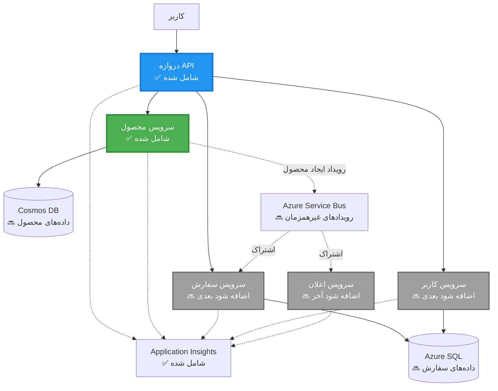
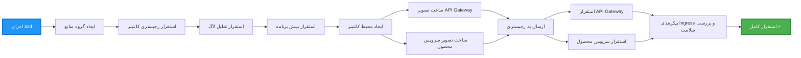
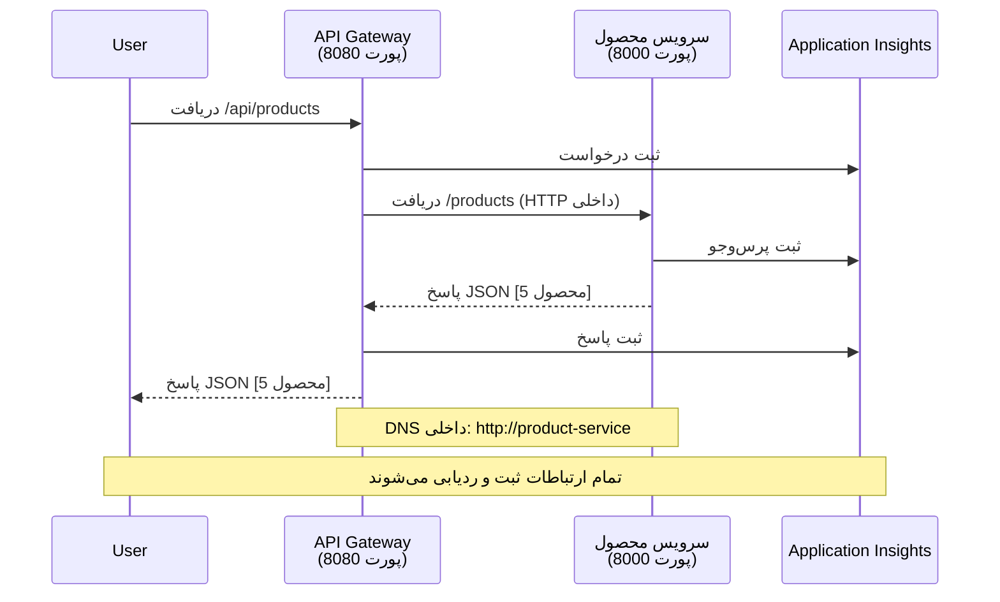

<!--
CO_OP_TRANSLATOR_METADATA:
{
  "original_hash": "eb3a4803a1e80a7f2e64f6bf63738c0f",
  "translation_date": "2025-11-20T02:07:27+00:00",
  "source_file": "examples/microservices/README.md",
  "language_code": "fa"
}
-->
# معماری میکروسرویس‌ها - مثال برنامه کانتینر

⏱️ **زمان تخمینی**: ۲۵-۳۵ دقیقه | 💰 **هزینه تخمینی**: حدود $۵۰-۱۰۰ در ماه | ⭐ **پیچیدگی**: پیشرفته

**📚 مسیر یادگیری:**
- ← قبلی: [API ساده Flask](../../../../examples/container-app/simple-flask-api) - اصول اولیه کانتینر تک
- 🎯 **شما اینجا هستید**: معماری میکروسرویس‌ها (پایه ۲ سرویس)
- → بعدی: [ادغام هوش مصنوعی](../../../../docs/ai-foundry) - افزودن هوش به سرویس‌های شما
- 🏠 [صفحه اصلی دوره](../../README.md)

---

یک معماری میکروسرویس **ساده اما کاربردی** که با استفاده از AZD CLI در Azure Container Apps مستقر شده است. این مثال ارتباط سرویس به سرویس، ارکستراسیون کانتینر و نظارت را با یک تنظیم عملی ۲ سرویس نشان می‌دهد.

> **📚 روش یادگیری**: این مثال با یک معماری حداقلی ۲ سرویس (API Gateway + سرویس Backend) شروع می‌شود که می‌توانید واقعاً مستقر کنید و از آن یاد بگیرید. پس از تسلط بر این پایه، راهنمایی‌هایی برای گسترش به یک اکوسیستم کامل میکروسرویس ارائه می‌دهیم.

## آنچه یاد خواهید گرفت

با تکمیل این مثال، شما:
- چندین کانتینر را در Azure Container Apps مستقر خواهید کرد
- ارتباط سرویس به سرویس را با شبکه داخلی پیاده‌سازی خواهید کرد
- مقیاس‌بندی مبتنی بر محیط و بررسی سلامت را پیکربندی خواهید کرد
- برنامه‌های توزیع‌شده را با Application Insights نظارت خواهید کرد
- الگوهای استقرار میکروسرویس‌ها و بهترین شیوه‌ها را درک خواهید کرد
- گسترش تدریجی از معماری ساده به پیچیده را یاد خواهید گرفت

## معماری

### فاز ۱: آنچه می‌سازیم (شامل این مثال)


**جزئیات اجزا:**

| جزء | هدف | دسترسی | منابع |
|-----|-----|--------|-------|
| **API Gateway** | درخواست‌های خارجی را به سرویس‌های Backend هدایت می‌کند | عمومی (HTTPS) | ۱ vCPU، ۲GB RAM، ۲-۲۰ نسخه |
| **سرویس محصول** | مدیریت کاتالوگ محصولات با داده‌های در حافظه | فقط داخلی | ۰.۵ vCPU، ۱GB RAM، ۱-۱۰ نسخه |
| **Application Insights** | ثبت مرکزی و ردیابی توزیع‌شده | پورتال Azure | ۱-۲ GB/ماه داده ورودی |

**چرا ساده شروع کنیم؟**
- ✅ سریع مستقر و درک کنید (۲۵-۳۵ دقیقه)
- ✅ الگوهای اصلی میکروسرویس‌ها را بدون پیچیدگی یاد بگیرید
- ✅ کد عملی که می‌توانید تغییر دهید و آزمایش کنید
- ✅ هزینه کمتر برای یادگیری (~$۵۰-۱۰۰/ماه در مقابل $۳۰۰-۱۴۰۰/ماه)
- ✅ اعتماد به نفس قبل از افزودن پایگاه داده‌ها و صف‌های پیام

**تشبیه**: این را مانند یادگیری رانندگی تصور کنید. شما با یک پارکینگ خالی (۲ سرویس) شروع می‌کنید، اصول اولیه را یاد می‌گیرید، سپس به ترافیک شهری (۵+ سرویس با پایگاه داده‌ها) پیشرفت می‌کنید.

### فاز ۲: گسترش آینده (معماری مرجع)

پس از تسلط بر معماری ۲ سرویس، می‌توانید گسترش دهید به:


بخش "راهنمای گسترش" در انتها را برای دستورالعمل‌های گام به گام ببینید.

## ویژگی‌های موجود

✅ **کشف سرویس**: کشف خودکار مبتنی بر DNS بین کانتینرها  
✅ **تعادل بار**: تعادل بار داخلی بین نسخه‌ها  
✅ **مقیاس‌بندی خودکار**: مقیاس‌بندی مستقل برای هر سرویس بر اساس درخواست‌های HTTP  
✅ **نظارت بر سلامت**: پروب‌های زنده بودن و آمادگی برای هر دو سرویس  
✅ **ثبت توزیع‌شده**: ثبت مرکزی با Application Insights  
✅ **شبکه داخلی**: ارتباط امن سرویس به سرویس  
✅ **ارکستراسیون کانتینر**: استقرار و مقیاس‌بندی خودکار  
✅ **به‌روزرسانی بدون توقف**: به‌روزرسانی‌های چرخشی با مدیریت نسخه  

## پیش‌نیازها

### ابزارهای مورد نیاز

قبل از شروع، مطمئن شوید که این ابزارها نصب شده‌اند:

1. **[Azure Developer CLI (azd)](https://learn.microsoft.com/azure/developer/azure-developer-cli/install-azd)** (نسخه ۱.۰.۰ یا بالاتر)
   ```bash
   azd version
   # خروجی مورد انتظار: نسخه azd 1.0.0 یا بالاتر
   ```

2. **[Azure CLI](https://learn.microsoft.com/cli/azure/install-azure-cli)** (نسخه ۲.۵۰.۰ یا بالاتر)
   ```bash
   az --version
   # خروجی مورد انتظار: azure-cli نسخه 2.50.0 یا بالاتر
   ```

3. **[Docker](https://www.docker.com/get-started)** (برای توسعه/آزمایش محلی - اختیاری)
   ```bash
   docker --version
   # خروجی مورد انتظار: نسخه داکر 20.10 یا بالاتر
   ```

### تأیید تنظیمات شما

این دستورات را اجرا کنید تا مطمئن شوید آماده هستید:

```bash
# بررسی Azure Developer CLI
azd version
# ✅ انتظار می‌رود: نسخه azd 1.0.0 یا بالاتر

# بررسی Azure CLI
az --version
# ✅ انتظار می‌رود: azure-cli نسخه 2.50.0 یا بالاتر

# بررسی Docker (اختیاری)
docker --version
# ✅ انتظار می‌رود: نسخه Docker 20.10 یا بالاتر
```

**معیار موفقیت**: همه دستورات شماره نسخه‌هایی را برمی‌گردانند که با حداقل‌ها مطابقت دارند یا بالاتر هستند.

### نیازمندی‌های Azure

- یک **اشتراک Azure** فعال ([ایجاد حساب رایگان](https://azure.microsoft.com/free/))
- مجوز برای ایجاد منابع در اشتراک شما
- نقش **Contributor** در اشتراک یا گروه منابع

### پیش‌نیازهای دانش

این یک مثال **سطح پیشرفته** است. شما باید:
- مثال [API ساده Flask](../../../../examples/container-app/simple-flask-api) را تکمیل کرده باشید
- درک پایه‌ای از معماری میکروسرویس‌ها داشته باشید
- با REST API‌ها و HTTP آشنا باشید
- مفاهیم کانتینر را درک کنید

**جدید به برنامه‌های کانتینر؟** ابتدا با مثال [API ساده Flask](../../../../examples/container-app/simple-flask-api) شروع کنید تا اصول اولیه را یاد بگیرید.

## شروع سریع (گام به گام)

### گام ۱: کلون و پیمایش

```bash
git clone https://github.com/microsoft/AZD-for-beginners.git
cd AZD-for-beginners/examples/microservices
```

**✓ بررسی موفقیت**: مطمئن شوید که `azure.yaml` را می‌بینید:
```bash
ls
# انتظار می‌رود: README.md، azure.yaml، infra/، src/
```

### گام ۲: احراز هویت با Azure

```bash
azd auth login
```

این مرورگر شما را برای احراز هویت Azure باز می‌کند. با اعتبارنامه‌های Azure خود وارد شوید.

**✓ بررسی موفقیت**: باید ببینید:
```
Logged in to Azure.
```

### گام ۳: مقداردهی اولیه محیط

```bash
azd init
```

**پرسش‌هایی که خواهید دید**:
- **نام محیط**: یک نام کوتاه وارد کنید (مثلاً `microservices-dev`)
- **اشتراک Azure**: اشتراک خود را انتخاب کنید
- **موقعیت Azure**: یک منطقه انتخاب کنید (مثلاً `eastus`, `westeurope`)

**✓ بررسی موفقیت**: باید ببینید:
```
SUCCESS: New project initialized!
```

### گام ۴: استقرار زیرساخت و سرویس‌ها

```bash
azd up
```

**چه اتفاقی می‌افتد** (۸-۱۲ دقیقه طول می‌کشد):


**✓ بررسی موفقیت**: باید ببینید:
```
SUCCESS: Your application was deployed to Azure in X minutes Y seconds.
Endpoint: https://api-gateway-<unique-id>.azurecontainerapps.io
```

**⏱️ زمان**: ۸-۱۲ دقیقه

### گام ۵: آزمایش استقرار

```bash
# دریافت نقطه پایانی دروازه
GATEWAY_URL=$(azd env get-values | grep API_GATEWAY_URL | cut -d '=' -f2 | tr -d '"')

# آزمایش سلامت API Gateway
curl $GATEWAY_URL/health
```

**✅ خروجی مورد انتظار:**
```json
{
  "status": "healthy",
  "service": "api-gateway",
  "timestamp": "2025-11-19T10:30:00Z"
}
```

**آزمایش سرویس محصول از طریق Gateway**:
```bash
# لیست محصولات
curl $GATEWAY_URL/api/products
```

**✅ خروجی مورد انتظار:**
```json
[
  {"id":1,"name":"Laptop","price":999.99,"stock":50},
  {"id":2,"name":"Mouse","price":29.99,"stock":200},
  {"id":3,"name":"Keyboard","price":79.99,"stock":150}
]
```

**✓ بررسی موفقیت**: هر دو نقطه پایانی داده JSON را بدون خطا برمی‌گردانند.

---

**🎉 تبریک!** شما یک معماری میکروسرویس را در Azure مستقر کرده‌اید!

## ساختار پروژه

تمام فایل‌های پیاده‌سازی شامل شده‌اند—این یک مثال کامل و عملی است:

```
microservices/
│
├── README.md                         # This file
├── azure.yaml                        # AZD configuration
├── .gitignore                        # Git ignore patterns
│
├── infra/                           # Infrastructure as Code (Bicep)
│   ├── main.bicep                   # Main orchestration
│   ├── abbreviations.json           # Naming conventions
│   ├── core/                        # Shared infrastructure
│   │   ├── container-apps-environment.bicep  # Container environment + registry
│   │   └── monitor.bicep            # Application Insights + Log Analytics
│   └── app/                         # Service definitions
│       ├── api-gateway.bicep        # API Gateway container app
│       └── product-service.bicep    # Product Service container app
│
└── src/                             # Application source code
    ├── api-gateway/                 # Node.js API Gateway
    │   ├── app.js                   # Express server with routing
    │   ├── package.json             # Node dependencies
    │   └── Dockerfile               # Container definition
    └── product-service/             # Python Product Service
        ├── main.py                  # Flask API with product data
        ├── requirements.txt         # Python dependencies
        └── Dockerfile               # Container definition
```

**هر جزء چه کاری انجام می‌دهد:**

**زیرساخت (infra/)**:
- `main.bicep`: تمام منابع Azure و وابستگی‌های آنها را ارکستراسیون می‌کند
- `core/container-apps-environment.bicep`: محیط برنامه‌های کانتینر و Azure Container Registry را ایجاد می‌کند
- `core/monitor.bicep`: Application Insights را برای ثبت توزیع‌شده تنظیم می‌کند
- `app/*.bicep`: تعریف‌های برنامه کانتینر فردی با مقیاس‌بندی و بررسی سلامت

**API Gateway (src/api-gateway/)**:
- سرویس عمومی که درخواست‌ها را به سرویس‌های Backend هدایت می‌کند
- ثبت، مدیریت خطا و هدایت درخواست را پیاده‌سازی می‌کند
- ارتباط HTTP سرویس به سرویس را نشان می‌دهد

**سرویس محصول (src/product-service/)**:
- سرویس داخلی با کاتالوگ محصول (برای سادگی در حافظه)
- API REST با بررسی سلامت
- مثال الگوی میکروسرویس Backend

## نمای کلی سرویس‌ها

### API Gateway (Node.js/Express)

**پورت**: ۸۰۸۰  
**دسترسی**: عمومی (ورودی خارجی)  
**هدف**: هدایت درخواست‌های ورودی به سرویس‌های Backend  

**نقاط پایانی**:
- `GET /` - اطلاعات سرویس
- `GET /health` - نقطه پایانی بررسی سلامت
- `GET /api/products` - هدایت به سرویس محصول (لیست همه)
- `GET /api/products/:id` - هدایت به سرویس محصول (دریافت بر اساس ID)

**ویژگی‌های کلیدی**:
- هدایت درخواست با axios
- ثبت مرکزی
- مدیریت خطا و زمان‌بندی
- کشف سرویس از طریق متغیرهای محیطی
- ادغام Application Insights

**برجسته‌سازی کد** (`src/api-gateway/app.js`):
```javascript
// ارتباط داخلی سرویس
app.get('/api/products', async (req, res) => {
  const response = await axios.get(`${PRODUCT_SERVICE_URL}/products`, {
    timeout: 5000
  });
  res.json(response.data);
});
```

### سرویس محصول (Python/Flask)

**پورت**: ۸۰۰۰  
**دسترسی**: فقط داخلی (بدون ورودی خارجی)  
**هدف**: مدیریت کاتالوگ محصول با داده‌های در حافظه  

**نقاط پایانی**:
- `GET /` - اطلاعات سرویس
- `GET /health` - نقطه پایانی بررسی سلامت
- `GET /products` - لیست همه محصولات
- `GET /products/<id>` - دریافت محصول بر اساس ID

**ویژگی‌های کلیدی**:
- API RESTful با Flask
- فروشگاه محصول در حافظه (ساده، بدون نیاز به پایگاه داده)
- نظارت بر سلامت با پروب‌ها
- ثبت ساختاریافته
- ادغام Application Insights

**مدل داده**:
```python
{
  "id": 1,
  "name": "Laptop",
  "description": "High-performance laptop",
  "price": 999.99,
  "stock": 50
}
```

**چرا فقط داخلی؟**
سرویس محصول به صورت عمومی در معرض قرار نمی‌گیرد. تمام درخواست‌ها باید از طریق API Gateway انجام شوند، که ارائه می‌دهد:
- امنیت: نقطه دسترسی کنترل‌شده
- انعطاف‌پذیری: می‌توان Backend را بدون تأثیر بر مشتریان تغییر داد
- نظارت: ثبت درخواست مرکزی

## درک ارتباط سرویس‌ها

### چگونه سرویس‌ها با یکدیگر ارتباط برقرار می‌کنند


در این مثال، API Gateway با سرویس محصول با استفاده از **تماس‌های HTTP داخلی** ارتباط برقرار می‌کند:

```javascript
// دروازه API (src/api-gateway/app.js)
const PRODUCT_SERVICE_URL = process.env.PRODUCT_SERVICE_URL;

// درخواست HTTP داخلی ایجاد کنید
const response = await axios.get(`${PRODUCT_SERVICE_URL}/products`);
```

**نکات کلیدی**:

1. **کشف مبتنی بر DNS**: برنامه‌های کانتینر به طور خودکار DNS را برای سرویس‌های داخلی فراهم می‌کنند
   - FQDN سرویس محصول: `product-service.internal.<environment>.azurecontainerapps.io`
   - ساده شده به: `http://product-service` (برنامه‌های کانتینر آن را حل می‌کنند)

2. **بدون نمایش عمومی**: سرویس محصول دارای `external: false` در Bicep است
   - فقط در محیط برنامه‌های کانتینر قابل دسترسی است
   - از اینترنت قابل دسترسی نیست

3. **متغیرهای محیطی**: URL‌های سرویس در زمان استقرار تزریق می‌شوند
   - Bicep FQDN داخلی را به Gateway منتقل می‌کند
   - هیچ URL سخت‌کدی در کد برنامه وجود ندارد

**تشبیه**: این را مانند اتاق‌های اداری تصور کنید. API Gateway میز پذیرش (عمومی) است و سرویس محصول یک اتاق اداری (فقط داخلی). بازدیدکنندگان باید از پذیرش عبور کنند تا به هر اتاقی برسند.

## گزینه‌های استقرار

### استقرار کامل (توصیه شده)

```bash
# استقرار زیرساخت و هر دو سرویس
azd up
```

این موارد را مستقر می‌کند:
1. محیط برنامه‌های کانتینر
2. Application Insights
3. Container Registry
4. کانتینر API Gateway
5. کانتینر سرویس محصول

**زمان**: ۸-۱۲ دقیقه

### استقرار سرویس فردی

```bash
# فقط یک سرویس را مستقر کنید (پس از azd up اولیه)
azd deploy api-gateway

# یا سرویس محصول را مستقر کنید
azd deploy product-service
```

**موارد استفاده**: زمانی که کد را در یک سرویس به‌روزرسانی کرده‌اید و می‌خواهید فقط آن سرویس را مجدداً مستقر کنید.

### به‌روزرسانی پیکربندی

```bash
# تغییر پارامترهای مقیاس‌گذاری
azd env set GATEWAY_MAX_REPLICAS 30

# بازاستقرار با پیکربندی جدید
azd up
```

## پیکربندی

### پیکربندی مقیاس‌بندی

هر دو سرویس با مقیاس‌بندی خودکار مبتنی بر HTTP در فایل‌های Bicep خود پیکربندی شده‌اند:

**API Gateway**:
- حداقل نسخه‌ها: ۲ (همیشه حداقل ۲ برای دسترسی)
- حداکثر نسخه‌ها: ۲۰
- محرک مقیاس: ۵۰ درخواست همزمان در هر نسخه

**سرویس محصول**:
- حداقل نسخه‌ها: ۱ (می‌تواند در صورت نیاز به صفر مقیاس شود)
- حداکثر نسخه‌ها: ۱۰
- محرک مقیاس: ۱۰۰ درخواست همزمان در هر نسخه

**مقیاس‌بندی سفارشی** (در `infra/app/*.bicep`):
```bicep
scale: {
  minReplicas: 1
  maxReplicas: 10
  rules: [
    {
      name: 'http-scale-rule'
      http: {
        metadata: {
          concurrentRequests: '100'  // Adjust this
        }
      }
    }
  ]
}
```

### تخصیص منابع

**API Gateway**:
- CPU: ۱.۰ vCPU
- حافظه: ۲ GiB
- دلیل: مدیریت تمام ترافیک خارجی

**سرویس محصول**:
- CPU: ۰.۵ vCPU
- حافظه: ۱ GiB
- دلیل: عملیات سبک در حافظه

### بررسی سلامت

هر دو سرویس شامل پروب‌های زنده بودن و آمادگی هستند:

```bicep
probes: [
  {
    type: 'Liveness'
    httpGet: {
      path: '/health'
      port: 8080
    }
    initialDelaySeconds: 10
    periodSeconds: 30
  }
  {
    type: 'Readiness'
    httpGet: {
      path: '/health'
      port: 8080
    }
    initialDelaySeconds: 5
    periodSeconds: 10
  }
]
```

**این چه معنایی دارد**:
- **زنده بودن**: اگر بررسی سلامت شکست بخورد، برنامه‌های کانتینر کانتینر را مجدداً راه‌اندازی می‌کنند
- **آمادگی**: اگر آماده نباشد، برنامه‌های کانتینر مسیریابی ترافیک به آن نسخه را متوقف می‌کنند

## نظارت و مشاهده‌پذیری

### مشاهده لاگ‌های سرویس

```bash
# جریان گزارش‌ها از API Gateway
azd logs api-gateway --follow

# مشاهده گزارش‌های اخیر سرویس محصول
azd logs product-service --tail 100

# مشاهده تمام گزارش‌ها از هر دو سرویس
azd logs --follow
```

**خروجی مورد انتظار**:
```
[api-gateway] API Gateway listening on port 8080
[api-gateway] Product Service URL: http://product-service
[api-gateway] GET /api/products 200 - 45ms
[product-service] Retrieved 5 products
```

### پرسش‌های Application Insights

به Application Insights در پورتال Azure دسترسی پیدا کنید، سپس این پرسش‌ها را اجرا کنید:

**یافتن درخواست‌های کند**:
```kusto
requests
| where timestamp > ago(1h)
| where duration > 1000  // Requests taking >1 second
| summarize count() by name, cloud_RoleName
| order by count_ desc
```

**ردیابی تماس‌های سرویس به سرویس**:
```kusto
dependencies
| where timestamp > ago(1h)
| where type == "Http"
| project timestamp, name, target, duration, success
| order by timestamp desc
```

**نرخ خطا بر اساس سرویس**:
```kusto
exceptions
| where timestamp > ago(24h)
| summarize errorCount = count() by cloud_RoleName, type
| order by errorCount desc
```

**حجم درخواست در طول زمان**:
```kusto
requests
| where timestamp > ago(1h)
| summarize requestCount = count() by bin(timestamp, 5m), cloud_RoleName
| render timechart
```

### دسترسی به داشبورد نظارت

```bash
# دریافت جزئیات Application Insights
azd env get-values | grep APPLICATIONINSIGHTS

# باز کردن مانیتورینگ Azure Portal
az monitor app-insights component show \
  --app $(azd env get-values | grep APPLICATIONINSIGHTS_CONNECTION_STRING | cut -d '=' -f2) \
  --resource-group $(azd env get-values | grep AZURE_RESOURCE_GROUP | cut -d '=' -f2) \
  --query "appId" -o tsv
```

### معیارهای زنده

1. به Application Insights در پورتال Azure بروید
2. روی "Live Metrics" کلیک کنید
3. درخواست‌ها، شکست‌ها و عملکرد را به صورت زنده ببینید
4. آزمایش کنید با اجرای: `curl $(azd env get-values | grep API_GATEWAY_URL | cut -d '=' -f2 | tr -d '"')/api/products`

## تمرین‌های عملی

### تمرین ۱: افزودن نقطه پایانی محصول جدید ⭐ (آسان)

**هدف**: افزودن یک نقطه پایانی POST برای ایجاد محصولات جدید

**نقطه شروع**: `src/product-service/main.py`

**گام‌ها**:

1. این نقطه پایانی را بعد از تابع `get_product` در `main.py` اضافه کنید:

```python
@app.route('/products', methods=['POST'])
def create_product():
    """Create a new product"""
    data = request.get_json()
    
    # اعتبارسنجی فیلدهای ضروری
    if not data or 'name' not in data or 'price' not in data:
        return jsonify({'error': 'Missing required fields: name, price'}), 400
    
    new_id = max(p['id'] for p in products) + 1
    new_product = {
        'id': new_id,
        'name': data['name'],
        'description': data.get('description', ''),
        'price': float(data['price']),
        'stock': int(data.get('stock', 0))
    }
    products.append(new_product)
    logger.info(f"Created product {new_id}")
    return jsonify(new_product), 201
```

2. مسیر POST را به API Gateway (`src/api-gateway/app.js`) اضافه کنید:

```javascript
// این را بعد از مسیر GET /api/products اضافه کنید
app.post('/api/products', async (req, res) => {
  try {
    console.log(`Forwarding POST request to ${PRODUCT_SERVICE_URL}/products`);
    const response = await axios.post(`${PRODUCT_SERVICE_URL}/products`, req.body, {
      timeout: 5000
    });
    res.status(201).json(response.data);
  } catch (error) {
    console.error('Error calling product service:', error.message);
    res.status(503).json({
      error: 'Product service unavailable',
      message: error.message
    });
  }
});
```

3. هر دو سرویس را دوباره مستقر کنید:

```bash
azd deploy product-service
azd deploy api-gateway
```

4. نقطه پایانی جدید را آزمایش کنید:

```bash
GATEWAY_URL=$(azd env get-values | grep API_GATEWAY_URL | cut -d '=' -f2 | tr -d '"')

# ایجاد یک محصول جدید
curl -X POST $GATEWAY_URL/api/products \
  -H "Content-Type: application/json" \
  -d '{"name":"USB Cable","price":9.99,"stock":500}'
```

**✅ خروجی مورد انتظار:**
```json
{"id":6,"name":"USB Cable","description":"","price":9.99,"stock":500}
```

5. بررسی کنید که در لیست ظاهر شود:

```bash
curl $GATEWAY_URL/api/products
# اکنون باید ۶ محصول از جمله کابل USB جدید را نشان دهد
```

**معیارهای موفقیت**:
- ✅ درخواست POST کد HTTP 201 را برمی‌گرداند
- ✅ محصول جدید در لیست GET /api/products ظاهر می‌شود
- ✅ محصول دارای شناسه خودکار افزایشی است

**زمان**: 10-15 دقیقه

---

### تمرین 2: تغییر قوانین مقیاس‌بندی خودکار ⭐⭐ (متوسط)

**هدف**: تغییر سرویس محصول برای مقیاس‌بندی تهاجمی‌تر

**نقطه شروع**: `infra/app/product-service.bicep`

**مراحل**:

1. فایل `infra/app/product-service.bicep` را باز کنید و بلوک `scale` را پیدا کنید (حدود خط 95)

2. تغییر دهید از:
```bicep
scale: {
  minReplicas: 1
  maxReplicas: 10
  rules: [
    {
      name: 'http-scale-rule'
      http: {
        metadata: {
          concurrentRequests: '100'  // OLD
        }
      }
    }
  ]
}
```

به:
```bicep
scale: {
  minReplicas: 2  // Always have 2 running
  maxReplicas: 20  // Allow more scaling
  rules: [
    {
      name: 'http-scale-rule'
      http: {
        metadata: {
          concurrentRequests: '20'  // Scale at lower threshold
        }
      }
    }
  ]
}
```

3. زیرساخت را دوباره مستقر کنید:

```bash
azd up
```

4. پیکربندی جدید مقیاس‌بندی را بررسی کنید:

```bash
az containerapp show \
  --name $(azd env get-values | grep PRODUCT_SERVICE | head -1 | cut -d '/' -f5) \
  --resource-group $(azd env get-values | grep AZURE_RESOURCE_GROUP | cut -d '=' -f2 | tr -d '"') \
  --query "properties.template.scale" -o json
```

**✅ خروجی مورد انتظار:**
```json
{
  "minReplicas": 2,
  "maxReplicas": 20,
  "rules": [...]
}
```

5. مقیاس‌بندی خودکار را با بار آزمایش کنید:

```bash
# تولید درخواست‌های همزمان
for i in {1..500}; do curl $GATEWAY_URL/api/products & done

# نظاره‌گر رخ دادن مقیاس‌گذاری باشید
azd logs product-service --follow
# به دنبال این باشید: رویدادهای مقیاس‌گذاری برنامه‌های کانتینری
```

**معیارهای موفقیت**:
- ✅ سرویس محصول همیشه حداقل 2 نمونه اجرا می‌کند
- ✅ تحت بار، به بیش از 2 نمونه مقیاس‌بندی می‌شود
- ✅ پورتال Azure قوانین جدید مقیاس‌بندی را نشان می‌دهد

**زمان**: 15-20 دقیقه

---

### تمرین 3: افزودن پرسش سفارشی نظارت ⭐⭐ (متوسط)

**هدف**: ایجاد یک پرسش سفارشی در Application Insights برای ردیابی عملکرد API محصول

**مراحل**:

1. به Application Insights در پورتال Azure بروید:
   - به پورتال Azure بروید
   - گروه منابع خود را پیدا کنید (rg-microservices-*)
   - روی منبع Application Insights کلیک کنید

2. در منوی سمت چپ روی "Logs" کلیک کنید

3. این پرسش را ایجاد کنید:

```kusto
requests
| where timestamp > ago(1h)
| where name contains "products"
| summarize 
    RequestCount = count(),
    AvgDuration = avg(duration),
    P95Duration = percentile(duration, 95),
    SuccessRate = 100.0 * countif(success == true) / count()
  by bin(timestamp, 5m)
| render timechart
```

4. روی "Run" کلیک کنید تا پرسش اجرا شود

5. پرسش را ذخیره کنید:
   - روی "Save" کلیک کنید
   - نام: "Product API Performance"
   - دسته‌بندی: "Performance"

6. ترافیک آزمایشی ایجاد کنید:

```bash
for i in {1..100}; do curl $GATEWAY_URL/api/products; sleep 1; done
```

7. پرسش را تازه‌سازی کنید تا داده‌ها را ببینید

**✅ خروجی مورد انتظار:**
- نموداری که تعداد درخواست‌ها را در طول زمان نشان می‌دهد
- میانگین مدت زمان < 500 میلی‌ثانیه
- نرخ موفقیت = 100%
- بازه‌های زمانی 5 دقیقه‌ای

**معیارهای موفقیت**:
- ✅ پرسش 100+ درخواست را نشان می‌دهد
- ✅ نرخ موفقیت 100% است
- ✅ میانگین مدت زمان < 500 میلی‌ثانیه
- ✅ نمودار بازه‌های زمانی 5 دقیقه‌ای را نمایش می‌دهد

**نتیجه یادگیری**: درک نحوه نظارت بر عملکرد سرویس با پرسش‌های سفارشی

**زمان**: 10-15 دقیقه

---

### تمرین 4: پیاده‌سازی منطق تلاش مجدد ⭐⭐⭐ (پیشرفته)

**هدف**: افزودن منطق تلاش مجدد به API Gateway زمانی که سرویس محصول به طور موقت در دسترس نیست

**نقطه شروع**: `src/api-gateway/app.js`

**مراحل**:

1. کتابخانه تلاش مجدد را نصب کنید:

```bash
cd src/api-gateway
npm install axios-retry --save
cd ../..
```

2. فایل `src/api-gateway/app.js` را به‌روزرسانی کنید (بعد از وارد کردن axios اضافه کنید):

```javascript
const axiosRetry = require('axios-retry');

// تنظیم منطق تلاش مجدد
axiosRetry(axios, {
  retries: 3,
  retryDelay: (retryCount) => {
    return retryCount * 1000; // ۱ ثانیه، ۲ ثانیه، ۳ ثانیه
  },
  retryCondition: (error) => {
    // تلاش مجدد در صورت خطاهای شبکه یا پاسخ‌های ۵xx
    return axiosRetry.isNetworkOrIdempotentRequestError(error) ||
           (error.response && error.response.status >= 500);
  }
});

console.log('Retry logic configured: 3 retries with exponential backoff');
```

3. API Gateway را دوباره مستقر کنید:

```bash
azd deploy api-gateway
```

4. رفتار تلاش مجدد را با شبیه‌سازی خرابی سرویس آزمایش کنید:

```bash
# مقیاس سرویس محصول به 0 (شبیه‌سازی خرابی)
az containerapp update \
  --name $(azd env get-values | grep PRODUCT_SERVICE | head -1 | cut -d '/' -f5) \
  --resource-group $(azd env get-values | grep AZURE_RESOURCE_GROUP | cut -d '=' -f2 | tr -d '"') \
  --min-replicas 0 \
  --max-replicas 0

# تلاش برای دسترسی به محصولات (3 بار تلاش مجدد خواهد شد)
time curl -v $GATEWAY_URL/api/products
# مشاهده: پاسخ حدود ~6 ثانیه طول می‌کشد (1 ثانیه + 2 ثانیه + 3 ثانیه تلاش‌های مجدد)

# بازگرداندن سرویس محصول
az containerapp update \
  --name $(azd env get-values | grep PRODUCT_SERVICE | head -1 | cut -d '/' -f5) \
  --resource-group $(azd env get-values | grep AZURE_RESOURCE_GROUP | cut -d '=' -f2 | tr -d '"') \
  --min-replicas 1 \
  --max-replicas 10
```

5. لاگ‌های تلاش مجدد را مشاهده کنید:

```bash
azd logs api-gateway --tail 50
# به دنبال پیام‌های تلاش مجدد باشید
```

**✅ رفتار مورد انتظار:**
- درخواست‌ها 3 بار قبل از شکست تلاش می‌کنند
- هر تلاش مدت بیشتری منتظر می‌ماند (1 ثانیه، 2 ثانیه، 3 ثانیه)
- درخواست‌های موفق پس از راه‌اندازی مجدد سرویس
- لاگ‌ها تلاش‌های مجدد را نشان می‌دهند

**معیارهای موفقیت**:
- ✅ درخواست‌ها 3 بار قبل از شکست تلاش می‌کنند
- ✅ هر تلاش مدت بیشتری منتظر می‌ماند (افزایش نمایی)
- ✅ درخواست‌های موفق پس از راه‌اندازی مجدد سرویس
- ✅ لاگ‌ها تلاش‌های مجدد را نشان می‌دهند

**نتیجه یادگیری**: درک الگوهای مقاومت در میکروسرویس‌ها (قطع‌کننده مدار، تلاش مجدد، زمان‌بندی)

**زمان**: 20-25 دقیقه

---

## نقطه بررسی دانش

پس از تکمیل این مثال، دانش خود را بررسی کنید:

### 1. ارتباط سرویس ✓

دانش خود را آزمایش کنید:
- [ ] آیا می‌توانید توضیح دهید که API Gateway چگونه سرویس محصول را کشف می‌کند؟ (کشف سرویس مبتنی بر DNS)
- [ ] اگر سرویس محصول خراب شود چه اتفاقی می‌افتد؟ (Gateway خطای 503 برمی‌گرداند)
- [ ] چگونه یک سرویس سوم اضافه می‌کنید؟ (ایجاد فایل Bicep جدید، افزودن به main.bicep، ایجاد پوشه src)

**تأیید عملی**:
```bash
# شبیه‌سازی خرابی سرویس
az containerapp update --name <product-service-name> --min-replicas 0 --max-replicas 0
curl $GATEWAY_URL/api/products
# ✅ انتظار می‌رود: 503 سرویس در دسترس نیست

# بازگرداندن سرویس
az containerapp update --name <product-service-name> --min-replicas 1 --max-replicas 10
```

### 2. نظارت و مشاهده‌پذیری ✓

دانش خود را آزمایش کنید:
- [ ] کجا می‌توانید لاگ‌های توزیع‌شده را ببینید؟ (Application Insights در پورتال Azure)
- [ ] چگونه درخواست‌های کند را ردیابی می‌کنید؟ (پرسش Kusto: `requests | where duration > 1000`)
- [ ] آیا می‌توانید مشخص کنید کدام سرویس باعث خطا شده است؟ (بررسی فیلد `cloud_RoleName` در لاگ‌ها)

**تأیید عملی**:
```bash
# شبیه‌سازی درخواست کند ایجاد کنید
curl "$GATEWAY_URL/api/products?delay=2000"

# درخواست‌های کند را در Application Insights جستجو کنید
# به پورتال Azure → Application Insights → Logs بروید
# اجرا کنید: requests | where duration > 1000 | project timestamp, name, duration, cloud_RoleName
```

### 3. مقیاس‌بندی و عملکرد ✓

دانش خود را آزمایش کنید:
- [ ] چه چیزی باعث مقیاس‌بندی خودکار می‌شود؟ (قوانین درخواست همزمان HTTP: 50 برای Gateway، 100 برای محصول)
- [ ] اکنون چند نمونه اجرا می‌شود؟ (بررسی با `az containerapp revision list`)
- [ ] چگونه سرویس محصول را به 5 نمونه مقیاس‌بندی می‌کنید؟ (به‌روزرسانی minReplicas در Bicep)

**تأیید عملی**:
```bash
# تولید بار برای آزمایش مقیاس‌پذیری خودکار
for i in {1..1000}; do curl $GATEWAY_URL/api/products & done

# مشاهده افزایش تعداد نسخه‌ها
azd logs api-gateway --follow
# ✅ انتظار می‌رود: مشاهده رویدادهای مقیاس‌پذیری در گزارش‌ها
```

**معیارهای موفقیت**: شما می‌توانید به همه سوالات پاسخ دهید و با دستورات عملی تأیید کنید.

---

## تحلیل هزینه

### هزینه‌های ماهانه تخمینی (برای این مثال 2 سرویس)

| منبع | پیکربندی | هزینه تخمینی |
|----------|--------------|----------------|
| API Gateway | 2-20 نمونه، 1 vCPU، 2GB RAM | $30-150 |
| سرویس محصول | 1-10 نمونه، 0.5 vCPU، 1GB RAM | $15-75 |
| Container Registry | سطح پایه | $5 |
| Application Insights | 1-2 GB/ماه | $5-10 |
| Log Analytics | 1 GB/ماه | $3 |
| **مجموع** | | **$58-243/ماه** |

### تفکیک هزینه بر اساس استفاده

**ترافیک سبک** (آزمایش/یادگیری): ~$60/ماه
- API Gateway: 2 نمونه × 24/7 = $30
- سرویس محصول: 1 نمونه × 24/7 = $15
- نظارت + رجیستری = $13

**ترافیک متوسط** (تولید کوچک): ~$120/ماه
- API Gateway: میانگین 5 نمونه = $75
- سرویس محصول: میانگین 3 نمونه = $45
- نظارت + رجیستری = $13

**ترافیک بالا** (دوره‌های شلوغ): ~$240/ماه
- API Gateway: میانگین 15 نمونه = $225
- سرویس محصول: میانگین 8 نمونه = $120
- نظارت + رجیستری = $13

### نکات بهینه‌سازی هزینه

1. **مقیاس به صفر برای توسعه**:
   ```bicep
   scale: {
     minReplicas: 0  // Save $30-40/month when not in use
     maxReplicas: 10
   }
   ```

2. **استفاده از طرح مصرفی برای Cosmos DB** (وقتی آن را اضافه می‌کنید):
   - فقط برای آنچه استفاده می‌کنید پرداخت کنید
   - بدون هزینه حداقل

3. **تنظیم نمونه‌گیری Application Insights**:
   ```javascript
   appInsights.defaultClient.config.samplingPercentage = 50; // نمونه‌گیری ۵۰٪ از درخواست‌ها
   ```

4. **پاکسازی زمانی که نیاز نیست**:
   ```bash
   azd down --force --purge
   ```

### گزینه‌های سطح رایگان

برای یادگیری/آزمایش، در نظر بگیرید:
- ✅ استفاده از اعتبار رایگان Azure ($200 برای 30 روز اول با حساب‌های جدید)
- ✅ حفظ حداقل نمونه‌ها (صرفه‌جویی ~50% هزینه‌ها)
- ✅ حذف پس از آزمایش (بدون هزینه‌های جاری)
- ✅ مقیاس به صفر بین جلسات یادگیری

**مثال**: اجرای این مثال برای 2 ساعت/روز × 30 روز = ~$5/ماه به جای $60/ماه

---

## مرجع سریع رفع اشکال

### مشکل: `azd up` با خطای "Subscription not found" شکست می‌خورد

**راه‌حل**:
```bash
# دوباره با اشتراک صریح وارد شوید
az account set --subscription <your-subscription-id>
azd env set AZURE_SUBSCRIPTION_ID <your-subscription-id>
azd up
```

### مشکل: API Gateway خطای 503 "Product service unavailable" را برمی‌گرداند

**تشخیص**:
```bash
# بررسی گزارش‌های سرویس محصول
azd logs product-service --tail 50

# بررسی سلامت سرویس محصول
az containerapp show \
  --name $(azd env get-values | grep PRODUCT_SERVICE | head -1 | cut -d '/' -f5) \
  --resource-group $(azd env get-values | grep AZURE_RESOURCE_GROUP | cut -d '=' -f2 | tr -d '"') \
  --query "properties.runningStatus"
```

**دلایل رایج**:
1. سرویس محصول شروع نشده است (لاگ‌ها را برای خطاهای Python بررسی کنید)
2. بررسی سلامت شکست خورده است (تأیید کنید که نقطه پایانی `/health` کار می‌کند)
3. ساخت تصویر کانتینر شکست خورده است (رجیستری را برای تصویر بررسی کنید)

### مشکل: مقیاس‌بندی خودکار کار نمی‌کند

**تشخیص**:
```bash
# بررسی تعداد فعلی نسخه‌ها
az containerapp revision list \
  --name $(azd env get-values | grep API_GATEWAY | head -1 | cut -d '/' -f5) \
  --resource-group $(azd env get-values | grep AZURE_RESOURCE_GROUP | cut -d '=' -f2 | tr -d '"') \
  --query "[].properties.replicas"

# تولید بار برای آزمایش
for i in {1..1000}; do curl $GATEWAY_URL/api/products & done

# مشاهده رویدادهای مقیاس‌بندی
azd logs api-gateway --follow | grep -i scale
```

**دلایل رایج**:
1. بار به اندازه کافی بالا نیست تا قانون مقیاس‌بندی را فعال کند (نیاز به >50 درخواست همزمان)
2. حداکثر نمونه‌ها قبلاً به دست آمده است (پیکربندی Bicep را بررسی کنید)
3. قانون مقیاس‌بندی در Bicep اشتباه پیکربندی شده است (مقدار concurrentRequests را تأیید کنید)

### مشکل: Application Insights لاگ‌ها را نشان نمی‌دهد

**تشخیص**:
```bash
# بررسی کنید که رشته اتصال تنظیم شده است
azd env get-values | grep APPLICATIONINSIGHTS

# بررسی کنید که آیا خدمات در حال ارسال اطلاعات هستند
az monitor app-insights component show \
  --app $(azd env get-values | grep APPLICATIONINSIGHTS_NAME | cut -d '=' -f2 | tr -d '"') \
  --resource-group $(azd env get-values | grep AZURE_RESOURCE_GROUP | cut -d '=' -f2 | tr -d '"') \
  --query "properties.InstrumentationKey"
```

**دلایل رایج**:
1. رشته اتصال به کانتینر منتقل نشده است (متغیرهای محیطی را بررسی کنید)
2. SDK Application Insights پیکربندی نشده است (واردات در کد را تأیید کنید)
3. فایروال تله‌متری را مسدود می‌کند (نادر، قوانین شبکه را بررسی کنید)

### مشکل: ساخت Docker به صورت محلی شکست می‌خورد

**تشخیص**:
```bash
# آزمایش ساخت دروازه API
cd src/api-gateway
docker build -t test-gateway .

# آزمایش ساخت سرویس محصول
cd ../product-service
docker build -t test-product .
```

**دلایل رایج**:
1. وابستگی‌های گم‌شده در package.json/requirements.txt
2. خطاهای نحوی در Dockerfile
3. مشکلات شبکه در دانلود وابستگی‌ها

**هنوز گیر کرده‌اید؟** به [راهنمای مشکلات رایج](../../docs/troubleshooting/common-issues.md) یا [رفع اشکال Azure Container Apps](https://learn.microsoft.com/azure/container-apps/troubleshooting) مراجعه کنید

---

## پاکسازی

برای جلوگیری از هزینه‌های جاری، همه منابع را حذف کنید:

```bash
azd down --force --purge
```

**پیام تأیید**:
```
? Total resources to delete: 6, are you sure you want to continue? (y/N)
```

`y` را تایپ کنید تا تأیید شود.

**چه چیزی حذف می‌شود**:
- محیط برنامه‌های کانتینر
- هر دو برنامه کانتینر (Gateway و سرویس محصول)
- رجیستری کانتینر
- Application Insights
- فضای کاری Log Analytics
- گروه منابع

**✓ تأیید پاکسازی**:
```bash
az group list --query "[?starts_with(name,'rg-microservices')]" --output table
```

باید خالی برگردد.

---

## راهنمای گسترش: از 2 به 5+ سرویس

پس از تسلط بر این معماری 2 سرویس، در اینجا نحوه گسترش آمده است:

### مرحله 1: افزودن پایگاه داده (گام بعدی)

**افزودن Cosmos DB برای سرویس محصول**:

1. ایجاد `infra/core/cosmos.bicep`:
   ```bicep
   resource cosmosAccount 'Microsoft.DocumentDB/databaseAccounts@2023-04-15' = {
     name: name
     location: location
     kind: 'GlobalDocumentDB'
     properties: {
       databaseAccountOfferType: 'Standard'
       consistencyPolicy: { defaultConsistencyLevel: 'Session' }
       locations: [{ locationName: location, failoverPriority: 0 }]
     }
   }
   ```

2. به‌روزرسانی سرویس محصول برای استفاده از Azure Cosmos DB Python SDK به جای داده‌های درون‌حافظه‌ای

3. هزینه اضافی تخمینی: ~$25/ماه (بدون سرور)

### مرحله 2: افزودن سرویس سوم (مدیریت سفارش)

**ایجاد سرویس سفارش**:

1. پوشه جدید: `src/order-service/` (Python/Node.js/C#)
2. Bicep جدید: `infra/app/order-service.bicep`
3. به‌روزرسانی API Gateway برای مسیریابی `/api/orders`
4. افزودن پایگاه داده Azure SQL برای ذخیره سفارش‌ها

**معماری به این شکل می‌شود**:
```
API Gateway → Product Service (Cosmos DB)
           → Order Service (Azure SQL)
```

### مرحله 3: افزودن ارتباط غیرهمزمان (Service Bus)

**پیاده‌سازی معماری مبتنی بر رویداد**:

1. افزودن Azure Service Bus: `infra/core/servicebus.bicep`
2. سرویس محصول رویدادهای "ProductCreated" را منتشر می‌کند
3. سرویس سفارش مشترک رویدادهای محصول می‌شود
4. افزودن سرویس اعلان برای پردازش رویدادها

**الگو**: درخواست/پاسخ (HTTP) + مبتنی بر رویداد (Service Bus)

### مرحله 4: افزودن احراز هویت کاربر

**پیاده‌سازی سرویس کاربر**:

1. ایجاد `src/user-service/` (Go/Node.js)
2. افزودن Azure AD B2C یا احراز هویت JWT سفارشی
3. API Gateway توکن‌ها را قبل از مسیریابی اعتبارسنجی می‌کند
4. سرویس‌ها مجوزهای کاربر را بررسی می‌کنند

### مرحله 5: آمادگی برای تولید

**افزودن این اجزا**:
- ✅ Azure Front Door (تعادل بار جهانی)
- ✅ Azure Key Vault (مدیریت اسرار)
- ✅ Azure Monitor Workbooks (داشبوردهای سفارشی)
- ✅ خط لوله CI/CD (GitHub Actions)
- ✅ استقرار آبی-سبز
- ✅ هویت مدیریت‌شده برای همه سرویس‌ها

**هزینه کامل معماری تولید**: ~$300-1,400/ماه

---

## اطلاعات بیشتر

### مستندات مرتبط
- [مستندات Azure Container Apps](https://learn.microsoft.com/azure/container-apps/)
- [راهنمای معماری میکروسرویس‌ها](https://learn.microsoft.com/azure/architecture/guide/architecture-styles/microservices)
- [Application Insights برای ردیابی توزیع‌شده](https://learn.microsoft.com/azure/azure-monitor/app/distributed-tracing)
- [مستندات Azure Developer CLI](https://learn.microsoft.com/azure/developer/azure-developer-cli/)

### گام‌های بعدی در این دوره
- ← قبلی: [API ساده Flask](../../../../examples/container-app/simple-flask-api) - مثال مبتدی تک کانتینر
- → بعدی: [راهنمای ادغام AI](../../../../docs/ai-foundry) - افزودن قابلیت‌های AI
- 🏠 [صفحه اصلی دوره](../../README.md)

### مقایسه: چه زمانی از چه چیزی استفاده کنیم

| ویژگی | کانتینر تک | میکروسرویس‌ها (این) | Kubernetes (AKS) |
|---------|-----------------|---------------------|------------------|
| **مورد استفاده** | برنامه‌های ساده | برنامه‌های پیچیده | برنامه‌های سازمانی |
| **مقیاس‌پذیری** | سرویس واحد | مقیاس‌بندی بر اساس سرویس | حداکثر انعطاف‌پذیری |
| **پیچیدگی** | کم | متوسط | بالا |
| **اندازه تیم** | 1-3 توسعه‌دهنده | 3-10 توسعه‌دهنده | 10+ توسعه‌دهنده |
| **هزینه** | ~$15-50/ماه | ~$60-250/ماه | ~$150-500/ماه |
| **زمان استقرار** | 5-10 دقیقه | 8-12 دقیقه | 15-30 دقیقه |
| **بهترین گزینه برای** | MVPها، نمونه‌های اولیه | اپلیکیشن‌های تولیدی | چند ابری، شبکه‌سازی پیشرفته |

**توصیه**: با Container Apps شروع کنید (این مثال)، به AKS بروید فقط اگر به ویژگی‌های خاص Kubernetes نیاز دارید.

---

## سوالات متداول

**س: چرا فقط ۲ سرویس به جای ۵+؟**  
ج: پیشرفت آموزشی. ابتدا اصول اولیه (ارتباط سرویس‌ها، نظارت، مقیاس‌پذیری) را با یک مثال ساده یاد بگیرید، سپس پیچیدگی را اضافه کنید. الگوهایی که اینجا یاد می‌گیرید در معماری‌های ۱۰۰ سرویس نیز کاربرد دارند.

**س: آیا می‌توانم خودم سرویس‌های بیشتری اضافه کنم؟**  
ج: قطعاً! راهنمای گسترش بالا را دنبال کنید. هر سرویس جدید همان الگو را دنبال می‌کند: ایجاد پوشه src، ایجاد فایل Bicep، به‌روزرسانی azure.yaml، و استقرار.

**س: آیا این آماده تولید است؟**  
ج: این یک پایه محکم است. برای تولید، اضافه کنید: هویت مدیریت‌شده، Key Vault، پایگاه داده‌های پایدار، خط لوله CI/CD، هشدارهای نظارتی، و استراتژی پشتیبان‌گیری.

**س: چرا از Dapr یا سایر سرویس مش‌ها استفاده نمی‌کنید؟**  
ج: برای یادگیری ساده نگه دارید. وقتی شبکه‌سازی بومی Container Apps را درک کردید، می‌توانید Dapr را برای سناریوهای پیشرفته (مدیریت حالت، pub/sub، bindings) اضافه کنید.

**س: چگونه به صورت محلی دیباگ کنم؟**  
ج: سرویس‌ها را با Docker به صورت محلی اجرا کنید:  
```bash
cd src/api-gateway
docker build -t local-gateway .
docker run -p 8080:8080 -e PRODUCT_SERVICE_URL=http://localhost:8000 local-gateway
```
  
**س: آیا می‌توانم از زبان‌های برنامه‌نویسی مختلف استفاده کنم؟**  
ج: بله! این مثال Node.js (gateway) + Python (سرویس محصول) را نشان می‌دهد. می‌توانید هر زبان دیگری که در کانتینرها اجرا می‌شود ترکیب کنید: C#، Go، Java، Ruby، PHP و غیره.

**س: اگر اعتبار Azure ندارم چه کنم؟**  
ج: از سطح رایگان Azure استفاده کنید (۳۰ روز اول با حساب‌های جدید ۲۰۰ دلار اعتبار دریافت می‌کنند) یا برای دوره‌های آزمایشی کوتاه مستقر کنید و بلافاصله حذف کنید. هزینه این مثال حدود ~۲ دلار در روز است.

**س: این چگونه با Azure Kubernetes Service (AKS) متفاوت است؟**  
ج: Container Apps ساده‌تر است (نیازی به دانش Kubernetes ندارد) اما انعطاف‌پذیری کمتری دارد. AKS کنترل کامل Kubernetes را به شما می‌دهد اما به تخصص بیشتری نیاز دارد. با Container Apps شروع کنید، در صورت نیاز به AKS بروید.

**س: آیا می‌توانم از این با سرویس‌های موجود Azure استفاده کنم؟**  
ج: بله! می‌توانید به پایگاه داده‌های موجود، حساب‌های ذخیره‌سازی، Service Bus و غیره متصل شوید. فایل‌های Bicep را به‌روزرسانی کنید تا به منابع موجود اشاره کنند به جای ایجاد منابع جدید.

---

> **🎓 خلاصه مسیر یادگیری**: شما یاد گرفتید که یک معماری چند سرویس را با مقیاس‌پذیری خودکار، شبکه‌سازی داخلی، نظارت متمرکز، و الگوهای آماده تولید مستقر کنید. این پایه شما را برای سیستم‌های توزیع‌شده پیچیده و معماری‌های میکروسرویس‌های سازمانی آماده می‌کند.

**📚 ناوبری دوره:**
- ← قبلی: [API ساده Flask](../../../../examples/container-app/simple-flask-api)
- → بعدی: [مثال یکپارچه‌سازی پایگاه داده](../../../../database-app)
- 🏠 [صفحه اصلی دوره](../../README.md)
- 📖 [بهترین شیوه‌های Container Apps](../../docs/deployment/deployment-guide.md)

---

**✨ تبریک!** شما مثال میکروسرویس‌ها را به پایان رساندید. اکنون می‌دانید چگونه اپلیکیشن‌های توزیع‌شده را در Azure Container Apps بسازید، مستقر کنید و نظارت کنید. آماده اضافه کردن قابلیت‌های هوش مصنوعی هستید؟ راهنمای [یکپارچه‌سازی هوش مصنوعی](../../../../docs/ai-foundry) را بررسی کنید!

---

<!-- CO-OP TRANSLATOR DISCLAIMER START -->
**سلب مسئولیت**:  
این سند با استفاده از سرویس ترجمه هوش مصنوعی [Co-op Translator](https://github.com/Azure/co-op-translator) ترجمه شده است. در حالی که ما تلاش می‌کنیم دقت را حفظ کنیم، لطفاً توجه داشته باشید که ترجمه‌های خودکار ممکن است شامل خطاها یا نادرستی‌ها باشند. سند اصلی به زبان اصلی آن باید به عنوان منبع معتبر در نظر گرفته شود. برای اطلاعات حیاتی، ترجمه حرفه‌ای انسانی توصیه می‌شود. ما مسئولیتی در قبال سوء تفاهم‌ها یا تفسیرهای نادرست ناشی از استفاده از این ترجمه نداریم.
<!-- CO-OP TRANSLATOR DISCLAIMER END -->