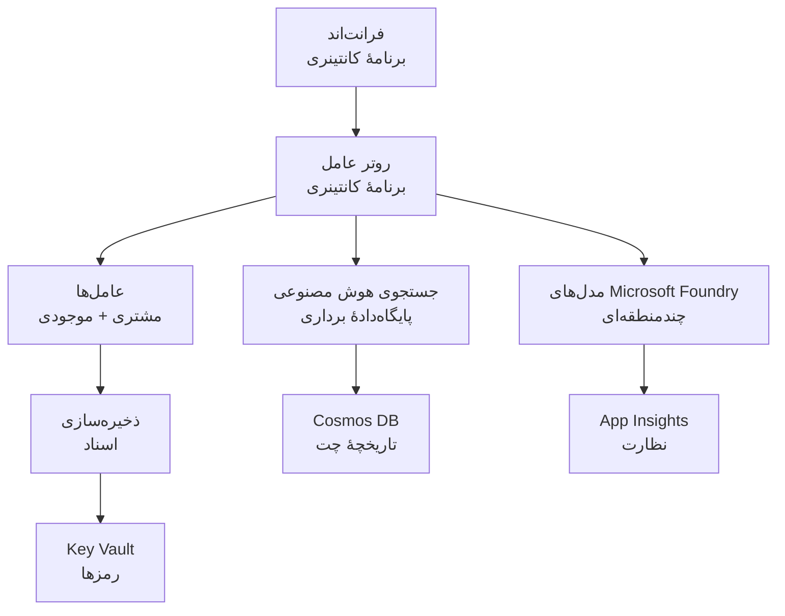

# الگوی زیرساختی راه‌حل چندعاملی خرده‌فروشی

**فصل ۵: بسته استقرار تولید**
- **📚 صفحه دوره**: [AZD برای مبتدیان](../../README.md)
- **📖 فصل مرتبط**: [فصل ۵: راه‌حل‌های هوش مصنوعی چندعاملی](../../README.md#-chapter-5-multi-agent-ai-solutions-advanced)
- **📝 راهنمای سناریو**: [معماری کامل](../retail-scenario.md)
- **🎯 استقرار سریع**: [استقرار با یک کلیک](#-quick-deployment)

> **⚠️ فقط الگوی زیرساخت**  
> این قالب ARM منابع Azure را برای یک سیستم چندعاملی مستقر می‌کند.  
>  
> **چه چیزهایی مستقر می‌شوند (۱۵–۲۵ دقیقه):**
> - ✅ سرویس‌های Microsoft Foundry Models (gpt-4.1، gpt-4.1-mini، مدل‌های embeddings در ۳ منطقه)
> - ✅ سرویس Azure AI Search (خالی، آماده برای ایجاد ایندکس)
> - ✅ Container Apps (تصاویر نگهدارنده، آماده برای کد شما)
> - ✅ Storage، Cosmos DB، Key Vault، Application Insights
>  
> **چه چیزهایی شامل نمی‌شود (نیاز به توسعه دارد):**
> - ❌ کد پیاده‌سازی عامل‌ها (Customer Agent، Inventory Agent)
> - ❌ منطق مسیریابی و نقاط پایانی API
> - ❌ رابط کاربری چت فرانت‌اند
> - ❌ اسکیمای ایندکس جستجو و خطوط لوله داده
> - ❌ **برآورد تلاش توسعه: ۸۰–۱۲۰ ساعت**
>  
> **از این قالب استفاده کنید اگر:**
> - ✅ می‌خواهید زیرساخت Azure را برای یک پروژه چندعاملی فراهم کنید
> - ✅ قصد دارید پیاده‌سازی عامل‌ها را جداگانه توسعه دهید
> - ✅ به یک پایه زیرساخت مناسب تولید نیاز دارید
>  
> **استفاده نکنید اگر:**
> - ❌ انتظار یک دموی چندعاملی آماده و کارآمد فوراً دارید
> - ❌ به دنبال نمونه‌های کامل کد برنامه هستید

## مرور کلی

این پوشه شامل یک قالب جامع Azure Resource Manager (ARM) برای استقرار پایه زیرساختی یک سیستم پشتیبانی مشتری چندعاملی است. قالب تمام سرویس‌های لازم Azure را تامین می‌کند، به‌درستی پیکربندی و متصل شده‌اند و برای توسعه برنامه شما آماده‌اند.

**پس از استقرار، خواهید داشت:** زیرساخت Azure آماده تولید  
**برای تکمیل سیستم نیاز دارید:** کد عامل‌ها، رابط کاربری فرانت‌اند، و پیکربندی داده (رجوع کنید به [راهنمای معماری](../retail-scenario.md))

## 🎯 آنچه مستقر می‌شود

### زیرساخت اصلی (وضعیت پس از استقرار)

✅ **سرویس‌های Microsoft Foundry Models** (آماده برای فراخوانی API)
  - منطقه اصلی: استقرار gpt-4.1 (ظرفیت 20K TPM)
  - منطقه ثانویه: استقرار gpt-4.1-mini (ظرفیت 10K TPM)
  - منطقه سوم: مدل متن embeddings (ظرفیت 30K TPM)
  - منطقه ارزیابی: مدل grader gpt-4.1 (ظرفیت 15K TPM)
  - **وضعیت:** کاملاً عملیاتی - می‌توان فوراً فراخوانی API انجام داد

✅ **Azure AI Search** (خالی - آماده برای پیکربندی)
  - قابلیت‌های جستجوی برداری فعال شده
  - سطح Standard با ۱ پارتیشن، ۱ نسخه کپی
  - **وضعیت:** سرویس در حال اجرا، اما نیاز به ایجاد ایندکس دارد
  - **اقدام مورد نیاز:** ایجاد ایندکس جستجو با اسکیمای شما

✅ **حساب ذخیره‌سازی Azure** (خالی - آماده برای بارگذاری‌ها)
  - کانتینرهای Blob: `documents`, `uploads`
  - پیکربندی امن (فقط HTTPS، بدون دسترسی عمومی)
  - **وضعیت:** آماده دریافت فایل‌ها
  - **اقدام مورد نیاز:** بارگذاری داده‌های محصول و اسناد شما

⚠️ **محیط Container Apps** (تصاویر نگهدارنده مستقر شده‌اند)
  - برنامه مسیریاب عامل (تصویر پیش‌فرض nginx)
  - برنامه فرانت‌اند (تصویر پیش‌فرض nginx)
  - مقیاس خودکار پیکربندی شده (۰–۱۰ نمونه)
  - **وضعیت:** کانتینرهای نگهدارنده در حال اجرا
  - **اقدام مورد نیاز:** ساخت و استقرار برنامه‌های عامل شما

✅ **Azure Cosmos DB** (خالی - آماده برای داده)
  - پایگاه‌داده و کانتینر از پیش پیکربندی شده‌اند
  - بهینه‌شده برای عملیات تأخیر پایین
  - TTL فعال برای پاک‌سازی خودکار
  - **وضعیت:** آماده ذخیره تاریخچه چت

✅ **Azure Key Vault** (اختیاری - آماده برای اسرار)
  - حذف نرم (soft delete) فعال شده
  - RBAC برای managed identities پیکربندی شده
  - **وضعیت:** آماده نگهداری کلیدها و رشته‌های اتصال

✅ **Application Insights** (اختیاری - مانیتورینگ فعال)
  - متصل به Log Analytics workspace
  - معیارها و هشدارهای سفارشی پیکربندی شده
  - **وضعیت:** آماده دریافت تله‌متری از برنامه‌های شما

✅ **Document Intelligence** (آماده برای فراخوانی API)
  - tier S0 برای بارهای کاری تولید
  - **وضعیت:** آماده پردازش اسناد بارگذاری‌شده

✅ **Bing Search API** (آماده برای فراخوانی API)
  - tier S1 برای جستجوهای بلادرنگ
  - **وضعیت:** آماده پرس‌وجوهای وب

### حالت‌های استقرار

| Mode | OpenAI Capacity | Container Instances | Search Tier | Storage Redundancy | Best For |
|------|-----------------|---------------------|-------------|-------------------|----------|
| **Minimal** | 10K-20K TPM | 0-2 replicas | Basic | LRS (Local) | Dev/test, learning, proof-of-concept |
| **Standard** | 30K-60K TPM | 2-5 replicas | Standard | ZRS (Zone) | Production, moderate traffic (<10K users) |
| **Premium** | 80K-150K TPM | 5-10 replicas, zone-redundant | Premium | GRS (Geo) | Enterprise, high traffic (>10K users), 99.99% SLA |

**تأثیر هزینه:**
- **Minimal → Standard:** افزایش هزینه حدود ۴ برابر ($100-370/mo → $420-1,450/mo)
- **Standard → Premium:** افزایش هزینه حدود ۳ برابر ($420-1,450/mo → $1,150-3,500/mo)
- **انتخاب براساس:** بار مورد انتظار، الزامات SLA، محدودیت بودجه

**برنامه‌ریزی ظرفیت:**
- **TPM (Tokens Per Minute):** مجموع در تمام استقرارهای مدل
- **Container Instances:** بازه مقیاس خودکار (حداقل-حداکثر نمونه‌ها)
- **Search Tier:** بر عملکرد پرس‌وجو و محدودیت اندازه ایندکس تأثیر می‌گذارد

## 📋 پیش‌نیازها

### ابزارهای مورد نیاز
1. **Azure CLI** (نسخه 2.50.0 یا بالاتر)
   ```bash
   az --version  # نسخه را بررسی کنید
   az login      # احراز هویت کنید
   ```

2. **اشتراک فعال Azure** با دسترسی Owner یا Contributor
   ```bash
   az account show  # تأیید اشتراک
   ```

### سهمیه‌های مورد نیاز Azure

قبل از استقرار، از کافی بودن سهمیه‌ها در مناطق هدف خود اطمینان حاصل کنید:

```bash
# در دسترس بودن مدل‌های Microsoft Foundry در منطقه خود را بررسی کنید
az cognitiveservices account list-skus \
  --kind OpenAI \
  --location eastus2

# سهمیه OpenAI را بررسی کنید (مثال برای gpt-4.1)
az cognitiveservices usage list \
  --location eastus2 \
  --query "[?name.value=='OpenAI.Standard.gpt-4.1']"

# سهمیه Container Apps را بررسی کنید
az provider show \
  --namespace Microsoft.App \
  --query "resourceTypes[?resourceType=='managedEnvironments'].locations"
```

**حداقل سهمیه‌های مورد نیاز:**
- **Microsoft Foundry Models:** ۳–۴ استقرار مدل در مناطق مختلف
  - gpt-4.1: 20K TPM (Tokens Per Minute)
  - gpt-4.1-mini: 10K TPM
  - text-embedding-ada-002: 30K TPM
  - **توجه:** gpt-4.1 ممکن است در برخی مناطق لیست انتظار داشته باشد - بررسی کنید [دسترس‌پذیری مدل](https://learn.microsoft.com/azure/ai-services/openai/concepts/models)
- **Container Apps:** محیط مدیریت‌شده + ۲–۱۰ نمونه کانتینر
- **AI Search:** سطح Standard (Basic برای جستجوی برداری کافی نیست)
- **Cosmos DB:** توان عملیاتی استاندارد تامین‌شده

**اگر سهمیه کافی نیست:**
1. به پرتال Azure → Quotas → درخواست افزایش بروید
2. یا از Azure CLI استفاده کنید:
   ```bash
   az support tickets create \
     --ticket-name "OpenAI-Quota-Increase" \
     --severity "minimal" \
     --description "Request quota increase for Microsoft Foundry Models gpt-4.1 in eastus2"
   ```
3. در نظر بگیرید از مناطق جایگزین با دسترس‌پذیری استفاده کنید

## 🚀 استقرار سریع

### گزینه ۱: استفاده از Azure CLI

```bash
# فایل‌های قالب را کلون یا دانلود کنید
git clone <repository-url>
cd examples/retail-multiagent-arm-template

# اسکریپت استقرار را قابل اجرا کنید
chmod +x deploy.sh

# با تنظیمات پیش‌فرض استقرار دهید
./deploy.sh -g myResourceGroup

# برای محیط تولید با قابلیت‌های پریمیوم استقرار دهید
./deploy.sh -g myProdRG -e prod -m premium -l eastus2
```

### گزینه ۲: استفاده از Azure Portal

[](https://portal.azure.com/#create/Microsoft.Template/uri/https%3A%2F%2Fraw.githubusercontent.com%2Fmicrosoft%2Fazd-for-beginners%2Fmain%2Fexamples%2Fretail-multiagent-arm-template%2Fazuredeploy.json)

### گزینه ۳: استفاده مستقیم از Azure CLI

```bash
# ایجاد گروه منابع
az group create --name myResourceGroup --location eastus2

# استقرار قالب
az deployment group create \
  --resource-group myResourceGroup \
  --template-file azuredeploy.json \
  --parameters azuredeploy.parameters.json
```

## ⏱️ جدول زمانی استقرار

### آنچه انتظار می‌رود

| فاز | مدت زمان | چه اتفاقی می‌افتد |
|-------|----------|--------------||
| **Template Validation** | 30-60 seconds | Azure validates ARM template syntax and parameters |
| **Resource Group Setup** | 10-20 seconds | Creates resource group (if needed) |
| **OpenAI Provisioning** | 5-8 minutes | Creates 3-4 OpenAI accounts and deploys models |
| **Container Apps** | 3-5 minutes | Creates environment and deploys placeholder containers |
| **Search & Storage** | 2-4 minutes | Provisions AI Search service and storage accounts |
| **Cosmos DB** | 2-3 minutes | Creates database and configures containers |
| **Monitoring Setup** | 2-3 minutes | Sets up Application Insights and Log Analytics |
| **RBAC Configuration** | 1-2 minutes | Configures managed identities and permissions |
| **Total Deployment** | **15-25 minutes** | Complete infrastructure ready |

**پس از استقرار:**
- ✅ **زیرساخت آماده:** تمام سرویس‌های Azure تامین و در حال اجرا هستند
- ⏱️ **توسعه برنامه:** ۸۰–۱۲۰ ساعت (مسئولیت شما)
- ⏱️ **پیکربندی ایندکس:** ۱۵–۳۰ دقیقه (نیاز به اسکیمای شما دارد)
- ⏱️ **بارگذاری داده:** بسته به حجم مجموعه داده متغیر است
- ⏱️ **آزمون و اعتبارسنجی:** ۲–۴ ساعت

---

## ✅ بررسی موفقیت استقرار

### گام ۱: بررسی تامین منابع (۲ دقیقه)

```bash
# تأیید کنید که همهٔ منابع با موفقیت مستقر شده‌اند
az resource list \
  --resource-group myResourceGroup \
  --query "[?provisioningState!='Succeeded'].{Name:name, Status:provisioningState, Type:type}" \
  --output table
```

**انتظار می‌رود:** جدول خالی (تمام منابع وضعیت "Succeeded" را نشان می‌دهند)

### گام ۲: تأیید استقرارهای Microsoft Foundry Models (۳ دقیقه)

```bash
# تمام حساب‌های OpenAI را فهرست کنید
az cognitiveservices account list \
  --resource-group myResourceGroup \
  --query "[?kind=='OpenAI'].{Name:name, Location:location, Status:properties.provisioningState}" \
  --output table

# استقرارهای مدل در منطقهٔ اصلی را بررسی کنید
OPENAI_NAME=$(az cognitiveservices account list \
  --resource-group myResourceGroup \
  --query "[?kind=='OpenAI'] | [0].name" -o tsv)

az cognitiveservices account deployment list \
  --name $OPENAI_NAME \
  --resource-group myResourceGroup \
  --output table
```

**انتظار می‌رود:** 
- ۳–۴ حساب OpenAI (مناطق اولیه، ثانویه، ثالثیه، ارزیابی)
- ۱–۲ استقرار مدل برای هر حساب (gpt-4.1، gpt-4.1-mini، text-embedding-ada-002)

### گام ۳: آزمون نقاط انتهایی زیرساخت (۵ دقیقه)

```bash
# دریافت آدرس‌های URL برنامه کانتینری
az containerapp list \
  --resource-group myResourceGroup \
  --query "[].{Name:name, URL:properties.configuration.ingress.fqdn, Status:properties.runningStatus}" \
  --output table

# تست نقطه پایانی روتر (یک تصویر جایگزین پاسخ می‌دهد)
ROUTER_URL=$(az containerapp show \
  --name retail-router \
  --resource-group myResourceGroup \
  --query "properties.configuration.ingress.fqdn" -o tsv)

echo "Testing: https://$ROUTER_URL"
curl -I https://$ROUTER_URL || echo "Container running (placeholder image - expected)"
```

**انتظار می‌رود:** 
- Container Apps وضعیت "Running" را نشان دهند
- nginx نگهدارنده با HTTP 200 یا 404 پاسخ دهد (هنوز کد برنامه وجود ندارد)

### گام ۴: تأیید دسترسی API به Microsoft Foundry Models (۳ دقیقه)

```bash
# دریافت endpoint و کلید OpenAI
OPENAI_ENDPOINT=$(az cognitiveservices account show \
  --name $OPENAI_NAME \
  --resource-group myResourceGroup \
  --query "properties.endpoint" -o tsv)

OPENAI_KEY=$(az cognitiveservices account keys list \
  --name $OPENAI_NAME \
  --resource-group myResourceGroup \
  --query "key1" -o tsv)

# آزمایش استقرار gpt-4.1
curl "${OPENAI_ENDPOINT}openai/deployments/gpt-4.1/chat/completions?api-version=2024-08-01-preview" \
  -H "Content-Type: application/json" \
  -H "api-key: $OPENAI_KEY" \
  -d '{
    "messages": [{"role": "user", "content": "Say hello"}],
    "max_tokens": 10
  }'
```

**انتظار می‌رود:** پاسخ JSON با تکمیل چت (تأیید می‌کند OpenAI عملیاتی است)

### چه چیزهایی کار می‌کنند در برابر چه چیزهایی کار نمی‌کنند

**✅ موارد کارآمد پس از استقرار:**
- مدل‌های Microsoft Foundry Models مستقر شده و پذیرای فراخوانی API هستند
- سرویس AI Search در حال اجرا (خالی، هنوز ایندکس ندارد)
- Container Apps در حال اجرا هستند (تصاویر nginx نگهدارنده)
- حساب‌های ذخیره‌سازی قابل دسترسی و آماده بارگذاری
- Cosmos DB آماده عملیات داده‌ای
- Application Insights تله‌متری زیرساخت را جمع‌آوری می‌کند
- Key Vault آماده ذخیره اسرار است

**❌ مواردی که هنوز کار نمی‌کنند (نیاز به توسعه دارند):**
- نقاط انتهایی عامل‌ها (کدی برای برنامه‌ریزی نشده)
- عملکرد چت (نیاز به پیاده‌سازی فرانت‌اند و بک‌اند دارد)
- پرس‌وجوهای جستجو (هنوز ایندکس جستجو ایجاد نشده)
- خط لوله پردازش اسناد (داده‌ای بارگذاری نشده)
- تله‌متری سفارشی (نیاز به ابزاردهی برنامه دارد)

**گام‌های بعدی:** به [پیکربندی پس از استقرار](#-post-deployment-next-steps) مراجعه کنید تا برنامه خود را توسعه و مستقر نمایید

---

## ⚙️ گزینه‌های پیکربندی

### پارامترهای قالب

| Parameter | Type | Default | Description |
|-----------|------|---------|-------------|
| `projectName` | string | "retail" | پیشوند برای همه نام‌های منابع |
| `location` | string | Resource group location | منطقه استقرار اولیه |
| `secondaryLocation` | string | "westus2" | منطقه ثانویه برای استقرار چندمنطقه‌ای |
| `tertiaryLocation` | string | "francecentral" | منطقه برای مدل embeddings |
| `environmentName` | string | "dev" | نام محیط (dev/staging/prod) |
| `deploymentMode` | string | "standard" | پیکربندی استقرار (minimal/standard/premium) |
| `enableMultiRegion` | bool | true | فعال‌سازی استقرار چندمنطقه‌ای |
| `enableMonitoring` | bool | true | فعال‌سازی Application Insights و لاگ‌ها |
| `enableSecurity` | bool | true | فعال‌سازی Key Vault و امنیت افزوده |

### سفارشی‌سازی پارامترها

فایل `azuredeploy.parameters.json` را ویرایش کنید:

```json
{
  "$schema": "https://schema.management.azure.com/schemas/2019-04-01/deploymentParameters.json#",
  "contentVersion": "1.0.0.0",
  "parameters": {
    "projectName": {
      "value": "mycompany"
    },
    "environmentName": {
      "value": "prod"
    },
    "deploymentMode": {
      "value": "premium"
    },
    "location": {
      "value": "eastus2"
    }
  }
}
```

## 🏗️ نمای کلی معماری


## 📖 نحوه استفاده از اسکریپت استقرار

اسکریپت `deploy.sh` تجربه استقرار تعاملی فراهم می‌کند:

```bash
# نمایش راهنما
./deploy.sh --help

# استقرار پایه
./deploy.sh -g myResourceGroup

# استقرار پیشرفته با تنظیمات سفارشی
./deploy.sh \
  -g myProductionRG \
  -p companyname \
  -e prod \
  -m premium \
  -l eastus2

# استقرار توسعه‌ای بدون حالت چندمنطقه‌ای
./deploy.sh \
  -g myDevRG \
  -e dev \
  -m minimal \
  --no-multi-region \
  --no-security
```

### ویژگی‌های اسکریپت

- ✅ **اعتبارسنجی پیش‌نیازها** (Azure CLI، وضعیت ورود، فایل‌های قالب)
- ✅ **مدیریت گروه منابع** (در صورت عدم وجود ایجاد می‌کند)
- ✅ **اعتبارسنجی قالب** قبل از استقرار
- ✅ **نظارت بر پیشرفت** با خروجی رنگی
- ✅ **نمایش خروجی‌های استقرار**
- ✅ **راهنمایی پس از استقرار**

## 📊 مانیتورینگ استقرار

### بررسی وضعیت استقرار

```bash
# فهرست استقرارها
az deployment group list --resource-group myResourceGroup --output table

# دریافت جزئیات استقرار
az deployment group show \
  --resource-group myResourceGroup \
  --name retail-deployment-YYYYMMDD-HHMMSS

# مشاهده پیشرفت استقرار
az deployment group create \
  --resource-group myResourceGroup \
  --template-file azuredeploy.json \
  --parameters azuredeploy.parameters.json \
  --verbose
```

### خروجی‌های استقرار

پس از استقرار موفق، خروجی‌های زیر در دسترس‌اند:

- **Frontend URL**: نقطه انتهایی عمومی برای رابط وب
- **Router URL**: نقطه انتهایی API برای مسیریاب عامل
- **OpenAI Endpoints**: نقاط انتهایی سرویس OpenAI اولیه و ثانویه
- **Search Service**: نقطه انتهایی سرویس Azure AI Search
- **Storage Account**: نام حساب ذخیره‌سازی برای اسناد
- **Key Vault**: نام Key Vault (در صورت فعال بودن)
- **Application Insights**: نام سرویس مانیتورینگ (در صورت فعال بودن)

## 🔧 پس از استقرار: گام‌های بعدی
> **📝 مهم:** زیرساخت مستقر شده است، اما شما باید کد برنامه را توسعه دهید و مستقر کنید.

### فاز 1: توسعه برنامه‌های عامل (مسئولیت شما)

الگوی ARM برنامه‌های خالی Container Apps را با تصاویر nginx نگهدارنده ایجاد می‌کند. شما باید:

**توسعه مورد نیاز:**
1. **پیاده‌سازی عامل** (30-40 ساعت)
   - عامل خدمات مشتری با ادغام gpt-4.1
   - عامل موجودی با ادغام gpt-4.1-mini
   - منطق مسیریابی عامل

2. **توسعه فرانت‌اند** (20-30 ساعت)
   - رابط کاربری چت (React/Vue/Angular)
   - قابلیت آپلود فایل
   - رندر و قالب‌بندی پاسخ‌ها

3. **سرویس‌های بک‌اند** (12-16 ساعت)
   - مسیر‌دهنده FastAPI یا Express
   - میان‌افزار احراز هویت
   - ادغام تله‌متری

**مشاهده:** [Architecture Guide](../retail-scenario.md) برای الگوهای پیاده‌سازی و نمونه‌های کد دقیق

### فاز 2: پیکربندی ایندکس جستجوی هوش مصنوعی (15-30 دقیقه)

یک ایندکس جستجو مطابق با مدل داده‌ای خود ایجاد کنید:

```bash
# جزئیات سرویس جستجو را دریافت کنید
SEARCH_NAME=$(az search service list \
  --resource-group myResourceGroup \
  --query "[0].name" -o tsv)

SEARCH_KEY=$(az search admin-key show \
  --service-name $SEARCH_NAME \
  --resource-group myResourceGroup \
  --query "primaryKey" -o tsv)

# یک شاخص با طرح‌وارهٔ خود ایجاد کنید (نمونه)
curl -X POST "https://${SEARCH_NAME}.search.windows.net/indexes?api-version=2023-11-01" \
  -H "Content-Type: application/json" \
  -H "api-key: ${SEARCH_KEY}" \
  -d '{
    "name": "products",
    "fields": [
      {"name": "id", "type": "Edm.String", "key": true},
      {"name": "title", "type": "Edm.String", "searchable": true},
      {"name": "content", "type": "Edm.String", "searchable": true},
      {"name": "category", "type": "Edm.String", "filterable": true},
      {"name": "content_vector", "type": "Collection(Edm.Single)", 
       "searchable": true, "dimensions": 1536, "vectorSearchProfile": "default"}
    ],
    "vectorSearch": {
      "algorithms": [{"name": "default", "kind": "hnsw"}],
      "profiles": [{"name": "default", "algorithm": "default"}]
    }
  }'
```

**منابع:**
- [AI Search Index Schema Design](https://learn.microsoft.com/azure/search/search-what-is-an-index)
- [Vector Search Configuration](https://learn.microsoft.com/azure/search/vector-search-how-to-create-index)

### فاز 3: بارگذاری داده‌های شما (زمان متغیر)

پس از در اختیار داشتن داده‌های محصول و اسناد:

```bash
# دریافت جزئیات حساب ذخیره‌سازی
STORAGE_NAME=$(az storage account list \
  --resource-group myResourceGroup \
  --query "[0].name" -o tsv)

STORAGE_KEY=$(az storage account keys list \
  --account-name $STORAGE_NAME \
  --resource-group myResourceGroup \
  --query "[0].value" -o tsv)

# اسناد خود را بارگذاری کنید
az storage blob upload-batch \
  --destination documents \
  --source /path/to/your/product/docs \
  --account-name $STORAGE_NAME \
  --account-key $STORAGE_KEY

# مثال: بارگذاری یک فایل
az storage blob upload \
  --container-name documents \
  --name "product-manual.pdf" \
  --file /path/to/product-manual.pdf \
  --account-name $STORAGE_NAME \
  --account-key $STORAGE_KEY
```

### فاز 4: ساخت و استقرار برنامه‌های شما (8-12 ساعت)

پس از توسعه کد عامل‌های خود:

```bash
# 1. ایجاد Azure Container Registry (در صورت نیاز)
az acr create \
  --name myregistry \
  --resource-group myResourceGroup \
  --sku Basic

# 2. ساخت و ارسال تصویر agent router
docker build -t myregistry.azurecr.io/agent-router:v1 /path/to/your/router/code
az acr login --name myregistry
docker push myregistry.azurecr.io/agent-router:v1

# 3. ساخت و ارسال تصویر فرانت‌اند
docker build -t myregistry.azurecr.io/frontend:v1 /path/to/your/frontend/code
docker push myregistry.azurecr.io/frontend:v1

# 4. به‌روزرسانی Container Apps با تصاویر شما
az containerapp update \
  --name retail-router \
  --resource-group myResourceGroup \
  --image myregistry.azurecr.io/agent-router:v1

az containerapp update \
  --name retail-frontend \
  --resource-group myResourceGroup \
  --image myregistry.azurecr.io/frontend:v1

# 5. پیکربندی متغیرهای محیطی
az containerapp update \
  --name retail-router \
  --resource-group myResourceGroup \
  --set-env-vars \
    OPENAI_ENDPOINT=secretref:openai-endpoint \
    OPENAI_KEY=secretref:openai-key \
    SEARCH_ENDPOINT=secretref:search-endpoint \
    SEARCH_KEY=secretref:search-key
```

### فاز 5: آزمایش برنامه شما (2-4 ساعت)

```bash
# نشانی اینترنتی برنامهٔ خود را دریافت کنید
ROUTER_URL=$(az containerapp show \
  --name retail-router \
  --resource-group myResourceGroup \
  --query "properties.configuration.ingress.fqdn" -o tsv)

# نقطهٔ پایانی عامل را آزمایش کنید (پس از استقرار کد شما)
curl -X POST "https://${ROUTER_URL}/chat" \
  -H "Content-Type: application/json" \
  -d '{
    "message": "Hello, I need help with my order",
    "agent": "customer"
  }'

# لاگ‌های برنامه را بررسی کنید
az containerapp logs show \
  --name retail-router \
  --resource-group myResourceGroup \
  --follow
```

### منابع پیاده‌سازی

**معماری و طراحی:**
- 📖 [Complete Architecture Guide](../retail-scenario.md) - الگوهای پیاده‌سازی دقیق
- 📖 [Multi-Agent Design Patterns](https://learn.microsoft.com/azure/architecture/ai-ml/guide/multi-agent-systems)

**نمونه‌های کد:**
- 🔗 [Microsoft Foundry Models Chat Sample](https://github.com/Azure-Samples/azure-search-openai-demo) - الگوی RAG
- 🔗 [Semantic Kernel](https://github.com/microsoft/semantic-kernel) - فریم‌ورک عامل (C#)
- 🔗 [LangChain Azure](https://github.com/langchain-ai/langchain) - هماهنگی عامل‌ها (Python)
- 🔗 [AutoGen](https://github.com/microsoft/autogen) - گفتگوهای چندعاملی

**کل تلاش تخمینی:**
- استقرار زیرساخت: 15-25 دقیقه (✅ Complete)
- توسعه برنامه: 80-120 ساعت (🔨 کار شما)
- آزمایش و بهینه‌سازی: 15-25 ساعت (🔨 کار شما)

## 🛠️ عیب‌یابی

### مسائل رایج

#### 1. سهمیه مدل‌های Microsoft Foundry تمام شده است

```bash
# استفاده فعلی از سهمیه را بررسی کنید
az cognitiveservices usage list --location eastus2

# درخواست افزایش سهمیه
az support tickets create \
  --ticket-name "OpenAI-Quota-Increase" \
  --severity "minimal" \
  --description "Request quota increase for Microsoft Foundry Models in region X"
```

#### 2. استقرار Container Apps ناموفق بود

```bash
# لاگ‌های برنامهٔ کانتینر را بررسی کنید
az containerapp logs show \
  --name retail-router \
  --resource-group myResourceGroup \
  --follow

# برنامهٔ کانتینر را مجدداً راه‌اندازی کنید
az containerapp revision restart \
  --name retail-router \
  --resource-group myResourceGroup
```

#### 3. راه‌اندازی سرویس جستجو

```bash
# وضعیت سرویس جستجو را بررسی کنید
az search service show \
  --name <search-service-name> \
  --resource-group myResourceGroup

# اتصال سرویس جستجو را آزمایش کنید
curl -X GET "https://<search-service-name>.search.windows.net/indexes?api-version=2023-11-01" \
  -H "api-key: <search-admin-key>"
```

### اعتبارسنجی استقرار

```bash
# بررسی کنید که همهٔ منابع ایجاد شده‌اند
az resource list \
  --resource-group myResourceGroup \
  --output table

# سلامت منابع را بررسی کنید
az resource list \
  --resource-group myResourceGroup \
  --query "[?provisioningState!='Succeeded'].{Name:name, Status:provisioningState, Type:type}" \
  --output table
```

## 🔐 ملاحظات امنیتی

### مدیریت کلیدها
- تمام اسرار در Azure Key Vault ذخیره می‌شوند (در صورت فعال بودن)
- اپلیکیشن‌های کانتینری از Managed Identity برای احراز هویت استفاده می‌کنند
- اکانت‌های ذخیره‌سازی تنظیمات پیش‌فرض امن دارند (فقط HTTPS، بدون دسترسی عمومی به blob)

### امنیت شبکه
- اپلیکیشن‌های کانتینری در صورت امکان از شبکه داخلی استفاده می‌کنند
- سرویس جستجو با گزینه private endpoints پیکربندی شده است
- Cosmos DB با حداقل مجوزهای لازم پیکربندی شده است

### پیکربندی RBAC
```bash
# تخصیص نقش‌های لازم برای هویت مدیریت‌شده
az role assignment create \
  --assignee <container-app-managed-identity> \
  --role "Cognitive Services OpenAI User" \
  --scope <openai-resource-id>
```

## 💰 بهینه‌سازی هزینه

### برآورد هزینه (ماهانه، USD)

| حالت | OpenAI | Container Apps | Search | Storage | جمع تخمینی |
|------|--------|----------------|--------|---------|------------|
| حداقلی | $50-200 | $20-50 | $25-100 | $5-20 | $100-370 |
| استاندارد | $200-800 | $100-300 | $100-300 | $20-50 | $420-1450 |
| پریمیوم | $500-2000 | $300-800 | $300-600 | $50-100 | $1150-3500 |

### نظارت بر هزینه

```bash
# تنظیم هشدارهای بودجه
az consumption budget create \
  --account-name <subscription-id> \
  --budget-name "retail-budget" \
  --amount 500 \
  --time-grain Monthly \
  --start-date 2024-01-01 \
  --end-date 2024-12-31
```

## 🔄 به‌روزرسانی‌ها و نگهداری

### به‌روزرسانی قالب
- فایل‌های قالب ARM را تحت کنترل نسخه قرار دهید
- ابتدا تغییرات را در محیط توسعه تست کنید
- برای به‌روزرسانی‌ها از حالت استقرار افزایشی استفاده کنید

### به‌روزرسانی منابع
```bash
# به‌روزرسانی با پارامترهای جدید
az deployment group create \
  --resource-group myResourceGroup \
  --template-file azuredeploy.json \
  --parameters azuredeploy.parameters.json \
  --mode Incremental
```

### پشتیبان‌گیری و بازیابی
- پشتیبان‌گیری خودکار Cosmos DB فعال است
- قابلیت soft delete در Key Vault فعال است
- نسخه‌های اپلیکیشن کانتینری برای بازگشت نگهداری می‌شوند

## 📞 پشتیبانی

- **مشکلات قالب**: [GitHub Issues](https://github.com/microsoft/azd-for-beginners/issues)
- **پشتیبانی Azure**: [Azure Support Portal](https://portal.azure.com/#blade/Microsoft_Azure_Support/HelpAndSupportBlade)
- **جامعه**: [Azure AI Discord](https://discord.gg/microsoft-azure)

---

**⚡ آماده‌اید راه‌حل چندعاملی خود را مستقر کنید؟**

شروع با: `./deploy.sh -g myResourceGroup`

---

<!-- CO-OP TRANSLATOR DISCLAIMER START -->
**Disclaimer**:
این سند با استفاده از سرویس ترجمه‌ی هوش مصنوعی [Co-op Translator](https://github.com/Azure/co-op-translator) ترجمه شده است. در حالی که ما در تلاش برای دقت هستیم، لطفاً توجه داشته باشید که ترجمه‌های خودکار ممکن است حاوی خطاها یا نادرستی‌هایی باشند. نسخهٔ اصلی سند به زبان مبدأ باید به‌عنوان منبع معتبر در نظر گرفته شود. برای اطلاعات حیاتی، ترجمهٔ حرفه‌ای توسط انسان توصیه می‌شود. ما در قبال هر گونه سوتفاهم یا برداشت نادرست ناشی از استفاده از این ترجمه مسئولیتی نداریم.
<!-- CO-OP TRANSLATOR DISCLAIMER END -->