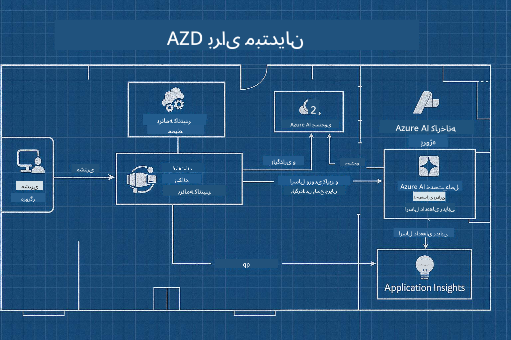

<!--
CO_OP_TRANSLATOR_METADATA:
{
  "original_hash": "245d24997bbcf2bae93bb2a503845d37",
  "translation_date": "2025-09-23T11:42:48+00:00",
  "source_file": "workshop/README.md",
  "language_code": "fa"
}
-->
# کارگاه AZD برای توسعه‌دهندگان هوش مصنوعی

## قالب‌های AZD

ساخت یک راه‌حل برنامه هوش مصنوعی در سطح سازمانی برای سناریوی خاص شما، بسیار شبیه به ساخت خانه خودتان است. شما می‌توانید خودتان طراحی کنید، آجر به آجر بسازید و مسئولیت اطمینان از رعایت تمام دستورالعمل‌های حاکمیتی و توسعه را بر عهده بگیرید.

**یا ....**

می‌توانید با یک معمار همکاری کنید که یک _نقشه اولیه_ برای یک خانه شروع به شما بدهد و سپس با شما کار کند تا آن را _شخصی‌سازی_ کنید تا نیازهای شما را برآورده کند. این به شما اجازه می‌دهد روی آنچه که **خانه شما** را خاص می‌کند تمرکز کنید و سیم‌کشی، لوله‌کشی و سایر وابستگی‌های زیرساختی را به کارشناسان بسپارید.

**این رویکرد پشت [قالب‌های برنامه هوش مصنوعی](https://ai.azure.com/templates)** است - مجموعه‌ای از نقشه‌های اولیه برای ساخت انواع مختلف "خانه‌های برنامه هوش مصنوعی" بسته به نیازها و وابستگی‌های اصلی شما.

## شخصی‌سازی قالب‌ها

این قالب‌ها برای کار با [Azure AI Foundry](https://ai.azure.com) طراحی شده‌اند. این پلتفرم را به عنوان "پیمانکار ساختمانی" خود تصور کنید که به تمام منابع، ابزارها و تخصص‌هایی که برای انجام کار نیاز دارید دسترسی دارد!

تنها کاری که باید انجام دهید انتخاب [قالب‌های شروع خود](https://learn.microsoft.com/en-us/azure/ai-foundry/how-to/develop/ai-template-get-started) است. به عنوان مثال، ما بر روی قالب _شروع با عوامل هوش مصنوعی_ تمرکز خواهیم کرد تا یک "خانه هوش مصنوعی عامل‌محور" برای شما بسازیم که برای ویژگی‌هایی مانند جستجوی هوش مصنوعی، تیم قرمز، ارزیابی‌ها، ردیابی، نظارت و موارد دیگر آماده باشد!



تنها کاری که باید انجام دهید این است که زمانی را با معمار رزرو کنید تا شما را در فرآیند شخصی‌سازی راهنمایی کند. [GitHub Copilot برای Azure](https://learn.microsoft.com/en-us/azure/developer/github-copilot-azure/get-started) می‌تواند آن راهنما باشد. فقط با آن "چت کنید" تا:

- درباره ویژگی‌های Azure در قالب خود یاد بگیرید  
- منابع Azure را مستقر کنید  
- اطلاعاتی درباره استقرار خود دریافت کنید  
- مشکلات را تشخیص داده و رفع کنید!  

در این کارگاه، یاد می‌گیریم که قالب موجود را _تجزیه کنیم_ (تا بفهمیم چه چیزی ارائه می‌دهد)، سپس آن را _شخصی‌سازی کنیم_ (تا نیازهای خود را برآورده کنیم) - گام به گام.

قالب‌های هوش مصنوعی **کار را انجام می‌دهند** - با تکمیل کارگاه، یاد خواهید گرفت که **آن را مال خود کنید**

----

**ناوبری کارگاه**
- **📚 صفحه اصلی دوره**: [AZD برای مبتدیان](../README.md)
- **📖 فصل‌های مرتبط**: شامل [فصل 1](../README.md#-chapter-1-foundation--quick-start)، [فصل 2](../README.md#-chapter-2-ai-first-development-recommended-for-ai-developers)، و [فصل 5](../README.md#-chapter-5-multi-agent-ai-solutions-advanced)
- **🛠️ آزمایشگاه عملی**: [آزمایشگاه کارگاه هوش مصنوعی](../docs/ai-foundry/ai-workshop-lab.md)
- **🚀 مراحل بعدی**: [ماژول‌های آزمایشگاه کارگاه](../../../workshop)

به کارگاه عملی برای یادگیری CLI توسعه‌دهنده Azure (AZD) با تمرکز بر استقرار برنامه‌های هوش مصنوعی خوش آمدید. این کارگاه طراحی شده است تا شما را از اصول اولیه AZD به استقرار راه‌حل‌های هوش مصنوعی آماده تولید برساند.

## نمای کلی کارگاه

**مدت زمان:** 2-3 ساعت  
**سطح:** مبتدی تا متوسط  
**پیش‌نیازها:** دانش پایه‌ای از Azure، ابزارهای خط فرمان، و مفاهیم هوش مصنوعی  

### آنچه یاد خواهید گرفت

- **اصول AZD**: درک زیرساخت به عنوان کد با AZD  
- 🤖 **یکپارچه‌سازی خدمات هوش مصنوعی**: استقرار Azure OpenAI، جستجوی هوش مصنوعی و سایر خدمات هوش مصنوعی  
- **استقرار کانتینر**: استفاده از برنامه‌های کانتینر Azure برای برنامه‌های هوش مصنوعی  
- **بهترین شیوه‌های امنیتی**: پیاده‌سازی هویت مدیریت‌شده و پیکربندی‌های امن  
- **نظارت و مشاهده‌پذیری**: راه‌اندازی Application Insights برای بارهای کاری هوش مصنوعی  
- **الگوهای تولید**: استراتژی‌های استقرار آماده سازمانی  

## ساختار کارگاه

### ماژول 1: اصول AZD (30 دقیقه)
- نصب و پیکربندی AZD  
- درک ساختار پروژه AZD  
- اولین استقرار AZD شما  
- **آزمایشگاه**: استقرار یک برنامه وب ساده  

### ماژول 2: یکپارچه‌سازی Azure OpenAI (45 دقیقه)
- راه‌اندازی منابع Azure OpenAI  
- استراتژی‌های استقرار مدل  
- پیکربندی دسترسی API و احراز هویت  
- **آزمایشگاه**: استقرار یک برنامه چت با GPT-4  

### ماژول 3: برنامه‌های RAG (45 دقیقه)
- یکپارچه‌سازی جستجوی هوش مصنوعی Azure  
- پردازش اسناد با هوش مصنوعی اسناد Azure  
- جاسازی‌های برداری و جستجوی معنایی  
- **آزمایشگاه**: ساخت یک سیستم پرسش و پاسخ اسناد  

### ماژول 4: استقرار تولید (30 دقیقه)
- پیکربندی برنامه‌های کانتینر  
- بهینه‌سازی مقیاس‌پذیری و عملکرد  
- نظارت و ثبت لاگ  
- **آزمایشگاه**: استقرار در تولید با مشاهده‌پذیری  

### ماژول 5: الگوهای پیشرفته (15 دقیقه)
- استقرارهای چند محیطی  
- یکپارچه‌سازی CI/CD  
- استراتژی‌های بهینه‌سازی هزینه  
- **جمع‌بندی**: چک‌لیست آمادگی تولید  

## پیش‌نیازها

### ابزارهای مورد نیاز

لطفاً این ابزارها را قبل از کارگاه نصب کنید:

```bash
# Azure Developer CLI
curl -fsSL https://aka.ms/install-azd.sh | bash

# Azure CLI
curl -sL https://aka.ms/InstallAzureCLIDeb | sudo bash

# Git
sudo apt-get install git

# Docker
curl -fsSL https://get.docker.com -o get-docker.sh
sudo sh get-docker.sh

# Python 3.10+
sudo apt-get install python3.10 python3.10-venv python3-pip
```

### تنظیم حساب Azure

1. **اشتراک Azure**: [ثبت‌نام رایگان](https://azure.microsoft.com/free/)  
2. **دسترسی Azure OpenAI**: [درخواست دسترسی](https://aka.ms/oai/access)  
3. **مجوزهای مورد نیاز**:  
   - نقش Contributor در اشتراک یا گروه منابع  
   - مدیر دسترسی کاربر (برای تخصیص‌های RBAC)  

### تأیید پیش‌نیازها

این اسکریپت را اجرا کنید تا تنظیمات خود را تأیید کنید:

```bash
#!/bin/bash
echo "Verifying workshop prerequisites..."

# Check AZD installation
if command -v azd &> /dev/null; then
    echo "✅ Azure Developer CLI: $(azd --version)"
else
    echo "❌ Azure Developer CLI not found"
fi

# Check Azure CLI
if command -v az &> /dev/null; then
    echo "✅ Azure CLI: $(az --version | head -n1)"
else
    echo "❌ Azure CLI not found"
fi

# Check Docker
if command -v docker &> /dev/null; then
    echo "✅ Docker: $(docker --version)"
else
    echo "❌ Docker not found"
fi

# Check Python
if command -v python3 &> /dev/null; then
    echo "✅ Python: $(python3 --version)"
else
    echo "❌ Python 3 not found"
fi

# Check Azure login
if az account show &> /dev/null; then
    echo "✅ Azure: Logged in as $(az account show --query user.name -o tsv)"
else
    echo "❌ Azure: Not logged in (run 'az login')"
fi

echo "Setup verification complete!"
```

## مواد کارگاه

### تمرین‌های آزمایشگاهی

هر ماژول شامل آزمایشگاه‌های عملی با کد شروع و دستورالعمل‌های گام به گام است:

- **[lab-1-azd-basics/](../../../workshop/lab-1-azd-basics)** - اولین استقرار AZD شما  
- **[lab-2-openai-chat/](../../../workshop/lab-2-openai-chat)** - برنامه چت با Azure OpenAI  
- **[lab-3-rag-search/](../../../workshop/lab-3-rag-search)** - برنامه RAG با جستجوی هوش مصنوعی  
- **[lab-4-production/](../../../workshop/lab-4-production)** - الگوهای استقرار تولید  
- **[lab-5-advanced/](../../../workshop/lab-5-advanced)** - سناریوهای استقرار پیشرفته  

### مواد مرجع

- **[راهنمای یکپارچه‌سازی AI Foundry](../docs/ai-foundry/azure-ai-foundry-integration.md)** - الگوهای جامع یکپارچه‌سازی  
- **[راهنمای استقرار مدل هوش مصنوعی](../docs/ai-foundry/ai-model-deployment.md)** - بهترین شیوه‌های استقرار مدل  
- **[شیوه‌های تولید هوش مصنوعی](../docs/ai-foundry/production-ai-practices.md)** - الگوهای استقرار سازمانی  
- **[راهنمای رفع اشکال هوش مصنوعی](../docs/troubleshooting/ai-troubleshooting.md)** - مشکلات رایج و راه‌حل‌ها  

### قالب‌های نمونه

قالب‌های شروع سریع برای سناریوهای رایج هوش مصنوعی:

```
workshop/templates/
├── minimal-chat/          # Basic OpenAI chat app
├── rag-application/       # RAG with AI Search
├── multi-model/          # Multiple AI services
└── production-ready/     # Enterprise template
```

## شروع به کار

### گزینه 1: GitHub Codespaces (توصیه‌شده)

سریع‌ترین راه برای شروع کارگاه:

[](https://github.com/codespaces/new?hide_repo_select=true&ref=main&repo=YOUR_REPO_ID)

### گزینه 2: توسعه محلی

1. **کلون کردن مخزن کارگاه:**
```bash
git clone https://github.com/YOUR_ORG/AZD-for-beginners.git
cd AZD-for-beginners/workshop
```

2. **ورود به Azure:**
```bash
az login
azd auth login
```

3. **شروع با آزمایشگاه 1:**
```bash
cd lab-1-azd-basics
cat README.md  # Follow the instructions
```

### گزینه 3: کارگاه با مربی

اگر در یک جلسه با مربی شرکت می‌کنید:

- 🎥 **ضبط کارگاه**: [در دسترس به صورت تقاضا](https://aka.ms/azd-ai-workshop)  
- 💬 **جامعه Discord**: [برای پشتیبانی زنده بپیوندید](https://aka.ms/foundry/discord)  
- **بازخورد کارگاه**: [تجربه خود را به اشتراک بگذارید](https://aka.ms/azd-workshop-feedback)  

## جدول زمانی کارگاه

### یادگیری خودمحور (3 ساعت)

```
⏰ 00:00 - 00:30  Module 1: AZD Foundations
⏰ 00:30 - 01:15  Module 2: Azure OpenAI Integration
⏰ 01:15 - 02:00  Module 3: RAG Applications
⏰ 02:00 - 02:30  Module 4: Production Deployment
⏰ 02:30 - 02:45  Module 5: Advanced Patterns
⏰ 02:45 - 03:00  Q&A and Next Steps
```

### جلسه با مربی (2.5 ساعت)

```
⏰ 00:00 - 00:15  Welcome & Prerequisites Check
⏰ 00:15 - 00:40  Module 1: Live Demo + Lab
⏰ 00:40 - 01:20  Module 2: OpenAI Integration
⏰ 01:20 - 01:30  Break
⏰ 01:30 - 02:10  Module 3: RAG Applications
⏰ 02:10 - 02:30  Module 4: Production Patterns
⏰ 02:30 - 02:45  Module 5: Advanced Topics
⏰ 02:45 - 03:00  Q&A and Resources
```

## معیارهای موفقیت

تا پایان این کارگاه، شما قادر خواهید بود:

✅ **استقرار برنامه‌های هوش مصنوعی** با استفاده از قالب‌های AZD  
✅ **پیکربندی خدمات Azure OpenAI** با امنیت مناسب  
✅ **ساخت برنامه‌های RAG** با یکپارچه‌سازی جستجوی هوش مصنوعی Azure  
✅ **پیاده‌سازی الگوهای تولید** برای بارهای کاری هوش مصنوعی سازمانی  
✅ **نظارت و رفع اشکال** استقرار برنامه‌های هوش مصنوعی  
✅ **اعمال استراتژی‌های بهینه‌سازی هزینه** برای بارهای کاری هوش مصنوعی  

## جامعه و پشتیبانی

### در طول کارگاه

- 🙋 **سؤالات**: از چت کارگاه استفاده کنید یا دست خود را بلند کنید  
- 🐛 **مشکلات**: راهنمای [رفع اشکال](../docs/troubleshooting/ai-troubleshooting.md) را بررسی کنید  
- **نکات**: کشفیات خود را با سایر شرکت‌کنندگان به اشتراک بگذارید  

### پس از کارگاه

- 💬 **Discord**: [جامعه Azure AI Foundry](https://aka.ms/foundry/discord)  
- **مشکلات GitHub**: [گزارش مشکلات قالب](https://github.com/YOUR_ORG/AZD-for-beginners/issues)  
- 📧 **بازخورد**: [فرم ارزیابی کارگاه](https://aka.ms/azd-workshop-feedback)  

## مراحل بعدی

### ادامه یادگیری

1. **سناریوهای پیشرفته**: [استقرارهای چند منطقه‌ای](../docs/ai-foundry/production-ai-practices.md#multi-region-deployment) را بررسی کنید  
2. **یکپارچه‌سازی CI/CD**: [راه‌اندازی گردش کار GitHub Actions](../docs/deployment/github-actions.md)  
3. **قالب‌های سفارشی**: [ایجاد قالب‌های AZD خود](../docs/getting-started/custom-templates.md)  

### اعمال در پروژه‌های خود

1. **ارزیابی**: از [چک‌لیست آمادگی](./production-readiness-checklist.md) ما استفاده کنید  
2. **قالب‌ها**: با [قالب‌های خاص هوش مصنوعی](../../../workshop/templates) ما شروع کنید  
3. **پشتیبانی**: به [Discord Azure AI Foundry](https://aka.ms/foundry/discord) بپیوندید  

### موفقیت خود را به اشتراک بگذارید

- ⭐ **مخزن را ستاره‌دار کنید** اگر این کارگاه به شما کمک کرد  
- 🐦 **در شبکه‌های اجتماعی به اشتراک بگذارید** با #AzureDeveloperCLI #AzureAI  
- 📝 **یک پست وبلاگ بنویسید** درباره سفر استقرار هوش مصنوعی خود  

---

## بازخورد کارگاه

بازخورد شما به ما کمک می‌کند تجربه کارگاه را بهبود دهیم:

| جنبه | امتیاز (1-5) | نظرات |
|------|--------------|-------|
| کیفیت محتوا | ⭐⭐⭐⭐⭐ | |
| آزمایشگاه‌های عملی | ⭐⭐⭐⭐⭐ | |
| مستندات | ⭐⭐⭐⭐⭐ | |
| سطح دشواری | ⭐⭐⭐⭐⭐ | |
| تجربه کلی | ⭐⭐⭐⭐⭐ | |

**ارسال بازخورد**: [فرم ارزیابی کارگاه](https://aka.ms/azd-workshop-feedback)

---

**قبلی:** [راهنمای رفع اشکال هوش مصنوعی](../docs/troubleshooting/ai-troubleshooting.md) | **بعدی:** شروع با [آزمایشگاه 1: اصول AZD](../../../workshop/lab-1-azd-basics)

**آماده برای شروع ساخت برنامه‌های هوش مصنوعی با AZD؟**

[شروع آزمایشگاه 1: اصول AZD →](./lab-1-azd-basics/README.md)

---

