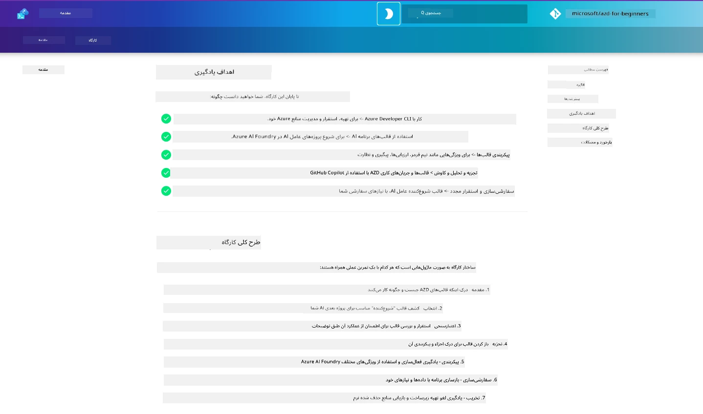

<div align="center">
  <div style="background: linear-gradient(135deg, #0078d4, #106ebe); border-radius: 10px; padding: 20px; margin: 20px 0; box-shadow: 0 4px 15px rgba(0, 120, 212, 0.3); border: 2px solid #005a9e;">
    <h2 style="color: white; margin: 0; font-size: 24px; text-shadow: 1px 1px 2px rgba(0,0,0,0.3);">
      🎯 کارگاه AZD برای توسعه‌دهندگان هوش مصنوعی
    </h2>
    <p style="color: white; margin: 10px 0 0 0; font-size: 16px; text-shadow: 1px 1px 2px rgba(0,0,0,0.3);">
      <strong>یک کارگاه عملی برای ساخت برنامه‌های هوش مصنوعی با Azure Developer CLI.</strong><br>
      هفت ماژول را تکمیل کنید تا در قالب‌های AZD و جریان‌های کاری استقرار AI مهارت پیدا کنید.
    </p>
    <div style="margin-top: 15px;">
      <span style="background: rgba(255,255,255,0.2); padding: 5px 10px; border-radius: 15px; color: white; font-size: 14px;">
        📅 آخرین به‌روزرسانی: فوریه ۲۰۲۶
      </span>
    </div>
  </div>
</div>

# کارگاه AZD برای توسعه‌دهندگان هوش مصنوعی

به کارگاه عملی خوش آمدید برای یادگیری Azure Developer CLI (AZD) با تمرکز بر استقرار برنامه‌های هوش مصنوعی. این کارگاه به شما کمک می‌کند تا در سه گام درک کاربردی از قالب‌های AZD به‌دست آورید:

1. **کاوش** - قالبی را پیدا کنید که برای شما مناسب باشد.
1. **استقرار** - پیاده‌سازی و اعتبارسنجی کنید که کار می‌کند
1. **شخصی‌سازی** - تغییر دهید و تکرار کنید تا متعلق به شما شود!

Over the course of this workshop, you will also be introduced to core developer tools and workflows, to help you streamline your end-to-end development journey.

<br/>

## راهنمای مبتنی بر مرورگر

درس‌های کارگاه به صورت Markdown هستند. می‌توانید مستقیماً آن‌ها را در GitHub مرور کنید - یا پیش‌نمایش مبتنی بر مرورگر را همان‌طور که در تصویر زیر نشان داده شده است راه‌اندازی کنید.



برای استفاده از این گزینه - مخزن را به پروفایل خود فورک کنید و GitHub Codespaces را راه‌اندازی کنید. پس از فعال شدن ترمینال VS Code، این دستور را تایپ کنید:

```bash title="" linenums="0"
mkdocs serve > /dev/null 2>&1 &
```

در عرض چند ثانیه یک کادر گفتگو پاپ‌آپ خواهید دید. گزینه `Open in browser` را انتخاب کنید. راهنمای مبتنی بر وب اکنون در یک تب جدید مرورگر باز می‌شود. برخی از مزایای این پیش‌نمایش:

1. **جستجوی داخلی** - به‌سرعت کلیدواژه‌ها یا درس‌ها را پیدا کنید.
1. **آیکون کپی** - برای دیدن این گزینه نشانگر را روی بلوک‌های کد ببرید
1. **تغییر تم** - بین تم‌های تاریک و روشن جابجا شوید
1. **دریافت کمک** - برای پیوستن روی آیکون Discord در فوتر کلیک کنید!

<br/>

## مرور کلی کارگاه

**مدت:** 3-4 hours  
**سطح:** مبتدی تا متوسط  
**پیش‌نیازها:** آشنایی با Azure، مفاهیم AI، VS Code و ابزارهای خط فرمان.

This is a hands-on workshop where you learn by doing. Once you have completed the exercises, we recommend reviewing the AZD برای مبتدیان curriculum to continue your learning journey into Security and Productivity best practices.

| زمان| ماژول  | هدف |
|:---|:---|:---|
| 15 mins | [مقدمه](docs/instructions/0-Introduction.md) | آماده‌سازی زمینه، درک اهداف |
| 30 mins | [انتخاب قالب هوش مصنوعی](docs/instructions/1-Select-AI-Template.md) | گزینه‌ها را بررسی کرده و یک قالب شروع‌کننده انتخاب کنید | 
| 30 mins | [اعتبارسنجی قالب AI](docs/instructions/2-Validate-AI-Template.md) | راه‌اندازی راه‌حل پیش‌فرض در Azure |
| 30 mins | [تفکیک قالب AI](docs/instructions/3-Deconstruct-AI-Template.md) | کاوش ساختار و پیکربندی |
| 30 mins | [پیکربندی قالب AI](docs/instructions/4-Configure-AI-Template.md) | فعال‌سازی و آزمودن قابلیت‌های موجود |
| 30 mins | [شخصی‌سازی قالب AI](docs/instructions/5-Customize-AI-Template.md) | سفارشی‌سازی قالب مطابق نیازهای شما |
| 30 mins | [پاک‌سازی زیرساخت](docs/instructions/6-Teardown-Infrastructure.md) | پاک‌سازی و آزادسازی منابع |
| 15 mins | [خلاصه و گام‌های بعدی](docs/instructions/7-Wrap-up.md) | منابع یادگیری، چالش کارگاه |

<br/>

## آنچه یاد خواهید گرفت

قالب AZD را به‌عنوان یک فضای آزمایشی آموزشی در نظر بگیرید تا قابلیت‌ها و ابزارهای مختلف برای توسعه انتها تا انتها روی Microsoft Foundry را بررسی کنید. تا پایان این کارگاه، باید درک شهودی از ابزارها و مفاهیم مختلف در این زمینه داشته باشید.

| مفهوم  | هدف |
|:---|:---|
| **Azure Developer CLI** | درک دستورات ابزار و جریان‌های کاری |
| **AZD Templates**| درک ساختار پروژه و پیکربندی |
| **Azure AI Agent**| تهیه و استقرار پروژه Microsoft Foundry |
| **Azure AI Search**| فعال‌سازی مهندسی زمینه با ایجنت‌ها |
| **Observability**| کاوش ردیابی، مانیتورینگ و ارزیابی‌ها |
| **Red Teaming**| بررسی تست‌های خصمانه و راهکارهای مقابله |

<br/>

## ساختار کارگاه

The workshop is structured to take you on a journey from template discovery, to deployment, deconstruction, and customization - using the official [شروع کار با AI Agents](https://github.com/Azure-Samples/get-started-with-ai-agents) starter template as the basis.

### [ماژول 1: انتخاب قالب هوش مصنوعی](docs/instructions/1-Select-AI-Template.md) (30 mins)

- قالب‌های AI چه هستند؟
- قالب‌های AI را کجا می‌توانم پیدا کنم؟
- چگونه می‌توانم ساخت ایجنت‌های هوش مصنوعی را شروع کنم؟
- **تمرین**: شروع سریع با GitHub Codespaces

### [ماژول 2: اعتبارسنجی قالب AI](docs/instructions/2-Validate-AI-Template.md) (30 mins)

- معماری قالب هوش مصنوعی چیست؟
- جریان کاری توسعه AZD چیست؟
- چگونه می‌توانم در توسعه AZD کمک بگیرم؟
- **تمرین**: استقرار و اعتبارسنجی قالب AI Agents

### [ماژول 3: تفکیک قالب AI](docs/instructions/3-Deconstruct-AI-Template.md) (30 mins)

- محیط خود را در `.azure/` کاوش کنید 
- تنظیم منابع خود را در `infra/` بررسی کنید 
- پیکربندی AZD خود را در `azure.yaml`s کاوش کنید
- **تمرین**: تغییر متغیرهای محیطی و استقرار مجدد

### [ماژول 4: پیکربندی قالب AI](docs/instructions/4-Configure-AI-Template.md) (30 mins)
- کاوش: تولید تقویت‌شده با بازیابی
- کاوش: ارزیابی ایجنت و تست‌های خصمانه
- کاوش: ردیابی و مانیتورینگ
- **تمرین**: بررسی ایجنت AI و قابلیت مشاهده 

### [ماژول 5: شخصی‌سازی قالب AI](docs/instructions/5-Customize-AI-Template.md) (30 mins)
- تعریف: PRD با الزامات سناریو
- پیکربندی: متغیرهای محیطی برای AZD
- پیاده‌سازی: هوک‌های چرخه عمر برای وظایف افزوده
- **تمرین**: سفارشی‌سازی قالب برای سناریوی من

### [ماژول 6: پاک‌سازی زیرساخت](docs/instructions/6-Teardown-Infrastructure.md) (30 mins)
- خلاصه: قالب‌های AZD چیستند؟
- خلاصه: چرا از Azure Developer CLI استفاده کنیم؟
- گام‌های بعدی: یک قالب متفاوت را امتحان کنید!
- **تمرین**: لغو تهیه زیرساخت و پاک‌سازی

<br/>

## چالش کارگاه

می‌خواهید خود را به چالش بکشید و بیشتر انجام دهید؟ در اینجا چند پیشنهاد پروژه وجود دارد - یا ایده‌های خود را با ما به اشتراک بگذارید!!

| پروژه | توضیحات |
|:---|:---|
|1. **تفکیک یک قالب پیچیده هوش مصنوعی** | از جریان کاری و ابزارهایی که توضیح دادیم استفاده کنید و ببینید آیا می‌توانید یک قالب راه‌حل AI متفاوت را استقرار، اعتبارسنجی و سفارشی‌سازی کنید. _چه چیزی یاد گرفتید?_|
|2. **سفارشی‌سازی بر اساس سناریوی شما**  | سعی کنید یک PRD (Product Requirements Document) برای یک سناریوی متفاوت بنویسید. سپس از GitHub Copilot در مخزن قالب خود در Agent Model استفاده کنید - و از آن بخواهید یک جریان کاری سفارشی‌سازی برای شما تولید کند. _چه چیزی یاد گرفتید؟ چگونه می‌توانید این پیشنهادها را بهبود بخشید؟_|
| | |

## آیا بازخوردی دارید؟

1. یک issue در این مخزن ثبت کنید - برای سهولت برچسب `Workshop` را اضافه کنید.
1. به Discord مایکروسافت فاندری بپیوندید - با همتایان خود ارتباط برقرار کنید!


| | | 
|:---|:---|
| **📚 صفحه دوره**| [AZD برای مبتدیان](../README.md)|
| **📖 مستندات** | [شروع کار با قالب‌های AI](https://learn.microsoft.com/en-us/azure/ai-foundry/how-to/develop/ai-template-get-started)|
| **🛠️قالب‌های AI** | [قالب‌های Microsoft Foundry](https://ai.azure.com/templates) |
|**🚀 گام‌های بعدی** | [شروع کارگاه](../../../workshop) |
| | |

<br/>

---

**ناوبری:** [دوره اصلی](../README.md) | [مقدمه](docs/instructions/0-Introduction.md) | [ماژول 1: انتخاب قالب](docs/instructions/1-Select-AI-Template.md)

**آماده‌اید ساخت برنامه‌های هوش مصنوعی با AZD را شروع کنید؟**

[شروع کارگاه: مقدمه →](docs/instructions/0-Introduction.md)

---

<!-- CO-OP TRANSLATOR DISCLAIMER START -->
**سلب مسئولیت**:
این سند با استفاده از سرویس ترجمهٔ هوش مصنوعی [Co-op Translator](https://github.com/Azure/co-op-translator) ترجمه شده است. اگرچه ما در تلاش برای دقت هستیم، لطفاً توجه داشته باشید که ترجمه‌های خودکار ممکن است حاوی خطاها یا نادرستی‌هایی باشند. نسخهٔ اصلی سند به زبان اصلی آن باید به‌عنوان مرجع معتبر محسوب شود. برای اطلاعات حیاتی، ترجمهٔ حرفه‌ای انسانی توصیه می‌شود. ما در قبال هرگونه سوءتفاهم یا تفسیر نادرست ناشی از استفاده از این ترجمه مسئول نیستیم.
<!-- CO-OP TRANSLATOR DISCLAIMER END -->