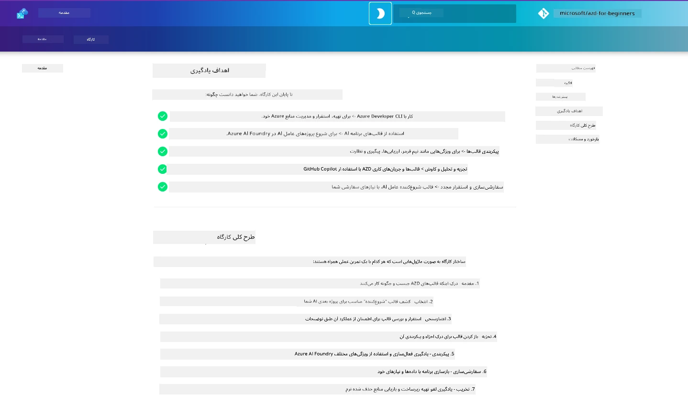

<div align="center">
  <div style="background: linear-gradient(135deg, #0078d4, #106ebe); border-radius: 10px; padding: 20px; margin: 20px 0; box-shadow: 0 4px 15px rgba(0, 120, 212, 0.3); border: 2px solid #005a9e;">
    <h2 style="color: white; margin: 0; font-size: 24px; text-shadow: 1px 1px 2px rgba(0,0,0,0.3);">
      🎯 کارگاه AZD برای توسعه‌دهندگان هوش مصنوعی
    </h2>
    <p style="color: white; margin: 10px 0 0 0; font-size: 16px; text-shadow: 1px 1px 2px rgba(0,0,0,0.3);">
      <strong>یک کارگاه عملی برای ساخت برنامه‌های هوش مصنوعی با Azure Developer CLI.</strong><br>
      هفت ماژول را کامل کنید تا در قالب‌های AZD و جریان‌های کاری استقرار هوش مصنوعی تسلط پیدا کنید.
    </p>
    <div style="margin-top: 15px;">
      <span style="background: rgba(255,255,255,0.2); padding: 5px 10px; border-radius: 15px; color: white; font-size: 14px;">
        📅 آخرین به‌روزرسانی: مارس 2026
      </span>
    </div>
  </div>
</div>

# کارگاه AZD برای توسعه‌دهندگان هوش مصنوعی

به کارگاه عملی خوش آمدید برای یادگیری Azure Developer CLI (AZD) با تمرکز بر استقرار برنامه‌های هوش مصنوعی. این کارگاه به شما کمک می‌کند تا فهم کاربردی از قالب‌های AZD را در 3 مرحله به دست آورید:

1. **کشف** - قالب مناسب خود را پیدا کنید.
1. **استقرار** - استقرار دهید و تأیید کنید که کار می‌کند
1. **سفارشی‌سازی** - ویرایش و تکرار کنید تا آن را مال خود کنید!

در طول این کارگاه، با ابزارها و جریان‌های کاری اصلی توسعه‌دهنده نیز آشنا خواهید شد تا به شما در ساده‌سازی مسیر توسعه انتها-به-انتهای‌تان کمک کند.

<br/>

## راهنمای مبتنی بر مرورگر

درس‌های کارگاه به صورت Markdown هستند. می‌توانید مستقیماً در GitHub آنها را مرور کنید - یا پیش‌نمایش مبتنی بر مرورگر را همان‌طور که در تصویر زیر نشان داده شده است، راه‌اندازی کنید.



برای استفاده از این گزینه - مخزن را به پروفایل خود فورک کنید و GitHub Codespaces را راه‌اندازی کنید. وقتی ترمینال VS Code فعال شد، این دستور را تایپ کنید:

This browser preview works in GitHub Codespaces, dev containers, or a local clone with Python and MkDocs installed.

```bash title="" linenums="0"
mkdocs serve > /dev/null 2>&1 &
```

در چند ثانیه پنجره‌ای پاپ‌آپ مشاهده خواهید کرد. گزینه‌ی `Open in browser` را انتخاب کنید. راهنمای مبتنی بر وب اکنون در یک تب جدید مرورگر باز خواهد شد. برخی از مزایای این پیش‌نمایش:

1. **جستجوی داخلی** - به‌سرعت کلمات کلیدی یا درس‌ها را پیدا کنید.
1. **آیکون کپی** - نشانگر را روی بلوک‌های کد ببرید تا این گزینه ظاهر شود
1. **تغییر تم** - بین حالت‌های تیره و روشن جابجا شوید
1. **دریافت کمک** - برای پیوستن، روی آیکون Discord در پاورقی کلیک کنید!

<br/>

## نمای کلی کارگاه

**مدت:** 3-4 hours  
**سطح:** مبتدی تا متوسط  
**پیش‌نیازها:** آشنایی با Azure، مفاهیم هوش مصنوعی، VS Code و ابزارهای خط فرمان.

این یک کارگاه عملی است که در آن با عمل کردن یاد می‌گیرید. پس از تکمیل تمرین‌ها، توصیه می‌کنیم برای ادامه مسیر یادگیری خود به سمت بهترین شیوه‌های امنیت و بهره‌وری، برنامه درسی AZD For Beginners را مرور کنید.

| Time| Module  | Objective |
|:---|:---|:---|
| 15 mins | [مقدمه](docs/instructions/0-Introduction.md) | آماده‌سازی صحنه، درک اهداف |
| 30 mins | [انتخاب قالب هوش مصنوعی](docs/instructions/1-Select-AI-Template.md) | گزینه‌ها را بررسی کرده و یک قالب شروع‌کننده انتخاب کنید | 
| 30 mins | [اعتبارسنجی قالب AI](docs/instructions/2-Validate-AI-Template.md) | راه‌حل پیش‌فرض را در Azure مستقر کنید |
| 30 mins | [بررسی ساختار قالب AI](docs/instructions/3-Deconstruct-AI-Template.md) | ساختار و پیکربندی را بررسی کنید |
| 30 mins | [پیکربندی قالب AI](docs/instructions/4-Configure-AI-Template.md) | فعال‌سازی و آزمون قابلیت‌های موجود |
| 30 mins | [سفارشی‌سازی قالب AI](docs/instructions/5-Customize-AI-Template.md) | قالب را مطابق نیازهای خود تطبیق دهید |
| 30 mins | [پاک‌سازی زیرساخت](docs/instructions/6-Teardown-Infrastructure.md) | پاک‌سازی و آزادسازی منابع |
| 15 mins | [جمع‌بندی و گام‌های بعدی](docs/instructions/7-Wrap-up.md) | منابع یادگیری، چالش کارگاه |

<br/>

## آنچه یاد می‌گیرید

قالب AZD را به‌عنوان یک محیط شبیه‌ساز یادگیری در نظر بگیرید تا قابلیت‌ها و ابزارهای مختلف برای توسعه انتها-به-انتها روی Microsoft Foundry را کاوش کنید. تا پایان این کارگاه، باید درکی شهودی از ابزارها و مفاهیم مختلف در این زمینه داشته باشید.

| Concept  | Objective |
|:---|:---|
| **Azure Developer CLI** | درک دستورات ابزار و جریان‌های کاری |
| **AZD Templates**| درک ساختار پروژه و پیکربندی |
| **Azure AI Agent**| تهیه و استقرار پروژه Microsoft Foundry |
| **Azure AI Search**| فعال‌سازی مهندسی زمینه با عامل‌ها |
| **Observability**| بررسی ردیابی، پایش و ارزیابی‌ها |
| **Red Teaming**| بررسی تست‌های خصمانه و راهکارهای مقابله |

<br/>

## ساختار کارگاه

این کارگاه به‌گونه‌ای ساختاربندی شده است که شما را از کشف قالب تا استقرار، بررسی ساختار و سفارشی‌سازی همراهی کند - با استفاده از قالب شروع رسمی [شروع کار با عوامل هوش مصنوعی](https://github.com/Azure-Samples/get-started-with-ai-agents) به‌عنوان پایه.

### [ماژول ۱: انتخاب قالب هوش مصنوعی](docs/instructions/1-Select-AI-Template.md) (30 mins)

- قالب‌های AI چیستند؟
- قالب‌های AI را از کجا می‌توان پیدا کرد؟
- چگونه می‌توانم شروع به ساختن AI Agents کنم؟
- **تمرین**: راه‌اندازی سریع در Codespaces یا یک کانتینر توسعه

### [ماژول ۲: اعتبارسنجی قالب AI](docs/instructions/2-Validate-AI-Template.md) (30 mins)

- معماری قالب AI چیست؟
- جریان کاری توسعه AZD چیست؟
- چگونه می‌توانم در توسعه با AZD کمک بگیرم؟
- **تمرین**: استقرار و اعتبارسنجی قالب AI Agents

### [ماژول ۳: بررسی ساختار قالب AI](docs/instructions/3-Deconstruct-AI-Template.md) (30 mins)

- مرور محیط خود در `.azure/` 
- مرور تنظیمات منابع خود در `infra/` 
- پیکربندی AZD خود را در `azure.yaml`s بررسی کنید
- **تمرین**: تغییر متغیرهای محیطی و استقرار مجدد

### [ماژول ۴: پیکربندی قالب AI](docs/instructions/4-Configure-AI-Template.md) (30 mins)
- بررسی: Retrieval Augmented Generation
- بررسی: ارزیابی عامل و Red Teaming
- بررسی: ردیابی و پایش
- **تمرین**: بررسی عامل AI و قابلیت مشاهده 

### [ماژول ۵: سفارشی‌سازی قالب AI](docs/instructions/5-Customize-AI-Template.md) (30 mins)
- تعریف: PRD همراه با نیازمندی‌های سناریو
- پیکربندی: متغیرهای محیطی برای AZD
- پیاده‌سازی: Lifecycle Hooks برای وظایف اضافی
- **تمرین**: سفارشی‌سازی قالب برای سناریوی من

### [ماژول ۶: پاک‌سازی زیرساخت](docs/instructions/6-Teardown-Infrastructure.md) (30 mins)
- مرور: قالب‌های AZD چیستند؟
- مرور: چرا از Azure Developer CLI استفاده کنیم؟
- گام‌های بعدی: یک قالب متفاوت را امتحان کنید!
- **تمرین**: حذف تخصیص زیرساخت و پاکسازی

<br/>

## چالش کارگاه

می‌خواهید خودتان را بیشتر به چالش بکشید؟ در اینجا چند پیشنهاد پروژه وجود دارد - یا ایده‌های خود را با ما به اشتراک بگذارید!!

| Project | Description |
|:---|:---|
|1. **بررسی ساختار یک قالب پیچیده هوش مصنوعی** | از جریان کاری و ابزارهایی که توضیح دادیم استفاده کنید و ببینید آیا می‌توانید یک قالب راه‌حل متفاوت AI را مستقر، اعتبارسنجی و سفارشی کنید. _چه آموختید؟_|
|2. **سفارشی‌سازی بر اساس سناریوی خود**  | سعی کنید یک PRD (سند نیازمندی‌های محصول) برای یک سناریوی متفاوت بنویسید. سپس از GitHub Copilot در مخزن قالب خود در Agent Model استفاده کنید - و از آن بخواهید یک جریان کاری سفارشی‌سازی برای شما تولید کند. _چه آموختید؟ چگونه می‌توانید این پیشنهادها را بهبود بخشید؟_|
| | |

## بازخورد دارید؟

1. یک issue در این ریپو پست کنید - برای سهولت آن را با تگ `Workshop` علامت‌گذاری کنید.
1. به Discord Microsoft Foundry بپیوندید - با همتایان خود ارتباط برقرار کنید!


| | | 
|:---|:---|
| **📚 صفحه دوره**| [AZD For Beginners](../README.md)|
| **📖 مستندات** | [شروع کار با قالب‌های هوش مصنوعی](https://learn.microsoft.com/en-us/azure/ai-foundry/how-to/develop/ai-template-get-started)|
| **🛠️قالب‌های AI** | [قالب‌های Microsoft Foundry](https://ai.azure.com/templates) |
|**🚀 گام‌های بعدی** | [شروع کارگاه](#نمای-کلی-کارگاه) |
| | |

<br/>

---

**مسیرها:** [دوره اصلی](../README.md) | [مقدمه](docs/instructions/0-Introduction.md) | [ماژول ۱: انتخاب قالب](docs/instructions/1-Select-AI-Template.md)

**آماده‌اید تا با AZD شروع به ساختن برنامه‌های هوش مصنوعی کنید؟**

[شروع کارگاه: مقدمه →](docs/instructions/0-Introduction.md)

---

<!-- CO-OP TRANSLATOR DISCLAIMER START -->
**سلب مسئولیت**:
این سند با استفاده از سرویس ترجمهٔ هوش مصنوعی [Co-op Translator](https://github.com/Azure/co-op-translator) ترجمه شده است. در حالی که ما در تلاش برای دقت هستیم، لطفاً توجه داشته باشید که ترجمه‌های خودکار ممکن است حاوی خطاها یا نادرستی‌هایی باشند. سند اصلی به زبان مادری‌اش باید به‌عنوان منبع معتبر در نظر گرفته شود. برای اطلاعات حیاتی، ترجمهٔ حرفه‌ای انسانی توصیه می‌شود. ما در قبال هرگونه سوءتفاهم یا تفسیر نادرست ناشی از استفاده از این ترجمه مسئولیتی نداریم.
<!-- CO-OP TRANSLATOR DISCLAIMER END -->