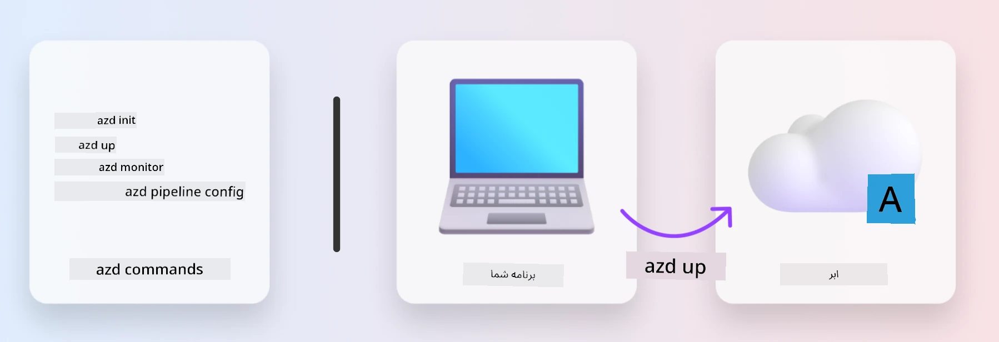
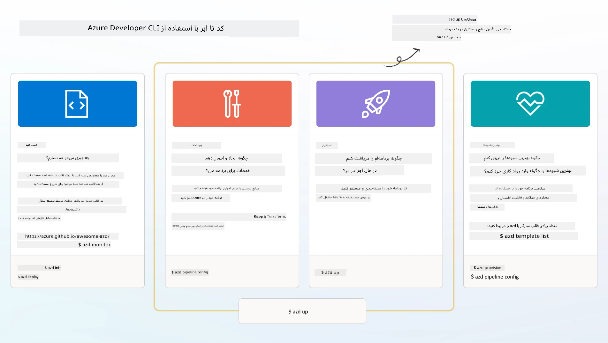

# 1. انتخاب یک قالب

!!! tip "تا پایان این ماژول قادر خواهید بود"

    - [ ] توصیف اینکه قالب‌های AZD چه هستند
    - [ ] کشف و استفاده از قالب‌های AZD برای هوش مصنوعی
    - [ ] شروع با قالب AI Agents
    - [ ] **آزمایش 1:** شروع سریع AZD با GitHub Codespaces

---

## 1. یک قیاس سازنده

ساخت یک برنامه هوش مصنوعی مدرن و آماده سازمانی _از ابتدا_ می‌تواند دلهره‌آور باشد. این کمی شبیه ساختن خانه جدید خود به‌صورت تک‌تک آجرها است. بله، می‌توان این کار را انجام داد! اما این مؤثرترین راه برای رسیدن به نتیجه مطلوب نیست!

در عوض، اغلب با یک _نقشه طراحی_ موجود شروع می‌کنیم و با یک معمار همکاری می‌کنیم تا آن را مطابق نیازهای شخصی خود سفارشی کنیم. و دقیقاً همین رویکرد باید هنگام ساخت برنامه‌های هوشمند اتخاذ شود. ابتدا یک معماری طراحی خوب پیدا کنید که با فضای مسئله شما مناسب باشد. سپس با یک معمار راه‌حل همکاری کنید تا راه‌حل را برای سناریوی خاص شما سفارشی و توسعه دهد.

اما این نقشه‌های طراحی را از کجا می‌توان یافت؟ و چگونه معمار مناسبی پیدا کنیم که مایل باشد به ما یاد دهد چگونه این نقشه‌ها را خودمان سفارشی و مستقر کنیم؟ در این کارگاه، به این سوالات با معرفی سه فناوری پاسخ می‌دهیم:

1. [Azure Developer CLI](https://aka.ms/azd) - یک ابزار متن‌باز که مسیر توسعه‌دهنده را در حرکت از توسعه محلی (ساخت) تا استقرار در ابر (ارسال) تسریع می‌کند.
1. [Microsoft Foundry Templates](https://ai.azure.com/templates) - مخازن استاندارد متن‌باز حاوی کد نمونه، زیرساخت و فایل‌های پیکربندی برای استقرار یک معماری راه‌حل هوش مصنوعی.
1. [GitHub Copilot Agent Mode](https://code.visualstudio.com/docs/copilot/chat/chat-agent-mode) - یک عامل کدنویسی مبتنی بر دانش Azure که می‌تواند ما را در ناوبری کدبیس و اعمال تغییرات با استفاده از زبان طبیعی راهنمایی کند.

با در دست داشتن این ابزارها، اکنون می‌توانیم قالب مناسب را _کشف_ کنیم، آن را _مستقر_ کنیم تا اعتبارسنجی کنیم که کار می‌کند، و آن را _سفارشی_ کنیم تا با سناریوهای خاص ما منطبق شود. بیایید وارد شویم و بیاموزیم چگونه کار می‌کنند.


---

## 2. Azure Developer CLI

The [Azure Developer CLI](https://learn.microsoft.com/en-us/azure/developer/azure-developer-cli/) (or `azd`) is an open-source commandline tool that can speed up your code-to-cloud journey with a set of developer-friendly commands that work consistently across your IDE (development) and CI/CD (devops) environments.

With `azd`, your deployment journey can be as simple as:

- `azd init` - Initializes a new AI project from an existing AZD template.
- `azd up` - Provisions infrastructure and deploy your application in one step.
- `azd monitor` - Get real-time monitoring and diagnostics for your deployed application.
- `azd pipeline config` - Setup CI/CD pipelines to automate deployment to Azure.

**🎯 | تمرین**: <br/> کاوش در ابزار خط فرمان `azd` در محیط GitHub Codespaces خود همین الآن. با وارد کردن این فرمان شروع کنید تا ببینید ابزار چه قابلیت‌هایی دارد:

```bash title="" linenums="0"
azd help
```



---

## 3. قالب AZD

For `azd` to achieve this, it needs to know the infrastructure to provision, the configuration settings to enforce, and the application to deploy. This is where [AZD templates](https://learn.microsoft.com/en-us/azure/developer/azure-developer-cli/azd-templates?tabs=csharp) come in. 

AZD templates are open-source repositories that combine sample code with infrastructure and configuraton files required for deploying the solution architecture.
By using an _Infrastructure-as-Code_ (IaC) approach, they allow template resource definitions and configuration settings to be version-controller (just like the app source code) - creating reusable and consistent workflows across users of that project.

When creating or reusing an AZD template for _your_ scenario, consider these questions:

1. What are you building? → Is there a template that has starter code for that scenario?
1. How is your solution architected? → Is there a template that has the necessary resources?
1. How is your solution deployed? → Think `azd deploy` with pre/post-processing hooks!
1. How can you optimize it further? → Think built-in monitoring and automation pipelines!

**🎯 | تمرین**: <br/> 
به گالری [Awesome AZD](https://azure.github.io/awesome-azd/) مراجعه کنید و از فیلترها برای بررسی بیش از 250 قالب موجود استفاده کنید. ببینید آیا می‌توانید قالبی پیدا کنید که با نیازهای سناریوی _شما_ هم‌راستا باشد.



---

## 4. قالب‌های برنامه‌های هوش مصنوعی

برای برنامه‌های مجهز به هوش مصنوعی، مایکروسافت قالب‌های تخصصی ارائه می‌دهد که شامل **Microsoft Foundry** و **Foundry Agents** هستند. این قالب‌ها مسیر شما را برای ساخت برنامه‌های هوشمند و آماده تولید تسریع می‌کنند.

### قالب‌های Microsoft Foundry و Foundry Agents

یک قالب زیر را برای استقرار انتخاب کنید. هر قالب در [Awesome AZD](https://azure.github.io/awesome-azd/) در دسترس است و می‌توان آن را با یک فرمان اولیه‌سازی کرد.

| Template | Description | Deploy Command |
|----------|-------------|----------------|
| **[AI Chat with RAG](https://azure.github.io/awesome-azd/?tags=ai&tags=rag)** | برنامه گفت‌وگوی چت با تولید تقویت‌شده بازیابی (Retrieval Augmented Generation) با استفاده از Microsoft Foundry | `azd init -t azure-samples/azure-search-openai-demo` |
| **[Foundry Agent Service Starter](https://azure.github.io/awesome-azd/?tags=ai&tags=agents)** | ساخت عوامل هوش مصنوعی با Foundry Agents برای اجرای خودمختار وظایف | `azd init -t azure-samples/foundry-agent-service-starter` |
| **[Multi-Agent Orchestration](https://azure.github.io/awesome-azd/?tags=ai&tags=agents)** | هماهنگی چندین Foundry Agent برای گردش‌های کاری پیچیده | `azd init -t azure-samples/multi-agent-orchestration` |
| **[AI Document Intelligence](https://azure.github.io/awesome-azd/?tags=ai&tags=document)** | استخراج و تحلیل اسناد با مدل‌های Microsoft Foundry | `azd init -t azure-samples/ai-document-processing` |
| **[Conversational AI Bot](https://azure.github.io/awesome-azd/?tags=ai&tags=bot)** | ساخت ربات‌های گفت‌وگوی هوشمند با ادغام Microsoft Foundry | `azd init -t azure-samples/ai-chat-protocol` |
| **[AI Image Generation](https://azure.github.io/awesome-azd/?tags=ai&tags=dalle)** | تولید تصاویر با استفاده از DALL-E از طریق Microsoft Foundry | `azd init -t azure-samples/ai-image-generation` |
| **[Semantic Kernel Agent](https://azure.github.io/awesome-azd/?tags=ai&tags=semantic-kernel)** | عوامل هوش مصنوعی با استفاده از Semantic Kernel همراه با Foundry Agents | `azd init -t azure-samples/semantic-kernel-agent` |
| **[AutoGen Multi-Agent](https://azure.github.io/awesome-azd/?tags=ai&tags=autogen)** | سیستم‌های چندعامل با استفاده از چارچوب AutoGen | `azd init -t azure-samples/autogen-multi-agent` |

### شروع سریع

1. **مرور قالب‌ها**: به [https://azure.github.io/awesome-azd/](https://azure.github.io/awesome-azd/) مراجعه کرده و بر اساس `AI`، `Agents`، یا `Microsoft Foundry` فیلتر کنید
2. **قالب خود را انتخاب کنید**: یکی را که با مورد استفاده شما مطابقت دارد انتخاب کنید
3. **ابتدایی‌سازی**: فرمان `azd init` را برای قالب انتخابی خود اجرا کنید
4. **استقرار**: `azd up` را اجرا کنید تا تأمین زیرساخت و استقرار انجام شود

**🎯 | تمرین**: <br/>
یکی از قالب‌های بالا را بر اساس سناریوی خود انتخاب کنید:

- **در حال ساخت یک چت‌بات هستید؟** → با **AI Chat with RAG** یا **Conversational AI Bot** شروع کنید
- **نیاز به عوامل خودمختار دارید؟** → **Foundry Agent Service Starter** یا **Multi-Agent Orchestration** را امتحان کنید
- **در حال پردازش اسناد هستید؟** → از **AI Document Intelligence** استفاده کنید
- **به کمک کدنویسی با هوش مصنوعی نیاز دارید؟** → **Semantic Kernel Agent** یا **AutoGen Multi-Agent** را بررسی کنید

```bash title="Example: Deploy the AI Chat with RAG template" linenums="0"
azd init -t azure-samples/azure-search-openai-demo
azd up
```

!!! info "کاوش قالب‌های بیشتر"
    گالری [Awesome AZD](https://azure.github.io/awesome-azd/) بیش از 250 قالب را در خود دارد. از فیلترها برای پیدا کردن قالب‌هایی که با نیازهای خاص شما برای زبان، چارچوب، و سرویس‌های Azure مطابقت دارند استفاده کنید.

---

<!-- CO-OP TRANSLATOR DISCLAIMER START -->
سلب مسئولیت:
این سند با استفاده از سرویس ترجمهٔ هوش مصنوعی Co-op Translator (https://github.com/Azure/co-op-translator) ترجمه شده است. اگرچه ما در تلاش برای دقت هستیم، لطفاً توجه داشته باشید که ترجمه‌های خودکار ممکن است حاوی اشتباهات یا نادرستی‌هایی باشند. نسخهٔ اصلی سند به زبان اصلی آن باید به‌عنوان مرجع معتبر در نظر گرفته شود. برای اطلاعات حیاتی، توصیه می‌شود از ترجمهٔ حرفه‌ای و انسانی استفاده شود. ما در قبال هرگونه سوءتفاهم یا تفسیر نادرستی که ناشی از استفاده از این ترجمه باشد، مسئولیتی نداریم.
<!-- CO-OP TRANSLATOR DISCLAIMER END -->