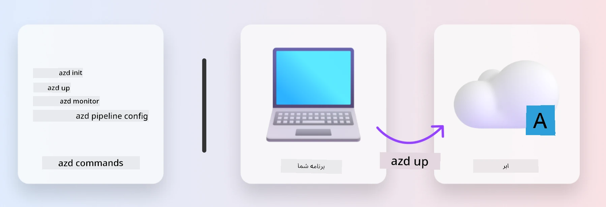
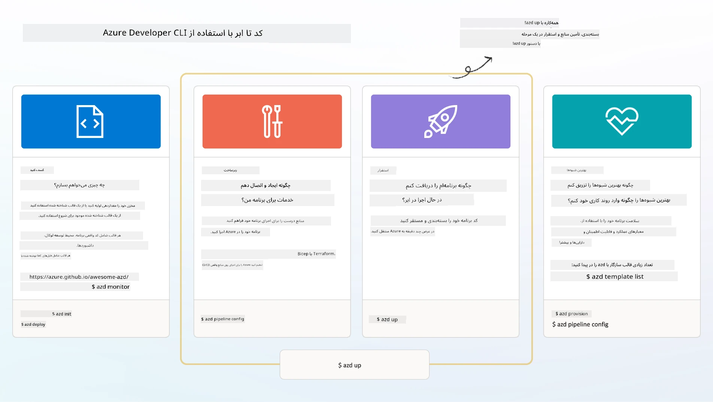

# 1. انتخاب یک قالب

!!! tip "تا پایان این ماژول قادر خواهید بود"

    - [ ] توضیح دهید قالب‌های AZD چه هستند
    - [ ] قالب‌های AZD برای هوش مصنوعی را کشف و استفاده کنید
    - [ ] با قالب AI Agents شروع کنید
    - [ ] **آزمایشگاه 1:** شروع سریع AZD در Codespaces یا یک کانتینر توسعه

---

## 1. یک تشبیه برای سازنده

ساخت یک برنامه هوش مصنوعی مدرن و آماده سازمانی _از صفر_ می‌تواند دلهره‌آور باشد. کمی شبیه ساختن خانه جدید خود به صورت آجر به آجر است. بله، شدنی است! اما این مؤثرترین راه برای رسیدن به نتیجه نهایی مطلوب نیست!

در عوض، اغلب با یک _نقشه طراحی_ موجود شروع می‌کنیم و با یک معمار همکاری می‌کنیم تا آن را بر اساس نیازهای شخصی خود سفارشی کنیم. و دقیقاً همین روش را باید هنگام ساخت برنامه‌های هوشمند اتخاذ کنیم. ابتدا یک معماری طراحی خوب پیدا کنید که با حوزه مسئله شما مطابقت داشته باشد. سپس با یک معمار راه‌حل همکاری کنید تا راه‌حل را برای سناریوی خاص شما سفارشی و توسعه دهد.

اما این نقشه‌های طراحی را کجا می‌توان پیدا کرد؟ و چگونه معمارانی بیابیم که مایل باشند به ما آموزش دهند چگونه این نقشه‌ها را خودمان سفارشی و مستقر کنیم؟ در این کارگاه، با معرفی سه فناوری به این سوالات پاسخ می‌دهیم:

1. [Azure Developer CLI](https://aka.ms/azd) - یک ابزار متن‌باز که مسیر توسعه‌دهنده را در گذر از توسعه محلی (ساخت) تا استقرار در ابر (ارسال) تسریع می‌کند.
1. [Microsoft Foundry Templates](https://ai.azure.com/templates) - مخازن استاندارد متن‌باز حاوی نمونه‌کد، زیرساخت و فایل‌های پیکربندی برای استقرار یک معماری راه‌حل هوش مصنوعی.
1. [GitHub Copilot Agent Mode](https://code.visualstudio.com/docs/copilot/chat/chat-agent-mode) - یک ایجنت کدنویسی مبتنی بر دانش Azure که می‌تواند ما را در پیمایش پایگاه کد و اعمال تغییرات با زبان طبیعی راهنمایی کند.

با در دست داشتن این ابزارها، اکنون می‌توانیم قالب مناسب را _کشف_ کنیم، آن را _مستقر_ کنیم تا صحت عملکرد آن را بررسی کنیم، و آن را برای سناریوهای خاص خود _سفارشی_ کنیم. بیایید وارد جزئیات شویم و یاد بگیریم چگونه کار می‌کنند.

---

## 2. Azure Developer CLI

The [Azure Developer CLI](https://learn.microsoft.com/en-us/azure/developer/azure-developer-cli/) (or `azd`) یک ابزار خط فرمان متن‌باز است که می‌تواند مسیر کد تا ابر شما را با مجموعه‌ای از فرمان‌های سازگار برای توسعه‌دهنده که در IDE (توسعه) و محیط‌های CI/CD (devops) به‌طور یکسان کار می‌کنند، سرعت ببخشد.

با `azd`، مسیر استقرار شما می‌تواند به سادگی موارد زیر باشد:

- `azd init` - یک پروژه هوش مصنوعی جدید را از یک قالب AZD موجود مقداردهی اولیه می‌کند.
- `azd up` - زیرساخت را فراهم کرده و برنامه شما را در یک مرحله مستقر می‌کند.
- `azd monitor` - نظارت و تشخیص بلادرنگ برای برنامه مستقر شده شما فراهم می‌کند.
- `azd pipeline config` - پیکربندی خطوط CI/CD برای خودکارسازی استقرار در Azure را تنظیم می‌کند.

**🎯 | EXERCISE**: <br/> Explore the `azd` commandline tool in your current workshop environment now. This can be GitHub Codespaces, a dev container, or a local clone with the prerequisites installed. Start by typing this command to see what the tool can do:

```bash title="" linenums="0"
azd help
```



---

## 3. قالب AZD

برای اینکه `azd` بتواند این کار را انجام دهد، باید بداند چه زیرساختی را باید فراهم کند، چه تنظیمات پیکربندی‌ای را باید اعمال کند و چه برنامه‌ای را باید مستقر کند. اینجاست که [AZD templates](https://learn.microsoft.com/en-us/azure/developer/azure-developer-cli/azd-templates?tabs=csharp) وارد عمل می‌شوند.

قالب‌های AZD، مخازن متن‌باز هستند که نمونه‌کد را با فایل‌های زیرساخت و پیکربندی مورد نیاز برای استقرار معماری راه‌حل ترکیب می‌کنند.
با استفاده از رویکرد _زیرساخت به‌عنوان کد_ (Infrastructure-as-Code یا IaC)، آن‌ها اجازه می‌دهند تعریف منابع قالب و تنظیمات پیکربندی مانند کد منبع برنامه تحت کنترل نسخه قرار گیرند - و گردش‌کارهای قابل استفاده مجدد و سازگاری را بین کاربران آن پروژه ایجاد کنند.

هنگام ایجاد یا استفاده مجدد از یک قالب AZD برای سناریوی _خودتان_، به این سوالات فکر کنید:

1. چه چیزی می‌سازید؟ → آیا قالبی وجود دارد که کد شروع‌کننده برای آن سناریو را داشته باشد؟
1. راه‌حل شما چگونه معماری شده است؟ → آیا قالبی وجود دارد که منابع لازم را داشته باشد؟
1. راه‌حل شما چگونه مستقر می‌شود؟ → به `azd deploy` با هوک‌های پیش/پس‌پردازش فکر کنید!
1. چگونه می‌توانید آن را بیشتر بهینه کنید؟ → به نظارت داخلی و خطوط خودکارسازی فکر کنید!

**🎯 | EXERCISE**: <br/> 
Visit the [Awesome AZD](https://azure.github.io/awesome-azd/) gallery and use the filters to explore the 250+ templates currently available. See if you can find on that aligns to _your_ scenario requirements.



---

## 4. قالب‌های برنامه‌های هوش مصنوعی

برای برنامه‌های مجهز به هوش مصنوعی، مایکروسافت قالب‌های تخصصی‌ای ارائه می‌دهد که شامل **Microsoft Foundry** و **Foundry Agents** هستند. این قالب‌ها مسیر شما را برای ساخت برنامه‌های هوشمند و آماده تولید تسریع می‌کنند.

### قالب‌های Microsoft Foundry و Foundry Agents

یک قالب زیر را برای استقرار انتخاب کنید. هر قالب در [Awesome AZD](https://azure.github.io/awesome-azd/) در دسترس است و می‌توان با یک فرمان آن را مقداردهی اولیه کرد.

| Template | Description | Deploy Command |
|----------|-------------|----------------|
| **[AI Chat with RAG](https://azure.github.io/awesome-azd/?tags=ai&tags=rag)** | برنامه چت با تولید افزوده بازیابی شده (Retrieval Augmented Generation) با استفاده از Microsoft Foundry | `azd init -t azure-samples/azure-search-openai-demo` |
| **[Foundry Agent Service Starter](https://azure.github.io/awesome-azd/?tags=ai&tags=agents)** | ساخت عامل‌های هوش مصنوعی با Foundry Agents برای اجرای خودکار وظایف | `azd init -t azure-samples/foundry-agent-service-starter` |
| **[Multi-Agent Orchestration](https://azure.github.io/awesome-azd/?tags=ai&tags=agents)** | هماهنگی چندین Foundry Agent برای گردش‌کارهای پیچیده | `azd init -t azure-samples/multi-agent-orchestration` |
| **[AI Document Intelligence](https://azure.github.io/awesome-azd/?tags=ai&tags=document)** | استخراج و تحلیل اسناد با مدل‌های Microsoft Foundry | `azd init -t azure-samples/ai-document-processing` |
| **[Conversational AI Bot](https://azure.github.io/awesome-azd/?tags=ai&tags=bot)** | ساخت چت‌بات‌های هوشمند با یکپارچگی Microsoft Foundry | `azd init -t azure-samples/ai-chat-protocol` |
| **[AI Image Generation](https://azure.github.io/awesome-azd/?tags=ai&tags=dalle)** | تولید تصاویر با استفاده از DALL-E از طریق Microsoft Foundry | `azd init -t azure-samples/ai-image-generation` |
| **[Semantic Kernel Agent](https://azure.github.io/awesome-azd/?tags=ai&tags=semantic-kernel)** | عامل‌های هوش مصنوعی با استفاده از Semantic Kernel همراه با Foundry Agents | `azd init -t azure-samples/semantic-kernel-agent` |
| **[AutoGen Multi-Agent](https://azure.github.io/awesome-azd/?tags=ai&tags=autogen)** | سیستم‌های چندعامله با استفاده از چارچوب AutoGen | `azd init -t azure-samples/autogen-multi-agent` |

### شروع سریع

1. **مرور قالب‌ها**: به [https://azure.github.io/awesome-azd/](https://azure.github.io/awesome-azd/) مراجعه کرده و با فیلترهای `AI`، `Agents` یا `Microsoft Foundry` جستجو کنید
2. **قالب خود را انتخاب کنید**: یکی را که با مورد استفاده شما مطابقت دارد انتخاب کنید
3. **مقداردهی اولیه**: فرمان `azd init` را برای قالب انتخابی خود اجرا کنید
4. **استقرار**: برای فراهم‌سازی و استقرار، `azd up` را اجرا کنید

**🎯 | EXERCISE**: <br/>
Select one of the templates above based on your scenario:

- **در حال ساخت یک چت‌بات هستید؟** → با **AI Chat with RAG** یا **Conversational AI Bot** شروع کنید
- **به عامل‌های خودکار نیاز دارید؟** → از **Foundry Agent Service Starter** یا **Multi-Agent Orchestration** استفاده کنید
- **در حال پردازش اسناد هستید؟** → از **AI Document Intelligence** استفاده کنید
- **به کمک کدنویسی مبتنی بر هوش مصنوعی علاقه‌مندید؟** → **Semantic Kernel Agent** یا **AutoGen Multi-Agent** را بررسی کنید

```bash title="Example: Deploy the AI Chat with RAG template" linenums="0"
azd init -t azure-samples/azure-search-openai-demo
azd up
```

!!! info "کاوش قالب‌های بیشتر"
    گالری [Awesome AZD](https://azure.github.io/awesome-azd/) شامل بیش از 250 قالب است. از فیلترها برای پیدا کردن قالب‌هایی که با نیازهای خاص شما از نظر زبان، چارچوب و سرویس‌های Azure مطابقت دارند استفاده کنید.

---

<!-- CO-OP TRANSLATOR DISCLAIMER START -->
**سلب مسئولیت**:
این سند با استفاده از سرویس ترجمهٔ مبتنی بر هوش مصنوعی [Co-op Translator](https://github.com/Azure/co-op-translator) ترجمه شده است. در حالی که ما در تلاش برای دقت هستیم، لطفاً توجه داشته باشید که ترجمه‌های خودکار ممکن است حاوی خطاها یا نادرستی‌هایی باشند. نسخهٔ اصلی سند به زبان اصلی آن باید به‌عنوان منبع معتبر در نظر گرفته شود. برای اطلاعات حیاتی، ترجمهٔ حرفه‌ای توسط انسان توصیه می‌شود. ما در قبال هرگونه سوءتفاهم یا تفسیر نادرستی که از استفاده از این ترجمه ناشی شود مسئولیتی نداریم.
<!-- CO-OP TRANSLATOR DISCLAIMER END -->