<!--
CO_OP_TRANSLATOR_METADATA:
{
  "original_hash": "7816c6ec50c694c331e7c6092371be4d",
  "translation_date": "2025-09-24T10:59:44+00:00",
  "source_file": "workshop/docs/instructions/2-Validate-AI-Template.md",
  "language_code": "fa"
}
-->
# 2. اعتبارسنجی یک قالب

!!! tip "در پایان این ماژول شما قادر خواهید بود"

    - [ ] تحلیل معماری راه‌حل هوش مصنوعی
    - [ ] درک جریان کاری استقرار AZD
    - [ ] استفاده از GitHub Copilot برای کمک در استفاده از AZD
    - [ ] **آزمایشگاه 2:** استقرار و اعتبارسنجی قالب عوامل هوش مصنوعی

---

## 1. مقدمه

[Azure Developer CLI](https://learn.microsoft.com/en-us/azure/developer/azure-developer-cli/) یا `azd` یک ابزار خط فرمان متن‌باز است که جریان کاری توسعه‌دهنده را هنگام ساخت و استقرار برنامه‌ها در Azure ساده می‌کند.

[قالب‌های AZD](https://learn.microsoft.com/azure/developer/azure-developer-cli/azd-templates) مخازن استانداردی هستند که شامل کد نمونه برنامه، دارایی‌های _زیرساخت به عنوان کد_ و فایل‌های پیکربندی `azd` برای یک معماری راه‌حل منسجم می‌باشند. فراهم کردن زیرساخت به سادگی یک فرمان `azd provision` است - در حالی که استفاده از `azd up` به شما امکان می‌دهد زیرساخت را **و** برنامه خود را به صورت یکجا استقرار دهید!

در نتیجه، شروع فرآیند توسعه برنامه شما می‌تواند به سادگی یافتن قالب _AZD Starter_ مناسب باشد که به نیازهای برنامه و زیرساخت شما نزدیک‌تر است - سپس سفارشی‌سازی مخزن برای تطابق با نیازهای سناریوی شما.

قبل از شروع، مطمئن شوید که Azure Developer CLI نصب شده است.

1. یک ترمینال VS Code باز کنید و این فرمان را وارد کنید:

      ```bash title="" linenums="0"
      azd version
      ```

1. باید چیزی شبیه به این ببینید!

      ```bash title="" linenums="0"
      azd version 1.19.0 (commit b3d68cea969b2bfbaa7b7fa289424428edb93e97)
      ```

**اکنون آماده انتخاب و استقرار یک قالب با azd هستید**

---

## 2. انتخاب قالب

پلتفرم Azure AI Foundry با [مجموعه‌ای از قالب‌های AZD توصیه‌شده](https://learn.microsoft.com/en-us/azure/ai-foundry/how-to/develop/ai-template-get-started) ارائه می‌شود که سناریوهای راه‌حل محبوب مانند _اتوماسیون جریان کاری چند عاملی_ و _پردازش محتوای چند حالتی_ را پوشش می‌دهند. شما همچنین می‌توانید این قالب‌ها را با بازدید از پورتال Azure AI Foundry کشف کنید.

1. به [https://ai.azure.com/templates](https://ai.azure.com/templates) مراجعه کنید
1. هنگام درخواست وارد پورتال Azure AI Foundry شوید - چیزی شبیه به این خواهید دید.

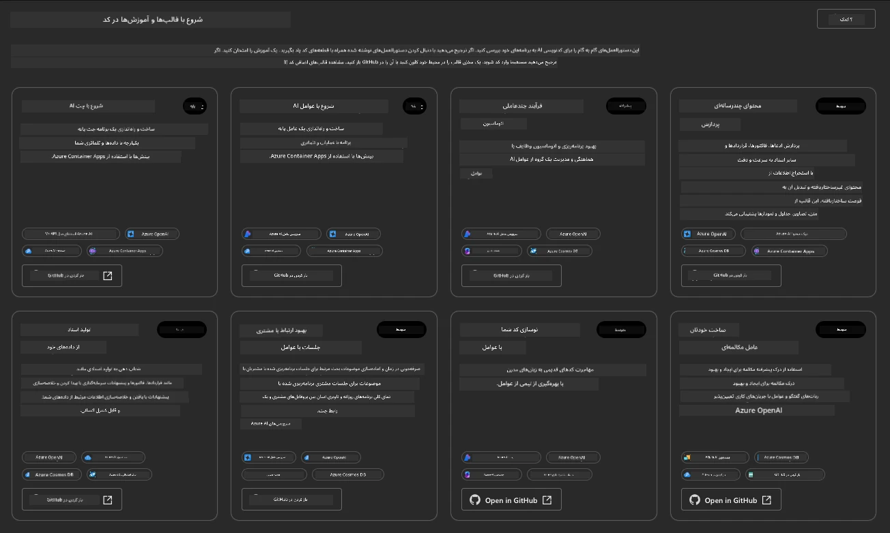

گزینه‌های **Basic** قالب‌های شروع‌کننده شما هستند:

1. [ ] [شروع با چت هوش مصنوعی](https://github.com/Azure-Samples/get-started-with-ai-chat) که یک برنامه چت ساده _با داده‌های شما_ را در Azure Container Apps مستقر می‌کند. از این برای بررسی یک سناریوی چت‌بات هوش مصنوعی ساده استفاده کنید.
1. [X] [شروع با عوامل هوش مصنوعی](https://github.com/Azure-Samples/get-started-with-ai-agents) که همچنین یک عامل هوش مصنوعی استاندارد (با سرویس عامل هوش مصنوعی Azure) را مستقر می‌کند. از این برای آشنایی با راه‌حل‌های هوش مصنوعی عامل‌محور شامل ابزارها و مدل‌ها استفاده کنید.

لینک دوم را در یک تب مرورگر جدید باز کنید (یا برای کارت مرتبط روی `Open in GitHub` کلیک کنید). باید مخزن این قالب AZD را ببینید. یک دقیقه وقت بگذارید و README را بررسی کنید. معماری برنامه به این شکل است:

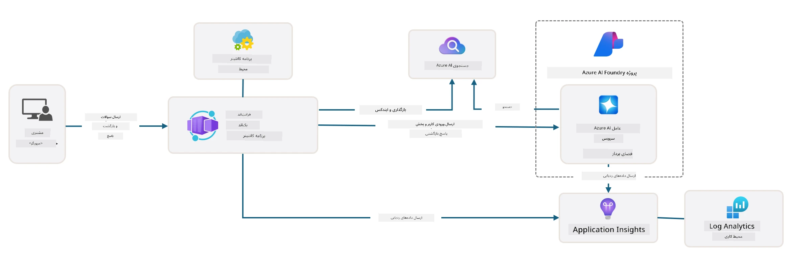

---

## 3. فعال‌سازی قالب

بیایید این قالب را مستقر کنیم و مطمئن شویم که معتبر است. ما دستورالعمل‌های بخش [شروع کار](https://github.com/Azure-Samples/get-started-with-ai-agents?tab=readme-ov-file#getting-started) را دنبال خواهیم کرد.

1. روی [این لینک](https://github.com/codespaces/new/Azure-Samples/get-started-with-ai-agents) کلیک کنید - اقدام پیش‌فرض برای `Create codespace` را تأیید کنید
1. این یک تب مرورگر جدید باز می‌کند - منتظر بمانید تا جلسه GitHub Codespaces بارگذاری شود
1. ترمینال VS Code را در Codespaces باز کنید - فرمان زیر را وارد کنید:

   ```bash title="" linenums="0"
   azd up
   ```

مراحل جریان کاری که این فرمان فعال می‌کند را کامل کنید:

1. از شما خواسته می‌شود وارد Azure شوید - دستورالعمل‌ها را برای احراز هویت دنبال کنید
1. یک نام محیط منحصر به فرد وارد کنید - به عنوان مثال، من از `nitya-mshack-azd` استفاده کردم
1. این یک پوشه `.azure/` ایجاد می‌کند - یک زیرپوشه با نام محیط خواهید دید
1. از شما خواسته می‌شود یک نام اشتراک انتخاب کنید - پیش‌فرض را انتخاب کنید
1. از شما خواسته می‌شود یک مکان انتخاب کنید - از `East US 2` استفاده کنید

اکنون منتظر بمانید تا فرآیند فراهم‌سازی کامل شود. **این 10-15 دقیقه طول می‌کشد**

1. وقتی تمام شد، کنسول شما یک پیام موفقیت مانند این نشان می‌دهد:
      ```bash title="" linenums="0"
      SUCCESS: Your up workflow to provision and deploy to Azure completed in 10 minutes 17 seconds.
      ```
1. پورتال Azure شما اکنون یک گروه منابع فراهم‌شده با نام محیط خواهد داشت:

      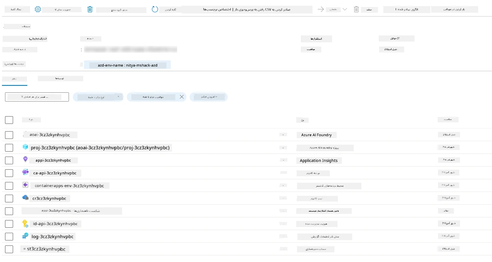

1. **اکنون آماده اعتبارسنجی زیرساخت و برنامه مستقر شده هستید**.

---

## 4. اعتبارسنجی قالب

1. به صفحه [گروه‌های منابع](https://portal.azure.com/#browse/resourcegroups) در پورتال Azure مراجعه کنید - هنگام درخواست وارد شوید
1. روی RG برای نام محیط خود کلیک کنید - صفحه بالا را مشاهده خواهید کرد

      - روی منبع Azure Container Apps کلیک کنید
      - روی URL برنامه در بخش _Essentials_ (بالا سمت راست) کلیک کنید

1. باید یک رابط کاربری جلویی برنامه میزبانی‌شده مانند این را ببینید:

   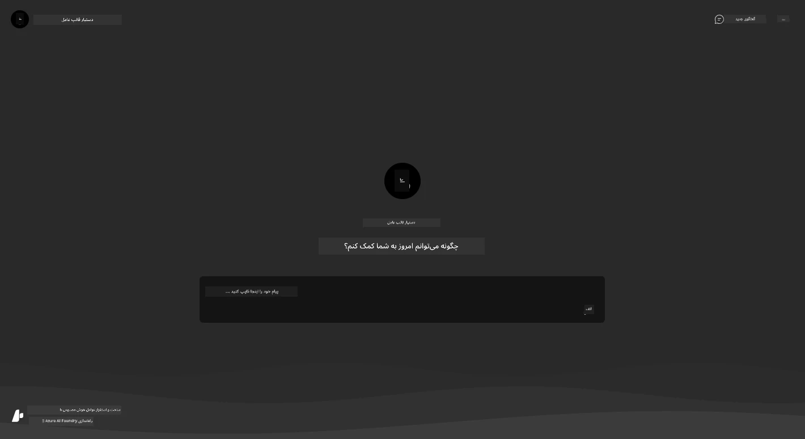

1. چند [سوال نمونه](https://github.com/Azure-Samples/get-started-with-ai-agents/blob/main/docs/sample_questions.md) را امتحان کنید

      1. بپرسید: ```پایتخت فرانسه چیست؟``` 
      1. بپرسید: ```بهترین چادر زیر 200 دلار برای دو نفر چیست و چه ویژگی‌هایی دارد؟```

1. باید پاسخ‌هایی مشابه آنچه در زیر نشان داده شده است دریافت کنید. _اما این چگونه کار می‌کند؟_

      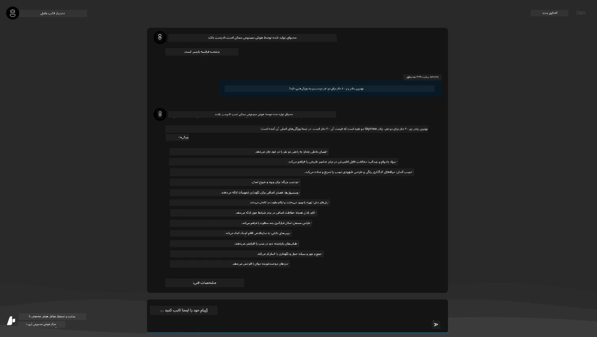

---

## 5. اعتبارسنجی عامل

برنامه Azure Container App یک نقطه پایانی مستقر می‌کند که به عامل هوش مصنوعی فراهم‌شده در پروژه Azure AI Foundry برای این قالب متصل می‌شود. بیایید ببینیم این به چه معناست.

1. به صفحه _Overview_ گروه منابع خود در پورتال Azure بازگردید

1. روی منبع `Azure AI Foundry` در آن لیست کلیک کنید

1. باید این را ببینید. روی دکمه `Go to Azure AI Foundry Portal` کلیک کنید. 
   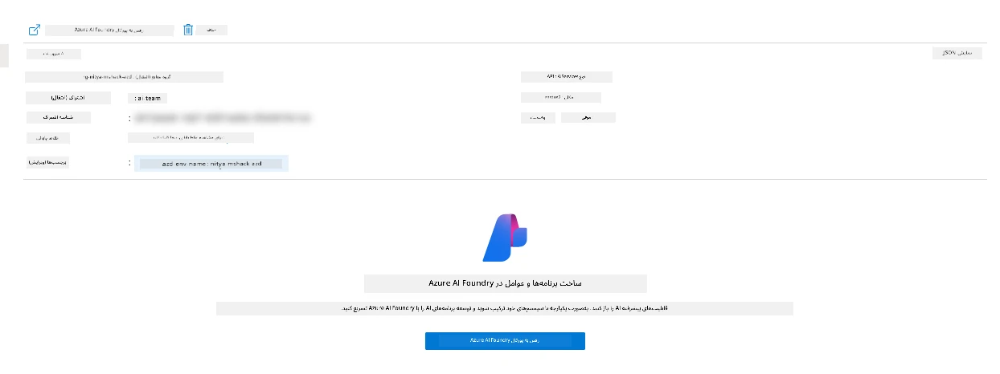

1. باید صفحه پروژه Foundry برای برنامه هوش مصنوعی خود را ببینید
   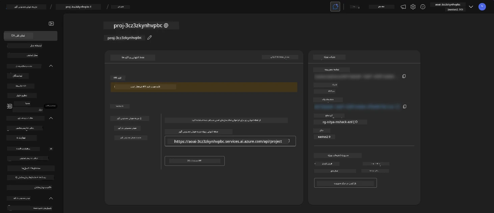

1. روی `Agents` کلیک کنید - عامل پیش‌فرض فراهم‌شده در پروژه خود را مشاهده خواهید کرد
   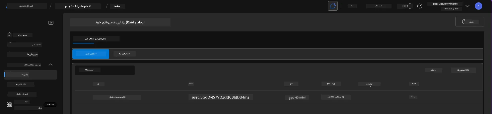

1. آن را انتخاب کنید - و جزئیات عامل را مشاهده خواهید کرد. به موارد زیر توجه کنید:

      - عامل به طور پیش‌فرض از File Search استفاده می‌کند (همیشه)
      - `Knowledge` عامل نشان می‌دهد که 32 فایل آپلود شده است (برای جستجوی فایل)
      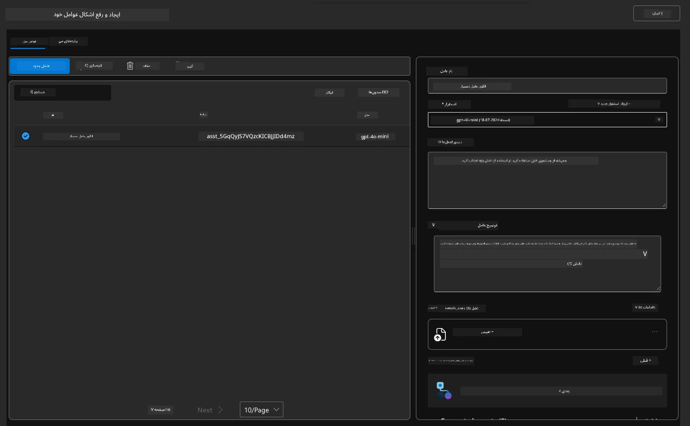

1. گزینه `Data+indexes` را در منوی سمت چپ پیدا کنید و برای جزئیات کلیک کنید. 

      - باید 32 فایل داده آپلود شده برای دانش را ببینید.
      - این‌ها با 12 فایل مشتری و 20 فایل محصول در زیر `src/files` مطابقت خواهند داشت 
      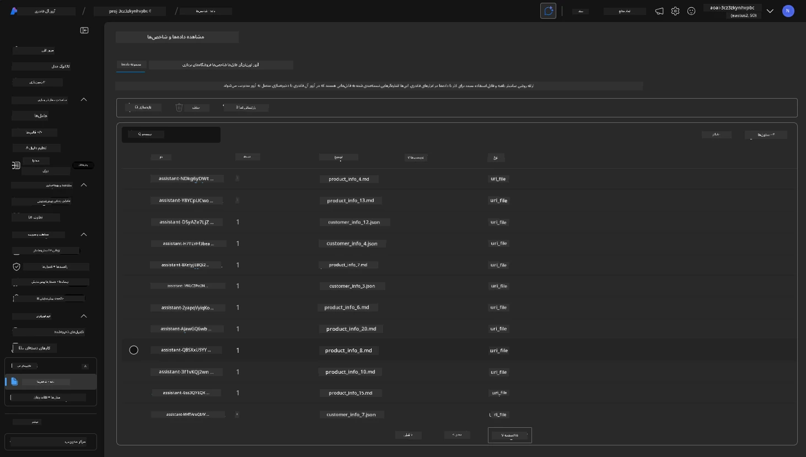

**عملکرد عامل را اعتبارسنجی کردید!**

1. پاسخ‌های عامل بر اساس دانش موجود در آن فایل‌ها است.
1. اکنون می‌توانید سوالاتی مرتبط با آن داده‌ها بپرسید و پاسخ‌های مبتنی بر دانش دریافت کنید.
1. مثال: `customer_info_10.json` سه خرید انجام‌شده توسط "Amanda Perez" را توصیف می‌کند

به تب مرورگر با نقطه پایانی برنامه Container App بازگردید و بپرسید: `Amanda Perez چه محصولاتی دارد؟`. باید چیزی شبیه به این ببینید:

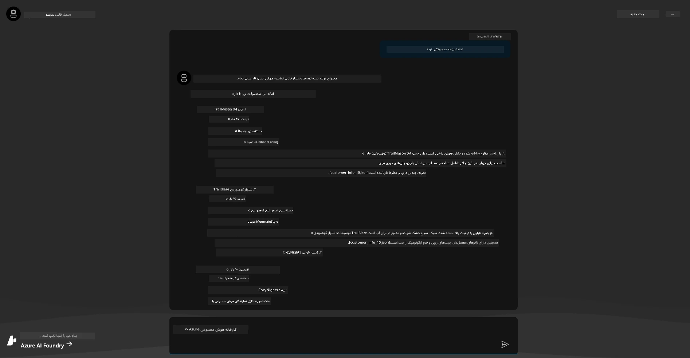

---

## 6. زمین بازی عامل

بیایید کمی بیشتر با قابلیت‌های Azure AI Foundry آشنا شویم، با امتحان کردن عامل در زمین بازی عوامل.

1. به صفحه `Agents` در Azure AI Foundry بازگردید - عامل پیش‌فرض را انتخاب کنید
1. گزینه `Try in Playground` را کلیک کنید - باید یک رابط کاربری زمین بازی مانند این دریافت کنید
1. همان سوال را بپرسید: `Amanda Perez چه محصولاتی دارد؟`

    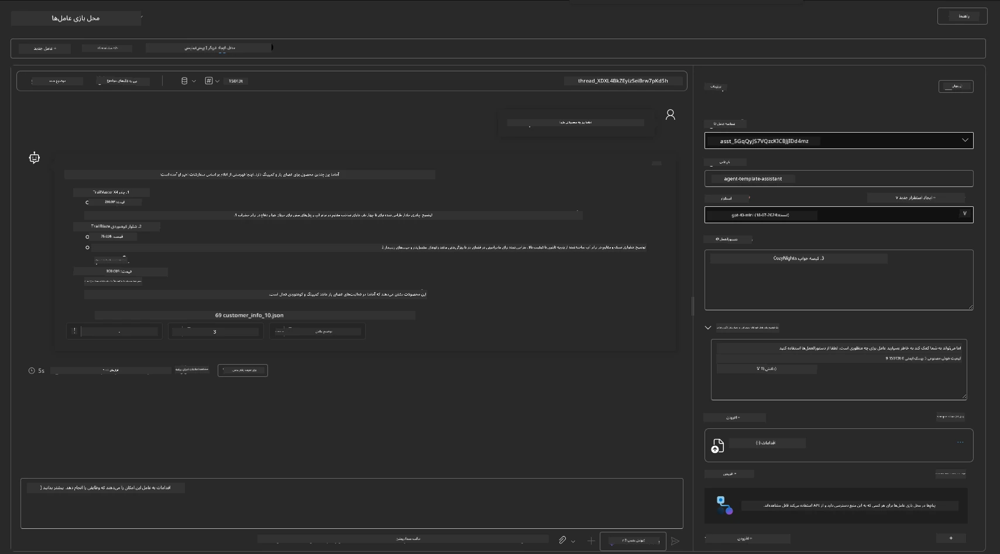

پاسخ مشابه (یا مشابهی) دریافت می‌کنید - اما همچنین اطلاعات اضافی دریافت می‌کنید که می‌توانید برای درک کیفیت، هزینه، و عملکرد برنامه عامل خود استفاده کنید. برای مثال:

1. توجه کنید که پاسخ فایل‌های داده‌ای را که برای "پایه‌گذاری" پاسخ استفاده شده‌اند ذکر می‌کند
1. روی هر یک از برچسب‌های فایل‌ها حرکت کنید - آیا داده‌ها با پرسش شما و پاسخ نمایش داده شده مطابقت دارند؟

همچنین یک ردیف _آمار_ زیر پاسخ مشاهده می‌کنید.

1. روی هر متریک حرکت کنید - به عنوان مثال، Safety. چیزی شبیه به این می‌بینید
1. آیا رتبه‌بندی ارزیابی‌شده با شهود شما برای سطح ایمنی پاسخ مطابقت دارد؟

      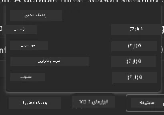

---x

## 7. قابلیت مشاهده داخلی

قابلیت مشاهده به معنای ابزارسازی برنامه شما برای تولید داده‌هایی است که می‌توانند برای درک، اشکال‌زدایی، و بهینه‌سازی عملیات آن استفاده شوند. برای درک این موضوع:

1. دکمه `View Run Info` را کلیک کنید - باید این نما را ببینید. این یک نمونه از [ردیابی عامل](https://learn.microsoft.com/en-us/azure/ai-foundry/how-to/develop/trace-agents-sdk#view-trace-results-in-the-azure-ai-foundry-agents-playground) در عمل است. _شما همچنین می‌توانید این نما را با کلیک بر روی Thread Logs در منوی سطح بالا دریافت کنید_.

   - حس کنید که مراحل اجرا و ابزارهای درگیر شده توسط عامل چیست
   - تعداد کل Token‌ها (در مقابل استفاده از Token‌های خروجی) برای پاسخ را درک کنید
   - تأخیر و جایی که زمان در اجرا صرف می‌شود را درک کنید

      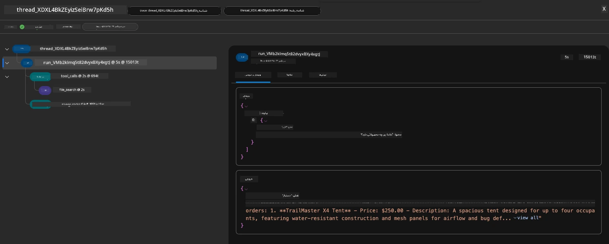

1. روی تب `Metadata` کلیک کنید تا ویژگی‌های اضافی برای اجرا را ببینید که ممکن است برای اشکال‌زدایی مشکلات بعدی مفید باشند.   

      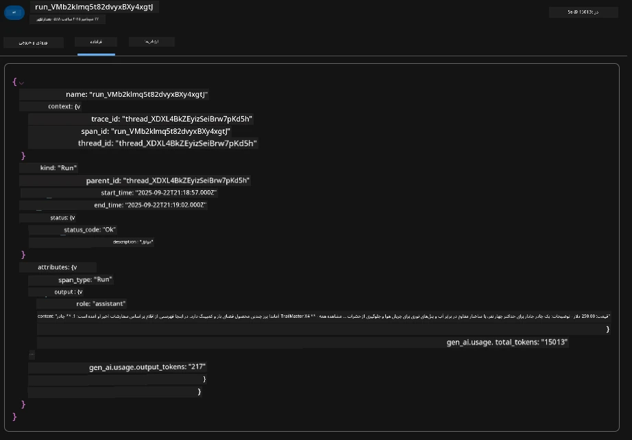

1. روی تب `Evaluations` کلیک کنید تا ارزیابی‌های خودکار انجام‌شده بر روی پاسخ عامل را ببینید. این شامل ارزیابی‌های ایمنی (مانند Self-harm) و ارزیابی‌های خاص عامل (مانند Intent resolution، Task adherence) می‌شود.

      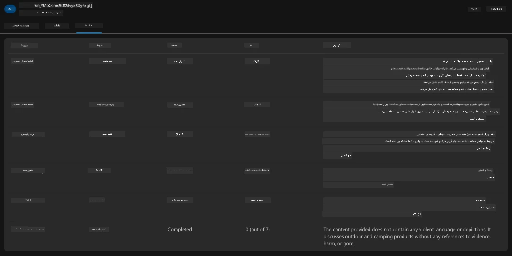

1. در نهایت، روی تب `Monitoring` در منوی کناری کلیک کنید.

      - تب `Resource usage` را در صفحه نمایش داده شده انتخاب کنید - و متریک‌ها را مشاهده کنید.
      - استفاده از برنامه را از نظر هزینه‌ها (Token‌ها) و بار (درخواست‌ها) پیگیری کنید.
      - تأخیر برنامه را تا اولین بایت (پردازش ورودی) و آخرین بایت (خروجی) پیگیری کنید.

      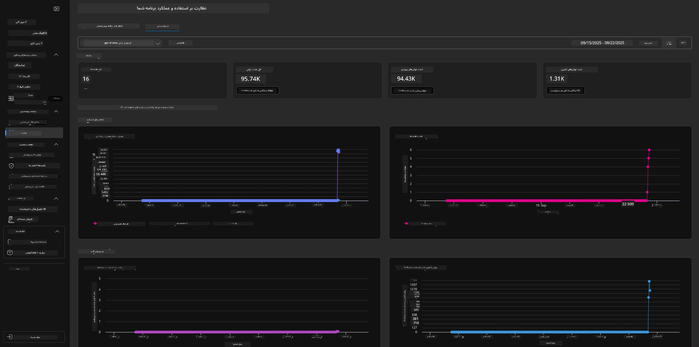

---

## 8. متغیرهای محیطی

تا اینجا، ما استقرار را در مرورگر بررسی کردیم - و اعتبارسنجی کردیم که زیرساخت ما فراهم شده و برنامه عملیاتی است. اما برای کار با برنامه _کد-اول_، باید محیط توسعه محلی خود را با متغیرهای مربوطه مورد نیاز برای کار با این منابع پیکربندی کنیم. استفاده از `azd` این کار را آسان می‌کند.

1. Azure Developer CLI [از متغیرهای محیطی استفاده می‌کند](https://learn.microsoft.com/en-us/azure/developer/azure-developer-cli/manage-environment-variables?tabs=bash) برای ذخیره و مدیریت تنظیمات پیکربندی برای استقرار برنامه‌ها.

1. متغیرهای محیطی در `.azure/<env-name>/.env` ذخیره می‌شوند - این متغیرها را به محیط `env-name` استفاده‌شده در طول استقرار محدود می‌کند و به شما کمک می‌کند محیط‌ها را بین اهداف استقرار مختلف در همان مخزن جدا کنید.

1. متغیرهای محیطی به طور خودکار توسط فرمان `azd` بارگذاری می‌شوند هر زمان که یک فرمان خاص اجرا شود (مانند `azd up`). توجه داشته باشید که `azd` به طور خودکار متغیرهای محیطی _سطح سیستم‌عامل_ (مانند تنظیم‌شده در شل) را نمی‌خواند - در عوض از `azd set env` و `azd get env` برای انتقال اطلاعات در اسکریپت‌ها استفاده کنید.

بیایید چند فرمان را امتحان کنیم:

1. تمام متغیرهای محیطی تنظیم‌شده برای `azd` در این محیط را دریافت کنید:

      ```bash title="" linenums="0"
      azd env get-values
      ```
      
      چیزی شبیه به این خواهید دید:

      ```bash title="" linenums="0"
      AZURE_AI_AGENT_DEPLOYMENT_NAME="gpt-4o-mini"
      AZURE_AI_AGENT_NAME="agent-template-assistant"
      AZURE_AI_EMBED_DEPLOYMENT_NAME="text-embedding-3-small"
      AZURE_AI_EMBED_DIMENSIONS=100
      ...
      ```

1. یک مقدار خاص را دریافت کنید - به عنوان مثال، می‌خواهم بدانم آیا مقدار `AZURE_AI_AGENT_MODEL_NAME` تنظیم شده است

      ```bash title="" linenums="0"
      azd env get-value AZURE_AI_AGENT_MODEL_NAME 
      ```
      
      چیزی شبیه به این خواهید دید - به طور پیش‌فرض تنظیم نشده بود!

      ```bash title="" linenums="0"
      ERROR: key 'AZURE_AI_AGENT_MODEL_NAME' not found in the environment values
      ```

1. یک متغیر محیطی جدید برای `azd` تنظیم کنید. در اینجا، نام مدل عامل را به‌روزرسانی می‌کنیم. _توجه: هر تغییری که انجام شود بلافاصله در فایل `.azure/<env-name>/.env` منعکس خواهد شد.

      ```bash title="" linenums="0"
      azd env set AZURE_AI_AGENT_MODEL_NAME gpt-4.1
      azd env set AZURE_AI_AGENT_MODEL_VERSION 2025-04-14
      azd env set AZURE_AI_AGENT_DEPLOYMENT_CAPACITY 150
      ```

      اکنون باید ببینیم که مقدار تنظیم شده است:

      ```bash title="" linenums="0"
      azd env get-value AZURE_AI_AGENT_MODEL_NAME 
      ```

1. توجه داشته باشید که برخی منابع پایدار هستند (مانند استقرار مدل‌ها) و برای اعمال تغییرات بیشتر از یک `azd up` نیاز دارند. بیایید استقرار اصلی را حذف کنیم و با متغیرهای محیطی تغییر‌یافته دوباره مستقر کنیم.

1. **تازه‌سازی** اگر قبلاً زیرساختی را با استفاده از یک قالب azd مستقر کرده‌اید - می‌توانید _وضعیت_ متغیرهای محیطی محلی خود را بر اساس وضعیت فعلی استقرار Azure خود با استفاده از این فرمان تازه‌سازی کنید:
      ```bash title="" linenums="0"
      azd env refresh
      ```

      این یک روش قدرتمند برای هماهنگ کردن متغیرهای محیطی بین دو یا چند محیط توسعه محلی است (مثلاً تیمی با چندین توسعه‌دهنده) - به طوری که زیرساخت مستقر شده به عنوان منبع اصلی وضعیت متغیرهای محیطی عمل کند. اعضای تیم به سادگی متغیرها را تازه‌سازی می‌کنند تا دوباره هماهنگ شوند.

---

## 9. تبریک می‌گوییم 🏆

شما به تازگی یک جریان کاری کامل را به پایان رساندید که در آن:

- [X] قالب AZD مورد نظر خود را انتخاب کردید
- [X] قالب را با GitHub Codespaces راه‌اندازی کردید
- [X] قالب را مستقر کردید و تأیید کردید که کار می‌کند

---

