# 2. اعتبارسنجی یک قالب

> اعتبارسنجی شده با `azd 1.23.12` در مارس 2026.

!!! tip "تا انتهای این ماژول شما قادر خواهید بود"

    - [ ] تحلیل معماری راه‌حل هوش مصنوعی
    - [ ] درک گردش‌کار استقرار AZD
    - [ ] استفاده از GitHub Copilot برای دریافت کمک در استفاده از AZD
    - [ ] **Lab 2:** استقرار و اعتبارسنجی قالب AI Agents

---


## 1. مقدمه

رابط خط فرمان توسعه‌دهندهٔ Azure ([Azure Developer CLI](https://learn.microsoft.com/en-us/azure/developer/azure-developer-cli/) یا `azd`) یک ابزار خط فرمان متن‌باز است که جریان کاری توسعه‌دهنده را هنگام ساخت و استقرار برنامه‌ها در Azure ساده می‌کند. 

[قالب‌های AZD](https://learn.microsoft.com/azure/developer/azure-developer-cli/azd-templates) مخازن استاندارد شده‌ای هستند که شامل نمونه کد برنامه، دارایی‌های _زیرساخت-به‌عنوان-کد_ و فایل‌های پیکربندی `azd` برای یک معماری راه‌حل منسجم می‌باشند. فراهم‌سازی زیرساخت می‌تواند به سادگی یک دستور `azd provision` باشد - در حالی که استفاده از `azd up` به شما اجازه می‌دهد تا زیرساخت را فراهم کنید **و** برنامه خود را به‌صورت یک‌جا مستقر نمایید!

در نتیجه، شروع سریع فرایند توسعه برنامه شما می‌تواند به سادگی پیدا کردن _قالب شروع‌کننده AZD_ مناسب که نزدیک‌ترین مورد به نیازهای برنامه و زیرساخت شما باشد باشد - سپس سفارشی‌سازی مخزن برای تطبیق با نیازهای سناریوی شما.

قبل از شروع، بیایید مطمئن شویم که Azure Developer CLI را نصب کرده‌اید.

1. یک ترمینال VS Code باز کنید و این دستور را تایپ کنید:

      ```bash title="" linenums="0"
      azd version
      ```

1. شما باید چیزی شبیه به این ببینید!

      ```bash title="" linenums="0"
      azd version 1.23.12 (commit <current-build>)
      ```

**حالا آماده‌اید که یک قالب را با azd انتخاب و استقرار دهید**

---

## 2. انتخاب قالب

پلتفرم Microsoft Foundry مجموعه‌ای از [قالب‌های AZD پیشنهادی](https://learn.microsoft.com/en-us/azure/ai-foundry/how-to/develop/ai-template-get-started) را ارائه می‌دهد که سناریوهای راه‌حل محبوب مانند _اتوماسیون جریان‌کاری چندعاملِ_ و _پردازش محتوای چندوجهی_ را پوشش می‌دهند. شما همچنین می‌توانید این قالب‌ها را از طریق درگاه Microsoft Foundry کشف کنید.

1. به [https://ai.azure.com/templates](https://ai.azure.com/templates) مراجعه کنید
1. هنگام درخواست وارد پورتال Microsoft Foundry شوید - شما چیزی شبیه به این خواهید دید.

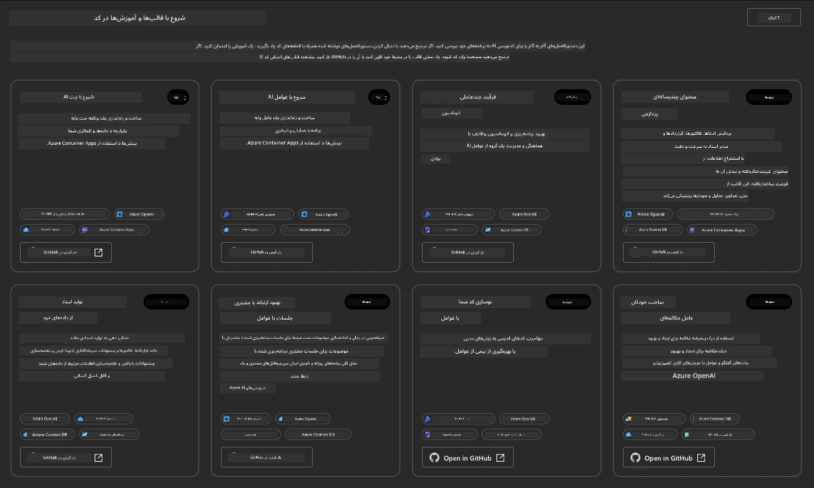


گزینه‌های **Basic** قالب‌های شروع شما هستند:

1. [Get Started with AI Chat](https://github.com/Azure-Samples/get-started-with-ai-chat) که یک برنامه گفتگو پایه را _با داده‌های شما_ در Azure Container Apps مستقر می‌کند. از این برای کاوش یک سناریوی چت‌بات هوش مصنوعی پایه استفاده کنید.
1. [X] [Get Started with AI Agents](https://github.com/Azure-Samples/get-started-with-ai-agents) که همچنین یک Agent استاندارد هوش مصنوعی (با Foundry Agents) را مستقر می‌کند. از این برای آشنایی با راه‌حل‌های عامل‌محور هوش مصنوعی شامل ابزارها و مدل‌ها استفاده کنید.

لینک دوم را در یک تب جدید مرورگر باز کنید (یا روی کارت مربوطه کلیک کنید `Open in GitHub`). شما باید مخزن این قالب AZD را ببینید. یک دقیقه وقت بگذارید و README را بررسی کنید. معماری برنامه به این صورت است:

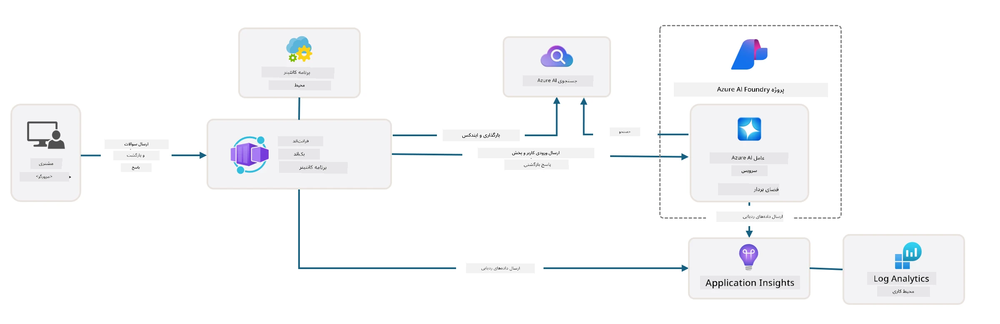

---

## 3. فعال‌سازی قالب

بیایید سعی کنیم این قالب را مستقر کنیم و مطمئن شویم که معتبر است. ما دستورالعمل‌ها را در بخش [Getting Started](https://github.com/Azure-Samples/get-started-with-ai-agents?tab=readme-ov-file#getting-started) دنبال خواهیم کرد.

1. یک محیط کاری برای مخزن قالب انتخاب کنید:

      - **GitHub Codespaces**: روی [this link](https://github.com/codespaces/new/Azure-Samples/get-started-with-ai-agents) کلیک کنید و `Create codespace` را تأیید کنید
      - **Local clone or dev container**: مخزن `Azure-Samples/get-started-with-ai-agents` را کلون کرده و آن را در VS Code باز کنید

1. تا آماده شدن ترمینال VS Code صبر کنید، سپس دستور زیر را تایپ کنید:

   ```bash title="" linenums="0"
   azd up
   ```

مراحل گردش‌کاری که این دستور راه‌اندازی می‌کند را تکمیل کنید:

1. از شما خواسته می‌شود تا وارد Azure شوید - دستورالعمل‌ها را برای احراز هویت دنبال کنید
1. یک نام محیطی منحصر به فرد برای خود وارد کنید - به‌عنوان مثال من از `nitya-mshack-azd` استفاده کردم
1. این یک پوشه `.azure/` ایجاد خواهد کرد - شما یک زیرپوشه با نام محیط را خواهید دید
1. از شما خواسته می‌شود یک نام اشتراک را انتخاب کنید - اشتراک پیش‌فرض را انتخاب کنید
1. از شما برای انتخاب یک مکان درخواست می‌شود - از `East US 2` استفاده کنید

حالا، منتظر بمانید تا فراهم‌سازی کامل شود. **این کار 10-15 دقیقه طول می‌کشد**

1. هنگامی که تمام شد، کنسول شما پیامی مانند SUCCESS را نشان خواهد داد:
      ```bash title="" linenums="0"
      SUCCESS: Your up workflow to provision and deploy to Azure completed in 10 minutes 17 seconds.
      ```
1. پورتال Azure شما اکنون یک گروپ منابع فراهم‌شده با آن نام محیط خواهد داشت:

      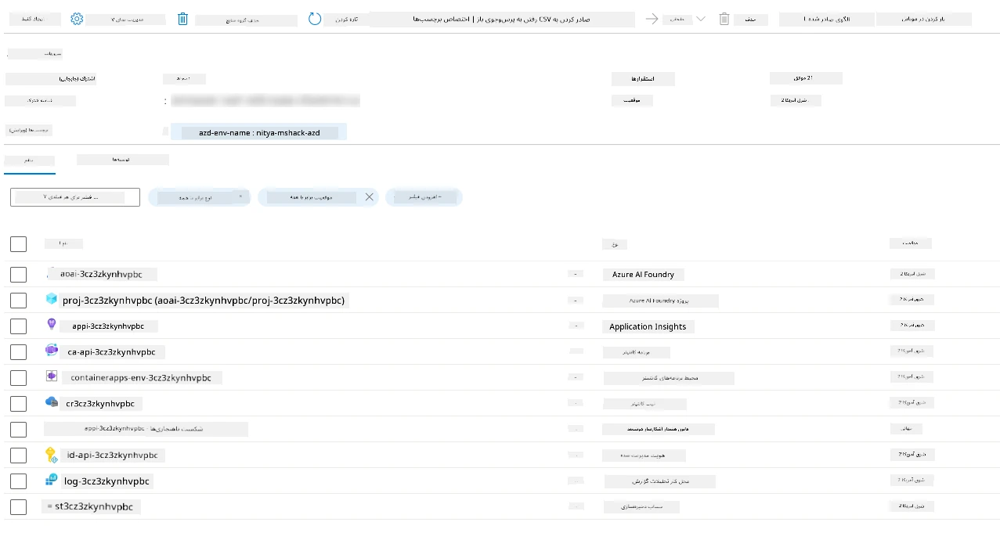

1. **حالا آماده‌اید تا زیرساخت و برنامه مستقر شده را اعتبارسنجی کنید**.

---

## 4. اعتبارسنجی قالب

1. به صفحه گروه‌های منابع Azure Portal ([Resource Groups](https://portal.azure.com/#browse/resourcegroups)) مراجعه کنید - هنگام درخواست وارد شوید
1. روی RG مربوط به نام محیط خود کلیک کنید - صفحه بالا را خواهید دید

      - روی منبع Azure Container Apps کلیک کنید
      - روی Application Url در بخش _Essentials_ (بالا-راست) کلیک کنید

1. باید یک رابط کاربری فرانت‌اند برنامه میزبانی‌شده مانند این ببینید:

   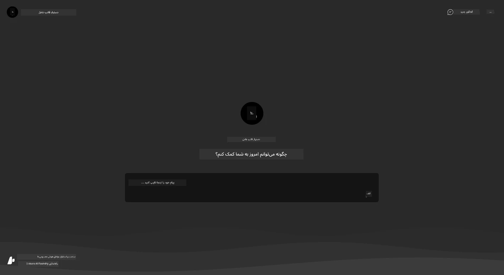

1. سعی کنید چند تا از [سؤالات نمونه](https://github.com/Azure-Samples/get-started-with-ai-agents/blob/main/docs/sample_questions.md) را بپرسید

      1. بپرسید: ```پایتخت فرانسه کجاست؟``` 
      1. بپرسید: ```بهترین چادر زیر $200 برای دو نفر چیست و چه ویژگی‌هایی دارد؟```

1. شما باید پاسخ‌هایی مشابه آنچه در زیر نشان داده شده دریافت کنید. _اما این چگونه کار می‌کند؟_ 

      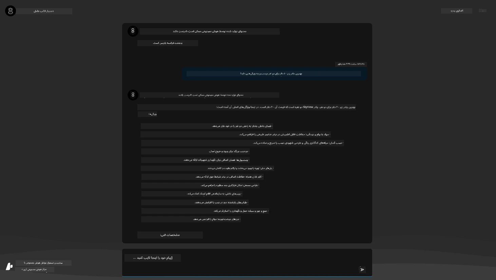

---

## 5. اعتبارسنجی عامل

Azure Container App یک نقطه پایان مستقر می‌کند که به Agent هوش مصنوعی فراهم‌شده در پروژه Microsoft Foundry برای این قالب متصل می‌شود. بیایید ببینیم این به چه معناست.

1. به صفحه _Overview_ گروپ منابع خود در Azure Portal بازگردید

1. روی منبع `Microsoft Foundry` در آن لیست کلیک کنید

1. شما باید این را ببینید. روی دکمه `Go to Microsoft Foundry Portal` کلیک کنید. 
   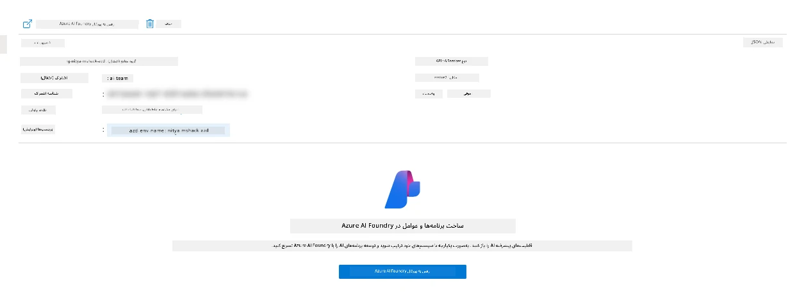

1. باید صفحه پروژه Foundry مربوط به برنامه هوش مصنوعی خود را ببینید
   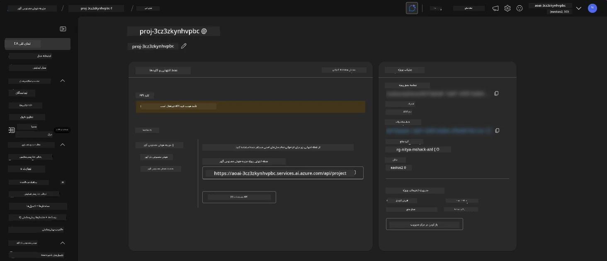

1. روی `Agents` کلیک کنید - عامل پیش‌فرض فراهم‌شده در پروژه خود را می‌بینید
   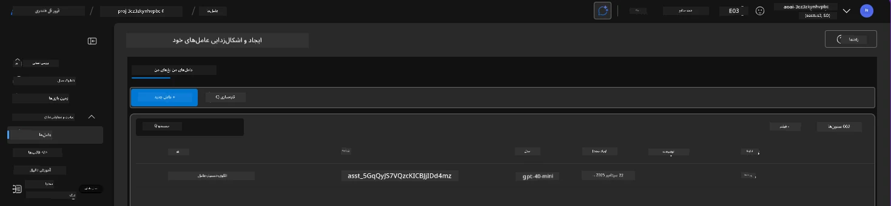

1. آن را انتخاب کنید - و جزئیات عامل را می‌بینید. به موارد زیر توجه کنید:

      - عامل به‌صورت پیش‌فرض از File Search استفاده می‌کند (همیشه)
      - مقدار `Knowledge` عامل نشان می‌دهد که 32 فایل آپلود شده دارد (برای جستجوی فایل)
      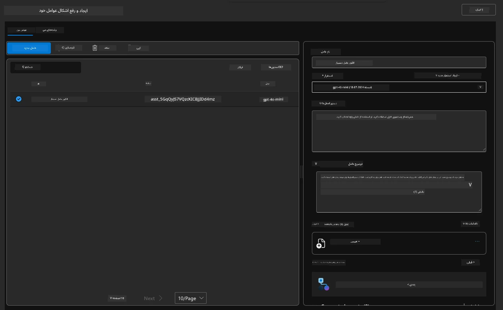

1. در منوی سمت چپ به دنبال گزینه `Data+indexes` بگردید و برای جزئیات کلیک کنید. 

      - باید 32 فایل داده آپلود شده برای دانش را ببینید.
      - این‌ها با 12 فایل مشتری و 20 فایل محصول در زیر `src/files` مطابق خواهند بود
      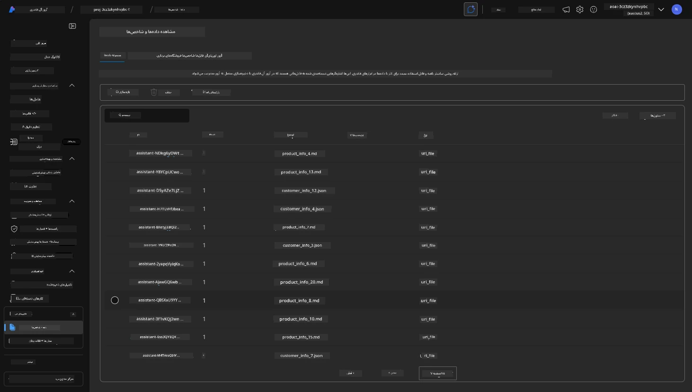

**شما عملکرد عامل را اعتبارسنجی کردید!** 

1. پاسخ‌های عامل بر اساس دانش موجود در آن فایل‌ها پایه‌گذاری شده‌اند. 
1. حالا می‌توانید سؤالات مرتبط با آن داده‌ها بپرسید و پاسخ‌های پایه‌گذاری‌شده دریافت کنید.
1. مثال: `customer_info_10.json` سه خرید انجام‌شده توسط "Amanda Perez" را توصیف می‌کند

به تب مرورگر با نقطه پایان Container App بازگردید و بپرسید: `چه محصولاتی متعلق به Amanda Perez است؟`. شما باید چیزی شبیه به این ببینید:

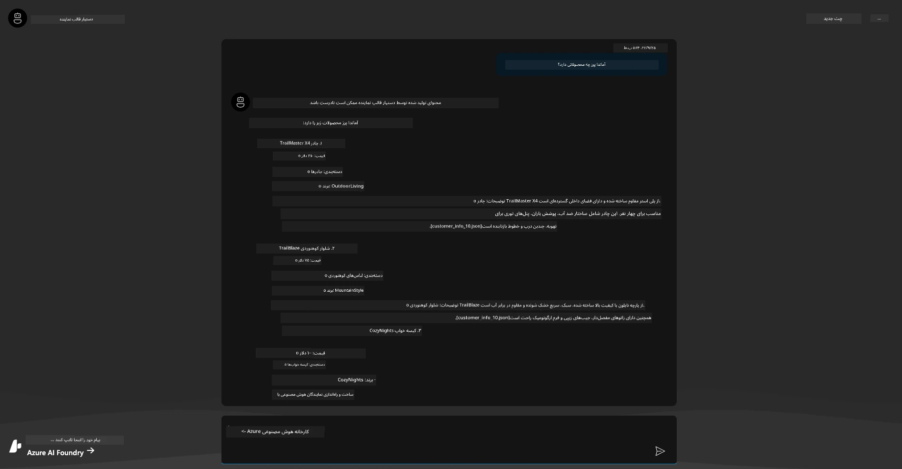

---

## 6. محیط آزمایشی عامل

بیایید با گردش دادن عامل در محیط آزمایشی (Agents Playground) کمی درک بیشتری از قابلیت‌های Microsoft Foundry به‌دست آوریم. 

1. به صفحه `Agents` در Microsoft Foundry بازگردید - عامل پیش‌فرض را انتخاب کنید
1. گزینه `Try in Playground` را کلیک کنید - باید یک رابط Playground مانند این ببینید
1. همان سؤال را بپرسید: `چه محصولاتی متعلق به Amanda Perez است؟`

    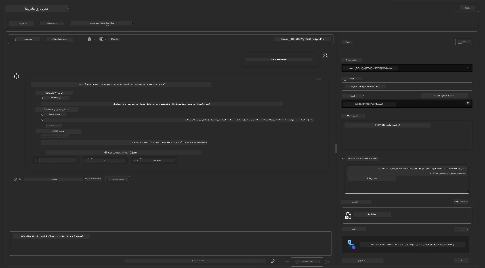

شما همان پاسخ (یا پاسخی مشابه) را دریافت می‌کنید - اما همچنین اطلاعات اضافی را می‌بینید که می‌توانید برای درک کیفیت، هزینه و عملکرد برنامه عامل‌محور خود استفاده کنید. برای مثال:

1. توجه کنید که پاسخ فایل‌های داده‌ای را که برای "پایه‌گذاری" پاسخ استفاده شده‌اند، ذکر می‌کند
1. موس را روی هر کدام از این برچسب‌های فایل ببرید - آیا داده‌ها با پرسش و پاسخ نمایش‌داده‌شده مطابقت دارند؟

همچنین یک ردیف _stats_ درست زیر پاسخ می‌بینید. 

1. موس را روی هر معیار ببرید - مثلاً Safety. شما چیزی شبیه به این خواهید دید
1. آیا رتبه‌بندی ارزیابی‌شده با شهود شما از سطح امنیت پاسخ مطابقت دارد؟

      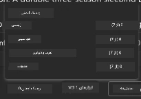

---

## 7. مشاهده‌پذیری داخلی

مشاهده‌پذیری درباره ابزارآلاتی است که برنامه شما را قادر می‌سازد داده‌هایی تولید کند که می‌توانند برای فهم، اشکال‌زدایی و بهینه‌سازی عملیات آن استفاده شوند. برای احساس بهتر این موضوع:

1. دکمه `View Run Info` را کلیک کنید - باید این نما را ببینید. این یک نمونه از [Agent tracing](https://learn.microsoft.com/en-us/azure/ai-foundry/how-to/develop/trace-agents-sdk#view-trace-results-in-the-azure-ai-foundry-agents-playground) در عمل است. _شما همچنین می‌توانید با کلیک روی Thread Logs در منوی سطح بالا به این نما دسترسی پیدا کنید_.

   - نگاهی کلی به مراحل اجرا و ابزارهایی که عامل درگیر کرده بیندازید
   - تعداد کل توکن‌ها را درک کنید (در مقابل استفاده از توکن‌های خروجی) برای پاسخ
   - تأخیر و جایی که زمان در اجرا صرف می‌شود را درک کنید

      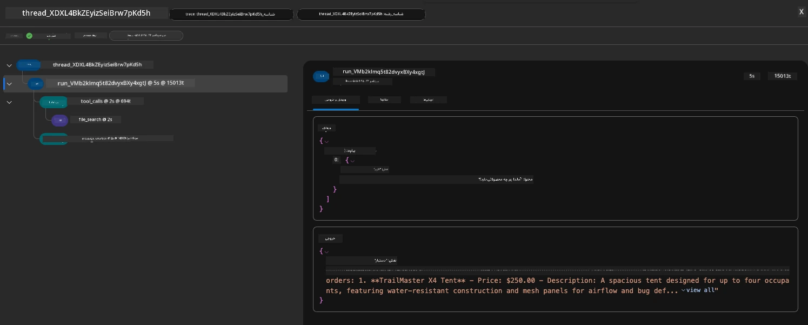

1. تب `Metadata` را کلیک کنید تا ویژگی‌های اضافی برای اجرا را ببینید که ممکن است برای اشکال‌زدایی بعدی مفید باشند.   

      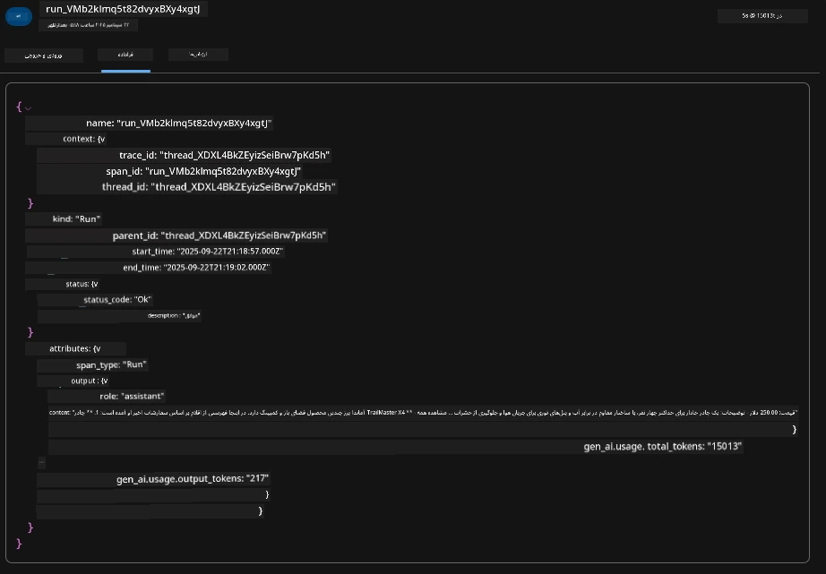


1. تب `Evaluations` را کلیک کنید تا ارزیابی‌های خودکار انجام‌شده روی پاسخ عامل را ببینید. این‌ها شامل ارزیابی‌های ایمنی (مثلاً خودآسیب‌رسانی) و ارزیابی‌های خاص عامل (مثلاً حل نیت، رعایت وظیفه) می‌شوند.

      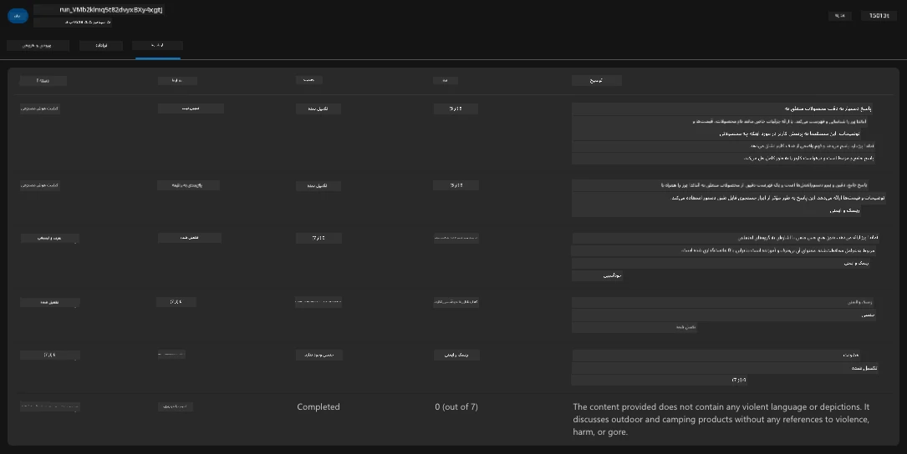

1. در نهایت، تب `Monitoring` را در منوی کناری کلیک کنید.

      - در صفحه نمایش‌داده‌شده تب `Resource usage` را انتخاب کنید - و متریک‌ها را مشاهده کنید.
      - استفاده از برنامه را از نظر هزینه‌ها (توکن‌ها) و بار (درخواست‌ها) دنبال کنید.
      - تأخیر برنامه را تا اولین بایت (پردازش ورودی) و آخرین بایت (خروجی) دنبال کنید.

      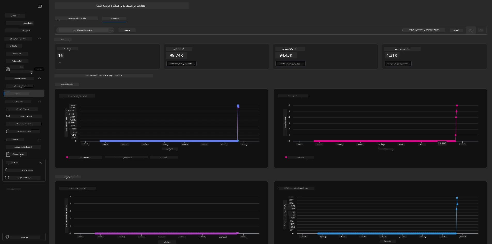

---

## 8. متغیرهای محیطی

تا اینجا، ما از طریق استقرار در مرورگر حرکت کردیم - و اعتبارسنجی کردیم که زیرساخت فراهم شده و برنامه عملیاتی است. اما برای کار کردن با کد برنامه از روش _کد-اول_، نیاز داریم محیط توسعه محلی خود را با متغیرهای مرتبط مورد نیاز برای کار با این منابع پیکربندی کنیم. استفاده از `azd` این کار را ساده می‌کند.

1. Azure Developer CLI از [متغیرهای محیطی](https://learn.microsoft.com/en-us/azure/developer/azure-developer-cli/manage-environment-variables?tabs=bash) برای ذخیره و مدیریت تنظیمات پیکربندی برای استقرارهای برنامه استفاده می‌کند.

1. متغیرهای محیطی در `.azure/<env-name>/.env` ذخیره می‌شوند - این آن‌ها را به محیط `env-name` که در طول استقرار استفاده شده محدود می‌کند و به شما کمک می‌کند محیط‌ها را بین اهداف استقرار مختلف در همان مخزن جدا کنید.

1. متغیرهای محیطی به‌طور خودکار توسط فرمان `azd` هر زمان که یک دستور مشخص اجرا شود (مثلاً `azd up`) بارگذاری می‌شوند. توجه داشته باشید که `azd` متغیرهای محیطی سطح OS را به‌طور خودکار نمی‌خواند (مثلاً تنظیم‌شده در شل) - در عوض از `azd set env` و `azd get env` برای انتقال اطلاعات در اسکریپت‌ها استفاده کنید.


بیایید چند دستور را امتحان کنیم:

1. همه متغیرهای محیطی تنظیم‌شده برای `azd` در این محیط را بگیرید:

      ```bash title="" linenums="0"
      azd env get-values
      ```
      
      شما چیزی شبیه به این می‌بینید:

      ```bash title="" linenums="0"
      AZURE_AI_AGENT_DEPLOYMENT_NAME="gpt-4.1-mini"
      AZURE_AI_AGENT_NAME="agent-template-assistant"
      AZURE_AI_EMBED_DEPLOYMENT_NAME="text-embedding-3-small"
      AZURE_AI_EMBED_DIMENSIONS=100
      ...
      ```

1. یک مقدار مشخص را بگیرید - مثلاً من می‌خواهم بدانم آیا مقدار `AZURE_AI_AGENT_MODEL_NAME` تنظیم شده است

      ```bash title="" linenums="0"
      azd env get-value AZURE_AI_AGENT_MODEL_NAME 
      ```
      
      شما چیزی شبیه به این می‌بینید - این مقدار به‌صورت پیش‌فرض تنظیم نشده بود!

      ```bash title="" linenums="0"
      ERROR: key 'AZURE_AI_AGENT_MODEL_NAME' not found in the environment values
      ```

1. یک متغیر محیطی جدید برای `azd` تنظیم کنید. در اینجا، نام مدل عامل را به‌روزرسانی می‌کنیم. _توجه: هر تغییری که انجام شود فوراً در فایل `.azure/<env-name>/.env` منعکس خواهد شد._

      ```bash title="" linenums="0"
      azd env set AZURE_AI_AGENT_MODEL_NAME gpt-4.1
      azd env set AZURE_AI_AGENT_MODEL_VERSION 2025-04-14
      azd env set AZURE_AI_AGENT_DEPLOYMENT_CAPACITY 150
      ```

      اکنون باید مقدار تنظیم شده را پیدا کنیم:

      ```bash title="" linenums="0"
      azd env get-value AZURE_AI_AGENT_MODEL_NAME 
      ```

1. توجه داشته باشید که برخی منابع ماندگار هستند (مثلاً استقرارهای مدل) و نیاز به بیش از فقط یک `azd up` برای مجبور کردن استقرار مجدد خواهند داشت. بیایید تلاش کنیم استقرار اولیه را خاموش کنیم و با متغیرهای محیطی تغییر یافته دوباره مستقر کنیم.

1. **Refresh** اگر قبلاً زیرساخت را با استفاده از یک قالب azd مستقر کرده‌اید - می‌توانید وضعیت متغیرهای محیطی محلی خود را بر اساس وضعیت فعلی استقرار Azure خود با استفاده از این دستور _رفرش_ کنید:

      ```bash title="" linenums="0"
      azd env refresh
      ```

      این یک روش قدرتمند برای _همگام‌سازی_ متغیرهای محیطی بین دو یا چند محیط توسعه محلی (به‌عنوان مثال، تیمی با چند توسعه‌دهنده) است - اجازه می‌دهد زیرساخت مستقر به‌عنوان حقیقت مبنایی برای وضعیت متغیرهای محیطی عمل کند. اعضای تیم به سادگی متغیرها را _تازه‌سازی_ می‌کنند تا دوباره همگام شوند.

---

## 9. تبریک 🏆

شما همین‌اکنون یک گردش کار انتها-به-انتها را تکمیل کرده‌اید که در آن:

- [X] قالب AZD را که می‌خواهید استفاده کنید انتخاب کردید
- [X] قالب را در یک محیط توسعه پشتیبانی‌شده باز کردید
- [X] قالب را مستقر کرده و تأیید کردید که کار می‌کند

---

<!-- CO-OP TRANSLATOR DISCLAIMER START -->
**سلب مسئولیت**:
این سند با استفاده از سرویس ترجمهٔ هوش مصنوعی [Co-op Translator](https://github.com/Azure/co-op-translator) ترجمه شده است. در حالی که ما در تلاش برای فراهم کردن دقت هستیم، لطفاً توجه داشته باشید که ترجمه‌های خودکار ممکن است حاوی خطاها یا نادرستی‌هایی باشند. نسخهٔ اصلی سند به زبان اصلی آن باید به‌عنوان منبع معتبر در نظر گرفته شود. برای اطلاعات مهم یا حیاتی، ترجمهٔ حرفه‌ای انسانی توصیه می‌شود. ما در قبال هرگونه سوءتفاهم یا تفسیر نادرستی که از استفاده از این ترجمه ناشی شود، مسئولیتی نداریم.
<!-- CO-OP TRANSLATOR DISCLAIMER END -->