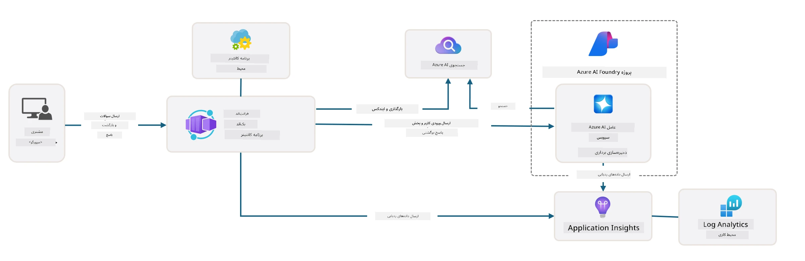

# 3. تجزیه‌ی یک قالب

!!! tip "در پایان این ماژول شما قادر خواهید بود"

    - [ ] GitHub Copilot را با سرورهای MCP برای پشتیبانی Azure فعال کنید
    - [ ] ساختار پوشه‌های قالب AZD و اجزای آن را درک کنید
    - [ ] الگوهای سازمان‌دهی زیرساخت به‌عنوان‌کد (Bicep) را بررسی کنید
    - [ ] **Lab 3:** از GitHub Copilot برای کاوش و درک معماری مخزن استفاده کنید

---


با قالب‌های AZD و Azure Developer CLI (`azd`) می‌توانیم به‌سرعت سفر توسعهٔ هوش مصنوعی خود را با مخازن استانداردشده‌ای آغاز کنیم که کد نمونه، فایل‌های زیرساخت و پیکربندی را در قالب یک پروژهٔ _پروژهٔ آماده‌برای‌استقرار_ ارائه می‌دهند.

**اما اکنون باید ساختار پروژه و کد پایه را بفهمیم — و بتوانیم قالب AZD را بدون هیچ تجربه یا دانش قبلی از AZD سفارشی‌سازی کنیم!**

---

## 1. فعال‌سازی GitHub Copilot

### 1.1 نصب GitHub Copilot Chat

زمان آن رسیده که [GitHub Copilot with Agent Mode](https://code.visualstudio.com/docs/copilot/chat/chat-agent-mode) را بررسی کنیم. اکنون می‌توانیم با زبان طبیعی وظیفهٔ خود را در سطح بالا شرح دهیم و در اجرای آن کمک بگیریم. برای این آزمایشگاه، از [Copilot Free plan](https://github.com/github-copilot/signup) استفاده خواهیم کرد که دارای محدودیت ماهیانه برای تکمیل‌ها و تعاملات چت است.

افزونه را می‌توان از مارکت‌پِلیس نصب کرد، اما باید در محیط Codespaces شما از قبل در دسترس باشد. _از منوی کشویی آیکون Copilot روی `Open Chat` کلیک کنید — و یک درخواست مثل `What can you do?` تایپ کنید_ - ممکن است از شما خواسته شود وارد شوید. **GitHub Copilot Chat آماده است**.

### 1.2. نصب سرورهای MCP

برای اینکه حالت Agent مؤثر باشد، نیاز دارد به ابزارهای مناسب برای بازیابی دانش یا انجام اقدامات دسترسی داشته باشد. اینجاست که سرورهای MCP می‌توانند کمک کنند. ما سرورهای زیر را پیکربندی خواهیم کرد:

1. [Azure MCP Server](../../../../../workshop/docs/instructions)
1. [Microsoft Docs MCP Server](../../../../../workshop/docs/instructions)

برای فعال‌سازی این‌ها:

1. یک فایل به نام `.vscode/mcp.json` ایجاد کنید اگر وجود ندارد
1. موارد زیر را در آن فایل کپی کنید — و سرورها را شروع کنید!
   ```json title=".vscode/mcp.json"
   {
      "servers": {
         "Azure MCP Server": {
            "command": "npx",
            "args": [
            "-y",
            "@azure/mcp@latest",
            "server",
            "start"
            ]
         },
         "microsoft.docs.mcp": {
            "type": "http",
            "url": "https://learn.microsoft.com/api/mcp"
         }
      }
   }
   ```

??? warning "ممکن است خطایی دریافت کنید که `npx` نصب نیست (برای راه‌حل کلیک کنید)"

      برای رفع این مشکل، فایل `.devcontainer/devcontainer.json` را باز کنید و این خط را به بخش features اضافه کنید. سپس کانتینر را rebuild کنید. اکنون باید `npx` نصب باشد.

      ```title="" linenums="0"
         "features": {
            "ghcr.io/devcontainers/features/node:1": {},
            ...
         },
      ```

---

### 1.3. آزمایش GitHub Copilot Chat

**ابتدا از `az login` برای احراز هویت با Azure از خط فرمان VS Code استفاده کنید.**

اکنون باید قادر باشید وضعیت اشتراک Azure خود را پرس‌وجو کنید و سوالاتی دربارهٔ منابع مستقر شده یا پیکربندی بپرسید. این پرامپت‌ها را امتحان کنید:

1. `List my Azure resource groups`
1. `#foundry list my current deployments`

همچنین می‌توانید سوالاتی دربارهٔ مستندات Azure بپرسید و پاسخ‌هایی دریافت کنید که بر مبنای سرور Microsoft Docs MCP پایه‌گذاری شده‌اند. این پرامپت‌ها را امتحان کنید:

1. `#microsoft_docs_search What is Azure Developer CLI?`
1. `#microsoft_docs_search Show me a Python tutorial to chat with deployed model`

یا می‌توانید درخواست قطعات کد برای انجام یک وظیفه کنید. این پرامپت را امتحان کنید.

1. `Give me a Python code example that uses AAD for an interactive chat client`

در حالت `Ask`، این کد را فراهم می‌کند تا بتوانید کپی-پیست کرده و امتحان کنید. در حالت `Agent`، ممکن است یک قدم جلوتر رفته و منابع مرتبط را برای شما ایجاد کند — از جمله اسکریپت‌های راه‌اندازی و مستندات — تا به شما در اجرای آن وظیفه کمک کند.

**اکنون مجهز شده‌اید تا کاوش در مخزن قالب را آغاز کنید**

---

## 2. تجزیه‌ی معماری

??? prompt "پرسش: معماری برنامه در docs/images/architecture.png را در یک پاراگراف توضیح دهید"

      این برنامه یک اپلیکیشن چت مجهز به هوش مصنوعی است که بر بستر Azure ساخته شده و معماری مدرن مبتنی بر عامل (agent-based) را نشان می‌دهد. راه‌حل حول محور یک Azure Container App می‌چرخد که کد اصلی برنامه را میزبانی می‌کند و ورودی کاربر را پردازش کرده و از طریق یک عامل هوش مصنوعی پاسخ‌های هوشمند تولید می‌کند.
      
      معماری از Microsoft Foundry Project به‌عنوان بنیاد قابلیت‌های هوش مصنوعی بهره می‌برد و به سرویس‌های Azure AI متصل می‌شود که مدل‌های زبانی پایه (مانند GPT-4o-mini) و قابلیت‌های عامل را فراهم می‌کنند. تعاملات کاربران از یک رابط کاربری مبتنی بر React به بک‌اند FastAPI جریان می‌یابند که با سرویس عامل هوش مصنوعی برای تولید پاسخ‌های متنی زمینه‌ای ارتباط برقرار می‌کند.
      
      سیستم قابلیت‌های بازیابی دانش را از طریق جستجوی فایل یا سرویس Azure AI Search فراهم می‌کند و به عامل اجازه می‌دهد به اطلاعات بارگذاری‌شده دسترسی یابد و آنها را ارجاع دهد. برای تعالی عملیاتی، معماری شامل مانیتورینگ جامع از طریق Application Insights و Log Analytics Workspace برای ردیابی، لاگ‌گیری و بهینه‌سازی عملکرد است.
      
      Azure Storage فضای blob برای دادهٔ برنامه و بارگذاری فایل‌ها را فراهم می‌کند، در حالی که Managed Identity دسترسی امن بین منابع Azure را بدون ذخیره کردن اعتبارنامه‌ها تضمین می‌کند. کل راه‌حل برای مقیاس‌پذیری و قابل نگهداری طراحی شده است، به‌طوری که برنامهٔ کانتینری شده به‌طور خودکار بر اساس تقاضا مقیاس می‌یابد و در عین حال امنیت، مانیتورینگ و قابلیت‌های CI/CD را از طریق اکوسیستم سرویس‌های مدیریت‌شده Azure ارائه می‌دهد.



---

## 3. ساختار مخزن

!!! prompt "پرسش: ساختار پوشه‌های قالب را توضیح دهید. با یک نمودار سلسله‌مراتبی تصویری شروع کنید."

??? info "پاسخ: نمودار سلسله‌مراتبی تصویری"

      ```bash title="" 
      get-started-with-ai-agents/
      ├── 📋 پیکربندی و راه‌اندازی
      │   ├── azure.yaml                    # پیکربندی Azure Developer CLI
      │   ├── docker-compose.yaml           # کانتینرهای توسعه محلی
      │   ├── pyproject.toml                # پیکربندی پروژهٔ Python
      │   ├── requirements-dev.txt          # وابستگی‌های توسعه
      │   └── .devcontainer/                # تنظیمات dev container برای VS Code
      │
      ├── 🏗️ زیرساخت (infra/)
      │   ├── main.bicep                    # قالب اصلی زیرساخت
      │   ├── api.bicep                     # منابع مخصوص API
      │   ├── main.parameters.json          # پارامترهای زیرساخت
      │   └── core/                         # اجزای مدولار زیرساخت
      │       ├── ai/                       # پیکربندی سرویس‌های هوش مصنوعی
      │       ├── host/                     # زیرساخت میزبانی
      │       ├── monitor/                  # مانیتورینگ و لاگ‌گذاری
      │       ├── search/                   # راه‌اندازی Azure AI Search
      │       ├── security/                 # امنیت و هویت
      │       └── storage/                  # پیکربندی حساب‌های ذخیره‌سازی
      │
      ├── 💻 کد منبع برنامه (src/)
      │   ├── api/                          # بک‌اند API
      │   │   ├── main.py                   # ورودی برنامه FastAPI
      │   │   ├── routes.py                 # تعریف مسیرهای API
      │   │   ├── search_index_manager.py   # عملکردهای جستجو
      │   │   ├── data/                     # مدیریت دادهٔ API
      │   │   ├── static/                   # دارایی‌های وب ایستا
      │   │   └── templates/                # قالب‌های HTML
      │   ├── frontend/                     # فرانت‌اند React/TypeScript
      │   │   ├── package.json              # وابستگی‌های Node.js
      │   │   ├── vite.config.ts            # پیکربندی ساخت Vite
      │   │   └── src/                      # کد منبع فرانت‌اند
      │   ├── data/                         # فایل‌های دادهٔ نمونه
      │   │   └── embeddings.csv            # بردارهای جاسازی‌شدهٔ ازپیش‌محاسبه‌شده
      │   ├── files/                        # فایل‌های پایگاه دانش
      │   │   ├── customer_info_*.json      # نمونه‌های دادهٔ مشتری
      │   │   └── product_info_*.md         # مستندات محصول
      │   ├── Dockerfile                    # پیکربندی کانتینر
      │   └── requirements.txt              # وابستگی‌های Python
      │
      ├── 🔧 اتوماسیون و اسکریپت‌ها (scripts/)
      │   ├── postdeploy.sh/.ps1           # تنظیمات پس از استقرار
      │   ├── setup_credential.sh/.ps1     # پیکربندی اعتبارنامه
      │   ├── validate_env_vars.sh/.ps1    # اعتبارسنجی متغیرهای محیطی
      │   └── resolve_model_quota.sh/.ps1  # مدیریت سهمیهٔ مدل
      │
      ├── 🧪 تست و ارزیابی
      │   ├── tests/                        # تست‌های واحد و یکپارچه
      │   │   └── test_search_index_manager.py
      │   ├── evals/                        # چارچوب ارزیابی عامل
      │   │   ├── evaluate.py               # رانر ارزیابی
      │   │   ├── eval-queries.json         # پرسش‌های آزمون
      │   │   └── eval-action-data-path.json
      │   ├── sandbox/                      # محیط بازیابی و آزمایش توسعه
      │   │   ├── 1-quickstart.py           # مثال‌های شروع سریع
      │   │   └── aad-interactive-chat.py   # مثال‌های احراز هویت
      │   └── airedteaming/                 # ارزیابی ایمنی هوش مصنوعی
      │       └── ai_redteaming.py          # تست‌های تیم قرمز
      │
      ├── 📚 مستندسازی (docs/)
      │   ├── deployment.md                 # راهنمای استقرار
      │   ├── local_development.md          # دستورالعمل‌های راه‌اندازی محلی
      │   ├── troubleshooting.md            # مشکلات رایج و راه‌حل‌ها
      │   ├── azure_account_setup.md        # پیش‌نیازهای Azure
      │   └── images/                       # دارایی‌های مستندات
      │
      └── 📄 متادیتای پروژه
         ├── README.md                     # نمای کلی پروژه
         ├── CODE_OF_CONDUCT.md           # دستورالعمل‌های جامعه
         ├── CONTRIBUTING.md              # راهنمای مشارکت
         ├── LICENSE                      # شرایط مجوز
         └── next-steps.md                # راهنمایی‌های پس از استقرار
      ```

### 3.1. معماری هستهٔ برنامه

این قالب از الگوی یک **برنامهٔ وب فول‌استک** پیروی می‌کند با:

- **Backend**: بک‌اند Python FastAPI با یکپارچه‌سازی Azure AI
- **Frontend**: TypeScript/React با سیستم ساخت Vite
- **Infrastructure**: قالب‌های Azure Bicep برای منابع ابری
- **Containerization**: Docker برای استقرار یکپارچه

### 3.2 زیرساخت به‌عنوان‌کد (bicep)

لایهٔ زیرساخت از قالب‌های **Azure Bicep** استفاده می‌کند که به‌صورت مدولار سازمان‌دهی شده‌اند:

   - **`main.bicep`**: هماهنگ‌کنندهٔ همهٔ منابع Azure
   - **`core/` modules**: اجزای قابل‌استفادهٔ مجدد برای خدمات مختلف
      - سرویس‌های هوش مصنوعی (Azure OpenAI, AI Search)
      - میزبانی کانتینری (Azure Container Apps)
      - مانیتورینگ (Application Insights، Log Analytics)
      - امنیت (Key Vault، Managed Identity)

### 3.3 کد منبع برنامه (`src/`)

**بک‌اند API (`src/api/`)**:

- API مبتنی بر FastAPI
- یکپارچه‌سازی با Foundry Agents
- مدیریت ایندکس جستجو برای بازیابی دانش
- قابلیت‌های بارگذاری و پردازش فایل

**فرانت‌اند (`src/frontend/`)**:

- SPA مدرن React/TypeScript
- Vite برای توسعهٔ سریع و ساخت‌های بهینه‌شده
- رابط چت برای تعامل با عامل

**پایگاه دانش (`src/files/`)**:

- نمونه‌های دادهٔ مشتری و محصول
- نمونه‌ای از بازیابی دانش مبتنی بر فایل
- مثال‌هایی در قالب JSON و Markdown


### 3.4 DevOps و اتوماسیون

**اسکریپت‌ها (`scripts/`)**:

- اسکریپت‌های چندسکویی PowerShell و Bash
- اعتبارسنجی و تنظیم محیط
- پیکربندی پس از استقرار
- مدیریت سهمیهٔ مدل

**یکپارچه‌سازی Azure Developer CLI**:

- پیکربندی `azure.yaml` برای گردش‌کارهای `azd`
- تهیه و استقرار خودکار
- مدیریت متغیرهای محیطی

### 3.5 تست و تضمین کیفیت

**چارچوب ارزیابی (`evals/`)**:

- ارزیابی عملکرد عامل
- آزمون کیفیت پاسخ‌به‌پرسش
- خط لولهٔ ارزیابی خودکار

**ایمنی هوش مصنوعی (`airedteaming/`)**:

- تست تیم قرمز برای ایمنی هوش مصنوعی
- اسکن آسیب‌پذیری‌های امنیتی
- رویه‌های مسئولانهٔ هوش مصنوعی

---

## 4. تبریک 🏆

شما با موفقیت از GitHub Copilot Chat با سرورهای MCP برای کاوش مخزن استفاده کردید.

- [X] GitHub Copilot را برای Azure فعال کردید
- [X] معماری برنامه را درک کردید
- [X] ساختار قالب AZD را بررسی کردید

این به شما دیدی از دارایی‌های _زیرساخت به‌عنوان‌کد_ برای این قالب می‌دهد. در ادامه، پروندهٔ پیکربندی برای AZD را بررسی خواهیم کرد.

---

<!-- CO-OP TRANSLATOR DISCLAIMER START -->
سلب مسئولیت:
این سند با استفاده از سرویس ترجمهٔ هوش مصنوعی Co-op Translator (https://github.com/Azure/co-op-translator) ترجمه شده است. در حالی که ما در تلاش برای دقت هستیم، لطفاً توجه داشته باشید که ترجمه‌های خودکار ممکن است حاوی خطاها یا نادرستی‌هایی باشند. نسخهٔ اصلی سند به زبان مبدأ باید به‌عنوان منبع معتبر در نظر گرفته شود. برای اطلاعات حیاتی، ترجمهٔ حرفه‌ای توسط انسان توصیه می‌شود. ما در قبال هرگونه سوءتفاهم یا تفسیر نادرستی که از استفاده از این ترجمه ناشی شود، مسئولیتی نداریم.
<!-- CO-OP TRANSLATOR DISCLAIMER END -->