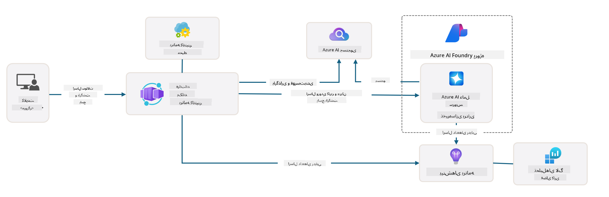

<!--
CO_OP_TRANSLATOR_METADATA:
{
  "original_hash": "4e403f041411361140d6beb88ab2a181",
  "translation_date": "2025-09-24T10:56:00+00:00",
  "source_file": "workshop/docs/instructions/3-Deconstruct-AI-Template.md",
  "language_code": "fa"
}
-->
# 3. تجزیه یک قالب

!!! tip "در پایان این ماژول شما قادر خواهید بود"

- [ ] آیتم
- [ ] آیتم
- [ ] آیتم
- [ ] **آزمایش ۳:** 

---

با استفاده از قالب‌های AZD و Azure Developer CLI (`azd`) می‌توانیم به سرعت سفر توسعه هوش مصنوعی خود را با مخازن استاندارد که کد نمونه، زیرساخت و فایل‌های پیکربندی را ارائه می‌دهند - به شکل یک پروژه آماده برای استقرار - آغاز کنیم.

**اما اکنون، باید ساختار پروژه و کد را درک کنیم - و بتوانیم قالب AZD را بدون هیچ تجربه یا دانش قبلی از AZD سفارشی کنیم!**

---

## 1. فعال کردن GitHub Copilot

### 1.1 نصب GitHub Copilot Chat

زمان آن رسیده است که [GitHub Copilot با حالت Agent](https://code.visualstudio.com/docs/copilot/chat/chat-agent-mode) را بررسی کنیم. اکنون می‌توانیم با استفاده از زبان طبیعی وظیفه خود را در سطح بالا توصیف کنیم و در اجرای آن کمک بگیریم. برای این آزمایش، از [طرح رایگان Copilot](https://github.com/github-copilot/signup) استفاده خواهیم کرد که محدودیت ماهانه برای تکمیل‌ها و تعاملات چت دارد.

این افزونه را می‌توان از بازار نصب کرد، اما باید در محیط Codespaces شما در دسترس باشد. _از منوی کشویی آیکون Copilot روی `Open Chat` کلیک کنید - و یک درخواست مانند `What can you do?` تایپ کنید_ - ممکن است از شما خواسته شود وارد شوید. **GitHub Copilot Chat آماده است.**

### 1.2. نصب MCP Servers

برای اینکه حالت Agent مؤثر باشد، نیاز به دسترسی به ابزارهای مناسب دارد تا به آن کمک کند دانش را بازیابی کند یا اقدامات انجام دهد. اینجاست که MCP servers می‌توانند کمک کنند. ما سرورهای زیر را پیکربندی خواهیم کرد:

1. [Azure MCP Server](../../../../../workshop/docs/instructions)
1. [Microsoft Docs MCP Server](../../../../../workshop/docs/instructions)

برای فعال کردن این‌ها:

1. اگر فایل `.vscode/mcp.json` وجود ندارد، آن را ایجاد کنید
1. محتوای زیر را در آن فایل کپی کنید - و سرورها را راه‌اندازی کنید!
   ```json title=".vscode/mcp.json"
   {
      "servers": {
         "Azure MCP Server": {
            "command": "npx",
            "args": [
            "-y",
            "@azure/mcp@latest",
            "server",
            "start"
            ]
         },
         "microsoft.docs.mcp": {
            "type": "http",
            "url": "https://learn.microsoft.com/api/mcp"
         }
      }
   }
   ```

??? warning "ممکن است خطایی دریافت کنید که `npx` نصب نشده است (برای رفع کلیک کنید)"

      برای رفع این مشکل، فایل `.devcontainer/devcontainer.json` را باز کنید و این خط را به بخش ویژگی‌ها اضافه کنید. سپس کانتینر را بازسازی کنید. اکنون باید `npx` نصب شده باشد.

      ```title="" linenums="0"
         "features": {
            "ghcr.io/devcontainers/features/node:1": {},
            ...
         },
      ```

---

### 1.3. آزمایش GitHub Copilot Chat

**ابتدا از `az login` برای احراز هویت با Azure از خط فرمان VS Code استفاده کنید.**

اکنون باید بتوانید وضعیت اشتراک Azure خود را پرس و جو کنید و سوالاتی درباره منابع یا پیکربندی‌های مستقر بپرسید. این درخواست‌ها را امتحان کنید:

1. `List my Azure resource groups`
1. `#foundry list my current deployments`

همچنین می‌توانید سوالاتی درباره مستندات Azure بپرسید و پاسخ‌هایی مبتنی بر سرور Microsoft Docs MCP دریافت کنید. این درخواست‌ها را امتحان کنید:

1. `#microsoft_docs_search What is Azure Developer CLI?`
1. `#microsoft_docs_search Show me a Python tutorial to chat with deployed model`

یا می‌توانید درخواست کد برای انجام یک وظیفه کنید. این درخواست را امتحان کنید:

1. `Give me a Python code example that uses AAD for an interactive chat client`

در حالت `Ask`، این کد را ارائه می‌دهد که می‌توانید کپی کنید و امتحان کنید. در حالت `Agent`، ممکن است یک قدم جلوتر برود و منابع مربوطه را برای شما ایجاد کند - از جمله اسکریپت‌های راه‌اندازی و مستندات - تا به شما در اجرای آن وظیفه کمک کند.

**اکنون آماده هستید تا مخزن قالب را بررسی کنید**

---

## 2. تجزیه معماری

??? prompt "ASK: معماری برنامه در docs/images/architecture.png را در یک پاراگراف توضیح دهید"

      این برنامه یک برنامه چت مبتنی بر هوش مصنوعی است که بر روی Azure ساخته شده و معماری مدرن مبتنی بر عامل را نشان می‌دهد. این راه‌حل حول یک Azure Container App متمرکز است که کد اصلی برنامه را میزبانی می‌کند، که ورودی کاربر را پردازش کرده و پاسخ‌های هوشمند را از طریق یک عامل هوش مصنوعی تولید می‌کند.
      
      معماری از پروژه Azure AI Foundry به عنوان پایه‌ای برای قابلیت‌های هوش مصنوعی استفاده می‌کند و به خدمات Azure AI که مدل‌های زبان زیرین (مانند GPT-4o-mini) و قابلیت‌های عامل را ارائه می‌دهند، متصل می‌شود. تعاملات کاربر از طریق یک رابط کاربری مبتنی بر React به یک بک‌اند FastAPI جریان می‌یابد که با سرویس عامل هوش مصنوعی برای تولید پاسخ‌های متنی ارتباط برقرار می‌کند.
      
      سیستم قابلیت‌های بازیابی دانش را از طریق جستجوی فایل یا سرویس جستجوی Azure AI شامل می‌کند، که به عامل اجازه می‌دهد اطلاعات را از اسناد آپلود شده دسترسی و استناد کند. برای برتری عملیاتی، معماری شامل نظارت جامع از طریق Application Insights و Log Analytics Workspace برای ردیابی، ثبت و بهینه‌سازی عملکرد است.
      
      Azure Storage ذخیره‌سازی blob را برای داده‌های برنامه و آپلود فایل‌ها فراهم می‌کند، در حالی که Managed Identity دسترسی امن بین منابع Azure را بدون ذخیره اعتبارنامه‌ها تضمین می‌کند. کل راه‌حل برای مقیاس‌پذیری و نگهداری طراحی شده است، با برنامه کانتینری که به طور خودکار بر اساس تقاضا مقیاس می‌شود و امنیت، نظارت و قابلیت‌های CI/CD داخلی را از طریق اکوسیستم خدمات مدیریت شده Azure ارائه می‌دهد.



---

## 3. ساختار مخزن

!!! prompt "ASK: ساختار پوشه قالب را توضیح دهید. با یک نمودار سلسله مراتبی بصری شروع کنید."

??? info "ANSWER: نمودار سلسله مراتبی بصری"

      ```bash title="" 
      get-started-with-ai-agents/
      ├── 📋 پیکربندی و راه‌اندازی
      │   ├── azure.yaml                    # پیکربندی Azure Developer CLI
      │   ├── docker-compose.yaml           # کانتینرهای توسعه محلی
      │   ├── pyproject.toml                # پیکربندی پروژه پایتون
      │   ├── requirements-dev.txt          # وابستگی‌های توسعه
      │   └── .devcontainer/                # تنظیم کانتینر توسعه VS Code
      │
      ├── 🏗️ زیرساخت (infra/)
      │   ├── main.bicep                    # قالب اصلی زیرساخت
      │   ├── api.bicep                     # منابع خاص API
      │   ├── main.parameters.json          # پارامترهای زیرساخت
      │   └── core/                         # اجزای زیرساخت ماژولار
      │       ├── ai/                       # پیکربندی خدمات هوش مصنوعی
      │       ├── host/                     # زیرساخت میزبانی
      │       ├── monitor/                  # نظارت و ثبت
      │       ├── search/                   # تنظیم جستجوی Azure AI
      │       ├── security/                 # امنیت و هویت
      │       └── storage/                  # پیکربندی حساب ذخیره‌سازی
      │
      ├── 💻 منبع برنامه (src/)
      │   ├── api/                          # API بک‌اند
      │   │   ├── main.py                   # ورودی برنامه FastAPI
      │   │   ├── routes.py                 # تعریف مسیرهای API
      │   │   ├── search_index_manager.py   # قابلیت جستجو
      │   │   ├── data/                     # مدیریت داده API
      │   │   ├── static/                   # دارایی‌های وب استاتیک
      │   │   └── templates/                # قالب‌های HTML
      │   ├── frontend/                     # فرانت‌اند React/TypeScript
      │   │   ├── package.json              # وابستگی‌های Node.js
      │   │   ├── vite.config.ts            # پیکربندی ساخت Vite
      │   │   └── src/                      # کد منبع فرانت‌اند
      │   ├── data/                         # فایل‌های داده نمونه
      │   │   └── embeddings.csv            # جاسازی‌های پیش‌محاسبه شده
      │   ├── files/                        # فایل‌های پایگاه دانش
      │   │   ├── customer_info_*.json      # نمونه داده‌های مشتری
      │   │   └── product_info_*.md         # مستندات محصول
      │   ├── Dockerfile                    # پیکربندی کانتینر
      │   └── requirements.txt              # وابستگی‌های پایتون
      │
      ├── 🔧 اتوماسیون و اسکریپت‌ها (scripts/)
      │   ├── postdeploy.sh/.ps1           # تنظیمات پس از استقرار
      │   ├── setup_credential.sh/.ps1     # پیکربندی اعتبارنامه
      │   ├── validate_env_vars.sh/.ps1    # اعتبارسنجی محیط
      │   └── resolve_model_quota.sh/.ps1  # مدیریت سهمیه مدل
      │
      ├── 🧪 آزمایش و ارزیابی
      │   ├── tests/                        # آزمایش‌های واحد و یکپارچه
      │   │   └── test_search_index_manager.py
      │   ├── evals/                        # چارچوب ارزیابی عامل
      │   │   ├── evaluate.py               # اجراکننده ارزیابی
      │   │   ├── eval-queries.json         # درخواست‌های آزمایشی
      │   │   └── eval-action-data-path.json
      │   ├── sandbox/                      # زمین بازی توسعه
      │   │   ├── 1-quickstart.py           # مثال‌های شروع سریع
      │   │   └── aad-interactive-chat.py   # مثال‌های احراز هویت
      │   └── airedteaming/                 # ارزیابی ایمنی هوش مصنوعی
      │       └── ai_redteaming.py          # آزمایش تیم قرمز
      │
      ├── 📚 مستندات (docs/)
      │   ├── deployment.md                 # راهنمای استقرار
      │   ├── local_development.md          # دستورالعمل‌های تنظیم محلی
      │   ├── troubleshooting.md            # مشکلات رایج و رفع آن‌ها
      │   ├── azure_account_setup.md        # پیش‌نیازهای Azure
      │   └── images/                       # دارایی‌های مستندات
      │
      └── 📄 متادیتای پروژه
         ├── README.md                     # نمای کلی پروژه
         ├── CODE_OF_CONDUCT.md           # دستورالعمل‌های جامعه
         ├── CONTRIBUTING.md              # راهنمای مشارکت
         ├── LICENSE                      # شرایط مجوز
         └── next-steps.md                # راهنمای پس از استقرار
      ```

### 3.1. معماری اصلی برنامه

این قالب از الگوی **برنامه وب فول‌استک** پیروی می‌کند با:

- **بک‌اند**: FastAPI پایتون با ادغام Azure AI
- **فرانت‌اند**: TypeScript/React با سیستم ساخت Vite
- **زیرساخت**: قالب‌های Azure Bicep برای منابع ابری
- **کانتینری‌سازی**: Docker برای استقرار سازگار

### 3.2 زیرساخت به عنوان کد (bicep)

لایه زیرساخت از قالب‌های **Azure Bicep** به صورت ماژولار استفاده می‌کند:

   - **`main.bicep`**: هماهنگی همه منابع Azure
   - **ماژول‌های `core/`**: اجزای قابل استفاده مجدد برای خدمات مختلف
      - خدمات هوش مصنوعی (Azure OpenAI، AI Search)
      - میزبانی کانتینر (Azure Container Apps)
      - نظارت (Application Insights، Log Analytics)
      - امنیت (Key Vault، Managed Identity)

### 3.3 منبع برنامه (`src/`)

**API بک‌اند (`src/api/`)**:

- API REST مبتنی بر FastAPI
- ادغام سرویس عامل Azure AI
- مدیریت شاخص جستجو برای بازیابی دانش
- قابلیت‌های آپلود و پردازش فایل

**فرانت‌اند (`src/frontend/`)**:

- SPA مدرن React/TypeScript
- Vite برای توسعه سریع و ساخت‌های بهینه
- رابط چت برای تعاملات عامل

**پایگاه دانش (`src/files/`)**:

- داده‌های نمونه مشتری و محصول
- نشان دادن بازیابی دانش مبتنی بر فایل
- مثال‌های فرمت JSON و Markdown

### 3.4 DevOps و اتوماسیون

**اسکریپت‌ها (`scripts/`)**:

- اسکریپت‌های PowerShell و Bash چندپلتفرمی
- اعتبارسنجی و تنظیم محیط
- پیکربندی پس از استقرار
- مدیریت سهمیه مدل

**ادغام Azure Developer CLI**:

- پیکربندی `azure.yaml` برای گردش‌های کاری `azd`
- تهیه و استقرار خودکار
- مدیریت متغیرهای محیطی

### 3.5 آزمایش و تضمین کیفیت

**چارچوب ارزیابی (`evals/`)**:

- ارزیابی عملکرد عامل
- آزمایش کیفیت پرسش و پاسخ
- خط لوله ارزیابی خودکار

**ایمنی هوش مصنوعی (`airedteaming/`)**:

- آزمایش تیم قرمز برای ایمنی هوش مصنوعی
- اسکن آسیب‌پذیری امنیتی
- شیوه‌های مسئولانه هوش مصنوعی

---

## 4. تبریک 🏆

شما با موفقیت از GitHub Copilot Chat با MCP servers استفاده کردید تا مخزن را بررسی کنید.

- [X] GitHub Copilot برای Azure فعال شد
- [X] معماری برنامه درک شد
- [X] ساختار قالب AZD بررسی شد

این به شما حس دارایی‌های _زیرساخت به عنوان کد_ برای این قالب را می‌دهد. در مرحله بعد، فایل پیکربندی AZD را بررسی خواهیم کرد.

---

