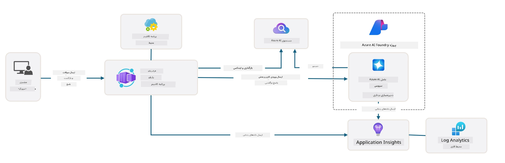

# 3. Deconstruct a Template

!!! tip "تا پایان این ماژول شما قادر خواهید بود"

    - [ ] Activate GitHub Copilot with MCP servers for Azure assistance
    - [ ] Understand the AZD template folder structure and components
    - [ ] Explore infrastructure-as-code (Bicep) organization patterns
    - [ ] **Lab 3:** Use GitHub Copilot to explore and understand repository architecture 

---


With AZD templates and the Azure Developer CLI (`azd`) we can quickly jumpstart our AI development journey with standardized repositories that provide sample code, infrastructure and configuration files - in the form of a ready-to-deploy _starter_ project.

**But now, we need to understand the project structure and codebase - and be able to customize the AZD template - without any prior experience or understanding of AZD!**

---

## 1. Activate GitHub Copilot

### 1.1 Install GitHub Copilot Chat

It's time to explore [GitHub Copilot with Agent Mode](https://code.visualstudio.com/docs/copilot/chat/chat-agent-mode). Now, we can use natural language to describe our task at a high level, and get assistance in execution. For this lab, we'll use the [Copilot Free plan](https://github.com/github-copilot/signup) which has a monthly limit for completions and chat interactions.

The extension can be installed from the marketplace, but should already be available in your Codespaces environment. _Click `Open Chat` from the Copilot icon drop-down - and type a prompt like `What can you do?`_ - you may be prompted to log in. **GitHub Copilot Chat is ready**.

### 1.2. Install MCP Servers

For Agent mode to be effective, it needs access to the right tools to help it retrieve knowledge or take actions. This is where MCP servers can help. We'll configure the following servers:

1. [Azure MCP Server](../../../../../workshop/docs/instructions)
1. [Microsoft Docs MCP Server](../../../../../workshop/docs/instructions)

To activate these:

1. Create a file called `.vscode/mcp.json` if it does not exist
1. Copy the following into that file - and start the servers!
   ```json title=".vscode/mcp.json"
   {
      "servers": {
         "Azure MCP Server": {
            "command": "npx",
            "args": [
            "-y",
            "@azure/mcp@latest",
            "server",
            "start"
            ]
         },
         "microsoft.docs.mcp": {
            "type": "http",
            "url": "https://learn.microsoft.com/api/mcp"
         }
      }
   }
   ```

??? warning "ممکن است خطایی دریافت کنید مبنی بر اینکه `npx` نصب نیست (برای رفع کلیک کنید تا باز شود)"

      برای رفع این مشکل، فایل `.devcontainer/devcontainer.json` را باز کرده و این خط را به بخش features اضافه کنید. سپس کانتینر را مجددا بسازید. اکنون باید `npx` نصب شده باشد.

      ```title="" linenums="0"
         "features": {
            "ghcr.io/devcontainers/features/node:1": {},
            ...
         },
      ```

---

### 1.3. Test GitHub Copilot Chat

**First use `az login` to authenticate with Azure from VS Code command line.**

You should now be able to query your Azure subscription status, and ask questions about deployed resources or configuration. Try these prompts:

1. `List my Azure resource groups`
1. `#foundry list my current deployments`

You can also ask questions about Azure documentation and get responses grounded in the Microsoft Docs MCP server. Try these prompts:

1. `#microsoft_docs_search What is Azure Developer CLI?`
1. `#microsoft_docs_search Show me a Python tutorial to chat with deployed model`

Or you can ask for code snippets to complete a task. Try this prompt.

1. `Give me a Python code example that uses AAD for an interactive chat client`

In `Ask` mode, this will provide code that you can copy-paste and try out. In `Agent` mode, this might go a step further and create the relevant resources for you - including setup scripts and documentation - to help you execute that task.

**You are now equipped to start exploring the template repository**

---

## 2. Deconstruct Architecture

??? prompt "ASK: Explain the application architecture in docs/images/architecture.png in 1 paragraph"

      این برنامه یک اپلیکیشن چت مجهز به هوش مصنوعی است که بر بستر Azure ساخته شده و معماری مدرن مبتنی بر عامل (agent-based) را نمایش می‌دهد. راه‌حل حول یک Azure Container App می‌چرخد که کد اصلی برنامه را میزبانی می‌کند، ورودی کاربر را پردازش می‌کند و از طریق یک عامل هوش مصنوعی پاسخ‌های هوشمند تولید می‌کند. 
      
      معماری از Microsoft Foundry Project به عنوان پایه قابلیت‌های AI بهره می‌برد و به سرویس‌های Azure AI متصل می‌شود که مدل‌های زبان پایه (مانند gpt-4.1-mini) و عملکردهای عاملی را فراهم می‌کنند. تعاملات کاربر از یک رابط کاربری مبتنی بر React به یک بک‌اند FastAPI جریان می‌یابد که با سرویس عامل AI برای تولید پاسخ‌های متنی مرتبط ارتباط برقرار می‌کند. 
      
      سیستم قابلیت‌های بازیابی دانش را از طریق جستجوی فایل یا سرویس Azure AI Search ترکیب می‌کند، که به عامل اجازه می‌دهد به اسناد بارگذاری‌شده دسترسی پیدا کند و از آن‌ها استناد کند. برای تعالی عملیاتی، معماری شامل نظارت جامع از طریق Application Insights و Log Analytics Workspace برای ردیابی، لاگ‌گیری و بهینه‌سازی عملکرد است. 
      
      Azure Storage ذخیره‌سازی blob را برای داده‌های برنامه و بارگذاری فایل‌ها فراهم می‌کند، در حالی که Managed Identity دسترسی امن بین منابع Azure را بدون ذخیره کردن اعتبارنامه تضمین می‌کند. کل راه‌حل برای مقیاس‌پذیری و قابل نگهداری بودن طراحی شده است، به‌طوری که برنامه کانتینری‌شده به‌طور خودکار بر اساس تقاضا مقیاس می‌پذیرد در حالی که امنیت، نظارت و قابلیت‌های CI/CD را از طریق اکوسیستم سرویس‌های مدیریت‌شده Azure فراهم می‌کند.



---

## 3. Repository Structure

!!! prompt "ASK: Explain the template folder structure. Start with a visual hierarchical diagram."

??? info "ANSWER: Visual Hierarchical Diagram"

      ```bash title="" 
      get-started-with-ai-agents/
      ├── 📋 Configuration & Setup
      │   ├── azure.yaml                    # Azure Developer CLI configuration
      │   ├── docker-compose.yaml           # Local development containers
      │   ├── pyproject.toml                # Python project configuration
      │   ├── requirements-dev.txt          # Development dependencies
      │   └── .devcontainer/                # VS Code dev container setup
      │
      ├── 🏗️ Infrastructure (infra/)
      │   ├── main.bicep                    # Main infrastructure template
      │   ├── api.bicep                     # API-specific resources
      │   ├── main.parameters.json          # Infrastructure parameters
      │   └── core/                         # Modular infrastructure components
      │       ├── ai/                       # AI service configurations
      │       ├── host/                     # Hosting infrastructure
      │       ├── monitor/                  # Monitoring and logging
      │       ├── search/                   # Azure AI Search setup
      │       ├── security/                 # Security and identity
      │       └── storage/                  # Storage account configs
      │
      ├── 💻 Application Source (src/)
      │   ├── api/                          # Backend API
      │   │   ├── main.py                   # FastAPI application entry
      │   │   ├── routes.py                 # API route definitions
      │   │   ├── search_index_manager.py   # Search functionality
      │   │   ├── data/                     # API data handling
      │   │   ├── static/                   # Static web assets
      │   │   └── templates/                # HTML templates
      │   ├── frontend/                     # React/TypeScript frontend
      │   │   ├── package.json              # Node.js dependencies
      │   │   ├── vite.config.ts            # Vite build configuration
      │   │   └── src/                      # Frontend source code
      │   ├── data/                         # Sample data files
      │   │   └── embeddings.csv            # Pre-computed embeddings
      │   ├── files/                        # Knowledge base files
      │   │   ├── customer_info_*.json      # Customer data samples
      │   │   └── product_info_*.md         # Product documentation
      │   ├── Dockerfile                    # Container configuration
      │   └── requirements.txt              # Python dependencies
      │
      ├── 🔧 Automation & Scripts (scripts/)
      │   ├── postdeploy.sh/.ps1           # Post-deployment setup
      │   ├── setup_credential.sh/.ps1     # Credential configuration
      │   ├── validate_env_vars.sh/.ps1    # Environment validation
      │   └── resolve_model_quota.sh/.ps1  # Model quota management
      │
      ├── 🧪 Testing & Evaluation
      │   ├── tests/                        # Unit and integration tests
      │   │   └── test_search_index_manager.py
      │   ├── evals/                        # Agent evaluation framework
      │   │   ├── evaluate.py               # Evaluation runner
      │   │   ├── eval-queries.json         # Test queries
      │   │   └── eval-action-data-path.json
      │   ├── sandbox/                      # Development playground
      │   │   ├── 1-quickstart.py           # Getting started examples
      │   │   └── aad-interactive-chat.py   # Authentication examples
      │   └── airedteaming/                 # AI safety evaluation
      │       └── ai_redteaming.py          # Red team testing
      │
      ├── 📚 Documentation (docs/)
      │   ├── deployment.md                 # Deployment guide
      │   ├── local_development.md          # Local setup instructions
      │   ├── troubleshooting.md            # Common issues & fixes
      │   ├── azure_account_setup.md        # Azure prerequisites
      │   └── images/                       # Documentation assets
      │
      └── 📄 Project Metadata
         ├── README.md                     # Project overview
         ├── CODE_OF_CONDUCT.md           # Community guidelines
         ├── CONTRIBUTING.md              # Contribution guide
         ├── LICENSE                      # License terms
         └── next-steps.md                # Post-deployment guidance
      ```

### 3.1. Core App Architecture

This template follows a **full-stack web application** pattern with:

- **Backend**: Python FastAPI with Azure AI integration
- **Frontend**: TypeScript/React with Vite build system
- **Infrastructure**: Azure Bicep templates for cloud resources
- **Containerization**: Docker for consistent deployment

### 3.2 Infra As Code (bicep)

The infrastructure layer uses **Azure Bicep** templates organized modularly:

   - **`main.bicep`**: Orchestrates all Azure resources
   - **`core/` modules**: Reusable components for different services
      - AI services (Microsoft Foundry Models, AI Search)
      - Container hosting (Azure Container Apps)
      - Monitoring (Application Insights, Log Analytics)
      - Security (Key Vault, Managed Identity)

### 3.3 Application Source (`src/`)

**Backend API (`src/api/`)**:

- FastAPI-based REST API
- Foundry Agents integration
- Search index management for knowledge retrieval
- File upload and processing capabilities

**Frontend (`src/frontend/`)**:

- Modern React/TypeScript SPA
- Vite for fast development and optimized builds
- Chat interface for agent interactions

**Knowledge Base (`src/files/`)**:

- Sample customer and product data
- Demonstrates file-based knowledge retrieval
- JSON and Markdown format examples


### 3.4 DevOps & Automation

**Scripts (`scripts/`)**:

- Cross-platform PowerShell and Bash scripts
- Environment validation and setup
- Post-deployment configuration
- Model quota management

**Azure Developer CLI Integration**:

- `azure.yaml` configuration for `azd` workflows
- Automated provisioning and deployment
- Environment variable management

### 3.5 Testing & Quality Assurance

**Evaluation Framework (`evals/`)**:

- Agent performance evaluation
- Query-response quality testing
- Automated assessment pipeline

**AI Safety (`airedteaming/`)**:

- Red team testing for AI safety
- Security vulnerability scanning
- Responsible AI practices

---

## 4. Congratulations 🏆

You successfully used GitHub Copilot Chat with MCP servers, to explore the repository.

- [X] Activated GitHub Copilot for Azure
- [X] Understood the Application Architecture
- [X] Explored the AZD template structure

This gives you a sense of the _infrastructure as code_ assets for this template. Next, we'll look at the configuration file for AZD.

---

<!-- CO-OP TRANSLATOR DISCLAIMER START -->
**Disclaimer**:
این سند با استفاده از سرویس ترجمه هوش مصنوعی [Co-op Translator](https://github.com/Azure/co-op-translator) ترجمه شده است. در حالی که ما برای دقت تلاش می‌کنیم، لطفاً توجه داشته باشید که ترجمه‌های خودکار ممکن است حاوی خطاها یا نادرستی‌هایی باشند. سند اصلی به زبان مادری‌اش باید به‌عنوان منبع معتبر در نظر گرفته شود. برای اطلاعات حیاتی، ترجمه حرفه‌ای انسانی توصیه می‌شود. ما در قبال هرگونه سوءتفاهم یا تفسیر نادرستی که ناشی از استفاده از این ترجمه باشد، مسئولیتی نداریم.
<!-- CO-OP TRANSLATOR DISCLAIMER END -->