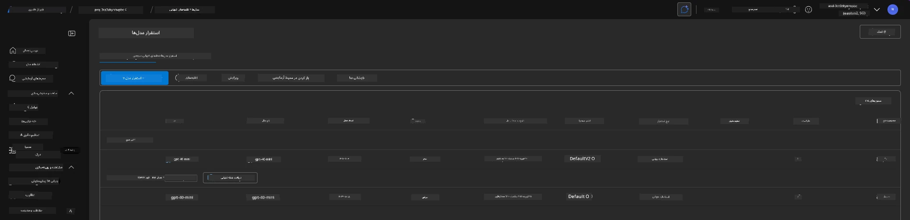
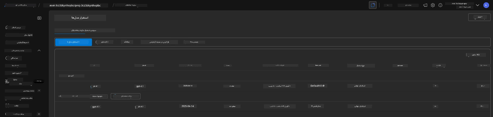

# 6. برچیدن زیرساخت

!!! tip "تا پایان این ماژول شما قادر خواهید بود"

    - [ ] اهمیت پاک‌سازی منابع و مدیریت هزینه را درک کنید
    - [ ] برای حذف ایمن زیرساخت از `azd down` استفاده کنید
    - [ ] در صورت لزوم خدمات شناختی حذف‌شده به‌صورت نرم را بازیابی کنید
    - [ ] **آزمایشگاه 6:** پاک‌سازی منابع Azure و تأیید حذف

---

## تمرین‌های تکمیلی

قبل از اینکه پروژه را برچینیم، چند دقیقه برای کاوش آزاد اختصاص دهید.

!!! info "این پرامپت‌های کاوش را امتحان کنید"

    **آزمایش با GitHub Copilot:**
    
    1. بپرسید: `چه قالب‌های AZD دیگری می‌توانم برای سناریوهای چندعاملی امتحان کنم؟`
    2. بپرسید: `چگونه می‌توانم دستورالعمل‌های عامل را برای یک مورد استفاده در حوزه بهداشت و درمان سفارشی کنم؟`
    3. بپرسید: `کدام متغیرهای محیطی کنترل بهینه‌سازی هزینه را برعهده دارند؟`
    
    **کاوش در پورتال Azure:**
    
    1. معیارهای Application Insights را برای استقرار خود بررسی کنید
    2. تحلیل هزینه برای منابع فراهم‌شده را بررسی کنید
    3. یک بار دیگر بخش agent playground پورتال Microsoft Foundry را بررسی کنید

---

## حذف زیرساخت

1. برچیدن زیرساخت به سادگی به صورت زیر است:
      
      ```bash title="" linenums="0"
      azd down --purge
      ```
1. فلگ `--purge` تضمین می‌کند که همچنین منابع خدمات شناختی حذف‌شده به‌صورت نرم را پاک‌سازی کند، و در نتیجه سهمیهٔ نگه‌داشته‌شده توسط این منابع آزاد خواهد شد. پس از تکمیل، چیزی شبیه به این خواهید دید:
      
      ```bash title="" linenums="0"
      ? Total resources to delete: 11, are you sure you want to continue? Yes
      Deleting your resources can take some time.
      (✓) Done: Deleted resource group rg-nitya-mshack-azd
      (✓) Done: Purging Cognitive Account: aoai-3cz3zkynhvpbc

      SUCCESS: Your application was removed from Azure in 11 minutes 4 seconds.
      ```

1. (اختیاری) اگر اکنون دوباره `azd up` را اجرا کنید، متوجه خواهید شد که مدل gpt-4.1 مستقر می‌شود زیرا متغیر محیطی در پوشه محلی `.azure` تغییر کرد (و ذخیره شد). 

      در اینجا استقرارهای مدل را **قبل از** مشاهده می‌کنید:

      

      و در اینجا وضعیت آن را **بعد از** می‌بینید:
      

---

<!-- CO-OP TRANSLATOR DISCLAIMER START -->
سلب مسئولیت:
این سند با استفاده از سرویس ترجمهٔ هوش مصنوعی [Co-op Translator](https://github.com/Azure/co-op-translator) ترجمه شده است. هرچند ما در تلاش برای دقت هستیم، لطفاً توجه داشته باشید که ترجمه‌های خودکار ممکن است حاوی خطاها یا نادرستی‌هایی باشند. سند اصلی به زبان مبدأ باید به‌عنوان منبع معتبر در نظر گرفته شود. برای اطلاعات حیاتی، ترجمهٔ حرفه‌ای انسانی توصیه می‌شود. ما در قبال هرگونه سوتفاهم یا تفسیر نادرست ناشی از استفاده از این ترجمه مسئولیتی نداریم.
<!-- CO-OP TRANSLATOR DISCLAIMER END -->