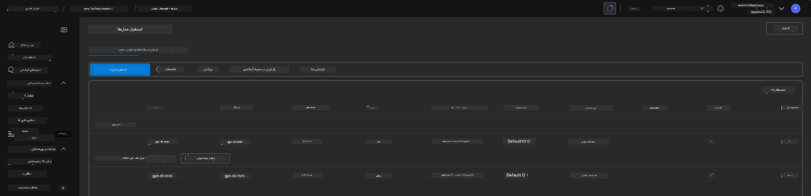
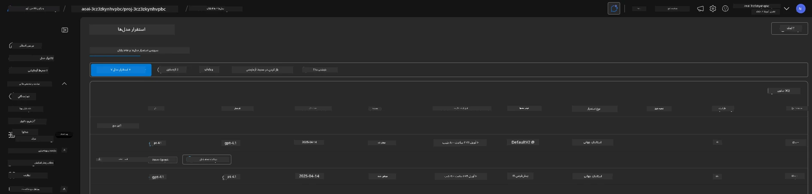

# 6. برچیدن زیرساخت

!!! tip "تا پایان این ماژول قادر خواهید بود"

    - [ ] درک اهمیت پاک‌سازی منابع و مدیریت هزینه
    - [ ] استفاده از `azd down` برای حذف ایمن زیرساخت‌ها
    - [ ] بازیابی سرویس‌های Azure AI که به‌صورت soft-deleted حذف شده‌اند در صورت نیاز
    - [ ] **تمرین عملی 6:** پاک‌سازی منابع Azure و تأیید حذف

---

## تمرین‌های اضافی

قبل از برچیدن پروژه، چند دقیقه وقت بگذارید تا به‌طور آزادانه کاوش کنید.

!!! info "این پیشنهادهای کاوش را امتحان کنید"

    **آزمایش با GitHub Copilot:**
    
    1. بپرسید: `What other AZD templates could I try for multi-agent scenarios?`
    2. بپرسید: `How can I customize the agent instructions for a healthcare use case?`
    3. بپرسید: `What environment variables control cost optimization?`
    
    **کاوش در پورتال Azure:**
    
    1. متریک‌های Application Insights را برای استقرار خود بررسی کنید
    2. تحلیل هزینه برای منابع تأمین‌شده را بررسی کنید
    3. یک بار دیگر بخش agent playground پورتال Microsoft Foundry را کاوش کنید

---

## حذف زیرساخت

1. برچیدن زیرساخت به همین آسانی است:
      
      ```bash title="" linenums="0"
      azd down --purge
      ```
1. فلگ `--purge` تضمین می‌کند که منابع Cognitive Service که به‌صورت soft-deleted حذف شده‌اند نیز پاک شوند، و بدین‌وسیله سهمیهٔ نگه‌داشته‌شده توسط این منابع آزاد می‌شود. پس از اتمام چیزی شبیه به این مشاهده خواهید کرد:
      
      ```bash title="" linenums="0"
      ? Total resources to delete: 11, are you sure you want to continue? Yes
      Deleting your resources can take some time.
      (✓) Done: Deleted resource group rg-nitya-mshack-azd
      (✓) Done: Purging Cognitive Account: aoai-3cz3zkynhvpbc

      SUCCESS: Your application was removed from Azure in 11 minutes 4 seconds.
      ```

1. (اختیاری) اگر اکنون دوباره `azd up` را اجرا کنید، متوجه خواهید شد که مدل gpt-4.1 مستقر می‌شود چون متغیر محیطی در پوشهٔ محلی `.azure` تغییر کرد (و ذخیره شد). 

      در اینجا استقرارهای مدل **قبل از**:

      

      و در اینجا **بعد از**:
      

---

<!-- CO-OP TRANSLATOR DISCLAIMER START -->
**سلب مسئولیت**:
این سند با استفاده از سرویس ترجمه هوش مصنوعی [Co-op Translator](https://github.com/Azure/co-op-translator) ترجمه شده است. در حالی که ما در تلاش برای دقت هستیم، لطفاً توجه داشته باشید که ترجمه‌های خودکار ممکن است شامل خطاها یا نادرستی‌هایی باشند. سند اصلی به زبان مادری خود باید به عنوان منبع معتبر در نظر گرفته شود. برای اطلاعات حیاتی، ترجمه حرفه‌ای انسانی توصیه می‌شود. ما در قبال هرگونه سوء تفاهم یا برداشت نادرست ناشی از استفاده از این ترجمه مسئولیتی نداریم.
<!-- CO-OP TRANSLATOR DISCLAIMER END -->