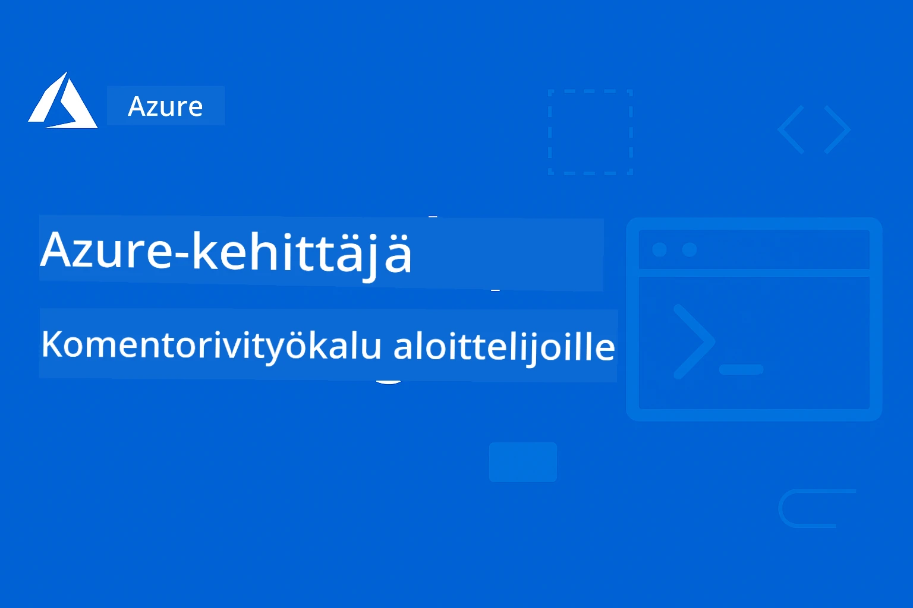

<!--
CO_OP_TRANSLATOR_METADATA:
{
  "original_hash": "068c87cc2641a81ca353ad7064ff326a",
  "translation_date": "2026-01-01T16:52:01+00:00",
  "source_file": "README.md",
  "language_code": "fi"
}
-->
# AZD aloittelijoille: Jäsennelty oppimispolku

 

[](https://GitHub.com/microsoft/azd-for-beginners/watchers/)
[](https://GitHub.com/microsoft/azd-for-beginners/network/)
[](https://GitHub.com/microsoft/azd-for-beginners/stargazers/)

[](https://discord.gg/microsoft-azure)
[](https://discord.gg/nTYy5BXMWG)

## Kurssin aloittaminen

Seuraa näitä vaiheita aloittaaksesi AZD-oppimispolkusi:

1. **Fork the Repository**: Click [](https://GitHub.com/microsoft/azd-for-beginners/fork)
2. **Clone the Repository**: `git clone https://github.com/microsoft/azd-for-beginners.git`
3. **Join the Community**: [Azure Discord Communities](https://discord.com/invite/ByRwuEEgH4) saadaksesi asiantuntijatukea
4. **Choose Your Learning Path**: Valitse oppimispolkusi: valitse alla oleva luku, joka vastaa kokemustasoasi

### Monikielinen tuki

#### Automaattiset käännökset (aina ajan tasalla)

<!-- CO-OP TRANSLATOR LANGUAGES TABLE START -->
[Arabic](../ar/README.md) | [Bengali](../bn/README.md) | [Bulgarian](../bg/README.md) | [Burmese (Myanmar)](../my/README.md) | [Chinese (Simplified)](../zh/README.md) | [Chinese (Traditional, Hong Kong)](../hk/README.md) | [Chinese (Traditional, Macau)](../mo/README.md) | [Chinese (Traditional, Taiwan)](../tw/README.md) | [Croatian](../hr/README.md) | [Czech](../cs/README.md) | [Danish](../da/README.md) | [Dutch](../nl/README.md) | [Estonian](../et/README.md) | [Finnish](./README.md) | [French](../fr/README.md) | [German](../de/README.md) | [Greek](../el/README.md) | [Hebrew](../he/README.md) | [Hindi](../hi/README.md) | [Hungarian](../hu/README.md) | [Indonesian](../id/README.md) | [Italian](../it/README.md) | [Japanese](../ja/README.md) | [Kannada](../kn/README.md) | [Korean](../ko/README.md) | [Lithuanian](../lt/README.md) | [Malay](../ms/README.md) | [Malayalam](../ml/README.md) | [Marathi](../mr/README.md) | [Nepali](../ne/README.md) | [Nigerian Pidgin](../pcm/README.md) | [Norwegian](../no/README.md) | [Persian (Farsi)](../fa/README.md) | [Polish](../pl/README.md) | [Portuguese (Brazil)](../br/README.md) | [Portuguese (Portugal)](../pt/README.md) | [Punjabi (Gurmukhi)](../pa/README.md) | [Romanian](../ro/README.md) | [Russian](../ru/README.md) | [Serbian (Cyrillic)](../sr/README.md) | [Slovak](../sk/README.md) | [Slovenian](../sl/README.md) | [Spanish](../es/README.md) | [Swahili](../sw/README.md) | [Swedish](../sv/README.md) | [Tagalog (Filipino)](../tl/README.md) | [Tamil](../ta/README.md) | [Telugu](../te/README.md) | [Thai](../th/README.md) | [Turkish](../tr/README.md) | [Ukrainian](../uk/README.md) | [Urdu](../ur/README.md) | [Vietnamese](../vi/README.md)
<!-- CO-OP TRANSLATOR LANGUAGES TABLE END -->

## Kurssin yleiskatsaus

Hallitse Azure Developer CLI (azd) jäsenneltyjen lukujen kautta, jotka on suunniteltu asteittaiseen oppimiseen. **Erityinen painotus AI-sovellusten käyttöönottoon Microsoft Foundryn integraation kanssa.**

### Miksi tämä kurssi on olennainen nykyaikaisille kehittäjille

Microsoft Foundry Discord -yhteisön näkemyksiin perustuen, **45 % kehittäjistä haluaa käyttää AZD:ta AI-kuormituksiin**, mutta kohtaa haasteita liittyen:
- Monimutkaiset monipalveluiset AI-arkkitehtuurit
- Parhaat käytännöt AI:n tuotantokäyttöönotossa  
- Azure AI -palveluiden integrointi ja konfigurointi
- Kustannusten optimointi AI-kuormituksille
- AI-spesifisten käyttöönotto-ongelmien vianmääritys

### Oppimistavoitteet

Suoritettuasi tämän jäsennellyn kurssin, osaat:
- **Hallita AZD:n perusteet**: keskeiset käsitteet, asennus ja konfigurointi
- **Ottaa AI-sovellukset käyttöön**: käytä AZD:ta Microsoft Foundry -palveluiden kanssa
- **Toteuttaa Infrastructure as Code**: hallitse Azure-resursseja Bicep-malleilla
- **Vianmääritys käyttöönotossa**: ratkaise yleisiä ongelmia ja debuggaa
- **Optimoi tuotantokäyttöön**: tietoturva, skaalaus, valvonta ja kustannusten hallinta
- **Rakenna moniagenttiratkaisuja**: ota käyttöön monimutkaisia AI-arkkitehtuureja

## 📚 Oppimiskappaleet

*Valitse oppimispolkusi kokemustason ja tavoitteiden perusteella*

### 🚀 Chapter 1: Foundation & Quick Start
**Prerequisites**: Azure subscription, basic command line knowledge  
**Duration**: 30-45 minutes  
**Complexity**: ⭐

#### What You'll Learn
- Understanding Azure Developer CLI fundamentals
- Installing AZD on your platform
- Your first successful deployment

#### Learning Resources
- **🎯 Start Here**: [What is Azure Developer CLI?](../..)
- **📖 Theory**: [AZD Basics](docs/getting-started/azd-basics.md) - Keskeiset käsitteet ja terminologia
- **⚙️ Setup**: [Installation & Setup](docs/getting-started/installation.md) - Alustakohtaiset ohjeet
- **🛠️ Hands-On**: [Your First Project](docs/getting-started/first-project.md) - Askelsammainen opas
- **📋 Quick Reference**: [Command Cheat Sheet](resources/cheat-sheet.md)

#### Practical Exercises
```bash
# Pikainen asennustarkastus
azd version

# Ota ensimmäinen sovelluksesi käyttöön
azd init --template todo-nodejs-mongo
azd up
```

**💡 Chapter Outcome**: Ota onnistuneesti käyttöön yksinkertainen web-sovellus Azureen käyttäen AZD

**✅ Success Validation:**
```bash
# Suoritettuasi luvun 1 sinun pitäisi pystyä:
azd version              # Näyttää asennetun version
azd init --template todo-nodejs-mongo  # Alustaa projektin
azd up                  # Julkaisee Azureen
azd show                # Näyttää käynnissä olevan sovelluksen URL-osoitteen
# Sovellus avautuu selaimessa ja toimii
azd down --force --purge  # Siivoaa resurssit
```

**📊 Time Investment:** 30-45 minutes  
**📈 Skill Level After:** Pystyy ottamaan perussovelluksia käyttöön itsenäisesti

**✅ Success Validation:**
```bash
# Luku 1:n suorittamisen jälkeen sinun pitäisi osata:
azd version              # Näyttää asennetun version
azd init --template todo-nodejs-mongo  # Alustaa projektin
azd up                  # Julkaisee Azureen
azd show                # Näyttää käynnissä olevan sovelluksen URL-osoitteen
# Sovellus avautuu selaimessa ja toimii
azd down --force --purge  # Siivoaa resurssit
```

**📊 Time Investment:** 30-45 minutes  
**📈 Skill Level After:** Pystyy ottamaan perussovelluksia käyttöön itsenäisesti

---

### 🤖 Chapter 2: AI-First Development (Recommended for AI Developers)
**Prerequisites**: Chapter 1 completed  
**Duration**: 1-2 hours  
**Complexity**: ⭐⭐

#### What You'll Learn
- Microsoft Foundry integration with AZD
- Deploying AI-powered applications
- Understanding AI service configurations

#### Learning Resources
- **🎯 Start Here**: [Microsoft Foundry Integration](docs/microsoft-foundry/microsoft-foundry-integration.md)
- **📖 Patterns**: [AI Model Deployment](docs/microsoft-foundry/ai-model-deployment.md) - Deploy and manage AI models
- **🛠️ Workshop**: [AI Workshop Lab](docs/microsoft-foundry/ai-workshop-lab.md) - Make your AI solutions AZD-ready
- **🎥 Interactive Guide**: [Workshop Materials](workshop/README.md) - Selainpohjaista oppimista MkDocs * DevContainer -ympäristössä
- **📋 Templates**: [Microsoft Foundry Templates](../..)
- **📝 Examples**: [AZD Deployment Examples](examples/README.md)

#### Practical Exercises
```bash
# Ota ensimmäinen tekoälysovelluksesi käyttöön
azd init --template azure-search-openai-demo
azd up

# Kokeile lisää tekoälymallipohjia
azd init --template openai-chat-app-quickstart
azd init --template agent-openai-python-prompty
```

**💡 Chapter Outcome**: Ota käyttöön ja konfiguroi AI-pohjainen chat-sovellus RAG-ominaisuuksilla

**✅ Success Validation:**
```bash
# Luvun 2 jälkeen sinun pitäisi pystyä:
azd init --template azure-search-openai-demo
azd up
# Testata tekoälychat-käyttöliittymää
# Esittää kysymyksiä ja saada tekoälyn tuottamia vastauksia lähdeviitteineen
# Varmistaa, että haun integrointi toimii
azd monitor  # Tarkistaa, että Application Insights näyttää telemetrian
azd down --force --purge
```

**📊 Time Investment:** 1-2 hours  
**📈 Skill Level After:** Pystyy ottamaan käyttöön ja konfiguroimaan tuotantovalmiita AI-sovelluksia  
**💰 Cost Awareness:** Ymmärrä kehityskustannukset noin $80-150/kuukausi ja tuotannon kustannukset noin $300-3500/kuukausi

#### 💰 Cost Considerations for AI Deployments

**Development Environment (Estimated $80-150/month):**
- Azure OpenAI (Pay-as-you-go): $0-50/month (based on token usage)
- AI Search (Basic tier): $75/month
- Container Apps (Consumption): $0-20/month
- Storage (Standard): $1-5/month

**Production Environment (Estimated $300-3,500+/month):**
- Azure OpenAI (PTU for consistent performance): $3,000+/month OR Pay-as-go with high volume
- AI Search (Standard tier): $250/month
- Container Apps (Dedicated): $50-100/month
- Application Insights: $5-50/month
- Storage (Premium): $10-50/month

**💡 Cost Optimization Tips:**
- Use **Free Tier** Azure OpenAI for learning (50,000 tokens/month included)
- Run `azd down` to deallocate resources when not actively developing
- Start with consumption-based billing, upgrade to PTU only for production
- Use `azd provision --preview` to estimate costs before deployment
- Enable auto-scaling: pay only for actual usage

**Cost Monitoring:**
```bash
# Tarkista arvioidut kuukausittaiset kustannukset
azd provision --preview

# Seuraa todellisia kustannuksia Azure-portaalissa
az consumption budget list --resource-group <your-rg>
```

---

### ⚙️ Chapter 3: Configuration & Authentication
**Prerequisites**: Chapter 1 completed  
**Duration**: 45-60 minutes  
**Complexity**: ⭐⭐

#### What You'll Learn
- Environment configuration and management
- Authentication and security best practices
- Resource naming and organization

#### Learning Resources
- **📖 Configuration**: [Configuration Guide](docs/getting-started/configuration.md) - Ympäristön asetukset
- **🔐 Security**: [Authentication patterns and managed identity](docs/getting-started/authsecurity.md) - Autentikointimallit
- **📝 Examples**: [Database App Example](examples/database-app/README.md) - AZD-tietokantaesimerkit

#### Practical Exercises
- Configure multiple environments (dev, staging, prod)
- Set up managed identity authentication
- Implement environment-specific configurations

**💡 Chapter Outcome**: Hallitse useita ympäristöjä oikeiden autentikointi- ja turvallisuuskäytäntöjen avulla

---

### 🏗️ Chapter 4: Infrastructure as Code & Deployment
**Prerequisites**: Chapters 1-3 completed  
**Duration**: 1-1.5 hours  
**Complexity**: ⭐⭐⭐

#### What You'll Learn
- Advanced deployment patterns
- Infrastructure as Code with Bicep
- Resource provisioning strategies

#### Learning Resources
- **📖 Deployment**: [Deployment Guide](docs/deployment/deployment-guide.md) - Täydelliset työnkulut
- **🏗️ Provisioning**: [Provisioning Resources](docs/deployment/provisioning.md) - Azure-resurssien hallinta
- **📝 Examples**: [Container App Example](../../examples/container-app) - Konttien käyttöönotto

#### Practical Exercises
- Create custom Bicep templates
- Deploy multi-service applications
- Implement blue-green deployment strategies

**💡 Chapter Outcome**: Ota käyttöön monimutkaisia monipalvelusovelluksia käyttämällä mukautettuja infrastruktuurimalleja

---

### 🎯 Chapter 5: Multi-Agent AI Solutions (Advanced)
**Prerequisites**: Chapters 1-2 completed  
**Duration**: 2-3 hours  
**Complexity**: ⭐⭐⭐⭐

#### What You'll Learn
- Multi-agent architecture patterns
- Agent orchestration and coordination
- Production-ready AI deployments

#### Learning Resources
- **🤖 Featured Project**: [Retail Multi-Agent Solution](examples/retail-scenario.md) - Complete implementation
- **🛠️ ARM-mallit**: [ARM Template Package](../../examples/retail-multiagent-arm-template) - Yhden napsautuksen käyttöönotto
- **📖 Arkkitehtuuri**: [Moniagenttien koordinointimallit](/docs/pre-deployment/coordination-patterns.md) - Mallit

#### Käytännön harjoitukset
```bash
# Ota käyttöön täydellinen vähittäiskaupan moniagenttipohjainen ratkaisu
cd examples/retail-multiagent-arm-template
./deploy.sh

# Tutki agenttien asetuksia
az deployment group show --resource-group <rg-name> --name <deployment-name>
```

**💡 Luvun tulos**: Ota käyttöön ja hallinnoi tuotantovalmiita moniagentti-AI-ratkaisuja, joissa on Customer- ja Inventory-agentit

---

### 🔍 Luku 6: Ennen käyttöönottoa tehtävä validointi ja suunnittelu
**Esivaatimukset**: Luku 4 suoritettu  
**Kesto**: 1 tunti  
**Vaikeustaso**: ⭐⭐

#### Mitä opit
- Kapasiteetin suunnittelu ja resurssien validointi
- SKU-valintastrategiat
- Ennakkotarkistukset ja automaatio

#### Oppimateriaalit
- **📊 Suunnittelu**: [Capacity Planning](docs/pre-deployment/capacity-planning.md) - Resurssien validointi
- **💰 Valinta**: [SKU Selection](docs/pre-deployment/sku-selection.md) - Kustannustehokkaat valinnat
- **✅ Validointi**: [Pre-flight Checks](docs/pre-deployment/preflight-checks.md) - Automaattiset skriptit

#### Käytännön harjoitukset
- Suorita kapasiteetin validointiskriptit
- Optimoi SKU-valinnat kustannusten näkökulmasta
- Ota käyttöön automatisoidut ennakkotarkistukset

**💡 Luvun tulos**: Validoi ja optimoi käyttöönotot ennen toteutusta

---

### 🚨 Luku 7: Vianetsintä ja debuggaus
**Esivaatimukset**: Mikä tahansa käyttöönottoa käsittelevä luku suoritettu  
**Kesto**: 1-1.5 tuntia  
**Vaikeustaso**: ⭐⭐

#### Mitä opit
- Systemaattiset debuggausmenetelmät
- Yleiset ongelmat ja ratkaisut
- AI-spesifinen vianetsintä

#### Oppimateriaalit
- **🔧 Yleiset ongelmat**: [Common Issues](docs/troubleshooting/common-issues.md) - Usein kysytyt kysymykset ja ratkaisut
- **🕵️ Debuggaus**: [Debugging Guide](docs/troubleshooting/debugging.md) - Askel askeleelta -strategiat
- **🤖 AI-ongelmat**: [AI-Specific Troubleshooting](docs/troubleshooting/ai-troubleshooting.md) - AI-palvelujen ongelmat

#### Käytännön harjoitukset
- Diagnosoi käyttöönoton epäonnistumiset
- Ratkaise todennusongelmat
- Vianetsintä AI-palveluiden yhteyksissä

**💡 Luvun tulos**: Diagnosoi ja ratkaise itsenäisesti yleisiä käyttöönotto-ongelmia

---

### 🏢 Luku 8: Tuotanto- ja yritysmallit
**Esivaatimukset**: Lukujen 1-4 suoritettu  
**Kesto**: 2-3 tuntia  
**Vaikeustaso**: ⭐⭐⭐⭐

#### Mitä opit
- Tuotantokäyttöönoton strategiat
- Yritystason suojausmallit
- Valvonta ja kustannusoptimointi

#### Oppimateriaalit
- **🏭 Tuotanto**: [Production AI Best Practices](docs/microsoft-foundry/production-ai-practices.md) - Yritystason mallit
- **📝 Esimerkit**: [Microservices Example](../../examples/microservices) - Monimutkaiset arkkitehtuurit
- **📊 Valvonta**: [Application Insights integration](docs/pre-deployment/application-insights.md) - Valvonta

#### Käytännön harjoitukset
- Ota käyttöön yritystason suojausmallit
- Perusta kattava valvonta
- Julkaise tuotantoon asianmukaisella hallinnolla

**💡 Luvun tulos**: Ota käyttöön yritysvalmiita sovelluksia täydellä tuotantovalmiudella

---

## 🎓 Työpajan yleiskatsaus: Käytännön oppimiskokemus

> **⚠️ TYÖPAJAN TILA: Kehitteillä**  
> Työpajamateriaalit ovat parhaillaan kehitteillä ja hiottavana. Ydismodulit toimivat, mutta jotkin edistyneemmät osiot ovat keskeneräisiä. Työskentelemme aktiivisesti kaikkien sisältöjen viimeistelyssä. [Seuraa edistymistä →](workshop/README.md)

### Interaktiiviset työpajamateriaalit
**Kattava käytännön oppimiskokemus selainpohjaisilla työkaluilla ja ohjatuilla harjoituksilla**

Työpajamateriaalimme tarjoavat rakenteisen, interaktiivisen oppimiskokemuksen, joka täydentää yllä olevaa lukuperusteista opetussuunnitelmaa. Työpaja on suunniteltu sekä itseopiskelua että ohjattuja sessioita varten.

#### 🛠️ Työpajan ominaisuudet
- Selainpohjainen käyttöliittymä: Täydellinen MkDocs-pohjainen työpaja, jossa haku-, kopiointi- ja teemaominaisuudet
- GitHub Codespaces -integraatio: Yhden klikkauksen kehitysympäristön asennus
- Rakenteellinen oppimispolku: 7-vaiheiset ohjatut harjoitukset (yhteensä 3,5 tuntia)
- Tutkiminen → Käyttöönotto → Mukauttaminen: Progressiivinen metodologia
- Interaktiivinen DevContainer-ympäristö: Esikonfiguroidut työkalut ja riippuvuudet

#### 📚 Työpajan rakenne
Työpaja noudattaa **Tutkiminen → Käyttöönotto → Mukauttaminen** -metodologiaa:

1. Tutkimusvaihe (45 min)
   - Tutustu Microsoft Foundry -malleihin ja palveluihin
   - Ymmärrä moniagenttiarkkitehtuurin mallit
   - Käy läpi käyttöönoton vaatimukset ja esivaatimukset

2. Käyttöönotto (2 tuntia)
   - Käytännön käyttöönotto AI-sovelluksille käyttäen AZD:tä
   - Konfiguroi Azure AI -palvelut ja päättepisteet
   - Ota käyttöön suojaus- ja todennuskäytännöt

3. Mukauttamisvaihe (45 min)
   - Muokkaa sovelluksia tiettyihin käyttötapauksiin
   - Optimoi tuotantokäyttöönottoa varten
   - Ota käyttöön valvonta ja kustannusten hallinta

#### 🚀 Työpajan aloittaminen
```bash
# Vaihtoehto 1: GitHub Codespaces (Suositeltu)
# Napsauta "Code" → "Create codespace on main" repositoriossa

# Vaihtoehto 2: Paikallinen kehitys
git clone https://github.com/microsoft/azd-for-beginners.git
cd azd-for-beginners/workshop
# Noudata workshop/README.md-tiedoston asennusohjeita
```

#### 🎯 Työpajan oppimistavoitteet
Työpajan suorittamalla osallistujat:
- **Ota tuotantokäyttöön AI-sovelluksia**: Käytä AZD:tä Microsoft Foundry -palveluiden kanssa
- **Hallinnoi moniagenttiarkkitehtuureja**: Toteuta koordinoituja AI-agenttiratkaisuja
- **Ota käyttöön suojauskäytännöt**: Konfiguroi todennus ja pääsynhallinta
- **Optimoi skaalautuvuutta varten**: Suunnittele kustannustehokkaat ja suorituskykyiset käyttöönotot
- **Vianetsintä käyttöönotoissa**: Ratkaise yleisiä ongelmia itsenäisesti

#### 📖 Työpajan materiaalit
- **🎥 Interaktiivinen opas**: [Workshop Materials](workshop/README.md) - Selainpohjainen oppimisympäristö
- **📋 Askel askeleelta -ohjeet**: [Guided Exercises](../../workshop/docs/instructions) - Yksityiskohtaiset läpikäynnit
- **🛠️ AI-työpajalaboratorio**: [AI Workshop Lab](docs/microsoft-foundry/ai-workshop-lab.md) - AI-keskeiset harjoitukset
- **💡 Pika-aloitus**: [Workshop Setup Guide](workshop/README.md#quick-start) - Ympäristön konfigurointi

**Sopii erinomaisesti**: Yrityskoulutuksiin, yliopistokursseille, itseopiskeluun ja kehittäjäbootcampeihin.

---

## 📖 Mikä on Azure Developer CLI?

Azure Developer CLI (azd) on kehittäjille suunnattu komentorivityökalu, joka nopeuttaa sovellusten rakentamisen ja julkaisemisen prosessia Azureen. Se tarjoaa:

- **Mallipohjaiset käyttöönotot** - Käytä valmiita malleja yleisiin sovelluskuvioihin
- **Infrastruktuuri koodina** - Hallitse Azure-resursseja käyttämällä Bicep- tai Terraform-työkaluja  
- **Integroitu työnkulku** - Provisionoi, julkaise ja valvo sovelluksia saumattomasti
- **Kehittäjäystävällinen** - Optimoitu kehittäjän tuottavuuteen ja käyttökokemukseen

### **AZD + Microsoft Foundry: Erinomainen AI-käyttöönottoihin**

**Miksi AZD AI-ratkaisuille?** AZD vastaa tärkeimpiin haasteisiin, joita AI-kehittäjät kohtaavat:

- **AI-valmiit mallipohjat** - Esikonfiguroidut mallit Azure OpenAI:lle, Cognitive Services -palveluille ja ML-kuormille
- **Turvalliset AI-käyttöönotot** - Sisäänrakennetut suojausmallit AI-palveluille, API-avaimille ja mallipäätteille  
- **Tuotantovalmiit AI-mallit** - Parhaat käytännöt skaalautuviin ja kustannustehokkaisiin AI-käyttöönottoihin
- **Päästä päähän - AI-työnkulut** - Mallin kehittämisestä tuotantoon käyttöönottoon asianmukaisella valvonnalla
- **Kustannusoptimointi** - Älykkäät resurssien kohdennus- ja skaalausstrategiat AI-kuormille
- **Microsoft Foundry -integraatio** - Saumaton yhteys Microsoft Foundry -malliluetteloon ja päätteisiin

---

## 🎯 Mallit ja esimerkkikirjasto

### Esittelyssä: Microsoft Foundry -mallit
**Aloita täältä, jos otat AI-sovelluksia käyttöön!**

> **Huom:** Nämä mallit esittelevät erilaisia AI-malleja. Osa on ulkoisia Azure Samples -esimerkkejä, osa paikallisia toteutuksia.

| Malli | Luku | Vaikeustaso | Palvelut | Tyyppi |
|----------|---------|------------|----------|------|
| [**Aloita AI-chatin kanssa**](https://github.com/Azure-Samples/get-started-with-ai-chat) | Luku 2 | ⭐⭐ | AzureOpenAI + Azure AI Model Inference API + Azure AI Search + Azure Container Apps + Application Insights | Ulkoinen |
| [**Aloita AI-agenttien kanssa**](https://github.com/Azure-Samples/get-started-with-ai-agents) | Luku 2 | ⭐⭐ | Azure AI Agent Service + AzureOpenAI + Azure AI Search + Azure Container Apps + Application Insights | Ulkoinen |
| [**Azure Search + OpenAI -demo**](https://github.com/Azure-Samples/azure-search-openai-demo) | Luku 2 | ⭐⭐ | AzureOpenAI + Azure AI Search + App Service + Storage | Ulkoinen |
| [**OpenAI Chat App -pikaopas**](https://github.com/Azure-Samples/openai-chat-app-quickstart) | Luku 2 | ⭐ | AzureOpenAI + Container Apps + Application Insights | Ulkoinen |
| [**Agent OpenAI Python Prompty**](https://github.com/Azure-Samples/agent-openai-python-prompty) | Luku 5 | ⭐⭐⭐ | AzureOpenAI + Azure Functions + Prompty | Ulkoinen |
| [**Contoso Chat RAG**](https://github.com/Azure-Samples/contoso-chat) | Luku 8 | ⭐⭐⭐⭐ | AzureOpenAI + AI Search + Cosmos DB + Container Apps | Ulkoinen |
| [**Vähittäiskaupan moniagenttiratkaisu**](examples/retail-scenario.md) | Luku 5 | ⭐⭐⭐⭐ | AzureOpenAI + AI Search + Storage + Container Apps + Cosmos DB | **Paikallinen** |

### Esittelyssä: Täydelliset oppimisskenaariot
**Tuotantovalmiit sovellusmallit kartoitettu oppimislukuihin**

| Malli | Oppimisluku | Vaikeustaso | Keskeinen oppi |
|----------|------------------|------------|--------------|
| [**openai-chat-app-quickstart**](https://github.com/Azure-Samples/openai-chat-app-quickstart) | Luku 2 | ⭐ | Perus AI-käyttöönoton mallit |
| [**azure-search-openai-demo**](https://github.com/Azure-Samples/azure-search-openai-demo) | Luku 2 | ⭐⭐ | RAG-toteutus Azure AI Searchin kanssa |
| [**ai-document-processing**](https://github.com/Azure-Samples/ai-document-processing) | Luku 4 | ⭐⭐ | Dokumentti-intelligenssin integrointi |
| [**agent-openai-python-prompty**](https://github.com/Azure-Samples/agent-openai-python-prompty) | Luku 5 | ⭐⭐⭐ | Agenttikehys ja funktiokutsut |
| [**contoso-chat**](https://github.com/Azure-Samples/contoso-chat) | Luku 8 | ⭐⭐⭐ | Yritys-AI-orchestrointi |
| [**retail-multi-agent-solution**](examples/retail-scenario.md) | Luku 5 | ⭐⭐⭐⭐ | Moniagenttiarkkitehtuuri, jossa on Customer- ja Inventory-agentit |

### Oppiminen esimerkkityypin mukaan

> **📌 Paikalliset vs. ulkoiset esimerkit:**  
> **Paikalliset esimerkit** (tässä repossa) = Valmiita käytettäväksi välittömästi  
> **Ulkoiset esimerkit** (Azure Samples) = Kloonaa linkatuista repositorioista

#### Paikalliset esimerkit (valmiit käytettäväksi)
- [**Vähittäiskaupan moniagenttiratkaisu**](examples/retail-scenario.md) - Täydellinen tuotantovalmiiseen käyttöön tarkoitettu toteutus ARM-malleilla
  - Moniagenttiarkkitehtuuri (Customer + Inventory -agentit)
  - Kattava valvonta ja arviointi
  - Yhden napsautuksen käyttöönotto ARM-mallin kautta

#### Paikalliset esimerkit - Container-sovellukset (luvut 2-5)
**Kattavat konttisovellusten käyttöönottoesimerkit tässä repossa:**
- [**Container App -esimerkit**](examples/container-app/README.md) - Täydellinen opas konttipohjaisiin käyttöönottoihin
  - [Yksinkertainen Flask-API](../../examples/container-app/simple-flask-api) - Perus REST-rajapinta, joka tukee skaalausta nollaan
  - [Mikropalveluarkkitehtuuri](../../examples/container-app/microservices) - Tuotantovalmiiseen monipalvelukäyttöönottoon
  - Pika-aloitus, tuotanto- ja edistyneet käyttöönotto-mallit
  - Valvonta-, suojaus- ja kustannusoptimointiohjeet

#### Ulkoiset esimerkit - Yksinkertaiset sovellukset (luvut 1-2)
Kloonaa nämä Azure Samples -repositoriot aloittaaksesi:
- [Yksinkertainen verkkosovellus - Node.js + MongoDB](https://github.com/Azure-Samples/todo-nodejs-mongo) - Perus käyttöönotto-mallit
- [Staattinen verkkosivusto - React SPA](https://github.com/Azure-Samples/todo-csharp-sql-swa-func) - Staattisen sisällön käyttöönotto
- [Container App - Python Flask](https://github.com/Azure-Samples/container-apps-store-api-microservice) - REST-API:n käyttöönotto

#### Ulkoiset esimerkit - Tietokantaintegraatio (luvut 3-4)  
- [Tietokantasovellus - C# + SQL](https://github.com/Azure-Samples/todo-csharp-sql) - Tietokantayhteysmallit
- [Functions + Cosmos DB](https://github.com/Azure-Samples/todo-python-mongo-swa-func) - Serveriton datatyönkulku

#### Ulkoiset esimerkit - Edistyneet mallit (luvut 4-8)
- [Java Microservices](https://github.com/Azure-Samples/java-microservices-aca-lab) - Monipalveluarkkitehtuurit
- [Container Apps Jobs](https://github.com/Azure-Samples/container-apps-jobs) - Taustaprosessointi  
- [Enterprise ML Pipeline](https://github.com/Azure-Samples/mlops-v2) - Tuotantovalmiit ML-mallit

### Ulkoiset mallikokoelmat
- [**Official AZD Template Gallery**](https://azure.github.io/awesome-azd/) - Kuratoitu kokoelma virallisista ja yhteisön malleista
- [**Azure Developer CLI Templates**](https://learn.microsoft.com/en-us/azure/developer/azure-developer-cli/azd-templates) - Microsoft Learn -mallidokumentaatio
- [**Examples Directory**](examples/README.md) - Paikalliset oppimisesimerkit yksityiskohtaisilla selityksillä

---

## 📚 Oppimateriaalit ja viitteet

### Pikaviitteet
- [**Komentojen pikaopas**](resources/cheat-sheet.md) - Tärkeimmät azd-komennot jaoteltuna lukujen mukaan
- [**Sanasto**](resources/glossary.md) - Azure- ja azd-terminologia  
- [**UKK**](resources/faq.md) - Usein kysytyt kysymykset jaoteltuna oppimislukujen mukaan
- [**Opintomateriaali**](resources/study-guide.md) - Kattavat harjoitustehtävät

### Käytännön työpajat
- [**AI Workshop Lab**](docs/microsoft-foundry/ai-workshop-lab.md) - Tee AI-ratkaisuistasi AZD-käyttöönotettavia (2–3 tuntia)
- [**Interaktiivinen työpajaopas**](workshop/README.md) - Selainpohjainen työpaja MkDocsilla ja DevContainer-ympäristöllä
- [**Rakenteinen oppimispolku**](../../workshop/docs/instructions) -7-vaiheiset ohjatut harjoitukset (Discovery → Deployment → Customization)
- [**AZD For Beginners Workshop**](workshop/README.md) - Täydelliset käytännön työpajamateriaalit GitHub Codespaces -integraatiolla

### Ulkoiset oppimisresurssit
- [Azure Developer CLI -dokumentaatio](https://learn.microsoft.com/en-us/azure/developer/azure-developer-cli/)
- [Azure-arkkitehtuurikeskus](https://learn.microsoft.com/en-us/azure/architecture/)
- [Azure-hinnoittelulaskuri](https://azure.microsoft.com/pricing/calculator/)
- [Azure-tila](https://status.azure.com/)

---

## 🔧 Nopea vianmääritysohje

**Yleisimmät aloittelijoiden kohtaamat ongelmat ja nopeita ratkaisuja:**

### ❌ "azd: command not found"

```bash
# Asenna ensin AZD
# Windows (PowerShell):
winget install microsoft.azd

# macOS:
brew tap azure/azd && brew install azd

# Linux:
curl -fsSL https://aka.ms/install-azd.sh | bash

# Tarkista asennus
azd version
```

### ❌ "No subscription found" or "Subscription not set"

```bash
# Luettele saatavilla olevat tilaukset
az account list --output table

# Aseta oletustilaus
az account set --subscription "<subscription-id-or-name>"

# Aseta AZD-ympäristöä varten
azd env set AZURE_SUBSCRIPTION_ID "<subscription-id>"

# Tarkista
az account show
```

### ❌ "InsufficientQuota" or "Quota exceeded"

```bash
# Kokeile eri Azure-aluetta
azd env set AZURE_LOCATION "westus2"
azd up

# Tai käytä kehityksessä pienempiä SKUja
# Muokkaa infra/main.parameters.json:
{
  "sku": "B1"  // Instead of "P1V2"
}
```

### ❌ "azd up" fails halfway through

```bash
# Vaihtoehto 1: Puhdista ja yritä uudelleen
azd down --force --purge
azd up

# Vaihtoehto 2: Korjaa vain infrastruktuuri
azd provision

# Vaihtoehto 3: Tarkista yksityiskohtaiset lokit
azd show
azd logs
```

### ❌ "Authentication failed" or "Token expired"

```bash
# Autentikoi uudelleen
az logout
az login

azd auth logout
azd auth login

# Varmista autentikointi
az account show
```

### ❌ "Resource already exists" or naming conflicts

```bash
# AZD luo ainutlaatuisia nimiä, mutta jos syntyy ristiriita:
azd down --force --purge

# Sitten yritä uudelleen uudella ympäristöllä
azd env new dev-v2
azd up
```

### ❌ Template deployment taking too long

**Normaalit odotusajat:**
- Yksinkertainen web-sovellus: 5-10 minuuttia
- Sovellus tietokannalla: 10-15 minuuttia
- AI-sovellukset: 15-25 minuuttia (OpenAI:n provisiointi on hidasta)

```bash
# Tarkista edistyminen
azd show

# Jos jumissa yli 30 minuuttia, tarkista Azure-portaali:
azd monitor
# Etsi epäonnistuneita käyttöönottoja
```

### ❌ "Permission denied" or "Forbidden"

```bash
# Tarkista Azure-roolisi
az role assignment list --assignee $(az account show --query user.name -o tsv)

# Tarvitset vähintään "Contributor"-roolin
# Pyydä Azure-järjestelmänvalvojaasi myöntämään:
# - Contributor (resursseille)
# - User Access Administrator (roolien myöntämiseen)
```

### ❌ Can't find deployed application URL

```bash
# Näytä kaikki palveluiden päätepisteet
azd show

# Tai avaa Azure-portaali
azd monitor

# Tarkista tietty palvelu
azd env get-values
# Etsi *_URL-muuttujia
```

### 📚 Täydelliset vianmääritysresurssit

- **Yleisongelmien opas:** [Yksityiskohtaiset ratkaisut](docs/troubleshooting/common-issues.md)
- **AI-kohtaiset ongelmat:** [AI-vianmääritys](docs/troubleshooting/ai-troubleshooting.md)
- **Virheenkorjauksen opas:** [Vaiheittainen vianetsintä](docs/troubleshooting/debugging.md)
- **Hanki apua:** [Azure Discord](https://discord.gg/microsoft-azure) #azure-developer-cli

---

## 🔧 Nopea vianmääritysohje

**Yleisimmät aloittelijoiden kohtaamat ongelmat ja nopeita ratkaisuja:**

<details>
<summary><strong>❌ "azd: command not found"</strong></summary>

```bash
# Asenna AZD ensin
# Windows (PowerShell):
winget install microsoft.azd

# macOS:
brew tap azure/azd && brew install azd

# Linux:
curl -fsSL https://aka.ms/install-azd.sh | bash

# Varmista asennus
azd version
```
</details>

<details>
<summary><strong>❌ "No subscription found" or "Subscription not set"</strong></summary>

```bash
# Listaa saatavilla olevat tilaukset
az account list --output table

# Aseta oletustilaus
az account set --subscription "<subscription-id-or-name>"

# Aseta AZD-ympäristölle
azd env set AZURE_SUBSCRIPTION_ID "<subscription-id>"

# Varmista
az account show
```
</details>

<details>
<summary><strong>❌ "InsufficientQuota" or "Quota exceeded"</strong></summary>

```bash
# Kokeile eri Azure-aluetta
azd env set AZURE_LOCATION "westus2"
azd up

# Tai käytä kehityksessä pienempiä SKUja
# Muokkaa infra/main.parameters.json:
{
  "sku": "B1"  // Instead of "P1V2"
}
```
</details>

<details>
<summary><strong>❌ "azd up" fails halfway through</strong></summary>

```bash
# Puhdista ja yritä uudelleen
azd down --force --purge
azd up

# Korjaa vain infrastruktuuri
azd provision

# Tarkista yksityiskohtaiset lokit
azd show
azd logs
```
</details>

<details>
<summary><strong>❌ "Authentication failed" or "Token expired"</strong></summary>

```bash
# Tunnistaudu uudelleen
az logout
az login

azd auth logout
azd auth login

# Varmista todennus
az account show
```
</details>

<details>
<summary><strong>❌ "Resource already exists" or naming conflicts</strong></summary>

```bash
# AZD luo yksilöllisiä nimiä, mutta jos syntyy konflikti:
azd down --force --purge

# Sitten yritä uudelleen uudessa ympäristössä
azd env new dev-v2
azd up
```
</details>

<details>
<summary><strong>❌ Template deployment taking too long</strong></summary>

**Normaalit odotusajat:**
- Yksinkertainen web-sovellus: 5-10 minuuttia
- Sovellus tietokannalla: 10-15 minuuttia
- AI-sovellukset: 15-25 minuuttia (OpenAI:n provisiointi on hidasta)

```bash
# Tarkista edistyminen
azd show

# Jos jumissa yli 30 minuuttia, tarkista Azure-portaali:
azd monitor
# Etsi epäonnistuneita käyttöönottoja
```
</details>

<details>
<summary><strong>❌ "Permission denied" or "Forbidden"</strong></summary>

```bash
# Tarkista Azure-roolisi
az role assignment list --assignee $(az account show --query user.name -o tsv)

# Tarvitset vähintään "Contributor"-roolin
# Pyydä Azure-järjestelmänvalvojaasi myöntämään:
# - Contributor (resursseja varten)
# - User Access Administrator (roolien määräämistä varten)
```
</details>

<details>
<summary><strong>❌ Can't find deployed application URL</strong></summary>

```bash
# Näytä kaikki palveluiden päätepisteet
azd show

# Tai avaa Azure-portaali
azd monitor

# Tarkista tietty palvelu
azd env get-values
# Etsi *_URL-muuttujia
```
</details>

### 📚 Täydelliset vianmääritysresurssit

- **Yleisongelmien opas:** [Yksityiskohtaiset ratkaisut](docs/troubleshooting/common-issues.md)
- **AI-kohtaiset ongelmat:** [AI-vianmääritys](docs/troubleshooting/ai-troubleshooting.md)
- **Virheenkorjauksen opas:** [Vaiheittainen vianetsintä](docs/troubleshooting/debugging.md)
- **Hanki apua:** [Azure Discord](https://discord.gg/microsoft-azure) #azure-developer-cli

---

## 🎓 Kurssin suoritus ja sertifiointi

### Edistymisen seuranta
Seuraa oppimisesi edistymistä jokaisen luvun kautta:

- [ ] **Luku 1**: Perusta & Pika-aloitus ✅
- [ ] **Luku 2**: AI-lähtöinen kehitys ✅  
- [ ] **Luku 3**: Konfigurointi & Todennus ✅
- [ ] **Luku 4**: Infrastruktuuri koodina & Käyttöönotto ✅
- [ ] **Luku 5**: Moni-agenttiset AI-ratkaisut ✅
- [ ] **Luku 6**: Ennakkotarkastus & Suunnittelu ennen käyttöönottoa ✅
- [ ] **Luku 7**: Vianmääritys & Virheenkorjaus ✅
- [ ] **Luku 8**: Tuotanto & Yritysmallit ✅

### Oppimisen varmentaminen
Kun olet suorittanut jokaisen luvun, varmista osaamisesi tekemällä:
1. **Käytännön harjoitus**: Suorita luvun käytännön käyttöönotto
2. **Tietotarkastus**: Käy läpi luvun UKK-osio
3. **Yhteisön keskustelu**: Jaa kokemuksesi Azure Discordissa
4. **Seuraava luku**: Siirry seuraavaan vaikeustasoon

### Kurssin suorittamisen edut
Kun olet suorittanut kaikki luvut, sinulla on:
- **Tuotantokokemus**: Olet ottanut käyttöön oikeita AI-sovelluksia Azureen
- **Ammatilliset taidot**: Yrityskäyttöön valmiit käyttöönotto-osaamiset  
- **Yhteisön tunnustus**: Aktiivinen jäsen Azure-kehittäjäyhteisössä
- **Urapolun edistäminen**: Kysytyt AZD- ja AI-käyttöönotto-osaamiset

---

## 🤝 Yhteisö & Tuki

### Hanki apua ja tukea
- **Tekniset ongelmat**: [Ilmoita virheistä ja pyydä ominaisuuksia](https://github.com/microsoft/azd-for-beginners/issues)
- **Oppimiskysymykset**: [Microsoft Azure Discord Community](https://discord.gg/microsoft-azure) and [](https://discord.gg/nTYy5BXMWG)
- **AI-kohtainen apu**: Liity [](https://discord.gg/nTYy5BXMWG)
- **Dokumentaatio**: [Azure Developer CLI -virallinen dokumentaatio](https://learn.microsoft.com/en-us/azure/developer/azure-developer-cli/)

### Yhteisön näkemyksiä Microsoft Foundry Discordista

**Äskettäiset kyselytulokset #Azure-kanavalta:**
- **45%** kehittäjistä haluaa käyttää AZD:ta AI-työkuormiin
- **Suurimmat haasteet**: Monipalveluiden käyttöönotot, tunnistetietojen hallinta, tuotantovalmius  
- **Eniten pyydettyjä**: AI-kohtaiset templatet, vianmääritysohjeet, parhaat käytännöt

**Liity yhteisöömme, jotta voit:**
- Jakaa AZD + AI -kokemuksiasi ja saada apua
- Saada varhaisia ennakkokatsauksia uusiin AI-templateihin
- Osallistua AI-käyttöönoton parhaiden käytäntöjen kehittämiseen
- Vaikuttaa tuleviin AI + AZD -ominaisuuksiin

### Osallistuminen kurssin kehittämiseen
Odotamme mielellämme panostasi! Lue [Contributing Guide](CONTRIBUTING.md) saadaksesi yksityiskohtaiset ohjeet:
- **Sisällön parannukset**: Paranna olemassa olevia lukuja ja esimerkkejä
- **Uudet esimerkit**: Lisää todellisen elämän skenaarioita ja templateja  
- **Käännökset**: Auta ylläpitämään monikielistä tukea
- **Virheraportit**: Paranna tarkkuutta ja selkeyttä
- **Yhteisön pelisäännöt**: Noudata inklusiivisia yhteisökäytäntöjämme

---

## 📄 Kurssitiedot

### Lisenssi
Tämä projekti on lisensoitu MIT-lisenssillä - katso [LICENSE](../../LICENSE) tiedosto saadaksesi lisätietoja.

### Aiheeseen liittyvät Microsoftin oppimateriaalit

Tiimimme tuottaa myös muita kattavia oppimiskursseja:

<!-- CO-OP TRANSLATOR OTHER COURSES START -->
### LangChain
[](https://aka.ms/langchain4j-for-beginners)
[](https://aka.ms/langchainjs-for-beginners?WT.mc_id=m365-94501-dwahlin)

---

### Azure / Edge / MCP / Agents
[](https://github.com/microsoft/AZD-for-beginners?WT.mc_id=academic-105485-koreyst)
[](https://github.com/microsoft/edgeai-for-beginners?WT.mc_id=academic-105485-koreyst)
[](https://github.com/microsoft/mcp-for-beginners?WT.mc_id=academic-105485-koreyst)
[](https://github.com/microsoft/ai-agents-for-beginners?WT.mc_id=academic-105485-koreyst)

---
 
### Generative AI Series
[](https://github.com/microsoft/generative-ai-for-beginners?WT.mc_id=academic-105485-koreyst)
[-9333EA?style=for-the-badge&labelColor=E5E7EB&color=9333EA)](https://github.com/microsoft/Generative-AI-for-beginners-dotnet?WT.mc_id=academic-105485-koreyst)
[-C084FC?style=for-the-badge&labelColor=E5E7EB&color=C084FC)](https://github.com/microsoft/generative-ai-for-beginners-java?WT.mc_id=academic-105485-koreyst)
[-E879F9?style=for-the-badge&labelColor=E5E7EB&color=E879F9)](https://github.com/microsoft/generative-ai-with-javascript?WT.mc_id=academic-105485-koreyst)

---
 
### Perusoppiminen
[](https://aka.ms/ml-beginners?WT.mc_id=academic-105485-koreyst)
[](https://aka.ms/datascience-beginners?WT.mc_id=academic-105485-koreyst)
[](https://aka.ms/ai-beginners?WT.mc_id=academic-105485-koreyst)
[](https://github.com/microsoft/Security-101?WT.mc_id=academic-96948-sayoung)
[](https://aka.ms/webdev-beginners?WT.mc_id=academic-105485-koreyst)
[](https://aka.ms/iot-beginners?WT.mc_id=academic-105485-koreyst)
[](https://github.com/microsoft/xr-development-for-beginners?WT.mc_id=academic-105485-koreyst)

---
 
### Copilot-sarja
[](https://aka.ms/GitHubCopilotAI?WT.mc_id=academic-105485-koreyst)
[](https://github.com/microsoft/mastering-github-copilot-for-dotnet-csharp-developers?WT.mc_id=academic-105485-koreyst)
[](https://github.com/microsoft/CopilotAdventures?WT.mc_id=academic-105485-koreyst)
<!-- CO-OP TRANSLATOR OTHER COURSES END -->

---

## 🗺️ Kurssin navigointi

**🚀 Valmis aloittamaan?**

**Aloittelijat**: Aloita [Luku 1: Perusta ja pika-aloitus](../..)  
**AI-kehittäjät**: Siirry kohtaan [Luku 2: AI-keskeinen kehitys](../..)  
**Kokeneet kehittäjät**: Aloita [Luku 3: Konfigurointi ja todennus](../..)

**Seuraavat askeleet**: [Aloita Luku 1 - AZD-perusteet](docs/getting-started/azd-basics.md) →

---

<!-- CO-OP TRANSLATOR DISCLAIMER START -->
Vastuuvapauslauseke:
Tämä asiakirja on käännetty käyttämällä tekoälypohjaista käännöspalvelua [Co-op Translator](https://github.com/Azure/co-op-translator). Vaikka pyrimme tarkkuuteen, huomioithan, että automaattisissa käännöksissä voi esiintyä virheitä tai epätarkkuuksia. Alkuperäistä asiakirjaa sen alkuperäiskielellä tulee pitää ensisijaisena ja luotettavana lähteenä. Tärkeiden tietojen osalta suositellaan ammattimaista ihmiskäännöstä. Emme ole vastuussa tästä käännöksestä aiheutuvista väärinymmärryksistä tai virhetulkinnoista.
<!-- CO-OP TRANSLATOR DISCLAIMER END -->