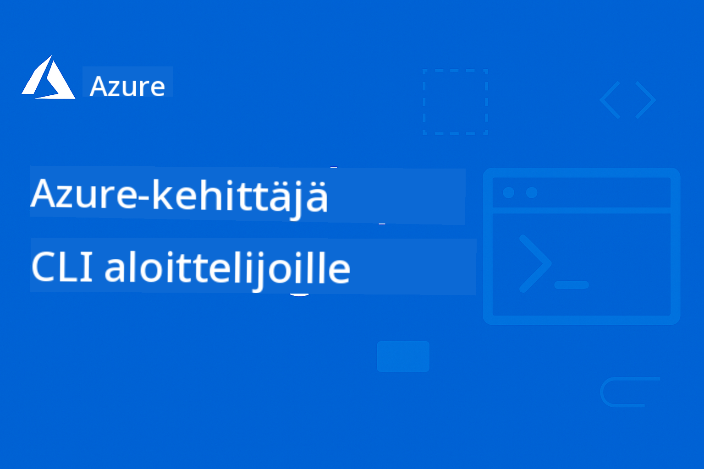

<!--
CO_OP_TRANSLATOR_METADATA:
{
  "original_hash": "ee9a026a572535444287d531dbd75d78",
  "translation_date": "2025-09-12T21:09:13+00:00",
  "source_file": "README.md",
  "language_code": "fi"
}
-->
# AZD Aloittelijoille

 

[](https://GitHub.com/microsoft/azd-for-beginners/watchers/?WT.mc_id=academic-105485-koreyst)
[](https://GitHub.com/microsoft/azd-for-beginners/network/?WT.mc_id=academic-105485-koreyst)
[](https://GitHub.com/microsoft/azd-for-beginners/stargazers/?WT.mc_id=academic-105485-koreyst)


Seuraa näitä vaiheita päästäksesi alkuun näiden resurssien käytössä:
1. **Haarauta arkisto**: Klikkaa [](https://GitHub.com/microsoft/azd-for-beginners/fork)
2. **Kloonaa arkisto**:   `git clone https://github.com/microsoft/azd-for-beginners.git`
3. [**Liity Azure Discord -yhteisöihin ja tapaa asiantuntijoita sekä muita kehittäjiä**](https://discord.com/invite/ByRwuEEgH4)

### Monikielinen tuki

#### Tuettu GitHub Actionin kautta (automaattinen ja aina ajan tasalla)

[French](../fr/README.md) | [Spanish](../es/README.md) | [German](../de/README.md) | [Russian](../ru/README.md) | [Arabic](../ar/README.md) | [Persian (Farsi)](../fa/README.md) | [Urdu](../ur/README.md) | [Chinese (Simplified)](../zh/README.md) | [Chinese (Traditional, Macau)](../mo/README.md) | [Chinese (Traditional, Hong Kong)](../hk/README.md) | [Chinese (Traditional, Taiwan)](../tw/README.md) | [Japanese](../ja/README.md) | [Korean](../ko/README.md) | [Hindi](../hi/README.md) | [Bengali](../bn/README.md) | [Marathi](../mr/README.md) | [Nepali](../ne/README.md) | [Punjabi (Gurmukhi)](../pa/README.md) | [Portuguese (Portugal)](../pt/README.md) | [Portuguese (Brazil)](../br/README.md) | [Italian](../it/README.md) | [Polish](../pl/README.md) | [Turkish](../tr/README.md) | [Greek](../el/README.md) | [Thai](../th/README.md) | [Swedish](../sv/README.md) | [Danish](../da/README.md) | [Norwegian](../no/README.md) | [Finnish](./README.md) | [Dutch](../nl/README.md) | [Hebrew](../he/README.md) | [Vietnamese](../vi/README.md) | [Indonesian](../id/README.md) | [Malay](../ms/README.md) | [Tagalog (Filipino)](../tl/README.md) | [Swahili](../sw/README.md) | [Hungarian](../hu/README.md) | [Czech](../cs/README.md) | [Slovak](../sk/README.md) | [Romanian](../ro/README.md) | [Bulgarian](../bg/README.md) | [Serbian (Cyrillic)](../sr/README.md) | [Croatian](../hr/README.md) | [Slovenian](../sl/README.md) | [Ukrainian](../uk/README.md) | [Burmese (Myanmar)](../my/README.md)

**Jos haluat lisätä tuettuja kieliä, katso lista [täältä](https://github.com/Azure/co-op-translator/blob/main/getting_started/supported-languages.md)**

## Johdanto

Tervetuloa Azure Developer CLI:n (azd) kattavaan oppaaseen. Tämä arkisto on suunniteltu auttamaan kehittäjiä kaikilla tasoilla, opiskelijoista ammattilaisiin, oppimaan ja hallitsemaan Azure Developer CLI:tä tehokkaiden pilvijärjestelmien käyttöönotossa, **erityisesti keskittyen AI-sovellusten käyttöönottoon Azure AI Foundryn avulla**. Tämä jäsennelty oppimateriaali tarjoaa käytännön kokemusta Azure-pilvikäyttöönotosta, yleisten ongelmien ratkaisemisesta ja parhaiden käytäntöjen soveltamisesta onnistuneisiin AZD-mallikäyttöönottoihin.

### **Miksi tämä opas on tärkeä AI-kehittäjille**
Viimeisimmän Azure AI Foundry Discord -yhteisön kyselyn perusteella **45 % kehittäjistä on kiinnostunut käyttämään AZD:tä AI-työkuormiin**, mutta he kohtaavat haasteita, kuten:
- Monimutkaiset monipalvelu-AI-arkkitehtuurit
- Parhaat käytännöt tuotantotason AI-käyttöönottoon
- Azure AI -palveluiden integrointi ja konfigurointi
- Kustannusten optimointi AI-työkuormille
- AI-spesifisten käyttöönotto-ongelmien ratkaiseminen

## Oppimistavoitteet

Työskennellessäsi tämän arkiston parissa opit:
- Hallitsemaan Azure Developer CLI:n perusteet ja ydinkonseptit
- Käyttämään Infrastructure as Code -menetelmää Azure-resurssien käyttöönotossa
- Kehittämään ongelmanratkaisutaitoja yleisiin AZD-käyttöönottohaasteisiin
- Ymmärtämään ennakkovarmistuksia ja kapasiteettisuunnittelua
- Toteuttamaan turvallisuuden parhaat käytännöt ja kustannusten optimointistrategiat
- Saamaan varmuutta tuotantovalmiiden sovellusten käyttöönotossa Azureen

## Oppimistulokset

Kurssin suorittamisen jälkeen pystyt:
- Asentamaan, konfiguroimaan ja käyttämään Azure Developer CLI:tä onnistuneesti
- Luomaan ja ottamaan käyttöön sovelluksia AZD-mallien avulla
- Ratkaisemaan autentikointi-, infrastruktuuri- ja käyttöönotto-ongelmia
- Suorittamaan ennakkotarkistuksia, kuten kapasiteettisuunnittelua ja SKU-valintaa
- Toteuttamaan valvonnan, turvallisuuden ja kustannusten hallinnan parhaat käytännöt
- Integroimaan AZD-työnkulut CI/CD-putkistoihin

## Sisällysluettelo

- [Mikä on Azure Developer CLI?](../..)
- [Pika-aloitus](../..)
- [Oppimispolku](../..)
  - [AI-kehittäjille (suositeltu aloituskohta!)](../..)
  - [Opiskelijoille ja aloittelijoille](../..)
  - [Kehittäjille](../..)
  - [DevOps-insinööreille](../..)
- [Dokumentaatio](../..)
  - [Aloittaminen](../..)
  - [Käyttöönotto ja resurssien provisiointi](../..)
  - [Ennakkotarkistukset](../..)
  - [AI ja Azure AI Foundry](../..)
  - [Vianetsintä](../..)
- [Esimerkit ja mallit](../..)
  - [Esillä: Azure AI Foundry -mallit](../..)
  - [Esillä: Azure AI Foundry E2E-skenaariot](../..)
  - [Lisä-AZD-mallit](../..)
  - [Käytännön harjoitukset ja työpajat](../..)
- [Resurssit](../..)
- [Osallistuminen](../..)
- [Tuki](../..)
- [Yhteisö](../..)

## Mikä on Azure Developer CLI?

Azure Developer CLI (azd) on kehittäjäkeskeinen komentoriviliittymä, joka nopeuttaa sovellusten rakentamista ja käyttöönottoa Azureen. Se tarjoaa:

- **Mallipohjaiset käyttöönotot** - Käytä valmiita malleja yleisiin sovelluskuvioihin
- **Infrastructure as Code** - Hallitse Azure-resursseja Bicepin tai Terraformin avulla
- **Integroitu työnkulku** - Resurssien provisiointi, käyttöönotto ja valvonta saumattomasti
- **Kehittäjäystävällisyys** - Optimoitu kehittäjän tuottavuudelle ja käyttökokemukselle

### **AZD + Azure AI Foundry: Täydellinen AI-käyttöönottoihin**

**Miksi AZD AI-ratkaisuille?** AZD ratkaisee AI-kehittäjien suurimmat haasteet:

- **AI-valmiit mallit** - Esikonfiguroidut mallit Azure OpenAI:lle, Cognitive Servicesille ja ML-työkuormille
- **Turvalliset AI-käyttöönotot** - Sisäänrakennetut turvallisuuskuviot AI-palveluille, API-avaimille ja mallipäätteille
- **Tuotantotason AI-kuviot** - Parhaat käytännöt skaalautuville ja kustannustehokkaille AI-sovellusten käyttöönotolle
- **Päästä-päähän AI-työnkulut** - Mallin kehittämisestä tuotantokäyttöön asianmukaisella valvonnalla
- **Kustannusten optimointi** - Älykkäät resurssien allokointi- ja skaalausstrategiat AI-työkuormille
- **Azure AI Foundry -integraatio** - Saumaton yhteys AI Foundryn mallikatalogiin ja päätteisiin

## Pika-aloitus

### Esivaatimukset
- Azure-tilaus
- Azure CLI asennettuna
- Git (mallien kloonaamiseen)

### Asennus
```bash
# Windows (PowerShell)
powershell -ex AllSigned -c "Invoke-RestMethod 'https://aka.ms/install-azd.ps1' | Invoke-Expression"

# macOS/Linux
curl -fsSL https://aka.ms/install-azd.sh | bash
```

### Ensimmäinen käyttöönotto
```bash
# Initialize a new project
azd init --template todo-nodejs-mongo

# Provision Azure resources and deploy
azd up
```

### Ensimmäinen AI-käyttöönotto
```bash
# Initialize an AI-powered chat application with Azure OpenAI
azd init --template azure-search-openai-demo

# Configure AI services and deploy
azd up

# Or try other AI templates:
azd init --template openai-chat-app-quickstart
azd init --template ai-document-processing
azd init --template contoso-chat
```

## Oppimispolku

### AI-kehittäjille (suositeltu aloituskohta!)
1. **Pika-aloitus**: Kokeile [azure-search-openai-demo](https://github.com/Azure-Samples/azure-search-openai-demo) -mallia
2. **Opi perusteet**: [AZD Basics](docs/getting-started/azd-basics.md) + [Azure AI Foundry Integration](docs/ai-foundry/azure-ai-foundry-integration.md)
3. **Käytännön harjoittelu**: Suorita [AI Workshop Lab](docs/ai-foundry/ai-workshop-lab.md)
4. **Tuotantovalmius**: Tutustu [Production AI Best Practices](docs/ai-foundry/production-ai-practices.md)
5. **Edistynyt**: Ota käyttöön [contoso-chat](https://github.com/Azure-Samples/contoso-chat) yritysmalli

### Opiskelijoille ja aloittelijoille
1. Aloita [AZD Basics](docs/getting-started/azd-basics.md)
2. Seuraa [Asennusopasta](docs/getting-started/installation.md)
3. Suorita [Ensimmäinen projektisi](docs/getting-started/first-project.md)
4. Harjoittele [Yksinkertainen verkkosovellus -esimerkin](../../examples/simple-web-app) avulla

### Kehittäjille
1. Tutustu [Konfigurointioppaaseen](docs/getting-started/configuration.md)
2. Opiskele [Käyttöönotto-opasta](docs/deployment/deployment-guide.md)
3. Työskentele [Tietokantasovellus-esimerkin](../../examples/database-app) parissa
4. Tutki [Konttisovellus-esimerkkiä](../../examples/container-app)

### DevOps-insinööreille
1. Hallitse [Resurssien provisiointi](docs/deployment/provisioning.md)
2. Toteuta [Ennakkotarkistukset](docs/pre-deployment/preflight-checks.md)
3. Harjoittele [Kapasiteettisuunnittelua](docs/pre-deployment/capacity-planning.md)
4. Edistynyt [Mikropalvelut-esimerkki](../../examples/microservices)

## Dokumentaatio

### Aloittaminen
- [**AZD Basics**](docs/getting-started/azd-basics.md) - Peruskäsitteet ja terminologia
- [**Asennus ja käyttöönotto**](docs/getting-started/installation.md) - Alustakohtaiset asennusoppaat
- [**Konfigurointi**](docs/getting-started/configuration.md) - Ympäristön asennus ja autentikointi
- [**Ensimmäinen projektisi**](docs/getting-started/first-project.md) - Vaiheittainen opas

### Käyttöönotto ja resurssien provisiointi
- [**Käyttöönotto-opas**](docs/deployment/deployment-guide.md) - Täydelliset käyttöönoton työnkulut
- [**Resurssien provisiointi**](docs/deployment/provisioning.md) - Azure-resurssien hallinta

### Ennakkotarkistukset
- [**Kapasiteettisuunnittelu**](docs/pre-deployment/capacity-planning.md) - Azure-resurssien kapasiteetin validointi
- [**SKU-valinta**](docs/pre-deployment/sku-selection.md) - Oikeiden Azure SKU:iden valinta
- [**Ennakkotarkistukset**](docs/pre-deployment/preflight-checks.md) - Automatisoidut validointiskriptit

### AI ja Azure AI Foundry
- [**Azure AI Foundry -integraatio**](docs/ai-foundry/azure-ai-foundry-integration.md) - Yhdistä AZD Azure AI Foundry -palveluihin
- [**AI-mallien käyttöönotto-kuviot**](docs/ai-foundry/ai-model-deployment.md) - AI-mallien käyttöönotto ja hallinta AZD:n avulla
- [**AI Workshop Lab**](docs/ai-foundry/ai-workshop-lab.md) - Käytännön harjoitus: AI-ratkaisujen AZD-valmius
- [**Tuotantotason AI:n parhaat käytännöt**](docs/ai-foundry/production-ai-practices.md) - Turvallisuus, skaalaus ja valvonta AI-työkuormille

### Vianetsintä
- [**Yleiset ongelmat**](docs/troubleshooting/common-issues.md) - Usein kohdatut ongelmat ja ratkaisut
- [**Vianetsintäopas**](docs/troubleshooting/debugging.md) - Vaiheittaiset vianetsintästrategiat  
- [**AI-spesifinen vianetsintä**](docs/troubleshooting/ai-troubleshooting.md) - AI-palveluiden ja mallien käyttöönottoon liittyvät ongelmat  

## Esimerkit ja mallipohjat  

### [Esillä: Azure AI Foundry -mallipohjat](https://ai.azure.com/resource/build/templates)  
**Aloita tästä, jos olet ottamassa käyttöön AI-sovelluksia!**  

| Mallipohja | Kuvaus | Monimutkaisuus | Palvelut |  
|------------|---------|----------------|----------|  
| [**Aloita AI-chatilla**](https://github.com/Azure-Samples/get-started-with-ai-chat) | Luo ja ota käyttöön perus chat-sovellus, joka on integroitu dataasi ja telemetriatietoihisi Azure Container Apps -palvelun avulla |⭐⭐ | AzureOpenAI + Azure AI Model Inference API + Azure AI Search + Azure Container Apps + Application Insights |  
| [**Aloita AI-agenttien kanssa**](https://github.com/Azure-Samples/get-started-with-ai-agents) | Luo ja ota käyttöön perus agenttisovellus, jossa on toimintoja ja telemetriatietoja Azure Container Apps -palvelun avulla. |⭐⭐ | Azure AI Agent Service + AzureOpenAI + Azure AI Search + Azure Container Apps + Application Insights|  
| [**Moniagenttinen työnkulkuautomaatio**](https://github.com/Azure-Samples/get-started-with-ai-chat) | Paranna tehtävien suunnittelua ja automaatiota orkestroimalla ja hallinnoimalla AI-agenttien ryhmää. |⭐⭐⭐ | AzureOpenAI + Azure AI Agent Service + Semantic Kernel + Azure CosmosDB + Azure Container Apps|  
| [**Luo dokumentteja datastasi**](https://github.com/Azure-Samples/get-started-with-ai-chat) | Nopeuta dokumenttien, kuten sopimusten, laskujen ja sijoitusehdotusten, luomista löytämällä ja tiivistämällä olennaista tietoa datastasi. |⭐⭐⭐ | AzureOpenAI + Azure AI Search + Azure AI Services + Azure CosmosDB|  
| [**Paranna asiakastapaamisia agenttien avulla**](https://github.com/Azure-Samples/get-started-with-ai-chat) | Siirrä vanhaa koodia moderneihin ohjelmointikieliin hyödyntämällä agenttitiimiä. |⭐⭐⭐| AzureOpenAI + Azure AI Search + Azure CosmosDB + Azure SQL Database |  
| [**Modernisoi koodisi agenttien avulla**](https://github.com/Azure-Samples/get-started-with-ai-chat) | Luo ja ota käyttöön perus chat-sovellus, joka on integroitu dataasi ja telemetriatietoihisi Azure Container Apps -palvelun avulla |⭐⭐⭐ | AzureOpenAI + Azure Agent Service + Semantic Kernel + Azure CosmosDB + Azure Container Apps|  
| [**Rakenna keskusteleva agenttisi**](https://github.com/Azure-Samples/get-started-with-ai-chat) | Hyödynnä kehittynyttä keskustelun ymmärrystä chatbotien ja agenttien luomisessa ja parantamisessa determinististen ja ihmisen hallittavien työnkulkujen avulla. |⭐⭐⭐ | AI Language + AzureOpenAI + AI Search + Azure Storage + Azure Container Registry|  
| [**Avaa oivalluksia keskusteludatasta**](https://github.com/Azure-Samples/get-started-with-ai-chat) | Paranna yhteyskeskuksen tehokkuutta löytämällä oivalluksia suurista ääni- ja tekstipohjaisista datamassoista kehittyneiden sisällön ymmärtämisen ominaisuuksien avulla. |⭐⭐⭐ | AzureOpenAI + AI Search + Semantic Kernel + Azure Agent Service + AI AI Content Understanding|  
| [**Monimuotoinen sisällön käsittely**](https://github.com/Azure-Samples/get-started-with-ai-chat) | Käsittele vaatimuksia, laskuja, sopimuksia ja muita dokumentteja nopeasti ja tarkasti poimimalla tietoa jäsentämättömästä sisällöstä ja muuntamalla se jäsenneltyyn muotoon. Tämä mallipohja tukee tekstiä, kuvia, taulukoita ja kaavioita. |⭐⭐⭐⭐ | AzureOpenAI + Azure Content Understanding + Azure CosmosDB + Azure Container Apps|  

### Esillä: Azure AI Foundry E2E-skenaariot  
**Aloita tästä, jos olet ottamassa käyttöön AI-sovelluksia!**  

| Mallipohja | Kuvaus | Monimutkaisuus | Palvelut |  
|------------|---------|----------------|----------|  
| [**openai-chat-app-quickstart**](https://github.com/Azure-Samples/openai-chat-app-quickstart) | Yksinkertainen chat-käyttöliittymä Azure OpenAI:lla | ⭐ | AzureOpenAI + Container Apps |  
| [**azure-search-openai-demo**](https://github.com/Azure-Samples/azure-search-openai-demo) | RAG-ominaisuudella varustettu chat-sovellus Azure OpenAI:lla | ⭐⭐ | AzureOpenAI + Search + App Service |  
| [**ai-document-processing**](https://github.com/Azure-Samples/ai-document-processing) | Dokumenttianalyysi AI-palveluilla | ⭐⭐ | Azure Document Intelligence + Functions |  
| [**agent-openai-python-prompty**](https://github.com/Azure-Samples/agent-openai-python-prompty) | AI-agenttikehys funktiokutsujen kanssa | ⭐⭐⭐ | AzureOpenAI + Azure Container Apps + Functions |  
| [**contoso-chat**](https://github.com/Azure-Samples/contoso-chat) | Yrityschat AI-orkestroinnilla | ⭐⭐⭐ | AzureOpenAI + Azure AI Search + Container Apps |  

### Lisä-AZD-mallipohjat  
- [**Esimerkkihakemisto**](examples/README.md) - Käytännön esimerkkejä, mallipohjia ja tosielämän skenaarioita  
- [**Azure-Samples AZD-mallipohjat**](https://github.com/Azure-Samples/azd-templates) - Microsoftin viralliset esimerkkimallipohjat  
- [**Awesome AZD Gallery**](https://azure.github.io/awesome-azd/) - Yhteisön tuottamat mallipohjat  

### Käytännön harjoitukset ja työpajat  
- [**AI Workshop Lab**](docs/ai-foundry/ai-workshop-lab.md) - **UUSI**: Tee AI-ratkaisusi AZD-yhteensopiviksi  
- [**AZD For Beginners Workshop**](workshop/README.md) - Keskity AI-agenttien AZD-mallipohjien käyttöönottoon  

## Resurssit  

### Pikaoppaat  
- [**Komento-opas**](resources/cheat-sheet.md) - Keskeiset azd-komennot  
- [**Sanasto**](resources/glossary.md) - Azure- ja azd-terminologia  
- [**FAQ**](resources/faq.md) - Usein kysytyt kysymykset  
- [**Opintosuunnitelma**](resources/study-guide.md) - Kattavat oppimistavoitteet ja harjoitustehtävät  

### Ulkoiset resurssit  
- [Azure Developer CLI -dokumentaatio](https://learn.microsoft.com/en-us/azure/developer/azure-developer-cli/)  
- [Azure Architecture Center](https://learn.microsoft.com/en-us/azure/architecture/)  
- [Azure Pricing Calculator](https://azure.microsoft.com/pricing/calculator/)  
- [Azure Status](https://status.azure.com/)  

## Osallistuminen  

Otamme mielellämme vastaan osallistumisia! Lue [Osallistumisopas](CONTRIBUTING.md) saadaksesi lisätietoja:  
- Kuinka raportoida ongelmia ja ehdottaa ominaisuuksia  
- Koodin osallistumisohjeet  
- Dokumentaation parannukset  
- Yhteisön standardit  

## Tuki  

- **Ongelmat**: [Raportoi virheitä ja ehdota ominaisuuksia](https://github.com/microsoft/azd-for-beginners/issues)  
- **Keskustelut**: [Microsoft Azure Discord -yhteisön Q&A ja keskustelut](https://discord.gg/microsoft-azure)  
- **AI-spesifinen tuki**: Liity [#Azure-kanavalle](https://discord.gg/microsoft-azure) AZD + AI Foundry -keskusteluihin  
- **Sähköposti**: Yksityisiä tiedusteluja varten  
- **Microsoft Learn**: [Virallinen Azure Developer CLI -dokumentaatio](https://learn.microsoft.com/en-us/azure/developer/azure-developer-cli/)  

### Yhteisön näkemyksiä Azure AI Foundry Discordista  

**Kyselytulokset #Azure-kanavalta:**  
- **45 %** kehittäjistä haluaa käyttää AZD:tä AI-työkuormiin  
- **Suurimmat haasteet**: Monipalveluiden käyttöönotto, tunnusten hallinta, tuotantovalmius  
- **Eniten toivottu**: AI-spesifiset mallipohjat, vianetsintäoppaat, parhaat käytännöt  

**Liity yhteisöömme:**  
- Jaa AZD + AI-kokemuksesi ja saa apua  
- Pääsy uusien AI-mallipohjien varhaisiin esikatseluihin  
- Osallistu AI-käyttöönoton parhaiden käytäntöjen kehittämiseen  
- Vaikuta tuleviin AI + AZD-ominaisuuksiin  

## Lisenssi  

Tämä projekti on lisensoitu MIT-lisenssillä - katso [LISENSSI](../../LICENSE) lisätietoja varten.  

## Muut kurssit  

Tiimimme tuottaa muita kursseja! Tutustu:  

- [**UUSI** Model Context Protocol (MCP) For Beginners](https://github.com/microsoft/mcp-for-beginners?WT.mc_id=academic-105485-koreyst)  
- [AI Agents for Beginners](https://github.com/microsoft/ai-agents-for-beginners?WT.mc_id=academic-105485-koreyst)  
- [Generative AI for Beginners using .NET](https://github.com/microsoft/Generative-AI-for-beginners-dotnet?WT.mc_id=academic-105485-koreyst)  
- [Generative AI for Beginners](https://github.com/microsoft/generative-ai-for-beginners?WT.mc_id=academic-105485-koreyst)  
- [Generative AI for Beginners using Java](https://github.com/microsoft/generative-ai-for-beginners-java?WT.mc_id=academic-105485-koreyst)  
- [ML for Beginners](https://aka.ms/ml-beginners?WT.mc_id=academic-105485-koreyst)  
- [Data Science for Beginners](https://aka.ms/datascience-beginners?WT.mc_id=academic-105485-koreyst)  
- [AI for Beginners](https://aka.ms/ai-beginners?WT.mc_id=academic-105485-koreyst)  
- [Cybersecurity for Beginners](https://github.com/microsoft/Security-101??WT.mc_id=academic-96948-sayoung)  
- [Web Dev for Beginners](https://aka.ms/webdev-beginners?WT.mc_id=academic-105485-koreyst)  
- [IoT for Beginners](https://aka.ms/iot-beginners?WT.mc_id=academic-105485-koreyst)  
- [XR Development for Beginners](https://github.com/microsoft/xr-development-for-beginners?WT.mc_id=academic-105485-koreyst)  
- [Mastering GitHub Copilot for AI Paired Programming](https://aka.ms/GitHubCopilotAI?WT.mc_id=academic-105485-koreyst)  
- [Mastering GitHub Copilot for C#/.NET Developers](https://github.com/microsoft/mastering-github-copilot-for-dotnet-csharp-developers?WT.mc_id=academic-105485-koreyst)  
- [Choose Your Own Copilot Adventure](https://github.com/microsoft/CopilotAdventures?WT.mc_id=academic-105485-koreyst)  

---

**Navigointi**  
- **Seuraava oppitunti**: [AZD Basics](docs/getting-started/azd-basics.md)  

---

**Vastuuvapauslauseke**:  
Tämä asiakirja on käännetty käyttämällä tekoälypohjaista käännöspalvelua [Co-op Translator](https://github.com/Azure/co-op-translator). Vaikka pyrimme tarkkuuteen, huomioithan, että automaattiset käännökset voivat sisältää virheitä tai epätarkkuuksia. Alkuperäinen asiakirja sen alkuperäisellä kielellä tulisi pitää ensisijaisena lähteenä. Kriittisen tiedon osalta suositellaan ammattimaista ihmiskäännöstä. Emme ole vastuussa väärinkäsityksistä tai virhetulkinnoista, jotka johtuvat tämän käännöksen käytöstä.