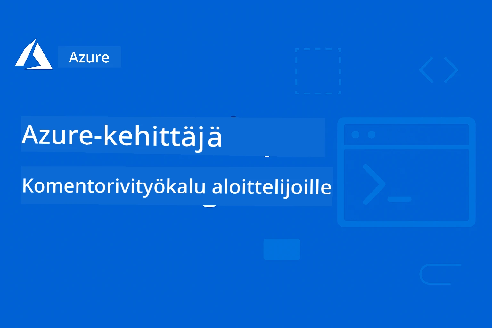

# AZD Aloittelijoille: Jäsennelty Oppimismatka

 

[](https://GitHub.com/microsoft/azd-for-beginners/watchers/)
[](https://GitHub.com/microsoft/azd-for-beginners/network/)
[](https://GitHub.com/microsoft/azd-for-beginners/stargazers/)

[](https://discord.gg/microsoft-azure)
[](https://discord.gg/nTYy5BXMWG)

---

### Automaattiset käännökset (aina ajan tasalla)

<!-- CO-OP TRANSLATOR LANGUAGES TABLE START -->
[Arabic](../ar/README.md) | [Bengali](../bn/README.md) | [Bulgarian](../bg/README.md) | [Burmese (Myanmar)](../my/README.md) | [Chinese (Simplified)](../zh-CN/README.md) | [Chinese (Traditional, Hong Kong)](../zh-HK/README.md) | [Chinese (Traditional, Macau)](../zh-MO/README.md) | [Chinese (Traditional, Taiwan)](../zh-TW/README.md) | [Croatian](../hr/README.md) | [Czech](../cs/README.md) | [Danish](../da/README.md) | [Dutch](../nl/README.md) | [Estonian](../et/README.md) | [Finnish](./README.md) | [French](../fr/README.md) | [German](../de/README.md) | [Greek](../el/README.md) | [Hebrew](../he/README.md) | [Hindi](../hi/README.md) | [Hungarian](../hu/README.md) | [Indonesian](../id/README.md) | [Italian](../it/README.md) | [Japanese](../ja/README.md) | [Kannada](../kn/README.md) | [Korean](../ko/README.md) | [Lithuanian](../lt/README.md) | [Malay](../ms/README.md) | [Malayalam](../ml/README.md) | [Marathi](../mr/README.md) | [Nepali](../ne/README.md) | [Nigerian Pidgin](../pcm/README.md) | [Norwegian](../no/README.md) | [Persian (Farsi)](../fa/README.md) | [Polish](../pl/README.md) | [Portuguese (Brazil)](../pt-BR/README.md) | [Portuguese (Portugal)](../pt-PT/README.md) | [Punjabi (Gurmukhi)](../pa/README.md) | [Romanian](../ro/README.md) | [Russian](../ru/README.md) | [Serbian (Cyrillic)](../sr/README.md) | [Slovak](../sk/README.md) | [Slovenian](../sl/README.md) | [Spanish](../es/README.md) | [Swahili](../sw/README.md) | [Swedish](../sv/README.md) | [Tagalog (Filipino)](../tl/README.md) | [Tamil](../ta/README.md) | [Telugu](../te/README.md) | [Thai](../th/README.md) | [Turkish](../tr/README.md) | [Ukrainian](../uk/README.md) | [Urdu](../ur/README.md) | [Vietnamese](../vi/README.md)

> **Haluatko kloonata paikallisesti?**

> Tämä arkisto sisältää yli 50 käännöstä, mikä kasvattaa latauskokoa merkittävästi. Jos haluat kloonata ilman käännöksiä, käytä sparse checkoutia:
> ```bash
> git clone --filter=blob:none --sparse https://github.com/microsoft/AZD-for-beginners.git
> cd AZD-for-beginners
> git sparse-checkout set --no-cone '/*' '!translations' '!translated_images'
> ```
> Tämä antaa sinulle kaiken mitä tarvitset kurssin suorittamiseen paljon nopeammalla latauksella.
<!-- CO-OP TRANSLATOR LANGUAGES TABLE END -->

## 🚀 Mikä on Azure Developer CLI (azd)?

**Azure Developer CLI (azd)** on kehittäjäystävällinen komentorivityökalu, joka tekee sovellusten käyttöönotosta Azureen helppoa. Sen sijaan, että loisit ja yhdistäisit käsin kymmeniä Azure-resursseja, voit ottaa koko sovelluksen käyttöön yhdellä komennolla.

### `azd up` -komennon taika

```bash
# Tämä yksittäinen komento tekee kaiken:
# ✅ Luo kaikki Azure-resurssit
# ✅ Määrittää verkot ja tietoturvan
# ✅ Kääntää sovelluskoodisi
# ✅ Julkaisee Azureen
# ✅ Antaa sinulle toimivan URL-osoitteen
azd up
```

**Siinä se!** Ei Azure-portaalissa klikkailua, ei monimutkaisia ARM-malleja ensin opittavaksi, eikä manuaalista konfigurointia - vain toimivia sovelluksia Azureen.

---

## ❓ Azure Developer CLI vs Azure CLI: Mikä on ero?

Tämä on yleisin kysymys, jonka aloittelijat esittävät. Tässä yksinkertainen vastaus:

| Feature | **Azure CLI (`az`)** | **Azure Developer CLI (`azd`)** |
|---------|---------------------|--------------------------------|
| **Purpose** | Hallitse yksittäisiä Azure-resursseja | Ota käyttöön kokonaisia sovelluksia |
| **Mindset** | Infrastruktuuriin keskittyvä | Sovellukseen keskittyvä |
| **Example** | `az webapp create --name myapp...` | `azd up` |
| **Learning Curve** | Täytyy tuntea Azure-palvelut | Riittää, että tunnet sovelluksesi |
| **Best For** | DevOps, infrastruktuuri | Kehittäjät, prototypointi |

### Yksinkertainen vertaus

- **Azure CLI** on kuin kaikki työkalut talon rakentamiseen - vasarat, sahat, naulat. Voit rakentaa mitä tahansa, mutta sinun täytyy osata rakentaminen.
- **Azure Developer CLI** on kuin urakoitsijan palkkaaminen - kuvailet mitä haluat, ja he hoitavat rakentamisen.

### Milloin käyttää kumpaakin

| Scenario | Use This |
|----------|----------|
| "I want to deploy my web app quickly" | `azd up` |
| "I need to create just a storage account" | `az storage account create` |
| "I'm building a full AI application" | `azd init --template azure-search-openai-demo` |
| "I need to debug a specific Azure resource" | `az resource show` |
| "I want production-ready deployment in minutes" | `azd up --environment production` |

### Ne toimivat yhdessä!

AZD käyttää Azure CLI:tä taustalla. Voit käyttää molempia:
```bash
# Ota sovelluksesi käyttöön AZD:n avulla
azd up

# Säädä sitten tiettyjä resursseja Azure CLI:llä
az webapp config set --name myapp --always-on true
```

---

## 🌟 Löydä mallipohjat Awesome AZD:stä

Älä aloita tyhjästä! **Awesome AZD** on yhteisön kokoelma valmiita mallipohjia:

| Resource | Description |
|----------|-------------|
| 🔗 [**Awesome AZD Gallery**](https://azure.github.io/awesome-azd/) | Selaa yli 200 mallia ja ota käyttöön yhdellä napsautuksella |
| 🔗 [**Submit a Template**](https://github.com/Azure/awesome-azd/issues) | Lähetä oma mallisi yhteisölle |
| 🔗 [**GitHub Repository**](https://github.com/Azure/awesome-azd) | Lisää tähti ja tutki lähdekoodia |

### Suosittuja tekoälymallipohjia Awesome AZD:stä

```bash
# RAG-keskustelu Azure OpenAI + AI-haku kanssa
azd init --template azure-search-openai-demo

# Nopea AI-keskustelusovellus
azd init --template openai-chat-app-quickstart

# AI-agentteja Foundry-agenttien kanssa
azd init --template get-started-with-ai-agents
```

---

## 🎯 Aloittaminen kolmessa askeleessa

### Vaihe 1: Asenna AZD (2 minuuttia)

**Windows:**
```powershell
winget install microsoft.azd
```

**macOS:**
```bash
brew tap azure/azd && brew install azd
```

**Linux:**
```bash
curl -fsSL https://aka.ms/install-azd.sh | bash
```

### Vaihe 2: Kirjaudu Azureen

```bash
azd auth login
```

### Vaihe 3: Ota ensimmäinen sovelluksesi käyttöön

```bash
# Alusta mallipohjasta
azd init --template todo-nodejs-mongo

# Ota käyttöön Azureen (luo kaiken!)
azd up
```

**🎉 Siinä se!** Sovelluksesi on nyt julkaistu Azureen.

### Siivoa ympäristö (älä unohda!)

```bash
# Remove all resources when done experimenting
azd down --force --purge
```

---

## 📚 Kuinka käyttää tätä kurssia

Tämä kurssi on suunniteltu **etenevään oppimiseen** - aloita siltä tasolta, jossa tunnet olosi mukavaksi, ja etene ylöspäin:

| Your Experience | Start Here |
|-----------------|------------|
| **Brand new to Azure** | [Chapter 1: Foundation](../..) |
| **Know Azure, new to AZD** | [Chapter 1: Foundation](../..) |
| **Want to deploy AI apps** | [Chapter 2: AI-First Development](../..) |
| **Want hands-on practice** | [🎓 Interaktiivinen työpaja](workshop/README.md) - 3-4 tunnin ohjattu lab |
| **Need production patterns** | [Chapter 8: Production & Enterprise](../..) |

### Nopea käyttöönotto

1. **Forkkaa tämä arkisto**: [](https://GitHub.com/microsoft/azd-for-beginners/fork)
2. **Kloonaa se**: `git clone https://github.com/YOUR-USERNAME/azd-for-beginners.git`
3. **Hanki apua**: [Azure Discord -yhteisö](https://discord.com/invite/ByRwuEEgH4)

> **Haluatko kloonata paikallisesti?**

> Tämä arkisto sisältää yli 50 käännöstä, mikä kasvattaa latauskokoa merkittävästi. Jos haluat kloonata ilman käännöksiä, käytä sparse checkoutia:
> ```bash
> git clone --filter=blob:none --sparse https://github.com/microsoft/AZD-for-beginners.git
> cd AZD-for-beginners
> git sparse-checkout set --no-cone '/*' '!translations' '!translated_images'
> ```
> Tämä antaa sinulle kaiken mitä tarvitset kurssin suorittamiseen paljon nopeammalla latauksella.


## Kurssin yleiskatsaus

Hallitse Azure Developer CLI (azd) rakenteellisten lukujen kautta, jotka on suunniteltu etenevään oppimiseen. **Erityinen painotus tekoälysovellusten käyttöönottoon Microsoft Foundry -integraation kanssa.**

### Miksi tämä kurssi on välttämätön nykyaikaisille kehittäjille

Microsoft Foundry Discord -yhteisön näkemyksiin perustuen, **45 % kehittäjistä haluaa käyttää AZD:tä tekoälytyökuormiin**, mutta kohtaa haasteita liittyen:
- Monimutkaiset monipalveluiset tekoälyarkkitehtuurit
- Tuotantovalmiiden tekoälykäyttöönottojen parhaat käytännöt  
- Azure AI -palveluiden integrointi ja konfigurointi
- Kustannusoptimointi tekoälytyökuormille
- Tekoälyspesifisten käyttöönotto-ongelmien vianmääritys

### Oppimistavoitteet

Kurssin suorittamisen jälkeen osaat:
- **Hallita AZD:n perusteet**: ydinkäsitteet, asennus ja konfigurointi
- **Ottaa tekoälysovelluksia käyttöön**: käytä AZD:tä Microsoft Foundryn palveluiden kanssa
- **Toteuttaa Infrastructure as Code -periaatteen**: hallinnoi Azure-resursseja Bicep-malleilla
- **Vianmääritys käyttöönotossa**: ratkaise yleisiä ongelmia ja debuggaa virheitä
- **Optimoida tuotantoa varten**: tietoturva, skaalaus, valvonta ja kustannusten hallinta
- **Rakentaa moni-agenttisia ratkaisuja**: ota käyttöön monimutkaisia tekoälyarkkitehtuureja

## 🗺️ Kurssikartta: Nopea navigointi luvun mukaan

Jokaisella luvulla on oma README, jossa on oppimistavoitteet, pika-aloitukset ja harjoitukset:

| Chapter | Topic | Lessons | Duration | Complexity |
|---------|-------|---------|----------|------------|
| **[Ch 1: Foundation](docs/chapter-01-foundation/README.md)** | Getting Started | [AZD-perusteet](docs/chapter-01-foundation/azd-basics.md) &#124; [Asennus](docs/chapter-01-foundation/installation.md) &#124; [Ensimmäinen projekti](docs/chapter-01-foundation/first-project.md) | 30-45 min | ⭐ |
| **[Ch 2: AI Development](docs/chapter-02-ai-development/README.md)** | Tekoälylähtöiset sovellukset | [Foundry-integraatio](docs/chapter-02-ai-development/microsoft-foundry-integration.md) &#124; [Tekoälyagentit](docs/chapter-02-ai-development/agents.md) &#124; [Mallin käyttöönotto](docs/chapter-02-ai-development/ai-model-deployment.md) &#124; [Työpaja](docs/chapter-02-ai-development/ai-workshop-lab.md) | 1-2 hrs | ⭐⭐ |
| **[Ch 3: Configuration](docs/chapter-03-configuration/README.md)** | Todennus & turvallisuus | [Konfigurointi](docs/chapter-03-configuration/configuration.md) &#124; [Todennus & turvallisuus](docs/chapter-03-configuration/authsecurity.md) | 45-60 min | ⭐⭐ |
| **[Ch 4: Infrastructure](docs/chapter-04-infrastructure/README.md)** | IaC & käyttöönotto | [Käyttöönotto-opas](docs/chapter-04-infrastructure/deployment-guide.md) &#124; [Provisionointi](docs/chapter-04-infrastructure/provisioning.md) | 1-1.5 hrs | ⭐⭐⭐ |
| **[Ch 5: Moni-agentti](docs/chapter-05-multi-agent/README.md)** | AI-agenttiratkaisut | [Vähittäiskaupan skenaario](examples/retail-scenario.md) &#124; [Koordinointimallit](docs/chapter-06-pre-deployment/coordination-patterns.md) | 2-3 tuntia | ⭐⭐⭐⭐ |
| **[Ch 6: Ennen käyttöönottoa](docs/chapter-06-pre-deployment/README.md)** | Suunnittelu ja validointi | [Esitarkistukset](docs/chapter-06-pre-deployment/preflight-checks.md) &#124; [Kapasiteettisuunnittelu](docs/chapter-06-pre-deployment/capacity-planning.md) &#124; [SKU-valinta](docs/chapter-06-pre-deployment/sku-selection.md) &#124; [App Insights](docs/chapter-06-pre-deployment/application-insights.md) | 1 tunti | ⭐⭐ |
| **[Ch 7: Vianetsintä](docs/chapter-07-troubleshooting/README.md)** | Debug & Korjaus | [Yleiset ongelmat](docs/chapter-07-troubleshooting/common-issues.md) &#124; [Debuggaus](docs/chapter-07-troubleshooting/debugging.md) &#124; [AI-ongelmat](docs/chapter-07-troubleshooting/ai-troubleshooting.md) | 1-1.5 tuntia | ⭐⭐ |
| **[Ch 8: Tuotanto](docs/chapter-08-production/README.md)** | Yritystason mallit | [Tuotantokäytännöt](docs/chapter-08-production/production-ai-practices.md) | 2-3 tuntia | ⭐⭐⭐⭐ |
| **[🎓 Workshop](workshop/README.md)** | Käytännön työpaja | [Johdanto](workshop/docs/instructions/0-Introduction.md) &#124; [Valinta](workshop/docs/instructions/1-Select-AI-Template.md) &#124; [Validointi](workshop/docs/instructions/2-Validate-AI-Template.md) &#124; [Purku](workshop/docs/instructions/3-Deconstruct-AI-Template.md) &#124; [Kokoonpano](workshop/docs/instructions/4-Configure-AI-Template.md) &#124; [Mukautus](workshop/docs/instructions/5-Customize-AI-Template.md) &#124; [Purkutoimet](workshop/docs/instructions/6-Teardown-Infrastructure.md) &#124; [Yhteenveto](workshop/docs/instructions/7-Wrap-up.md) | 3-4 tuntia | ⭐⭐ |

**Kokonaiskurssin kesto:** ~10-14 tuntia | **Taidon kehitys:** Aloittelija → Tuotantovalmis

---

## 📚 Oppitunnit

*Valitse oppimispolkusi kokemustason ja tavoitteiden mukaan*

### 🚀 Luku 1: Perusta & pika-aloitus
**Esivaatimukset**: Azure-tilaus, perusosaaminen komentoriviltä  
**Kesto**: 30-45 minuuttia  
**Vaikeustaso**: ⭐

#### Mitä opit
- Azure Developer CLI:n perusteet
- AZD:n asentaminen alustallesi
- Ensimmäinen onnistunut käyttöönotto

#### Oppimateriaalit
- **🎯 Aloita tästä**: [Mikä on Azure Developer CLI?](../..)
- **📖 Teoria**: [AZD-perusteet](docs/chapter-01-foundation/azd-basics.md) - Ydinconceptit ja terminologia
- **⚙️ Asennus**: [Asennus & käyttöönotto](docs/chapter-01-foundation/installation.md) - Alustakohtaiset ohjeet
- **🛠️ Käytännön harjoitus**: [Ensimmäinen projektisi](docs/chapter-01-foundation/first-project.md) - Askel askeleelta -opas
- **📋 Pikalähde**: [Komentojen pikaopas](resources/cheat-sheet.md)

#### Käytännön harjoitukset
```bash
# Nopea asennustarkistus
azd version

# Ota ensimmäinen sovelluksesi käyttöön
azd init --template todo-nodejs-mongo
azd up
```

**💡 Luvun lopputulos**: Onnistuneesti ota käyttöön yksinkertainen web-sovellus Azureen käyttäen AZD:ta

**✅ Onnistumisen varmentaminen:**
```bash
# Luvun 1 suorittamisen jälkeen sinun pitäisi pystyä:
azd version              # Näyttää asennetun version
azd init --template todo-nodejs-mongo  # Alustaa projektin
azd up                  # Julkaisee Azureen
azd show                # Näyttää käynnissä olevan sovelluksen URL-osoitteen
# Sovellus avautuu selaimessa ja toimii
azd down --force --purge  # Siivoaa resurssit
```

**📊 Ajankäyttö:** 30-45 minuuttia  
**📈 Taitotaso lopussa:** Osaa ottaa käyttöön perustason sovelluksia itsenäisesti

**✅ Onnistumisen varmentaminen:**
```bash
# Luku 1:n suorittamisen jälkeen sinun pitäisi osata:
azd version              # Näyttää asennetun version
azd init --template todo-nodejs-mongo  # Alustaa projektin
azd up                  # Julkaisee Azureen
azd show                # Näyttää käynnissä olevan sovelluksen URL-osoitteen
# Sovellus avautuu selaimessa ja toimii
azd down --force --purge  # Siivoaa resurssit
```

**📊 Ajankäyttö:** 30-45 minuuttia  
**📈 Taitotaso lopussa:** Osaa ottaa käyttöön perustason sovelluksia itsenäisesti

---

### 🤖 Luku 2: Tekoäly-etunenäinen kehitys (suositeltu tekoälykehittäjille)
**Esivaatimukset**: Luku 1 suoritettuna  
**Kesto**: 1-2 tuntia  
**Vaikeustaso**: ⭐⭐

#### Mitä opit
- Microsoft Foundryn integrointi AZD:n kanssa
- Tekoälyllä varustettujen sovellusten käyttöönotto
- Tekoälypalvelujen konfiguraatioiden ymmärtäminen

#### Oppimateriaalit
- **🎯 Aloita tästä**: [Microsoft Foundry -integraatio](docs/chapter-02-ai-development/microsoft-foundry-integration.md)
- **🤖 AI-agentit**: [AI-agenttien opas](docs/chapter-02-ai-development/agents.md) - Ota älykkäät agentit käyttöön AZD:lla
- **📖 Mallit**: [AI-mallien käyttöönotto](docs/chapter-02-ai-development/ai-model-deployment.md) - Ota mallit käyttöön ja hallinnoi niitä
- **🛠️ Työpaja**: [AI-työpajan laboratorio](docs/chapter-02-ai-development/ai-workshop-lab.md) - Tee AI-ratkaisuistasi AZD-valmiita
- **🎥 Interaktiivinen opas**: [Työpajamateriaali](workshop/README.md) - Selainpohjaista oppimista MkDocs * DevContainer -ympäristössä
- **📋 Mallipohjat**: [Microsoft Foundry -mallit](../..)
- **📝 Esimerkit**: [AZD:n käyttöönottoesimerkit](examples/README.md)

#### Käytännön harjoitukset
```bash
# Ota ensimmäinen tekoälysovelluksesi käyttöön
azd init --template azure-search-openai-demo
azd up

# Kokeile lisää tekoälymallipohjia
azd init --template openai-chat-app-quickstart
azd init --template agent-openai-python-prompty
```

**💡 Luvun lopputulos**: Ota käyttöön ja konfiguroi tekoälyllä toimiva chat-sovellus RAG-ominaisuuksilla

**✅ Onnistumisen varmentaminen:**
```bash
# Luvun 2 jälkeen sinun pitäisi osata:
azd init --template azure-search-openai-demo
azd up
# Testata tekoälychatin käyttöliittymää
# Esittää kysymyksiä ja saada tekoälyn tuottamia vastauksia lähteineen
# Varmistaa hakujen integroinnin toimivuus
azd monitor  # Tarkistaa, että Application Insights näyttää telemetriaa
azd down --force --purge
```

**📊 Ajankäyttö:** 1-2 tuntia  
**📈 Taitotaso lopussa:** Osaa ottaa käyttöön ja konfiguroida tuotantovalmiita tekoälysovelluksia  
**💰 Kustannustietoisuus:** Arvioi kehityskustannukset $80-150/kk, tuotantokustannukset $300-3500/kk

#### 💰 Kustannusnäkökohdat AI-käyttöönottoihin

**Kehitysympäristö (Arvio ~ $80-150/kk):**
- Azure OpenAI (Maksa käytön mukaan): $0-50/kk (riippuen tokenien käytöstä)
- AI Search (perustaso): $75/kk
- Container Apps (kulutus): $0-20/kk
- Tallennustila (Standard): $1-5/kk

**Tuotantoympäristö (Arvio ~ $300-3,500+/kk):**
- Azure OpenAI (PTU taso tasaisen suorituskyvyn varten): $3,000+/kk TAI Maksa käytön mukaan suurilla volyymeilla
- AI Search (standard-taso): $250/kk
- Container Apps (dedikoitu): $50-100/kk
- Application Insights: $5-50/kk
- Tallennustila (Premium): $10-50/kk

**💡 Kustannusten optimointivinkkejä:**
- Käytä **Free Tier** -Azure OpenAI:ta oppimiseen (50,000 tokenia/kk sisältyy)
- Suorita `azd down` vapauttaaksesi resursseja, kun et kehitä aktiivisesti
- Aloita kulutusperusteisella laskutuksella, nosta PTU-tasolle vain tuotantoon
- Käytä `azd provision --preview` arvioidaksesi kustannuksia ennen käyttöönottoa
- Ota automaattiskalautuvuus käyttöön: maksa vain todellisesta käytöstä

**Kustannusten seuranta:**
```bash
# Tarkista arvioidut kuukausittaiset kustannukset
azd provision --preview

# Seuraa todellisia kustannuksia Azure-portaalissa
az consumption budget list --resource-group <your-rg>
```

---

### ⚙️ Luku 3: Konfigurointi & autentikointi
**Esivaatimukset**: Luku 1 suoritettuna  
**Kesto**: 45-60 minuuttia  
**Vaikeustaso**: ⭐⭐

#### Mitä opit
- Ympäristön konfigurointi ja hallinta
- Autentikointi ja tietoturvan parhaat käytännöt
- Resurssien nimeäminen ja organisointi

#### Oppimateriaalit
- **📖 Konfigurointi**: [Konfigurointiohje](docs/chapter-03-configuration/configuration.md) - Ympäristön asetukset
- **🔐 Turvallisuus**: [Autentikointimallit ja hallinnoitu identiteetti](docs/chapter-03-configuration/authsecurity.md) - Autentikointimallit
- **📝 Esimerkit**: [Tietokantasovellus-esimerkki](examples/database-app/README.md) - AZD-tietokantaesimerkit

#### Käytännön harjoitukset
- Konfiguroi useita ympäristöjä (dev, staging, prod)
- Ota hallinnoitu identiteetti käyttöön autentikointiin
- Toteuta ympäristökohtaiset konfiguraatiot

**💡 Luvun lopputulos**: Hallitse useita ympäristöjä asianmukaisella autentikoinnilla ja tietoturvalla

---

### 🏗️ Luku 4: Infrastruktuuri koodina & käyttöönotto
**Esivaatimukset**: Luvut 1-3 suoritettuina  
**Kesto**: 1-1.5 tuntia  
**Vaikeustaso**: ⭐⭐⭐

#### Mitä opit
- Edistyneet käyttöönotto-mallit
- Infrastruktuuri koodina Bicep:llä
- Resurssien provisiointistrategiat

#### Oppimateriaalit
- **📖 Käyttöönotto**: [Käyttöönotto-opas](docs/chapter-04-infrastructure/deployment-guide.md) - Kokonaiset työnkulut
- **🏗️ Provisiointi**: [Resurssien provisiointi](docs/chapter-04-infrastructure/provisioning.md) - Azure-resurssien hallinta
- **📝 Esimerkit**: [Container App -esimerkki](../../examples/container-app) - Konttipohjaiset käyttöönotot

#### Käytännön harjoitukset
- Luo mukautettuja Bicep-malleja
- Ota käyttöön monipalvelusovelluksia
- Toteuta blue-green -käyttöönotto-strategioita

**💡 Luvun lopputulos**: Ota käyttöön monimutkaisia monipalvelusovelluksia käyttäen mukautettuja infrastruktuurimalleja

---

### 🎯 Luku 5: Moni-agenttiset tekoälyratkaisut (Edistynyt)
**Esivaatimukset**: Luvut 1-2 suoritettuna  
**Kesto**: 2-3 tuntia  
**Vaikeustaso**: ⭐⭐⭐⭐

#### Mitä opit
- Moni-agenttiarkkitehtuurin mallit
- Agenttien orkestrointi ja koordinointi
- Tuotantovalmiit tekoälykäyttöönotot

#### Oppimateriaalit
- **🤖 Esitelty projekti**: [Vähittäiskaupan moni-agenttiratkaisu](examples/retail-scenario.md) - Täydellinen toteutus
- **🛠️ ARM-mallit**: [ARM-mallipaketti](../../examples/retail-multiagent-arm-template) - Yhden klikkauksen käyttöönotto
- **📖 Arkkitehtuuri**: [Moni-agenttien koordinointimallit](docs/chapter-06-pre-deployment/coordination-patterns.md) - Mallit

#### Käytännön harjoitukset
```bash
# Ota käyttöön täydellinen vähittäiskaupan moniagenttiratkaisu
cd examples/retail-multiagent-arm-template
./deploy.sh

# Tutki agenttien kokoonpanoja
az deployment group show --resource-group <rg-name> --name <deployment-name>
```

**💡 Luvun lopputulos**: Ota käyttöön ja hallinnoi tuotantovalmiita moni-agenttisia tekoälyratkaisuja, joissa on Asiakas- ja Varasto-agentit

---

### 🔍 Luku 6: Esiennakointi: validointi & suunnittelu
**Esivaatimukset**: Luku 4 suoritettuna  
**Kesto**: 1 tunti  
**Vaikeustaso**: ⭐⭐

#### Mitä opit
- Kapasiteettisuunnittelu ja resurssien validointi
- SKU-valintastrategiat
- Esitarkistukset ja automaatio

#### Oppimateriaalit
- **📊 Suunnittelu**: [Kapasiteettisuunnittelu](docs/chapter-06-pre-deployment/capacity-planning.md) - Resurssien validointi
- **💰 Valinta**: [SKU-valinta](docs/chapter-06-pre-deployment/sku-selection.md) - Kustannustehokkaat valinnat
- **✅ Validointi**: [Esitarkistukset](docs/chapter-06-pre-deployment/preflight-checks.md) - Automaattiset skriptit

#### Käytännön harjoitukset
- Suorita kapasiteetin validointiskriptit
- Optimoi SKU-valinnat kustannusten mukaan
- Toteuta automatisoidut esitarkistukset

**💡 Luvun lopputulos**: Varmista ja optimoi käyttöönotot ennen toteutusta

---

### 🚨 Luku 7: Vianetsintä & debuggaus
**Esivaatimukset**: Mikä tahansa käyttöönotto-luku suoritettuna  
**Kesto**: 1-1.5 tuntia  
**Vaikeustaso**: ⭐⭐

#### Mitä opit
- Systemaattiset debuggausmenetelmät
- Yleiset ongelmat ja ratkaisut
- Tekoälyyn liittyvä vianetsintä

#### Oppimateriaalit
- **🔧 Yleiset ongelmat**: [Yleiset ongelmat](docs/chapter-07-troubleshooting/common-issues.md) - UKK ja ratkaisut
- **🕵️ Debuggaus**: [Debuggausopas](docs/chapter-07-troubleshooting/debugging.md) - Askelsarjat strategiat
- **🤖 AI-ongelmat**: [Tekoälykohtainen vianetsintä](docs/chapter-07-troubleshooting/ai-troubleshooting.md) - Tekoälypalvelujen ongelmat

#### Käytännön harjoitukset
- Diagnosoi käyttöönoton virheitä
- Ratkaise autentikointiongelmia
- Debuggaa tekoälypalveluiden yhteyksiä

**💡 Luvun lopputulos**: Diagnoosi ja ratkaise yleisiä käyttöönotto-ongelmia itsenäisesti

---

### 🏢 Luku 8: Tuotanto & yritystason mallit
**Esivaatimukset**: Luvut 1-4 suoritettuina  
**Kesto**: 2-3 tuntia  
**Vaikeustaso**: ⭐⭐⭐⭐

#### Mitä opit
- Tuotantokäyttöönotto-strategiat
- Yritystason tietoturvamallit
- Seuranta ja kustannusoptimointi

#### Oppimateriaalit
- **🏭 Tuotanto**: [Tuotannon tekoälyn parhaat käytännöt](docs/chapter-08-production/production-ai-practices.md) - Yritystason mallit
- **📝 Esimerkit**: [Mikropalveluesimerkki](../../examples/microservices) - Monimutkaiset arkkitehtuurit
- **📊 Seuranta**: [Application Insights -integraatio](docs/chapter-06-pre-deployment/application-insights.md) - Seuranta

#### Käytännön harjoitukset
- Toteuta yritystason tietoturvakäytännöt
- Ota käyttöön kattava seuranta
- Ota tuotantoon hallinnoidulla hallinnolla

**💡 Luvun lopputulos**: Ota käyttöön yritysvalmiita sovelluksia täydellisillä tuotanto-ominaisuuksilla

---

## 🎓 Työpajan yleiskatsaus: Käytännön oppimiskokemus

> **⚠️ TYÖPAJAN TILA: Kehitteillä**  
> Työpajamateriaalit ovat parhaillaan kehitysvaiheessa ja viimeistelyssä. Ydintuotokset toimivat, mutta jotkin edistyneet osiot ovat keskeneräisiä. Työskentelemme aktiivisesti sisällön täydentämiseksi. [Seuraa edistymistä →](workshop/README.md)

### Interaktiiviset työpajamateriaalit
**Kattava käytännön oppiminen selainpohjaisilla työkaluilla ja ohjatuilla harjoituksilla**
Our workshop materials provide a structured, interactive learning experience that complements the chapter-based curriculum above. The workshop is designed for both self-paced learning and instructor-led sessions.

#### 🛠️ Työpajan ominaisuudet
- **Selainpohjainen käyttöliittymä**: Complete MkDocs-powered workshop with search, copy, and theme features
- **GitHub Codespaces -integraatio**: One-click development environment setup
- **Jäsennelty oppimispolku**: 8-module guided exercises (3-4 hours total)
- **Progressiivinen metodologia**: Johdanto → Valinta → Vahvistus → Rakenteen purku → Konfigurointi → Mukauttaminen → Siivoaminen → Yhteenveto
- **Interaktiivinen DevContainer-ympäristö**: Pre-configured tools and dependencies

#### 📚 Työpajan moduulirakenne
Työpaja noudattaa **8-moduulista progressiivista menetelmää**, joka vie sinut löytämisestä käyttöönoton hallintaan:

| Module | Topic | What You'll Do | Duration |
|--------|-------|----------------|----------|
| **0. Johdanto** | Työpajan yleiskatsaus | Ymmärrä oppimistavoitteet, vaatimukset ja työpajan rakenne | 15 min |
| **1. Valinta** | Mallien löytäminen | Tutki AZD-malleja ja valitse oikea AI-templaatti käyttötapaukseesi | 20 min |
| **2. Vahvistus** | Ota käyttöön & Varmista | Ota templaatti käyttöön komennolla `azd up` ja varmista, että infrastruktuuri toimii | 30 min |
| **3. Rakenteen purku** | Ymmärrä rakenne | Käytä GitHub Copilotia tutkiaksesi mallin arkkitehtuuria, Bicep-tiedostoja ja koodin järjestelyä | 30 min |
| **4. Konfigurointi** | azure.yaml -syväluotaus | Hallitse `azure.yaml`-konfigurointi, elinkaarikoukut ja ympäristömuuttujat | 30 min |
| **5. Mukauttaminen** | Tee se omaksesi | Ota käyttöön AI Search, jäljitys, arviointi ja mukauta käyttötapaustasi varten | 45 min |
| **6. Purku** | Siivoa | Poista resurssit turvallisesti komennolla `azd down --purge` | 15 min |
| **7. Yhteenveto** | Seuraavat askeleet | Käsittele saavutukset, keskeiset käsitteet ja jatka oppimispolkua | 15 min |

**Workshop Flow:**
```
Introduction → Selection → Validation → Deconstruction → Configuration → Customization → Teardown → Wrap-up
     ↓            ↓           ↓              ↓               ↓              ↓            ↓           ↓
  Overview    Find the     Deploy &      Explore        Master         Customize     Clean up    Review &
             right        verify        code &        azure.yaml      for your      resources   next steps
             template                   structure                     scenario
```

#### 🚀 Työpajan aloittaminen
```bash
# Vaihtoehto 1: GitHub Codespaces (suositeltu)
# Napsauta repositorion "Code" → "Create codespace on main"

# Vaihtoehto 2: Paikallinen kehitys
git clone https://github.com/microsoft/azd-for-beginners.git
cd azd-for-beginners/workshop
# Noudata workshop/README.md-tiedoston asennusohjeita
```

#### 🎯 Työpajan oppimistavoitteet
Työpajan suorittamisen jälkeen osallistujat:
- **Ota tuotantotekoälysovellukset käyttöön**: Use AZD with Microsoft Foundry services
- **Hallinnoi moni-agenttiarkkitehtuureja**: Implement coordinated AI agent solutions
- **Ota tietoturvan parhaat käytännöt käyttöön**: Configure authentication and access control
- **Optimoi skaalausta varten**: Design cost-effective, performant deployments
- **Vianmääritys käyttöönottoihin**: Resolve common issues independently

#### 📖 Työpajan resurssit
- **🎥 Interaktiivinen opas**: [Työpajan materiaalit](workshop/README.md) - Selainpohjainen oppimisympäristö
- **📋 Moduulikohtaiset ohjeet**:
  - [0. Johdanto](workshop/docs/instructions/0-Introduction.md) - Työpajan yleiskatsaus ja tavoitteet
  - [1. Valinta](workshop/docs/instructions/1-Select-AI-Template.md) - Etsi ja valitse AI-templaatteja
  - [2. Vahvistus](workshop/docs/instructions/2-Validate-AI-Template.md) - Ota templaatti käyttöön ja varmista
  - [3. Rakenteen purku](workshop/docs/instructions/3-Deconstruct-AI-Template.md) - Tutki mallin arkkitehtuuria
  - [4. Konfigurointi](workshop/docs/instructions/4-Configure-AI-Template.md) - Hallitse azure.yaml
  - [5. Mukauttaminen](workshop/docs/instructions/5-Customize-AI-Template.md) - Mukauta käyttötapaustasi
  - [6. Purku](workshop/docs/instructions/6-Teardown-Infrastructure.md) - Siivoa resurssit
  - [7. Yhteenveto](workshop/docs/instructions/7-Wrap-up.md) - Kertaus ja seuraavat askeleet
- **🛠️ AI-työpajalaboratorio**: [AI Workshop Lab](docs/chapter-02-ai-development/ai-workshop-lab.md) - AI-keskeiset harjoitukset
- **💡 Nopea aloitus**: [Työpajan asennusopas](workshop/README.md#quick-start) - Ympäristön konfigurointi

**Sopii erinomaisesti**: Yrityskoulutuksiin, yliopistokursseille, itseopiskeluun ja kehittäjäbootcampeihin.

---

## 📖 Syväluotaus: AZD:n ominaisuudet

Perusteiden lisäksi AZD tarjoaa tehokkaita ominaisuuksia tuotantokäyttöön tarkoitettuihin käyttöönottoihin:

- **Templaatteihin perustuvat käyttöönotot** - Käytä valmiita malleja yleisiin sovelluskuvioihin
- **Infrastruktuuri koodina** - Hallitse Azure-resursseja käyttämällä Bicep- tai Terraform-työkaluja  
- **Integroitu työnkulut** - Provisionoi, ota käyttöön ja valvo sovelluksia saumattomasti
- **Kehittäjäystävällinen** - Optimoitu kehittäjien tuottavuudelle ja käyttökokemukselle

### **AZD + Microsoft Foundry: Ihanteellinen tekoälykäyttöönottoihin**

**Miksi AZD tekoälyratkaisuihin?** AZD käsittelee tekoälykehittäjien tärkeimpiä haasteita:

- **AI-valmiit mallipohjat** - Esikonfiguroidut mallipohjat Azure OpenAI:lle, Cognitive Servicesille ja ML-kuormituksille
- **Turvalliset tekoälykäyttöönotot** - Sisäänrakennetut turvallisuusmallit tekoälypalveluille, API-avaimille ja mallien päätepisteille  
- **Tuotannon tekoälykuviot** - Parhaat käytännöt skaalautuviin, kustannustehokkaisiin tekoälysovellusten käyttöönottoihin
- **End-to-End -tekoälytyönkulut** - Mallin kehityksestä tuotantoon käyttöönottoon asianmukaisella valvonnalla
- **Kustannusoptimointi** - Älykkäät resurssien kohdistus- ja skaalausstrategiat tekoälyn kuormituksiin
- **Microsoft Foundry -integraatio** - Saumaton yhteys Microsoft Foundryn malliluetteloon ja päätepisteisiin

---

## 🎯 Mallipohjat & esimerkkikirjasto

### Esitellyt: Microsoft Foundry -mallit
**Aloita tästä, jos otat tekoälysovelluksia käyttöön!**

> **Huom:** Nämä templaattiesimerkit demonstroivat erilaisia tekoälykuvioita. Osa on ulkoisia Azure Samples -repositoreita, osa paikallisia toteutuksia.

| Template | Chapter | Complexity | Services | Type |
|----------|---------|------------|----------|------|
| [**Aloita AI-chatin kanssa**](https://github.com/Azure-Samples/get-started-with-ai-chat) | Luku 2 | ⭐⭐ | AzureOpenAI + Azure AI Model Inference API + Azure AI Search + Azure Container Apps + Application Insights | Ulkoinen |
| [**Get started with AI agents**](https://github.com/Azure-Samples/get-started-with-ai-agents) | Luku 2 | ⭐⭐ | Foundry Agents + AzureOpenAI + Azure AI Search + Azure Container Apps + Application Insights| Ulkoinen |
| [**Azure Search + OpenAI Demo**](https://github.com/Azure-Samples/azure-search-openai-demo) | Luku 2 | ⭐⭐ | AzureOpenAI + Azure AI Search + App Service + Storage | Ulkoinen |
| [**OpenAI Chat App Quickstart**](https://github.com/Azure-Samples/openai-chat-app-quickstart) | Luku 2 | ⭐ | AzureOpenAI + Container Apps + Application Insights | Ulkoinen |
| [**Agent OpenAI Python Prompty**](https://github.com/Azure-Samples/agent-openai-python-prompty) | Luku 5 | ⭐⭐⭐ | AzureOpenAI + Azure Functions + Prompty | Ulkoinen |
| [**Contoso Chat RAG**](https://github.com/Azure-Samples/contoso-chat) | Luku 8 | ⭐⭐⭐⭐ | AzureOpenAI + AI Search + Cosmos DB + Container Apps | Ulkoinen |
| [**Vähittäiskaupan moni-agenttiratkaisu**](examples/retail-scenario.md) | Luku 5 | ⭐⭐⭐⭐ | AzureOpenAI + AI Search + Storage + Container Apps + Cosmos DB | **Paikallinen** |

### Esitellyt: Täydelliset oppimistilanteet
**Tuotantovalmiit sovellusmallit kartoitettuna oppimislukuihin**

| Template | Learning Chapter | Complexity | Key Learning |
|----------|------------------|------------|--------------|
| [**openai-chat-app-quickstart**](https://github.com/Azure-Samples/openai-chat-app-quickstart) | Luku 2 | ⭐ | Perus AI-käyttöönoton mallit |
| [**azure-search-openai-demo**](https://github.com/Azure-Samples/azure-search-openai-demo) | Luku 2 | ⭐⭐ | RAG-implementaatio Azure AI Searchilla |
| [**ai-document-processing**](https://github.com/Azure-Samples/ai-document-processing) | Luku 4 | ⭐⭐ | Document Intelligence -integraatio |
| [**agent-openai-python-prompty**](https://github.com/Azure-Samples/agent-openai-python-prompty) | Luku 5 | ⭐⭐⭐ | Agenttikehys ja funktiokutsut |
| [**contoso-chat**](https://github.com/Azure-Samples/contoso-chat) | Luku 8 | ⭐⭐⭐ | Yritystason tekoälyorkestrointi |
| [**retail-multi-agent-solution**](examples/retail-scenario.md) | Luku 5 | ⭐⭐⭐⭐ | Moni-agenttiarkkitehtuuri Customer- ja Inventory-agenteilla |

### Oppiminen esimerkin mukaan

> **📌 Paikalliset vs. ulkoiset esimerkit:**  
> **Paikalliset esimerkit** (tässä repossa) = Valmiita käyttää välittömästi  
> **Ulkoiset esimerkit** (Azure Samples) = Kloonaa linkatuista repositoreista

#### Paikalliset esimerkit (valmiit käytettäväksi)
- [**Vähittäiskaupan moni-agenttiratkaisu**](examples/retail-scenario.md) - Täydellinen tuotantovalmiin toteutus ARM-malleilla
  - Moni-agenttiarkkitehtuuri (Customer + Inventory agents)
  - Kattava valvonta ja arviointi
  - Yhden napsautuksen käyttöönotto ARM-mallilla

#### Paikalliset esimerkit - Container-sovellukset (luvut 2-5)
**Kattavat konttisovellusten käyttöönottoesimerkit tässä repossa:**
- [**Konttisovellus-esimerkit**](examples/container-app/README.md) - Täydellinen opas konttipohjaisiin käyttöönottoihin
  - [Yksinkertainen Flask-API](../../examples/container-app/simple-flask-api) - Perus REST-API, joka tukee scale-to-zero
  - [Mikropalveluarkkitehtuuri](../../examples/container-app/microservices) - Tuotantovalmiit monipalvelukäyttöönotot
  - Nopea aloitus, tuotanto, ja edistyneet käyttöönotto-kuviot
  - Valvonta-, turvallisuus- ja kustannusoptimointiohjeet

#### Ulkoiset esimerkit - Yksinkertaiset sovellukset (luvut 1-2)
**Kloonaa nämä Azure Samples -repositoriot aloittaaksesi:**
- [Yksinkertainen Web App - Node.js + MongoDB](https://github.com/Azure-Samples/todo-nodejs-mongo) - Perus käyttöönoton mallit
- [Staattinen verkkosivusto - React SPA](https://github.com/Azure-Samples/todo-csharp-sql-swa-func) - Staattisen sisällön käyttöönotto
- [Container App - Python Flask](https://github.com/Azure-Samples/container-apps-store-api-microservice) - REST-API:n käyttöönotto

#### Ulkoiset esimerkit - Tietokantaintegraatio (luvut 3-4)  
- [Database App - C# + SQL](https://github.com/Azure-Samples/todo-csharp-sql) - Tietokantayhteyskuviot
- [Functions + Cosmos DB](https://github.com/Azure-Samples/todo-python-mongo-swa-func) - Serverless-tietotyönkulku

#### Ulkoiset esimerkit - Edistyneet kuviot (luvut 4-8)
- [Java Microservices](https://github.com/Azure-Samples/java-microservices-aca-lab) - Monipalveluarkkitehtuurit
- [Container Apps Jobs](https://github.com/Azure-Samples/container-apps-jobs) - Taustaprosessointi  
- [Enterprise ML Pipeline](https://github.com/Azure-Samples/mlops-v2) - Tuotantovalmiit ML-mallit

### Ulkoiset templaattikokoelmat
- [**Virallinen AZD Template Gallery**](https://azure.github.io/awesome-azd/) - Kuraattu kokoelma virallisista ja yhteisön templaateista
- [**Azure Developer CLI Templates**](https://learn.microsoft.com/en-us/azure/developer/azure-developer-cli/azd-templates) - Microsoft Learn -templaattidokumentaatio
- [**Esimerkkihakemisto**](examples/README.md) - Paikalliset oppimisesimerkit yksityiskohtaisine selityksineen

---

## 📚 Oppimateriaalit & viitteet

### Pikaviitteet
- [**Komentojen pikaopas**](resources/cheat-sheet.md) - Keskeiset azd-komennot järjestetty luvuittain
- [**Sanasto**](resources/glossary.md) - Azure- ja azd-terminologia  
- [**UKK**](resources/faq.md) - Yleisimmät kysymykset järjestetty luvuittain
- [**Opiskelijan opas**](resources/study-guide.md) - Kattavat harjoitustehtävät

### Käytännön työpajat
- [**AI-työpajalaboratorio**](docs/chapter-02-ai-development/ai-workshop-lab.md) - Tee tekoälyratkaisusi AZD-käyttöönottovalmiiksi (2-3 hours)
- [**Interaktiivinen työpaja**](workshop/README.md) - 8-module guided exercises with MkDocs and GitHub Codespaces
  - Seuraa: Johdanto → Valinta → Vahvistus → Rakenteen purku → Konfigurointi → Mukauttaminen → Purku → Yhteenveto

### Ulkoiset oppimisresurssit
- [Azure Developer CLI -dokumentaatio](https://learn.microsoft.com/en-us/azure/developer/azure-developer-cli/)
- [Azure-arkkitehtuurikeskus](https://learn.microsoft.com/en-us/azure/architecture/)
- [Azure-hinnoittelulaskin](https://azure.microsoft.com/pricing/calculator/)
- [Azure-tila](https://status.azure.com/)

---

## 🔧 Pikainen vianmääritysohje

**Yleiset aloittelijoiden kohtaamat ongelmat ja välittömät ratkaisut:**

<details>
<summary><strong>❌ "azd: command not found"</strong></summary>

```bash
# Asenna AZD ensin
# Windows (PowerShell):
winget install microsoft.azd

# macOS:
brew tap azure/azd && brew install azd

# Linux:
curl -fsSL https://aka.ms/install-azd.sh | bash

# Tarkista asennus
azd version
```
</details>

<details>
<summary><strong>❌ "No subscription found" or "Subscription not set"</strong></summary>

```bash
# Luettele saatavilla olevat tilaukset
az account list --output table

# Aseta oletustilaus
az account set --subscription "<subscription-id-or-name>"

# Aseta AZD-ympäristöä varten
azd env set AZURE_SUBSCRIPTION_ID "<subscription-id>"

# Tarkista
az account show
```
</details>

<details>
<summary><strong>❌ "InsufficientQuota" or "Quota exceeded"</strong></summary>

```bash
# Kokeile eri Azure-aluetta
azd env set AZURE_LOCATION "westus2"
azd up

# Tai käytä kehityksessä pienempiä SKUja
# Muokkaa infra/main.parameters.json:
{
  "sku": "B1"  // Instead of "P1V2"
}
```
</details>

<details>
<summary><strong>❌ "azd up" fails halfway through</strong></summary>
```bash
# Vaihtoehto 1: Siivoa ja yritä uudelleen
azd down --force --purge
azd up

# Vaihtoehto 2: Korjaa vain infrastruktuuri
azd provision

# Vaihtoehto 3: Tarkista yksityiskohtainen tila
azd show

# Vaihtoehto 4: Tarkista lokit Azure Monitorissa
azd monitor --logs
```
</details>

<details>
<summary><strong>❌ "Todennus epäonnistui" tai "Tunnus vanhentunut"</strong></summary>

```bash
# Tunnistaudu uudelleen
az logout
az login

azd auth logout
azd auth login

# Varmista todennus
az account show
```
</details>

<details>
<summary><strong>❌ "Resurssi on jo olemassa" tai nimeämiskonfliktit</strong></summary>

```bash
# AZD luo ainutlaatuisia nimiä, mutta jos tulee ristiriita:
azd down --force --purge

# Sitten yritä uudelleen uudella ympäristöllä
azd env new dev-v2
azd up
```
</details>

<details>
<summary><strong>❌ Mallin käyttöönotto kestää liian kauan</strong></summary>

**Normaalit odotusajat:**
- Yksinkertainen web-sovellus: 5–10 minuuttia
- Sovellus, jossa on tietokanta: 10–15 minuuttia
- Tekoälysovellukset: 15–25 minuuttia (OpenAI:n provisiointi on hidasta)

```bash
# Tarkista edistyminen
azd show

# Jos olet jumissa yli 30 minuutin ajan, tarkista Azure-portaali:
azd monitor
# Etsi epäonnistuneita käyttöönottoja
```
</details>

<details>
<summary><strong>❌ "Lupa evätty" tai "Kielletty"</strong></summary>

```bash
# Tarkista Azure-roolisi
az role assignment list --assignee $(az account show --query user.name -o tsv)

# Tarvitset vähintään "Contributor"-roolin
# Pyydä Azure-järjestelmänvalvojaasi myöntämään:
# - Contributor (resursseille)
# - User Access Administrator (roolimäärityksiä varten)
```
</details>

<details>
<summary><strong>❌ Käyttöönotetun sovelluksen URL-osoitetta ei löydy</strong></summary>

```bash
# Näytä kaikki palvelun päätepisteet
azd show

# Tai avaa Azure-portaali
azd monitor

# Tarkista tietty palvelu
azd env get-values
# Etsi *_URL-muuttujia
```
</details>

### 📚 Kattavat vianmääritysresurssit

- **Yleisimmät ongelmat -opas:** [Yksityiskohtaiset ratkaisut](docs/chapter-07-troubleshooting/common-issues.md)
- **AI-spesifiset ongelmat:** [AI-vianmääritys](docs/chapter-07-troubleshooting/ai-troubleshooting.md)
- **Vianetsintäopas:** [Vaiheittainen vianetsintä](docs/chapter-07-troubleshooting/debugging.md)
- **Hanki apua:** [Azure Discord](https://discord.gg/microsoft-azure) #azure-developer-cli

---

## 🎓 Kurssin suorittaminen & sertifiointi

### Edistymisen seuranta
Seuraa oppimisesi edistymistä jokaisen luvun kohdalla:

- [ ] **Luku 1**: Perusteet & Pika-aloitus ✅
- [ ] **Luku 2**: Tekoälylähtöinen kehitys ✅  
- [ ] **Luku 3**: Konfigurointi & todennus ✅
- [ ] **Luku 4**: Infrastruktuuri koodina & käyttöönotto ✅
- [ ] **Luku 5**: Moni-agenttiset tekoälyratkaisut ✅
- [ ] **Luku 6**: Ennakkotarkastus & suunnittelu ✅
- [ ] **Luku 7**: Vianmääritys & vianetsintä ✅
- [ ] **Luku 8**: Tuotanto & yritystason mallit ✅

### Oppimisen varmistus
Kun olet suorittanut kunkin luvun, varmista osaamisesi seuraavasti:
1. **Käytännön harjoitus**: Suorita luvun käytännön käyttöönotto
2. **Osaamistarkastus**: Käy läpi luvun UKK-osio
3. **Yhteisökeskustelu**: Jaa kokemuksesi Azure Discordissa
4. **Seuraava luku**: Siirry seuraavaan vaativuustasoon

### Kurssin suorittamisen edut
Kun olet suorittanut kaikki luvut, sinulla on:
- **Tuotantokokemus**: Olet ottanut tuotantokäyttöön oikeita tekoälysovelluksia Azureen
- **Ammatilliset taidot**: Yritysvalmiit käyttöönotto-taidot  
- **Yhteisön tunnustus**: Aktiivinen jäsen Azure-kehittäjäyhteisössä
- **Uramahdollisuudet**: Kysytty AZD- ja tekoälykäyttöönotto-osaaminen

---

## 🤝 Yhteisö & tuki

### Hanki apua & tuki
- **Tekniset ongelmat**: [Ilmoita bugeista ja pyydä ominaisuuksia](https://github.com/microsoft/azd-for-beginners/issues)
- **Oppimiskysymykset**: [Microsoft Azure Discord -yhteisö](https://discord.gg/microsoft-azure) ja [](https://discord.gg/nTYy5BXMWG)
- **AI-spesifinen apu**: Liity [](https://discord.gg/nTYy5BXMWG)
- **Dokumentaatio**: [Virallinen Azure Developer CLI -dokumentaatio](https://learn.microsoft.com/en-us/azure/developer/azure-developer-cli/)

### Yhteisön oivalluksia Microsoft Foundry Discordista

**Viimeaikaiset kyselyn tulokset #Azure-kanavalta:**
- **45%** kehittäjistä haluaa käyttää AZD:ta tekoälytyökuormiin
- **Suurimmat haasteet**: Monipalveluiden käyttöönotot, tunnushallinta, tuotantovalmius  
- **Eniten pyydetyt**: Tekoälykohtaiset mallipohjat, vianmääritysoppaat, parhaat käytännöt

**Liity yhteisöömme ja voit:**
- Jaa AZD- ja tekoälykokemuksesi ja saa apua
- Pääsy uusien tekoälymallipohjien varhaisiin esikatseluihin
- Osallistu tekoälyn käyttöönoton parhaiden käytäntöjen kehittämiseen
- Vaikuta tuleviin AI + AZD -ominaisuuksiin

### Osallistuminen kurssin kehittämiseen
Tervetuloa tekemään kontribuutioita! Lue lisätietoja [Osallistumisoppaastamme](CONTRIBUTING.md) koskien:
- **Sisällön parannukset**: Paranna olemassa olevia lukuja ja esimerkkejä
- **Uudet esimerkit**: Lisää todellisen maailman skenaarioita ja mallipohjia  
- **Käännökset**: Auta ylläpitämään monikielistä tukea
- **Bugit**: Paranna tarkkuutta ja selkeyttä
- **Yhteisön säännöt**: Noudata osallistavia yhteisöohjeitamme

---

## 📄 Kurssitiedot

### Lisenssi
Tämä projekti on lisensoitu MIT-lisenssillä - katso lisätiedot [LICENSE](../../LICENSE) -tiedostosta.

### Liittyvät Microsoftin oppimisresurssit

Tiimimme tuottaa myös muita kattavia oppimiskursseja:

<!-- CO-OP TRANSLATOR OTHER COURSES START -->
### LangChain
[](https://aka.ms/langchain4j-for-beginners)
[](https://aka.ms/langchainjs-for-beginners?WT.mc_id=m365-94501-dwahlin)
[](https://github.com/microsoft/langchain-for-beginners?WT.mc_id=m365-94501-dwahlin)
---

### Azure / Edge / MCP / Agentit
[](https://github.com/microsoft/AZD-for-beginners?WT.mc_id=academic-105485-koreyst)
[](https://github.com/microsoft/edgeai-for-beginners?WT.mc_id=academic-105485-koreyst)
[](https://github.com/microsoft/mcp-for-beginners?WT.mc_id=academic-105485-koreyst)
[](https://github.com/microsoft/ai-agents-for-beginners?WT.mc_id=academic-105485-koreyst)

---
 
### Generatiivinen AI -sarja
[](https://github.com/microsoft/generative-ai-for-beginners?WT.mc_id=academic-105485-koreyst)
[-9333EA?style=for-the-badge&labelColor=E5E7EB&color=9333EA)](https://github.com/microsoft/Generative-AI-for-beginners-dotnet?WT.mc_id=academic-105485-koreyst)
[-C084FC?style=for-the-badge&labelColor=E5E7EB&color=C084FC)](https://github.com/microsoft/generative-ai-for-beginners-java?WT.mc_id=academic-105485-koreyst)
[-E879F9?style=for-the-badge&labelColor=E5E7EB&color=E879F9)](https://github.com/microsoft/generative-ai-with-javascript?WT.mc_id=academic-105485-koreyst)

---
 
### Perusoppiminen
[](https://aka.ms/ml-beginners?WT.mc_id=academic-105485-koreyst)
[](https://aka.ms/datascience-beginners?WT.mc_id=academic-105485-koreyst)
[](https://aka.ms/ai-beginners?WT.mc_id=academic-105485-koreyst)
[](https://github.com/microsoft/Security-101?WT.mc_id=academic-96948-sayoung)
[](https://aka.ms/webdev-beginners?WT.mc_id=academic-105485-koreyst)
[](https://aka.ms/iot-beginners?WT.mc_id=academic-105485-koreyst)
[](https://github.com/microsoft/xr-development-for-beginners?WT.mc_id=academic-105485-koreyst)

---
 
### Copilot -sarja
[](https://aka.ms/GitHubCopilotAI?WT.mc_id=academic-105485-koreyst)
[](https://github.com/microsoft/mastering-github-copilot-for-dotnet-csharp-developers?WT.mc_id=academic-105485-koreyst)
[](https://github.com/microsoft/CopilotAdventures?WT.mc_id=academic-105485-koreyst)
<!-- CO-OP TRANSLATOR OTHER COURSES END -->

---

## 🗺️ Kurssin navigointi

**🚀 Valmiina aloittamaan oppimisen?**

**Aloittelijat**: Aloita kohdasta [Luku 1: Perusteet & Pika-aloitus](../..)
**AI-kehittäjät**: Siirry kohtaan [Luku 2: AI-ensijainen kehittäminen](../..)  

**Kokeneet kehittäjät**: Aloita [Luku 3: Konfigurointi ja todennus](../..)

**Seuraavat askeleet**: [Aloita Luku 1 - AZD:n perusteet](docs/chapter-01-foundation/azd-basics.md) →

---

<!-- CO-OP TRANSLATOR DISCLAIMER START -->
Vastuuvapauslauseke:
Tämä asiakirja on käännetty tekoälykäännöspalvelulla [Co-op Translator](https://github.com/Azure/co-op-translator). Vaikka pyrimme tarkkuuteen, huomioithan, että automaattiset käännökset saattavat sisältää virheitä tai epätarkkuuksia. Alkuperäistä asiakirjaa sen alkuperäiskielellä tulee pitää auktoritatiivisena lähteenä. Tärkeissä asioissa suositellaan ammattilaisen tekemää ihmiskäännöstä. Emme ole vastuussa tämän käännöksen käytöstä aiheutuvista väärinymmärryksistä tai virheellisistä tulkinnoista.
<!-- CO-OP TRANSLATOR DISCLAIMER END -->