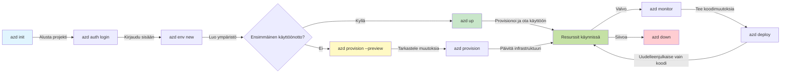
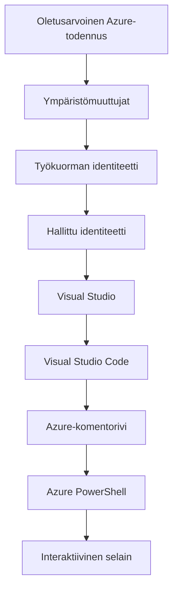

# AZD Perusteet - Azure Developer CLI:n ymmärtäminen

# AZD Perusteet - Keskeiset käsitteet ja perusteet

**Luvun navigointi:**
- **📚 Kurssin etusivu**: [AZD Aloittelijoille](../../README.md)
- **📖 Nykyinen luku**: Luku 1 - Perusta ja pika-aloitus
- **⬅️ Edellinen**: [Kurssin yleiskatsaus](../../README.md#-chapter-1-foundation--quick-start)
- **➡️ Seuraava**: [Asennus ja käyttöönotto](installation.md)
- **🚀 Seuraava luku**: [Luku 2: AI-lähtöinen kehitys](../chapter-02-ai-development/microsoft-foundry-integration.md)

## Johdanto

Tässä oppitunnissa tutustutaan Azure Developer CLI:hin (azd), tehokkaaseen komentorivityökaluun, joka nopeuttaa matkaasi paikallisesta kehityksestä Azureen käyttöönottoon. Opit perustavanlaatuiset käsitteet, keskeiset ominaisuudet ja ymmärrät, miten azd yksinkertaistaa pilvessä natiivien sovellusten käyttöönottoa.

## Oppimistavoitteet

Oppitunnin jälkeen osaat:
- Ymmärtää, mikä Azure Developer CLI on ja mikä sen ensisijainen tarkoitus on
- Oppia mallit, ympäristöt ja palvelut -käsitteiden perusteet
- Tutkia keskeisiä ominaisuuksia, mukaan lukien mallipohjainen kehitys ja Infrastructure as Code
- Ymmärtää azd-projektin rakenteen ja työnkulun
- Olla valmis asentamaan ja konfiguroimaan azd kehitysympäristöösi

## Oppimistulokset

Oppitunnin suorittamisen jälkeen pystyt:
- Selittämään azd:n roolin nykyaikaisissa pilvikehityksen työnkuluissa
- Tunnistamaan azd-projektin rakenteen komponentit
- Kuvaamaan, miten mallit, ympäristöt ja palvelut toimivat yhdessä
- Ymmärtämään Infrastructure as Code -hyödyt azd:llä
- Tunnistamaan erilaisia azd-komentoja ja niiden tarkoituksia

## Mikä on Azure Developer CLI (azd)?

Azure Developer CLI (azd) on komentorivityökalu, joka on suunniteltu nopeuttamaan matkaasi paikallisesta kehityksestä Azure-käyttöönottoon. Se yksinkertaistaa pilvi-natiivien sovellusten rakentamista, käyttöönottoa ja hallintaa Azuren päällä.

### 🎯 Miksi käyttää AZD:ta? Todellisen maailman vertailu

Vertailkaamme yksinkertaisen web-sovelluksen ja tietokannan käyttöönottoa:

#### ❌ ILMAN AZD: Manuaalinen Azure-käyttöönotto (30+ minuuttia)

```bash
# Vaihe 1: Luo resurssiryhmä
az group create --name myapp-rg --location eastus

# Vaihe 2: Luo App Service Plan -suunnitelma
az appservice plan create --name myapp-plan \
  --resource-group myapp-rg \
  --sku B1 --is-linux

# Vaihe 3: Luo Web-sovellus
az webapp create --name myapp-web-unique123 \
  --resource-group myapp-rg \
  --plan myapp-plan \
  --runtime "NODE:18-lts"

# Vaihe 4: Luo Cosmos DB -tili (10–15 minuuttia)
az cosmosdb create --name myapp-cosmos-unique123 \
  --resource-group myapp-rg \
  --kind MongoDB

# Vaihe 5: Luo tietokanta
az cosmosdb mongodb database create \
  --account-name myapp-cosmos-unique123 \
  --resource-group myapp-rg \
  --name tododb

# Vaihe 6: Luo kokoelma
az cosmosdb mongodb collection create \
  --account-name myapp-cosmos-unique123 \
  --resource-group myapp-rg \
  --database-name tododb \
  --name todos

# Vaihe 7: Hae yhteysmerkkijono
CONN_STR=$(az cosmosdb keys list \
  --name myapp-cosmos-unique123 \
  --resource-group myapp-rg \
  --type connection-strings \
  --query "connectionStrings[0].connectionString" -o tsv)

# Vaihe 8: Määritä sovelluksen asetukset
az webapp config appsettings set \
  --name myapp-web-unique123 \
  --resource-group myapp-rg \
  --settings MONGODB_URI="$CONN_STR"

# Vaihe 9: Ota lokitus käyttöön
az webapp log config --name myapp-web-unique123 \
  --resource-group myapp-rg \
  --application-logging filesystem \
  --detailed-error-messages true

# Vaihe 10: Ota Application Insights käyttöön
az monitor app-insights component create \
  --app myapp-insights \
  --location eastus \
  --resource-group myapp-rg

# Vaihe 11: Liitä App Insights Web-sovellukseen
INSTRUMENTATION_KEY=$(az monitor app-insights component show \
  --app myapp-insights \
  --resource-group myapp-rg \
  --query "instrumentationKey" -o tsv)

az webapp config appsettings set \
  --name myapp-web-unique123 \
  --resource-group myapp-rg \
  --settings APPINSIGHTS_INSTRUMENTATIONKEY="$INSTRUMENTATION_KEY"

# Vaihe 12: Rakenna sovellus paikallisesti
npm install
npm run build

# Vaihe 13: Luo käyttöönottopaketti
zip -r app.zip . -x "*.git*" "node_modules/*"

# Vaihe 14: Ota sovellus käyttöön
az webapp deployment source config-zip \
  --resource-group myapp-rg \
  --name myapp-web-unique123 \
  --src app.zip

# Vaihe 15: Odota ja rukoile, että se toimii 🙏
# (Ei automaattista validointia, manuaalinen testaus vaaditaan)
```

**Ongelmat:**
- ❌ 15+ komentoa muistettavaksi ja suoritettavaksi oikeassa järjestyksessä
- ❌ 30-45 minuuttia manuaalista työtä
- ❌ Helppo tehdä virheitä (kirjoitusvirheet, väärät parametrit)
- ❌ Yhteysmerkkijonot näkyvät terminaalin historiassa
- ❌ Ei automaattista palautusta, jos jokin epäonnistuu
- ❌ Vaikea toistaa tiimin jäsenille
- ❌ Eri joka kerta (ei toistettavissa)

#### ✅ AZD:lla: Automaattinen käyttöönotto (5 komentoa, 10-15 minuuttia)

```bash
# Vaihe 1: Alusta mallipohjasta
azd init --template todo-nodejs-mongo

# Vaihe 2: Tunnistaudu
azd auth login

# Vaihe 3: Luo ympäristö
azd env new dev

# Vaihe 4: Esikatsele muutoksia (valinnainen mutta suositeltava)
azd provision --preview

# Vaihe 5: Ota kaikki käyttöön
azd up

# ✨ Valmista! Kaikki on otettu käyttöön, konfiguroitu ja valvottu
```

**Hyödyt:**
- ✅ **5 komentoa** vs. 15+ manuaalista vaihetta
- ✅ **10-15 minuuttia** kokonaisaika (enimmäkseen odottelua Azuren takia)
- ✅ **Ei virheitä** - automatisoitu ja testattu
- ✅ **Salaisuudet hallinnoidaan turvallisesti** Key Vaultin kautta
- ✅ **Automaattinen rollback** virheiden sattuessa
- ✅ **Täysin toistettavissa** - sama lopputulos joka kerta
- ✅ **Tiimivalmis** - kuka tahansa voi ottaa käyttöön samoilla komennoilla
- ✅ **Infrastruktuuri koodina** - versionhallitut Bicep-mallit
- ✅ **Sisäänrakennettu valvonta** - Application Insights konfiguroitu automaattisesti

### 📊 Ajan ja virheiden väheneminen

| Mittari | Manuaalinen käyttöönotto | AZD-käyttöönotto | Parannus |
|:-------|:------------------|:---------------|:------------|
| **Komennot** | 15+ | 5 | 67% vähemmän |
| **Aika** | 30-45 min | 10-15 min | 60% nopeampi |
| **Virheiden määrä** | ~40% | <5% | 88% vähennys |
| **Johdonmukaisuus** | Matala (manuaalinen) | 100% (automaattinen) | Täydellinen |
| **Tiimin perehdytys** | 2-4 tuntia | 30 minuuttia | 75% nopeampi |
| **Palautusaika** | 30+ min (manuaalinen) | 2 min (automaattinen) | 93% nopeampi |

## Keskeiset käsitteet

### Mallit
Mallipohjat ovat azd:n perusta. Ne sisältävät:
- **Sovelluskoodi** - Lähdekoodisi ja riippuvuudet
- **Infrastruktuurin määrittelyt** - Azure-resurssit määritelty Bicepillä tai Terraformilla
- **Konfiguraatiotiedostot** - Asetukset ja ympäristömuuttujat
- **Käyttöönotto-skriptit** - Automaattiset käyttöönoton työnkulut

### Ympäristöt
Ympäristöt edustavat eri käyttöönoton kohteita:
- **Development** - Testaukseen ja kehitykseen
- **Staging** - Esituotantoympäristö
- **Production** - Tuotantoympäristö

Jokainen ympäristö ylläpitää omaa:
- Azure-resurssiryhmää
- Konfiguraatioasetuksia
- Käyttöönoton tilaa

### Palvelut
Palvelut ovat sovelluksesi rakennuspalikoita:
- **Frontend** - Web-sovellukset, SPA:t
- **Backend** - API:t, mikropalvelut
- **Tietokanta** - Datan tallennusratkaisut
- **Storage** - Tiedosto- ja blob-tallennus

## Keskeiset ominaisuudet

### 1. Mallipohjainen kehitys
```bash
# Selaa saatavilla olevia malleja
azd template list

# Alusta mallin pohjalta
azd init --template <template-name>
```

### 2. Infrastruktuuri koodina
- **Bicep** - Azuren domain-spesifinen kieli
- **Terraform** - Monipilvi-infrastruktuurityökalu
- **ARM Templates** - Azure Resource Manager -mallit

### 3. Integroidut työnkulut
```bash
# Täydellinen käyttöönoton työnkulku
azd up            # Provision + Deploy tämä on automatisoitu ensiasennusta varten

# 🧪 UUSI: Esikatsele infrastruktuurin muutoksia ennen käyttöönottoa (TURVALLINEN)
azd provision --preview    # Simuloi infrastruktuurin käyttöönottoa tekemättä muutoksia

azd provision     # Luo Azure-resursseja. Jos päivität infrastruktuuria, käytä tätä
azd deploy        # Ota sovelluskoodi käyttöön tai ota se uudelleen käyttöön päivityksen jälkeen
azd down          # Siivoa resurssit
```

#### 🛡️ Turvallinen infrastruktuurin suunnittelu esikatselulla
Komento `azd provision --preview` on merkittävä apuväline turvallisissa käyttöönotossa:
- **Kuiva-ajon analyysi** - Näyttää, mitä luodaan, muokataan tai poistetaan
- **Ei riskiä** - Todellisia muutoksia Azure-ympäristöösi ei tehdä
- **Tiimiyhteistyö** - Jaa esikatselutulokset ennen käyttöönottoa
- **Kustannusarvio** - Ymmärrä resurssien kustannukset ennen sitoutumista

```bash
# Esimerkin esikatselutyönkulku
azd provision --preview           # Katso, mitä muuttuu
# Tarkista tulos, keskustele tiimin kanssa
azd provision                     # Ota muutokset käyttöön luottavaisin mielin
```

### 📊 Visuaalinen: AZD-kehitystyönkulku


**Työnkulun selitys:**
1. **Init** - Aloita mallilla tai uudella projektilla
2. **Auth** - Todennus Azureen
3. **Environment** - Luo eristetty käyttöönottoympäristö
4. **Preview** - 🆕 Esikatsele aina ensin infrastruktuurin muutokset (turvallinen käytäntö)
5. **Provision** - Luo/päivitä Azure-resursseja
6. **Deploy** - Ota sovellus käyttöön
7. **Monitor** - Tarkkaile sovelluksen suorituskykyä
8. **Iterate** - Tee muutoksia ja ota koodi uudelleen käyttöön
9. **Cleanup** - Poista resurssit, kun työ on valmis

### 4. Ympäristön hallinta
```bash
# Luo ja hallinnoi ympäristöjä
azd env new <environment-name>
azd env select <environment-name>
azd env list
```

## 📁 Projektirakenne

Tyypillinen azd-projektirakenne:
```
my-app/
├── .azd/                    # azd configuration
│   └── config.json
├── .azure/                  # Azure deployment artifacts
├── .devcontainer/          # Development container config
├── .github/workflows/      # GitHub Actions
├── .vscode/               # VS Code settings
├── infra/                 # Infrastructure code
│   ├── main.bicep        # Main infrastructure template
│   ├── main.parameters.json
│   └── modules/          # Reusable modules
├── src/                  # Application source code
│   ├── api/             # Backend services
│   └── web/             # Frontend application
├── azure.yaml           # azd project configuration
└── README.md
```

## 🔧 Konfiguraatiotiedostot

### azure.yaml
Projektin pääkonfiguraatiotiedosto:
```yaml
name: my-awesome-app
metadata:
  template: my-template@1.0.0

services:
  web:
    project: ./src/web
    language: js
    host: appservice
  api:
    project: ./src/api
    language: js
    host: appservice

hooks:
  preprovision:
    shell: pwsh
    run: echo "Preparing to provision..."
```

### .azure/config.json
Ympäristökohtainen konfiguraatio:
```json
{
  "version": 1,
  "defaultEnvironment": "dev",
  "environments": {
    "dev": {
      "subscriptionId": "your-subscription-id",
      "location": "eastus"
    }
  }
}
```

## 🎪 Yleiset työnkulut käytännön harjoituksin

> **💡 Oppimisvinkki:** Seuraa näitä harjoituksia järjestyksessä kehittääksesi AZD-taitojasi vaiheittain.

### 🎯 Harjoitus 1: Alusta ensimmäinen projektisi

**Tavoite:** Luo AZD-projekti ja tutki sen rakennetta

**Vaiheet:**
```bash
# Käytä todistettua mallipohjaa
azd init --template todo-nodejs-mongo

# Tutki luotuja tiedostoja
ls -la  # Näytä kaikki tiedostot, mukaan lukien piilotetut

# Luodut keskeiset tiedostot:
# - azure.yaml (pääkonfiguraatio)
# - infra/ (infrastruktuurikoodi)
# - src/ (sovelluskoodi)
```

**✅ Onnistuminen:** Sinulla on azure.yaml-, infra/- ja src/-hakemistot

---

### 🎯 Harjoitus 2: Ota käyttöön Azureen

**Tavoite:** Suorita kokonaisvaltainen käyttöönotto

**Vaiheet:**
```bash
# 1. Tunnistaudu
az login && azd auth login

# 2. Luo ympäristö
azd env new dev
azd env set AZURE_LOCATION eastus

# 3. Esikatsele muutokset (SUOSITELTAVAA)
azd provision --preview

# 4. Ota kaikki käyttöön
azd up

# 5. Varmista käyttöönotto
azd show    # Näytä sovelluksesi URL-osoite
```

**Arvioitu aika:** 10-15 minuuttia  
**✅ Onnistuminen:** Sovelluksen URL avautuu selaimeen

---

### 🎯 Harjoitus 3: Useita ympäristöjä

**Tavoite:** Ota käyttöön kehitys- ja staging-ympäristöihin

**Vaiheet:**
```bash
# Dev on jo olemassa, luo staging
azd env new staging
azd env set AZURE_LOCATION westus2
azd up

# Vaihda niiden välillä
azd env list
azd env select dev
```

**✅ Onnistuminen:** Kaksi erillistä resurssiryhmää Azure-portaalissa

---

### 🛡️ Puhdas aloitus: `azd down --force --purge`

Kun sinun täytyy nollata kokonaan:

```bash
azd down --force --purge
```

**Mitä se tekee:**
- `--force`: Ei vahvistuskehotteita
- `--purge`: Poistaa kaikki paikallisen tilan ja Azure-resurssit

**Käytä kun:**
- Käyttöönotto epäonnistui kesken
- Vaihdat projektia
- Tarvitset puhtaan alun

---

## 🎪 Alkuperäinen työnkulun viite

### Uuden projektin aloittaminen
```bash
# Menetelmä 1: Käytä olemassa olevaa mallia
azd init --template todo-nodejs-mongo

# Menetelmä 2: Aloita alusta
azd init

# Menetelmä 3: Käytä nykyistä hakemistoa
azd init .
```

### Kehityssykli
```bash
# Määritä kehitysympäristö
azd auth login
azd env new dev
azd env select dev

# Ota kaikki käyttöön
azd up

# Tee muutoksia ja ota uudelleen käyttöön
azd deploy

# Siivoa lopuksi
azd down --force --purge # Azure Developer CLI:n komento on **kova nollaus** ympäristöllesi—erityisen hyödyllinen, kun korjaat epäonnistuneita käyttöönottoja, siivoat orpoja resursseja tai valmistelet uutta uudelleenkäyttöönottoa.
```

## Ymmärtäminen `azd down --force --purge`
Komento `azd down --force --purge` on tehokas tapa purkaa azd-ympäristösi ja kaikki siihen liittyvät resurssit täysin. Tässä erittely siitä, mitä kukin lippu tekee:
```
--force
```
- Ohittaa vahvistuskehotteet.
- Hyödyllinen automaatiossa tai skripteissä, joissa manuaalinen syöte ei ole mahdollista.
- Varmistaa, että purku etenee keskeytyksettä, vaikka CLI havaitsee epäjohdonmukaisuuksia.

```
--purge
```
Poistaa **kaiken liittyvän metadatan**, mukaan lukien:
Ympäristön tila
Paikallinen `.azure`-kansio
Välimuistissa oleva käyttöönottoinformaatio
Estää azd:ia "muistamasta" aiempia käyttöönottoja, jotka voivat aiheuttaa ongelmia kuten resurssiryhmien yhteensopimattomuus tai vanhentuneet rekisteriviittaukset.


### Miksi käyttää molempia?
Kun `azd up` -komento takkuaa jäljellä olevan tilan tai osittaisten käyttöönottojen vuoksi, tämä yhdistelmä varmistaa **puhdas aloitus**.

Se on erityisen hyödyllinen manuaalisten resurssien poistojen jälkeen Azure-portaalissa tai kun vaihdetaan malleja, ympäristöjä tai resurssiryhmien nimeämiskäytäntöjä.


### Useiden ympäristöjen hallinta
```bash
# Luo staging-ympäristö
azd env new staging
azd env select staging
azd up

# Vaihda takaisin kehitykseen
azd env select dev

# Vertaile ympäristöjä
azd env list
```

## 🔐 Autentikointi ja tunnistetiedot

Autentikoinnin ymmärtäminen on ratkaisevaa onnistuneille azd-käyttöönotolle. Azure käyttää useita autentikointimenetelmiä, ja azd hyödyntää samaa tunnistetietoketjua, jota muut Azure-työkalut käyttävät.

### Azure CLI -todennus (`az login`)

Ennen azd:n käyttämistä sinun on todennuttava Azureen. Yleisin tapa on käyttää Azure CLI:tä:

```bash
# Interaktiivinen kirjautuminen (avaa selain)
az login

# Kirjaudu tietylle vuokralaiselle
az login --tenant <tenant-id>

# Kirjaudu palveluperiaatteella
az login --service-principal -u <app-id> -p <password> --tenant <tenant-id>

# Tarkista nykyinen kirjautumistila
az account show

# Listaa käytettävissä olevat tilaukset
az account list --output table

# Aseta oletustilaus
az account set --subscription <subscription-id>
```

### Autentikoinnin kulku
1. **Vuorovaikutteinen kirjautuminen**: Avaa oletusselaimesi autentikointia varten
2. **Device Code Flow**: Ympäristöihin ilman selainkäyttöä
3. **Service Principal**: Automaation ja CI/CD-skenaarioiden varten
4. **Managed Identity**: Azure-isännöityihin sovelluksiin

### DefaultAzureCredential -ketju

`DefaultAzureCredential` on tunnistetietotyyppi, joka tarjoaa yksinkertaistetun autentikointikokemuksen yrittämällä automaattisesti useita tunnistuslähteitä tietyssä järjestyksessä:

#### Tunnistusketjun järjestys

#### 1. Ympäristömuuttujat
```bash
# Aseta ympäristömuuttujat palvelun päämiehelle
export AZURE_CLIENT_ID="<app-id>"
export AZURE_CLIENT_SECRET="<password>"
export AZURE_TENANT_ID="<tenant-id>"
```

#### 2. Workload Identity (Kubernetes/GitHub Actions)
Käytetään automaattisesti:
- Azure Kubernetes Service (AKS) Workload Identityn kanssa
- GitHub Actions OIDC-federoinnin avulla
- Muut federoidut identiteettitapaukset

#### 3. Managed Identity
Azure-resursseille, kuten:
- Virtuaalikoneet
- App Service
- Azure Functions
- Container Instances

```bash
# Tarkista, ajetaanko Azure-resurssilla, jolla on hallittu identiteetti
az account show --query "user.type" --output tsv
# Palauttaa: "servicePrincipal" jos käytössä on hallittu identiteetti
```

#### 4. Kehitystyökalujen integrointi
- **Visual Studio**: Käyttää automaattisesti sisäänkirjautunutta tiliä
- **VS Code**: Käyttää Azure Account -laajennuksen tunnuksia
- **Azure CLI**: Käyttää `az login` -tunnuksia (yleisin paikallisessa kehityksessä)

### AZD:n autentikoinnin asetukset

```bash
# Menetelmä 1: Käytä Azure CLI:tä (Suositellaan kehitykseen)
az login
azd auth login  # Käyttää olemassa olevia Azure CLI -tunnistetietoja

# Menetelmä 2: Suora azd-todennus
azd auth login --use-device-code  # Ilman käyttöliittymää toimiviin ympäristöihin

# Menetelmä 3: Tarkista todennuksen tila
azd auth login --check-status

# Menetelmä 4: Kirjaudu ulos ja todenna uudelleen
azd auth logout
azd auth login
```

### Autentikoinnin parhaat käytännöt

#### Paikalliseen kehitykseen
```bash
# 1. Kirjaudu Azure CLI:llä
az login

# 2. Varmista oikea tilaus
az account show
az account set --subscription "Your Subscription Name"

# 3. Käytä azd:ää olemassa olevilla tunnuksilla
azd auth login
```

#### CI/CD-putkille
```yaml
# GitHub Actions example
- name: Azure Login
  uses: azure/login@v1
  with:
    creds: ${{ secrets.AZURE_CREDENTIALS }}

- name: Deploy with azd
  run: |
    azd auth login --client-id ${{ secrets.AZURE_CLIENT_ID }} \
                    --client-secret ${{ secrets.AZURE_CLIENT_SECRET }} \
                    --tenant-id ${{ secrets.AZURE_TENANT_ID }}
    azd up --no-prompt
```

#### Tuotantoympäristöihin
- Käytä **Managed Identityä** ajaessasi Azure-resursseilla
- Käytä **Service Principalia** automaatioskenaarioissa
- Vältä tunnusten tallentamista koodiin tai konfiguraatiotiedostoihin
- Käytä **Azure Key Vaultia** arkaluonteiselle konfiguraatiolle

### Yleiset autentikointiongelmat ja ratkaisut

#### Ongelma: "No subscription found"
```bash
# Ratkaisu: Aseta oletustilaus
az account list --output table
az account set --subscription "<subscription-id>"
azd env set AZURE_SUBSCRIPTION_ID "<subscription-id>"
```

#### Ongelma: "Insufficient permissions"
```bash
# Ratkaisu: Tarkista ja myönnä tarvittavat roolit
az role assignment list --assignee $(az account show --query user.name --output tsv)

# Yleiset tarvittavat roolit:
# - Contributor (resurssien hallintaan)
# - User Access Administrator (roolien myöntämistä varten)
```

#### Ongelma: "Token expired"
```bash
# Ratkaisu: Kirjaudu uudelleen
az logout
az login
azd auth logout
azd auth login
```

### Autentikointi eri skenaarioissa

#### Paikallinen kehitys
```bash
# Henkilökohtainen kehitystili
az login
azd auth login
```

#### Tiimikehitys
```bash
# Käytä organisaatiolle tiettyä vuokralaista
az login --tenant contoso.onmicrosoft.com
azd auth login
```

#### Monivuokralais-skenaariot
```bash
# Vaihda vuokralaisten välillä
az login --tenant tenant1.onmicrosoft.com
# Ota käyttöön vuokralaiselle 1
azd up

az login --tenant tenant2.onmicrosoft.com  
# Ota käyttöön vuokralaiselle 2
azd up
```

### Turvallisuusnäkökohdat

1. **Tunnistetietojen säilytys**: Älä koskaan tallenna tunnuksia lähdekoodiin
2. **Laajuuden rajoittaminen**: Käytä vähimmän oikeuden periaatetta service principal -tileille
3. **Tokenin kiertäminen**: Kierrä service principalien salaisuuksia säännöllisesti
4. **Audit-loki**: Valvo autentikointi- ja käyttöönottoaktiviteetteja
5. **Verkon turvallisuus**: Käytä yksityisiä päätepisteitä aina kun mahdollista

### Vianmääritys autentikoinnissa

```bash
# Tunnistautumisongelmien vianmääritys
azd auth login --check-status
az account show
az account get-access-token

# Yleiset vianmäärityskomennot
whoami                          # Nykyinen käyttäjäkonteksti
az ad signed-in-user show      # Azure AD -käyttäjän tiedot
az group list                  # Testaa resurssin käyttöoikeuksia
```

## Ymmärtäminen `azd down --force --purge`

### Löytö
```bash
azd template list              # Selaa malleja
azd template show <template>   # Mallin tiedot
azd init --help               # Alustusasetukset
```

### Projektinhallinta
```bash
azd show                     # Projektin yleiskatsaus
azd env show                 # Nykyinen ympäristö
azd config list             # Konfiguraatioasetukset
```

### Valvonta
```bash
azd monitor                  # Avaa Azure-portaalin valvonta
azd monitor --logs           # Näytä sovelluksen lokit
azd monitor --live           # Näytä reaaliaikaiset mittarit
azd pipeline config          # Määritä CI/CD
```

## Parhaat käytännöt

### 1. Käytä merkityksellisiä nimiä
```bash
# Hyvä
azd env new production-east
azd init --template web-app-secure

# Vältä
azd env new env1
azd init --template template1
```

### 2. Hyödynnä malleja
- Aloita olemassa olevilla malleilla
- Mukauta tarpeidesi mukaan
- Luo uudelleenkäytettäviä malleja organisaatiollesi

### 3. Ympäristöjen eristäminen
- Käytä erillisiä ympäristöjä kehitys/esituotanto/tuotanto
- Älä koskaan ota suoraan tuotantoon käyttöön paikalliselta koneelta
- Käytä CI/CD-putkia tuotantokäyttöönottoihin

### 4. Konfiguraation hallinta
- Käytä ympäristömuuttujia arkaluonteisille tiedoille
- Pidä konfiguraatio versionhallinnassa
- Dokumentoi ympäristökohtaiset asetukset

## Oppimisen eteneminen

### Aloittelija (viikko 1-2)
1. Asenna azd ja autentikoi
2. Ota käyttöön yksinkertainen malli
3. Ymmärrä projektirakenne
4. Opettele peruskomennot (up, down, deploy)

### Keskitaso (viikko 3-4)
1. Mukauta malleja
2. Hallitse useita ympäristöjä
3. Ymmärrä infrastruktuurikoodi
4. Perusta CI/CD-putket

### Edistynyt (viikko 5+)
1. Luo mukautettuja malleja
2. Edistyneet infrastruktuurikuviot
3. Monialueiset käyttöönotot
4. Yritystason konfiguraatiot

## Seuraavat askeleet

**📖 Jatka Luku 1:n oppimista:**
- [Asennus ja käyttöönotto](installation.md) - Asenna ja konfiguroi azd
- [Ensimmäinen projektisi](first-project.md) - Kattava käytännön opas
- [Asetusopas](configuration.md) - Edistyneet konfigurointivaihtoehdot

**🎯 Valmis seuraavaan lukuun?**
- [Luku 2: AI-ensimmäinen kehittäminen](../chapter-02-ai-development/microsoft-foundry-integration.md) - Aloita tekoälysovellusten rakentaminen

## Lisäresurssit

- [Azure Developer CLI - yleiskatsaus](https://learn.microsoft.com/en-us/azure/developer/azure-developer-cli/)
- [Malligalleria](https://azure.github.io/awesome-azd/)
- [Yhteisön esimerkit](https://github.com/Azure-Samples)

---

## 🙋 Usein kysytyt kysymykset

### Yleiset kysymykset

**Q: Mikä on ero AZD:n ja Azure CLI:n välillä?**

A: Azure CLI (`az`) on tarkoitettu yksittäisten Azure-resurssien hallintaan. AZD (`azd`) on tarkoitettu koko sovellusten hallintaan:

```bash
# Azure CLI - matalan tason resurssien hallinta
az webapp create --name myapp --resource-group rg
az sql server create --name myserver --resource-group rg
# ...tarvitaan vielä monia komentoja

# AZD - sovellustason hallinta
azd up  # Ottaa käyttöön koko sovelluksen kaikkine resursseineen
```

**Ajattele sitä näin:**
- `az` = Työskentelee yksittäisten Lego-palikoiden kanssa
- `azd` = Työskentelee kokonaisilla Lego-seteillä

---

**Q: Tarvitseeko minun osata Bicep tai Terraform käyttääkseni AZD:ia?**

A: Ei! Aloita malleilla:
```bash
# Käytä olemassa olevaa mallipohjaa - IaC-osaamista ei tarvita
azd init --template todo-nodejs-mongo
azd up
```

Voit oppia Bicepin myöhemmin infrastruktuurin muokkaamiseen. Mallit tarjoavat toimivia esimerkkejä, joista oppia.

---

**Q: Kuinka paljon AZD-mallien ajaminen maksaa?**

A: Kustannukset vaihtelevat mallin mukaan. Useimmat kehitysmallit maksavat $50-150/kuukausi:

```bash
# Esikatsele kustannukset ennen käyttöönottoa
azd provision --preview

# Siivoa aina, kun et käytä
azd down --force --purge  # Poistaa kaikki resurssit
```

**Vinkki:** Käytä ilmaisia tasoja aina kun saatavilla:
- App Service: F1 (Free) tier
- Azure OpenAI: 50,000 tokens/month free
- Cosmos DB: 1000 RU/s free tier

---

**Q: Voinko käyttää AZD:ia olemassa olevien Azure-resurssien kanssa?**

A: Kyllä, mutta on helpompaa aloittaa puhtaalta pöydältä. AZD toimii parhaiten, kun se hallitsee koko elinkaaren. Olemassa olevia resursseja varten:

```bash
# Vaihtoehto 1: Tuo olemassa olevat resurssit (edistynyt)
azd init
# Muokkaa sitten infra/ viittaamaan olemassa oleviin resursseihin

# Vaihtoehto 2: Aloita alusta (suositeltavaa)
azd init --template matching-your-stack
azd up  # Luo uuden ympäristön
```

---

**Q: Miten jaan projektini tiimikavereiden kanssa?**

A: Lisää AZD-projekti Git-repositorioon (mutta ÄLÄ lisää .azure-kansiota):

```bash
# Jo oletuksena .gitignore-tiedostossa
.azure/        # Sisältää salaisuuksia ja ympäristötietoja
*.env          # Ympäristömuuttujat

# Tiimin jäsenet sitten:
git clone <your-repo>
azd auth login
azd env new <their-name>-dev
azd up
```

Kaikki saavat identtisen infrastruktuurin samoista malleista.

---

### Vianmääritys

**Q: "azd up" epäonnistui puolivälissä. Mitä teen?**

A: Tarkista virheilmoitus, korjaa se ja yritä uudelleen:

```bash
# Näytä yksityiskohtaiset lokit
azd show

# Yleiset korjaukset:

# 1. Jos kiintiö ylittyy:
azd env set AZURE_LOCATION "westus2"  # Kokeile eri aluetta

# 2. Jos resurssin nimen ristiriita:
azd down --force --purge  # Aloita puhtaalta pöydältä
azd up  # Yritä uudelleen

# 3. Jos todennus on vanhentunut:
az login
azd auth login
azd up
```

**Yleisin ongelma:** Väärä Azure-tilaus valittuna
```bash
az account list --output table
az account set --subscription "<correct-subscription>"
```

---

**Q: Miten otan käyttöön pelkät koodimuutokset ilman uudelleenprovisiointia?**

A: Käytä `azd deploy`-komentoa `azd up` sijaan:

```bash
azd up          # Ensimmäisellä kerralla: provisionointi + käyttöönotto (hidas)

# Tee koodimuutoksia...

azd deploy      # Seuraavilla kerroilla: vain käyttöönotto (nopea)
```

Nopeusvertailu:
- `azd up`: 10-15 minuuttia (provisionoi infrastruktuurin)
- `azd deploy`: 2-5 minuuttia (vain koodi)

---

**Q: Voinko mukauttaa infrastruktuurimalleja?**

A: Kyllä! Muokkaa Bicep-tiedostoja kansiossa `infra/`:

```bash
# azd initin jälkeen
cd infra/
code main.bicep  # Muokkaa VS Codessa

# Esikatsele muutoksia
azd provision --preview

# Ota muutokset käyttöön
azd provision
```

**Vinkki:** Aloita pienestä - muuta ensin SKUja:
```bicep
// infra/main.bicep
sku: {
  name: 'B1'  // Change to 'P1V2' for production
}
```

---

**Q: Miten poistan kaiken, mitä AZD loi?**

A: Yksi komento poistaa kaikki resurssit:

```bash
azd down --force --purge

# Tämä poistaa:
# - Kaikki Azure-resurssit
# - Resurssiryhmä
# - Paikallisen ympäristön tila
# - Välimuistiin tallennetut käyttöönoton tiedot
```

**Suorita aina, kun:**
- Mallin testaamisen jälkeen
- Vaihdettaessa toiseen projektiin
- Haluat aloittaa alusta

**Kustannussäästö:** Käyttämättömien resurssien poistaminen = $0 kuluja

---

**Q: Entä jos vahingossa poistin resursseja Azure-portaalissa?**

A: AZD:n tila voi mennä epäyhteensopivaksi. Puhdas aloitus -lähestymistapa:

```bash
# 1. Poista paikallinen tila
azd down --force --purge

# 2. Aloita alusta
azd up

# Vaihtoehto: Anna AZD:n havaita ja korjata
azd provision  # Luodaan puuttuvat resurssit
```

---

### Edistyneet kysymykset

**Q: Voinko käyttää AZD:ia CI/CD-putkissa?**

A: Kyllä! GitHub Actions -esimerkki:

```yaml
# .github/workflows/deploy.yml
name: Deploy with AZD

on:
  push:
    branches: [main]

jobs:
  deploy:
    runs-on: ubuntu-latest
    steps:
      - uses: actions/checkout@v2
      
      - name: Install azd
        run: curl -fsSL https://aka.ms/install-azd.sh | bash
      
      - name: Azure Login
        run: |
          azd auth login \
            --client-id ${{ secrets.AZURE_CLIENT_ID }} \
            --client-secret ${{ secrets.AZURE_CLIENT_SECRET }} \
            --tenant-id ${{ secrets.AZURE_TENANT_ID }}
      
      - name: Deploy
        run: azd up --no-prompt
```

---

**Q: Miten käsittelen salaisuuksia ja arkaluontoisia tietoja?**

A: AZD integroituu automaattisesti Azure Key Vaultiin:

```bash
# Salaisuudet tallennetaan Key Vaultiin, ei koodiin
azd env set DATABASE_PASSWORD "$(openssl rand -base64 32)"

# AZD tekee automaattisesti:
# 1. Luo Key Vaultin
# 2. Tallentaa salaisuuden
# 3. Myöntää sovellukselle pääsyn hallitun identiteetin kautta
# 4. Syöttää suoritusajon aikana
```

**Älä koskaan lisää versionhallintaan:**
- `.azure/`-kansio (sisältää ympäristötietoja)
- `.env`-tiedostot (paikalliset salaisuudet)
- Yhteysmerkkijonot

---

**Q: Voinko ottaa käyttöön useille alueille?**

A: Kyllä, luo ympäristö jokaiselle alueelle:

```bash
# Itä-Yhdysvaltain ympäristö
azd env new prod-eastus
azd env set AZURE_LOCATION eastus
azd up

# Länsi-Euroopan ympäristö
azd env new prod-westeurope
azd env set AZURE_LOCATION westeurope
azd up

# Jokainen ympäristö on itsenäinen
azd env list
```

Todellisia monialuesovelluksia varten mukauta Bicep-malleja ottaaksesi ne käyttöön useille alueille samanaikaisesti.

---

**Q: Mistä saan apua, jos jumitan?**

1. **AZD-dokumentaatio:** https://learn.microsoft.com/azure/developer/azure-developer-cli/
2. **GitHub Issues:** https://github.com/Azure/azure-dev/issues
3. **Discord:** [Azure Discord](https://discord.gg/microsoft-azure) - #azure-developer-cli kanava
4. **Stack Overflow:** Käytä tagia `azure-developer-cli`
5. **Tämä kurssi:** [Vianmääritysohje](../chapter-07-troubleshooting/common-issues.md)

**Vinkki:** Ennen kysymistä, suorita:
```bash
azd show       # Näyttää nykytilan
azd version    # Näyttää versiosi
```
Liitä nämä tiedot kysymykseesi nopeampaa apua varten.

---

## 🎓 Mitä seuraavaksi?

Ymmärrät nyt AZD:n perusteet. Valitse polkusi:

### 🎯 Aloittelijoille:
1. **Seuraavaksi:** [Asennus ja käyttöönotto](installation.md) - Asenna AZD koneellesi
2. **Sitten:** [Ensimmäinen projektisi](first-project.md) - Ota käyttöön ensimmäinen sovelluksesi
3. **Harjoittele:** Suorita kaikki tämän oppitunnin 3 harjoitusta

### 🚀 AI-kehittäjille:
1. **Siirry:** [Luku 2: AI-ensimmäinen kehittäminen](../chapter-02-ai-development/microsoft-foundry-integration.md)
2. **Ota käyttöön:** Aloita komennolla `azd init --template get-started-with-ai-chat`
3. **Opi:** Rakenna samalla kun otat käyttöön

### 🏗️ Kokeneille kehittäjille:
1. **Tarkista:** [Asetusopas](configuration.md) - Edistyneet asetukset
2. **Tutki:** [Infrastruktuuri koodina](../chapter-04-infrastructure/provisioning.md) - Bicep-syväluotaus
3. **Rakenna:** Luo mukautettuja malleja pinollesi

---

**Lukujen navigointi:**
- **📚 Kurssin etusivu**: [AZD Aloittelijoille](../../README.md)
- **📖 Nykyinen luku**: Luku 1 - Perusteet & pika-aloitus  
- **⬅️ Edellinen**: [Kurssin yleiskatsaus](../../README.md#-chapter-1-foundation--quick-start)
- **➡️ Seuraava**: [Asennus ja käyttöönotto](installation.md)
- **🚀 Seuraava luku**: [Luku 2: AI-ensimmäinen kehittäminen](../chapter-02-ai-development/microsoft-foundry-integration.md)

---

<!-- CO-OP TRANSLATOR DISCLAIMER START -->
Vastuuvapauslauseke:
Tämä asiakirja on käännetty tekoälypohjaisella käännöspalvelulla [Co-op Translator](https://github.com/Azure/co-op-translator). Vaikka pyrimme täsmällisyyteen, ota huomioon, että automatisoiduissa käännöksissä saattaa esiintyä virheitä tai epätarkkuuksia. Alkuperäistä asiakirjaa sen alkuperäisellä kielellä tulee pitää virallisena ja ensisijaisena lähteenä. Tärkeiden tietojen osalta suosittelemme ammattimaista ihmiskäännöstä. Emme ole vastuussa mahdollisista väärinymmärryksistä tai virheellisistä tulkinnoista, jotka johtuvat tämän käännöksen käytöstä.
<!-- CO-OP TRANSLATOR DISCLAIMER END -->