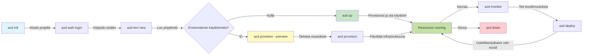
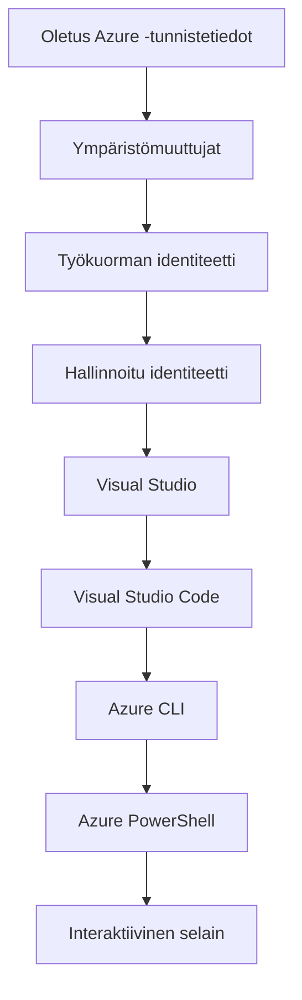

# AZD perusteet - Azure Developer CLI:n ymmärtäminen

# AZD perusteet - Keskeiset käsitteet ja perusteet

**Chapter Navigation:**
- **📚 Course Home**: [AZD For Beginners](../../README.md)
- **📖 Current Chapter**: Chapter 1 - Foundation & Quick Start
- **⬅️ Previous**: [Course Overview](../../README.md#-chapter-1-foundation--quick-start)
- **➡️ Next**: [Installation & Setup](installation.md)
- **🚀 Next Chapter**: [Chapter 2: AI-First Development](../chapter-02-ai-development/microsoft-foundry-integration.md)

## Johdanto

Tämä oppitunti esittelee Azure Developer CLI:n (azd), tehokkaan komentorivityökalun, joka nopeuttaa matkaasi paikallisesta kehityksestä Azure‑käyttöönottoon. Opit peruskäsitteet, keskeiset ominaisuudet ja ymmärrät, miten azd yksinkertaistaa pilvinohjelmistojen käyttöönottoa.

## Oppimistavoitteet

Oppitunnin lopuksi osaat:
- Ymmärtää, mikä Azure Developer CLI on ja mikä sen ensisijainen tarkoitus on
- Oppia mallien, ympäristöjen ja palvelujen keskeiset käsitteet
- Tutustua keskeisiin ominaisuuksiin, kuten mallipohjaiseen kehitykseen ja infrastruktuuriin koodina (Infrastructure as Code)
- Ymmärtää azd‑projektin rakenteen ja työnkulun
- Olla valmis asentamaan ja konfiguroimaan azd kehitysympäristöllesi

## Oppimistulokset

Oppitunnin suorittamisen jälkeen pystyt:
- Selittää azd:n roolin nykyaikaisissa pilvikehityksen työnkuluissa
- Tunnistaa azd‑projektin rakenteen osat
- Kuvailla, miten mallit, ympäristöt ja palvelut toimivat yhdessä
- Ymmärtää Infrastructure as Code -lähestymistavan hyödyt azd:n kanssa
- Tunnistaa erilaisia azd‑komentoja ja niiden tarkoitukset

## Mikä on Azure Developer CLI (azd)?

Azure Developer CLI (azd) on komentorivityökalu, joka on suunniteltu nopeuttamaan matkaasi paikallisesta kehityksestä Azure‑käyttöönottoon. Se yksinkertaistaa pilvikeskeisten sovellusten rakentamisen, käyttöönoton ja hallinnan prosessia Azure‑ympäristössä.

### Mitä voit ottaa käyttöön azd:llä?

azd tukee monenlaisia työkuormia — lista kasvaa jatkuvasti. Voit käyttää azd:tä esimerkiksi seuraaviin käyttöönottoihin:

| Workload Type | Examples | Same Workflow? |
|---------------|----------|----------------|
| **Perinteiset sovellukset** | Web-sovellukset, REST-rajapinnat, staattiset sivustot | ✅ `azd up` |
| **Palvelut ja mikropalvelut** | Container Apps, Function Apps, monipalveluiset backendit | ✅ `azd up` |
| **AI-pohjaiset sovellukset** | Chat-sovellukset Microsoft Foundry -malleilla, RAG-ratkaisut AI Searchin kanssa | ✅ `azd up` |
| **Älykkäät agentit** | Foundry'n isännöimät agentit, monagenttiorkestroinnit | ✅ `azd up` |

Keskeinen havainto on, että **azd:n elinkaari pysyy samana riippumatta siitä, mitä otat käyttöön**. Alustat projektin, provisioit infrastruktuurin, otat koodisi käyttöön, valvot sovellustasi ja siivoat — oli kyse sitten yksinkertaisesta verkkosivusta tai monimutkaisesta AI-agentista.

Tämä jatkuvuus on suunniteltu näin. azd käsittelee AI-ominaisuuksia yhtenä palvelutyypinä, jota sovelluksesi voi käyttää, ei jotenkin perustavanlaatuisesti erilaisena. Chat-päätepiste, jota tukevat Microsoft Foundry -mallit, on azd:n näkökulmasta vain toinen palvelu konfiguroitavaksi ja otettavaksi käyttöön.

### 🎯 Miksi käyttää AZD:ää? Todellisen maailman vertailu

Vertailkaamme yksinkertaisen web-sovelluksen ja tietokannan käyttöönottoa:

#### ❌ ILMAN AZD: Manuaalinen Azure-käyttöönotto (yli 30 minuuttia)

```bash
# Vaihe 1: Luo resurssiryhmä
az group create --name myapp-rg --location eastus

# Vaihe 2: Luo App Service -palvelusuunnitelma
az appservice plan create --name myapp-plan \
  --resource-group myapp-rg \
  --sku B1 --is-linux

# Vaihe 3: Luo Web-sovellus
az webapp create --name myapp-web-unique123 \
  --resource-group myapp-rg \
  --plan myapp-plan \
  --runtime "NODE:18-lts"

# Vaihe 4: Luo Cosmos DB -tili (10-15 minuuttia)
az cosmosdb create --name myapp-cosmos-unique123 \
  --resource-group myapp-rg \
  --kind MongoDB

# Vaihe 5: Luo tietokanta
az cosmosdb mongodb database create \
  --account-name myapp-cosmos-unique123 \
  --resource-group myapp-rg \
  --name tododb

# Vaihe 6: Luo kokoelma
az cosmosdb mongodb collection create \
  --account-name myapp-cosmos-unique123 \
  --resource-group myapp-rg \
  --database-name tododb \
  --name todos

# Vaihe 7: Hae yhteysmerkkijono
CONN_STR=$(az cosmosdb keys list \
  --name myapp-cosmos-unique123 \
  --resource-group myapp-rg \
  --type connection-strings \
  --query "connectionStrings[0].connectionString" -o tsv)

# Vaihe 8: Määritä sovelluksen asetukset
az webapp config appsettings set \
  --name myapp-web-unique123 \
  --resource-group myapp-rg \
  --settings MONGODB_URI="$CONN_STR"

# Vaihe 9: Ota lokitus käyttöön
az webapp log config --name myapp-web-unique123 \
  --resource-group myapp-rg \
  --application-logging filesystem \
  --detailed-error-messages true

# Vaihe 10: Ota Application Insights käyttöön
az monitor app-insights component create \
  --app myapp-insights \
  --location eastus \
  --resource-group myapp-rg

# Vaihe 11: Liitä App Insights Web-sovellukseen
INSTRUMENTATION_KEY=$(az monitor app-insights component show \
  --app myapp-insights \
  --resource-group myapp-rg \
  --query "instrumentationKey" -o tsv)

az webapp config appsettings set \
  --name myapp-web-unique123 \
  --resource-group myapp-rg \
  --settings APPINSIGHTS_INSTRUMENTATIONKEY="$INSTRUMENTATION_KEY"

# Vaihe 12: Rakenna sovellus paikallisesti
npm install
npm run build

# Vaihe 13: Luo käyttöönottopaketti
zip -r app.zip . -x "*.git*" "node_modules/*"

# Vaihe 14: Ota sovellus käyttöön
az webapp deployment source config-zip \
  --resource-group myapp-rg \
  --name myapp-web-unique123 \
  --src app.zip

# Vaihe 15: Odota ja rukoile, että se toimii 🙏
# (Ei automaattista validointia, manuaalinen testaus vaaditaan)
```

**Ongelmia:**
- ❌ Yli 15 komentoa muistettavaksi ja suoritettavaksi oikeassa järjestyksessä
- ❌ 30–45 minuuttia manuaalista työtä
- ❌ Helppo tehdä virheitä (kirjoitusvirheet, väärät parametrit)
- ❌ Yhteysmerkkijonot paljastuvat terminaalihistoriassa
- ❌ Ei automaattista palautusta, jos jokin epäonnistuu
- ❌ Vaikea toistaa tiimin jäsenille
- ❌ Eri kerran — ei toistettavissa

#### ✅ AZD:N KANSSA: Automaattinen käyttöönotto (5 komentoa, 10–15 minuuttia)

```bash
# Vaihe 1: Alusta mallipohjasta
azd init --template todo-nodejs-mongo

# Vaihe 2: Todennus
azd auth login

# Vaihe 3: Luo ympäristö
azd env new dev

# Vaihe 4: Esikatsele muutokset (valinnainen mutta suositeltava)
azd provision --preview

# Vaihe 5: Ota kaikki käyttöön
azd up

# ✨ Valmis! Kaikki on otettu käyttöön, konfiguroitu ja valvottu
```

**Hyödyt:**
- ✅ **5 komentoa** vs. yli 15 manuaalista vaihetta
- ✅ **10–15 minuuttia** kokonaisaika (enimmäkseen Azurea odottaessa)
- ✅ **Vähemmän manuaalisia virheitä** - johdonmukainen, mallipohjainen työnkulku
- ✅ **Turvallinen salaisuuksien käsittely** - monet mallit käyttävät Azuren hallinnoimaa salaisuustallennusta
- ✅ **Toistettavat käyttöönotot** - sama työnkulku joka kerta
- ✅ **Täysin toistettavissa** - sama lopputulos joka kerta
- ✅ **Tiimivalmis** - kuka tahansa voi ottaa käyttöön samanlaisin komennoin
- ✅ **Infrastructure as Code** - versiokontrolloidut Bicep-mallit
- ✅ **Sisäänrakennettu valvonta** - Application Insights konfiguroidaan automaattisesti

### 📊 Ajan ja virheiden väheneminen

| Mittari | Manuaalinen käyttöönotto | AZD-käyttöönotto | Parannus |
|:-------|:------------------|:---------------|:------------|
| **Komennot** | 15+ | 5 | 67 % vähemmän |
| **Aika** | 30-45 min | 10-15 min | 60 % nopeampi |
| **Virheiden määrä** | ~40 % | <5 % | 88 % vähennys |
| **Johdonmukaisuus** | Matala (manuaalinen) | 100 % (automaattinen) | Täydellinen |
| **Tiimin perehdytys** | 2-4 hours | 30 minutes | 75 % nopeampi |
| **Palautusaika** | 30+ min (manual) | 2 min (automated) | 93 % nopeampi |

## Keskeiset käsitteet

### Mallit
Mallipohjat ovat azd:n perusta. Ne sisältävät:
- **Sovelluskoodi** - Lähdekoodisi ja riippuvuudet
- **Infrastruktuurin määrittelyt** - Azure-resurssit määriteltynä Bicepillä tai Terraformilla
- **Konfiguraatiotiedostot** - Asetukset ja ympäristömuuttujat
- **Käyttöönotto­skriptit** - Automaattiset käyttöönoton työnkulut

### Ympäristöt
Ympäristöt edustavat erilaisia käyttöönoton kohteita:
- **Development** - Testausta ja kehitystä varten
- **Staging** - Ennen tuotantoa oleva ympäristö
- **Production** - Tuotantoympäristö

Jokaisella ympäristöllä on oma:
- Azure-resurssiryhmä
- Konfiguraatioasetukset
- Käyttöönoton tila

### Palvelut
Palvelut ovat sovelluksesi rakennuspalikoita:
- **Frontend** - Verkkosovellukset, SPA:t
- **Backend** - API:t, mikropalvelut
- **Tietokanta** - Tietovarastoratkaisut
- **Tallennus** - Tiedosto- ja blob-tallennus

## Keskeiset ominaisuudet

### 1. Mallipohjainen kehitys
```bash
# Selaa saatavilla olevia malleja
azd template list

# Alusta mallipohjasta
azd init --template <template-name>
```

### 2. Infrastruktuuri koodina
- **Bicep** - Azuren alakohtainen kieli
- **Terraform** - Monipilven infrastruktuurityökalu
- **ARM-mallit** - Azure Resource Manager -mallit

### 3. Integroitu työnkulku
```bash
# Täydellinen käyttöönoton työnkulku
azd up            # Resurssien provisiointi + käyttöönotto — tämä ei vaadi manuaalista työtä ensimmäistä asennusta varten

# 🧪 UUSI: Esikatsele infrastruktuurin muutoksia ennen käyttöönottoa (TURVALLINEN)
azd provision --preview    # Simuloi infrastruktuurin käyttöönottoa ilman muutosten tekemistä

azd provision     # Luo Azure-resursseja — käytä tätä jos päivität infrastruktuuria
azd deploy        # Ota sovelluskoodi käyttöön tai ota se uudelleen käyttöön päivityksen jälkeen
azd down          # Siivoa resurssit
```

#### 🛡️ Turvallinen infrastruktuurin suunnittelu esikatselulla
Komento `azd provision --preview` muuttaa pelin turvallisissa käyttöönotossa:
- **Kuivakäyntianalyysi** - Näyttää, mitä luodaan, muokataan tai poistetaan
- **Nolla riskiä** - Ei tehdä todellisia muutoksia Azure‑ympäristöösi
- **Tiimiyhteistyö** - Jaa esikatselun tulokset ennen käyttöönottoa
- **Kustannusarvio** - Ymmärrä resurssien kustannukset ennen sitoutumista

```bash
# Esimerkin esikatselutyönkulku
azd provision --preview           # Näe, mitä muuttuu
# Tarkista tulos, keskustele tiimin kanssa
azd provision                     # Ota muutokset käyttöön luottavaisin mielin
```

### 📊 Visualisointi: AZD-kehitystyönkulku



**Työnkulun selitys:**
1. **Init** - Aloita mallilla tai uudella projektilla
2. **Auth** - Todenna Azureen
3. **Environment** - Luo eristetty käyttöönottoympäristö
4. **Preview** - 🆕 Esikatsele aina ensin infrastruktuurin muutokset (turvallinen käytäntö)
5. **Provision** - Luo/päivitä Azure‑resurssit
6. **Deploy** - Ota sovelluskoodisi käyttöön
7. **Monitor** - Tarkkaile sovelluksen suorituskykyä
8. **Iterate** - Tee muutoksia ja ota koodi uudelleen käyttöön
9. **Cleanup** - Poista resurssit, kun olet valmis

### 4. Ympäristöhallinta
```bash
# Luo ja hallitse ympäristöjä
azd env new <environment-name>
azd env select <environment-name>
azd env list
```

### 5. Laajennukset ja AI-komennot

azd käyttää laajennusjärjestelmää lisätäkseen ominaisuuksia ydin‑CLI:n ulkopuolelta. Tämä on erityisen hyödyllistä AI‑työkuormille:

```bash
# Listaa saatavilla olevat laajennukset
azd extension list

# Asenna Foundry Agents -laajennus
azd extension install azure.ai.agents

# Alusta tekoälyagenttiprojekti manifestista
azd ai agent init -m agent-manifest.yaml

# Testaa käyttöön otettu agentti (näyttää viiveen ja aika ensimmäiseen tavuun)
azd ai agent invoke

# Käynnistä MCP-palvelin tekoälyavusteista kehitystä varten (Alpha)
azd mcp start
```

**Agentin elinkaari alusta loppuun.** Kun olet asentanut `azure.ai.agents`, yksi työnkulku vie sinut ideasta ajettuun, valvottuun agenttiin. Et tarvitse kaikkia näitä ensimmäisenä päivänä — tiedä vain, että ne ovat olemassa:

| Vaihe | Komento | Mitä se tekee |
|-------|---------|--------------|
| **Alustus** | `azd ai agent init -m <manifest>` | Luo agenttiprojekti manifestista |
| **Testaa** | `azd ai agent invoke` | Kutsu agenttia ja tarkastele vastausaikaa |
| **Mittaa** | `azd ai agent eval generate` | Luo arviointidatasetti agentille |
| **Paranna** | `azd ai agent optimize` | Optimoi agentin ohjeita dataasi vasten |
| **Tarkista** | `azd ai agent endpoint show` | Näytä live-päätepisteen konfiguraatio |
| **Siivoa** | `azd ai agent delete` | Poista isännöity agentti ja kaikki sen versiot |

> Laajennuksia käsitellään yksityiskohtaisesti [Luku 2: AI-ensisijainen kehitys](../chapter-02-ai-development/agents.md) ja [AZD AI CLI -komennot](../chapter-08-production/production-ai-practices.md#azd-ai-cli-commands-and-extensions) -viitteessä.

## 📁 Projektin rakenne

Tyypillinen azd-projektin rakenne:
```
my-app/
├── .azd/                    # azd configuration
│   └── config.json
├── .azure/                  # Azure deployment artifacts
├── .devcontainer/          # Development container config
├── .github/workflows/      # GitHub Actions
├── .vscode/               # VS Code settings
├── infra/                 # Infrastructure code
│   ├── main.bicep        # Main infrastructure template
│   ├── main.parameters.json
│   └── modules/          # Reusable modules
├── src/                  # Application source code
│   ├── api/             # Backend services
│   └── web/             # Frontend application
├── azure.yaml           # azd project configuration
└── README.md
```

## 🔧 Konfiguraatiotiedostot

### azure.yaml
Pääprojektiin liittyvä konfiguraatiotiedosto:
```yaml
name: my-awesome-app
metadata:
  template: my-template@1.0.0

services:
  web:
    project: ./src/web
    language: js
    host: appservice
  api:
    project: ./src/api
    language: js
    host: appservice

hooks:
  preprovision:
    shell: pwsh
    run: echo "Preparing to provision..."
```

### .azure/config.json
Ympäristökohtainen konfiguraatio:
```json
{
  "version": 1,
  "defaultEnvironment": "dev",
  "environments": {
    "dev": {
      "subscriptionId": "your-subscription-id",
      "location": "eastus"
    }
  }
}
```

## 🎪 Yleiset työnkulut käytännön harjoituksin

> **💡 Oppimisvinkki:** Seuraa näitä harjoituksia järjestyksessä kehittääksesi AZD-taitojasi vähitellen.

### 🎯 Harjoitus 1: Aloita ensimmäinen projektisi

**Tavoite:** Luo AZD-projekti ja tutki sen rakennetta

**Vaiheet:**
```bash
# Käytä todistettua mallipohjaa
azd init --template todo-nodejs-mongo

# Tutki luotuja tiedostoja
ls -la  # Näytä kaikki tiedostot, mukaan lukien piilotetut

# Luodut avaintiedostot:
# - azure.yaml (pääkonfiguraatio)
# - infra/ (infrastruktuurikoodi)
# - src/ (sovelluskoodi)
```

**✅ Onnistuminen:** Sinulla on azure.yaml-, infra/ ja src/ -hakemistot

---

### 🎯 Harjoitus 2: Ota käyttöön Azureen

**Tavoite:** Suorita päästä päähän -käyttöönotto

**Vaiheet:**
```bash
# 1. Todenna
az login && azd auth login

# 2. Luo ympäristö
azd env new dev
azd env set AZURE_LOCATION eastus

# 3. Esikatsele muutoksia (SUOSITELTU)
azd provision --preview

# 4. Ota kaikki käyttöön
azd up

# 5. Varmista käyttöönotto
azd show    # Näytä sovelluksesi URL-osoite
```

**Arvioitu aika:** 10-15 minutes  
**✅ Onnistuminen:** Sovelluksen URL avautuu selaimessa

---

### 🎯 Harjoitus 3: Useita ympäristöjä

**Tavoite:** Ota käyttöön dev- ja staging-ympäristöihin

**Vaiheet:**
```bash
# Dev on jo olemassa, luo staging
azd env new staging
azd env set AZURE_LOCATION westus2
azd up

# Vaihda niiden välillä
azd env list
azd env select dev
```

**✅ Onnistuminen:** Kaksi erillistä resurssiryhmää Azure-portaalissa

---

### 🛡️ Täysin puhdas tila: `azd down --force --purge`

Kun sinun tarvitsee täysin nollata:

```bash
azd down --force --purge
```

**Mitä se tekee:**
- `--force`: Ei vahvistuskehotteita
- `--purge`: Poistaa kaiken paikallisen tilan ja Azure‑resurssit

**Käytä kun:**
- Käyttöönotto epäonnistui kesken
- Vaihdat projektia
- Tarvitset puhtaan alun

---

## 🎪 Alkuperäinen työnkulun viite

### Uuden projektin aloittaminen
```bash
# Menetelmä 1: Käytä olemassa olevaa mallia
azd init --template todo-nodejs-mongo

# Menetelmä 2: Aloita alusta
azd init

# Menetelmä 3: Käytä nykyistä hakemistoa
azd init .
```

### Kehityssykli
```bash
# Määritä kehitysympäristö
azd auth login
azd env new dev
azd env select dev

# Ota kaikki käyttöön
azd up

# Tee muutoksia ja ota uudelleen käyttöön
azd deploy

# Siivoa lopuksi
azd down --force --purge # komento Azure Developer CLI:ssä on ympäristöllesi **täydellinen nollaus** — erityisen hyödyllinen, kun vianmärität epäonnistuneita käyttöönottoja, siivoat orpoja resursseja tai valmistelet uutta käyttöönottoa
```

## `azd down --force --purge` -komennon ymmärtäminen
Komento `azd down --force --purge` on tehokas tapa purkaa täysin azd‑ympäristösi ja kaikki siihen liittyvät resurssit. Tässä on erittely siitä, mitä kukin lipuke tekee:
```
--force
```
- Ohittaa vahvistuskehotteet.
- Hyödyllinen automaatiossa tai skriptauksessa, jossa manuaalinen syöte ei ole mahdollista.
- Varmistaa, että purku etenee ilman keskeytyksiä, vaikka CLI havaitsee epäjohdonmukaisuuksia.

```
--purge
```
Poistaa **kaiken siihen liittyvän metadatan**, mukaan lukien:
Ympäristön tila
Paikallinen `.azure`-kansio
Välimuistissa olevat käyttöönoton tiedot
Estää azd:ää "muistamasta" aiempia käyttöönottoja, mikä voi aiheuttaa ongelmia, kuten resurssiryhmien ristiriitaisuuden tai vanhentuneiden rekisteriviittausten.

### Miksi käyttää molempia?
Kun olet törmännyt ongelmaan `azd up` -komennolla pysyvän tilan tai osittaisten käyttöönottojen vuoksi, tämä yhdistelmä varmistaa **puhtaan alun**.

Se on erityisen hyödyllinen manuaalisten resurssien poistojen jälkeen Azure‑portaalissa tai kun vaihdat malleja, ympäristöjä tai resurssiryhmien nimeämiskäytäntöjä.

### Useiden ympäristöjen hallinta
```bash
# Luo staging-ympäristö
azd env new staging
azd env select staging
azd up

# Vaihda takaisin kehitysympäristöön
azd env select dev

# Vertaa ympäristöjä
azd env list
```

## 🔐 Autentikointi ja tunnistetiedot

Autentikoinnin ymmärtäminen on ratkaisevan tärkeää onnistuneille azd‑käyttöönotolle. Azure käyttää useita todennusmenetelmiä, ja azd hyödyntää samaa tunnisteketjua, jota muut Azure‑työkalut käyttävät.

### Azure CLI -todennus (`az login`)

Ennen azd:n käyttöä sinun on todennettava itsesi Azureen. Yleisin tapa on käyttää Azure CLI:tä:
```bash
# Interaktiivinen kirjautuminen (avaa selaimen)
az login

# Kirjaudu sisään tiettyä vuokraajaa käyttäen
az login --tenant <tenant-id>

# Kirjaudu sisään palvelutunnuksella
az login --service-principal -u <app-id> -p <password> --tenant <tenant-id>

# Tarkista nykyinen kirjautumistila
az account show

# Listaa käytettävissä olevat tilaukset
az account list --output table

# Aseta oletustilaus
az account set --subscription <subscription-id>
```

### Todennusprosessi
1. **Interaktiivinen kirjautuminen**: Avaa oletusselaimesi todennusta varten
2. **Laitekoodeilla kirjautuminen**: Ympäristöihin, joissa ei ole selaimen käyttömahdollisuutta
3. **Service Principal**: Automaatioon ja CI/CD‑tilanteisiin
4. **Managed Identity**: Azure‑isännöityjä sovelluksia varten

### DefaultAzureCredential‑ketju

`DefaultAzureCredential` on tunnisteen tyyppi, joka tarjoaa yksinkertaistetun kirjautumiskokemuksen yrittämällä automaattisesti useita tunnistelähteitä tietyssä järjestyksessä:

#### Tunnisteketjun järjestys


#### 1. Ympäristömuuttujat
```bash
# Aseta ympäristömuuttujat palveluperiaatteelle.
export AZURE_CLIENT_ID="<app-id>"
export AZURE_CLIENT_SECRET="<password>"
export AZURE_TENANT_ID="<tenant-id>"
```

#### 2. Workload Identity (Kubernetes/GitHub Actions)
Käytetään automaattisesti:
- Azure Kubernetes Service (AKS) Workload Identityllä
- GitHub Actions OIDC‑federoinnilla
- Muut federoidun identiteetin skenaariot

#### 3. Hallittu identiteetti
Azure‑resursseille, kuten:
- Virtual Machines
- App Service
- Azure Functions
- Container Instances

```bash
# Tarkista, ajetaanko Azure-resurssilla, jossa on hallittu identiteetti
az account show --query "user.type" --output tsv
# Palauttaa: "servicePrincipal", jos käytössä on hallittu identiteetti
```

#### 4. Kehitystyökalujen integraatio
- **Visual Studio**: Käyttää automaattisesti sisäänkirjautunutta tiliä
- **VS Code**: Käyttää Azure Account -laajennuksen tunnistetietoja
- **Azure CLI**: Käyttää `az login` -tunnistetietoja (yleisin paikallisessa kehityksessä)

### AZD:n todennuksen asetukset

```bash
# Menetelmä 1: Käytä Azure CLI:tä (suositellaan kehitykseen)
az login
azd auth login  # Käyttää olemassa olevia Azure CLI -tunnistetietoja

# Menetelmä 2: Suora azd-autentikointi
azd auth login --use-device-code  # Ilman käyttöliittymää oleviin ympäristöihin

# Menetelmä 3: Tarkista autentikoinnin tila
azd auth login --check-status

# Menetelmä 4: Kirjaudu ulos ja kirjaudu uudelleen
azd auth logout
azd auth login
```

### Todennuksen parhaat käytännöt

#### Paikalliseen kehitykseen
```bash
# 1. Kirjaudu Azure CLI:llä
az login

# 2. Varmista oikea tilaus
az account show
az account set --subscription "Your Subscription Name"

# 3. Käytä azd:llä olemassa olevilla tunnistetiedoilla
azd auth login
```

#### CI/CD-putkistoille
```yaml
# GitHub Actions example
- name: Azure Login
  uses: azure/login@v1
  with:
    creds: ${{ secrets.AZURE_CREDENTIALS }}

- name: Deploy with azd
  run: |
    azd auth login --client-id ${{ secrets.AZURE_CLIENT_ID }} \
                    --client-secret ${{ secrets.AZURE_CLIENT_SECRET }} \
                    --tenant-id ${{ secrets.AZURE_TENANT_ID }}
    azd up --no-prompt
```

#### Tuotantoympäristöille
- Käytä **Managed Identity** -tunnusta, kun suoritat Azure-resursseilla
- Käytä **Service Principal** -tunnusta automaatioskenaarioissa
- Vältä tunnistetietojen tallentamista koodiin tai konfiguraatiotiedostoihin
- Käytä **Azure Key Vault** -palvelua arkaluonteisiin asetuksiin

### Yleisiä todennusongelmia ja ratkaisuja

#### Ongelma: "No subscription found"
```bash
# Ratkaisu: Aseta oletustilaus
az account list --output table
az account set --subscription "<subscription-id>"
azd env set AZURE_SUBSCRIPTION_ID "<subscription-id>"
```

#### Ongelma: "Insufficient permissions"
```bash
# Ratkaisu: Tarkista ja myönnä vaaditut roolit
az role assignment list --assignee $(az account show --query user.name --output tsv)

# Yleiset vaaditut roolit:
# - Contributor (resurssien hallintaa varten)
# - User Access Administrator (roolien myöntämistä varten)
```

#### Ongelma: "Token expired"
```bash
# Ratkaisu: Kirjaudu uudelleen
az logout
az login
azd auth logout
azd auth login
```

### Todennus eri tilanteissa

#### Paikallinen kehitys
```bash
# Henkilökohtaisen kehityksen tili
az login
azd auth login
```

#### Tiimikehitys
```bash
# Käytä organisaatiolle tiettyä vuokralaista
az login --tenant contoso.onmicrosoft.com
azd auth login
```

#### Monen vuokralaisen skenaariot
```bash
# Vaihda vuokralaisten välillä
az login --tenant tenant1.onmicrosoft.com
# Ota käyttöön vuokralaiselle 1
azd up

az login --tenant tenant2.onmicrosoft.com  
# Ota käyttöön vuokralaiselle 2
azd up
```

### Turvallisuusnäkökohdat

1. **Tunnistetietojen säilytys**: Älä koskaan tallenna tunnistetietoja lähdekoodiin
2. **Laajuuden rajoittaminen**: Käytä vähimmän etuoikeuden periaatetta service principal -tunnuksille
3. **Tokenien kierto**: Kierrä service principal -salaisuudet säännöllisesti
4. **Auditointi**: Valvo todennus- ja käyttöönottoaktiviteetteja
5. **Verkkoturva**: Käytä yksityisiä päätepisteitä aina kun mahdollista

### Todennuksen vianmääritys

```bash
# Todennusongelmien vianmääritys
azd auth login --check-status
az account show
az account get-access-token

# Yleiset diagnostiikkakomennot
whoami                          # Nykyinen käyttäjäkonteksti
az ad signed-in-user show      # Microsoft Entra ID -käyttäjän tiedot
az group list                  # Resurssin käyttöoikeuden testaus
```

## Ymmärtäminen `azd down --force --purge`

### Löytäminen
```bash
azd template list              # Selaa malleja
azd template show <template>   # Mallin tiedot
azd init --help               # Alustusasetukset
```

### Projektinhallinta
```bash
azd show                     # Projektin yleiskatsaus
azd env list                # Saatavilla olevat ympäristöt ja valittu oletusympäristö
azd config show            # Konfiguraatioasetukset
```

### Monitorointi
```bash
azd monitor                  # Avaa Azure-portaalin monitorointi
azd monitor --logs           # Näytä sovelluksen lokit
azd monitor --live           # Näytä reaaliaikaiset mittarit
azd pipeline config          # Määritä CI/CD
```

## Parhaat käytännöt

### 1. Käytä kuvaavia nimiä
```bash
# Hyvä
azd env new production-east
azd init --template web-app-secure

# Vältä
azd env new env1
azd init --template template1
```

### 2. Hyödynnä malleja
- Aloita olemassa olevista malleista
- Muokkaa tarpeidesi mukaan
- Luo uudelleenkäytettäviä malleja organisaatiollesi

### 3. Ympäristöjen eristäminen
- Käytä erillisiä ympäristöjä dev/staging/prod
- Älä koskaan ota tuotantoon suoraan paikalliselta koneelta
- Käytä CI/CD-putkistoja tuotantokäyttöönottoihin

### 4. Konfiguraation hallinta
- Käytä ympäristömuuttujia arkaluonteisille tiedoille
- Pidä konfiguraatio versionhallinnassa
- Dokumentoi ympäristökohtaiset asetukset

## Oppimisen eteneminen

### Aloittelija (Viikko 1–2)
1. Asenna azd ja kirjaudu sisään
2. Ota käyttöön yksinkertainen malli
3. Ymmärrä projektin rakenne
4. Opi peruskomennot (up, down, deploy)

### Keskitaso (Viikko 3–4)
1. Muokkaa malleja
2. Hallitse useita ympäristöjä
3. Ymmärrä infrastruktuurikoodi
4. Ota käyttöön CI/CD-putkistot

### Edistynyt (Viikko 5+)
1. Luo mukautettuja malleja
2. Edistyneet infrastruktuurimallit
3. Monialueiset käyttöönotot
4. Yritystason kokoonpanot

## Seuraavat askeleet

**📖 Jatka luvun 1 oppimista:**
- [Asennus ja käyttöönotto](installation.md) - Asenna azd ja määritä se
- [Ensimmäinen projektisi](first-project.md) - Suorita käytännön opas
- [Konfiguraatio-opas](configuration.md) - Edistyneitä konfiguraatioasetuksia

**🎯 Valmiina seuraavaan lukuun?**
- [Luku 2: AI-ensisuuntainen kehitys](../chapter-02-ai-development/microsoft-foundry-integration.md) - Aloita AI-sovellusten rakentaminen

## Lisäresurssit

- [Azure Developer CLI – yleiskatsaus](https://learn.microsoft.com/en-us/azure/developer/azure-developer-cli/)
- [Malligalleria](https://azure.github.io/awesome-azd/)
- [Yhteisön esimerkit](https://github.com/Azure-Samples)

---

## 🙋 Usein kysytyt kysymykset

### Yleiset kysymykset

**K: Mikä ero on AZD:n ja Azure CLI:n välillä?**

V: Azure CLI (`az`) on yksittäisten Azure-resurssien hallintaan. AZD (`azd`) on koko sovellusten hallintaan:

```bash
# Azure CLI - matalan tason resurssien hallinta
az webapp create --name myapp --resource-group rg
az sql server create --name myserver --resource-group rg
# ...tarvitaan paljon lisää komentoja

# AZD - sovellustason hallinta
azd up  # Käyttöönottaa koko sovelluksen kaikkine resursseineen
```

**Ajattele sitä näin:**
- `az` = Toimii yksittäisten Lego-palikoiden kanssa
- `azd` = Työskentelee kokonaisten Lego-settien kanssa

---

**K: Tarvitseeko minun osata Bicep tai Terraformia käyttääkseni AZD:tä?**

V: Ei! Aloita malleilla:
```bash
# Käytä olemassa olevaa mallipohjaa - IaC-osaamista ei tarvita
azd init --template todo-nodejs-mongo
azd up
```

Voit oppia Bicepin myöhemmin infrastruktuurin mukauttamiseen. Mallit tarjoavat toimivia esimerkkejä, joista oppia.

---

**K: Kuinka paljon AZD-mallien ajaminen maksaa?**

V: Kustannukset vaihtelevat mallin mukaan. Useimmat kehitysmallit maksavat $50–150/kuukausi:

```bash
# Esikatsele kustannukset ennen käyttöönottoa
azd provision --preview

# Siivoa aina, kun et käytä
azd down --force --purge  # Poistaa kaikki resurssit
```

**Vinkki:** Käytä ilmaisia tasoja, kun saatavilla:
- App Service: F1 (ilmainen) taso
- Microsoft Foundry Models: Azure OpenAI 50,000 tokens/month free
- Cosmos DB: 1000 RU/s ilmainen taso

---

**K: Voinko käyttää AZD:tä olemassa olevien Azure-resurssien kanssa?**

V: Kyllä, mutta on helpompaa aloittaa puhtaalta pöydältä. AZD toimii parhaiten, kun se hallinnoi koko elinkaarta. Olemassa oleville resursseille:
```bash
# Vaihtoehto 1: Tuo olemassa olevat resurssit (edistynyt)
azd init
# Muokkaa sitten infra/ viittaamaan olemassa oleviin resursseihin

# Vaihtoehto 2: Aloita alusta (suositeltavaa)
azd init --template matching-your-stack
azd up  # Luo uuden ympäristön
```

---

**K: Kuinka jaan projektini tiimilaisille?**

V: Committaa AZD-projekti Git:iin (mutta EI .azure-kansiota):
```bash
# Jo oletuksena .gitignore-tiedostossa
.azure/        # Sisältää salaisuuksia ja ympäristötietoja
*.env          # Ympäristömuuttujat

# Tiimin jäsenet sitten:
git clone <your-repo>
azd auth login
azd env new <their-name>-dev
azd up
```

Kaikki saavat identtisen infrastruktuurin samoista malleista.

---

### Vianmäärityskysymykset

**K: "azd up" epäonnistui puolivälissä. Mitä teen?**

V: Tarkista virhe, korjaa se ja yritä uudelleen:
```bash
# Näytä yksityiskohtaiset lokit
azd show

# Yleisiä korjauksia:

# 1. Jos kiintiö ylittyy:
azd env set AZURE_LOCATION "westus2"  # Kokeile eri aluetta

# 2. Jos resurssin nimen ristiriita:
azd down --force --purge  # Aloita alusta
azd up  # Yritä uudelleen

# 3. Jos todennus on vanhentunut:
az login
azd auth login
azd up
```

**Yleisin ongelma:** Väärä Azure-tilaus valittuna
```bash
az account list --output table
az account set --subscription "<correct-subscription>"
```

---

**K: Kuinka otan käyttöön vain koodimuutokset ilman uudelleenprovisiointia?**

V: Käytä `azd deploy` sen sijaan että käyttäisit `azd up`:
```bash
azd up          # Ensimmäisellä kerralla: provisiointi + käyttöönotto (hidas)

# Tee koodimuutoksia...

azd deploy      # Seuraavilla kerroilla: vain käyttöönotto (nopea)
```

Nopeusvertailu:
- `azd up`: 10–15 minuuttia (provisioi infrastruktuurin)
- `azd deploy`: 2–5 minuuttia (vain koodi)

---

**K: Voinko mukauttaa infrastruktuurimalleja?**

V: Kyllä! Muokkaa Bicep-tiedostoja kansiossa `infra/`:
```bash
# azd initin jälkeen
cd infra/
code main.bicep  # Muokkaa VS Codessa

# Esikatsele muutoksia
azd provision --preview

# Ota muutokset käyttöön
azd provision
```

**Vinkki:** Aloita pienestä - muuta ensin SKU-arvoja:
```bicep
// infra/main.bicep
sku: {
  name: 'B1'  // Change to 'P1V2' for production
}
```

---

**K: Kuinka poistan kaiken, mitä AZD loi?**

V: Yksi komento poistaa kaikki resurssit:
```bash
azd down --force --purge

# Tämä poistaa:
# - Kaikki Azure-resurssit
# - Resurssiryhmän
# - Paikallisen ympäristön tilan
# - Välimuistissa olevat käyttöönoton tiedot
```

**Suorita tämä aina, kun:**
- Olet lopettanut mallin testaamisen
- Vaihdat toiseen projektiin
- Haluat aloittaa alusta

**Kustannussäästö:** Käyttämättömien resurssien poistaminen = $0 kustannuksia

---

**K: Entä jos vahingossa poistin resursseja Azure-portaalissa?**

V: AZD:n tila voi mennä epäsynkroniin. Puhdas aloitus:
```bash
# 1. Poista paikallinen tila
azd down --force --purge

# 2. Aloita alusta
azd up

# Vaihtoehto: Anna AZD:n tunnistaa ja korjata
azd provision  # Luodaan puuttuvat resurssit
```

---

### Edistyneet kysymykset

**K: Voinko käyttää AZD:tä CI/CD-putkistoissa?**

V: Kyllä! GitHub Actions -esimerkki:
```yaml
# .github/workflows/deploy.yml
name: Deploy with AZD

on:
  push:
    branches: [main]

jobs:
  deploy:
    runs-on: ubuntu-latest
    steps:
      - uses: actions/checkout@v2
      
      - name: Install azd
        run: curl -fsSL https://aka.ms/install-azd.sh | bash
      
      - name: Azure Login
        run: |
          azd auth login \
            --client-id ${{ secrets.AZURE_CLIENT_ID }} \
            --client-secret ${{ secrets.AZURE_CLIENT_SECRET }} \
            --tenant-id ${{ secrets.AZURE_TENANT_ID }}
      
      - name: Deploy
        run: azd up --no-prompt
```

---

**K: Kuinka käsittelen salaisuuksia ja arkaluonteisia tietoja?**

V: AZD integroituu automaattisesti Azure Key Vaultin kanssa:
```bash
# Salaisuudet tallennetaan Key Vaultiin, ei koodiin
azd env set DATABASE_PASSWORD "$(openssl rand -base64 32)"

# AZD tekee automaattisesti:
# 1. Luo Key Vaultin
# 2. Tallentaa salaisuuden
# 3. Myöntää sovellukselle pääsyn Managed Identityn kautta
# 4. Syöttää ajonaikaisesti
```

**Älä koskaan lisää versionhallintaan:**
- `.azure/` -kansio (sisältää ympäristötietoja)
- `.env` -tiedostot (paikalliset salaisuudet)
- Yhteysmerkkijonot

---

**K: Voinko ottaa käyttöön useampaan alueeseen?**

V: Kyllä, luo ympäristö per alue:
```bash
# Itä-Yhdysvaltojen ympäristö
azd env new prod-eastus
azd env set AZURE_LOCATION eastus
azd up

# Länsi-Euroopan ympäristö
azd env new prod-westeurope
azd env set AZURE_LOCATION westeurope
azd up

# Jokainen ympäristö on itsenäinen
azd env list
```

Todellisille monialueisille sovelluksille mukauta Bicep-malleja käyttöönottoa useampaan alueeseen samanaikaisesti.

---

**K: Mistä saan apua, jos juutun?**

1. **AZD-dokumentaatio:** https://learn.microsoft.com/azure/developer/azure-developer-cli/
2. **GitHub Issues:** https://github.com/Azure/azure-dev/issues
3. **Discord:** [Azure Discord](https://discord.gg/microsoft-azure) - #azure-developer-cli -kanava
4. **Stack Overflow:** Tag `azure-developer-cli`
5. **Tämä kurssi:** [Vianmääritysohje](../chapter-07-troubleshooting/common-issues.md)

**Vinkki:** Ennen kysymistä, suorita:
```bash
azd show       # Näyttää nykyisen tilan
azd version    # Näyttää versiosi
```
Lisää nämä tiedot kysymykseesi saadaksesi nopeampaa apua.

---

## 🎓 Mitä seuraavaksi?

Ymmärrät nyt AZD:n perusteet. Valitse polkusi:

### 🎯 Aloittelijoille:
1. **Seuraavaksi:** [Asennus ja käyttöönotto](installation.md) - Asenna AZD koneellesi
2. **Sitten:** [Ensimmäinen projektisi](first-project.md) - Ota ensimmäinen sovelluksesi käyttöön
3. **Harjoittele:** Suorita kaikki 3 harjoitusta tässä oppitunnissa

### 🚀 AI-kehittäjille:
1. **Siirry:** [Luku 2: AI-ensisuuntainen kehitys](../chapter-02-ai-development/microsoft-foundry-integration.md)
2. **Ota käyttöön:** Aloita komennolla `azd init --template get-started-with-ai-chat`
3. **Opiskele:** Rakenna samalla kun otat käyttöön

### 🏗️ Kokeneille kehittäjille:
1. **Käy läpi:** [Konfiguraatio-opas](configuration.md) - Edistyneet asetukset
2. **Tutki:** [Infrastruktuuri koodina](../chapter-04-infrastructure/provisioning.md) - Bicep-syväsukellus
3. **Rakenna:** Luo mukautettuja malleja pinollesi

---

**Lukuvalinta:**
- **📚 Kurssin etusivu**: [AZD Aloittelijoille](../../README.md)
- **📖 Nykyinen luku**: Luku 1 - Perusta & Pika-aloitus  
- **⬅️ Edellinen**: [Kurssin yleiskatsaus](../../README.md#-chapter-1-foundation--quick-start)
- **➡️ Seuraava**: [Asennus ja käyttöönotto](installation.md)
- **🚀 Seuraava luku**: [Luku 2: AI-ensisuuntainen kehitys](../chapter-02-ai-development/microsoft-foundry-integration.md)

---

<!-- CO-OP TRANSLATOR DISCLAIMER START -->
**Vastuuvapauslauseke**:
Tämä asiakirja on käännetty käyttämällä tekoälypohjaista käännöspalvelua [Co-op Translator](https://github.com/Azure/co-op-translator). Vaikka pyrimme tarkkuuteen, otathan huomioon, että automaattiset käännökset saattavat sisältää virheitä tai epätarkkuuksia. Alkuperäinen asiakirja sen alkuperäiskielellä on virallinen lähde. Tärkeissä asioissa suositellaan ammattimaista ihmiskäännöstä. Emme ole vastuussa tämän käännöksen käytöstä aiheutuvista väärinymmärryksistä tai tulkinnoista.
<!-- CO-OP TRANSLATOR DISCLAIMER END -->