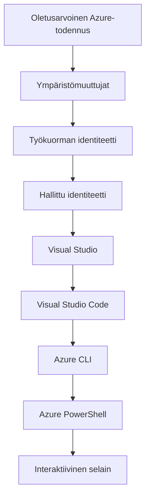

# AZD-perusteet - Azure Developer CLI:n ymmärtäminen

# AZD-perusteet - Ydinkäsitteet ja perusteet

**Kappaleen navigointi:**
- **📚 Kurssin etusivu**: [AZD For Beginners](../../README.md)
- **📖 Nykyinen luku**: Luku 1 - Perusta ja pika-aloitus
- **⬅️ Edellinen**: [Kurssin yleiskatsaus](../../README.md#-chapter-1-foundation--quick-start)
- **➡️ Seuraava**: [Asennus ja asetukset](installation.md)
- **🚀 Seuraava luku**: [Luku 2: AI-ensisijainen kehitys](../chapter-02-ai-development/microsoft-foundry-integration.md)

## Johdanto

Tässä oppitunnissa tutustut Azure Developer CLI:hin (azd), tehokkaaseen komentorivityökaluun, joka nopeuttaa matkaasi paikallisesta kehityksestä Azureen käyttöönottoon. Opit keskeiset käsitteet, pääominaisuudet ja ymmärrät, miten azd yksinkertaistaa pilvilähtöisten sovellusten käyttöönottoa.

## Oppimistavoitteet

Tämän oppitunnin jälkeen osaat:
- Ymmärtää, mitä Azure Developer CLI on ja mikä sen ensisijainen tarkoitus on
- Oppia mallien, ympäristöjen ja palveluiden ydinkäsitteet
- Tutkia keskeisiä ominaisuuksia, mukaan lukien mallipohjainen kehitys ja Infrastructure as Code
- Ymmärtää azd-projektin rakenteen ja työnkulun
- Olla valmis asentamaan ja konfiguroimaan azd kehitysympäristöösi

## Oppimistulokset

Oppitunnin suorittamisen jälkeen pystyt:
- Selittämään azd:n roolin nykyaikaisissa pilvikehitystyönkuluissa
- Tunnistamaan azd-projektin rakenteen osat
- Kuvaamaan, miten mallit, ympäristöt ja palvelut toimivat yhdessä
- Ymmärtämään Infrastructure as Code -etujen merkityksen azd:n kanssa
- Tunnistamaan erilaisia azd-komentoja ja niiden käyttötarkoituksia

## Mikä on Azure Developer CLI (azd)?

Azure Developer CLI (azd) on komentorivityökalu, joka on suunniteltu nopeuttamaan matkaasi paikallisesta kehityksestä Azureen käytettäväksi. Se yksinkertaistaa pilvilähtöisten sovellusten rakentamisen, käyttöönoton ja hallinnan prosessia Azurella.

### Mitä voit ottaa käyttöön azd:llä?

azd tukee laajaa valikoimaa työkuormia — ja lista kasvaa. Tänään voit käyttää azd:ta ottamaan käyttöön:

| Workload Type | Examples | Same Workflow? |
|---------------|----------|----------------|
| **Perinteiset sovellukset** | Verkkosovellukset, REST-rajapinnat, staattiset sivustot | ✅ `azd up` |
| **Palvelut ja mikropalvelut** | Container Apps, Function Apps, monipalveluiset backendit | ✅ `azd up` |
| **Tekoälyllä varustetut sovellukset** | Keskustelusovellukset Microsoft Foundry Models -malleilla, RAG-ratkaisut AI Searchin kanssa | ✅ `azd up` |
| **Älykkäät agentit** | Foundry-isännöidyt agentit, moni-agenttien orkestroinnit | ✅ `azd up` |

Keskeinen oivallus on, että **azd:n elinkaari pysyy samana riippumatta siitä, mitä otat käyttöön**. Aloitat projektin alustusvaiheella, provisioit infrastruktuurin, otat koodin käyttöön, seuraat sovellusta ja siivoat jäljet — oli kyseessä yksinkertainen verkkosivusto tai edistynyt tekoälyagentti.

Tämä jatkuvuus on suunniteltu tarkoituksella. azd käsittelee tekoälyominaisuuksia yhtenä palveluna, jota sovelluksesi voi käyttää, ei joksikin täysin erilaiseksi. Keskustelupäätepiste, jota Microsoft Foundry Models tukevat, on azd:n näkökulmasta vain toinen konfiguroitava ja otettava käyttöön oleva palvelu.

### 🎯 Miksi käyttää AZD:ta? Todellisen maailman vertailu

Vertaillaan yksinkertaisen verkkosovelluksen ja tietokannan käyttöönottoa:

#### ❌ ILMAN AZD: Manuaalinen Azure-käyttöönotto (30+ minuuttia)

```bash
# Vaihe 1: Luo resurssiryhmä
az group create --name myapp-rg --location eastus

# Vaihe 2: Luo App Service -suunnitelma
az appservice plan create --name myapp-plan \
  --resource-group myapp-rg \
  --sku B1 --is-linux

# Vaihe 3: Luo Web-sovellus
az webapp create --name myapp-web-unique123 \
  --resource-group myapp-rg \
  --plan myapp-plan \
  --runtime "NODE:18-lts"

# Vaihe 4: Luo Cosmos DB -tili (10-15 minuuttia)
az cosmosdb create --name myapp-cosmos-unique123 \
  --resource-group myapp-rg \
  --kind MongoDB

# Vaihe 5: Luo tietokanta
az cosmosdb mongodb database create \
  --account-name myapp-cosmos-unique123 \
  --resource-group myapp-rg \
  --name tododb

# Vaihe 6: Luo kokoelma
az cosmosdb mongodb collection create \
  --account-name myapp-cosmos-unique123 \
  --resource-group myapp-rg \
  --database-name tododb \
  --name todos

# Vaihe 7: Hae yhteysmerkkijono
CONN_STR=$(az cosmosdb keys list \
  --name myapp-cosmos-unique123 \
  --resource-group myapp-rg \
  --type connection-strings \
  --query "connectionStrings[0].connectionString" -o tsv)

# Vaihe 8: Määritä sovellusasetukset
az webapp config appsettings set \
  --name myapp-web-unique123 \
  --resource-group myapp-rg \
  --settings MONGODB_URI="$CONN_STR"

# Vaihe 9: Ota lokitus käyttöön
az webapp log config --name myapp-web-unique123 \
  --resource-group myapp-rg \
  --application-logging filesystem \
  --detailed-error-messages true

# Vaihe 10: Määritä Application Insights
az monitor app-insights component create \
  --app myapp-insights \
  --location eastus \
  --resource-group myapp-rg

# Vaihe 11: Yhdistä Application Insights Web-sovellukseen
INSTRUMENTATION_KEY=$(az monitor app-insights component show \
  --app myapp-insights \
  --resource-group myapp-rg \
  --query "instrumentationKey" -o tsv)

az webapp config appsettings set \
  --name myapp-web-unique123 \
  --resource-group myapp-rg \
  --settings APPINSIGHTS_INSTRUMENTATIONKEY="$INSTRUMENTATION_KEY"

# Vaihe 12: Rakenna sovellus paikallisesti
npm install
npm run build

# Vaihe 13: Luo käyttöönottopaketti
zip -r app.zip . -x "*.git*" "node_modules/*"

# Vaihe 14: Ota sovellus käyttöön
az webapp deployment source config-zip \
  --resource-group myapp-rg \
  --name myapp-web-unique123 \
  --src app.zip

# Vaihe 15: Odota ja rukoile, että se toimii 🙏
# (Ei automaattista validointia, vaaditaan manuaalista testausta)
```

**Ongelmia:**
- ❌ 15+ komentoa muistettavana ja suoritettavana oikeassa järjestyksessä
- ❌ 30–45 minuuttia manuaalista työtä
- ❌ Helppo tehdä virheitä (kirjoitusvirheet, väärät parametriset)
- ❌ Yhteysmerkkijonot näkyvissä terminaalihistoriassa
- ❌ Ei automaattista rollbackia, jos jokin epäonnistuu
- ❌ Vaikea toistaa tiimin jäsenille
- ❌ Eri joka kerta (ei toistettavissa)

#### ✅ AZD:N KANSSA: Automaattinen käyttöönotto (5 komentoa, 10–15 minuuttia)

```bash
# Vaihe 1: Alusta mallipohjasta
azd init --template todo-nodejs-mongo

# Vaihe 2: Todenna
azd auth login

# Vaihe 3: Luo ympäristö
azd env new dev

# Vaihe 4: Esikatsele muutoksia (valinnainen mutta suositeltava)
azd provision --preview

# Vaihe 5: Ota kaikki käyttöön
azd up

# ✨ Valmista! Kaikki on otettu käyttöön, määritetty ja valvottu
```

**Edut:**
- ✅ **5 komentoa** vs. 15+ manuaalista vaihetta
- ✅ **10–15 minuuttia** kokonaisaikaa (useimmiten odottelua Azuren puolella)
- ✅ **Vähemmän manuaalisia virheitä** - johdonmukainen, mallipohjainen työnkulku
- ✅ **Turvallinen salasanahallinta** - monet mallit käyttävät Azure-hallittua salavarastoa
- ✅ **Toistettavat käyttöönotot** - sama työnkulku joka kerta
- ✅ **Täysin toistettavissa** - sama lopputulos joka kerta
- ✅ **Tiimivalmis** - kuka tahansa voi ottaa käyttöön samoin komennoin
- ✅ **Infrastructure as Code** - versiohallitut Bicep-mallit
- ✅ **Sisäänrakennettu seuranta** - Application Insights konfiguroitu automaattisesti

### 📊 Aika- ja virheiden vähentäminen

| Metric | Manual Deployment | AZD Deployment | Improvement |
|:-------|:------------------|:---------------|:------------|
| **Komennot** | 15+ | 5 | 67% vähemmän |
| **Aika** | 30-45 min | 10-15 min | 60% nopeampi |
| **Virheprosentti** | ~40% | <5% | 88% vähenemä |
| **Johdonmukaisuus** | Alhainen (manuaalinen) | 100% (automaattinen) | Täydellinen |
| **Tiimin perehdytys** | 2–4 tuntia | 30 minuuttia | 75% nopeampi |
| **Rollback-aika** | 30+ min (manuaalinen) | 2 min (automaattinen) | 93% nopeampi |

## Ydinkonseptit

### Mallit
Mallit muodostavat azd:n perustan. Ne sisältävät:
- **Sovelluskoodi** - Lähdekoodisi ja riippuvuudet
- **Infrastruktuurin määrittelyt** - Azure-resurssit määriteltynä Bicepillä tai Terraformilla
- **Konfiguraatiotiedostot** - Asetukset ja ympäristömuuttujat
- **Käyttöönotto-skriptit** - Automaattiset käyttöönoton työnkulut

### Ympäristöt
Ympäristöt edustavat erilaisia käyttöönotton kohteita:
- **Development** - Testaukseen ja kehitykseen
- **Staging** - Esituotantoympäristö
- **Production** - Tuotantoympäristö

Jokaisella ympäristöllä on oma:
- Azure-resurssiryhmä
- Konfiguraatioasetukset
- Käyttöönoton tila

### Palvelut
Palvelut ovat sovelluksesi rakennuspalikoita:
- **Frontend** - Verkkosovellukset, SPA:t
- **Backend** - API:t, mikropalvelut
- **Database** - Tietovarastoratkaisut
- **Storage** - Tiedosto- ja blob-tallennus

## Keskeiset ominaisuudet

### 1. Mallipohjainen kehitys
```bash
# Selaa saatavilla olevia malleja
azd template list

# Alusta mallista
azd init --template <template-name>
```

### 2. Infrastruktuuri koodina
- **Bicep** - Azuren domainikohtainen kieli
- **Terraform** - Monipilvi-infrastruktuurityökalu
- **ARM Templates** - Azure Resource Manager -mallit

### 3. Integroitu työnkulku
```bash
# Kattava käyttöönoton työnkulku
azd up            # Provision + Deploy tämä ei vaadi manuaalista puuttumista ensimmäisen käyttöönoton aikana

# 🧪 UUTTA: Esikatsele infrastruktuurin muutoksia ennen käyttöönottoa (TURVALLINEN)
azd provision --preview    # Simuloi infrastruktuurin käyttöönottoa tekemättä muutoksia

azd provision     # Luo Azure-resursseja — käytä tätä, jos päivität infrastruktuuria
azd deploy        # Ota sovelluskoodi käyttöön tai ota se uudelleen käyttöön päivityksen jälkeen
azd down          # Siivoa resurssit
```

#### 🛡️ Turvallinen infrastruktuurin suunnittelu esikatselun avulla
`azd provision --preview` -komento on mullistava turvallisten käyttöönottojen kannalta:
- **Kuivakäynnin analyysi** - Näyttää, mitä luodaan, muutetaan tai poistetaan
- **Ei riskiä** - Ei todellisia muutoksia Azure-ympäristöösi
- **Tiimiyhteistyö** - Jaa esikatselutulokset ennen käyttöönottoa
- **Kustannusarvio** - Ymmärrä resurssien kustannukset ennen sitoutumista

```bash
# Esimerkkiesikatselutyönkulku
azd provision --preview           # Katso, mitä muuttuu
# Tarkista tulos, keskustele tiimin kanssa
azd provision                     # Ota muutokset käyttöön luottavaisin mielin
```

### 📊 Visualisointi: AZD-kehitystyönkulku


**Työnkulun selitys:**
1. **Init** - Aloita mallista tai uudesta projektista
2. **Auth** - Todennu Azureen
3. **Environment** - Luo eristetty käyttöönottoympäristö
4. **Preview** - 🆕 Esikatsele aina infrastruktuurimuutokset ensin (turvallinen käytäntö)
5. **Provision** - Luo/päivitä Azure-resurssit
6. **Deploy** - Työnnä sovelluskoodisi
7. **Monitor** - Seuraa sovelluksen suorituskykyä
8. **Iterate** - Tee muutoksia ja ota koodi uudelleen käyttöön
9. **Cleanup** - Poista resurssit, kun et enää tarvitse niitä

### 4. Ympäristöjen hallinta
```bash
# Luo ja hallinnoi ympäristöjä
azd env new <environment-name>
azd env select <environment-name>
azd env list
```

### 5. Laajennukset ja tekoälykäskyt

azd käyttää laajennusjärjestelmää lisätäksesi ominaisuuksia ydinkomentorivin ulkopuolelle. Tämä on erityisen hyödyllistä tekoälytyökuormille:

```bash
# Listaa saatavilla olevat laajennukset
azd extension list

# Asenna Foundry Agents -laajennus
azd extension install azure.ai.agents

# Alusta tekoälyagenttiprojekti manifestista
azd ai agent init -m agent-manifest.yaml

# Käynnistä MCP-palvelin tekoälyn tukemaa kehitystä varten (Alpha)
azd mcp start
```

> Laajennuksia käsitellään yksityiskohtaisesti luvussa [Luku 2: AI-ensisijainen kehitys](../chapter-02-ai-development/agents.md) ja viitteessä [AZD AI CLI -käskyt](../chapter-08-production/production-ai-practices.md#azd-ai-cli-commands-and-extensions).

## 📁 Projektin rakenne

Tyypillinen azd-projektin rakenne:
```
my-app/
├── .azd/                    # azd configuration
│   └── config.json
├── .azure/                  # Azure deployment artifacts
├── .devcontainer/          # Development container config
├── .github/workflows/      # GitHub Actions
├── .vscode/               # VS Code settings
├── infra/                 # Infrastructure code
│   ├── main.bicep        # Main infrastructure template
│   ├── main.parameters.json
│   └── modules/          # Reusable modules
├── src/                  # Application source code
│   ├── api/             # Backend services
│   └── web/             # Frontend application
├── azure.yaml           # azd project configuration
└── README.md
```

## 🔧 Konfiguraatiotiedostot

### azure.yaml
Pääasiallinen projektin konfiguraatiotiedosto:
```yaml
name: my-awesome-app
metadata:
  template: my-template@1.0.0

services:
  web:
    project: ./src/web
    language: js
    host: appservice
  api:
    project: ./src/api
    language: js
    host: appservice

hooks:
  preprovision:
    shell: pwsh
    run: echo "Preparing to provision..."
```

### .azure/config.json
Ympäristökohtainen konfiguraatio:
```json
{
  "version": 1,
  "defaultEnvironment": "dev",
  "environments": {
    "dev": {
      "subscriptionId": "your-subscription-id",
      "location": "eastus"
    }
  }
}
```

## 🎪 Yleiset työnkulut käytännön harjoituksilla

> **💡 Oppimisvinkki:** Suorita nämä harjoitukset järjestyksessä kehittääksesi AZD-taitojasi vaiheittain.

### 🎯 Harjoitus 1: Alusta ensimmäinen projektisi

**Tavoite:** Luo AZD-projekti ja tutki sen rakennetta

**Vaiheet:**
```bash
# Käytä todistettua mallipohjaa
azd init --template todo-nodejs-mongo

# Tutki luotuja tiedostoja
ls -la  # Näytä kaikki tiedostot mukaan lukien piilotetut

# Luodut keskeiset tiedostot:
# - azure.yaml (pääkonfiguraatio)
# - infra/ (infrastruktuurikoodi)
# - src/ (sovelluskoodi)
```

**✅ Onnistuminen:** Sinulla on azure.yaml-, infra/ ja src/ -hakemistot

---

### 🎯 Harjoitus 2: Ota käyttöön Azureen

**Tavoite:** Suorita täydellinen päästä päähän -käyttöönotto

**Vaiheet:**
```bash
# 1. Autentikoi
az login && azd auth login

# 2. Luo ympäristö
azd env new dev
azd env set AZURE_LOCATION eastus

# 3. Esikatsele muutokset (SUOSITELTAVAA)
azd provision --preview

# 4. Ota kaikki käyttöön
azd up

# 5. Varmista käyttöönotto
azd show    # Näytä sovelluksesi URL-osoite
```

**Arvioitu aika:** 10-15 minuuttia  
**✅ Onnistuminen:** Sovelluksen URL avautuu selaimessa

---

### 🎯 Harjoitus 3: Useita ympäristöjä

**Tavoite:** Ota käyttöön dev- ja staging-ympäristöihin

**Vaiheet:**
```bash
# Dev-ympäristö on jo olemassa, luo staging-ympäristö
azd env new staging
azd env set AZURE_LOCATION westus2
azd up

# Vaihda niiden välillä
azd env list
azd env select dev
```

**✅ Onnistuminen:** Kaksi erillistä resurssiryhmää Azure-portaalissa

---

### 🛡️ Täydellinen nollaus: `azd down --force --purge`

Kun sinun täytyy palauttaa kaikki kokonaan:

```bash
azd down --force --purge
```

**Mitä se tekee:**
- `--force`: Ei vahvistuskyselyjä
- `--purge`: Poistaa kaiken paikallisen tilan ja Azure-resurssit

**Käytä kun:**
- Käyttöönotto epäonnistui keskellä prosessia
- Vaihdat projekteja
- Tarvitset puhtaan aloituksen

---

## 🎪 Alkuperäinen työnkulun viite

### Uuden projektin aloittaminen
```bash
# Menetelmä 1: Käytä olemassa olevaa mallia
azd init --template todo-nodejs-mongo

# Menetelmä 2: Aloita alusta
azd init

# Menetelmä 3: Käytä nykyistä hakemistoa
azd init .
```

### Kehityssykli
```bash
# Määritä kehitysympäristö
azd auth login
azd env new dev
azd env select dev

# Ota kaikki käyttöön
azd up

# Tee muutoksia ja ota uudelleen käyttöön
azd deploy

# Siivoa lopuksi
azd down --force --purge # Komento Azure Developer CLI:ssä on ympäristösi täydellinen nollaus — erityisen hyödyllinen, kun vianetsit epäonnistuneita käyttöönottoja, siivoat hylättyjä resursseja tai valmistelet uutta uudelleenkäyttöönottoa.
```

## Ymmärtäminen `azd down --force --purge`
`azd down --force --purge` -komento on tehokas tapa purkaa azd-ympäristösi kokonaan ja poistaa kaikki siihen liittyvät resurssit. Tässä erittely siitä, mitä kukin lippu tekee:
```
--force
```
- Ohittaa vahvistuskehotteet.
- Hyödyllinen automaatiossa tai skriptauksessa, jossa manuaalinen syöte ei ole mahdollinen.
- Varmistaa, että purku etenee keskeytyksettä, vaikka CLI havaitsisi epäjohdonmukaisuuksia.

```
--purge
```
Poistaa **kaiken asiaankuuluvan metadatan**, mukaan lukien:
Ympäristön tila
Paikallinen `.azure`-kansio
Välimuistissa oleva käyttöönottoinformaatio
Estää azd:ä "muistamasta" aiempia käyttöönottoja, mikä voi aiheuttaa ongelmia, kuten resursseja koskevien ryhmien väärinmäärityksiä tai vanhentuneita rekisteriviitteitä.

### Miksi käyttää kumpaakin?
Kun olet jumissa `azd up` -komennon kanssa jäljelle jääneen tilan tai osittaisten käyttöönottojen vuoksi, tämä yhdistelmä varmistaa **puhtaan alun**.

Se on erityisen hyödyllinen sen jälkeen, kun olet poistanut resursseja manuaalisesti Azure-portaalissa tai vaihdat malleja, ympäristöjä tai resurssiryhmien nimeämiskäytäntöjä.

### Useiden ympäristöjen hallinta
```bash
# Luo staging-ympäristö
azd env new staging
azd env select staging
azd up

# Vaihda takaisin deviin
azd env select dev

# Vertaa ympäristöjä
azd env list
```

## 🔐 Todennus ja tunnistetiedot

Todennuksen ymmärtäminen on ratkaisevan tärkeää azd-käyttöönottojen onnistumiselle. Azure käyttää useita todennusmenetelmiä, ja azd hyödyntää samaa tunnistusketjua kuin muut Azure-työkalut.

### Azure CLI -todennus (`az login`)

Ennen azd:n käyttöä sinun on todentuduttava Azureen. Yleisimmät menetelmät tapahtuvat Azure CLI:n kautta:

```bash
# Interaktiivinen kirjautuminen (avaa selaimen)
az login

# Kirjaudu tiettyyn vuokraajaan
az login --tenant <tenant-id>

# Kirjaudu palvelutunnuksella
az login --service-principal -u <app-id> -p <password> --tenant <tenant-id>

# Tarkista nykyinen kirjautumistila
az account show

# Listaa saatavilla olevat tilaukset
az account list --output table

# Aseta oletustilaus
az account set --subscription <subscription-id>
```

### Autentikointivirtaus
1. **Interaktiivinen kirjautuminen**: Avaa oletusselaimesi todennusta varten
2. **Device Code Flow**: Ympäristöihin ilman selainkäyttöä
3. **Service Principal**: Automaatiota ja CI/CD-skenaarioita varten
4. **Managed Identity**: Azure-isännöidyille sovelluksille

### DefaultAzureCredential -ketju

`DefaultAzureCredential` on tunnistetyyppi, joka tarjoaa yksinkertaistetun todennuskokemuksen yrittämällä automaattisesti useita tunnistuslähteitä tietyssä järjestyksessä:

#### Todennusketjun järjestys

#### 1. Ympäristömuuttujat
```bash
# Aseta ympäristömuuttujat palvelutunnukselle
export AZURE_CLIENT_ID="<app-id>"
export AZURE_CLIENT_SECRET="<password>"
export AZURE_TENANT_ID="<tenant-id>"
```

#### 2. Workload Identity (Kubernetes/GitHub Actions)
Käytetään automaattisesti:
- Azure Kubernetes Service (AKS) Workload Identityn kanssa
- GitHub Actions OIDC-federoinnin kanssa
- Muissa federoidun identiteetin skenaarioissa

#### 3. Managed Identity
Azure-resursseille, kuten:
- Virtuaalikoneet
- App Service
- Azure Functions
- Container Instances

```bash
# Tarkista, ajetaanko Azure-resurssissa, jossa on hallinnoitu identiteetti
az account show --query "user.type" --output tsv
# Palauttaa: "servicePrincipal", jos käytössä on hallinnoitu identiteetti
```

#### 4. Kehitystyökalujen integrointi
- **Visual Studio**: Käyttää automaattisesti sisäänkirjautunutta tiliä
- **VS Code**: Käyttää Azure Account -laajennuksen tunnistetietoja
- **Azure CLI**: Käyttää `az login` -tunnistetietoja (yleisin paikallisessa kehityksessä)

### AZD:n todennuksen asetukset

```bash
# Menetelmä 1: Käytä Azure CLI:tä (Suositeltavaa kehitykseen)
az login
azd auth login  # Käyttää olemassa olevia Azure CLI -tunnistetietoja

# Menetelmä 2: Suora azd-todennus
azd auth login --use-device-code  # Ilman käyttöliittymää toimiville ympäristöille

# Menetelmä 3: Tarkista todennuksen tila
azd auth login --check-status

# Menetelmä 4: Kirjaudu ulos ja kirjaudu uudelleen
azd auth logout
azd auth login
```

### Autentikoinnin parhaat käytännöt

#### Paikalliseen kehitykseen
```bash
# 1. Kirjaudu sisään Azure CLI:llä
az login

# 2. Varmista oikea tilaus
az account show
az account set --subscription "Your Subscription Name"

# 3. Käytä azd-työkalua olemassa olevilla tunnistetiedoilla
azd auth login
```

#### CI/CD-putkille
```yaml
# GitHub Actions example
- name: Azure Login
  uses: azure/login@v1
  with:
    creds: ${{ secrets.AZURE_CREDENTIALS }}

- name: Deploy with azd
  run: |
    azd auth login --client-id ${{ secrets.AZURE_CLIENT_ID }} \
                    --client-secret ${{ secrets.AZURE_CLIENT_SECRET }} \
                    --tenant-id ${{ secrets.AZURE_TENANT_ID }}
    azd up --no-prompt
```

#### Tuotantoympäristöille
- Käytä **Managed Identity** -tunnistetta, kun suoritat Azure-resursseilla
- Käytä **Service Principal** -tiliä automaatioskenaarioissa
- Vältä tunnistetietojen tallentamista koodiin tai konfiguraatiotiedostoihin
- Käytä **Azure Key Vault** -palvelua arkaluonteiseen konfiguraatioon

### Yleiset todennusongelmat ja ratkaisut

#### Ongelma: "No subscription found"
```bash
# Ratkaisu: Aseta oletustilaus
az account list --output table
az account set --subscription "<subscription-id>"
azd env set AZURE_SUBSCRIPTION_ID "<subscription-id>"
```

#### Ongelma: "Insufficient permissions"
```bash
# Ratkaisu: Tarkista ja myönnä tarvittavat roolit
az role assignment list --assignee $(az account show --query user.name --output tsv)

# Yleiset vaadittavat roolit:
# - Contributor (resurssien hallintaa varten)
# - User Access Administrator (roolien myöntämistä varten)
```

#### Ongelma: "Token expired"
```bash
# Ratkaisu: Kirjaudu uudelleen
az logout
az login
azd auth logout
azd auth login
```

### Autentikointi eri skenaarioissa

#### Paikallinen kehitys
```bash
# Henkilökohtainen kehitystili
az login
azd auth login
```

#### Tiimikehitys
```bash
# Käytä tiettyä vuokraajaa organisaatiota varten.
az login --tenant contoso.onmicrosoft.com
azd auth login
```

#### Monivuokraajaskenaariot
```bash
# Vaihda vuokralaisesta toiseen
az login --tenant tenant1.onmicrosoft.com
# Ota käyttöön vuokralaiselle 1
azd up

az login --tenant tenant2.onmicrosoft.com  
# Ota käyttöön vuokralaiselle 2
azd up
```

### Turvallisuusnäkökohdat
1. **Tunnistetietojen tallennus**: Älä koskaan tallenna tunnistetietoja lähdekoodiin
2. **Laajuuden rajoitus**: Käytä vähimmän etuoikeuden periaatetta palveluperiaatteille
3. **Tokenin kierrätys**: Kierrätä säännöllisesti palveluperiaatteen salaisuuksia
4. **Auditointi**: Valvo todennus- ja käyttöönottoaktiviteetteja
5. **Verkon suojaus**: Käytä yksityisiä päätepisteitä aina kun mahdollista

### Todennuksen vianmääritys

```bash
# Todennusongelmien vianmääritys
azd auth login --check-status
az account show
az account get-access-token

# Yleiset diagnostiikkakomennot
whoami                          # Nykyinen käyttäjäkonteksti
az ad signed-in-user show      # Azure AD -käyttäjän tiedot
az group list                  # Testaa resurssin käyttöoikeus
```

## Ymmärtäminen `azd down --force --purge`

### Löytäminen
```bash
azd template list              # Selaa malleja
azd template show <template>   # Mallin tiedot
azd init --help               # Alustusasetukset
```

### Projektinhallinta
```bash
azd show                     # Projektin yleiskatsaus
azd env list                # Saatavilla olevat ympäristöt ja valittu oletusympäristö
azd config show            # Konfiguraatioasetukset
```

### Valvonta
```bash
azd monitor                  # Avaa Azure-portaalin monitorointi
azd monitor --logs           # Näytä sovelluksen lokit
azd monitor --live           # Näytä reaaliaikaiset mittarit
azd pipeline config          # Ota CI/CD käyttöön
```

## Parhaat käytännöt

### 1. Käytä merkityksellisiä nimiä
```bash
# Hyvä
azd env new production-east
azd init --template web-app-secure

# Vältä
azd env new env1
azd init --template template1
```

### 2. Hyödynnä mallipohjia
- Aloita olemassa olevilla mallipohjilla
- Mukauta tarpeidesi mukaan
- Luo uudelleenkäytettäviä mallipohjia organisaatiollesi

### 3. Ympäristöjen eristäminen
- Käytä erillisiä ympäristöjä kehitys/testaus/tuotanto
- Älä koskaan ota tuotantoon suoraan paikalliselta koneelta
- Käytä CI/CD-putkia tuotantoon tehtäviin julkaisuihin

### 4. Konfiguraation hallinta
- Käytä ympäristömuuttujia arkaluontoisille tiedoille
- Pidä konfiguraatio versionhallinnassa
- Dokumentoi ympäristökohtaiset asetukset

## Oppimisen eteneminen

### Aloittelija (viikko 1–2)
1. Asenna azd ja kirjaudu sisään
2. Ota käyttöön yksinkertainen malli
3. Ymmärrä projektin rakenne
4. Opettele peruskomennot (up, down, deploy)

### Keskitaso (viikko 3–4)
1. Mukauta mallipohjia
2. Hallitse useita ympäristöjä
3. Ymmärrä infrastruktuurikoodi
4. Ota käyttöön CI/CD-putket

### Edistynyt (viikko 5+)
1. Luo mukautettuja mallipohjia
2. Edistyneet infrastruktuurimallit
3. Monialueiset käyttöönotot
4. Yritystason konfiguraatiot

## Seuraavat askeleet

**📖 Jatka luvun 1 opiskelua:**
- [Installation & Setup](installation.md) - Asenna ja määritä azd
- [Your First Project](first-project.md) - Suorita käytännön opetusohjelma
- [Configuration Guide](configuration.md) - Edistyneet konfiguraatioasetukset

**🎯 Valmiina seuraavaan lukuun?**
- [Chapter 2: AI-First Development](../chapter-02-ai-development/microsoft-foundry-integration.md) - Aloita AI-sovellusten rakentaminen

## Lisäresurssit

- [Azure Developer CLI Overview](https://learn.microsoft.com/en-us/azure/developer/azure-developer-cli/)
- [Template Gallery](https://azure.github.io/awesome-azd/)
- [Community Samples](https://github.com/Azure-Samples)

---

## 🙋 Usein kysytyt kysymykset

### Yleiset kysymykset

**K: Mikä on ero AZD:n ja Azure CLI:n välillä?**

V: Azure CLI (`az`) on tarkoitettu yksittäisten Azure-resurssien hallintaan. AZD (`azd`) on tarkoitettu kokonaisvaltaisten sovellusten hallintaan:

```bash
# Azure CLI - matalan tason resurssien hallinta
az webapp create --name myapp --resource-group rg
az sql server create --name myserver --resource-group rg
# ...tarvitaan vielä monia muita komentoja

# AZD - sovellustason hallinta
azd up  # Asentaa koko sovelluksen kaikkine resursseineen
```

**Ajattele sitä näin:**
- `az` = Toimii yksittäisten Lego-palikoiden kanssa
- `azd` = Työskentelee kokonaisilla Lego-seteillä

---

**K: Tarvitseeko minun osata Bicep tai Terraform käyttääkseni AZD:ta?**

V: Ei! Aloita mallipohjista:
```bash
# Käytä olemassa olevaa mallia - ei tarvita IaC-osaamista
azd init --template todo-nodejs-mongo
azd up
```

Voit oppia Bicepin myöhemmin mukauttaaksesi infrastruktuuria. Mallipohjat tarjoavat toimivia esimerkkejä, joista oppia.

---

**K: Paljonko AZD-mallipohjien ajaminen maksaa?**

V: Kustannukset vaihtelevat mallipohjittain. Useimmat kehitysmallit maksavat $50-150/kuukausi:

```bash
# Esikatsele kustannukset ennen käyttöönottoa
azd provision --preview

# Siivoa aina, kun et käytä
azd down --force --purge  # Poistaa kaikki resurssit
```

**Vinkki:** Käytä ilmaisia tasoja, kun saatavilla:
- App Service: F1 (Free) -taso
- Microsoft Foundry Models: Azure OpenAI 50 000 tokenia/kk ilmaiseksi
- Cosmos DB: 1000 RU/s ilmainen taso

---

**K: Voinko käyttää AZD:ta olemassa olevien Azure-resurssien kanssa?**

V: Kyllä, mutta on helpompaa aloittaa puhtaalta pöydältä. AZD toimii parhaiten, kun se hallinnoi koko elinkaarta. Olemassa oleville resursseille:
```bash
# Vaihtoehto 1: Tuo olemassa olevia resursseja (edistynyt)
azd init
# Sitten muokkaa infra/ viittaamaan olemassa oleviin resursseihin

# Vaihtoehto 2: Aloita alusta (suositeltu)
azd init --template matching-your-stack
azd up  # Luo uusi ympäristö
```

---

**K: Kuinka jaan projektini tiimin jäsenten kanssa?**

V: Tee commit AZD-projektista Git:iin (mutta ÄLÄ .azure-kansiota):
```bash
# Jo oletuksena .gitignore-tiedostossa
.azure/        # Sisältää salaisuuksia ja ympäristötietoja
*.env          # Ympäristömuuttujat

# Tiimin jäsenet silloin:
git clone <your-repo>
azd auth login
azd env new <their-name>-dev
azd up
```

Kaikki saavat identtisen infrastruktuurin samoista mallipohjista.

---

### Vianmäärityskysymykset

**K: "azd up" epäonnistui puolivälissä. Mitä teen?**

V: Tarkista virhe, korjaa se ja yritä uudelleen:
```bash
# Näytä yksityiskohtaiset lokit
azd show

# Yleisiä korjauksia:

# 1. Jos kiintiö on ylittynyt:
azd env set AZURE_LOCATION "westus2"  # Kokeile eri aluetta

# 2. Jos resurssin nimen ristiriita:
azd down --force --purge  # Aloita alusta
azd up  # Yritä uudelleen

# 3. Jos todennus on vanhentunut:
az login
azd auth login
azd up
```

**Yleisin ongelma:** Väärä Azure-tilaus valittu
```bash
az account list --output table
az account set --subscription "<correct-subscription>"
```

---

**K: Kuinka otan käyttöön vain koodimuutokset ilman uudelleenprovisionointia?**

V: Käytä `azd deploy` sen sijaan, että käytät `azd up`:
```bash
azd up          # Ensimmäisellä kerralla: provisiointi + käyttöönotto (hidas)

# Tee koodimuutoksia...

azd deploy      # Seuraavilla kerroilla: vain käyttöönotto (nopea)
```

Nopeusvertailu:
- `azd up`: 10–15 minuuttia (provisionoi infrastruktuurin)
- `azd deploy`: 2–5 minuuttia (vain koodi)

---

**K: Voinko muokata infrastruktuurin mallipohjia?**

V: Kyllä! Muokkaa Bicep-tiedostoja kansiossa `infra/`:
```bash
# azd init -komennon jälkeen
cd infra/
code main.bicep  # Muokkaa VS Codessa

# Esikatsele muutoksia
azd provision --preview

# Ota muutokset käyttöön
azd provision
```

**Vinkki:** Aloita pienestä - muuta ensin SKUit:
```bicep
// infra/main.bicep
sku: {
  name: 'B1'  // Change to 'P1V2' for production
}
```

---

**K: Kuinka poistan kaiken, mitä AZD loi?**

V: Yksi komento poistaa kaikki resurssit:
```bash
azd down --force --purge

# Tämä poistaa:
# - Kaikki Azure-resurssit
# - Resurssiryhmä
# - Paikallisen ympäristön tila
# - Välimuistiin tallennetut käyttöönoton tiedot
```

**Aja tämä aina kun:**
- Mallipohjan testaus on valmis
- Vaihdat toiseen projektiin
- Haluat aloittaa alusta

**Kustannussäästöt:** Käyttämättömien resurssien poistaminen = $0 kuluja

---

**K: Entä jos poistinkaan vahingossa resursseja Azure-portaalissa?**

V: AZD:n tila voi mennä epäsynkaksi. Puhdas aloitus:
```bash
# 1. Poista paikallinen tila
azd down --force --purge

# 2. Aloita alusta
azd up

# Alternative: Anna AZD:n tunnistaa ja korjata
azd provision  # Luo puuttuvat resurssit
```

---

### Edistyneet kysymykset

**K: Voinko käyttää AZD:ta CI/CD-putkissa?**

V: Kyllä! Esimerkki GitHub Actionsista:
```yaml
# .github/workflows/deploy.yml
name: Deploy with AZD

on:
  push:
    branches: [main]

jobs:
  deploy:
    runs-on: ubuntu-latest
    steps:
      - uses: actions/checkout@v2
      
      - name: Install azd
        run: curl -fsSL https://aka.ms/install-azd.sh | bash
      
      - name: Azure Login
        run: |
          azd auth login \
            --client-id ${{ secrets.AZURE_CLIENT_ID }} \
            --client-secret ${{ secrets.AZURE_CLIENT_SECRET }} \
            --tenant-id ${{ secrets.AZURE_TENANT_ID }}
      
      - name: Deploy
        run: azd up --no-prompt
```

---

**K: Kuinka käsittelen salaisuuksia ja arkaluonteisia tietoja?**

V: AZD integroituu automaattisesti Azure Key Vaultin kanssa:
```bash
# Salaisuudet tallennetaan Key Vaultiin, eivät koodiin
azd env set DATABASE_PASSWORD "$(openssl rand -base64 32)"

# AZD suorittaa automaattisesti:
# 1. Luo Key Vaultin
# 2. Tallentaa salaisuuden
# 3. Myöntää sovellukselle pääsyn Managed Identityn kautta
# 4. Injektoi ajon aikana
```

**Älä koskaan committaa:**
- `.azure/`-kansio (sisältää ympäristötiedot)
- `.env`-tiedostot (paikalliset salaisuudet)
- Yhteysmerkkijonot

---

**K: Voinko ottaa käyttöön useille alueille?**

V: Kyllä, luo ympäristö per alue:
```bash
# Itä-Yhdysvaltojen ympäristö
azd env new prod-eastus
azd env set AZURE_LOCATION eastus
azd up

# Länsi-Euroopan ympäristö
azd env new prod-westeurope
azd env set AZURE_LOCATION westeurope
azd up

# Jokainen ympäristö on itsenäinen
azd env list
```

Todellisissa monialueisissa sovelluksissa mukauta Bicep-mallipohjia julkaistaksesi useille alueille samanaikaisesti.

---

**K: Mistä saan apua, jos juutun?**

1. **AZD-dokumentaatio:** https://learn.microsoft.com/azure/developer/azure-developer-cli/
2. **GitHub Issues:** https://github.com/Azure/azure-dev/issues
3. **Discord:** [Azure Discord](https://discord.gg/microsoft-azure) - #azure-developer-cli -kanava
4. **Stack Overflow:** Tag `azure-developer-cli`
5. **Tämä kurssi:** [Troubleshooting Guide](../chapter-07-troubleshooting/common-issues.md)

**Vinkki:** Ennen kuin kysyt, suorita:
```bash
azd show       # Näyttää nykyisen tilan
azd version    # Näyttää versionisi
```
Sisällytä nämä tiedot kysymykseesi nopeampaa apua varten.

---

## 🎓 Mitä seuraavaksi?

Ymmärrät nyt AZD:n perusteet. Valitse polkusi:

### 🎯 Aloittelijoille:
1. **Seuraavaksi:** [Installation & Setup](installation.md) - Asenna AZD koneellesi
2. **Sitten:** [Your First Project](first-project.md) - Ota ensimmäinen sovellus käyttöön
3. **Harjoittele:** Suorita kaikki 3 harjoitusta tässä oppitunnissa

### 🚀 AI-kehittäjille:
1. **Siirry kohtaan:** [Chapter 2: AI-First Development](../chapter-02-ai-development/microsoft-foundry-integration.md)
2. **Ota käyttöön:** Aloita komennolla `azd init --template get-started-with-ai-chat`
3. **Opi:** Rakenna samalla, kun otat käyttöön

### 🏗️ Kokeneille kehittäjille:
1. **Käy läpi:** [Configuration Guide](configuration.md) - Edistyneet asetukset
2. **Tutki:** [Infrastructure as Code](../chapter-04-infrastructure/provisioning.md) - Bicep-syväluotaus
3. **Rakenna:** Luo mukautettuja mallipohjia pinollesi

---

**Lukuvalinta:**
- **📚 Kurssin etusivu**: [AZD For Beginners](../../README.md)
- **📖 Nykyinen luku**: Luku 1 - Perusta & pika-aloitus  
- **⬅️ Edellinen**: [Course Overview](../../README.md#-chapter-1-foundation--quick-start)
- **➡️ Seuraava**: [Installation & Setup](installation.md)
- **🚀 Seuraava luku**: [Chapter 2: AI-First Development](../chapter-02-ai-development/microsoft-foundry-integration.md)

---

<!-- CO-OP TRANSLATOR DISCLAIMER START -->
**Vastuuvapauslauseke**:
Tämä asiakirja on käännetty käyttämällä tekoälykäännöspalvelua [Co-op Translator](https://github.com/Azure/co-op-translator). Vaikka pyrimme tarkkuuteen, huomioithan, että automatisoiduissa käännöksissä saattaa esiintyä virheitä tai epätarkkuuksia. Alkuperäistä asiakirjaa sen alkuperäiskielellä on pidettävä auktoritatiivisena lähteenä. Kriittisen tiedon osalta suosittelemme ammattimaisen ihmiskääntäjän tekemää käännöstä. Emme ole vastuussa mistään tämän käännöksen käytöstä johtuvista väärinymmärryksistä tai virhetulkinnoista.
<!-- CO-OP TRANSLATOR DISCLAIMER END -->