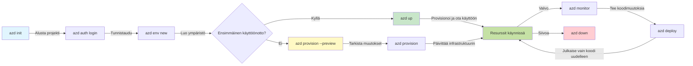
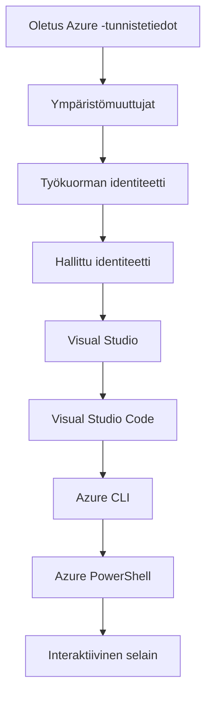

# AZD Basics - Azure Developer CLI:n ymmärtäminen

# AZD Basics - Peruskäsitteet ja perusteet

**Chapter Navigation:**
- **📚 Course Home**: [AZD Aloittelijoille](../../README.md)
- **📖 Current Chapter**: Luku 1 - Foundation & Quick Start
- **⬅️ Previous**: [Kurssin yleiskatsaus](../../README.md#-chapter-1-foundation--quick-start)
- **➡️ Next**: [Asennus ja asetukset](installation.md)
- **🚀 Next Chapter**: [Luku 2: AI-ensijainen kehitys](../chapter-02-ai-development/microsoft-foundry-integration.md)

## Johdanto

Tässä oppitunnissa tutustut Azure Developer CLI:hin (azd), tehokkaaseen komentorivityökaluun, joka nopeuttaa siirtymistä paikallisesta kehityksestä Azureen julkaisuun. Opit keskeiset käsitteet, tärkeimmät ominaisuudet ja ymmärrät, miten azd yksinkertaistaa pilvi-natiivien sovellusten käyttöönottoa.

## Oppimistavoitteet

Tämän oppitunnin jälkeen osaat:
- Ymmärtää, mikä Azure Developer CLI on ja mikä sen pääasiallinen tarkoitus on
- Oppia mallipohjien, ympäristöjen ja palveluiden peruskäsitteet
- Tutkia keskeisiä ominaisuuksia, kuten mallipohjaista kehitystä ja Infrastructure as Codea
- Ymmärtää azd-projektin rakenteen ja työnkulun
- Olla valmis asentamaan ja konfiguroimaan azd kehitysympäristössäsi

## Oppimistulokset

Oppitunnin suorittamisen jälkeen pystyt:
- Selittämään azd:n roolin nykyaikaisissa pilvikehityksen työnkuluissa
- Tunnistamaan azd-projektin rakenteen komponentit
- Kuvaamaan, miten mallipohjat, ympäristöt ja palvelut toimivat yhdessä
- Ymmärtämään Infrastructure as Code -hyödyt azd:n kanssa
- Tunnistamaan eri azd-komennot ja niiden tarkoitukset

## Mikä on Azure Developer CLI (azd)?

Azure Developer CLI (azd) on komentorivityökalu, joka on suunniteltu nopeuttamaan siirtymää paikallisesta kehityksestä Azureen julkaisuun. Se yksinkertaistaa pilvi-natiivien sovellusten rakentamista, käyttöönottoa ja hallintaa Azurella.

### Mitä voit ottaa käyttöön azd:llä?

azd tukee laajaa valikoimaa työkuormia — ja lista kasvaa jatkuvasti. Tämän päivän tilanteessa voit käyttää azd:ta seuraavien käyttöönottoon:

| Työkuorman tyyppi | Esimerkkejä | Sama työnkulku? |
|-------------------|-------------|-----------------|
| **Perinteiset sovellukset** | Web-sovellukset, REST-rajapinnat, staattiset sivustot | ✅ `azd up` |
| **Palvelut ja mikropalvelut** | Container Apps, Function Apps, monipalveluinen taustajärjestelmä | ✅ `azd up` |
| **AI-pohjaiset sovellukset** | Chat-sovellukset Microsoft Foundry -malleilla, RAG-ratkaisut AI-haulla | ✅ `azd up` |
| **Älykkäät agentit** | Foundryn isännöivät agentit, moni-agenttien orkestrointi | ✅ `azd up` |

Tärkeä oivallus on, että **azd:n elinkaari pysyy samana riippumatta siitä, mitä otat käyttöön**. Alustat projektin, provisioit infrastruktuurin, otat koodin käyttöön, seuraat sovellusta ja siivoat resurssit — olipa kyse yksinkertaisesta verkkosivusta tai monimutkaisesta AI-agentista.

Tämä jatkuvuus on suunniteltua. azd käsittelee AI-ominaisuuksia yhtenä palveluna, jota sovelluksesi voi käyttää, ei jotain perustavanlaatuisesti erilaista. Microsoft Foundry -mallien tukema chat-päätepiste on azd:n näkökulmasta vain yksi palvelu konfiguroitavaksi ja käyttöönotettavaksi.

### 🎯 Miksi käyttää AZD:ia? Käytännön vertailu

#### ❌ ILMAN AZD: Manuaalinen Azure-asennus (30+ minuuttia)

```bash
# Vaihe 1: Luo resurssiryhmä
az group create --name myapp-rg --location eastus

# Vaihe 2: Luo App Service -suunnitelma
az appservice plan create --name myapp-plan \
  --resource-group myapp-rg \
  --sku B1 --is-linux

# Vaihe 3: Luo Web-sovellus
az webapp create --name myapp-web-unique123 \
  --resource-group myapp-rg \
  --plan myapp-plan \
  --runtime "NODE:18-lts"

# Vaihe 4: Luo Cosmos DB -tili (10-15 minuuttia)
az cosmosdb create --name myapp-cosmos-unique123 \
  --resource-group myapp-rg \
  --kind MongoDB

# Vaihe 5: Luo tietokanta
az cosmosdb mongodb database create \
  --account-name myapp-cosmos-unique123 \
  --resource-group myapp-rg \
  --name tododb

# Vaihe 6: Luo kokoelma
az cosmosdb mongodb collection create \
  --account-name myapp-cosmos-unique123 \
  --resource-group myapp-rg \
  --database-name tododb \
  --name todos

# Vaihe 7: Hanki yhteysmerkkijono
CONN_STR=$(az cosmosdb keys list \
  --name myapp-cosmos-unique123 \
  --resource-group myapp-rg \
  --type connection-strings \
  --query "connectionStrings[0].connectionString" -o tsv)

# Vaihe 8: Määritä sovelluksen asetukset
az webapp config appsettings set \
  --name myapp-web-unique123 \
  --resource-group myapp-rg \
  --settings MONGODB_URI="$CONN_STR"

# Vaihe 9: Ota lokitus käyttöön
az webapp log config --name myapp-web-unique123 \
  --resource-group myapp-rg \
  --application-logging filesystem \
  --detailed-error-messages true

# Vaihe 10: Ota Application Insights käyttöön
az monitor app-insights component create \
  --app myapp-insights \
  --location eastus \
  --resource-group myapp-rg

# Vaihe 11: Yhdistä Application Insights Web-sovellukseen
INSTRUMENTATION_KEY=$(az monitor app-insights component show \
  --app myapp-insights \
  --resource-group myapp-rg \
  --query "instrumentationKey" -o tsv)

az webapp config appsettings set \
  --name myapp-web-unique123 \
  --resource-group myapp-rg \
  --settings APPINSIGHTS_INSTRUMENTATIONKEY="$INSTRUMENTATION_KEY"

# Vaihe 12: Rakenna sovellus paikallisesti
npm install
npm run build

# Vaihe 13: Luo käyttöönottopaketti
zip -r app.zip . -x "*.git*" "node_modules/*"

# Vaihe 14: Ota sovellus käyttöön
az webapp deployment source config-zip \
  --resource-group myapp-rg \
  --name myapp-web-unique123 \
  --src app.zip

# Vaihe 15: Odota ja rukoile, että se toimii 🙏
# (Ei automaattista validointia, manuaalinen testaus vaaditaan)
```

**Ongelmat:**
- ❌ Yli 15 komentoa muistettavaksi ja suoritettavaksi oikeassa järjestyksessä
- ❌ 30–45 minuuttia manuaalista työtä
- ❌ Helppo tehdä virheitä (kirjoitusvirheet, väärät parametrit)
- ❌ Yhteysmerkkijonot näkyvissä terminaalin historiassa
- ❌ Ei automaattista palautusta virheen sattuessa
- ❌ Vaikea toistaa tiimin jäsenille
- ❌ Eri joka kerta (ei toistettavissa)

#### ✅ AZD:N KANSSA: Automaattinen käyttöönotto (5 komentoa, 10-15 minuuttia)

```bash
# Vaihe 1: Alusta mallista
azd init --template todo-nodejs-mongo

# Vaihe 2: Todenna
azd auth login

# Vaihe 3: Luo ympäristö
azd env new dev

# Vaihe 4: Esikatsele muutoksia (valinnainen mutta suositeltava)
azd provision --preview

# Vaihe 5: Ota kaikki käyttöön
azd up

# ✨ Valmis! Kaikki on otettu käyttöön, konfiguroitu ja valvottu.
```

**Edut:**
- ✅ **5 komentoa** vs. yli 15 manuaalista vaihetta
- ✅ **10–15 minuuttia** kokonaisaika (suurin osa odottelua Azurelle)
- ✅ **Ei virheitä** - automatisoitu ja testattu
- ✅ **Salaisuudet hallitaan turvallisesti** Key Vaultin kautta
- ✅ **Automaattinen palautus** virhetilanteissa
- ✅ **Täysin toistettavissa** - sama tulos joka kerta
- ✅ **Tiimille sopiva** - kuka tahansa voi ottaa käyttöön samoilla komennoilla
- ✅ **Infrastructure as Code** - versionhallitut Bicep-mallit
- ✅ **Sisäänrakennettu seuranta** - Application Insights konfiguroidaan automaattisesti

### 📊 Ajan ja virheiden väheneminen

| Mittari | Manuaalinen käyttöönotto | AZD-käyttöönotto | Parannus |
|:--------|:-------------------------|:-----------------|:---------|
| **Komennot** | 15+ | 5 | 67 % vähemmän |
| **Aika** | 30–45 min | 10–15 min | 60 % nopeampi |
| **Virheprosentti** | ~40 % | <5 % | 88 % vähennys |
| **Johdonmukaisuus** | Matala (manuaalinen) | 100 % (automaattinen) | Täydellinen |
| **Tiimin perehdytys** | 2–4 tuntia | 30 minuuttia | 75 % nopeampi |
| **Palautusaika** | Yli 30 min (manuaalinen) | 2 min (automaattinen) | 93 % nopeampi |

## Keskeiset käsitteet

### Mallipohjat
Mallipohjat ovat azd:n perusta. Ne sisältävät:
- **Sovelluskoodi** - Lähdekoodisi ja riippuvuudet
- **Infrastruktuurin määritelmät** - Azure-resurssit määritelty Bicepillä tai Terraformilla
- **Konfiguraatiotiedostot** - Asetukset ja ympäristömuuttujat
- **Julkaisuskriptit** - Automaattiset käyttöönoton työnkulut

### Ympäristöt
Ympäristöt edustavat eri käyttöönottoympäristöjä:
- **Development** - Testausta ja kehitystä varten
- **Staging** - Esituotantoympäristö
- **Production** - Tuotantoympäristö

Jokainen ympäristö ylläpitää omaa:
- Azure-resurssiryhmää
- Konfiguraatioasetuksia
- Julkaisutilaa

### Palvelut
Palvelut ovat sovelluksesi rakennuspalikoita:
- **Frontend** - Web-sovellukset, SPA:t
- **Backend** - Rajapinnat (API), mikropalvelut
- **Database** - Tietovarastoratkaisut
- **Storage** - Tiedosto- ja blob-tallennus

## Keskeiset ominaisuudet

### 1. Mallipohjainen kehitys
```bash
# Selaa saatavilla olevia mallipohjia
azd template list

# Alusta mallipohjasta
azd init --template <template-name>
```

### 2. Infrastruktuuri koodina
- **Bicep** - Azuren domain-spesifinen kieli
- **Terraform** - Monipilvi-infrastruktuurityökalu
- **ARM Templates** - ARM-mallit

### 3. Integroitu työnkulku
```bash
# Täydellinen käyttöönoton työnkulku
azd up            # Provisiointi + käyttöönotto — tämä on täysin automatisoitu ensimmäisen asennuksen yhteydessä

# 🧪 UUSI: Esikatsele infrastruktuurimuutoksia ennen käyttöönottoa (TURVALLINEN)
azd provision --preview    # Simuloi infrastruktuurin käyttöönottoa ilman muutosten tekemistä

azd provision     # Luo Azure-resursseja — jos päivität infrastruktuuria, käytä tätä
azd deploy        # Ota sovelluskoodi käyttöön tai ota se uudelleen käyttöön päivityksen jälkeen
azd down          # Siivoa resurssit
```

#### 🛡️ Turvallinen infrastruktuurin suunnittelu esikatselulla
The `azd provision --preview` command is a game-changer for safe deployments:
- **Kuivaharjoitusanalyysi** - Näyttää, mitä luodaan, muokataan tai poistetaan
- **Ei riskiä** - Todellisia muutoksia Azure-ympäristöösi ei tehdä
- **Tiimiyhteistyö** - Jaa esikatselutulokset ennen käyttöönottoa
- **Kustannusarvio** - Ymmärrä resurssien kustannukset ennen sitoutumista

```bash
# Esimerkin esikatselutyönkulku
azd provision --preview           # Katso, mitä muuttuu
# Tarkista tulos, keskustele tiimin kanssa
azd provision                     # Ota muutokset käyttöön luottavaisin mielin
```

### 📊 Visualisointi: AZD-kehitystyönkulku


**Työnkulun selitys:**
1. **Init** - Aloita mallipohjalla tai uudella projektilla
2. **Auth** - Authenticate with Azure
3. **Environment** - Create isolated deployment environment
4. **Preview** - 🆕 Esikatsele aina infrastruktuurimuutokset ensin (turvallinen käytäntö)
5. **Provision** - Create/update Azure resources
6. **Deploy** - Push your application code
7. **Monitor** - Observe application performance
8. **Iterate** - Make changes and redeploy code
9. **Cleanup** - Remove resources when done

### 4. Ympäristöjen hallinta
```bash
# Luo ja hallitse ympäristöjä
azd env new <environment-name>
azd env select <environment-name>
azd env list
```

### 5. Laajennukset ja AI-komennot

azd käyttää laajennusjärjestelmää lisätäkseen ominaisuuksia ydinkomennon ulkopuolelle. Tämä on erityisen hyödyllistä AI-työkuormille:

```bash
# Listaa saatavilla olevat laajennukset
azd extension list

# Asenna Foundry Agents -laajennus
azd extension install azure.ai.agents

# Alusta tekoälyagenttiprojekti manifestista
azd ai agent init -m agent-manifest.yaml

# Käynnistä MCP-palvelin tekoälyavusteista kehitystä varten (Alpha)
azd mcp start
```

> Laajennuksia käsitellään yksityiskohtaisesti [Luku 2: AI-ensijainen kehitys](../chapter-02-ai-development/agents.md) -luvussa ja [AZD AI CLI Commands](../chapter-08-production/production-ai-practices.md#azd-ai-cli-commands-and-extensions) -viitteessä.

## 📁 Projektin rakenne

Tyypillinen azd-projektin rakenne:
```
my-app/
├── .azd/                    # azd configuration
│   └── config.json
├── .azure/                  # Azure deployment artifacts
├── .devcontainer/          # Development container config
├── .github/workflows/      # GitHub Actions
├── .vscode/               # VS Code settings
├── infra/                 # Infrastructure code
│   ├── main.bicep        # Main infrastructure template
│   ├── main.parameters.json
│   └── modules/          # Reusable modules
├── src/                  # Application source code
│   ├── api/             # Backend services
│   └── web/             # Frontend application
├── azure.yaml           # azd project configuration
└── README.md
```

## 🔧 Konfiguraatiotiedostot

### azure.yaml
Projektin pääkonfiguraatiotiedosto:
```yaml
name: my-awesome-app
metadata:
  template: my-template@1.0.0

services:
  web:
    project: ./src/web
    language: js
    host: appservice
  api:
    project: ./src/api
    language: js
    host: appservice

hooks:
  preprovision:
    shell: pwsh
    run: echo "Preparing to provision..."
```

### .azure/config.json
Ympäristökohtainen konfiguraatio:
```json
{
  "version": 1,
  "defaultEnvironment": "dev",
  "environments": {
    "dev": {
      "subscriptionId": "your-subscription-id",
      "location": "eastus"
    }
  }
}
```

## 🎪 Yleiset työnkulut käytännön harjoituksilla

> **💡 Oppimisvinkki:** Suorita nämä harjoitukset järjestyksessä kehittääksesi AZD-taitojasi asteittain.

### 🎯 Harjoitus 1: Alusta ensimmäinen projektisi

**Tavoite:** Luo AZD-projekti ja tutki sen rakennetta

**Steps:**
```bash
# Käytä testattua mallipohjaa
azd init --template todo-nodejs-mongo

# Tutki luotuja tiedostoja
ls -la  # Näytä kaikki tiedostot mukaan lukien piilotetut

# Keskeiset luodut tiedostot:
# - azure.yaml (pääkonfiguraatio)
# - infra/ (infrastruktuurikoodi)
# - src/ (sovelluskoodi)
```

**✅ Onnistuminen:** Sinulla on azure.yaml-, infra/ ja src/ -hakemistot

---

### 🎯 Harjoitus 2: Ota käyttöön Azureen

**Tavoite:** Suorita päästä päähän -käyttöönotto

**Steps:**
```bash
# 1. Todennus
az login && azd auth login

# 2. Luo ympäristö
azd env new dev
azd env set AZURE_LOCATION eastus

# 3. Esikatsele muutoksia (SUOSITELTAVA)
azd provision --preview

# 4. Ota kaikki käyttöön
azd up

# 5. Varmista käyttöönotto
azd show    # Näytä sovelluksesi URL-osoite
```

**Arvioitu aika:** 10–15 minuuttia  
**✅ Onnistuminen:** Sovelluksen URL avautuu selaimessa

---

### 🎯 Harjoitus 3: Useita ympäristöjä

**Tavoite:** Ota käyttöön dev- ja staging-ympäristöihin

**Steps:**
```bash
# dev on jo olemassa, luo staging
azd env new staging
azd env set AZURE_LOCATION westus2
azd up

# Vaihda niiden välillä
azd env list
azd env select dev
```

**✅ Onnistuminen:** Kaksi erillistä resurssiryhmää Azure-portaalissa

---

### 🛡️ Täysi nollaus: `azd down --force --purge`

Kun tarvitset täydellisen nollauksen:

```bash
azd down --force --purge
```

**Mitä se tekee:**
- `--force`: Ei vahvistuskyselyitä
- `--purge`: Poistaa kaiken paikallisen tilan ja Azure-resurssit

**Käytä kun:**
- Käyttöönotto epäonnistui kesken prosessin
- Vaihdetaan projektia
- Tarve uudelle alulle

---

## 🎪 Alkuperäinen työnkulkuviite

### Starting a New Project
```bash
# Menetelmä 1: Käytä olemassa olevaa mallipohjaa
azd init --template todo-nodejs-mongo

# Menetelmä 2: Aloita alusta
azd init

# Menetelmä 3: Käytä nykyistä hakemistoa
azd init .
```

### Development Cycle
```bash
# Määritä kehitysympäristö
azd auth login
azd env new dev
azd env select dev

# Ota kaikki käyttöön
azd up

# Tee muutoksia ja ota uudelleen käyttöön
azd deploy

# Siivoa kun olet valmis
azd down --force --purge # komento Azure Developer CLI:ssä on ympäristöllesi **täydellinen nollaus**—erityisen hyödyllinen, kun selvittelet epäonnistuneita käyttöönottoja, siivoat orpoja resursseja tai valmistelet uutta uudelleenkäyttöönottoa.
```

## `azd down --force --purge` -komennon ymmärtäminen
The `azd down --force --purge` command is a powerful way to completely tear down your azd environment and all associated resources. Here's a breakdown of what each flag does:
```
--force
```
- Ohittaa vahvistuskehotteet.
- Hyödyllinen automaatiossa tai skriptaamisessa, kun manuaalinen syöte ei ole mahdollinen.
- Varmistaa, että purkutoimenpide jatkuu keskeytyksettä, vaikka CLI havaitsisi ristiriitaisuuksia.

```
--purge
```
Poistaa **kaiken asiaankuuluvan metadatan**, mukaan lukien:
Ympäristön tila
Paikallinen `.azure`-kansio
Välimuistissa oleva julkaisutieto
Estää azd:ia "muistamasta" aiempia julkaisuja, mikä voi aiheuttaa ongelmia, kuten resurssiryhmien yhteensopimattomuuksia tai vanhentuneita rekisteriviitteitä.


### Miksi käyttää molempia?
Kun `azd up` epäonnistuu jäljelle jääneen tilan tai osittaisten käyttöönottojen vuoksi, tämä yhdistelmä varmistaa **täysin puhtaan alun**.

Se on erityisen hyödyllinen manuaalisten resurssien poistamisen jälkeen Azure-portaalissa tai kun vaihdetaan mallipohjia, ympäristöjä tai resurssiryhmien nimeämiskäytäntöjä.


### Useiden ympäristöjen hallinta
```bash
# Luo esituotantoympäristö
azd env new staging
azd env select staging
azd up

# Vaihda takaisin kehitykseen
azd env select dev

# Vertaa ympäristöjä
azd env list
```

## 🔐 Todennus ja tunnistetiedot

Todennuksen ymmärtäminen on ratkaisevaa onnistuneille azd-julkaisuilla. Azure käyttää useita todennusmenetelmiä, ja azd hyödyntää samaa tunnistetietoketjua kuin muut Azure-työkalut.

### Azure CLI -todennus (`az login`)

Ennen kuin käytät azd:ta, sinun on todentuduttava Azureen. Yleisin tapa on käyttää Azure CLI:tä:

```bash
# Interaktiivinen kirjautuminen (avaa selaimen)
az login

# Kirjaudu sisään tietyllä vuokralaisella
az login --tenant <tenant-id>

# Kirjaudu palvelupääkäyttäjänä
az login --service-principal -u <app-id> -p <password> --tenant <tenant-id>

# Tarkista nykyinen kirjautumistila
az account show

# Listaa saatavilla olevat tilaukset
az account list --output table

# Aseta oletustilaus
az account set --subscription <subscription-id>
```

### Todennusprosessi
1. **Interactive Login**: Avaa oletusselaimesi todennusta varten
2. **Device Code Flow**: Ympäristöihin, joissa selaimen käyttö ei ole mahdollista
3. **Service Principal**: Automaation ja CI/CD-tapauksissa
4. **Managed Identity**: Azure-isännöidyille sovelluksille

### DefaultAzureCredential-ketju

`DefaultAzureCredential` on tunnistetietotyyppi, joka tarjoaa yksinkertaistetun todennuskokemuksen yrittämällä automaattisesti useita tunnistuslähteitä tietyssä järjestyksessä:

#### Tunnistusketjun järjestys

#### 1. Ympäristömuuttujat
```bash
# Aseta ympäristömuuttujat palvelun päämiehelle
export AZURE_CLIENT_ID="<app-id>"
export AZURE_CLIENT_SECRET="<password>"
export AZURE_TENANT_ID="<tenant-id>"
```

#### 2. Workload Identity (Kubernetes/GitHub Actions)
Käytetään automaattisesti seuraavissa:
- Azure Kubernetes Service (AKS) Workload Identityn kanssa
- GitHub Actions OIDC-federoinnin kanssa
- Muut federoidut tunnistautumistilanteet

#### 3. Managed Identity
Azure-resursseille, kuten:
- Virtuaalikoneet
- App Service
- Azure Functions
- Container Instances

```bash
# Tarkista, ajetaanko Azure-resurssilla, jossa on hallinnoitu identiteetti
az account show --query "user.type" --output tsv
# Palauttaa: "servicePrincipal", jos käytössä on hallinnoitu identiteetti
```

#### 4. Kehitystyökalujen integrointi
- **Visual Studio**: Käyttää automaattisesti kirjautunutta tiliä
- **VS Code**: Käyttää Azure Account -laajennuksen tunnistetietoja
- **Azure CLI**: Käyttää `az login` -tunnistetietoja (yleisin paikallisessa kehityksessä)

### AZD Authentication Setup

```bash
# Tapa 1: Käytä Azure CLI:tä (Suositeltu kehitykseen)
az login
azd auth login  # Käyttää olemassa olevia Azure CLI -tunnistetietoja

# Tapa 2: Suora azd-autentikointi
azd auth login --use-device-code  # Headless-ympäristöihin

# Tapa 3: Tarkista autentikoinnin tila
azd auth login --check-status

# Tapa 4: Kirjaudu ulos ja kirjaudu uudelleen
azd auth logout
azd auth login
```

### Todennuksen parhaat käytännöt

#### For Local Development
```bash
# 1. Kirjaudu Azure CLI:llä
az login

# 2. Varmista oikea tilaus
az account show
az account set --subscription "Your Subscription Name"

# 3. Käytä azd:llä olemassa olevilla tunnistetiedoilla
azd auth login
```

#### For CI/CD Pipelines
```yaml
# GitHub Actions example
- name: Azure Login
  uses: azure/login@v1
  with:
    creds: ${{ secrets.AZURE_CREDENTIALS }}

- name: Deploy with azd
  run: |
    azd auth login --client-id ${{ secrets.AZURE_CLIENT_ID }} \
                    --client-secret ${{ secrets.AZURE_CLIENT_SECRET }} \
                    --tenant-id ${{ secrets.AZURE_TENANT_ID }}
    azd up --no-prompt
```

#### Tuotantoympäristöt
- Käytä **Managed Identityä**, kun suoritat Azure-resursseilla
- Käytä **Service Principalia** automaatioskenaarioissa
- Vältä tunnistetietojen tallentamista koodiin tai konfiguraatiotiedostoihin
- Käytä **Azure Key Vaultia** arkaluontoiselle konfiguraatiolle

### Yleiset todennusongelmat ja ratkaisut

#### Ongelma: "No subscription found"
```bash
# Ratkaisu: Aseta oletustilaus
az account list --output table
az account set --subscription "<subscription-id>"
azd env set AZURE_SUBSCRIPTION_ID "<subscription-id>"
```

#### Ongelma: "Insufficient permissions"
```bash
# Ratkaisu: Tarkista ja määritä vaaditut roolit
az role assignment list --assignee $(az account show --query user.name --output tsv)

# Yleiset vaaditut roolit:
# - Contributor (resurssien hallintaa varten)
# - User Access Administrator (roolien myöntämistä varten)
```

#### Ongelma: "Token expired"
```bash
# Ratkaisu: Kirjaudu uudelleen
az logout
az login
azd auth logout
azd auth login
```

### Todennus eri tilanteissa

#### Local Development
```bash
# Henkilökohtaisen kehityksen tili
az login
azd auth login
```

#### Team Development
```bash
# Käytä organisaatiolle tiettyä vuokraajaa
az login --tenant contoso.onmicrosoft.com
azd auth login
```

#### Multi-tenant Scenarios
```bash
# Vaihda vuokralaisesta toiseen
az login --tenant tenant1.onmicrosoft.com
# Ota käyttöön vuokralaiselle 1
azd up

az login --tenant tenant2.onmicrosoft.com  
# Ota käyttöön vuokralaiselle 2
azd up
```

### Turvallisuusnäkökohdat
1. **Tunnistetietojen tallennus**: Älä koskaan tallenna tunnuksia lähdekoodiin
2. **Oikeuksien rajoittaminen**: Käytä vähimmän etuoikeuden periaatetta palveluperiaatteille
3. **Tokenin kierto**: Kierrä säännöllisesti palveluperiaatteiden salaisuuksia
4. **Tarkastusloki**: Valvo todennus- ja käyttöönottoaktiviteetteja
5. **Verkon suojaus**: Käytä yksityisiä päätepisteitä aina kun mahdollista

### Autentikoinnin vianmääritys

```bash
# Vianmääritys todennukseen liittyvissä ongelmissa
azd auth login --check-status
az account show
az account get-access-token

# Yleiset diagnostiikkakomennot
whoami                          # Nykyinen käyttäjäkonteksti
az ad signed-in-user show      # Azure AD -käyttäjän tiedot
az group list                  # Testaa pääsyä resurssiin
```

## Komennon `azd down --force --purge` ymmärtäminen

### Löytäminen
```bash
azd template list              # Selaa malleja
azd template show <template>   # Mallin tiedot
azd init --help               # Alustusasetukset
```

### Projektinhallinta
```bash
azd show                     # Projektin yleiskatsaus
azd env show                 # Nykyinen ympäristö
azd config list             # Konfiguraatioasetukset
```

### Valvonta
```bash
azd monitor                  # Avaa Azure-portaalin valvonta
azd monitor --logs           # Näytä sovelluksen lokit
azd monitor --live           # Näytä reaaliaikaiset mittarit
azd pipeline config          # Ota CI/CD käyttöön
```

## Parhaat käytännöt

### 1. Käytä kuvaavia nimiä
```bash
# Hyvä
azd env new production-east
azd init --template web-app-secure

# Vältä
azd env new env1
azd init --template template1
```

### 2. Hyödynnä malleja
- Aloita olemassa olevilla malleilla
- Muokkaa tarpeidesi mukaan
- Luo uudelleenkäytettäviä malleja organisaatiollesi

### 3. Ympäristöjen eristäminen
- Käytä erillisiä ympäristöjä dev/staging/prod
- Älä koskaan ota tuotantoon suoraan paikalliselta koneelta
- Käytä CI/CD-putkia tuotantokäyttöönottoihin

### 4. Konfiguraation hallinta
- Käytä ympäristömuuttujia arkaluonteiselle datalle
- Pidä konfiguraatio versionhallinnassa
- Dokumentoi ympäristökohtaiset asetukset

## Oppimisen eteneminen

### Aloittelija (Viikko 1–2)
1. Asenna azd ja autentikoi
2. Ota käyttöön yksinkertainen malli
3. Ymmärrä projektin rakenne
4. Opiskele peruskomennot (up, down, deploy)

### Keskitaso (Viikko 3–4)
1. Muokkaa malleja
2. Hallitse useita ympäristöjä
3. Ymmärrä infrastruktuurikoodi
4. Perusta CI/CD-putket

### Edistynyt (Viikko 5+)
1. Luo mukautettuja malleja
2. Edistyneet infrastruktuurimallit
3. Monialueiset käyttöönotot
4. Yritystason konfiguraatiot

## Seuraavat askeleet

**📖 Jatka Luku 1:n oppimista:**
- [Installation & Setup](installation.md) - Asenna azd ja konfiguroi
- [Your First Project](first-project.md) - Suorita käytännön opetusohjelma
- [Configuration Guide](configuration.md) - Edistyneet konfiguraatioasetukset

**🎯 Valmis seuraavaan lukuun?**
- [Chapter 2: AI-First Development](../chapter-02-ai-development/microsoft-foundry-integration.md) - Aloita AI-sovellusten rakentaminen

## Lisäresurssit

- [Azure Developer CLI - Yleiskatsaus](https://learn.microsoft.com/en-us/azure/developer/azure-developer-cli/)
- [Malligalleria](https://azure.github.io/awesome-azd/)
- [Yhteisön esimerkit](https://github.com/Azure-Samples)

---

## 🙋 Usein kysytyt kysymykset

### Yleiset kysymykset

**K: Mikä on ero AZD:n ja Azure CLI:n välillä?**

V: Azure CLI (`az`) on tarkoitettu yksittäisten Azure-resurssien hallintaan. AZD (`azd`) on tarkoitettu kokonaisten sovellusten hallintaan:

```bash
# Azure CLI - matalan tason resurssien hallinta
az webapp create --name myapp --resource-group rg
az sql server create --name myserver --resource-group rg
# ...tarvitaan paljon lisää komentoja

# AZD - sovellustason hallinta
azd up  # Ottaa käyttöön koko sovelluksen kaikkine resursseineen
```

**Ajattele sitä näin:**
- `az` = Toimii yksittäisten Lego-palikoiden kanssa
- `azd` = Työskentelee kokonaisilla Lego-seteillä

---

**K: Tarvitseeko minun osata Bicep tai Terraform käyttääkseni AZD:ta?**

V: Ei! Aloita malleilla:
```bash
# Käytä olemassa olevaa mallia - IaC-osaamista ei tarvita
azd init --template todo-nodejs-mongo
azd up
```

Voit oppia Bicepin myöhemmin infrastruktuurin räätälöimiseksi. Mallit tarjoavat toimivia esimerkkejä, joista oppia.

---

**K: Kuinka paljon AZD-mallien suorittaminen maksaa?**

V: Kustannukset vaihtelevat mallin mukaan. Useimmat kehitysmallit maksavat 50–150 $/kk:

```bash
# Esikatsele kustannukset ennen käyttöönottoa
azd provision --preview

# Siivoa aina, kun et käytä
azd down --force --purge  # Poistaa kaikki resurssit
```

**Vinkki:** Käytä maksuttomia tasoja, kun saatavilla:
- App Service: F1 (Free) -taso
- Microsoft Foundry Models: Azure OpenAI 50,000 tokenia/kk ilmaiseksi
- Cosmos DB: 1000 RU/s ilmainen taso

---

**K: Voinko käyttää AZD:ta olemassa olevien Azure-resurssien kanssa?**

V: Kyllä, mutta on helpompi aloittaa puhtaalta pöydältä. AZD toimii parhaiten, kun se hallitsee koko elinkaaren. Olemassa oleville resursseille:
```bash
# Vaihtoehto 1: Tuo olemassa olevat resurssit (edistynyt)
azd init
# Muokkaa sitten infra/-hakemistoa viittaamaan olemassa oleviin resursseihin

# Vaihtoehto 2: Aloita alusta (suositeltu)
azd init --template matching-your-stack
azd up  # Luo uuden ympäristön
```

---

**K: Kuinka jaan projektini tiimiläisten kanssa?**

V: Tee AZD-projektista commit Gitiin (mutta ÄLÄ .azure-kansiota):
```bash
# Jo oletuksena .gitignore-tiedostossa
.azure/        # Sisältää salaisuuksia ja ympäristötietoja
*.env          # Ympäristömuuttujat

# Tiimin jäsenet sitten:
git clone <your-repo>
azd auth login
azd env new <their-name>-dev
azd up
```

Kaikki saavat identtisen infrastruktuurin samoista malleista.

---

### Vianmäärityskysymykset

**K: "azd up" epäonnistui puolivälissä. Mitä teen?**

V: Tarkista virhe, korjaa se ja yritä uudelleen:
```bash
# Näytä yksityiskohtaiset lokit
azd show

# Yleisiä korjauksia:

# 1. Jos kiintiö ylitetty:
azd env set AZURE_LOCATION "westus2"  # Kokeile eri aluetta

# 2. Jos resurssin nimen ristiriita:
azd down --force --purge  # Aloita alusta
azd up  # Yritä uudelleen

# 3. Jos todennus on vanhentunut:
az login
azd auth login
azd up
```

**Yleisin ongelma:** Väärä Azure-tilaus valittuna
```bash
az account list --output table
az account set --subscription "<correct-subscription>"
```

---

**K: Kuinka otan käyttöön vain koodimuutokset ilman uudelleenprovisionointia?**

V: Käytä `azd deploy`-komentoa `azd up` sijaan:
```bash
azd up          # Ensimmäisellä kerralla: provisiointi + käyttöönotto (hidas)

# Tee koodimuutoksia...

azd deploy      # Seuraavilla kerroilla: vain käyttöönotto (nopea)
```

Nopeusvertailu:
- `azd up`: 10–15 minuuttia (provisionoi infrastruktuurin)
- `azd deploy`: 2–5 minuuttia (vain koodi)

---

**K: Voinko muokata infrastruktuurimalleja?**

V: Kyllä! Muokkaa Bicep-tiedostoja kansiossa `infra/`:
```bash
# azd initin jälkeen
cd infra/
code main.bicep  # Muokkaa VS Codessa

# Esikatsele muutoksia
azd provision --preview

# Ota muutokset käyttöön
azd provision
```

**Vinkki:** Aloita pienesti – muuta ensin SKU-arvoja:
```bicep
// infra/main.bicep
sku: {
  name: 'B1'  // Change to 'P1V2' for production
}
```

---

**K: Kuinka poistan kaiken, mitä AZD on luonut?**

V: Yksi komento poistaa kaikki resurssit:
```bash
azd down --force --purge

# Tämä poistaa:
# - Kaikki Azure-resurssit
# - Resurssiryhmä
# - Paikallisen ympäristön tila
# - Välimuistiin tallennetut käyttöönoton tiedot
```

**Suorita tämä aina, kun:**
- Lopettanut mallin testaamisen
- Siirryt toiseen projektiin
- Haluat aloittaa alusta

**Säästö:** Käyttämättömien resurssien poistaminen = 0 $ kuluja

---

**K: Entä jos vahingossa poistin resursseja Azure-portaalissa?**

V: AZD:n tila voi mennä epäsynkkaan. Puhtaan pöydän lähestymistapa:
```bash
# 1. Poista paikallinen tila
azd down --force --purge

# 2. Aloita alusta
azd up

# Vaihtoehto: Anna AZD:n tunnistaa ja korjata
azd provision  # Luo puuttuvat resurssit
```

---

### Edistyneet kysymykset

**K: Voinko käyttää AZD:ta CI/CD-putkissa?**

V: Kyllä! Esimerkki GitHub Actions -käytöstä:
```yaml
# .github/workflows/deploy.yml
name: Deploy with AZD

on:
  push:
    branches: [main]

jobs:
  deploy:
    runs-on: ubuntu-latest
    steps:
      - uses: actions/checkout@v2
      
      - name: Install azd
        run: curl -fsSL https://aka.ms/install-azd.sh | bash
      
      - name: Azure Login
        run: |
          azd auth login \
            --client-id ${{ secrets.AZURE_CLIENT_ID }} \
            --client-secret ${{ secrets.AZURE_CLIENT_SECRET }} \
            --tenant-id ${{ secrets.AZURE_TENANT_ID }}
      
      - name: Deploy
        run: azd up --no-prompt
```

---

**K: Kuinka käsittelen salaisuuksia ja arkaluonteista dataa?**

V: AZD integroituu Azure Key Vaultiin automaattisesti:
```bash
# Salaisuuksia säilytetään Key Vaultissa, ei koodissa
azd env set DATABASE_PASSWORD "$(openssl rand -base64 32)"

# AZD automaattisesti:
# 1. Luo Key Vaultin
# 2. Tallentaa salaisuuden
# 3. Myöntää sovellukselle pääsyn hallinnoidun identiteetin kautta
# 4. Injektoi suoritusajan aikana
```

**Älä koskaan commitoi:**
- `.azure/`-kansio (sisältää ympäristötiedot)
- `.env`-tiedostot (paikalliset salaisuudet)
- Yhteysmerkkijonot

---

**K: Voinko ottaa käyttöön useisiin alueisiin?**

V: Kyllä, luo ympäristö per alue:
```bash
# Itä-Yhdysvaltojen ympäristö
azd env new prod-eastus
azd env set AZURE_LOCATION eastus
azd up

# Länsi-Euroopan ympäristö
azd env new prod-westeurope
azd env set AZURE_LOCATION westeurope
azd up

# Jokainen ympäristö on itsenäinen
azd env list
```

Todellisissa monialueisissa sovelluksissa mukauta Bicep-malleja ottaaksesi käyttöön useisiin alueisiin samanaikaisesti.

---

**K: Mistä voin saada apua, jos jumitan?**

1. **AZD-dokumentaatio:** https://learn.microsoft.com/azure/developer/azure-developer-cli/
2. **GitHub Issues:** https://github.com/Azure/azure-dev/issues
3. **Discord:** [Azure Discord](https://discord.gg/microsoft-azure) - #azure-developer-cli -kanava
4. **Stack Overflow:** Käytä tagia `azure-developer-cli`
5. **Tämä kurssi:** [Vianmääritysohje](../chapter-07-troubleshooting/common-issues.md)

**Vinkki:** Ennen kysymistä suorita:
```bash
azd show       # Näyttää nykytilan
azd version    # Näyttää versiosi
```
Lisää nämä tiedot kysymykseesi saadaksesi nopeampaa apua.

---

## 🎓 Mitä seuraavaksi?

Nyt ymmärrät AZD:n perusteet. Valitse polkusi:

### 🎯 Aloittelijoille:
1. **Seuraavaksi:** [Installation & Setup](installation.md) - Asenna AZD koneellesi
2. **Sitten:** [Your First Project](first-project.md) - Ota ensimmäinen sovelluksesi käyttöön
3. **Harjoittele:** Suorita kaikki kolme harjoitusta tässä oppitunnissa

### 🚀 AI-kehittäjille:
1. **Siirry:** [Luku 2: AI-First Development](../chapter-02-ai-development/microsoft-foundry-integration.md)
2. **Ota käyttöön:** Aloita komennolla `azd init --template get-started-with-ai-chat`
3. **Opiskele:** Rakenna samalla kun otat käyttöön

### 🏗️ Kokeneille kehittäjille:
1. **Käy läpi:** [Configuration Guide](configuration.md) - Edistyneet asetukset
2. **Tutki:** [Infrastructure as Code](../chapter-04-infrastructure/provisioning.md) - Syväsukellus Bicep:iin
3. **Rakenna:** Luo mukautettuja malleja pinollesi

---

**Lukujen navigointi:**
- **📚 Kurssin etusivu**: [AZD For Beginners](../../README.md)
- **📖 Nykyinen luku**: Luku 1 - Perusta & Pika-aloitus  
- **⬅️ Edellinen**: [Course Overview](../../README.md#-chapter-1-foundation--quick-start)
- **➡️ Seuraava**: [Installation & Setup](installation.md)
- **🚀 Seuraava luku**: [Chapter 2: AI-First Development](../chapter-02-ai-development/microsoft-foundry-integration.md)

---

<!-- CO-OP TRANSLATOR DISCLAIMER START -->
**Vastuuvapauslauseke**:
Tämä asiakirja on käännetty tekoälykäännöspalvelulla [Co-op Translator](https://github.com/Azure/co-op-translator). Vaikka pyrimme tarkkuuteen, huomioithan, että automaattiset käännökset saattavat sisältää virheitä tai epätarkkuuksia. Alkuperäistä asiakirjaa sen alkuperäiskielellä tulee pitää määräävänä lähteenä. Kriittisen tiedon osalta suositellaan ammattimaista ihmiskäännöstä. Emme ole vastuussa tämän käännöksen käytöstä aiheutuvista väärinymmärryksistä tai virheellisistä tulkinnoista.
<!-- CO-OP TRANSLATOR DISCLAIMER END -->