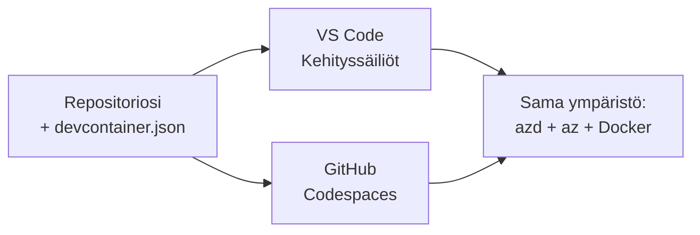

# Dev Containers & GitHub Codespaces azd:lle

**Luvun navigointi:**
- **📚 Kurssin etusivu**: [AZD Aloittelijoille](../../README.md)
- **📖 Nykyinen luku**: Luku 1 - Perusta & Pika-aloitus
- **⬅️ Edellinen**: [Tuo oma sovellus](bring-your-own-app.md)
- **🚀 Seuraava luku**: [Luku 2: AI-ensimmäinen kehitys](../chapter-02-ai-development/README.md)

> Vahvistettu `azd 1.25.6`:lla kesäkuussa 2026.

## Johdanto

Azd:n, oikean ohjelmointiajanajon, Dockerin ja Azure CLI:n asentaminen jokaiselle koneelle on työlästä — ja se on ykkössyy siihen, miksi opas, joka "toimii koneellani", ei toimi toisella henkilöllä. **dev container** ratkaisee tämän kuvaamalla koko työkaluketjusi tiedostossa. Kuka tahansa, joka avaa projektin VS Code:ssa tai GitHub Codespacesissa, saa täsmälleen saman ympäristön, jossa azd on jo asennettuna. Tässä oppitunnissa näytetään, miten sellainen lisätään.

## Oppimistavoitteet

Oppitunnin jälkeen osaat:
- Ymmärtää, mikä dev container on ja miksi se auttaa azd:n kanssa
- Lisätä projektiin minimaalisen `.devcontainer/devcontainer.json`
- Sisällyttää azd:n, Azure CLI:n ja Dockerin Dev Containerin *features*-ominaisuuksien kautta
- Avata projektin GitHub Codespacesissa tai VS Codessa

## Oppimistulokset

Oppitunnin suorittamisen jälkeen pystyt:
- Luoda `devcontainer.json` azd-projektia varten
- Lisätä azd:n ja Azuren työkalut ilman manuaalisia asennuksia
- Suorittaa `azd up` kontin tai Codespacen sisältä

---

## Mikä on dev container?

Dev container on Docker-pohjainen kehitysympäristö, joka määritellään repositoriossasi olevalla `.devcontainer/devcontainer.json` -tiedostolla. Kun avaat projektin:

- **VS Code** (Dev Containers -laajennuksen kanssa) rakentaa kontin ja liittää siihen.
- **GitHub Codespaces** rakentaa saman kontin pilvessä ja tarjoaa selaimessa toimivan editorin.

Joka tapauksessa jokainen kontribuoija saa identtiset työkalut — ei enää "asensitko azd:n?" -vianmääritystä.



---

## Vaihe 1: Luo devcontainer-tiedosto

Luo `.devcontainer/devcontainer.json` projektisi juureen:

```json
{
  "name": "azd-project",
  "image": "mcr.microsoft.com/devcontainers/base:bookworm",
  "features": {
    "ghcr.io/devcontainers/features/azure-cli:1": {},
    "ghcr.io/azure/azure-dev/azd:latest": {},
    "ghcr.io/devcontainers/features/docker-in-docker:2": {},
    "ghcr.io/devcontainers/features/node:1": {}
  },
  "customizations": {
    "vscode": {
      "extensions": [
        "ms-azuretools.azure-dev",
        "ms-azuretools.vscode-bicep"
      ]
    }
  },
  "forwardPorts": [3000],
  "postCreateCommand": "azd version"
}
```

Mitä kukin osa tekee:

| Key | Purpose |
|-----|---------|
| `image` | Kontin peruskäyttöjärjestelmä |
| `features` | Valmiit asennusohjelmat — tässä: Azure CLI, **azd**, Docker ja Node.js |
| `customizations.vscode.extensions` | Asentaa automaattisesti azd- ja Bicep VS Code -laajennukset |
| `forwardPorts` | Altistaa sovelluksesi portin selaimelle |
| `postCreateCommand` | Suoritetaan kerran kontin rakentumisen jälkeen (tässä, tarkistus) |

> `ghcr.io/azure/azure-dev/azd:latest` -ominaisuus on virallinen tapa saada azd konttiin. Kiinnitä tietty versio (esim. `azd:1.25.6`), jos tarvitset toistettavuutta.

---

## Vaihe 2: Valitse feature sovelluksesi kielen mukaan

Vaihda `node`-feature siihen, mitä sovelluksesi käyttää:

```jsonc
// Python project
"ghcr.io/devcontainers/features/python:1": {},

// .NET project
"ghcr.io/devcontainers/features/dotnet:2": {},

// Java project
"ghcr.io/devcontainers/features/java:1": {},

// Go project
"ghcr.io/devcontainers/features/go:1": {}
```

Pidä `docker-in-docker`, jos `host` on `containerapp`, `aks` tai mikä tahansa, joka rakentaa konttikuvan — azd tarvitsee Dockeria kuvien rakentamiseen ja pushaamiseen.

---

## Vaihe 3: Avaa se

**VS Codessa:**
1. Asenna **Dev Containers** -laajennus.
2. Avaa projektikansio.
3. Klikkaa **Reopen in Container** kun sinua kehotetaan (tai suorita *Dev Containers: Reopen in Container*).

**GitHub Codespacesissa:**
1. Puskaa repo GitHubiin.
2. Klikkaa **Code → Codespaces → Create codespace on main**.
3. Odota, että kontti rakentuu — azd on valmiina terminaalissa.

---

## Vaihe 4: Ota käyttöön kontin sisältä

Kontissa on azd ennakkoon asennettuna, joten normaali työnkulku toimii suoraan:

```bash
azd auth login --use-device-code   # laitekoodi on kätevä Codespacesissa
azd up
```

> **Miksi `--use-device-code`?** Etäkontissa tai Codespacessa ei ole paikallista selainta, johon ohjata, joten device-code -kirjautuminen on luotettava tapa. Liität koodin selainvälilehteen kirjautumisen viimeistelemiseksi.

---

## Yleiset sudenkuopat

| Ongelma | Korjaus |
|---------|---------|
| `azd up` ei pysty rakentamaan kuvaa | Lisää `docker-in-docker` -feature |
| Selainkirjautuminen jumittuu Codespacesissa | Käytä `azd auth login --use-device-code` |
| Työkalut eroavat tiimiläisten välillä | Kiinnitä feature-versiot (esim. `azd:1.25.6`) |
| Sovellus ei ole saavutettavissa selaimessa | Lisää portti `forwardPorts`-kohtaan |

---

## Yhteenveto

- Dev container tekee azd-työkaluketjustasi toistettavan kaikille.
- Lisää azd, Azure CLI ja Docker Dev Containerin *features*-ominaisuuksien kautta.
- Sovita kieliominaisuus sovellukseesi ja pidä `docker-in-docker` käytössä kontti-isännissä.
- Käytä device-code -kirjautumista, kun ajat Codespacessa.

---

## 🔗 Navigointi

| Suunta | Resurssi |
|--------|----------|
| **Edellinen** | [Tuo oma sovellus](bring-your-own-app.md) |
| **Luvun etusivu** | [Luku 1 - Perusta & Pika-aloitus](README.md) |
| **Seuraava luku** | [Luku 2: AI-ensimmäinen kehitys](../chapter-02-ai-development/README.md) |

## 📖 Liittyvät resurssit

- [Asennus ja käyttöönotto](installation.md)
- [Komentojen pikaopas](../../resources/cheat-sheet.md)
- [Virallinen Dev Containers -määrittely](https://containers.dev/)
- [azd Dev Container -feature](https://github.com/Azure/azure-dev/tree/main/ext/devcontainer)

---

<!-- CO-OP TRANSLATOR DISCLAIMER START -->
**Vastuuvapauslauseke**:
Tämä asiakirja on käännetty käyttämällä tekoälypohjaista käännöspalvelua [Co-op Translator](https://github.com/Azure/co-op-translator). Vaikka pyrimme tarkkuuteen, otathan huomioon, että automaattiset käännökset saattavat sisältää virheitä tai epätarkkuuksia. Alkuperäinen asiakirja sen alkuperäiskielellä on virallinen lähde. Tärkeissä asioissa suositellaan ammattimaista ihmiskäännöstä. Emme ole vastuussa tämän käännöksen käytöstä aiheutuvista väärinymmärryksistä tai tulkinnoista.
<!-- CO-OP TRANSLATOR DISCLAIMER END -->