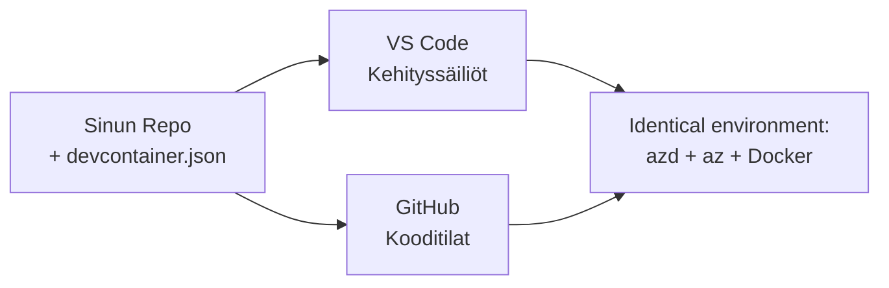

# Kehityssäiliöt & GitHub Codespaces azd:lle

**Luvun navigointi:**
- **📚 Kurssin aloitus**: [AZD Aloittelijoille](../../README.md)
- **📖 Tämän hetken luku**: Luku 1 - Perusta & nopea aloitus
- **⬅️ Edellinen**: [Tuo oma sovellus](bring-your-own-app.md)
- **🚀 Seuraava luku**: [Luku 2: AI-Ensimmäinen kehitys](../chapter-02-ai-development/README.md)

> Vahvistettu `azd 1.27.1` versiolla heinäkuussa 2026.

## Johdanto

Azd:n, oikean kieliajurin, Dockerin ja Azure CLI:n asentaminen jokaiselle koneelle on työlästä — ja se on ykkössyy sille, miksi opas, joka "toimii koneellani", ei toimi toisella. **Kehityssäiliö** ratkaisee tämän kuvaamalla koko työkaluketjusi tiedostossa. Kuka tahansa, joka avaa projektin VS Codessa tai GitHub Codespacesissa, saa täsmälleen saman ympäristön, jossa azd on jo asennettuna. Tässä oppitunnissa näytetään, miten sellainen lisätään.

## Oppimistavoitteet

Tämän oppitunnin jälkeen osaat:
- Ymmärtää, mikä kehityssäiliö on ja miksi se auttaa azdin kanssa
- Lisätä minimikerroksen `.devcontainer/devcontainer.json` projektiin
- Sisällyttää azdin, Azure CLI:n ja Dockerin Kehityssäiliön *ominaisuuksien* kautta
- Avata projektin GitHub Codespacesissa tai VS Codessa

## Oppimistulokset

Oppitunnin suoritettuasi pystyt:
- Tekemään `devcontainer.json`:n azd-projektille
- Lisäämään azdin ja Azure-työkalut ilman manuaalisia asennuksia
- Ajamaan `azd up` säiliön tai Codespacen sisällä

---

## Mikä on kehityssäiliö?

Kehityssäiliö on Docker-pohjainen kehitysympäristö, joka määritellään `.devcontainer/devcontainer.json` -tiedostossa repositoriossasi. Kun avaat projektin:

- **VS Code** (Dev Containers -laajennuksen kanssa) rakentaa säiliön ja liittää siihen.
- **GitHub Codespaces** rakentaa saman säiliön pilvessä ja tarjoaa sinulle selaimessa toimivan editorin.

Molemmissa tapauksissa jokainen kehittäjä saa identtiset työkalut—eikä tarvitse kysellä "onko azd asennettu?".



---

## Vaihe 1: Luo devcontainer-tiedosto

Luo `.devcontainer/devcontainer.json` projektisi juureen:

```json
{
  "name": "azd-project",
  "image": "mcr.microsoft.com/devcontainers/base:bookworm",
  "features": {
    "ghcr.io/devcontainers/features/azure-cli:1": {},
    "ghcr.io/azure/azure-dev/azd:latest": {},
    "ghcr.io/devcontainers/features/docker-in-docker:2": {},
    "ghcr.io/devcontainers/features/node:1": {}
  },
  "customizations": {
    "vscode": {
      "extensions": [
        "ms-azuretools.azure-dev",
        "ms-azuretools.vscode-bicep"
      ]
    }
  },
  "forwardPorts": [3000],
  "postCreateCommand": "azd version"
}
```

Mitä kukin osa tekee:

| Avain | Tarkoitus |
|-------|----------|
| `image` | Säiliön käyttöjärjestelmän pohja |
| `features` | Esiasennetut asennukset—tässä: Azure CLI, **azd**, Docker ja Node.js |
| `customizations.vscode.extensions` | Asentaa automaattisesti azd:n ja Bicep-laajennukset VS Codeen |
| `forwardPorts` | Avaimet sovelluksesi portin selaimelle |
| `postCreateCommand` | Ajetaan kerran säiliön rakentamisen jälkeen (tässä järkevyyden tarkistus) |

> `ghcr.io/azure/azure-dev/azd:latest` -ominaisuus on virallinen tapa saada azd säiliöön. Voit kiinnittää tietyn version (esim. `azd:1.27.1`), jos tarvitset toistettavuutta.

---

## Vaihe 2: Sovita ominaisuus sovelluksesi kieleen

Vaihda `node`-ominaisuus siihen, mitä sovelluksesi käyttää:

```jsonc
// Python project
"ghcr.io/devcontainers/features/python:1": {},

// .NET project
"ghcr.io/devcontainers/features/dotnet:2": {},

// Java project
"ghcr.io/devcontainers/features/java:1": {},

// Go project
"ghcr.io/devcontainers/features/go:1": {}
```

Säilytä `docker-in-docker`, jos `host` on `containerapp`, `aks` tai mikä tahansa joka rakentaa säiliökuvan—azd tarvitsee Dockeria kuvan rakentamiseen ja puskuamiseen.

---

## Vaihe 3: Avaa se

**VS Codessa:**
1. Asenna **Dev Containers** -laajennus.
2. Avaa projektikansio.
3. Klikkaa **Avaa säiliössä uudelleen**, kun saat kehotteen (tai aja *Dev Containers: Reopen in Container*).

**GitHub Codespacesissa:**
1. Pushaa repo GitHubiin.
2. Klikkaa **Code → Codespaces → Create codespace on main**.
3. Odota, että säiliö rakentuu—azd on valmis terminaalissa.

---

## Vaihe 4: Ota käyttöön säiliön sisältä

Säiliössä on azd valmiiksi asennettuna, joten normaali työvuoro vain toimii:

```bash
azd auth login --use-device-code   # laiteohjelmointi on kätevää Codespacesissä
azd up
```

> **Miksi `--use-device-code`?** Etäsäiliössä tai Codespacessa ei ole paikallista selainta uudelleenohjaukseen, joten laitekoodin kirjautuminen on luotettava tapa. Liität koodin selaimen välilehdelle kirjautumisen loppuun saattamiseksi.

---

## Yleiset sudenkuopat

| Sudenkuoppa | Korjaus |
|------------|--------|
| `azd up` ei voi rakentaa kuvatta | Lisää `docker-in-docker` -ominaisuus |
| Selaimen kirjautuminen tökkii Codespacesissa | Käytä `azd auth login --use-device-code` |
| Työkalut eroavat tiimin jäsenten välillä | Kiinnitä ominaisuuksien versiot (esim. `azd:1.27.1`) |
| Sovellus ei ole saavutettavissa selaimessa | Lisää portti `forwardPorts` listaan |

---

## Yhteenveto

- Kehityssäiliö tekee azd-työkaluketjustasi toistettavan kaikille.
- Lisää azd, Azure CLI ja Docker Dev Container *ominaisuuksien* kautta.
- Sovita kieliominaisuus sovellukseesi ja pidä `docker-in-docker` säiliön isännille.
- Käytä laitekoodikirjautumista ajettaessa Codespacessa.

---

## 🔗 Navigointi

| Suunta | Resurssi |
|--------|----------|
| **Edellinen** | [Tuo oma sovellus](bring-your-own-app.md) |
| **Luvun alku** | [Luku 1: Perusta & nopea aloitus](README.md) |
| **Seuraava luku** | [Luku 2: AI-Ensimmäinen kehitys](../chapter-02-ai-development/README.md) |

## 📖 Liittyvät resurssit

- [Asennus & käyttöönotto](installation.md)
- [Komentojen pikaopas](../../resources/cheat-sheet.md)
- [Virallinen Dev Containers -määritys](https://containers.dev/)
- [azd Dev Container -ominaisuus](https://github.com/Azure/azure-dev/tree/main/ext/devcontainer)

---

<!-- CO-OP TRANSLATOR DISCLAIMER START -->
**Vastuuvapauslauseke**:
Tämä asiakirja on käännetty käyttämällä tekoälypohjaista käännöspalvelua [Co-op Translator](https://github.com/Azure/co-op-translator). Vaikka pyrimme tarkkuuteen, otathan huomioon, että automaattiset käännökset saattavat sisältää virheitä tai epätarkkuuksia. Alkuperäinen asiakirja sen alkuperäiskielellä on virallinen lähde. Tärkeissä asioissa suositellaan ammattimaista ihmiskäännöstä. Emme ole vastuussa tämän käännöksen käytöstä aiheutuvista väärinymmärryksistä tai tulkinnoista.
<!-- CO-OP TRANSLATOR DISCLAIMER END -->