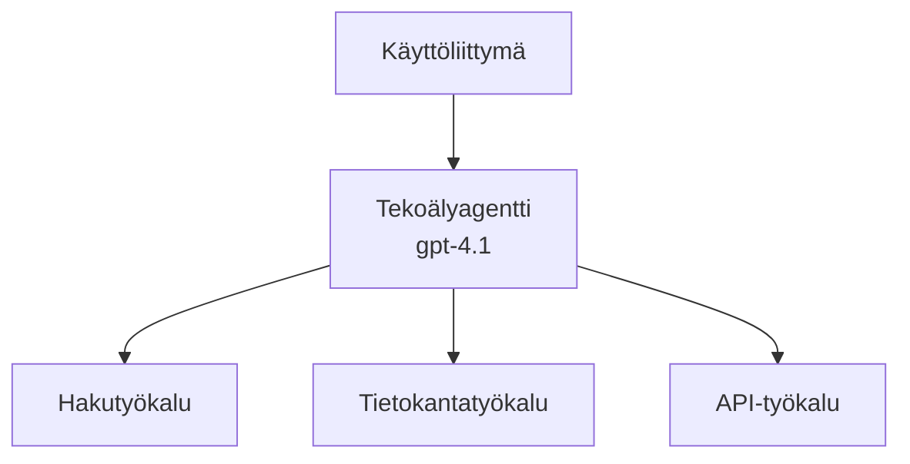
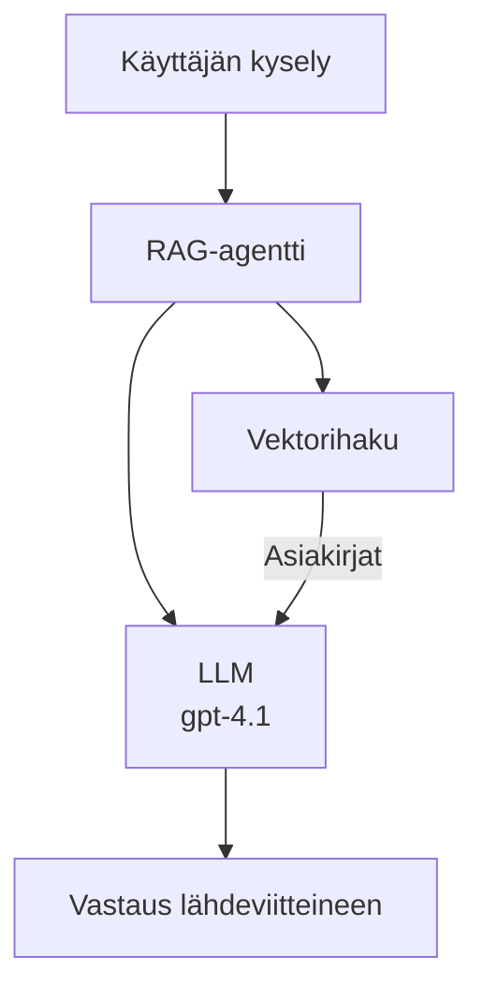

# AI-agentit Azure Developer CLI:llä

**Lukujen navigointi:**
- **📚 Kurssin etusivu**: [AZD Aloittelijoille](../../README.md)
- **📖 Nykyinen luku**: Luku 2 - AI-lähtöinen kehitys
- **⬅️ Edellinen**: [Microsoft Foundry -integraatio](microsoft-foundry-integration.md)
- **➡️ Seuraava**: [AI-mallin käyttöönotto](ai-model-deployment.md)
- **🚀 Edistynyt**: [Moni-agenttiratkaisut](../../examples/retail-scenario.md)

---

## Johdanto

AI-agentit ovat autonomisia ohjelmia, jotka voivat havaita ympäristönsä, tehdä päätöksiä ja suorittaa toimintoja tiettyjen tavoitteiden saavuttamiseksi. Toisin kuin yksinkertaiset keskustelubotit, jotka vastaavat kehotteisiin, agentit voivat:

- **Käyttää työkaluja** - Kutsua API-rajapintoja, hakea tietokantoja, suorittaa koodia
- **Suunnitella ja päättellä** - Jakaa monimutkaiset tehtävät vaiheisiin
- **Oppia kontekstista** - Pitää muistia ja mukauttaa käyttäytymistään
- **Tehdä yhteistyötä** - Työskennellä muiden agenttien kanssa (moni-agenttijärjestelmät)

Tämä opas näyttää, miten ottaa AI-agentit käyttöön Azureen Azure Developer CLI:n (azd) avulla.

## Oppimistavoitteet

Tämän oppaan läpikäynnin jälkeen osaat:
- Ymmärtää, mitä AI-agentit ovat ja miten ne eroavat chatbotista
- Ota käyttöön valmiita AI-agenttimallipohjia AZD:llä
- Määrittää Foundry-agentit mukautetuille agenteille
- Toteuttaa perusagenttimalleja (työkalujen käyttö, RAG, moni-agentti)
- Valvoa ja virheenkorjata otettuja agentteja

## Oppimistulokset

Suorituksen jälkeen pystyt:
- Ottamaan AI-agenttisovelluksia käyttöön Azureen yhdellä komennolla
- Konfiguroimaan agenttien työkaluja ja ominaisuuksia
- Toteuttamaan retrieval-augmented generation (RAG) -mallin agenteilla
- Suunnittelemaan moni-agenttiarkkitehtuureja monimutkaisille työnkuluillle
- Vianetsimään yleisiä agenttien käyttöönottoon liittyviä ongelmia

---

## 🤖 Mikä tekee agentista erilaisen kuin chatbot?

| Ominaisuus | Chatbot | AI-agentti |
|---------|---------|----------|
| **Käyttäytyminen** | Vastaa kehotteisiin | Suorittaa autonomisia toimintoja |
| **Työkalut** | Ei | Voi kutsua API-rajapintoja, tehdä hakuja, suorittaa koodia |
| **Muisti** | Vain istuntoon rajoittuva | Pysyvä muisti istuntojen välillä |
| **Suunnittelu** | Yksi vastaus | Monivaiheinen päättely |
| **Yhteistyö** | Yksi toimija | Voi työskennellä muiden agenttien kanssa |

### Yksinkertainen vertauskuva

- **Chatbot** = Avulias henkilö, joka vastaa kysymyksiin neuvontapisteellä
- **AI-agentti** = Henkilökohtainen avustaja, joka voi soittaa puheluita, varata tapaamisia ja hoitaa tehtäviä puolestasi

---

## 🚀 Pikakäynnistys: Ota ensimmäinen agenttisi käyttöön

### Vaihtoehto 1: Foundry Agents -malli (Suositeltu)

```bash
# Alusta tekoälyagenttien malli
azd init --template get-started-with-ai-agents

# Ota käyttöön Azureen
azd up
```

**Mitä otetaan käyttöön:**
- ✅ Foundry Agents
- ✅ Microsoft Foundry Models (gpt-4.1)
- ✅ Azure AI Search (RAG:ia varten)
- ✅ Azure Container Apps (verkkokäyttöliittymä)
- ✅ Application Insights (valvonta)

**Aika:** ~15–20 minuuttia
**Kustannus:** ~100–150 $/kk (kehitys)

### Vaihtoehto 2: OpenAI-agentti Promptyllä

```bash
# Alusta Prompty-pohjainen agenttimalli
azd init --template agent-openai-python-prompty

# Ota käyttöön Azureen
azd up
```

**Mitä otetaan käyttöön:**
- ✅ Azure Functions (serveriton agentin suoritus)
- ✅ Microsoft Foundry Models
- ✅ Prompty-konfiguraatiotiedostot
- ✅ Esimerkkiaagentin toteutus

**Aika:** ~10–15 minuuttia
**Kustannus:** ~50–100 $/kk (kehitys)

### Vaihtoehto 3: RAG-chat-agentti

```bash
# Alusta RAG-keskustelupohja
azd init --template azure-search-openai-demo

# Ota käyttöön Azureen
azd up
```

**Mitä otetaan käyttöön:**
- ✅ Microsoft Foundry Models
- ✅ Azure AI Search näyteaineiston kanssa
- ✅ Asiakirjojen käsittelyputki
- ✅ Keskustelukäyttöliittymä lähdeviitteillä

**Aika:** ~15–25 minuuttia
**Kustannus:** ~80–150 $/kk (kehitys)

### Vaihtoehto 4: AZD AI Agent Init (manifestipohjainen)

Jos sinulla on agenttimanifestitiedosto, voit käyttää `azd ai` -komentoa luodaksesi Foundry Agent Service -projektin suoraan:

```bash
# Asenna tekoälyagenttien laajennus
azd extension install azure.ai.agents

# Alusta agentin manifestista
azd ai agent init -m agent-manifest.yaml

# Ota käyttöön Azureen
azd up
```

**Milloin käyttää `azd ai agent init` vs `azd init --template`:**

| Lähestymistapa | Parhaiten sopii | Kuinka se toimii |
|----------|----------|------|
| `azd init --template` | Aloittamiseen toimivasta esimerkkisovelluksesta | Kloonaa täydellisen mallirepositorion koodilla ja infrastruktuurilla |
| `azd ai agent init -m` | Rakentamiseen omasta agenttimanifestista | Luo projektirakenteen agenttimääritelmästäsi |

> **Vinkki:** Käytä `azd init --template` oppimisen aikana (vaihtoehdot 1–3 yllä). Käytä `azd ai agent init` kun rakennat tuotantoagentteja omilla manifesteillasi. Katso [AZD AI CLI Commands](../chapter-08-production/production-ai-practices.md#azd-ai-cli-commands-and-extensions) täydellistä viitettä varten.

---

## 🏗️ Agenttien arkkitehtuurimallit

### Malli 1: Yksi agentti työkalujen kanssa

Yksinkertaisin agenttimalli — yksi agentti, joka voi käyttää useita työkaluja.


**Parhaiten sopii:**
- Asiakastukibotit
- Tutkimusavustajat
- Data-analyysia tekevät agentit

**AZD-malli:** `azure-search-openai-demo`

### Malli 2: RAG-agentti (hakupohjainen täydennysgenerointi)

Agentti, joka hakee relevantteja dokumentteja ennen vastausten generoimista.


**Parhaiten sopii:**
- Yrityksen tietopankit
- Asiakirjakyselyjärjestelmät
- Sääntely- ja oikeudellinen tutkimus

**AZD-malli:** `azure-search-openai-demo`

### Malli 3: Moni-agenttijärjestelmä

Useita erikoistuneita agentteja työskentelee yhdessä monimutkaisissa tehtävissä.


**Parhaiten sopii:**
- Monimutkainen sisällöntuotanto
- Monivaiheiset työnkulut
- Tehtävät, jotka vaativat eri asiantuntemusta

**Lisätietoja:** [Moni-agenttikoordinoinnin mallit](../chapter-06-pre-deployment/coordination-patterns.md)

---

## ⚙️ Agenttien työkalujen konfigurointi

Agentit muuttuvat tehokkaiksi, kun ne pystyvät käyttämään työkaluja. Näin konfiguroit yleisiä työkaluja:

### Työkalukonfiguraatio Foundry-agentteihin

```python
# agent_config.py
from azure.ai.projects import AIProjectClient
from azure.ai.projects.models import FunctionTool, CodeInterpreterTool

# Määrittele mukautetut työkalut
search_tool = FunctionTool(
    name="search_knowledge_base",
    description="Search the company knowledge base for relevant documents",
    parameters={
        "type": "object",
        "properties": {
            "query": {
                "type": "string",
                "description": "The search query"
            }
        },
        "required": ["query"]
    }
)

# Luo agentti työkaluilla
agent = project_client.agents.create_agent(
    model="gpt-4.1",
    name="Support Agent",
    instructions="You are a helpful support agent. Use the search tool to find relevant information.",
    tools=[search_tool, CodeInterpreterTool()]
)
```

### Ympäristön konfigurointi

```bash
# Määritä agenttikohtaiset ympäristömuuttujat
azd env set AZURE_OPENAI_MODEL "gpt-4.1"
azd env set AGENT_INSTRUCTIONS "You are a helpful assistant..."
azd env set ENABLE_CODE_INTERPRETER "true"
azd env set ENABLE_FILE_SEARCH "true"

# Ota käyttöön päivitetty konfiguraatio
azd deploy
```

---

## 📊 Agenttien valvonta

### Application Insights -integraatio

Kaikki AZD-agenttimallit sisältävät Application Insightsin valvontaa varten:

```bash
# Avaa valvontapaneeli
azd monitor --overview

# Näytä reaaliaikaiset lokit
azd monitor --logs

# Näytä reaaliaikaiset mittarit
azd monitor --live
```

### Seurattavat keskeiset mittarit

| Mittari | Kuvaus | Tavoite |
|--------|-------------|--------|
| Vastausaika | Aika vastauksen generoimiseen | < 5 sekuntia |
| Tokenien käyttö | Tokeneja per pyyntö | Seuraa kustannuksia |
| Työkalukutsujen onnistumisprosentti | % onnistuneista työkalun suorituksista | > 95% |
| Virheiden osuus | Epäonnistuneet agenttipyynnöt | < 1% |
| Käyttäjätyytyväisyys | Palautearviot | > 4.0/5.0 |

### Mukautettu lokitus agenteille

```python
import os
from azure.monitor.opentelemetry import configure_azure_monitor
from opentelemetry import trace

# Määritä Azure Monitor OpenTelemetryn avulla
configure_azure_monitor(
    connection_string=os.environ["APPLICATIONINSIGHTS_CONNECTION_STRING"]
)

tracer = trace.get_tracer(__name__)

def log_agent_interaction(user_query, agent_response, tools_used, latency_ms):
    with tracer.start_as_current_span("agent_interaction") as span:
        span.set_attributes({
            "user_query": user_query,
            "response_length": len(agent_response),
            "tools_used": tools_used,
            "latency_ms": latency_ms
        })
```

> **Huom:** Asenna vaaditut paketit: `pip install azure-monitor-opentelemetry opentelemetry`

---

## 💰 Kustannusnäkökohdat

### Arvioidut kuukausikustannukset mallityypeittäin

| Malli | Kehitysympäristö | Tuotanto |
|---------|-----------------|------------|
| Yksittäinen agentti | $50-100 | $200-500 |
| RAG-agentti | $80-150 | $300-800 |
| Moni-agentti (2-3 agenttia) | $150-300 | $500-1,500 |
| Yritystason moni-agentti | $300-500 | $1,500-5,000+ |

### Kustannusoptimointivinkkejä

1. **Käytä gpt-4.1-miniä yksinkertaisiin tehtäviin**
   ```bash
   azd env set AZURE_OPENAI_MODEL "gpt-4.1-mini"
   ```

2. **Ota välimuisti käyttöön toistuville kyselyille**
   ```python
   from functools import lru_cache
   
   @lru_cache(maxsize=1000)
   def get_cached_response(query_hash):
       return agent.run(query_hash)
   ```

3. **Aseta token-rajat suoritusta kohti**
   ```python
   # Aseta max_completion_tokens, kun suoritat agenttia, ei sen luomisvaiheessa.
   run = project_client.agents.create_run(
       thread_id=thread.id,
       agent_id=agent.id,
       max_completion_tokens=1000  # Rajoita vastauksen pituutta
   )
   ```

4. **Skaalaa nollaan, kun ei käytössä**
   ```bash
   # Container Apps skaalautuvat automaattisesti nollaan
   azd env set MIN_REPLICAS "0"
   ```

---

## 🔧 Agenttien vianmääritys

### Yleiset ongelmat ja ratkaisut

<details>
<summary><strong>❌ Agentti ei vastaa työkalukutsuihin</strong></summary>

```bash
# Tarkista, että työkalut on rekisteröity oikein
azd show

# Varmista OpenAI:n käyttöönotto
az cognitiveservices account deployment list \
  --name $AZURE_OPENAI_NAME \
  --resource-group $RG_NAME

# Tarkista agentin lokit
azd monitor --logs
```

**Yleiset syyt:**
- Työkalufunktion allekirjoitus ei täsmää
- Puuttuvat vaaditut käyttöoikeudet
- API-päätepiste ei ole saavutettavissa
</details>

<details>
<summary><strong>❌ Korkea viive agentin vastauksissa</strong></summary>

```bash
# Tarkista Application Insightsista pullonkaulat
azd monitor --live

# Harkitse nopeamman mallin käyttöä
azd env set AZURE_OPENAI_MODEL "gpt-4.1-mini"
azd deploy
```

**Optimointivinkit:**
- Käytä suoratoistovastauksia
- Ota vastausten välimuisti käyttöön
- Pienennä kontekstin ikkunan kokoa
</details>

<details>
<summary><strong>❌ Agentti palauttaa virheellistä tai hallusinoitua tietoa</strong></summary>

```python
# Paranna paremmilla järjestelmäkehotteilla
instructions = """
You are a helpful assistant. IMPORTANT:
- Only answer based on provided context
- If you don't know, say "I don't know"
- Always cite your sources
- Never make up information
"""

# Lisää haku maadoittamista varten
agent = project_client.agents.create_agent(
    model="gpt-4.1",
    instructions=instructions,
    tools=[FileSearchTool()]  # Perusta vastaukset asiakirjoihin
)
```
</details>

<details>
<summary><strong>❌ Token-rajan ylitykset</strong></summary>

```python
# Toteuta kontekstin ikkunan hallinta
def truncate_context(messages, max_tokens=8000, model="gpt-4.1"):
    """Keep only recent messages within token limit."""
    import tiktoken
    encoding = tiktoken.encoding_for_model(model)
    total_tokens = 0
    truncated = []
    
    for msg in reversed(messages):
        msg_tokens = len(encoding.encode(msg.content))
        if total_tokens + msg_tokens > max_tokens:
            break
        truncated.insert(0, msg)
        total_tokens += msg_tokens
    
    return truncated
```
</details>

---

## 🎓 Käytännön harjoitukset

### Harjoitus 1: Perusagentin käyttöönotto (20 minuuttia)

**Tavoite:** Ota ensimmäinen AI-agenttisi käyttöön käyttämällä AZD:tä

```bash
# Vaihe 1: Alusta mallipohja
azd init --template get-started-with-ai-agents

# Vaihe 2: Kirjaudu Azureen
azd auth login

# Vaihe 3: Ota käyttöön
azd up

# Vaihe 4: Testaa agenttia
# Odotettu tuloste käyttöönoton jälkeen:
#   Käyttöönotto valmis!
#   Päätepiste: https://<app-name>.<region>.azurecontainerapps.io
# Avaa tulosteessa näkyvä URL-osoite ja kokeile esittää kysymys

# Vaihe 5: Tarkastele valvontaa
azd monitor --overview

# Vaihe 6: Siivoa
azd down --force --purge
```

**Onnistumiskriteerit:**
- [ ] Agentti vastaa kysymyksiin
- [ ] Pääsee valvontapaneeliin komennolla `azd monitor`
- [ ] Resurssit siivottu onnistuneesti

### Harjoitus 2: Lisää mukautettu työkalu (30 minuuttia)

**Tavoite:** Laajenna agenttia mukautetulla työkalulla

1. Ota agenttimalli käyttöön:
   ```bash
   azd init --template get-started-with-ai-agents
   azd up
   ```
2. Luo uusi työkalufunktio agenttikoodissasi:
   ```python
   def get_weather(location: str) -> str:
       """Get current weather for a location."""
       # API-kutsu sääpalveluun
       return f"Weather in {location}: Sunny, 72°F"
   ```
3. Rekisteröi työkalu agenttiin:
   ```python
   from azure.ai.projects.models import FunctionTool

   weather_tool = FunctionTool(
       name="get_weather",
       description="Get current weather for a location",
       parameters={
           "type": "object",
           "properties": {
               "location": {"type": "string", "description": "City name"}
           },
           "required": ["location"]
       }
   )

   agent = project_client.agents.create_agent(
       model="gpt-4.1",
       name="Weather Agent",
       tools=[weather_tool]
   )
   ```
4. Ota käyttöön uudelleen ja testaa:
   ```bash
   azd deploy
   # Kysy: "Mikä on sää Seattlessa?"
   # Odotetaan: Agentti kutsuu get_weather("Seattle") ja palauttaa säätiedot
   ```

**Onnistumiskriteerit:**
- [ ] Agentti tunnistaa säähän liittyvät kysymykset
- [ ] Työkalu kutsutaan oikein
- [ ] Vastauksessa on säätietoja

### Harjoitus 3: RAG-agentin rakentaminen (45 minuuttia)

**Tavoite:** Luo agentti, joka vastaa dokumenttien perusteella esitettyihin kysymyksiin

```bash
# Vaihe 1: Ota RAG-malli käyttöön
azd init --template azure-search-openai-demo
azd up

# Vaihe 2: Lähetä asiakirjasi
# Aseta PDF/TXT-tiedostot data/ -hakemistoon, sitten suorita:
python scripts/prepdocs.py

# Vaihe 3: Testaa toimialakohtaisilla kysymyksillä
# Avaa web-sovelluksen URL azd up -komennon tulosteesta
# Kysy kysymyksiä lähetetyistä asiakirjoistasi
# Vastauksissa tulisi olla lähdeviitteitä, kuten [doc.pdf]
```

**Onnistumiskriteerit:**
- [ ] Agentti vastaa ladatuista dokumenteista
- [ ] Vastauksissa on lähdeviitteet
- [ ] Ei harhauttavia vastauksia laajuuden ulkopuolisiin kysymyksiin

---

## 📚 Seuraavat askeleet

Nyt kun ymmärrät AI-agentit, tutustu näihin edistyneempiin aiheisiin:

| Aihe | Kuvaus | Linkki |
|-------|-------------|------|
| **Moni-agenttijärjestelmät** | Rakenna järjestelmiä, joissa useat agentit tekevät yhteistyötä | [Vähittäiskaupan moni-agenttiesimerkki](../../examples/retail-scenario.md) |
| **Koordinointimallit** | Opi orkestrointi- ja viestintämalleja | [Koordinointimallit](../chapter-06-pre-deployment/coordination-patterns.md) |
| **Tuotannon käyttöönotto** | Yritystason agenttien käyttöönotto | [Tuotannon AI-käytännöt](../chapter-08-production/production-ai-practices.md) |
| **Agenttien arviointi** | Testaa ja arvioi agentin suorituskykyä | [AI-vianmääritys](../chapter-07-troubleshooting/ai-troubleshooting.md) |
| **AI-työpaja** | Käytännön harjoitus: Tee AI-ratkaisustasi AZD-valmis | [AI Workshop Lab](ai-workshop-lab.md) |

---

## 📖 Lisäresurssit

### Virallinen dokumentaatio
- [Azure AI Agent Service](https://learn.microsoft.com/azure/ai-services/agents/)
- [Azure AI Foundry Agent Service Quickstart](https://learn.microsoft.com/azure/ai-services/agents/quickstart)
- [Semantic Kernel Agent Framework](https://learn.microsoft.com/semantic-kernel/)

### AZD-mallit agenteille
- [Get Started with AI Agents](https://github.com/Azure-Samples/get-started-with-ai-agents)
- [Agent OpenAI Python Prompty](https://github.com/Azure-Samples/agent-openai-python-prompty)
- [Azure Search OpenAI Demo](https://github.com/Azure-Samples/azure-search-openai-demo)

### Yhteisöresurssit
- [Awesome AZD - Agent Templates](https://azure.github.io/awesome-azd/?tags=ai-agents)
- [Azure AI Discord](https://discord.gg/microsoft-azure)
- [Microsoft Foundry Discord](https://discord.gg/nTYy5BXMWG)

### Agenttitaidot editorillesi
- [**Microsoft Azure Agent Skills**](https://skills.sh/microsoft/github-copilot-for-azure) - Asenna uudelleenkäytettäviä AI-agenttitaitoja Azure-kehitykseen GitHub Copilotiin, Cursoriin tai mihin tahansa tuettuun agenttiin. Sisältää taitoja [Azure AI](https://skills.sh/microsoft/github-copilot-for-azure/azure-ai), [Microsoft Foundry](https://skills.sh/microsoft/github-copilot-for-azure/microsoft-foundry), [deployment](https://skills.sh/microsoft/github-copilot-for-azure/azure-deploy), ja [diagnostics](https://skills.sh/microsoft/github-copilot-for-azure/azure-diagnostics):
  ```bash
  npx skills add microsoft/github-copilot-for-azure
  ```

---

**Navigointi**
- **Edellinen oppitunti**: [Microsoft Foundry -integraatio](microsoft-foundry-integration.md)
- **Seuraava oppitunti**: [AI-mallin käyttöönotto](ai-model-deployment.md)

---

<!-- CO-OP TRANSLATOR DISCLAIMER START -->
**Disclaimer**:
Tämä asiakirja on käännetty tekoälypohjaisella käännöspalvelulla [Co-op Translator](https://github.com/Azure/co-op-translator). Vaikka pyrimme tarkkuuteen, ota huomioon, että automaattiset käännökset saattavat sisältää virheitä tai epätarkkuuksia. Alkuperäistä asiakirjaa sen alkuperäiskielellä tulee pitää virallisena lähteenä. Tärkeiden tietojen osalta suositellaan ammattikääntäjän tekemää käännöstä. Emme ole vastuussa tämän käännöksen käytöstä aiheutuvista väärinymmärryksistä tai virheellisistä tulkinnoista.
<!-- CO-OP TRANSLATOR DISCLAIMER END -->