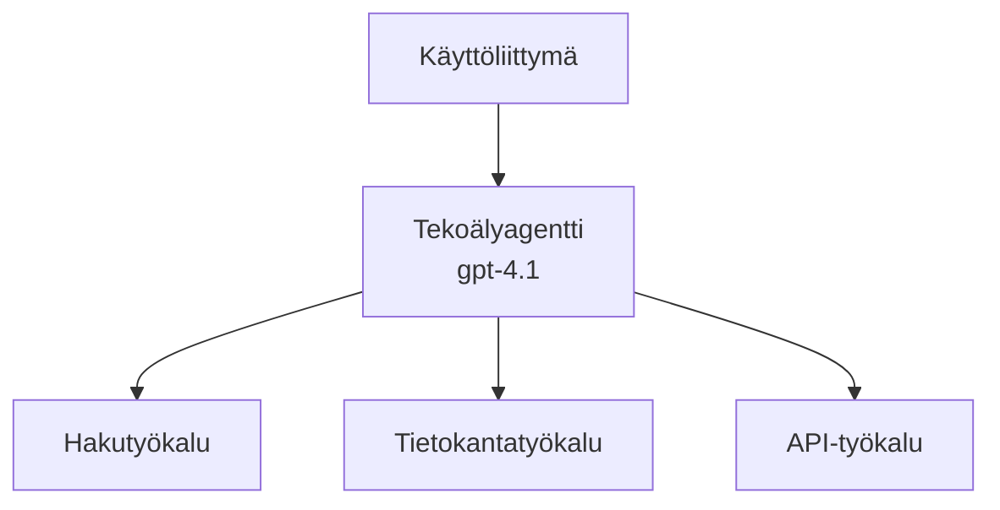
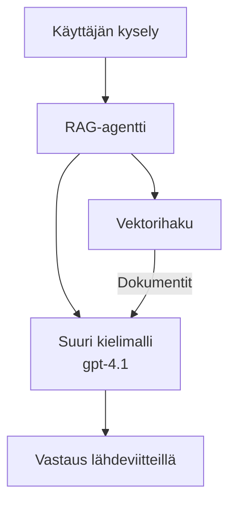
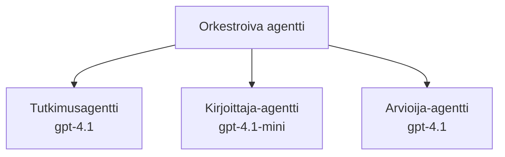

# AI-agentit Azure Developer CLI:llä

**Lukujen navigointi:**
- **📚 Kurssin etusivu**: [AZD Aloittelijoille](../../README.md)
- **📖 Nykyinen luku**: Luku 2 - AI-keskeinen kehitys
- **⬅️ Edellinen**: [Microsoft Foundry Integration](microsoft-foundry-integration.md)
- **➡️ Seuraava**: [AI Model Deployment](ai-model-deployment.md)
- **🚀 Edistynyt**: [Multi-Agent Solutions](../../examples/retail-scenario.md)

---

## Johdanto

AI-agentit ovat autonomisia ohjelmia, jotka voivat havainnoida ympäristöään, tehdä päätöksiä ja suorittaa toimintoja tiettyjen tavoitteiden saavuttamiseksi. Toisin kuin yksinkertaiset chatbottit, jotka vastaavat kehotteisiin, agentit voivat:

- **Käyttää työkaluja** - Kutsua API:ita, hakea tietokantoja, suorittaa koodia
- **Suunnitella ja päättellä** - Jakaa monimutkaiset tehtävät vaiheisiin
- **Oppia kontekstista** - Säilyttää muistin ja mukauttaa käyttäytymistään
- **Tehdä yhteistyötä** - Työskennellä muiden agenttien kanssa (moniagenttijärjestelmät)

Tässä oppaassa näytetään, miten voit ottaa AI-agentteja käyttöön Azureen käyttäen Azure Developer CLI:tä (azd).

> **Varmennus huomautus (2026-03-25):** Tämä opas tarkistettiin versioita vastaan `azd` `1.23.12` ja `azure.ai.agents` `0.1.18-preview`. `azd ai` -kokemus on edelleen esikatseluohjelmainen, joten tarkista laajennuksen ohjeet, jos asennetut liput poikkeavat.

## Oppimistavoitteet

Suoritettuasi tämän oppaan:
- Ymmärrät, mitä AI-agentit ovat ja miten ne eroavat chatteista
- Otat käyttöön valmiita AI-agenttipohjia AZD:llä
- Määrität Foundry Agents -agentit räätälöityjä agentteja varten
- Toteutat perusagenttimalleja (työkalujen käyttö, RAG, moniagentti)
- Valvot ja debuggaat otettuja agentteja käyttöön

## Oppimistulokset

Oppaan suorittamisen jälkeen pystyt:
- Ottamaan AI-agenttisovelluksia käyttöön Azureen yhdellä komennolla
- Määrittämään agenttityökaluja ja -ominaisuuksia
- Toteuttamaan retrieval-augmented generation (RAG) -ratkaisuja agenteilla
- Suunnittelemaan moniagenttiarkkitehtuureja monimutkaisiin työnkulkuihin
- Selvittämään yleisiä agenttien käyttöönoton ongelmia

---

## 🤖 Mikä erottaa agentin chatbottista?

| Ominaisuus | Chatbotti | AI-agentti |
|---------|---------|----------|
| **Käyttäytyminen** | Vastaa kehotteisiin | Suorittaa itsenäisiä toimintoja |
| **Työkalut** | Ei | Voi kutsua API-rajapintoja, hakea, suorittaa koodia |
| **Muisti** | Vain istuntopohjainen | Pysyvä muisti istuntojen yli |
| **Suunnittelu** | Yksittäinen vastaus | Monivaiheinen päättely |
| **Yhteistyö** | Yksi yksikkö | Voi työskennellä muiden agenttien kanssa |

### Yksinkertainen vertauskuva

- **Chatbotti** = Avulias henkilö, joka vastaa kysymyksiin neuvontapisteessä
- **AI-agentti** = Henkilökohtainen avustaja, joka voi soittaa, varata tapaamisia ja suorittaa tehtäviä puolestasi

---

## 🚀 Pikakäynnistys: Ota ensimmäinen agenttisi käyttöön

### Vaihtoehto 1: Foundry Agents -malli (Suositeltu)

```bash
# Alusta tekoälyagenttien mallipohja
azd init --template get-started-with-ai-agents

# Ota käyttöön Azureen
azd up
```

**Mitä otetaan käyttöön:**
- ✅ Foundry Agents
- ✅ Microsoft Foundry Models (gpt-4.1)
- ✅ Azure AI Search (RAG:ia varten)
- ✅ Azure Container Apps (verkkokäyttöliittymä)
- ✅ Application Insights (valvonta)

**Aika:** ~15-20 minuuttia
**Kustannus:** ~$100-150/kk (kehitys)

### Vaihtoehto 2: OpenAI-agentti Promptylla

```bash
# Alusta Prompty-pohjainen agenttimalli
azd init --template agent-openai-python-prompty

# Ota käyttöön Azureen
azd up
```

**Mitä otetaan käyttöön:**
- ✅ Azure Functions (serveriton agentin suoritus)
- ✅ Microsoft Foundry Models
- ✅ Prompty-määritystiedostot
- ✅ Näyteagentin toteutus

**Aika:** ~10-15 minuuttia
**Kustannus:** ~$50-100/kk (kehitys)

### Vaihtoehto 3: RAG-chat-agentti

```bash
# Alusta RAG-keskustelupohja
azd init --template azure-search-openai-demo

# Ota käyttöön Azureen
azd up
```

**Mitä otetaan käyttöön:**
- ✅ Microsoft Foundry Models
- ✅ Azure AI Search esimerkkidatan kanssa
- ✅ Asiakirjakäsittelyputki
- ✅ Chat-käyttöliittymä lähdeviitteineen

**Aika:** ~15-25 minuuttia
**Kustannus:** ~$80-150/kk (kehitys)

### Vaihtoehto 4: AZD AI Agent Init (Manifesteihin- tai mallipohjainen esikatselu)

Jos sinulla on agenttimanifestitiedosto, voit käyttää `azd ai` -komentoa Foundry Agent Service -projektin luonnin aloittamiseen suoraan. Viimeaikaiset esikatseluversiot lisäsivät myös mallipohjaiseen alustukseen tuen, joten tarkka kehoteflow voi hieman vaihdella asennetun laajennusversion mukaan.

```bash
# Asenna AI-agenttien laajennus
azd extension install azure.ai.agents

# Valinnainen: tarkista asennettu esiversio
azd extension show azure.ai.agents

# Alusta agentin manifestista
azd ai agent init -m agent-manifest.yaml

# Ota käyttöön Azureen
azd up
```

**Milloin käyttää `azd ai agent init` vs `azd init --template`:**

| Lähestymistapa | Parhaiten sopii | Miten se toimii |
|----------|----------|------|
| `azd init --template` | Aloittamiseen toimivasta esimerkkisovelluksesta | Kloonaa koko mallirepon koodin + infrastruktuurin kanssa |
| `azd ai agent init -m` | Rakentamiseen omasta agenttimanifestistasi | Luonnostelee projektirakenteen agenttimääritelmästäsi |

> **Vinkki:** Käytä `azd init --template` kun opettelet (Vaihtoehdot 1–3 yllä). Käytä `azd ai agent init` kun rakennat tuotantoagentteja omilla manifesteillasi. Katso [AZD AI CLI -komennot](../chapter-08-production/production-ai-practices.md#azd-ai-cli-commands-and-extensions) täydelliseen viitteeseen.

---

## 🏗️ Agenttien arkkitehtuurimallit

### Malli 1: Yksi agentti työkaluilla

Yksinkertaisin agenttimalli - yksi agentti, joka voi käyttää useita työkaluja.


**Parhaat käyttötarkoitukset:**
- Asiakaspalvelubotit
- Tutkimusassistentit
- Datanalyysagentit

**AZD-malli:** `azure-search-openai-demo`

### Malli 2: RAG-agentti (hakuavusteinen generointi)

Agentti, joka hakee relevantteja dokumentteja ennen vastausten luomista.


**Parhaat käyttötarkoitukset:**
- Yrityksen tietopankit
- Asiakirjojen Q&A-järjestelmät
- Sääntelyn ja oikeudellisen tutkimuksen tarpeet

**AZD-malli:** `azure-search-openai-demo`

### Malli 3: Moniagenttijärjestelmä

Useat erikoistuneet agentit työskentelevät yhdessä monimutkaisissa tehtävissä.


**Parhaat käyttötarkoitukset:**
- Monimutkainen sisällöntuotanto
- Monivaiheiset työnkulut
- Tehtävät, jotka vaativat eri erikoisosaamista

**Lisätietoja:** [Multi-Agent Coordination Patterns](../chapter-06-pre-deployment/coordination-patterns.md)

---

## ⚙️ Agenttityökalujen määritys

Agentit muuttuvat tehokkaiksi, kun ne voivat käyttää työkaluja. Näin määrität yleiset työkalut:

### Työkalujen määritykset Foundry Agentsissa

```python
# agent_config.py
from azure.ai.projects import AIProjectClient
from azure.ai.projects.models import FunctionTool, CodeInterpreterTool

# Määrittele mukautetut työkalut
search_tool = FunctionTool(
    name="search_knowledge_base",
    description="Search the company knowledge base for relevant documents",
    parameters={
        "type": "object",
        "properties": {
            "query": {
                "type": "string",
                "description": "The search query"
            }
        },
        "required": ["query"]
    }
)

# Luo agentti työkaluineen
agent = project_client.agents.create_agent(
    model="gpt-4.1",
    name="Support Agent",
    instructions="You are a helpful support agent. Use the search tool to find relevant information.",
    tools=[search_tool, CodeInterpreterTool()]
)
```

### Ympäristömääritykset

```bash
# Aseta agenttikohtaiset ympäristömuuttujat
azd env set AZURE_OPENAI_MODEL "gpt-4.1"
azd env set AGENT_INSTRUCTIONS "You are a helpful assistant..."
azd env set ENABLE_CODE_INTERPRETER "true"
azd env set ENABLE_FILE_SEARCH "true"

# Ota käyttöön päivitetty konfiguraatio
azd deploy
```

---

## 📊 Agenttien valvonta

### Application Insights -integrointi

Kaikki AZD-agenttipohjat sisältävät Application Insightsin valvontaa varten:

```bash
# Avaa valvontapaneeli
azd monitor --overview

# Näytä reaaliaikaiset lokit
azd monitor --logs

# Näytä reaaliaikaiset mittarit
azd monitor --live
```

### Seurattavat keskeiset mittarit

| Mittari | Kuvaus | Tavoite |
|--------|-------------|--------|
| Vastausaika | Aika vastauksen luomiseen | < 5 sekuntia |
| Tokenin käyttö | Tokenit per pyyntö | Seuraa kustannuksia |
| Työkalukutsujen onnistumisaste | % onnistuneista työkalusuorituksista | > 95% |
| Virheprosentti | Epäonnistuneet agenttipyynnöt | < 1% |
| Käyttäjätyytyväisyys | Palautepisteet | > 4.0/5.0 |

### Räätälöity lokitus agenteille

```python
import os
from azure.monitor.opentelemetry import configure_azure_monitor
from opentelemetry import trace

# Määritä Azure Monitor OpenTelemetryn avulla
configure_azure_monitor(
    connection_string=os.environ["APPLICATIONINSIGHTS_CONNECTION_STRING"]
)

tracer = trace.get_tracer(__name__)

def log_agent_interaction(user_query, agent_response, tools_used, latency_ms):
    with tracer.start_as_current_span("agent_interaction") as span:
        span.set_attributes({
            "user_query": user_query,
            "response_length": len(agent_response),
            "tools_used": tools_used,
            "latency_ms": latency_ms
        })
```

> **Huom:** Asenna vaaditut paketit: `pip install azure-monitor-opentelemetry opentelemetry`

---

## 💰 Kustannusnäkökohtia

### Arvioidut kuukausittaiset kustannukset mallin mukaan

| Malli | Kehitysympäristö | Tuotanto |
|---------|-----------------|------------|
| Yksi agentti | $50-100 | $200-500 |
| RAG-agentti | $80-150 | $300-800 |
| Moniagentti (2-3 agenttia) | $150-300 | $500-1,500 |
| Yritystason moniagentti | $300-500 | $1,500-5,000+ |

### Kustannusten optimointivinkkejä

1. **Käytä gpt-4.1-miniä yksinkertaisiin tehtäviin**
   ```bash
   azd env set AZURE_OPENAI_MODEL "gpt-4.1-mini"
   ```

2. **Ota välimuisti käyttöön toistuville kyselyille**
   ```python
   from functools import lru_cache
   
   @lru_cache(maxsize=1000)
   def get_cached_response(query_hash):
       return agent.run(query_hash)
   ```

3. **Aseta token-rajat suoritusta kohti**
   ```python
   # Aseta max_completion_tokens agenttia ajettaessa, ei luomisvaiheessa
   run = project_client.agents.create_run(
       thread_id=thread.id,
       agent_id=agent.id,
       max_completion_tokens=1000  # Rajoita vastausten pituutta
   )
   ```

4. **Skaalaa nollaan, kun ei ole käytössä**
   ```bash
   # Container Apps skaalautuvat automaattisesti nollaan
   azd env set MIN_REPLICAS "0"
   ```

---

## 🔧 Agenttien vianmääritys

### Yleiset ongelmat ja ratkaisut

<details>
<summary><strong>❌ Agentti ei vastaa työkalukutsuihin</strong></summary>

```bash
# Tarkista, että työkalut on rekisteröity oikein
azd show

# Varmista OpenAI:n käyttöönotto
az cognitiveservices account deployment list \
  --name $AZURE_OPENAI_NAME \
  --resource-group $RG_NAME

# Tarkista agentin lokit
azd monitor --logs
```

**Yleisiä syitä:**
- Työkalufunktion allekirjoitus ei täsmää
- Puuttuvat vaaditut käyttöoikeudet
- API-päätepiste ei ole saavutettavissa
</details>

<details>
<summary><strong>❌ Korkea viive agenttivastauksissa</strong></summary>

```bash
# Tarkista Application Insights mahdollisten pullonkaulojen varalta
azd monitor --live

# Harkitse nopeamman mallin käyttämistä
azd env set AZURE_OPENAI_MODEL "gpt-4.1-mini"
azd deploy
```

**Optimointivinkkejä:**
- Käytä suoratoistovastauksia
- Ota vastausvälimuisti käyttöön
- Vähennä kontekstin ikkunan kokoa
</details>

<details>
<summary><strong>❌ Agentti palauttaa virheellistä tai hallusinoitua tietoa</strong></summary>

```python
# Paranna paremmilla järjestelmäkehotteilla
instructions = """
You are a helpful assistant. IMPORTANT:
- Only answer based on provided context
- If you don't know, say "I don't know"
- Always cite your sources
- Never make up information
"""

# Lisää tiedon nouto ankkuroidaksesi vastaukset
agent = project_client.agents.create_agent(
    model="gpt-4.1",
    instructions=instructions,
    tools=[FileSearchTool()]  # Perusta vastaukset dokumentteihin
)
```
</details>

<details>
<summary><strong>❌ Token-rajat ylitetty -virheet</strong></summary>

```python
# Toteuta konteksti-ikkunan hallinta
def truncate_context(messages, max_tokens=8000, model="gpt-4.1"):
    """Keep only recent messages within token limit."""
    import tiktoken
    encoding = tiktoken.encoding_for_model(model)
    total_tokens = 0
    truncated = []
    
    for msg in reversed(messages):
        msg_tokens = len(encoding.encode(msg.content))
        if total_tokens + msg_tokens > max_tokens:
            break
        truncated.insert(0, msg)
        total_tokens += msg_tokens
    
    return truncated
```
</details>

---

## 🎓 Käytännön harjoitukset

### Harjoitus 1: Ota perusagentti käyttöön (20 minuuttia)

**Tavoite:** Ota ensimmäinen AI-agenttisi käyttöön AZD:llä

```bash
# Vaihe 1: Alusta malli
azd init --template get-started-with-ai-agents

# Vaihe 2: Kirjaudu Azureen
azd auth login
# Jos työskentelet useiden vuokraajien kanssa, lisää --tenant-id <tenant-id>

# Vaihe 3: Ota käyttöön
azd up

# Vaihe 4: Testaa agenttia
# Odotettu tuloste käyttöönoton jälkeen:
#   Käyttöönotto valmis!
#   Päätepiste: https://<app-name>.<region>.azurecontainerapps.io
# Avaa tulosteessa näkyvä URL-osoite ja kokeile esittää kysymys

# Vaihe 5: Tarkastele valvontaa
azd monitor --overview

# Vaihe 6: Siivoa
azd down --force --purge
```

**Onnistumiskriteerit:**
- [ ] Agentti vastaa kysymyksiin
- [ ] Pääsee valvontakäyttöliittymään komennolla `azd monitor`
- [ ] Resurssit siivottu onnistuneesti

### Harjoitus 2: Lisää mukautettu työkalu (30 minuuttia)

**Tavoite:** Laajenna agenttia mukautetulla työkalulla

1. Ota agenttipohja käyttöön:
   ```bash
   azd init --template get-started-with-ai-agents
   azd up
   ```
2. Luo uusi työkalufunktio agenttikoodiisi:
   ```python
   def get_weather(location: str) -> str:
       """Get current weather for a location."""
       # API-kutsu sääpalveluun
       return f"Weather in {location}: Sunny, 72°F"
   ```
3. Rekisteröi työkalu agenttiin:
   ```python
   from azure.ai.projects.models import FunctionTool

   weather_tool = FunctionTool(
       name="get_weather",
       description="Get current weather for a location",
       parameters={
           "type": "object",
           "properties": {
               "location": {"type": "string", "description": "City name"}
           },
           "required": ["location"]
       }
   )

   agent = project_client.agents.create_agent(
       model="gpt-4.1",
       name="Weather Agent",
       tools=[weather_tool]
   )
   ```
4. Ota uudelleen käyttöön ja testaa:
   ```bash
   azd deploy
   # Kysy: "Mikä sää on Seattlessa?"
   # Odotettu: Agentti kutsuu get_weather("Seattle") ja palauttaa säätiedot
   ```

**Onnistumiskriteerit:**
- [ ] Agentti tunnistaa sääaiheiset kyselyt
- [ ] Työkalu kutsutaan oikein
- [ ] Vastaus sisältää säätiedot

### Harjoitus 3: Rakenna RAG-agentti (45 minuuttia)

**Tavoite:** Luo agentti, joka vastaa kysymyksiin dokumenteistasi

```bash
# Vaihe 1: Ota RAG-malli käyttöön
azd init --template azure-search-openai-demo
azd up

# Vaihe 2: Lataa asiakirjasi
# Sijoita PDF- ja TXT-tiedostot data/-hakemistoon, sitten suorita:
python scripts/prepdocs.py

# Vaihe 3: Testaa toimialakohtaisilla kysymyksillä
# Avaa web-sovelluksen URL azd up -komennon tulosteesta
# Kysy ladatuista asiakirjoistasi
# Vastauksissa tulisi olla lähdeviitteitä, kuten [doc.pdf]
```

**Onnistumiskriteerit:**
- [ ] Agentti vastaa ladatuista dokumenteista
- [ ] Vastauksissa on lähdeviitteet
- [ ] Ei hallusinaatioita aihealueen ulkopuolisissa kysymyksissä

---

## 📚 Seuraavat askeleet

Nyt kun ymmärrät AI-agentteja, tutustu näihin edistyneisiin aiheisiin:

| Aihe | Kuvaus | Linkki |
|-------|-------------|------|
| **Moniagenttijärjestelmät** | Rakenna järjestelmiä, joissa useat agentit tekevät yhteistyötä | [Vähittäiskaupan moniagentti-esimerkki](../../examples/retail-scenario.md) |
| **Koordinointimallit** | Opi orkestrointi- ja viestintämalleja | [Koordinointimallit](../chapter-06-pre-deployment/coordination-patterns.md) |
| **Tuotantokäyttöönotto** | Yritystason agenttien käyttöönotto | [Production AI Practices](../chapter-08-production/production-ai-practices.md) |
| **Agenttien arviointi** | Testaa ja arvioi agenttien suorituskykyä | [AI Troubleshooting](../chapter-07-troubleshooting/ai-troubleshooting.md) |
| **AI-työpaja** | Käytännön harjoitus: Tee AI-ratkaisustasi AZD-valmis | [AI Workshop Lab](ai-workshop-lab.md) |

---

## 📖 Lisäresurssit

### Virallinen dokumentaatio
- [Azure AI Agent Service](https://learn.microsoft.com/azure/ai-services/agents/)
- [Azure AI Foundry Agent Service Quickstart](https://learn.microsoft.com/azure/ai-services/agents/quickstart)
- [Semantic Kernel Agent Framework](https://learn.microsoft.com/semantic-kernel/)

### AZD-mallit agenteille
- [Aloita AI-agenttien kanssa](https://github.com/Azure-Samples/get-started-with-ai-agents)
- [Agent OpenAI Python Prompty](https://github.com/Azure-Samples/agent-openai-python-prompty)
- [Azure Search OpenAI -demonstraatio](https://github.com/Azure-Samples/azure-search-openai-demo)

### Yhteisöresurssit
- [Awesome AZD - Agenttipohjat](https://azure.github.io/awesome-azd/?tags=ai-agents)
- [Azure AI Discord](https://discord.gg/microsoft-azure)
- [Microsoft Foundry Discord](https://discord.gg/nTYy5BXMWG)

### Agenttitaidot editorillesi
- [**Microsoft Azure Agent Skills**](https://skills.sh/microsoft/github-copilot-for-azure) - Asenna uudelleenkäytettäviä AI-agenttikykyjä Azure-kehitystä varten GitHub Copilotiin, Cursoriin tai mihin tahansa tuettuun agenttiin. Sisältää kykyjä [Azure AI](https://skills.sh/microsoft/github-copilot-for-azure/azure-ai), [Microsoft Foundry](https://skills.sh/microsoft/github-copilot-for-azure/microsoft-foundry), [käyttöönotto](https://skills.sh/microsoft/github-copilot-for-azure/azure-deploy) ja [diagnostiikka](https://skills.sh/microsoft/github-copilot-for-azure/azure-diagnostics):
  ```bash
  npx skills add microsoft/github-copilot-for-azure
  ```

---

**Navigointi**
- **Edellinen oppitunti**: [Microsoft Foundry Integration](microsoft-foundry-integration.md)
- **Seuraava oppitunti**: [AI Model Deployment](ai-model-deployment.md)

---

<!-- CO-OP TRANSLATOR DISCLAIMER START -->
**Vastuuvapauslauseke**:
Tämä asiakirja on käännetty tekoälypohjaisen käännöspalvelun [Co-op Translator](https://github.com/Azure/co-op-translator) avulla. Vaikka pyrimme tarkkuuteen, huomioithan, että automaattiset käännökset saattavat sisältää virheitä tai epätarkkuuksia. Alkuperäistä asiakirjaa sen alkuperäisellä kielellä tulisi pitää ensisijaisena lähteenä. Kriittisen tiedon osalta suositellaan ammattimaista ihmiskäännöstä. Emme ota vastuuta tästä käännöksestä johtuvista väärinymmärryksistä tai virheellisistä tulkinnoista.
<!-- CO-OP TRANSLATOR DISCLAIMER END -->