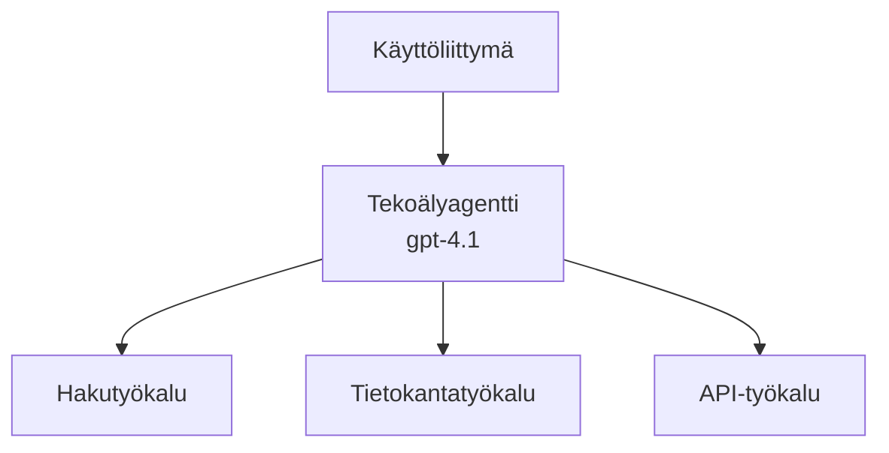
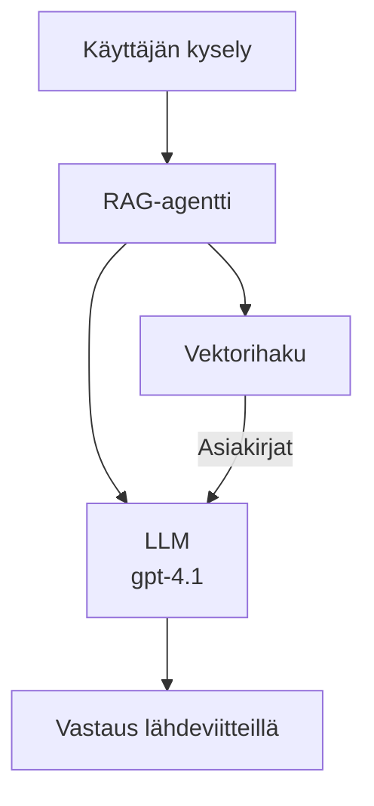

# AI-agentit Azure Developer CLI:llä

**Chapter Navigation:**
- **📚 Course Home**: [AZD Aloittelijoille](../../README.md)
- **📖 Current Chapter**: Chapter 2 - AI-First Development
- **⬅️ Previous**: [Microsoft Foundry Integration](microsoft-foundry-integration.md)
- **➡️ Next**: [AI Model Deployment](ai-model-deployment.md)
- **🚀 Advanced**: [Multi-Agent Solutions](../../examples/retail-scenario.md)

---

## Johdanto

AI-agentit ovat autonomisia ohjelmia, jotka voivat havaita ympäristönsä, tehdä päätöksiä ja suorittaa toimia tiettyjen tavoitteiden saavuttamiseksi. Toisin kuin yksinkertaiset chatbotit, jotka vastaavat kehotteisiin, agentit voivat:

- **Käyttää työkaluja** - Kutsua API:ita, hakea tietokantoja, suorittaa koodia
- **Suunnitella ja päättellä** - Jakaa monimutkaiset tehtävät vaiheisiin
- **Oppia kontekstista** - Säilyttää muistin ja mukauttaa toimintaa
- **Tehdä yhteistyötä** - Työskennellä muiden agenttien kanssa (moni-agenttijärjestelmät)

Tämä opas näyttää, kuinka ottaa AI-agentit käyttöön Azureen Azure Developer CLI:llä (azd).

> **Vahvistusmerkintä (2026-03-25):** Tämä opas tarkistettiin `azd` `1.23.12` ja `azure.ai.agents` `0.1.18-preview` -versioita vasten. `azd ai` -kokemus on edelleen esikatseluvetoinen, joten tarkista laajennuksen ohjeet, jos asennetut liput poikkeavat.

## Oppimistavoitteet

Suoritettuasi tämän oppaan:
- Ymmärrät, mitä AI-agentit ovat ja miten ne eroavat chatboteista
- Otat käyttöön valmiita AI-agenttipohjia AZD:n avulla
- Määrität Foundry-agentit mukautetuille agenteille
- Toteutat perusagenttimalleja (työkalujen käyttö, RAG, moni-agentti)
- Valvot ja virheenkorjaat käyttöönotettuja agentteja

## Oppimistulokset

Oppaan suorittamisen jälkeen osaat:
- Ota AI-agenttisovellukset käyttöön Azureen yhdellä komennolla
- Määrittää agenttien työkaluja ja ominaisuuksia
- Toteuttaa retrieval-augmented generation (RAG) agenttien kanssa
- Suunnitella moni-agenttiarkkitehtuurin monimutkaisille työprosesseille
- Ratkaista yleisiä agenttien käyttöönottoon liittyviä ongelmia

---

## 🤖 Mikä tekee agentista erilaisen kuin chatbot?

| Ominaisuus | Chatbot | AI-agentti |
|---------|---------|----------|
| **Käyttäytyminen** | Vastaa kehotteisiin | Suorittaa autonomisia toimia |
| **Työkalut** | Ei käytössä | Voi kutsua API:ita, hakea ja suorittaa koodia |
| **Muisti** | Vain istuntopohjainen | Pysyvä muisti istuntojen välillä |
| **Suunnittelu** | Yksittäinen vastaus | Monivaiheinen päättely |
| **Yhteistyö** | Yksittäinen toimija | Voi työskennellä muiden agenttien kanssa |

### Yksinkertainen vertaus

- **Chatbot** = Avulias henkilö vastaamassa kysymyksiin neuvontapisteessä
- **AI Agent** = Henkilökohtainen avustaja, joka voi soittaa, varata aikoja ja suorittaa tehtäviä puolestasi

---

## 🚀 Pika-aloitus: Ota ensimmäinen agenttisi käyttöön

### Vaihtoehto 1: Foundry Agents -malli (suositeltu)

```bash
# Alusta tekoälyagenttien malli
azd init --template get-started-with-ai-agents

# Ota käyttöön Azureen
azd up
```

**Mitä otetaan käyttöön:**
- ✅ Foundry-agentit
- ✅ Microsoft Foundry -mallit (gpt-4.1)
- ✅ Azure AI Search (RAG:ia varten)
- ✅ Azure Container Apps (verkkokäyttöliittymä)
- ✅ Application Insights (valvonta)

**Aika:** ~15–20 minuuttia
**Kustannus:** ~100–150 $/kk (kehitys)

### Vaihtoehto 2: OpenAI Agent with Prompty

```bash
# Alusta Prompty-pohjainen agenttipohja
azd init --template agent-openai-python-prompty

# Ota käyttöön Azureen
azd up
```

**Mitä otetaan käyttöön:**
- ✅ Azure Functions (serverless-agentin ajaminen)
- ✅ Microsoft Foundry -mallit
- ✅ Prompty-konfiguraatiotiedostot
- ✅ Esimerkkiesimerkki agentin toteutuksesta

**Aika:** ~10–15 minuuttia
**Kustannus:** ~50–100 $/kk (kehitys)

### Vaihtoehto 3: RAG Chat Agent

```bash
# Alusta RAG-keskustelupohja
azd init --template azure-search-openai-demo

# Ota käyttöön Azureen
azd up
```

**Mitä otetaan käyttöön:**
- ✅ Microsoft Foundry -mallit
- ✅ Azure AI Search esimerkkidatan kanssa
- ✅ Dokumenttien käsittelyputki
- ✅ Chattikäyttöliittymä lähdeviitteillä

**Aika:** ~15–25 minuuttia
**Kustannus:** ~80–150 $/kk (kehitys)

### Vaihtoehto 4: AZD AI Agent Init (manifesti- tai mallipohjainen esikatselu)

Jos sinulla on agentin manifestitiedosto, voit käyttää `azd ai` -komentoa Foundry Agent Service -projektin luonnin aloittamiseen suoraan. Uudemmat esikatseluversiot ovat myös lisänneet mallipohjaista alustuksen tukea, joten tarkka kehotteiden kulku voi vaihdella asennetun laajennusversion mukaan.

```bash
# Asenna AI-agenttien laajennus
azd extension install azure.ai.agents

# Valinnainen: tarkista asennettu esikatseluversio
azd extension show azure.ai.agents

# Alusta agenttimanifestista
azd ai agent init -m agent-manifest.yaml

# Ota käyttöön Azureen
azd up

# Testaa käyttöön otettu agentti (näyttää viiveen ja ensimmäisen tavun saapumisajan)
azd ai agent invoke
```

**Milloin käyttää `azd ai agent init` vs `azd init --template`:**

| Lähestymistapa | Paras käyttötarkoitus | Miten se toimii |
|----------|----------|------|
| `azd init --template` | Aloittaminen toimivasta esimerkkisovelluksesta | Kloonaa täydellisen mallirepon, joka sisältää koodin + infrastruktuurin |
| `azd ai agent init -m` | Rakentaminen omasta agenttimanifestistasi | Luo projektirakenteen agenttisi määritelmän pohjalta |

> **Vinkki:** Käytä `azd init --template` -komentoa oppimiseen (vaihtoehdot 1–3 yllä). Käytä `azd ai agent init` -komentoa, kun rakennat tuotantoagentteja omilla manifesteillasi.

Kun suoritat `azd up`, sama laajennus opastaa agentin elinkaaren läpi: `azd ai agent invoke` testaukseen, `azd ai agent eval generate` ja `azd ai agent optimize` laadun mittaamiseen ja parantamiseen, ja `azd ai agent delete` siivoukseen. Katso [AZD AI CLI -komennot](../chapter-08-production/production-ai-practices.md#azd-ai-cli-commands-and-extensions) täydellisestä viitteestä.

---

## 🏗️ Agentin arkkitehtuurimallit

### Malli 1: Yksittäinen agentti työkaluilla

Yksinkertaisin agenttimalli — yksi agentti, joka voi käyttää useita työkaluja.



**Paras käyttötarkoitus:**
- Asiakaspalvelubotit
- Tutkimusassistentit
- Data-analyysiedustajat

**AZD-malli:** `azure-search-openai-demo`

### Malli 2: RAG-agentti (Retrieval-Augmented Generation)

Agentti, joka hakee olennaiset dokumentit ennen vastausten luomista.



**Paras käyttötarkoitus:**
- Yrityksen tietopankit
- Dokumentti Q&A -järjestelmät
- Compliance- ja oikeustutkimus

**AZD-malli:** `azure-search-openai-demo`

### Malli 3: Moni-agenttijärjestelmä

Useita erikoistuneita agentteja, jotka työskentelevät yhdessä monimutkaisissa tehtävissä.


**Paras käyttötarkoitus:**
- Monimutkainen sisällöntuotanto
- Monivaiheiset työnkulut
- Tehtävät, jotka vaativat eri asiantuntemusta

**Lisätietoja:** [Multi-Agent Coordination Patterns](../chapter-06-pre-deployment/coordination-patterns.md)

---

## ⚙️ Agenttien työkalujen konfigurointi

Agentit muuttuvat tehokkaiksi, kun ne osaavat käyttää työkaluja. Tässä, miten yleisimmät työkalut konfiguroidaan:

### Työkalujen konfigurointi Foundry-agentteihin

```python
# agent_config.py
from azure.ai.projects import AIProjectClient
from azure.ai.projects.models import FunctionTool, CodeInterpreterTool

# Määrittele mukautetut työkalut
search_tool = FunctionTool(
    name="search_knowledge_base",
    description="Search the company knowledge base for relevant documents",
    parameters={
        "type": "object",
        "properties": {
            "query": {
                "type": "string",
                "description": "The search query"
            }
        },
        "required": ["query"]
    }
)

# Luo agentti työkaluilla
agent = project_client.agents.create_agent(
    model="gpt-4.1",
    name="Support Agent",
    instructions="You are a helpful support agent. Use the search tool to find relevant information.",
    tools=[search_tool, CodeInterpreterTool()]
)
```

### Ympäristön määritys

```bash
# Määritä agenttikohtaiset ympäristömuuttujat
azd env set AZURE_OPENAI_MODEL "gpt-4.1"
azd env set AGENT_INSTRUCTIONS "You are a helpful assistant..."
azd env set ENABLE_CODE_INTERPRETER "true"
azd env set ENABLE_FILE_SEARCH "true"

# Ota käyttöön päivitetty konfiguraatio
azd deploy
```

---

## 📊 Agenttien valvonta

### Application Insights -integraatio

Kaikki AZD-agenttipohjat sisältävät Application Insightsin valvontaa varten:

```bash
# Avaa valvontapaneeli
azd monitor --overview

# Näytä reaaliaikaiset lokit
azd monitor --logs

# Näytä reaaliaikaiset mittarit
azd monitor --live
```

### Seurattavat keskeiset mittarit

| Mittari | Kuvaus | Tavoite |
|--------|-------------|--------|
| Vasteviive | Aika vastauksen luomiseen | < 5 sekuntia |
| Token-käyttö | Tokenit per pyyntö | Seuraa kustannuksia |
| Työkalukutsujen onnistumisprosentti | % onnistuneista työkalukutsuista | > 95% |
| Virheprosentti | Epäonnistuneet agenttipyynnöt | < 1% |
| Käyttäjätyytyväisyys | Palautepisteytykset | > 4.0/5.0 |

### Mukautettu lokitus agenteille

```python
import os
from azure.monitor.opentelemetry import configure_azure_monitor
from opentelemetry import trace

# Määritä Azure Monitor OpenTelemetryn avulla
configure_azure_monitor(
    connection_string=os.environ["APPLICATIONINSIGHTS_CONNECTION_STRING"]
)

tracer = trace.get_tracer(__name__)

def log_agent_interaction(user_query, agent_response, tools_used, latency_ms):
    with tracer.start_as_current_span("agent_interaction") as span:
        span.set_attributes({
            "user_query": user_query,
            "response_length": len(agent_response),
            "tools_used": tools_used,
            "latency_ms": latency_ms
        })
```

> **Huom:** Asenna vaaditut paketit: `pip install azure-monitor-opentelemetry opentelemetry`

---

## 💰 Kustannusseikat

### Arvioidut kuukausikustannukset mallin mukaan

| Malli | Kehitysympäristö | Tuotanto |
|---------|-----------------|------------|
| Yksittäinen agentti | $50-100 | $200-500 |
| RAG-agentti | $80-150 | $300-800 |
| Moni-agentti (2-3 agenttia) | $150-300 | $500-1,500 |
| Yrityksen moni-agentti | $300-500 | $1,500-5,000+ |

### Kustannusten optimointivinkit

1. **Käytä gpt-4.1-mini -mallia yksinkertaisiin tehtäviin**
   ```bash
   azd env set AZURE_OPENAI_MODEL "gpt-4.1-mini"
   ```

2. **Ota välimuistitus käyttöön toistuville hauille**
   ```python
   from functools import lru_cache
   
   @lru_cache(maxsize=1000)
   def get_cached_response(query_hash):
       return agent.run(query_hash)
   ```

3. **Aseta token-rajoitukset per suoritus**
   ```python
   # Aseta max_completion_tokens agentin suorittamisen yhteydessä, ei luomisvaiheessa
   run = project_client.agents.create_run(
       thread_id=thread.id,
       agent_id=agent.id,
       max_completion_tokens=1000  # Rajoita vastausten pituutta
   )
   ```

4. **Skaalaa nollaan, kun ei ole käytössä**
   ```bash
   # Container Apps skaalautuvat automaattisesti nollaan
   azd env set MIN_REPLICAS "0"
   ```

---

## 🔧 Agenttien vianmääritys

### Yleisimmät ongelmat ja ratkaisut

<details>
<summary><strong>❌ Agentti ei vastaa työkalukutsuihin</strong></summary>

```bash
# Tarkista, että työkalut on rekisteröity oikein
azd show

# Varmista OpenAI:n käyttöönotto
az cognitiveservices account deployment list \
  --name $AZURE_OPENAI_NAME \
  --resource-group $RG_NAME

# Tarkista agentin lokit
azd monitor --logs
```

**Yleisiä syitä:**
- Työkalutoiminnon allekirjoitus ei täsmää
- Puuttuvat vaaditut käyttöoikeudet
- API-päätepiste ei ole saavutettavissa
</details>

<details>
<summary><strong>❌ Korkea viive agentin vastauksissa</strong></summary>

```bash
# Tarkista Application Insights mahdollisten pullonkaulojen varalta
azd monitor --live

# Harkitse nopeamman mallin käyttämistä
azd env set AZURE_OPENAI_MODEL "gpt-4.1-mini"
azd deploy
```

**Optimointivinkkejä:**
- Käytä suoratoistovastauksia
- Ota vastausten välimuisti käyttöön
- Pienennä kontekstin ikkunakokoa
</details>

<details>
<summary><strong>❌ Agentti palauttaa virheellistä tai keksittyä tietoa</strong></summary>

```python
# Paranna paremmilla järjestelmäkehotteilla
instructions = """
You are a helpful assistant. IMPORTANT:
- Only answer based on provided context
- If you don't know, say "I don't know"
- Always cite your sources
- Never make up information
"""

# Lisää hakutoiminto pohjauksen varten
agent = project_client.agents.create_agent(
    model="gpt-4.1",
    instructions=instructions,
    tools=[FileSearchTool()]  # Perusta vastaukset dokumentteihin
)
```
</details>

<details>
<summary><strong>❌ Token-rajojen ylitysvirheet</strong></summary>

```python
# Toteuta konteksti-ikkunan hallinta
def truncate_context(messages, max_tokens=8000, model="gpt-4.1"):
    """Keep only recent messages within token limit."""
    import tiktoken
    encoding = tiktoken.encoding_for_model(model)
    total_tokens = 0
    truncated = []
    
    for msg in reversed(messages):
        msg_tokens = len(encoding.encode(msg.content))
        if total_tokens + msg_tokens > max_tokens:
            break
        truncated.insert(0, msg)
        total_tokens += msg_tokens
    
    return truncated
```
</details>

---

## 🎓 Käytännön harjoitukset

### Harjoitus 1: Ota perusagentti käyttöön (20 minuuttia)

**Tavoite:** Ota ensimmäinen AI-agenttisi käyttöön AZD:llä

```bash
# Vaihe 1: Alusta malli
azd init --template get-started-with-ai-agents

# Vaihe 2: Kirjaudu Azureen
azd auth login
# Jos työskentelet useiden vuokraajien kanssa, lisää --tenant-id <tenant-id>

# Vaihe 3: Ota käyttöön
azd up

# Vaihe 4: Testaa agentti
# Odotettu tuloste käyttöönoton jälkeen:
#   Käyttöönotto valmis!
#   Päätepiste: https://<app-name>.<region>.azurecontainerapps.io
# Avaa tulosteessa näkyvä URL-osoite ja kokeile esittää kysymys

# Vaihe 5: Tarkastele valvontaa
azd monitor --overview

# Vaihe 6: Siivoa
azd down --force --purge
```

**Onnistumiskriteerit:**
- [ ] Agentti vastaa kysymyksiin
- [ ] Pääsee valvontapaneeliin komennolla `azd monitor`
- [ ] Resurssit siivottiin onnistuneesti

### Harjoitus 2: Lisää mukautettu työkalu (30 minuuttia)

**Tavoite:** Laajenna agenttia mukautetulla työkalulla

1. Ota agenttipohja käyttöön:
   ```bash
   azd init --template get-started-with-ai-agents
   azd up
   ```
2. Luo uusi työkalufunktio agenttikoodissasi:
   ```python
   def get_weather(location: str) -> str:
       """Get current weather for a location."""
       # API-kutsu sääpalveluun
       return f"Weather in {location}: Sunny, 72°F"
   ```
3. Rekisteröi työkalu agentille:
   ```python
   from azure.ai.projects.models import FunctionTool

   weather_tool = FunctionTool(
       name="get_weather",
       description="Get current weather for a location",
       parameters={
           "type": "object",
           "properties": {
               "location": {"type": "string", "description": "City name"}
           },
           "required": ["location"]
       }
   )

   agent = project_client.agents.create_agent(
       model="gpt-4.1",
       name="Weather Agent",
       tools=[weather_tool]
   )
   ```
4. Ota käyttöön uudelleen ja testaa:
   ```bash
   azd deploy
   # Kysy: "Millainen sää on Seattlessa?"
   # Odotettu: Agentti kutsuu get_weather("Seattle") ja palauttaa säätiedot
   ```

**Onnistumiskriteerit:**
- [ ] Agentti tunnistaa sääaiheiset kyselyt
- [ ] Työkalua kutsutaan oikein
- [ ] Vastaus sisältää säätiedot

### Harjoitus 3: RAG-agentin rakentaminen (45 minuuttia)

**Tavoite:** Luo agentti, joka vastaa kysymyksiin dokumenteistasi

```bash
# Vaihe 1: Ota RAG-pohja käyttöön
azd init --template azure-search-openai-demo
azd up

# Vaihe 2: Lataa asiakirjasi
# Aseta PDF/TXT-tiedostot data/-hakemistoon, sitten suorita:
python scripts/prepdocs.py

# Vaihe 3: Testaa toimialakohtaisilla kysymyksillä
# Avaa web-sovelluksen URL azd up -komennon tulosteesta
# Kysy kysymyksiä ladatuista asiakirjoistasi
# Vastauksissa tulisi olla lähdeviittauksia, esimerkiksi [doc.pdf]
```

**Onnistumiskriteerit:**
- [ ] Agentti vastaa ladattujen dokumenttien perusteella
- [ ] Vastauksissa on lähdeviitteet
- [ ] Ei keksintöjä niihin kysymyksiin, jotka ovat rajauksen ulkopuolella

---

## 📚 Seuraavat askeleet

Nyt kun ymmärrät AI-agentit, tutustu näihin edistyneempiin aiheisiin:

| Aihe | Kuvaus | Linkki |
|-------|-------------|------|
| **Multi-Agent Systems** | Rakenna järjestelmiä, joissa on useita yhteistyötä tekeviä agentteja | [Retail Multi-Agent Example](../../examples/retail-scenario.md) |
| **Coordination Patterns** | Opi orkestrointi- ja viestintämalleja | [Coordination Patterns](../chapter-06-pre-deployment/coordination-patterns.md) |
| **Production Deployment** | Tuotantovalmiit agenttien käyttöönotot | [Production AI Practices](../chapter-08-production/production-ai-practices.md) |
| **Agent Evaluation** | Testaa ja arvioi agentin suorituskykyä | [AI Troubleshooting](../chapter-07-troubleshooting/ai-troubleshooting.md) |
| **AI Workshop Lab** | Käytännön harjoitus: tee AI-ratkaisustasi AZD-valmis | [AI Workshop Lab](ai-workshop-lab.md) |

---

## 📖 Lisäresurssit

### Virallinen dokumentaatio
- [Microsoft Foundry Agent Service](https://learn.microsoft.com/azure/ai-services/agents/)
- [Microsoft Foundry Agent Service Quickstart](https://learn.microsoft.com/azure/ai-services/agents/quickstart)
- [Semantic Kernel Agent Framework](https://learn.microsoft.com/semantic-kernel/)

### AZD-mallit agenteille
- [Get Started with AI Agents](https://github.com/Azure-Samples/get-started-with-ai-agents)
- [Agent OpenAI Python Prompty](https://github.com/Azure-Samples/agent-openai-python-prompty)
- [Azure Search OpenAI Demo](https://github.com/Azure-Samples/azure-search-openai-demo)

### Yhteisöresurssit
- [Awesome AZD - Agent Templates](https://azure.github.io/awesome-azd/?tags=ai-agents)
- [Azure AI Discord](https://discord.gg/microsoft-azure)
- [Microsoft Foundry Discord](https://discord.gg/nTYy5BXMWG)

### Agenttitaidot editorillesi
- [**Microsoft Azure Agent Skills**](https://skills.sh/microsoft/github-copilot-for-azure) - Asenna uudelleenkäytettäviä AI-agenttien taitoja Azure-kehitystä varten GitHub Copilotiin, Cursoriin tai mihin tahansa tuettuun agenttiin. Sisältää taidot [Azure AI](https://skills.sh/microsoft/github-copilot-for-azure/azure-ai), [Microsoft Foundry](https://skills.sh/microsoft/github-copilot-for-azure/microsoft-foundry), [deployment](https://skills.sh/microsoft/github-copilot-for-azure/azure-deploy) ja [diagnostics](https://skills.sh/microsoft/github-copilot-for-azure/azure-diagnostics):
  ```bash
  npx skills add microsoft/github-copilot-for-azure
  ```

---

**Navigaatio**
- **Edellinen oppitunti**: [Microsoft Foundry Integration](microsoft-foundry-integration.md)
- **Seuraava oppitunti**: [AI Model Deployment](ai-model-deployment.md)

---

<!-- CO-OP TRANSLATOR DISCLAIMER START -->
**Vastuuvapauslauseke**:
Tämä asiakirja on käännetty käyttämällä tekoälypohjaista käännöspalvelua [Co-op Translator](https://github.com/Azure/co-op-translator). Vaikka pyrimme tarkkuuteen, otathan huomioon, että automaattiset käännökset saattavat sisältää virheitä tai epätarkkuuksia. Alkuperäinen asiakirja sen alkuperäiskielellä on virallinen lähde. Tärkeissä asioissa suositellaan ammattimaista ihmiskäännöstä. Emme ole vastuussa tämän käännöksen käytöstä aiheutuvista väärinymmärryksistä tai tulkinnoista.
<!-- CO-OP TRANSLATOR DISCLAIMER END -->