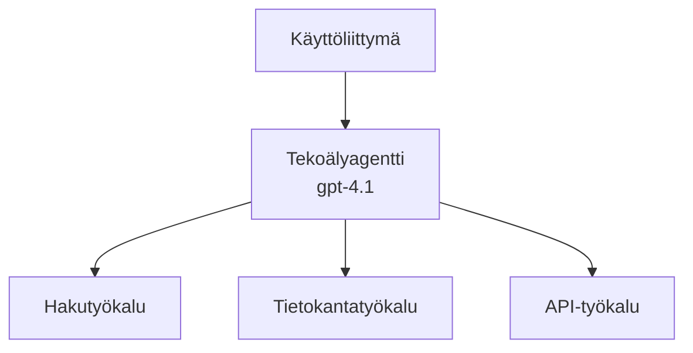
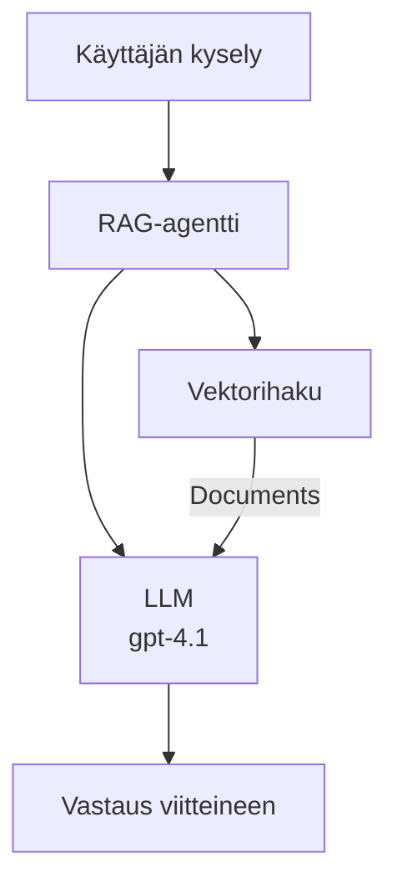
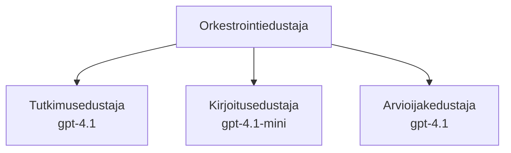

# AI-agentit Azure Developer CLI:n kanssa

**Lukuvalikko:**
- **📚 Kurssin etusivu**: [AZD Aloittelijoille](../../README.md)
- **📖 Nykyinen luku**: Luku 2 - AI-ensimmäinen kehitys
- **⬅️ Edellinen**: [Microsoft Foundry Integration](microsoft-foundry-integration.md)
- **➡️ Seuraava**: [AI-mallin käyttöönotto](ai-model-deployment.md)
- **🚀 Edistynyt**: [Moniagenttiratkaisut](../../examples/retail-scenario.md)

---

## Johdanto

AI-agentit ovat autonomisia ohjelmia, jotka voivat havaita ympäristönsä, tehdä päätöksiä ja toteuttaa toimia saavuttaakseen tiettyjä tavoitteita. Toisin kuin yksinkertaiset chatbotit, jotka vastaavat kehotteisiin, agentit voivat:

- **Käyttää työkaluja** - Kutsua API-rajapintoja, hakea tietokannoista, suorittaa koodi
- **Suunnitella ja tehdä päätelmiä** - Pilkkoa monimutkaiset tehtävät vaiheisiin
- **Oppia kontekstista** - Säilyttää muistin ja mukauttaa käyttäytymistään
- **Tehdä yhteistyötä** - Työskennellä muiden agenttien kanssa (moniagenttijärjestelmät)

Tämä opas näyttää, kuinka AI-agentit otetaan käyttöön Azureen Azure Developer CLI:n (azd) avulla.

> **Vahvistusmerkintä (2026-07-13):** Tätä opasta on tarkistettu `azd` `1.27.1` ja `azure.ai.agents` `1.0.0-beta.5` versioita vasten. `azd ai` -kokemus on yhä esikatseluvaiheessa, joten tarkista laajennuksen ohje, jos asennetut liput eroavat.

## Oppimistavoitteet

Tämän oppaan suorittamalla:
- Ymmärrät mitä AI-agentit ovat ja miten ne eroavat chatteista
- Otat käyttöön valmiita AI-agenttimallipohjia AZD:llä
- Määrität Foundry Agents -agentteja oman agentin tarpeisiin
- Toteutat perusagenttimalleja (työkalujen käyttö, RAG, moni-agentti)
- Valvot ja virheenkorjaat käyttöönotettuja agenteja

## Oppimistulokset

Suoritettuasi opit:
- Ottamaan AI-agenttisovelluksia käyttöön Azureen yhdellä komennolla
- Määrittämään agenttien työkalut ja toiminnot
- Toteuttamaan hakua tukevan generoinnin (RAG) agenteilla
- Suunnittelemaan moni-agenttiarkkitehtuurit monimutkaisiin työnkulkuihin
- Ratkaisemaan yleisimpiä agenttikäyttöönoton ongelmia

---

## 🤖 Mikä erottaa agentin chatbotista?

| Ominaisuus | Chatbot | AI-agentti |
|---------|---------|----------|
| **Käyttäytyminen** | Vastaa kehotteisiin | Tekee autonomisia toimia |
| **Työkalut** | Ei käytössä | Voi kutsua API-rajapintoja, hakea ja suorittaa koodia |
| **Muisti** | Istuntopohjainen | Pysyvä muisti istuntojen välillä |
| **Suunnittelu** | Yksittäinen vastaus | Monivaiheinen päättely |
| **Yhteistyö** | Yksi yksikkö | Voi työskennellä muiden agenttien kanssa |

### Yksinkertainen vertauskuva

- **Chatbot** = Avulias henkilö vastaamassa kysymyksiin infopisteellä
- **AI-agentti** = Henkilökohtainen avustaja, joka voi soittaa, varata aikatauluja ja hoitaa tehtäviä puolestasi

---

## 🚀 Nopeasti alkuun: Ota ensimmäinen agentti käyttöön

### Vaihtoehto 1: Foundry Agents -mallipohja (suositeltu)

```bash
# Alusta AI-agenttipohja
azd init --template get-started-with-ai-agents

# Ota käyttöön Azureen
azd up
```

**Mitä otetaan käyttöön:**
- ✅ Foundry Agents
- ✅ Microsoft Foundry -mallit (gpt-4.1)
- ✅ Azure AI Search (RAG:ia varten)
- ✅ Azure Container Apps (verkkokäyttöliittymä)
- ✅ Application Insights (valvonta)

**Aika:** ~15-20 minuuttia
**Kustannus:** ~$100-150/kuukausi (kehitys)

### Vaihtoehto 2: OpenAI-agentti Promptyllä

```bash
# Alusta Prompty-pohjainen agenttipohja
azd init --template agent-openai-python-prompty

# Ota käyttöön Azureen
azd up
```

**Mitä otetaan käyttöön:**
- ✅ Azure Functions (palvelimeton agenttien suoritus)
- ✅ Microsoft Foundry -mallit
- ✅ Prompty-konfiguraatiotiedostot
- ✅ Näyteagentin toteutus

**Aika:** ~10-15 minuuttia
**Kustannus:** ~$50-100/kuukausi (kehitys)

### Vaihtoehto 3: RAG-chatagentti

```bash
# Alusta RAG-keskustelumalli
azd init --template azure-search-openai-demo

# Ota käyttöön Azureen
azd up
```

**Mitä otetaan käyttöön:**
- ✅ Microsoft Foundry -mallit
- ✅ Azure AI Search näyteaineistolla
- ✅ Asiakirjojen käsittelyputki
- ✅ Chat-käyttöliittymä lähdeviitteillä

**Aika:** ~15-25 minuuttia
**Kustannus:** ~$80-150/kuukausi (kehitys)

### Vaihtoehto 4: AZD AI Agent Init (Manifesti- tai mallipohjainen esikatselu)

Jos sinulla on agentin manifestitiedosto, voit käyttää `azd ai` -komentoa suoraan Foundry Agent Service -projektin luomiseen. Viimeaikaiset esikatseluversiot tukevat myös mallipohjaista aloitusta, joten tarkka kehotteen kulku voi hieman vaihdella asennetun laajennuksen version mukaan.

```bash
# Asenna tekoälyagenttien laajennus
azd extension install azure.ai.agents

# Valinnainen: varmista asennettu esikatseluversio
azd extension show azure.ai.agents

# Alusta agenttimanifestista
azd ai agent init -m agent-manifest.yaml

# Ota käyttöön Azureen
azd up

# Testaa käyttöönotettu agentti (näyttää viiveen + ensimmäisen tavun saapumisajan)
azd ai agent invoke
```

**Milloin käyttää `azd ai agent init` vs `azd init --template`:**

| Lähestymistapa | Paras käyttö | Miten toimii |
|----------|----------|------|
| `azd init --template` | Aloittaessa toimivasta näytösovelluksesta | Kloonaa kokonaisen mallipohjarepositorion, sisältäen koodin ja infrastruktuurin |
| `azd ai agent init -m` | Rakentaessa omasta agentin manifestista | Luo projektirakenteen agentin määritelmän pohjalta |

> **Vinkki:** Käytä `azd init --template` oppimiseen (vaihtoehdot 1-3 yllä). Käytä `azd ai agent init` tuotantoagenttien rakentamiseen omilla manifesteillasi.

Komennon `azd up` jälkeen sama laajennus ohjaa sinut agentin elinkaaren läpi: `azd ai agent invoke` testaukseen, `azd ai agent eval generate` ja `azd ai agent optimize` laadun mittaukseen ja parantamiseen, sekä `azd ai agent delete` siivoukseen. Katso [AZD AI CLI Commands](../chapter-08-production/production-ai-practices.md#azd-ai-cli-commands-and-extensions) täydellinen viite.

---

## 🏗️ Agenttien arkkitehtuurimallit

### Malli 1: Yksittäinen agentti työkaluilla

Yksinkertaisin agenttimalli – yksi agentti, joka voi käyttää useita työkaluja.



**Paras käyttö:**
- Asiakaspalvelurobotit
- Tutkimusapulaiset
- Data-analyysin agentit

**AZD-malli:** `azure-search-openai-demo`

### Malli 2: RAG-agentti (hakuavusteinen generointi)

Agentti, joka hakee olennaisia asiakirjoja ennen vastauksen generointia.



**Paras käyttö:**
- Yrityksen tietokannat
- Asiakirjakyselyjärjestelmät
- Säädösten ja oikeudellisen tutkimuksen apu

**AZD-malli:** `azure-search-openai-demo`

### Malli 3: Moni-agenttijärjestelmä

Useita erikoistuneita agentteja työskentelemässä yhdessä monimutkaisissa tehtävissä.



**Paras käyttö:**
- Monimutkainen sisällöntuotanto
- Monivaiheiset työnkulut
- Tehtävät, jotka vaativat eri tietotaitoja

**Lue lisää:** [Moniagenttien koordinointimallit](../chapter-06-pre-deployment/coordination-patterns.md)

---

## ⚙️ Agenttien työkalujen konfigurointi

Agentit saavat voimaa, kun ne voivat käyttää työkaluja. Näin konfiguroit yleiset työkalut:

### Työkalun konfigurointi Foundry Agentsissa

```python
# agent_config.py
from azure.ai.projects import AIProjectClient
from azure.ai.projects.models import FunctionTool, CodeInterpreterTool

# Määritä mukautetut työkalut
search_tool = FunctionTool(
    name="search_knowledge_base",
    description="Search the company knowledge base for relevant documents",
    parameters={
        "type": "object",
        "properties": {
            "query": {
                "type": "string",
                "description": "The search query"
            }
        },
        "required": ["query"]
    }
)

# Luo agentti työkaluilla
agent = project_client.agents.create_agent(
    model="gpt-4.1",
    name="Support Agent",
    instructions="You are a helpful support agent. Use the search tool to find relevant information.",
    tools=[search_tool, CodeInterpreterTool()]
)
```

### Ympäristöasetukset

```bash
# Määritä agenttikohtaiset ympäristömuuttujat
azd env set AZURE_OPENAI_MODEL "gpt-4.1"
azd env set AGENT_INSTRUCTIONS "You are a helpful assistant..."
azd env set ENABLE_CODE_INTERPRETER "true"
azd env set ENABLE_FILE_SEARCH "true"

# Ota käyttöön päivitetty konfiguraatio
azd deploy
```

---

## 📊 Agenttien valvonta

### Application Insights -integrointi

Kaikki AZD-agenttimallit sisältävät Application Insightsin valvontaan:

```bash
# Avaa valvontapaneeli
azd monitor --overview

# Näytä reaaliaikaiset lokit
azd monitor --logs

# Näytä reaaliaikaiset mittarit
azd monitor --live
```

### Seurattavat keskeiset mittarit

| Mittari | Kuvaus | Tavoite |
|--------|-------------|--------|
| Vastausviive | Aika vastauksen generoimiseen | < 5 sekuntia |
| Tokenien käyttö | Tokenien määrä per pyyntö | Seuraa kustannuksia |
| Työkalujen suorituksen onnistumisprosentti | % onnistuneista työkalukutsuista | > 95% |
| Virheiden määrä | Epäonnistuneet agenttipyynnöt | < 1% |
| Käyttäjätyytyväisyys | Palautearvioinnit | > 4.0/5.0 |

### Räätälöity lokitus agenteille

```python
import os
from azure.monitor.opentelemetry import configure_azure_monitor
from opentelemetry import trace

# Määritä Azure Monitor OpenTelemetrillä
configure_azure_monitor(
    connection_string=os.environ["APPLICATIONINSIGHTS_CONNECTION_STRING"]
)

tracer = trace.get_tracer(__name__)

def log_agent_interaction(user_query, agent_response, tools_used, latency_ms):
    with tracer.start_as_current_span("agent_interaction") as span:
        span.set_attributes({
            "user_query": user_query,
            "response_length": len(agent_response),
            "tools_used": tools_used,
            "latency_ms": latency_ms
        })
```

> **Huom:** Asenna tarvittavat paketit: `pip install azure-monitor-opentelemetry opentelemetry`

---

## 💰 Kustannusnäkökulmat

### Arvioidut kuukausikustannukset mallikohtaisesti

| Malli | Kehitysympäristö | Tuotanto |
|---------|-----------------|------------|
| Yksittäinen agentti | $50-100 | $200-500 |
| RAG-agentti | $80-150 | $300-800 |
| Moni-agentti (2-3 agenttia) | $150-300 | $500-1,500 |
| Yrityksen moni-agentti | $300-500 | $1,500-5,000+ |

### Kustannusten optimoinnin vinkit

1. **Käytä gpt-4.1-miniä yksinkertaisiin tehtäviin**
   ```bash
   azd env set AZURE_OPENAI_MODEL "gpt-4.1-mini"
   ```

2. **Ota käyttöön välimuisti toistuviin kyselyihin**
   ```python
   from functools import lru_cache
   
   @lru_cache(maxsize=1000)
   def get_cached_response(query_hash):
       return agent.run(query_hash)
   ```

3. **Aseta token-rajoitukset suoritukselle**
   ```python
   # Aseta max_completion_tokens agentin suorittamisen aikana, ei luomisen yhteydessä
   run = project_client.agents.create_run(
       thread_id=thread.id,
       agent_id=agent.id,
       max_completion_tokens=1000  # Rajoita vastausmäärä
   )
   ```

4. **Skaalaa nollaan, kun agenttia ei käytetä**
   ```bash
   # Container-sovellukset skaalautuvat automaattisesti nollaan
   azd env set MIN_REPLICAS "0"
   ```

---

## 🔧 Agenttien vianmääritys

### Yleiset ongelmat ja ratkaisut

<details>
<summary><strong>❌ Agentti ei vastaa työkalukutsuihin</strong></summary>

```bash
# Tarkista, että työkalut on rekisteröity oikein
azd show

# Vahvista OpenAI:n käyttöönotto
az cognitiveservices account deployment list \
  --name $AZURE_OPENAI_NAME \
  --resource-group $RG_NAME

# Tarkista agentin lokit
azd monitor --logs
```

**Yleisimmät syyt:**
- Työkalufunktion allekirjoitus ei vastaa
- Puuttuvat tarvittavat käyttöoikeudet
- API-päätepistettä ei ole saavutettavissa
</details>

<details>
<summary><strong>❌ Korkea viive agentin vastauksissa</strong></summary>

```bash
# Tarkista Application Insights pullonkaulojen varalta
azd monitor --live

# Harkitse nopeamman mallin käyttämistä
azd env set AZURE_OPENAI_MODEL "gpt-4.1-mini"
azd deploy
```

**Optimointivinkit:**
- Käytä suoratoistovastauksia
- Toteuta vastausten välimuistitus
- Pienennä kontekstin ikkunan kokoa
</details>

<details>
<summary><strong>❌ Agentti palauttaa virheellistä tai kuviteltua tietoa</strong></summary>

```python
# Paranna paremmilla järjestelmäkehotteilla
instructions = """
You are a helpful assistant. IMPORTANT:
- Only answer based on provided context
- If you don't know, say "I don't know"
- Always cite your sources
- Never make up information
"""

# Lisää haku perustaksi
agent = project_client.agents.create_agent(
    model="gpt-4.1",
    instructions=instructions,
    tools=[FileSearchTool()]  # Perusta vastaukset asiakirjoihin
)
```
</details>

<details>
<summary><strong>❌ Token-rajan ylitykset</strong></summary>

```python
# Toteuta kontekstin ikkunanhallinta
def truncate_context(messages, max_tokens=8000, model="gpt-4.1"):
    """Keep only recent messages within token limit."""
    import tiktoken
    encoding = tiktoken.encoding_for_model(model)
    total_tokens = 0
    truncated = []
    
    for msg in reversed(messages):
        msg_tokens = len(encoding.encode(msg.content))
        if total_tokens + msg_tokens > max_tokens:
            break
        truncated.insert(0, msg)
        total_tokens += msg_tokens
    
    return truncated
```
</details>

---

## 🎓 Käytännön harjoitukset

### Harjoitus 1: Ota perusagentti käyttöön (20 minuuttia)

**Tavoite:** Ota ensimmäinen AI-agenttisi käyttöön AZD:llä

```bash
# Vaihe 1: Alusta malli
azd init --template get-started-with-ai-agents

# Vaihe 2: Kirjaudu Azureen
azd auth login
# Jos työskentelet eri vuokralaisten välillä, lisää --tenant-id <tenant-id>

# Vaihe 3: Ota käyttöön
azd up

# Vaihe 4: Testaa agentti
# Odotettu tulos käyttöönoton jälkeen:
#   Käyttöönotto valmis!
#   Päätepiste: https://<app-name>.<region>.azurecontainerapps.io
# Avaa tulosteessa näkyvä URL-osoite ja kokeile esittää kysymys

# Vaihe 5: Tarkastele valvontaa
azd monitor --overview

# Vaihe 6: Siivoa
azd down --force --purge
```

**Onnistumisen kriteerit:**
- [ ] Agentti vastaa kysymyksiin
- [ ] Pääsee valvontapaneeliin `azd monitor` -komennolla
- [ ] Resurssit siivottu onnistuneesti

### Harjoitus 2: Lisää oma työkalu (30 minuuttia)

**Tavoite:** Laajenna agenttia omalla työkalulla

1. Ota agenttimalli käyttöön:
   ```bash
   azd init --template get-started-with-ai-agents
   azd up
   ```
2. Luo uusi työkalufunktio agenttikoodiin:
   ```python
   def get_weather(location: str) -> str:
       """Get current weather for a location."""
       # API-kutsu sääpalveluun
       return f"Weather in {location}: Sunny, 72°F"
   ```
3. Rekisteröi työkalu agentille:
   ```python
   from azure.ai.projects.models import FunctionTool

   weather_tool = FunctionTool(
       name="get_weather",
       description="Get current weather for a location",
       parameters={
           "type": "object",
           "properties": {
               "location": {"type": "string", "description": "City name"}
           },
           "required": ["location"]
       }
   )

   agent = project_client.agents.create_agent(
       model="gpt-4.1",
       name="Weather Agent",
       tools=[weather_tool]
   )
   ```
4. Ota uudelleen käyttöön ja testaa:
   ```bash
   azd deploy
   # Kysy: "Millainen sää on Seattlessa?"
   # Odotettu: Agentti kutsuu get_weather("Seattle") ja palauttaa sää tiedot
   ```

**Onnistumisen kriteerit:**
- [ ] Agentti tunnistaa säähän liittyvät kyselyt
- [ ] Työkalu kutsutaan oikein
- [ ] Vastaus sisältää säätiedot

### Harjoitus 3: Rakenna RAG-agentti (45 minuuttia)

**Tavoite:** Luo agentti, joka vastaa kysymyksiin asiakirjoistasi

```bash
# Vaihe 1: Ota RAG-malli käyttöön
azd init --template azure-search-openai-demo
azd up

# Vaihe 2: Lataa asiakirjasi
# Aseta PDF/TXT-tiedostot data/ -hakemistoon, sitten suorita:
python scripts/prepdocs.py

# Vaihe 3: Testaa toimialakohtaisilla kysymyksillä
# Avaa verkkosovelluksen URL osoite azd up -tulosteesta
# Kysy kysymyksiä ladatuista asiakirjoistasi
# Vastauksissa tulisi olla lähdeviitteitä, kuten [doc.pdf]
```

**Onnistumisen kriteerit:**
- [ ] Agentti vastaa ladattujen asiakirjojen perusteella
- [ ] Vastaukset sisältävät lähdeviitteet
- [ ] Ei virheellisiä vastauksia rajojen ulkopuolisissa kysymyksissä

---

## 📚 Seuraavat askeleet

Nyt kun ymmärrät AI-agentit, tutustu näihin edistyneisiin aiheisiin:

| Aihe | Kuvaus | Linkki |
|-------|-------------|------|
| **Moni-agenttijärjestelmät** | Rakenna järjestelmiä, joissa useat agentit tekevät yhteistyötä | [Retail Multi-Agent Esimerkki](../../examples/retail-scenario.md) |
| **Koordinointimallit** | Opettele orkestrointi- ja viestintämallit | [Koordinointimallit](../chapter-06-pre-deployment/coordination-patterns.md) |
| **Tuotantokäyttöönotto** | Yrityskäyttövalmiiden agenttien käyttöönotto | [Tuotanto AI-käytännöt](../chapter-08-production/production-ai-practices.md) |
| **Agentin arviointi** | Testaa ja arvioi agenttien suorituskykyä | [AI-vianmääritys](../chapter-07-troubleshooting/ai-troubleshooting.md) |
| **AI-työpajan labra** | Käytännön harjoitus: Tee AI-ratkaisustasi AZD-valmis | [AI Workshop Lab](ai-workshop-lab.md) |

---

## 📖 Lisää resursseja

### Viralliset dokumentit
- [Microsoft Foundry Agent Service](https://learn.microsoft.com/azure/ai-services/agents/)
- [Microsoft Foundry Agent Service Pikakirja](https://learn.microsoft.com/azure/ai-services/agents/quickstart)
- [Semantic Kernel Agent Framework](https://learn.microsoft.com/semantic-kernel/)

### AZD-mallit agenteille
- [Aloita AI-agenttien kanssa](https://github.com/Azure-Samples/get-started-with-ai-agents)
- [Agent OpenAI Python Prompty](https://github.com/Azure-Samples/agent-openai-python-prompty)
- [Azure Search OpenAI Demo](https://github.com/Azure-Samples/azure-search-openai-demo)

### Yhteisön resurssit
- [Awesome AZD - Agenttimallit](https://azure.github.io/awesome-azd/?tags=ai-agents)
- [Azure AI Discord](https://discord.gg/microsoft-azure)
- [Microsoft Foundry Discord](https://discord.gg/nTYy5BXMWG)

### Agenttien taidot editorillesi
- [**Microsoft Azure Agent Skills**](https://skills.sh/microsoft/github-copilot-for-azure) – Asenna uudelleenkäytettäviä AI-agenttien taitoja Azure-kehitykseen GitHub Copilotille, Cursorille tai mille tahansa tuetulle agentille. Sisältää taidot [Azure AI:lle](https://skills.sh/microsoft/github-copilot-for-azure/azure-ai), [Microsoft Foundrylle](https://skills.sh/microsoft/github-copilot-for-azure/microsoft-foundry), [käyttöönottoon](https://skills.sh/microsoft/github-copilot-for-azure/azure-deploy) ja [diagnostiikkaan](https://skills.sh/microsoft/github-copilot-for-azure/azure-diagnostics):
  ```bash
  npx skills add microsoft/github-copilot-for-azure
  ```

---

**Navigointi**
- **Edellinen oppitunti**: [Microsoft Foundry Integration](microsoft-foundry-integration.md)
- **Seuraava oppitunti**: [AI-mallin käyttöönotto](ai-model-deployment.md)

---

<!-- CO-OP TRANSLATOR DISCLAIMER START -->
**Vastuuvapauslauseke**:
Tämä asiakirja on käännetty käyttämällä tekoälypohjaista käännöspalvelua [Co-op Translator](https://github.com/Azure/co-op-translator). Vaikka pyrimme tarkkuuteen, otathan huomioon, että automaattiset käännökset saattavat sisältää virheitä tai epätarkkuuksia. Alkuperäinen asiakirja sen alkuperäiskielellä on virallinen lähde. Tärkeissä asioissa suositellaan ammattimaista ihmiskäännöstä. Emme ole vastuussa tämän käännöksen käytöstä aiheutuvista väärinymmärryksistä tai tulkinnoista.
<!-- CO-OP TRANSLATOR DISCLAIMER END -->