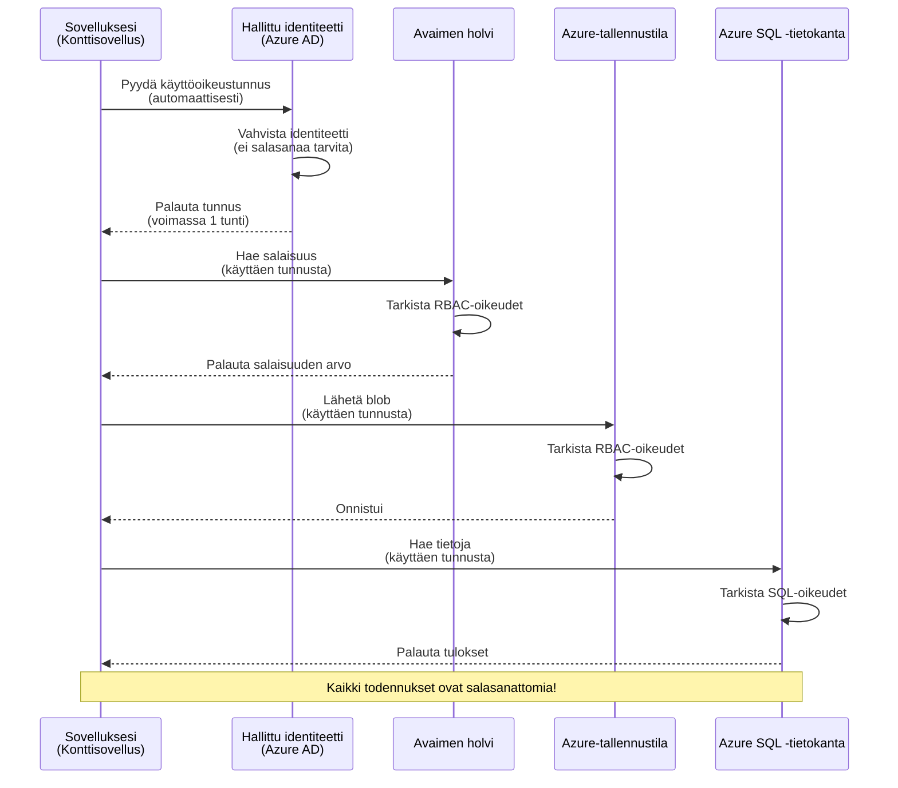
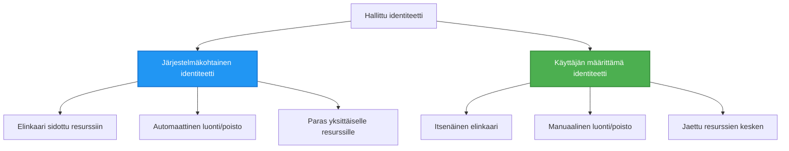

# Authentication Patterns and Managed Identity

⏱️ **Arvioitu aika**: 45-60 minuuttia | 💰 **Kustannusvaikutus**: Ilmainen (ei lisämaksuja) | ⭐ **Monimutkaisuus**: Keskitaso

**📚 Oppimispolku:**
- ← Edellinen: [Konfiguraation hallinta](configuration.md) - Ympäristömuuttujien ja salaisuuksien hallinta
- 🎯 **Olet täällä**: Todennus & tietoturva (hallinnoitu identiteetti, Key Vault, turvalliset mallit)
- → Seuraava: [Ensimmäinen projekti](first-project.md) - Rakenna ensimmäinen AZD-sovelluksesi
- 🏠 [Kurssin etusivu](../../README.md)

---

## Mitä opit

Tämän oppitunnin suorittamisen jälkeen:
- Ymmärrät Azure-todennusmallit (avaimet, yhteysmerkkijonot, hallinnoitu identiteetti)
- Otat käyttöön **hallinnoidun identiteetin** salasanattomaan todennukseen
- Suojaat salaisuuksia **Azure Key Vault** -integroinnilla
- Määrität **roolipohjaisen käyttöoikeuksien hallinnan (RBAC)** AZD-julkaisuja varten
- Sovellat tietoturvan parhaita käytäntöjä Container Apps -sovelluksissa ja Azure-palveluissa
- Siirrät järjestelmiä avainpohjaisesta identiteettipohjaiseen todennukseen

## Miksi hallinnoitu identiteetti on tärkeä

### Ongelma: Perinteinen todennus

**Ennen hallinnoitua identiteettiä:**
```javascript
// ❌ TURVALLISUUSRISKI: Koodiin kovakoodatut salaisuudet
const connectionString = "Server=mydb.database.windows.net;User=admin;Password=P@ssw0rd123";
const storageKey = "xK7mN9pQ2wR5tY8uI0oP3aS6dF1gH4jK...";
const cosmosKey = "C2x7B9n4M1p8Q5w3E6r0T2y5U8i1O4p7...";
```

**Ongelmat:**
- 🔴 **Paljastuneet salaisuudet** koodissa, konfiguraatiotiedostoissa, ympäristömuuttujissa
- 🔴 **Tunnistetietojen uusiminen** vaatii koodimuutoksia ja uudelleenkäyttöönottamista
- 🔴 **Auditoinnin vaikeudet** - kuka pääsi mihinkin ja milloin?
- 🔴 **Hajautuminen** - salaisuudet levällään useissa järjestelmissä
- 🔴 **Säädöstenmukaisuusriskit** - epäonnistuu turvallisuustarkastuksissa

### Ratkaisu: Hallinnoitu identiteetti

**Hallinnoidun identiteetin jälkeen:**
```javascript
// ✅ TURVALLINEN: Ei salaisuuksia koodissa
const credential = new DefaultAzureCredential();
const client = new BlobServiceClient(
  "https://mystorageaccount.blob.core.windows.net",
  credential  // Azure hoitaa todennuksen automaattisesti
);
```

**Edut:**
- ✅ **Ei salaisuuksia** koodissa tai konfiguraatiossa
- ✅ **Automaattinen uusiminen** - Azure hoitaa sen
- ✅ **Täydellinen auditointiloki** Azure AD -lokitiedoissa
- ✅ **Keskitetty tietoturva** - hallinta Azure-portaalista
- ✅ **Valmis vaatimustenmukaisuuteen** - täyttää turvallisuusvaatimukset

**Vertauskuva**: Perinteinen todennus on kuin kantaisi useita fyysisiä avaimia eri oville. Hallinnoitu identiteetti on kuin kulkukortti, joka myöntää pääsyn automaattisesti henkilöllisyytesi perusteella — ei avaimia, joita voisi kadottaa, kopioida tai uusintaa.

---

## Arkkitehtuurin yleiskatsaus

### Todennusvirtaus hallinnoidulla identiteetillä


### Hallinnoitujen identiteettien tyypit


| Ominaisuus | Järjestelmän määrittämä | Käyttäjän määrittämä |
|---------|----------------|---------------|
| **Elinkaari** | Liitetty resurssiin | Itsenäinen |
| **Luonti** | Automaattinen resurssin kanssa | Manuaalinen luonti |
| **Poisto** | Poistuu resurssin poistamisen yhteydessä | Pysyy olemassa resurssin poiston jälkeen |
| **Jakaminen** | Vain yhdelle resurssille | Useille resursseille |
| **Käyttötapaus** | Yksinkertaiset tilanteet | Monimutkaiset moniresurssitapaukset |
| **AZD-oletus** | ✅ Suositeltu | Valinnainen |

---

## Esivaatimukset

### Vaaditut työkalut

Sinulla tulisi olla nämä asennettuna edellisistä oppitunneista:

```bash
# Tarkista Azure Developer CLI
azd version
# ✅ Odotettu: azd versio 1.0.0 tai uudempi

# Tarkista Azure CLI
az --version
# ✅ Odotettu: azure-cli 2.50.0 tai uudempi
```

### Azure-vaatimukset

- Aktiivinen Azure-tilaus
- Oikeudet:
  - Luoda hallinnoituja identiteettejä
  - Määrittää RBAC-rooleja
  - Luoda Key Vault -resursseja
  - Julkaista Container Apps -sovelluksia

### Tietovaatimukset

Sinun tulisi olla suorittanut:
- [Asennusopas](installation.md) - AZD-asennus
- [AZD-perusteet](azd-basics.md) - Peruskäsitteet
- [Konfiguraation hallinta](configuration.md) - Ympäristömuuttujat

---

## Oppitunti 1: Todennusmallien ymmärtäminen

### Malli 1: Yhteysmerkkijonot (perinteinen - vältä)

**Miten se toimii:**
```bash
# Yhteysmerkkijono sisältää tunnistetiedot
STORAGE_CONNECTION_STRING="DefaultEndpointsProtocol=https;AccountName=myaccount;AccountKey=xK7mN9pQ2wR5..."
COSMOS_CONNECTION_STRING="AccountEndpoint=https://myaccount.documents.azure.com:443/;AccountKey=C2x7..."
SQL_CONNECTION_STRING="Server=myserver.database.windows.net;User=admin;Password=P@ssw0rd..."
```

**Ongelmat:**
- ❌ Salaisuudet näkyvissä ympäristömuuttujissa
- ❌ Tallentuvat julkaisujärjestelmien lokitietoihin
- ❌ Vaikea uusia
- ❌ Ei auditointilokia pääsystä

**Milloin käyttää:** Vain paikallisessa kehityksessä, ei koskaan tuotannossa.

---

### Malli 2: Key Vault -viittaukset (parempi)

**Miten se toimii:**
```bicep
// Store secret in Key Vault
resource keyVault 'Microsoft.KeyVault/vaults@2023-02-01' = {
  name: 'mykv'
  properties: {
    enableRbacAuthorization: true
  }
}

// Reference in Container App
env: [
  {
    name: 'STORAGE_KEY'
    secretRef: 'storage-key'  // References Key Vault
  }
]
```

**Edut:**
- ✅ Salaisuudet tallennetaan turvallisesti Key Vaultiin
- ✅ Keskitetty salaisuuksien hallinta
- ✅ Uusiminen ilman koodimuutoksia

**Rajoitukset:**
- ⚠️ Käyttää edelleen avaimia/salasanoja
- ⚠️ Tarve hallita Key Vaultin käyttöoikeuksia

**Milloin käyttää:** Välivaihe yhteysmerkkijonoista hallinnoituun identiteettiin.

---

### Malli 3: Hallinnoitu identiteetti (paras käytäntö)

**Miten se toimii:**
```bicep
// Enable managed identity
resource containerApp 'Microsoft.App/containerApps@2023-05-01' = {
  name: 'myapp'
  identity: {
    type: 'SystemAssigned'  // Automatically creates identity
  }
}

// Grant permissions
resource roleAssignment 'Microsoft.Authorization/roleAssignments@2022-04-01' = {
  scope: storageAccount
  properties: {
    roleDefinitionId: storageBlobDataContributorRole
    principalId: containerApp.identity.principalId
  }
}
```

**Sovelluskoodi:**
```javascript
// Salaisuuksia ei tarvita!
const { DefaultAzureCredential } = require('@azure/identity');
const { BlobServiceClient } = require('@azure/storage-blob');

const credential = new DefaultAzureCredential();
const blobServiceClient = new BlobServiceClient(
  'https://mystorageaccount.blob.core.windows.net',
  credential
);
```

**Edut:**
- ✅ Ei salaisuuksia koodissa/konfiguraatiossa
- ✅ Automaattinen tunnistetietojen uusiminen
- ✅ Täydellinen auditointiloki
- ✅ RBAC-pohjaiset käyttöoikeudet
- ✅ Valmis vaatimustenmukaisuuteen

**Milloin käyttää:** Aina, tuotantosovelluksissa.

---

## Oppitunti 2: Hallinnoidun identiteetin käyttöönotto AZD:llä

### Vaiheittainen toteutus

Rakennetaan turvallinen Container App -sovellus, joka käyttää hallinnoitua identiteettiä Azure Storageen ja Key Vaultiin pääsyyn.

### Projektin rakenne

```
secure-app/
├── azure.yaml                 # AZD configuration
├── infra/
│   ├── main.bicep            # Main infrastructure
│   ├── core/
│   │   ├── identity.bicep    # Managed identity setup
│   │   ├── keyvault.bicep    # Key Vault configuration
│   │   └── storage.bicep     # Storage with RBAC
│   └── app/
│       └── container-app.bicep
└── src/
    ├── app.js                # Application code
    ├── package.json
    └── Dockerfile
```

### 1. Määritä AZD (azure.yaml)

```yaml
name: secure-app
metadata:
  template: secure-app@1.0.0

services:
  api:
    project: ./src
    language: js
    host: containerapp

# Enable managed identity (AZD handles this automatically)
```

### 2. Infrastruktuuri: Ota hallinnoitu identiteetti käyttöön

**Tiedosto: `infra/main.bicep`**

```bicep
targetScope = 'subscription'

param environmentName string
param location string = 'eastus'

var tags = { 'azd-env-name': environmentName }

// Resource group
resource rg 'Microsoft.Resources/resourceGroups@2021-04-01' = {
  name: 'rg-${environmentName}'
  location: location
  tags: tags
}

// Storage Account
module storage './core/storage.bicep' = {
  name: 'storage'
  scope: rg
  params: {
    name: 'st${uniqueString(rg.id)}'
    location: location
    tags: tags
  }
}

// Key Vault
module keyVault './core/keyvault.bicep' = {
  name: 'keyvault'
  scope: rg
  params: {
    name: 'kv-${uniqueString(rg.id)}'
    location: location
    tags: tags
  }
}

// Container App with Managed Identity
module containerApp './app/container-app.bicep' = {
  name: 'container-app'
  scope: rg
  params: {
    name: 'ca-${environmentName}'
    location: location
    tags: tags
    storageAccountName: storage.outputs.name
    keyVaultName: keyVault.outputs.name
  }
}

// Grant Container App access to Storage
module storageRoleAssignment './core/role-assignment.bicep' = {
  name: 'storage-role'
  scope: rg
  params: {
    principalId: containerApp.outputs.identityPrincipalId
    roleDefinitionId: 'ba92f5b4-2d11-453d-a403-e96b0029c9fe'  // Storage Blob Data Contributor
    targetResourceId: storage.outputs.id
  }
}

// Grant Container App access to Key Vault
module kvRoleAssignment './core/role-assignment.bicep' = {
  name: 'kv-role'
  scope: rg
  params: {
    principalId: containerApp.outputs.identityPrincipalId
    roleDefinitionId: '4633458b-17de-408a-b874-0445c86b69e6'  // Key Vault Secrets User
    targetResourceId: keyVault.outputs.id
  }
}

// Outputs
output AZURE_STORAGE_ACCOUNT_NAME string = storage.outputs.name
output AZURE_KEY_VAULT_NAME string = keyVault.outputs.name
output APP_URL string = containerApp.outputs.url
```

### 3. Container App järjestelmän määrittämällä identiteetillä

**Tiedosto: `infra/app/container-app.bicep`**

```bicep
param name string
param location string
param tags object = {}
param storageAccountName string
param keyVaultName string

resource containerApp 'Microsoft.App/containerApps@2023-05-01' = {
  name: name
  location: location
  tags: tags
  identity: {
    type: 'SystemAssigned'  // 🔑 Enable managed identity
  }
  properties: {
    configuration: {
      ingress: {
        external: true
        targetPort: 3000
      }
    }
    template: {
      containers: [
        {
          name: 'api'
          image: 'myregistry.azurecr.io/api:latest'
          resources: {
            cpu: json('0.5')
            memory: '1Gi'
          }
          env: [
            {
              name: 'AZURE_STORAGE_ACCOUNT_NAME'
              value: storageAccountName
            }
            {
              name: 'AZURE_KEY_VAULT_NAME'
              value: keyVaultName
            }
            // 🔑 No secrets - managed identity handles authentication!
          ]
        }
      ]
    }
  }
}

// Output the identity for RBAC assignments
output identityPrincipalId string = containerApp.identity.principalId
output id string = containerApp.id
output url string = 'https://${containerApp.properties.configuration.ingress.fqdn}'
```

### 4. RBAC-roolien määrittelymoduuli

**Tiedosto: `infra/core/role-assignment.bicep`**

```bicep
param principalId string
param roleDefinitionId string  // Azure built-in role ID
param targetResourceId string

resource roleAssignment 'Microsoft.Authorization/roleAssignments@2022-04-01' = {
  name: guid(principalId, roleDefinitionId, targetResourceId)
  scope: resourceId('Microsoft.Resources/resourceGroups', resourceGroup().name)
  properties: {
    roleDefinitionId: subscriptionResourceId('Microsoft.Authorization/roleDefinitions', roleDefinitionId)
    principalId: principalId
    principalType: 'ServicePrincipal'
  }
}

output id string = roleAssignment.id
```

### 5. Sovelluskoodi hallinnoidulla identiteetillä

**Tiedosto: `src/app.js`**

```javascript
const express = require('express');
const { DefaultAzureCredential } = require('@azure/identity');
const { BlobServiceClient } = require('@azure/storage-blob');
const { SecretClient } = require('@azure/keyvault-secrets');

const app = express();
const PORT = process.env.PORT || 3000;

// 🔑 Alusta tunnistetiedot (toimii automaattisesti hallitulla identiteetillä)
const credential = new DefaultAzureCredential();

// Azure Storage -asetukset
const storageAccountName = process.env.AZURE_STORAGE_ACCOUNT_NAME;
const blobServiceClient = new BlobServiceClient(
  `https://${storageAccountName}.blob.core.windows.net`,
  credential  // Avaimia ei tarvita!
);

// Key Vault -asetukset
const keyVaultName = process.env.AZURE_KEY_VAULT_NAME;
const secretClient = new SecretClient(
  `https://${keyVaultName}.vault.azure.net`,
  credential  // Avaimia ei tarvita!
);

// Terveystarkastus
app.get('/health', (req, res) => {
  res.json({ status: 'healthy', authentication: 'managed-identity' });
});

// Lataa tiedosto blob-tallennustilaan
app.post('/upload', async (req, res) => {
  try {
    const containerClient = blobServiceClient.getContainerClient('uploads');
    await containerClient.createIfNotExists();
    
    const blobName = `file-${Date.now()}.txt`;
    const blockBlobClient = containerClient.getBlockBlobClient(blobName);
    
    await blockBlobClient.upload('Hello from managed identity!', 30);
    
    res.json({
      success: true,
      blobName: blobName,
      message: 'File uploaded using managed identity!'
    });
  } catch (error) {
    console.error('Upload error:', error);
    res.status(500).json({ error: error.message });
  }
});

// Hae salaisuus Key Vaultista
app.get('/secret/:name', async (req, res) => {
  try {
    const secretName = req.params.name;
    const secret = await secretClient.getSecret(secretName);
    
    res.json({
      name: secretName,
      value: secret.value,
      message: 'Secret retrieved using managed identity!'
    });
  } catch (error) {
    console.error('Secret error:', error);
    res.status(500).json({ error: error.message });
  }
});

// Luettele blob-kontit (näyttää lukuoikeuden)
app.get('/containers', async (req, res) => {
  try {
    const containers = [];
    for await (const container of blobServiceClient.listContainers()) {
      containers.push(container.name);
    }
    
    res.json({
      containers: containers,
      count: containers.length,
      message: 'Containers listed using managed identity!'
    });
  } catch (error) {
    console.error('List error:', error);
    res.status(500).json({ error: error.message });
  }
});

app.listen(PORT, () => {
  console.log(`Secure API listening on port ${PORT}`);
  console.log('Authentication: Managed Identity (passwordless)');
});
```

**Tiedosto: `src/package.json`**

```json
{
  "name": "secure-app",
  "version": "1.0.0",
  "dependencies": {
    "express": "^4.18.2",
    "@azure/identity": "^4.0.0",
    "@azure/storage-blob": "^12.17.0",
    "@azure/keyvault-secrets": "^4.7.0"
  },
  "scripts": {
    "start": "node app.js"
  }
}
```

### 6. Ota käyttöön ja testaa

```bash
# Alusta AZD-ympäristö
azd init

# Ota käyttöön infrastruktuuri ja sovellus
azd up

# Hae sovelluksen URL-osoite
APP_URL=$(azd env get-values | grep APP_URL | cut -d '=' -f2 | tr -d '"')

# Testaa palvelun kunnon tarkistusta
curl $APP_URL/health
```

**✅ Odotettu tulos:**
```json
{
  "status": "healthy",
  "authentication": "managed-identity"
}
```

**Testi: blobin lataus:**
```bash
curl -X POST $APP_URL/upload
```

**✅ Odotettu tulos:**
```json
{
  "success": true,
  "blobName": "file-1700404800000.txt",
  "message": "File uploaded using managed identity!"
}
```

**Testi: konttien listaus:**
```bash
curl $APP_URL/containers
```

**✅ Odotettu tulos:**
```json
{
  "containers": ["uploads"],
  "count": 1,
  "message": "Containers listed using managed identity!"
}
```

---

## Yleiset Azure RBAC -roolit

### Sisäänrakennetut rooli-ID:t hallinnoidulle identiteetille

| Palvelu | Roolin nimi | Rooli-ID | Oikeudet |
|---------|-----------|---------|-------------|
| **Storage** | Storage Blob Data Reader | `2a2b9908-6b94-4a3d-8e5a-a7d8f8cc8a12` | Lue blobit ja kontit |
| **Storage** | Storage Blob Data Contributor | `ba92f5b4-2d11-453d-a403-e96b0029c9fe` | Lue, kirjoita ja poista blobeja |
| **Storage** | Storage Queue Data Contributor | `974c5e8b-45b9-4653-ba55-5f855dd0fb88` | Lue, kirjoita ja poista jono-viestejä |
| **Key Vault** | Key Vault Secrets User | `4633458b-17de-408a-b874-0445c86b69e6` | Lue salaisuuksia |
| **Key Vault** | Key Vault Secrets Officer | `b86a8fe4-44ce-4948-aee5-eccb2c155cd7` | Lue, kirjoita ja poista salaisuuksia |
| **Cosmos DB** | Cosmos DB Built-in Data Reader | `00000000-0000-0000-0000-000000000001` | Lue Cosmos DB -dataa |
| **Cosmos DB** | Cosmos DB Built-in Data Contributor | `00000000-0000-0000-0000-000000000002` | Lue ja kirjoita Cosmos DB -dataa |
| **SQL Database** | SQL DB Contributor | `9b7fa17d-e63e-47b0-bb0a-15c516ac86ec` | Hallinnoi SQL-tietokantoja |
| **Service Bus** | Azure Service Bus Data Owner | `090c5cfd-751d-490a-894a-3ce6f1109419` | Lähetä, vastaanota ja hallinnoi viestejä |

### Miten löytää rooli-ID:t

```bash
# Listaa kaikki sisäänrakennetut roolit
az role definition list --query "[].{Name:roleName, ID:name}" --output table

# Etsi tietty rooli
az role definition list --query "[?contains(roleName, 'Storage Blob')].{Name:roleName, ID:name}" --output table

# Hae roolin tiedot
az role definition list --name "Storage Blob Data Contributor"
```

---

## Käytännön harjoitukset

### Harjoitus 1: Ota hallinnoitu identiteetti käyttöön olemassa olevalle sovellukselle ⭐⭐ (Keskitaso)

**Tavoite**: Lisää hallinnoitu identiteetti olemassa olevaan Container App -julkaisuun

**Tilanne**: Sinulla on Container App, joka käyttää yhteysmerkkijonoja. Muunna se käyttämään hallinnoitua identiteettiä.

**Lähtötilanne**: Container App tällä konfiguraatiolla:

```bicep
// ❌ Current: Using connection string
env: [
  {
    name: 'STORAGE_CONNECTION_STRING'
    secretRef: 'storage-connection'
  }
]
```

**Vaiheet**:

1. **Ota hallinnoitu identiteetti käyttöön Bicepissä:**

```bicep
resource containerApp 'Microsoft.App/containerApps@2023-05-01' = {
  name: 'myapp'
  identity: {
    type: 'SystemAssigned'  // Add this
  }
  // ... rest of configuration
}
```

2. **Myönnä Storage-käyttöoikeudet:**

```bicep
// Get storage account reference
resource storageAccount 'Microsoft.Storage/storageAccounts@2023-01-01' existing = {
  name: storageAccountName
}

// Assign role
resource roleAssignment 'Microsoft.Authorization/roleAssignments@2022-04-01' = {
  name: guid(containerApp.id, 'ba92f5b4-2d11-453d-a403-e96b0029c9fe', storageAccount.id)
  scope: storageAccount
  properties: {
    roleDefinitionId: subscriptionResourceId('Microsoft.Authorization/roleDefinitions', 'ba92f5b4-2d11-453d-a403-e96b0029c9fe')
    principalId: containerApp.identity.principalId
    principalType: 'ServicePrincipal'
  }
}
```

3. **Päivitä sovelluskoodi:**

**Ennen (yhteysmerkkijono):**
```javascript
const { BlobServiceClient } = require('@azure/storage-blob');

const blobServiceClient = BlobServiceClient.fromConnectionString(
  process.env.STORAGE_CONNECTION_STRING
);
```

**Jälkeen (hallinnoitu identiteetti):**
```javascript
const { DefaultAzureCredential } = require('@azure/identity');
const { BlobServiceClient } = require('@azure/storage-blob');

const credential = new DefaultAzureCredential();
const blobServiceClient = new BlobServiceClient(
  `https://${process.env.STORAGE_ACCOUNT_NAME}.blob.core.windows.net`,
  credential
);
```

4. **Päivitä ympäristömuuttujat:**

```bicep
env: [
  {
    name: 'STORAGE_ACCOUNT_NAME'
    value: storageAccountName  // Just the name, no secrets!
  }
  // Remove STORAGE_CONNECTION_STRING
]
```

5. **Ota käyttöön ja testaa:**

```bash
# Ota uudelleen käyttöön
azd up

# Testaa, että se toimii edelleen
curl https://myapp.azurecontainerapps.io/upload
```

**✅ Onnistumiskriteerit:**
- ✅ Sovellus julkaistaan ilman virheitä
- ✅ Storage-toiminnot toimivat (lähetys, listaus, lataus)
- ✅ Ei yhteysmerkkijonoja ympäristömuuttujissa
- ✅ Identiteetti näkyy Azure-portaalissa "Identity" -välilehdellä

**Varmistus:**

```bash
# Tarkista, että hallittu identiteetti on käytössä
az containerapp show \
  --name myapp \
  --resource-group rg-myapp \
  --query "identity.type"
# ✅ Odotettu: "SystemAssigned"

# Tarkista roolimääritys
az role assignment list \
  --assignee $(az containerapp show --name myapp --resource-group rg-myapp --query "identity.principalId" -o tsv) \
  --scope /subscriptions/{sub-id}/resourceGroups/rg-myapp/providers/Microsoft.Storage/storageAccounts/mystorageaccount
# ✅ Odotettu: Näyttää roolin "Storage Blob Data Contributor"
```

**Aika**: 20-30 minuuttia

---

### Harjoitus 2: Monipalveluaksesointi käyttäjän määritetyllä identiteetillä ⭐⭐⭐ (Edistynyt)

**Tavoite**: Luo käyttäjän määrittämä identiteetti, jota jaetaan useiden Container Appsejen välillä

**Tilanne**: Sinulla on 3 mikropalvelua, jotka kaikki tarvitsevat pääsyn samaan Storage-tiliin ja Key Vaultiin.

**Vaiheet**:

1. **Luo käyttäjän määrittämä identiteetti:**

**Tiedosto: `infra/core/identity.bicep`**

```bicep
param name string
param location string
param tags object = {}

resource userAssignedIdentity 'Microsoft.ManagedIdentity/userAssignedIdentities@2023-01-31' = {
  name: name
  location: location
  tags: tags
}

output id string = userAssignedIdentity.id
output principalId string = userAssignedIdentity.properties.principalId
output clientId string = userAssignedIdentity.properties.clientId
```

2. **Määritä roolit käyttäjän määritetylle identiteetille:**

```bicep
// In main.bicep
module userIdentity './core/identity.bicep' = {
  name: 'user-identity'
  scope: rg
  params: {
    name: 'id-${environmentName}'
    location: location
    tags: tags
  }
}

// Grant Storage access
resource storageRoleAssignment 'Microsoft.Authorization/roleAssignments@2022-04-01' = {
  name: guid(userIdentity.outputs.principalId, 'storage-contributor')
  scope: storageAccount
  properties: {
    roleDefinitionId: subscriptionResourceId('Microsoft.Authorization/roleDefinitions', 'ba92f5b4-2d11-453d-a403-e96b0029c9fe')
    principalId: userIdentity.outputs.principalId
    principalType: 'ServicePrincipal'
  }
}

// Grant Key Vault access
resource kvRoleAssignment 'Microsoft.Authorization/roleAssignments@2022-04-01' = {
  name: guid(userIdentity.outputs.principalId, 'kv-secrets-user')
  scope: keyVault
  properties: {
    roleDefinitionId: subscriptionResourceId('Microsoft.Authorization/roleDefinitions', '4633458b-17de-408a-b874-0445c86b69e6')
    principalId: userIdentity.outputs.principalId
    principalType: 'ServicePrincipal'
  }
}
```

3. **Liitä identiteetti useisiin Container Appseihin:**

```bicep
resource apiGateway 'Microsoft.App/containerApps@2023-05-01' = {
  name: 'api-gateway'
  identity: {
    type: 'UserAssigned'
    userAssignedIdentities: {
      '${userIdentity.outputs.id}': {}
    }
  }
  // ... rest of config
}

resource productService 'Microsoft.App/containerApps@2023-05-01' = {
  name: 'product-service'
  identity: {
    type: 'UserAssigned'
    userAssignedIdentities: {
      '${userIdentity.outputs.id}': {}
    }
  }
  // ... rest of config
}

resource orderService 'Microsoft.App/containerApps@2023-05-01' = {
  name: 'order-service'
  identity: {
    type: 'UserAssigned'
    userAssignedIdentities: {
      '${userIdentity.outputs.id}': {}
    }
  }
  // ... rest of config
}
```

4. **Sovelluskoodi (kaikki palvelut käyttävät samaa mallia):**

```javascript
const { DefaultAzureCredential, ManagedIdentityCredential } = require('@azure/identity');

// Käyttäjäkohtaiselle identiteetille määritä asiakastunnus
const credential = new ManagedIdentityCredential(
  process.env.AZURE_CLIENT_ID  // Käyttäjäkohtaisen identiteetin asiakastunnus
);

// Tai käytä DefaultAzureCredentialia (tunnistaa automaattisesti)
const credential = new DefaultAzureCredential();

const blobServiceClient = new BlobServiceClient(
  `https://${process.env.STORAGE_ACCOUNT_NAME}.blob.core.windows.net`,
  credential
);
```

5. **Ota käyttöön ja varmista:**

```bash
azd up

# Testaa, että kaikki palvelut voivat käyttää tallennustilaa.
curl https://api-gateway.azurecontainerapps.io/upload
curl https://product-service.azurecontainerapps.io/upload
curl https://order-service.azurecontainerapps.io/upload
```

**✅ Onnistumiskriteerit:**
- ✅ Yksi identiteetti jaettu kolmen palvelun kesken
- ✅ Kaikki palvelut voivat käyttää Storagea ja Key Vaultia
- ✅ Identiteetti säilyy, vaikka poistat yhden palvelun
- ✅ Keskitetty käyttöoikeuksien hallinta

**Käyttäjän määritetyn identiteetin edut:**
- Yksi identiteetti hallittavaksi
- Johdonmukaiset oikeudet palveluiden välillä
- Säilyy palvelun poistamisen jälkeen
- Parempi monimutkaisiin arkkitehtuureihin

**Aika**: 30-40 minuuttia

---

### Harjoitus 3: Ota Key Vault -salaisuuksien kierrätys käyttöön ⭐⭐⭐ (Edistynyt)

**Tavoite**: Tallenna kolmannen osapuolen API-avaimet Key Vaultiin ja käytä niitä hallinnoidun identiteetin kautta

**Tilanne**: Sovelluksesi tarvitsee kutsua ulkoista APIa (OpenAI, Stripe, SendGrid), joka vaatii API-avaimia.

**Vaiheet**:

1. **Luo Key Vault RBAC:lla:**

**Tiedosto: `infra/core/keyvault.bicep`**

```bicep
param name string
param location string
param tags object = {}

resource keyVault 'Microsoft.KeyVault/vaults@2023-02-01' = {
  name: name
  location: location
  tags: tags
  properties: {
    enableRbacAuthorization: true  // Use RBAC instead of access policies
    sku: {
      family: 'A'
      name: 'standard'
    }
    tenantId: subscription().tenantId
    enableSoftDelete: true
    softDeleteRetentionInDays: 90
  }
}

// Allow Container App to read secrets
output id string = keyVault.id
output name string = keyVault.name
output uri string = keyVault.properties.vaultUri
```

2. **Tallenna salaisuudet Key Vaultiin:**

```bash
# Hae Key Vaultin nimi
KV_NAME=$(azd env get-values | grep AZURE_KEY_VAULT_NAME | cut -d '=' -f2 | tr -d '"')

# Tallenna kolmannen osapuolen API-avaimet
az keyvault secret set \
  --vault-name $KV_NAME \
  --name "OpenAI-ApiKey" \
  --value "sk-proj-xxxxxxxxxxxxx"

az keyvault secret set \
  --vault-name $KV_NAME \
  --name "Stripe-ApiKey" \
  --value "sk_live_xxxxxxxxxxxxx"

az keyvault secret set \
  --vault-name $KV_NAME \
  --name "SendGrid-ApiKey" \
  --value "SG.xxxxxxxxxxxxx"
```

3. **Sovelluskoodi salaisuuksien hakemiseen:**

**Tiedosto: `src/config.js`**

```javascript
const { DefaultAzureCredential } = require('@azure/identity');
const { SecretClient } = require('@azure/keyvault-secrets');

class Config {
  constructor() {
    this.credential = new DefaultAzureCredential();
    this.secretClient = new SecretClient(
      `https://${process.env.AZURE_KEY_VAULT_NAME}.vault.azure.net`,
      this.credential
    );
    this.cache = {};
  }

  async getSecret(secretName) {
    // Tarkista välimuisti ensin
    if (this.cache[secretName]) {
      return this.cache[secretName];
    }

    try {
      const secret = await this.secretClient.getSecret(secretName);
      this.cache[secretName] = secret.value;
      console.log(`✅ Retrieved secret: ${secretName}`);
      return secret.value;
    } catch (error) {
      console.error(`❌ Failed to get secret ${secretName}:`, error.message);
      throw error;
    }
  }

  async getOpenAIKey() {
    return this.getSecret('OpenAI-ApiKey');
  }

  async getStripeKey() {
    return this.getSecret('Stripe-ApiKey');
  }

  async getSendGridKey() {
    return this.getSecret('SendGrid-ApiKey');
  }
}

module.exports = new Config();
```

4. **Käytä salaisuuksia sovelluksessa:**

**Tiedosto: `src/app.js`**

```javascript
const express = require('express');
const config = require('./config');
const { OpenAI } = require('openai');

const app = express();

// Alusta OpenAI käyttämällä Key Vaultista haettua avainta
let openaiClient;

async function initializeServices() {
  const openaiKey = await config.getOpenAIKey();
  openaiClient = new OpenAI({ apiKey: openaiKey });
  console.log('✅ Services initialized with secrets from Key Vault');
}

// Kutsutaan käynnistyksen yhteydessä
initializeServices().catch(console.error);

app.post('/chat', async (req, res) => {
  try {
    const completion = await openaiClient.chat.completions.create({
      model: 'gpt-4',
      messages: [{ role: 'user', content: 'Hello!' }]
    });
    
    res.json({
      response: completion.choices[0].message.content,
      authentication: 'Key from Key Vault via Managed Identity'
    });
  } catch (error) {
    res.status(500).json({ error: error.message });
  }
});

app.listen(3000, () => {
  console.log('Secure API with Key Vault integration running');
});
```

5. **Ota käyttöön ja testaa:**

```bash
azd up

# Testaa, että API-avaimet toimivat
curl -X POST https://myapp.azurecontainerapps.io/chat \
  -H "Content-Type: application/json" \
  -d '{"message":"Hello AI"}'
```

**✅ Onnistumiskriteerit:**
- ✅ Ei API-avaimia koodissa tai ympäristömuuttujissa
- ✅ Sovellus hakee avaimet Key Vaultista
- ✅ Kolmannen osapuolen API:t toimivat oikein
- ✅ Avaimia voi kierrättää ilman koodimuutoksia

**Kierrätä salaisuus:**

```bash
# Päivitä Key Vaultin salaisuus
az keyvault secret set \
  --vault-name $KV_NAME \
  --name "OpenAI-ApiKey" \
  --value "sk-proj-NEW_KEY_HERE"

# Käynnistä sovellus uudelleen, jotta se ottaa uuden avaimen käyttöön
az containerapp revision restart \
  --name myapp \
  --resource-group rg-myapp
```

**Aika**: 25-35 minuuttia

---

## Tietämystarkastus

### 1. Todennusmallit ✓

Testaa ymmärryksesi:

- [ ] **K1**: Mitkä ovat kolme pääasiallista todennusmallia? 
  - **V**: Yhteysmerkkijonot (perinteinen), Key Vault -viittaukset (välivaihe), Hallinnoitu identiteetti (paras)

- [ ] **K2**: Miksi hallinnoitu identiteetti on parempi kuin yhteysmerkkijonot?
  - **V**: Ei salaisuuksia koodissa, automaattinen uusiminen, täydellinen auditointiloki, RBAC-oikeudet

- [ ] **K3**: Milloin käyttäisit käyttäjän määritettyä identiteettiä järjestelmäkohtaisen sijaan?
  - **V**: Kun identiteettiä jaetaan useiden resurssien kesken tai kun identiteetin elinkaari on riippumaton resurssin elinkaaresta

**Käytännön varmennus:**
```bash
# Tarkista, minkä tyyppistä identiteettiä sovelluksesi käyttää
az containerapp show \
  --name myapp \
  --resource-group rg-myapp \
  --query "identity.type"

# Listaa kaikki identiteetin roolimääritykset
az role assignment list \
  --assignee $(az containerapp show --name myapp --resource-group rg-myapp --query "identity.principalId" -o tsv)
```

---

### 2. RBAC ja oikeudet ✓

Testaa ymmärryksesi:

- [ ] **K1**: Mikä on "Storage Blob Data Contributor" -roolin rooli-ID?
  - **V**: `ba92f5b4-2d11-453d-a403-e96b0029c9fe`

- [ ] **K2**: Mitä oikeuksia "Key Vault Secrets User" antaa?
  - **V**: Lukuoikeudet salaisuuksiin (ei voi luoda, päivittää tai poistaa)

- [ ] **K3**: Kuinka annat Container Appille pääsyn Azure SQL:ään?
  - **V**: Määrittämällä "SQL DB Contributor" -rooli tai konfiguroimalla Azure AD -todennus SQL:lle

**Käytännön varmennus:**
```bash
# Etsi tietty rooli
az role definition list --name "Storage Blob Data Contributor"

# Tarkista, mitä rooleja identiteetillesi on määritetty
PRINCIPAL_ID=$(az containerapp show --name myapp --resource-group rg-myapp --query "identity.principalId" -o tsv)
az role assignment list --assignee $PRINCIPAL_ID --output table
```

---

### 3. Key Vault -integraatio ✓
- [ ] **Q1**: Kuinka otat RBAC:n käyttöön Key Vaultissa käyttöoikeuskäytäntöjen sijaan?
  - **A**: Aseta `enableRbacAuthorization: true` Bicepissä

- [ ] **Q2**: Mikä Azure SDK -kirjasto hoitaa hallitun identiteetin todennuksen?
  - **A**: `@azure/identity` käyttäen `DefaultAzureCredential`-luokkaa

- [ ] **Q3**: Kuinka kauan Key Vault -salaisuudet pysyvät välimuistissa?
  - **A**: Sovelluksesta riippuen; toteuta oma välimuististrategiasi

**Käytännön varmennus:**
```bash
# Testaa pääsyä Key Vaultiin
az keyvault secret show \
  --vault-name $KV_NAME \
  --name "OpenAI-ApiKey" \
  --query "value"

# Tarkista, että RBAC on käytössä
az keyvault show \
  --name $KV_NAME \
  --query "properties.enableRbacAuthorization"
# ✅ Odotettu: true
```

---

## Turvallisuuden parhaat käytännöt

### ✅ SUOSITELTAVAA:

1. **Käytä tuotannossa aina hallittua identiteettiä**
   ```bicep
   identity: {
     type: 'SystemAssigned'
   }
   ```

2. **Käytä vähimmän oikeuden RBAC-rooleja**
   - Käytä "Reader"-rooleja aina kun mahdollista
   - Vältä "Owner"- tai "Contributor"-rooleja, ellei ole välttämätöntä

3. **Tallenna kolmansien osapuolten avaimet Key Vaultiin**
   ```javascript
   const apiKey = await secretClient.getSecret('ThirdPartyApiKey');
   ```

4. **Ota tarkastuslokitus käyttöön**
   ```bicep
   diagnosticSettings: {
     logs: [{ category: 'AuditEvent', enabled: true }]
   }
   ```

5. **Käytä eri identiteettejä dev/staging/prod -ympäristöissä**
   ```bash
   azd env new dev
   azd env new staging
   azd env new prod
   ```

6. **Kierrätä salaisuuksia säännöllisesti**
   - Aseta erääntymispäivät Key Vault -salaisuuksille
   - Automatisoi kierto Azure Functionsilla

### ❌ ÄLÄ:

1. **Älä koskaan kovakoodaa salaisuuksia**
   ```javascript
   // ❌ HUONO
   const apiKey = "sk-proj-xxxxxxxxxxxxx";
   ```

2. **Älä käytä yhteysmerkkijonoja tuotannossa**
   ```javascript
   // ❌ HUONO
   BlobServiceClient.fromConnectionString(process.env.STORAGE_CONNECTION_STRING)
   ```

3. **Älä anna liiallisia oikeuksia**
   ```bicep
   // ❌ BAD - too much access
   roleDefinitionId: 'Owner'
   
   // ✅ GOOD - least privilege
   roleDefinitionId: 'Storage Blob Data Reader'
   ```

4. **Älä kirjaa salaisuuksia lokiin**
   ```javascript
   // ❌ HUONO
   console.log('API Key:', apiKey);
   
   // ✅ HYVÄ
   console.log('API Key retrieved successfully');
   ```

5. **Älä jaa tuotantoympäristön identiteettejä eri ympäristöjen välillä**
   ```bicep
   // ❌ BAD - same identity for dev and prod
   // ✅ GOOD - separate identities per environment
   ```

---

## Vianmääritysohje

### Ongelma: "Unauthorized" yritettäessä käyttää Azure Storagea

**Oireet:**
```
Error: Unauthorized (403)
AuthorizationPermissionMismatch: This request is not authorized to perform this operation
```

**Diagnoosi:**

```bash
# Tarkista, onko hallittu identiteetti käytössä
az containerapp show \
  --name myapp \
  --resource-group rg-myapp \
  --query "identity.type"
# ✅ Odotettu: "SystemAssigned" tai "UserAssigned"

# Tarkista roolimääritykset
PRINCIPAL_ID=$(az containerapp show --name myapp --resource-group rg-myapp --query "identity.principalId" -o tsv)
az role assignment list --assignee $PRINCIPAL_ID

# Odotettu: Pitäisi nähdä "Storage Blob Data Contributor" tai vastaava rooli
```

**Ratkaisut:**

1. **Myönnä oikea RBAC-rooli:**
```bash
STORAGE_ID=$(az storage account show --name mystorageaccount --resource-group rg-myapp --query "id" -o tsv)
az role assignment create \
  --assignee $PRINCIPAL_ID \
  --role "Storage Blob Data Contributor" \
  --scope $STORAGE_ID
```

2. **Odota etenemistä (voi kestää 5-10 minuuttia):**
```bash
# Tarkista roolimäärityksen tila
az role assignment list --assignee $PRINCIPAL_ID --scope $STORAGE_ID
```

3. **Varmista, että sovelluskoodi käyttää oikeita tunnistetietoja:**
```javascript
// Varmista, että käytät DefaultAzureCredentialia
const credential = new DefaultAzureCredential();
```

---

### Ongelma: Key Vault -käyttö evätty

**Oireet:**
```
Error: Forbidden (403)
The user, group or application does not have secrets get permission
```

**Diagnoosi:**

```bash
# Tarkista, että Key Vaultin RBAC on käytössä
az keyvault show \
  --name $KV_NAME \
  --query "properties.enableRbacAuthorization"
# ✅ Odotettu: true

# Tarkista roolimääritykset
az role assignment list \
  --assignee $PRINCIPAL_ID \
  --scope /subscriptions/{sub-id}/resourceGroups/rg-myapp/providers/Microsoft.KeyVault/vaults/$KV_NAME
```

**Ratkaisut:**

1. **Ota RBAC käyttöön Key Vaultissa:**
```bash
az keyvault update \
  --name $KV_NAME \
  --enable-rbac-authorization true
```

2. **Myönnä Key Vault Secrets User -rooli:**
```bash
KV_ID=$(az keyvault show --name $KV_NAME --query "id" -o tsv)
az role assignment create \
  --assignee $PRINCIPAL_ID \
  --role "Key Vault Secrets User" \
  --scope $KV_ID
```

---

### Ongelma: DefaultAzureCredential epäonnistuu paikallisesti

**Oireet:**
```
Error: DefaultAzureCredential failed to retrieve a token
CredentialUnavailableError: No credential available
```

**Diagnoosi:**

```bash
# Tarkista, oletko kirjautunut sisään
az account show

# Tarkista Azure CLI:n todennus
az ad signed-in-user show
```

**Ratkaisut:**

1. **Kirjaudu Azure CLI:hin:**
```bash
az login
```

2. **Aseta Azure-tilaus:**
```bash
az account set --subscription "Your Subscription Name"
```

3. **Paikalliseen kehitykseen käytä ympäristömuuttujia:**
```bash
export AZURE_TENANT_ID="your-tenant-id"
export AZURE_CLIENT_ID="your-client-id"
export AZURE_CLIENT_SECRET="your-client-secret"
```

4. **Tai käytä paikallisesti eri tunnistetta:**
```javascript
const { DefaultAzureCredential, AzureCliCredential } = require('@azure/identity');

// Käytä AzureCliCredentialia paikallisessa kehityksessä
const credential = process.env.NODE_ENV === 'production' 
  ? new DefaultAzureCredential()
  : new AzureCliCredential();
```

---

### Ongelma: Roolin myöntämisen eteneminen kestää liian kauan

**Oireet:**
- Rooli myönnetty onnistuneesti
- Saa silti 403-virheitä
- Satunnaista pääsyä (toisinaan toimii, toisinaan ei)

**Selitys:**
Azure RBAC -muutosten leviämisessä voi kestää 5-10 minuuttia maailmanlaajuisesti.

**Ratkaisu:**

```bash
# Odota ja yritä uudelleen
echo "Waiting for RBAC propagation..."
sleep 300  # Odota 5 minuuttia

# Testaa pääsy
curl https://myapp.azurecontainerapps.io/upload

# Jos ongelma jatkuu, käynnistä sovellus uudelleen
az containerapp revision restart \
  --name myapp \
  --resource-group rg-myapp
```

---

## Kustannusnäkökohdat

### Hallittujen identiteettien kustannukset

| Resource | Cost |
|----------|------|
| **Hallittu identiteetti** | 🆓 **MAKSUTON** - Ei veloitusta |
| **RBAC-roolien myönnöt** | 🆓 **MAKSUTON** - Ei veloitusta |
| **Azure AD -tokenpyynnöt** | 🆓 **MAKSUTON** - Sisältyy |
| **Key Vault -operaatiot** | $0.03 per 10,000 operaatiota |
| **Key Vault -tallennus** | $0.024 per salaisuus kuukaudessa |

**Hallittu identiteetti säästää rahaa:**
- ✅ Poistaa Key Vault -operaatiot palveluiden välisessä todennuksessa
- ✅ Vähentää tietoturvaongelmia (ei vuotaneita tunnistetietoja)
- ✅ Vähentää operatiivista työtä (ei manuaalista kiertoa)

**Esimerkkikustannusten vertailu (kuukausittain):**

| Scenario | Connection Strings | Managed Identity | Savings |
|----------|-------------------|-----------------|---------|
| Pieni sovellus (1M pyyntöä) | ~$50 (Key Vault + operaatiot) | ~$0 | $50/kuukausi |
| Keskisuuri sovellus (10M pyyntöä) | ~$200 | ~$0 | $200/kuukausi |
| Suuri sovellus (100M pyyntöä) | ~$1,500 | ~$0 | $1,500/kuukausi |

---

## Lisätietoja

### Virallinen dokumentaatio
- [Azure Hallitut identiteetit](https://learn.microsoft.com/entra/identity/managed-identities-azure-resources/overview)
- [Azure RBAC](https://learn.microsoft.com/azure/role-based-access-control/overview)
- [Azure Key Vault](https://learn.microsoft.com/azure/key-vault/general/overview)
- [DefaultAzureCredential](https://learn.microsoft.com/dotnet/api/azure.identity.defaultazurecredential)

### SDK-dokumentaatio
- [@azure/identity (Node.js)](https://www.npmjs.com/package/@azure/identity)
- [Azure.Identity (C#)](https://www.nuget.org/packages/Azure.Identity/)
- [azure-identity (Python)](https://pypi.org/project/azure-identity/)

### Seuraavat askeleet tässä kurssissa
- ← Edellinen: [Konfiguraation hallinta](configuration.md)
- → Seuraava: [Ensimmäinen projekti](first-project.md)
- 🏠 [Kurssin etusivu](../../README.md)

### Liittyvät esimerkit
- [Azure OpenAI Chat -esimerkki](../../../../examples/azure-openai-chat) - Käyttää hallittua identiteettiä Azure OpenAI -palvelulle
- [Mikropalveluesimerkki](../../../../examples/microservices) - Monipalveluisten todennuksen mallit

---

## Yhteenveto

**Olet oppinut:**
- ✅ Kolme todennustapaa (yhteysmerkkijonot, Key Vault, hallittu identiteetti)
- ✅ Kuinka ottaa ja konfiguroida hallittu identiteetti AZD:ssä
- ✅ RBAC-roolien myöntäminen Azure-palveluille
- ✅ Key Vault -integraatio kolmansien osapuolten salaisuuksille
- ✅ Käyttäjän määrittämät vs järjestelmän määrittämät identiteetit
- ✅ Turvallisuuden parhaat käytännöt ja vianmääritys

**Tärkeimmät opit:**
1. **Käytä tuotannossa aina hallittua identiteettiä** - Ei salaisuuksia, automaattinen kierto
2. **Käytä vähimmän oikeuden RBAC-rooleja** - Myönnä vain tarvittavat oikeudet
3. **Tallenna kolmannen osapuolen avaimet Key Vaultiin** - Keskitetty salaisuuksien hallinta
4. **Erottele identiteetit ympäristöittäin** - Dev, staging, prod eristys
5. **Ota tarkastuslokitus käyttöön** - Seuraa kuka pääsi mihin

**Seuraavat askeleet:**
1. Suorita yllä olevat käytännön harjoitukset
2. Siirrä olemassa oleva sovellus yhteysmerkkijonoista hallittuun identiteettiin
3. Rakenna ensimmäinen AZD-projektisi turvallisuus huomioiden alusta alkaen: [Ensimmäinen projekti](first-project.md)

---

<!-- CO-OP TRANSLATOR DISCLAIMER START -->
Vastuuvapauslauseke:
Tämä asiakirja on käännetty tekoälypohjaisella käännöspalvelulla Co-op Translator (https://github.com/Azure/co-op-translator). Pyrimme varmistamaan käännöksen oikeellisuuden, mutta automatisoiduissa käännöksissä saattaa esiintyä virheitä tai epätarkkuuksia. Alkuperäistä asiakirjaa sen alkuperäisellä kielellä tulee pitää määräävänä ja luotettavana lähteenä. Tärkeiden tietojen osalta suositellaan ammattimaista ihmiskäännöstä. Emme ole vastuussa tämän käännöksen käytöstä aiheutuvista väärinkäsityksistä tai virheellisistä tulkinnoista.
<!-- CO-OP TRANSLATOR DISCLAIMER END -->