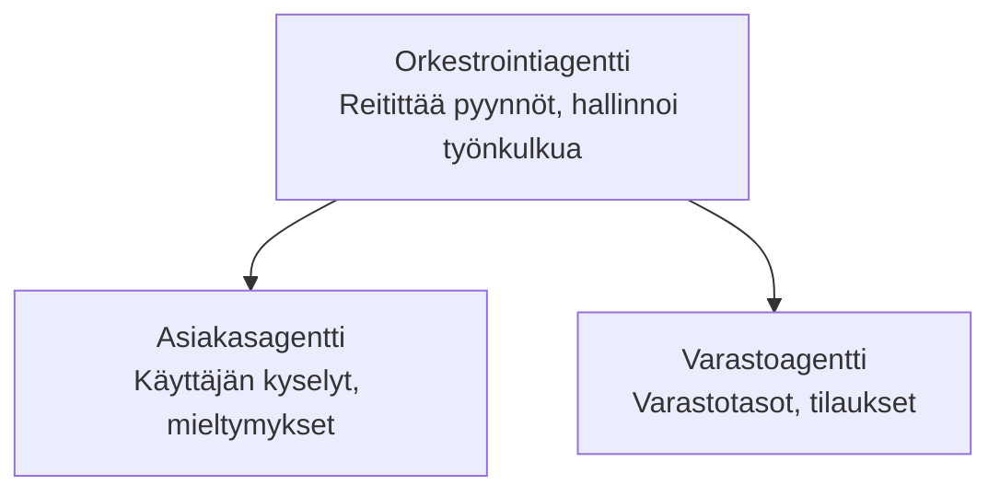

# Luku 5: Moni-agenttiset tekoälyratkaisut

**📚 Kurssi**: [AZD Aloittelijoille](../../README.md) | **⏱️ Kesto**: 2–3 tuntia | **⭐ Monimutkaisuus**: Edistynyt

---

## Yleiskatsaus

Tämä luku käsittelee edistyneitä moni-agenttiarkkitehtuurimalleja, agenttien orkestrointia ja tuotantovalmiita tekoälykäyttöönottoja monimutkaisiin skenaarioihin.

> Varmennettu `azd 1.25.6`:lla kesäkuussa 2026.

## Oppimistavoitteet

Suoritettuasi tämän luvun osaat:
- Ymmärtää moni-agenttiarkkitehtuurimalleja
- Ottaa käyttöön koordinoituja tekoälyagenttijärjestelmiä
- Toteuttaa agenttien välistä viestintää
- Rakentaa tuotantovalmiita moni-agenttiratkaisuja

---

## 📚 Oppitunnit

| # | Oppitunti | Kuvaus | Aika |
|---|--------|-------------|------|
| 1 | [Moni-agentin perusteet](multi-agent-basics.md) | Käytännön harjoitus: ota käyttöön toimiva moni-agenttisovellus komennolla `azd up` | 45 min |
| 2 | [Koordinointimallit](../chapter-06-pre-deployment/coordination-patterns.md) | Agenttien orkestrointistrategiat (jatkuu luvussa 6) | 30 min |
| 3 | [ARM-mallin käyttöönotto](../../examples/retail-multiagent-arm-template/README.md) | Yhden napsautuksen käyttöönottoesimerkki | 30 min |

> **Aloita Oppitunnista 1.** Se on ainoa täysin käytännönläheinen, käyttöön otettavissa oleva oppitunti tässä luvussa. Oppitunti 2 löytyy luvusta 6 (se on jaettu esivalmistelun kanssa), ja [Retail Multi-Agent Solution](../../examples/retail-scenario.md) on arkkitehtuuripiirros — suunnittelun viitemateriaali, ei yhden komennon mallipohja.

---

## 🚀 Nopea aloitus

```bash
# Vaihtoehto 1: Ota käyttöön mallista
azd init --template agent-openai-python-prompty
azd up

# Vaihtoehto 2: Ota käyttöön agentin manifestista (vaatii azure.ai.agents-laajennuksen)
azd extension install azure.ai.agents
azd ai agent init -m agent-manifest.yaml
azd up
```

> **Mikä lähestymistapa?** Käytä `azd init --template` aloittaaksesi toimivasta esimerkistä. Käytä `azd ai agent init` kun sinulla on oma agenttimanifesti. Katso täydelliset tiedot [AZD AI CLI -viitteestä](../chapter-08-production/production-ai-practices.md#azd-ai-cli-commands-and-extensions).

---

## 🤖 Moni-agenttiarkkitehtuuri



---

## 🎯 Esitelty ratkaisu: Vähittäiskaupan moni-agenttiratkaisu

The [Retail Multi-Agent Solution](../../examples/retail-scenario.md) esittelee:

- **Customer Agent**: Käsittelee käyttäjävuorovaikutuksia ja mieltymyksiä
- **Inventory Agent**: Hallinnoi varastoa ja tilausten käsittelyä
- **Orchestrator**: Koordinoi agenttien välistä toimintaa
- **Shared Memory**: Agenttien välinen kontekstinhallinta

### Käytetyt palvelut

| Service | Purpose |
|---------|---------|
| Microsoft Foundry Models | Kielen ymmärrys |
| Azure AI Search | Tuotekatalogi |
| Cosmos DB | Agentin tila ja muisti |
| Container Apps | Agenttien isännöinti |
| Application Insights | Seuranta |

---

## 🔗 Navigointi

| Direction | Chapter |
|-----------|---------|
| **Previous** | [Luku 4: Infrastruktuuri](../chapter-04-infrastructure/README.md) |
| **Next** | [Luku 6: Esivalmistelu](../chapter-06-pre-deployment/README.md) |

---

## 📖 Aiheeseen liittyvät resurssit

- [AI-agenttien opas](../chapter-02-ai-development/agents.md)
- [Tuotannon tekoälykäytännöt](../chapter-08-production/production-ai-practices.md)
- [Tekoälyn vianetsintä](../chapter-07-troubleshooting/ai-troubleshooting.md)

---

<!-- CO-OP TRANSLATOR DISCLAIMER START -->
**Vastuuvapauslauseke**:
Tämä asiakirja on käännetty käyttämällä tekoälypohjaista käännöspalvelua [Co-op Translator](https://github.com/Azure/co-op-translator). Vaikka pyrimme tarkkuuteen, otathan huomioon, että automaattiset käännökset saattavat sisältää virheitä tai epätarkkuuksia. Alkuperäinen asiakirja sen alkuperäiskielellä on virallinen lähde. Tärkeissä asioissa suositellaan ammattimaista ihmiskäännöstä. Emme ole vastuussa tämän käännöksen käytöstä aiheutuvista väärinymmärryksistä tai tulkinnoista.
<!-- CO-OP TRANSLATOR DISCLAIMER END -->