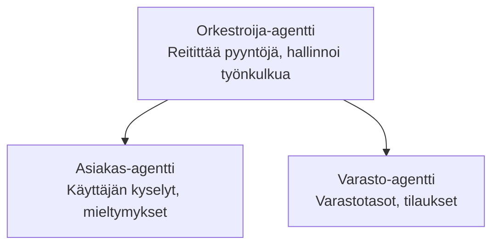

# Chapter 5: Multi-Agent AI Solutions

**📚 Kurssi**: [AZD Aloittelijoille](../../README.md) | **⏱️ Kesto**: 2-3 tuntia | **⭐ Vaativuus**: Edistynyt

---

## Overview

This chapter covers advanced multi-agent architecture patterns, agent orchestration, and production-ready AI deployments for complex scenarios.

> Validated against `azd 1.23.12` in March 2026.

## Learning Objectives

By completing this chapter, you will:
- Understand multi-agent architecture patterns
- Deploy coordinated AI agent systems
- Implement agent-to-agent communication
- Build production-ready multi-agent solutions

---

## 📚 Lessons

| # | Lesson | Description | Time |
|---|--------|-------------|------|
| 1 | [Retail Multi-Agent Solution](../../examples/retail-scenario.md) | Complete implementation walkthrough | 90 min |
| 2 | [Coordination Patterns](../chapter-06-pre-deployment/coordination-patterns.md) | Agent orchestration strategies | 30 min |
| 3 | [ARM Template Deployment](../../examples/retail-multiagent-arm-template/README.md) | One-click deployment | 30 min |

---

## 🚀 Quick Start

```bash
# Vaihtoehto 1: Ota käyttöön mallista
azd init --template agent-openai-python-prompty
azd up

# Vaihtoehto 2: Ota käyttöön agentin manifestista (vaatii azure.ai.agents-laajennuksen)
azd extension install azure.ai.agents
azd ai agent init -m agent-manifest.yaml
azd up
```

> **Mikä lähestymistapa?** Use `azd init --template` to start from a working sample. Use `azd ai agent init` when you have your own agent manifest. Katso lisätietoja [AZD AI CLI -viitteestä](../chapter-08-production/production-ai-practices.md#azd-ai-cli-commands-and-extensions).

---

## 🤖 Multi-Agent Architecture


---

## 🎯 Esitelty ratkaisu: Vähittäiskaupan moni-agenttiratkaisu

The [Vähittäiskaupan moni-agenttiratkaisu](../../examples/retail-scenario.md) demonstrates:

- **Asiakasagentti**: Käsittelee käyttäjävuorovaikutuksia ja mieltymyksiä
- **Varastoagentti**: Hallinnoi varastoa ja tilausten käsittelyä
- **Orkestroija**: Koordinoi agenttien toimintaa
- **Jaettu muisti**: Agenttien välinen kontekstinhallinta

### Services Used

| Service | Purpose |
|---------|---------|
| Microsoft Foundry Models | Kielen ymmärtäminen |
| Azure AI Search | Tuotekatalogi |
| Cosmos DB | Agentin tila ja muisti |
| Container Apps | Agenttien isännöinti |
| Application Insights | Seuranta |

---

## 🔗 Navigation

| Direction | Chapter |
|-----------|---------|
| **Previous** | [Luku 4: Infrastructure](../chapter-04-infrastructure/README.md) |
| **Next** | [Luku 6: Ennen käyttöönottoa](../chapter-06-pre-deployment/README.md) |

---

## 📖 Related Resources

- [AI Agents Guide](../chapter-02-ai-development/agents.md)
- [Production AI Practices](../chapter-08-production/production-ai-practices.md)
- [AI Troubleshooting](../chapter-07-troubleshooting/ai-troubleshooting.md)

---

<!-- CO-OP TRANSLATOR DISCLAIMER START -->
**Vastuuvapauslauseke**:
Tämä asiakirja on käännetty käyttäen tekoälypohjaista käännöspalvelua [Co-op Translator](https://github.com/Azure/co-op-translator). Vaikka pyrimme tarkkuuteen, huomioithan, että automatisoiduissa käännöksissä saattaa esiintyä virheitä tai epätarkkuuksia. Alkuperäistä asiakirjaa sen alkuperäiskielellä tulee pitää ensisijaisena lähteenä. Kriittisten tietojen kohdalla suositellaan ammattimaista ihmiskäännöstä. Emme ole vastuussa mistään tämän käännöksen käytöstä johtuvista väärinymmärryksistä tai virhetulkinnoista.
<!-- CO-OP TRANSLATOR DISCLAIMER END -->