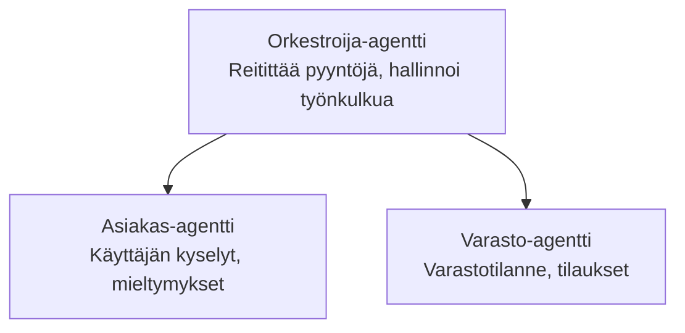

# Luku 5: Moni-agenttiset tekoälyratkaisut

**📚 Kurssi**: [AZD aloittelijoille](../../README.md) | **⏱️ Kesto**: 2-3 tuntia | **⭐ Vaikeustaso**: Edistynyt

---

## Yleiskatsaus

Tässä luvussa käsitellään edistyneitä moni-agenttiarkkitehtuurimalleja, agenttien orkestrointia ja tuotantovalmiita tekoälykäyttöönottoja monimutkaisiin skenaarioihin.

## Oppimistavoitteet

Tämän luvun suorittamisen jälkeen:
- Ymmärrät moni-agenttiarkkitehtuurimallit
- Käyttöönotat koordinoituja tekoälyagenttijärjestelmiä
- Toteutat agenttien välistä viestintää
- Rakennat tuotantovalmiita moni-agenttiratkaisuja

---

## 📚 Oppitunnit

| # | Oppitunti | Kuvaus | Aika |
|---|--------|-------------|------|
| 1 | [Vähittäiskaupan moni-agenttiratkaisu](../../examples/retail-scenario.md) | Täydellinen toteutuksen läpikäynti | 90 min |
| 2 | [Koordinointimallit](../chapter-06-pre-deployment/coordination-patterns.md) | Agenttien orkestrointistrategiat | 30 min |
| 3 | [ARM-mallin käyttöönotto](../../examples/retail-multiagent-arm-template/README.md) | Yhden napsautuksen käyttöönotto | 30 min |

---

## 🚀 Nopea aloitus

```bash
# Vaihtoehto 1: Ota käyttöön mallista
azd init --template agent-openai-python-prompty
azd up

# Vaihtoehto 2: Ota käyttöön agentin manifestista (vaatii azure.ai.agents-laajennuksen)
azd extension install azure.ai.agents
azd ai agent init -m agent-manifest.yaml
azd up
```

> **Mikä lähestymistapa?** Käytä `azd init --template` aloittaaksesi toimivasta esimerkistä. Käytä `azd ai agent init` kun sinulla on oma agenttimanifesti. Katso [AZD AI CLI -viite](../chapter-08-production/production-ai-practices.md#azd-ai-cli-commands-and-extensions) saadaksesi täydelliset tiedot.

---

## 🤖 Moni-agenttinen arkkitehtuuri


---

## 🎯 Esittelyratkaisu: Vähittäiskaupan moni-agentti

The [Retail Multi-Agent Solution](../../examples/retail-scenario.md) demonstrates:

- **Asiakasagentti**: Käsittelee käyttäjävuorovaikutuksia ja mieltymyksiä
- **Varastoagentti**: Hallinnoi varastoa ja tilausten käsittelyä
- **Orkestroija**: Koordinoi agenttien välillä
- **Yhteinen muisti**: Agenttien välinen kontekstinhallinta

### Käytetyt palvelut

| Palvelu | Tarkoitus |
|---------|---------|
| Microsoft Foundry Models | Kielen ymmärrys |
| Azure AI Search | Tuotekatalogi |
| Cosmos DB | Agentin tila ja muisti |
| Container Apps | Agenttien isännöinti |
| Application Insights | Valvonta |

---

## 🔗 Navigointi

| Suunta | Luku |
|-----------|---------|
| **Edellinen** | [Luku 4: Infrastruktuuri](../chapter-04-infrastructure/README.md) |
| **Seuraava** | [Luku 6: Ennen käyttöönottoa](../chapter-06-pre-deployment/README.md) |

---

## 📖 Aiheeseen liittyvät resurssit

- [AI-agenttien opas](../chapter-02-ai-development/agents.md)
- [Tuotantotason AI-käytännöt](../chapter-08-production/production-ai-practices.md)
- [AI-vianmääritys](../chapter-07-troubleshooting/ai-troubleshooting.md)

---

<!-- CO-OP TRANSLATOR DISCLAIMER START -->
**Disclaimer**:
Tämä asiakirja on käännetty tekoälykäännöspalvelulla [Co-op Translator](https://github.com/Azure/co-op-translator). Vaikka pyrimme tarkkuuteen, huomioithan, että automaattiset käännökset saattavat sisältää virheitä tai epätarkkuuksia. Alkuperäistä asiakirjaa sen alkuperäisellä kielellä on pidettävä virallisena lähteenä. Tärkeää tietoa varten suositellaan ammattimaista ihmiskäännöstä. Emme ole vastuussa tästä käännöksestä aiheutuvista väärinkäsityksistä tai virhetulkinnoista.
<!-- CO-OP TRANSLATOR DISCLAIMER END -->