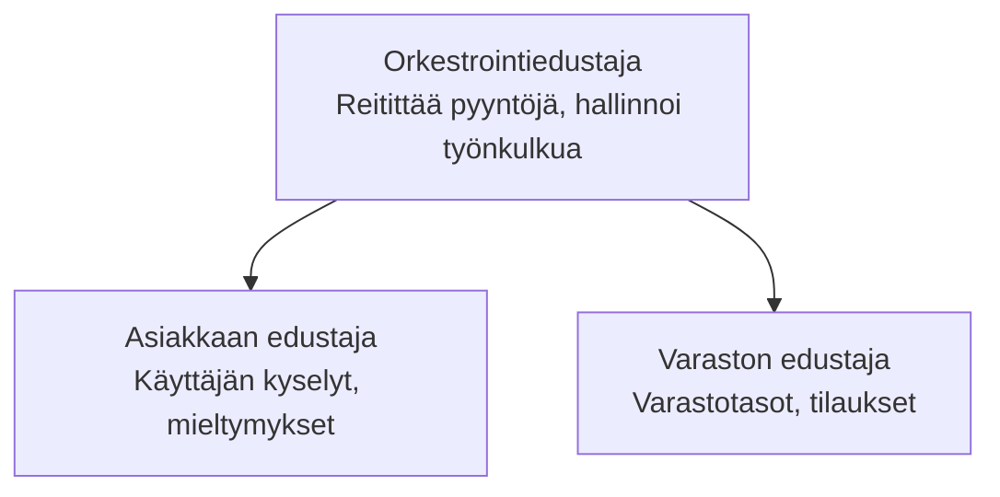

# Luku 5: Moniagenttiset tekoälyratkaisut

**📚 Kurssi**: [AZD Aloittelijoille](../../README.md) | **⏱️ Kesto**: 2-3 tuntia | **⭐ Vaativuus**: Edistynyt

---

## Yleiskatsaus

Tässä luvussa käsitellään edistyneitä moniagenttisen arkkitehtuurin malleja, agenttien orkestrointia sekä tuotantovalmiita tekoälykäyttöönottoja monimutkaisiin tilanteisiin.

> Vahvistettu `azd 1.27.1` -version kanssa heinäkuussa 2026.

## Oppimistavoitteet

Tässä luvussa opit:
- Ymmärtämään moniagenttisen arkkitehtuurin malleja
- Ottaamaan käyttöön koordinoituja tekoälyagenttijärjestelmiä
- Toteuttamaan agenttien välistä viestintää
- Rakentamaan tuotantovalmiita moniagenttiratkaisuja

---

## 📚 Oppitunnit

| # | Oppitunti | Kuvaus | Aika |
|---|--------|-------------|------|
| 1 | [Moniagentin perusteet](multi-agent-basics.md) | Käytännössä: ota käyttöön toimiva moniagenttisovellus komennolla `azd up` | 45 min |
| 2 | [Koordinointimallit](../chapter-06-pre-deployment/coordination-patterns.md) | Agenttien orkestrointistrategiat (jatkuu luvussa 6) | 30 min |
| 3 | [ARM-mallipohjan käyttöönotto](../../examples/retail-multiagent-arm-template/README.md) | Yhden klikkauksen käyttöönottoesimerkki | 30 min |

> **Aloita oppitunnista 1.** Se on ainoa täysin käytännönläheinen ja käyttöön otettava oppitunti tässä luvussa. Oppitunti 2 on luvussa 6 (jaettu alustavan käyttöönoton suunnittelun kanssa), ja [Retail Multi-Agent Solution](../../examples/retail-scenario.md) on arkkitehtuurin suunnittelumalli — suunnittelun viite, ei yhdellä komennolla käytettävä malli.

---

## 🚀 Aloita nopeasti

```bash
# Vaihtoehto 1: Ota käyttöön mallipohjasta
azd init --template agent-openai-python-prompty
azd up

# Vaihtoehto 2: Ota käyttöön agentin manifestista (vaatii azure.ai.agents-laajennuksen)
azd extension install azure.ai.agents
azd ai agent init -m agent-manifest.yaml
azd up
```

> **Mikä lähestymistapa?** Käytä `azd init --template` aloittaaksesi toimivasta esimerkistä. Käytä `azd ai agent init` kun sinulla on oma agenttimentiteetti. Katso [AZD AI CLI -viite](../chapter-08-production/production-ai-practices.md#azd-ai-cli-commands-and-extensions) saadaksesi täydelliset tiedot.

---

## 🤖 Moniagenttinen arkkitehtuuri



---

## 🎯 Esitelty ratkaisu: Retail Multi-Agent

[Retail Multi-Agent Solution](../../examples/retail-scenario.md) osoittaa:

- **Asiakasagentti**: Käsittelee käyttäjän vuorovaikutuksen ja mieltymykset
- **Varastoagentti**: Hallinnoi varastoa ja tilausten käsittelyä
- **Orkestroija**: Koordinoi agenttien toimintaa
- **Jaettu Muisti**: Agenttien välinen kontekstinhallinta

### Käytetyt palvelut

| Palvelu | Tarkoitus |
|---------|---------|
| Microsoft Foundry Models | Kielen ymmärtäminen |
| Azure AI Search | Tuotekatalogi |
| Cosmos DB | Agentin tila ja muisti |
| Container Apps | Agentin hosting |
| Application Insights | Monitorointi |

---

## 🔗 Navigointi

| Suunta | Luku |
|-----------|---------|
| **Edellinen** | [Luku 4: Infrastruktuuri](../chapter-04-infrastructure/README.md) |
| **Seuraava** | [Luku 6: Esikattelu](../chapter-06-pre-deployment/README.md) |

---

## 📖 Aiheeseen liittyvät resurssit

- [Tekoälyagenttien opas](../chapter-02-ai-development/agents.md)
- [Tuotannon tekoälykäytännöt](../chapter-08-production/production-ai-practices.md)
- [Tekoälyn vianmääritys](../chapter-07-troubleshooting/ai-troubleshooting.md)

---

<!-- CO-OP TRANSLATOR DISCLAIMER START -->
**Vastuuvapauslauseke**:
Tämä asiakirja on käännetty käyttämällä tekoälypohjaista käännöspalvelua [Co-op Translator](https://github.com/Azure/co-op-translator). Vaikka pyrimme tarkkuuteen, otathan huomioon, että automaattiset käännökset saattavat sisältää virheitä tai epätarkkuuksia. Alkuperäinen asiakirja sen alkuperäiskielellä on virallinen lähde. Tärkeissä asioissa suositellaan ammattimaista ihmiskäännöstä. Emme ole vastuussa tämän käännöksen käytöstä aiheutuvista väärinymmärryksistä tai tulkinnoista.
<!-- CO-OP TRANSLATOR DISCLAIMER END -->