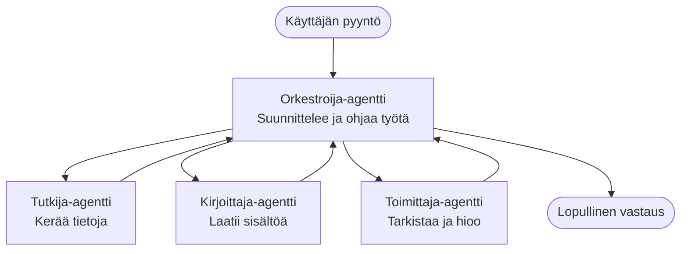

# Moni-agenttijärjestelmän perusteet – Ota käyttöön ensimmäinen koordinoitu tekoälyjärjestelmäsi

**Luvun navigointi:**
- **📚 Kurssin aloitus**: [AZD aloittelijoille](../../README.md)
- **📖 Nykyinen luku**: Luku 5 – Moni-agenttinen tekoälyratkaisu
- **⬅️ Edellinen**: [Luku 4: Infrastruktuuri](../chapter-04-infrastructure/README.md)
- **➡️ Seuraava**: [Koordinointimallit](../chapter-06-pre-deployment/coordination-patterns.md)

> Vahvistettu `azd 1.27.1`:llä heinäkuussa 2026.

## Johdanto

Aiemmissa luvuissa otit käyttöön yhden sovelluksen – ja luvussa 2 otit käyttöön yhden tekoälyagentin. Tässä oppitunnissa siirrytään seuraavaan vaiheeseen: otetaan käyttöön **moni-agenttijärjestelmä**, jossa useat erikoistuneet agentit työskentelevät yhdessä ratkaistakseen ongelman, jota yksittäinen agentti ei pystyisi hyvin hoitamaan yksin.

Hyvä uutinen aloittelijoille: **sinun ei tarvitse uusia komentoja.** Moni-agenttiratkaisu on silti azd-projekti. Suoritat `azd init`, `azd up`, testaat ja `azd down` – juuri samalla työnkululla, jonka jo tunnet. Muuttuu vain sovelluksen *muoto* sisällä.

## Oppimistavoitteet

Oppitunnin lopuksi osaat:
- Ymmärtää mitä "moni-agentti" tarkoittaa ja milloin se on lisäkomplikaation arvoinen
- Tunnistaa yleiset roolit moni-agenttijärjestelmässä (orkestroija + erikoistuneet)
- Ottaa käyttöön toimivan moni-agenttipohjan `azd up` -komennolla
- Ymmärtää Azure-resurssit, jotka tukevat moni-agenttisovellusta
- Tietää miten varmennat, räätälöit ja puret ratkaisun turvallisesti

## Oppimisen tulokset

Oppitunnin jälkeen osaat:
- Selittää eron yksittäisen agentin ja moni-agenttijärjestelmän välillä
- Valita yksittäisen työkaluin varustetun agentin ja aidon moni-agenttisuunnittelun välillä
- Ota moni-agenttipohja käyttöön ja testaa se kokonaan azd:llä
- Tunnistaa missä kukin agentti toimii ja miten ne kommunikoivat
- Siivota kaikki resurssit välttääksesi jatkuvat kustannukset

---

## Mikä on moni-agenttijärjestelmä?

Yksi tekoälyagentti on yksi malli tietojoukolla ja (vapaaehtoisesti) työkaluilla. Se toimii hyvin tarkoin rajatuissa tehtävissä. Mutta kun tehtävä kasvaa – tutkimuksesta kirjoittamiseen, sitten muokkaukseen ja tosiasioiden tarkistamiseen – kaiken sullominen yhteen kehotteeseen hidastaa agenttia, tekee siitä vähemmän luotettavan ja vaikeuttaa virheen etsimistä.

**Moni-agenttijärjestelmä** jakaa työn erikoistuneisiin osiin, joista kukin tekee yhden työn hyvin, orkestroijan koordinoimana:



### Kaksi roolia, jotka näet aina

| Rooli | Työ | Esimerkki |
|------|-----|---------|
| **Orkestroija** | Päätää *mitä seuraavaksi tapahtuu* ja ohjaa työtä agenttien välillä | "Ensin tutkimus, sitten kirjoitus, lopuksi muokkaus" |
| **Erikoistunut agentti** | Tekee yhden kohdennetun työn ja palauttaa tuloksen | Tutkija, joka kerää vain faktoja |

### Tarvitsetko oikeasti useita agentteja?

Aloita yksinkertaisesti. Ryhdy moni-agentiksi **vain** kun jokin näistä pätee:

- ✅ Tehtävässä on **selvät vaiheet**, jotka hyötyvät erilaisista ohjeista (tutkimus vs. kirjoitus vs. tarkastus)
- ✅ Haluat, että erikoistuneet agentit toimivat **samanaikaisesti** säästääksesi aikaa
- ✅ Eri vaiheissa tarvitaan **erilaisia työkaluja tai tietolähteitä**
- ✅ Jokaisen vaiheen pitää olla **itsenäisesti testattavissa ja virheenkorjattavissa**

Jos tehtävä on yksinkertainen kysymys-vastaus tai yksinkertainen työkalukutsu, **yksi agentti työkaluineen** (Luku 2) on yksinkertaisempi, edullisempi ja helpompi ottaa käyttöön.

> **Aloittelijan vinkki:** "Enemmän agenteja" ei tarkoita "parempaa". Jokainen agentti lisää viivettä, kustannuksia ja valvottavan kokonaisuuden. Lisää agentteja vain, kun ongelma selvästi jakautuu osiin.

---

## Kaksi tapaa rakentaa moni-agentti Azureen

| Lähestymistapa | Mitä se on | Parhaiten soveltuva |
|----------|-----------|----------|
| **Yksi agentti + työkalut** | Yksi Foundry-agentti, joka kutsuu funktioita/työkaluja | Yksinkertaiset työnkulut, aloittelu |
| **Useat koordinoidut agentit** | Useita agentteja orkestroijan kanssa | Selkeät vaiheet, samanaikainen työ, erikoistuminen |

Tämä oppitunti keskittyy toiseen lähestymistapaan käyttämällä **valmista pohjaa**, jotta voit nähdä toimivan moni-agenttijärjestelmän ennen oman rakentamista.

---

## Käytännössä: Ota käyttöön toimiva moni-agenttisovellus

Otamme käyttöön **Contoso Creative Writer** -esimerkin, joka on virallinen Azure-esimerkki, jossa useat agentit (tutkija, kirjoittaja, muokkaaja) työskentelevät yhdessä tuottaakseen artikkelin. Se on erinomainen ensimmäinen moni-agenttisovellus, koska roolit ovat helppo ymmärtää.

### Vaihe 1: Alusta pohja

```bash
# Luo työskentelykansio
mkdir creative-writer && cd creative-writer

# Alusta virallisesta moni-agenttipohjasta
azd init --template contoso-creative-writer
```

> Selaa lisää moni-agenttipohjia milloin tahansa [Awesome AZD AI -galleriassa](https://azure.github.io/awesome-azd/?tags=ai). Muita helposti aloitetettavia vaihtoehtoja ovat mm. `get-started-with-ai-agents` ja `azure-ai-travel-agents`.

### Vaihe 2: Todennus

```bash
# Vaaditaan azd-työnkuluille
azd auth login
```

### Vaihe 3: Luo ympäristö

```bash
azd env new dev
```

### Vaihe 4: Esikatselu ja käyttöönotto

```bash
# Katso mitä luodaan ennen kuin kulutat mitään (suositeltu)
azd provision --preview

# Tarjoa infrastruktuuri ja ota kaikki agentit käyttöön yhdessä vaiheessa
azd up
```

`azd up` pyytää tilauksen ja alueen, sitten provisionaa Azure-resurssit ja ottaa sovelluksen käyttöön. Tekoälyn käyttöönotot voivat kestää pidempään kuin yksinkertaisen web-sovelluksen – jos otat käyttöön suurempia malleja, voit pidentää käyttöönoton aikakatkaisua:

```bash
azd deploy --timeout 1800
```

> **Huomio kustannuksista ja kapasiteetista:** Moni-agenttisovellukset ottavat käyttöön tekoälymalleja, jotka kuluttavat kiintiötä ja aiheuttavat kustannuksia. Jos `azd up` epäonnistuu mallikiintiön takia, katso [AI-vianetsintä](../chapter-07-troubleshooting/ai-troubleshooting.md) alue- ja kiintiökorjauksia varten sekä luku 6 [Kapsiteettisuunnittelu](../chapter-06-pre-deployment/capacity-planning.md).

---

## Ymmärrä mitä otit käyttöön

Tämän kaltainen tyypillinen moni-agenttisovellus ottaa käyttöön joukon Azure-resursseja, jotka vastaavat suoraan yllä olevassa kaaviossa esitettyjä vastuuta:

| Resurssi | Miksi se on siellä |
|----------|----------------|
| **Microsoft Foundry / Mallit** | Isännöi kielimalleja, joita kukin agentti käyttää |
| **Azure AI Search** | Antaa tutkija-agentille pohjautuvaa dataa haettavaksi |
| **Container Apps** (tai App Service) | Isännöi orkestroijaa ja agenttikoodia |
| **Cosmos DB** (joissain esimerkeissä) | Tallentaa jaetun tilan/muistin, jota agentit käyttävät |
| **Application Insights** | Seuraa pyyntöjä *agenttien välillä* jotta voit virheenkorjata toimintaa |

### Miten agentit keskustelevat keskenään

Useimmissa azd moni-agenttiesimerkeissä **orkestroija toimii sovelluskoodissasi** (esim. Semantic Kernel -kehystä tai Microsoft Agent Frameworkia käyttäen). Orkestroija kutsuu kukin erikoistuneen agentin vuorollaan, välittää tulokset eteenpäin ja kokoaa lopullisen vastauksen. Agentit jakavat kontekstin seuraavilla tavoilla:

- **Funktio-/työkalukutsut** — orkestroija kutsuu erikoistunutta agenttia ja saa tuloksen takaisin
- **Jaettu muisti** — tietokanta (yleensä Cosmos DB) sisältää tilan, jota molemmat agentit voivat lukea
- **Viesti-/tapahtumat** — löyhemmässä kytkennässä agentit kommunikoivat jonon tai Service Busin kautta

> **Miksi tämä on tärkeää virheenkorjauksessa:** koska kukin vaihe on erillinen, Application Insights näyttää *mikä* agentti oli hidas tai epäonnistui. Tämä on tärkein syy jakaa työtä agenttien kesken.

---

## Varmista käyttöönotto

Varmista, että järjestelmä toimii ennen etenemistä:

```bash
# Näytä käyttöönotetut päätepisteet
azd show

# Avaa sovelluksen valvontapaneeli
azd monitor

# Seuraa lokeja, jos jokin vaikuttaa oudolta
azd monitor --logs
```

Avaa sitten sovelluksen URL-osoite `azd show` -komennolla ja tee pyyntö, joka käyttää kaikkia agenteja (Creative Writerille pyydä kirjoittamaan lyhyt artikkeli aiheesta). Application Insightsin **transaction search** näyttää pyynnön jakautuvan tutkijan, kirjoittajan ja muokkaajan vaiheisiin.

**Onnistumiskriteerit:**
- ✅ `azd show` näyttää saavutettavan päätepisteen
- ✅ Pyyntö tuottaa tuloksen, joka käy selvästi läpi useita vaiheita
- ✅ Application Insights näyttää jäljitteen useammasta kuin yhdestä agenttivaiheesta

---

## Mukauta: Lisää tai säädä agenttia

Koska kukin agentti on pelkät ohjeet plus työkalut, muokkaaminen on lähestyttävää:

1. **Etsi agenttien määritelmät** pohjasta (usein kansiot `prompts/`, `agents/` tai tiedostot `*.prompty`).
2. **Säädä agentin ohjeita** — esim. kerro muokkaajagentille, että sen pitää noudattaa tiettyä sävyä tai sanamäärää.
3. **Ottaa vain koodi uudelleen käyttöön** (infrastruktuuri pysyy samana):

   ```bash
   azd deploy
   ```

Edetäksesi pidemmälle ja rakentaaksesi agenteja *omista* manifesteistasi, käytä agenttilaajennusta ja sen täyttä elinkaarta:

```bash
azd extension install azure.ai.agents
azd ai agent init -m agent-manifest.yaml
azd up
azd ai agent invoke      # testi, vasteaikaan liittyen
```

Katso [luku 2: Agentit](../chapter-02-ai-development/agents.md) ja [AZD AI CLI -viite](../chapter-08-production/production-ai-practices.md#azd-ai-cli-commands-and-extensions) täydelle agenttien elinkaarelle (`invoke`, `eval generate`, `optimize`, `delete`).

---

## Siivoa

Moni-agenttijärjestelmät käyttävät useita laskutettavia palveluita. Pura kaikki, kun olet valmis:

```bash
azd down --force --purge
```

`--purge`-lipuke poistaa myös pehmeästi poistetut tekoälyresurssit (kuten Foundry/Azure AI Services -tilit), jotta ne eivät estä tulevaa uudelleenkäyttöönottoa eivätkä pidä yllä kuluja.

---

## Huomautus tuotantotason moni-agenttijärjestelmistä

Tässä repossa oleva [Retail Multi-Agent Solution](../../examples/retail-scenario.md) on **arkkitehtuurimalli**, ei yhden komennon pohja – se dokumentoi, miten tuotantotason vähittäiskauppajärjestelmä *rakennettaisiin* (ja kertoo suoraan, että täydellinen toteutus on merkittävä projekti). Käytä sitä suunnittelun viitteenä *sen jälkeen*, kun olet ottanut täältä käyttöön toimivan esimerkin. Tuotantohuolissa (kestävyys, kustannukset, valvonta, hallinto) siirry edelleen lukuun 8: [Tuotantotason tekoälykäytännöt](../chapter-08-production/production-ai-practices.md).

---

## Yhteenveto

- Moni-agenttijärjestelmä jakaa työn erikoistuneille agenteille orkestroijan johdolla.
- Käytä sitä vain, kun tehtävällä on selviä vaiheita, rinnakkaisuutta tai eri työkaluja joka vaiheessa – muuten käytä yhtä agenttia.
- azd:n työnkulku pysyy ennallaan: `azd init` → `azd up` → testaa → `azd down`.
- Aito pohja kuten `contoso-creative-writer` näyttää toimivan moni-agenttisovelluksen tänään, ja voit muokata sitä.
- Application Insightsin jäljitys agenttien välillä on yksi suurimmista käytännön hyödyistä moni-agenttisuunnittelussa.

---

## 🔗 Navigointi

| Suunta | Oppitunti |
|-----------|--------|
| **Edellinen** | [Luku 4: Infrastruktuuri](../chapter-04-infrastructure/README.md) |
| **Seuraava** | [Koordinointimallit](../chapter-06-pre-deployment/coordination-patterns.md) |

## 📖 Aiheeseen liittyviä resursseja

- [AI Agents Guide](../chapter-02-ai-development/agents.md)
- [Koordinointimallit](../chapter-06-pre-deployment/coordination-patterns.md)
- [Tuotantotason tekoälykäytännöt](../chapter-08-production/production-ai-practices.md)
- [AI-vianetsintä](../chapter-07-troubleshooting/ai-troubleshooting.md)

---

<!-- CO-OP TRANSLATOR DISCLAIMER START -->
**Vastuuvapauslauseke**:
Tämä asiakirja on käännetty käyttämällä tekoälypohjaista käännöspalvelua [Co-op Translator](https://github.com/Azure/co-op-translator). Vaikka pyrimme tarkkuuteen, otathan huomioon, että automaattiset käännökset saattavat sisältää virheitä tai epätarkkuuksia. Alkuperäinen asiakirja sen alkuperäiskielellä on virallinen lähde. Tärkeissä asioissa suositellaan ammattimaista ihmiskäännöstä. Emme ole vastuussa tämän käännöksen käytöstä aiheutuvista väärinymmärryksistä tai tulkinnoista.
<!-- CO-OP TRANSLATOR DISCLAIMER END -->