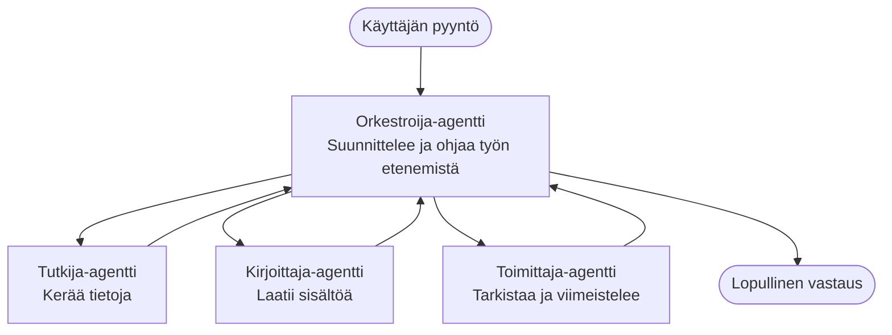

# Multi-Agent Basics - Deploy Your First Coordinated AI System

**Chapter Navigation:**
- **📚 Kurssin etusivu**: [AZD For Beginners](../../README.md)
- **📖 Nykyinen luku**: Luku 5 - Multi-Agent AI Solutions
- **⬅️ Edellinen**: [Chapter 4: Infrastructure](../chapter-04-infrastructure/README.md)
- **➡️ Seuraava**: [Coordination Patterns](../chapter-06-pre-deployment/coordination-patterns.md)

> Vahvistettu `azd 1.25.6` kanssa kesäkuussa 2026.

## Johdanto

Aikaisemmissa luvuissa otit käyttöön yhden sovelluksen — ja luvussa 2 puskit käyttöön yhden tekoälyagentin. Tässä oppitunnissa otetaan seuraava askel: otetaan käyttöön **moniagenttinen järjestelmä**, jossa useat erikoistuneet agentit työskentelevät yhdessä ratkaistakseen ongelman, jota yksittäinen agentti ei pystyisi hoitamaan yhtä hyvin.

Hyvä uutinen aloittelijoille: **et tarvitse uusia komentoja.** Moniagenttinen ratkaisu on edelleen azd-projekti. Suoritat `azd init`, `azd up`, testaat ja `azd down` — täsmälleen sama työnkulku kuin jo osaat. Muuttuu vain sovelluksen rakenne sisällä.

## Oppimistavoitteet

Tämän oppitunnin jälkeen osaat:
- Ymmärtää, mitä "moniagenttinen" tarkoittaa ja milloin lisäkompleksisuus kannattaa
- Tunnistaa yleiset roolit moniagenttisessa järjestelmässä (orkestroija + erikoisagentit)
- Ota käyttöön toimivan moniagenttimallin `azd up` -komennolla
- Ymmärtää Azure-resurssit, jotka tukevat moniagenttista sovellusta
- Tietää, miten tarkistaa, mukauttaa ja purkaa ratkaisu turvallisesti

## Oppimistulokset

Oppitunnin suorittamisen jälkeen pystyt:
- Selittämään eron yksittäisen agentin ja moniagenttisen järjestelmän välillä
- Valitsemaan yksittäisen agentin, jossa on työkalut, tai aidon moniagenttisen suunnittelun
- Ottaamaan käyttöön ja testaamaan moniagenttimallin päästä päähän azd:llä
- Tunnistamaan, missä kukin agentti ajetaan ja miten ne kommunikoivat
- Puhdistamaan kaikki resurssit välttääksesi jatkuvat kulut

---

## Mikä on moniagenttinen järjestelmä?

Yksi tekoälyagentti on yksi malli, jolla on joukko ohjeita ja (valinnaisesti) joitain työkaluja. Se toimii hyvin kohdennetuissa tehtävissä. Mutta kun tehtävä kasvaa — tutkimus, kirjoittaminen, muokkaus, faktantarkistus — kaiken pakkaaminen yhteen promptiin tekee agentista hitaamman, vähemmän luotettavan ja vaikeamman virheenkorjauksessa.

Moniagenttinen järjestelmä jakaa työn erikoistuneisiin agentteihin, jotka tekevät kukin yhden tehtävän hyvin, orkestroijan koordinoimina:



### Kaksi roolia, joita näet aina

| Role | Job | Example |
|------|-----|---------|
| **Orchestrator** | Decides *what happens next* and routes work between agents | "First research, then write, then edit" |
| **Specialist** | Does one focused job and returns a result | A "researcher" that only gathers facts |

### Tarvitsetko todella useita agentteja?

Aloita yksinkertaisesti. Harkitse moniagenttista **vain** kun jokin seuraavista pitää paikkansa:

- ✅ Tehtävällä on **selkeästi erilliset vaiheet**, joista kukin hyötyy eri ohjeista (tutkimus vs. kirjoitus vs. tarkistus)
- ✅ Haluat erikoisagenttien ajavan **rinnakkain** ajan säästämiseksi
- ✅ Eri vaiheissa tarvitaan **eri työkaluja tai tietolähteitä**
- ✅ Tarvitset, että kukin vaihe on **itsenäisesti testattavissa ja virheenkorjattavissa**

Jos tehtävä on yksittäinen kysymys-vastaus tai yksinkertainen työkalukutsu, **yksi agentti työkaluilla** (luku 2) on yksinkertaisempi, halvempi ja helpompi käyttää.

> **Aloittelijan vinkki:** "Enemmän agentteja" ei ole sama kuin "parempi." Jokainen agentti lisää latenssia, kustannuksia ja valvottavaa kohdetta. Lisää agentteja vain jos ongelma jakautuu selkeästi osiin.

---

## Kaksi tapaa rakentaa moniagenttista Azuren päälle

| Approach | What it is | Best for |
|----------|-----------|----------|
| **Single agent + tools** | One Foundry agent that calls functions/tools | Simple workflows, getting started |
| **Multiple coordinated agents** | Several agents with an orchestrator | Distinct stages, parallel work, specialization |

Tämä oppitunti keskittyy toiseen lähestymistapaan käyttämällä **valmista mallia**, jotta voit nähdä toimivan moniagenttisen järjestelmän ennen oman rakentamista.

---

## Käytännön: Ota käyttöön toimiva moniagenttinen sovellus

Otamme käyttöön **Contoso Creative Writer**, virallinen Azure-esimerkki, joka käyttää useita agentteja (tutkija, kirjoittaja, toimittaja) koordinoituna artikkelin tuottamiseksi. Se on loistava ensimmäinen moniagenttinen sovellus, koska roolit ovat helppoja ymmärtää.

### Vaihe 1: Alusta malli

```bash
# Luo työskentelykansio
mkdir creative-writer && cd creative-writer

# Alusta virallisesta moniagenttipohjasta
azd init --template contoso-creative-writer
```

> Selaa lisää moniagenttimalleja milloin tahansa [Awesome AZD AI gallery](https://azure.github.io/awesome-azd/?tags=ai). Muita aloittelijaystävällisiä vaihtoehtoja ovat `get-started-with-ai-agents` ja `azure-ai-travel-agents`.

### Vaihe 2: Todennus

```bash
# Tarvitaan azd-työnkuluille
azd auth login
```

### Vaihe 3: Luo ympäristö

```bash
azd env new dev
```

### Vaihe 4: Esikatselu, sitten käyttöönotto

```bash
# Katso, mitä luodaan ennen kuin käytät mitään (suositeltavaa)
azd provision --preview

# Pystytä infrastruktuuri ja ota kaikki agentit käyttöön yhdellä kertaa
azd up
```

`azd up` kysyy tilauksesta ja alueesta, sitten provisioi Azure-resurssit ja ottaa sovelluksen käyttöön. AI-käyttöönotot voivat kestää pidempään kuin yksinkertaisen web-sovelluksen — jos otat käyttöön suurempia malleja, voit pidentää käyttöönoton aikakatkaisua:

```bash
azd deploy --timeout 1800
```

> **Huomio kustannuksista ja kapasiteetista:** Moniagenttiset sovellukset ottavat käyttöön AI-malleja, jotka kuluttavat kiintiötä ja aiheuttavat kustannuksia. Jos `azd up` epäonnistuu mallikiintiön vuoksi, katso [AI Troubleshooting](../chapter-07-troubleshooting/ai-troubleshooting.md) alue- ja kiintiöratkaisuja, sekä luku 6 [Capacity Planning](../chapter-06-pre-deployment/capacity-planning.md).

---

## Mitä otit käyttöön — ymmärrys

Tyypillinen moniagenttinen sovellus varaa joukon Azure-resursseja, jotka vastaavat diagrammin vastuita:

| Resource | Why it's there |
|----------|----------------|
| **Microsoft Foundry / Models** | Hosts the language models each agent uses |
| **Azure AI Search** | Gives the researcher agent grounded data to search |
| **Container Apps** (or App Service) | Hosts the orchestrator and agent code |
| **Cosmos DB** (in some samples) | Stores shared state/memory passed between agents |
| **Application Insights** | Traces requests *across* agents so you can debug the flow |

### Miten agentit keskustelevat keskenään

Useimmissa azd-moniedustajamalleissa **orkestroija ajetaan sovelluskoodissasi** (esimerkiksi käyttämällä kehystä kuten Semantic Kernel tai Microsoft Agent Framework). Orkestroija kutsuu kutakin erikoisagenttia vuorotellen, välittää tulokset eteenpäin ja kokoaa lopullisen vastauksen. Agentit jakavat kontekstia seuraavilla tavoilla:

- **Funktio-/työkalukutsut** — orkestroija kutsuu erikoisagenttia ja saa tuloksen takaisin
- **Jaettu muisti** — tietokanta (usein Cosmos DB) tallentaa tilan, jota molemmat agentit voivat lukea
- **Viestit/tapahtumat** — löyhemmässä kytkennässä agentit kommunikoivat jonon tai Service Busin kautta

> **Miksi tämä on tärkeää virheenkorjauksessa:** koska kukin vaihe on erillinen, Application Insights näyttää *mikä* agentti oli hidas tai epäonnistui. Se on merkittävä syy jakaa työ agenttien kesken.

---

## Varmista käyttöönotto

Varmista järjestelmän toimivuus ennen jatkamista:

```bash
# Näytä käyttöön otetut päätepisteet
azd show

# Avaa sovelluksen valvontapaneeli
azd monitor

# Seuraa lokeja, jos jokin vaikuttaa olevan pielessä
azd monitor --logs
```

Sitten avaa sovelluksen URL-osoite `azd show` -komennolla ja tee pyyntö, joka käyttää kaikkia agentteja (Creative Writerillä pyydä kirjoittamaan lyhyt artikkeli aiheesta). Application Insightsin **transaction search** -näkymässä sinun tulisi nähdä pyyntö, joka hajaantuu tutkija-, kirjoittaja- ja toimittajavaiheisiin.

**Onnistumiskriteerit:**
- ✅ `azd show` listaa saavutettavan päätepisteen
- ✅ Pyyntö tuottaa tuloksen, joka selvästi kulki useamman vaiheen läpi
- ✅ Application Insights näyttää jäljityksiä enemmän kuin yhdeltä agenttivaiheelta

---

## Mukauta: Lisää tai säädä agenttia

Koska kukin agentti on vain ohjeita plus työkaluja, mukauttaminen on lähestyttävää:

1. **Etsi mallin agenttimäärittelyt** (usein `prompts/`, `agents/` tai `*.prompty` -tiedostot).
2. **Säädä agentin ohjeita** — esimerkiksi kerro toimittaja-agentille noudatettavaksi tiettyä sävyä tai sanamäärää.
3. **Ota uudelleen käyttöön vain koodi** (infrastruktuuri pysyy muuttumattomana):

   ```bash
   azd deploy
   ```

Jos haluat edetä ja rakentaa agentteja omasta manifestistasi, käytä agenttilisäosaa ja sen täyttä elinkaarta:

```bash
azd extension install azure.ai.agents
azd ai agent init -m agent-manifest.yaml
azd up
azd ai agent invoke      # testi, vastauksen ajoitus
```

Katso [Luku 2: Agentit](../chapter-02-ai-development/agents.md) ja [AZD AI CLI -viite](../chapter-08-production/production-ai-practices.md#azd-ai-cli-commands-and-extensions) täydellisestä agenttien elinkaaresta (`invoke`, `eval generate`, `optimize`, `delete`).

---

## Siivoaminen

Moniagenttiset sovellukset ajavat useita laskutettavia palveluja. Purka kaikki kun olet valmis:

```bash
azd down --force --purge
```

`--purge`-lipuke poistaa myös pehmeästi poistetut AI-resurssit (kuten Foundry/Azure AI Services -tilit), jotta ne eivät estä tulevaa uudelleenasennusta tai aiheuta kustannuksia.

---

## Huomautus tuotantokäytön moniagenttisista järjestelmistä

[Retail Multi-Agent Solution](../../examples/retail-scenario.md) tässä repossa on **arkkitehtuurisuunnitelma**, ei yksinkertainen yhdellä komennolla käyttöönotettava malli — se dokumentoi, miten tuotantotason vähittäiskaupan järjestelmä *rakennettaisiin* (ja mainitsee, että täydellinen rakentaminen on mittava ponnistus). Käytä sitä suunnittelureferenssinä *sen jälkeen*, kun olet ottanut toimivan esimerkin käyttöön täällä. Tuotantoon liittyvistä asioista (resilienssi, kustannukset, monitorointi, hallinnointi) jatka [Lukuun 8: Production AI Practices](../chapter-08-production/production-ai-practices.md).

---

## Yhteenveto

- Moniagenttinen järjestelmä jakaa työn erikoistuneiden agenttien kesken orkestroijan koordinoimana.
- Käytä sitä vain, kun tehtävällä on erillisiä vaiheita, rinnakkain ajamista tai eri työkaluja vaiheissa — muuten suosittelemme yhtä agenttia.
- azd-työnkulku on muuttumaton: `azd init` → `azd up` → testaus → `azd down`.
- Todellinen malli kuten `contoso-creative-writer` antaa mahdollisuuden nähdä ja mukauttaa toimiva moniagenttinen sovellus heti.
- Application Insightsin jäljitys agenttien yli on yksi käytännön suurimmista eduista moniagenttisessa suunnittelussa.

---

## 🔗 Navigointi

| Direction | Lesson |
|-----------|--------|
| **Edellinen** | [Chapter 4: Infrastructure](../chapter-04-infrastructure/README.md) |
| **Seuraava** | [Coordination Patterns](../chapter-06-pre-deployment/coordination-patterns.md) |

## 📖 Aiheeseen liittyvät resurssit

- [Tekoälyagenttien opas](../chapter-02-ai-development/agents.md)
- [Koordinointimallit](../chapter-06-pre-deployment/coordination-patterns.md)
- [Tuotannon tekoälykäytännöt](../chapter-08-production/production-ai-practices.md)
- [Tekoälyn vianmääritys](../chapter-07-troubleshooting/ai-troubleshooting.md)

---

<!-- CO-OP TRANSLATOR DISCLAIMER START -->
**Vastuuvapauslauseke**:
Tämä asiakirja on käännetty käyttämällä tekoälypohjaista käännöspalvelua [Co-op Translator](https://github.com/Azure/co-op-translator). Vaikka pyrimme tarkkuuteen, otathan huomioon, että automaattiset käännökset saattavat sisältää virheitä tai epätarkkuuksia. Alkuperäinen asiakirja sen alkuperäiskielellä on virallinen lähde. Tärkeissä asioissa suositellaan ammattimaista ihmiskäännöstä. Emme ole vastuussa tämän käännöksen käytöstä aiheutuvista väärinymmärryksistä tai tulkinnoista.
<!-- CO-OP TRANSLATOR DISCLAIMER END -->