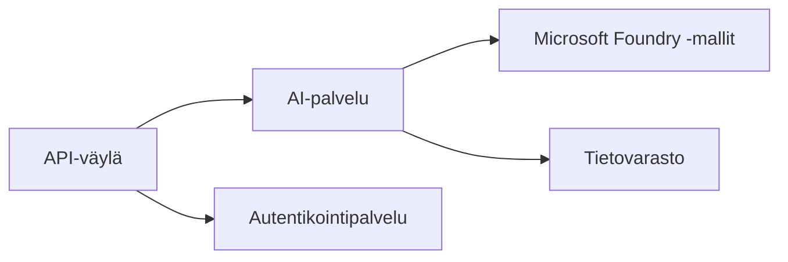
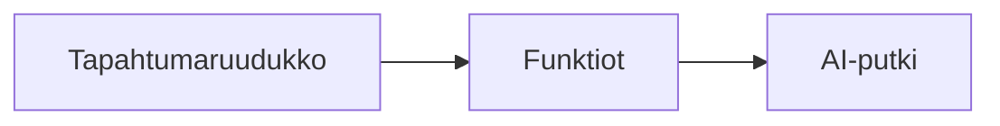

# Luku 8: Tuotanto- ja yritysmallit

**📚 Kurssi**: [AZD Aloittelijoille](../../README.md) | **⏱️ Kesto**: 2-3 tuntia | **⭐ Vaativuus**: Edistynyt

---

## Yleiskatsaus

Tässä luvussa käsitellään yritysvalmiita käyttöönotto-malleja, tietoturvan vahvistamista, valvontaa sekä kustannusten optimointia tuotannon tekoälytyökuormille.

> Vahvistettu `azd 1.27.1`:llä heinäkuussa 2026.

## Oppimistavoitteet

Kun olet suorittanut tämän luvun, osaat:
- Ottaa käyttöön monialueiset vikasietoiset sovellukset
- Toteuttaa yritystason tietoturvamallit
- Konfiguroida kattava valvonta
- Optimoida kustannuksia laajassa mittakaavassa
- Määrittää CI/CD-putket AZD:llä

---

## 📚 Oppitunnit

| # | Oppitunti | Kuvaus | Kesto |
|---|--------|-------------|------|
| 1 | [Tuotannon tekoälykäytännöt](production-ai-practices.md) | Yritystason käyttöönotto-mallit | 90 min |

---

## 🚀 Tuotantotarkistuslista

- [ ] Monialueinen käyttöönotto vikasietoisuuteen
- [ ] Hallittu identiteetti todennukseen (ei avaimia)
- [ ] Application Insights valvontaan
- [ ] Kustannusbudjetit ja hälytykset määritetty
- [ ] Tietoturvaskannaus käytössä
- [ ] CI/CD-putken integrointi
- [ ] Varmuuskopiointisuunnitelma

---

## 🏗️ Arkkitehtuurimallit

### Malli 1: Mikroservice-pohjainen tekoäly



### Malli 2: Tapahtumapohjainen tekoäly



---

## 🔐 Tietoturvan parhaat käytännöt

```bicep
// Use managed identity
identity: {
  type: 'SystemAssigned'
}

// Private endpoints for AI services
properties: {
  publicNetworkAccess: 'Disabled'
  networkAcls: {
    defaultAction: 'Deny'
  }
}
```

---

## 💰 Kustannusten optimointi

| Strategia | Säästöt |
|----------|---------|
| Skaalaus nollaan (Container Apps) | 60-80% |
| Käytä kulutusperusteisia tasoja kehityksessä | 50-70% |
| Aikataulutettu skaalaus | 30-50% |
| Varattu kapasiteetti | 20-40% |

```bash
# Aseta budjettihälytykset
az consumption budget create \
  --budget-name "AI-Budget" \
  --amount 500 \
  --category Cost \
  --time-grain Monthly
```

---

## 📊 Valvonnan määritys

```bash
# Suoratoista lokit
azd monitor --logs

# Tarkista Application Insights
azd monitor --overview

# Näytä mittarit
az monitor metrics list --resource <resource-id>
```

---

## 🔗 Navigointi

| Suunta | Luku |
|-----------|---------|
| **Edellinen** | [Luku 7: Vianmääritys](../chapter-07-troubleshooting/README.md) |
| **Kurssi valmis** | [Kurssin etusivu](../../README.md) |

---

## 📖 Aiheeseen liittyvät materiaalit

- [Tekoälyagenttien opas](../chapter-02-ai-development/agents.md)
- [Application Insights](../chapter-06-pre-deployment/application-insights.md)
- [Moniagenttiratkaisut](../chapter-05-multi-agent/README.md)
- [Mikropalveluesimerkki](../../examples/microservices/README.md)

---

<!-- CO-OP TRANSLATOR DISCLAIMER START -->
**Vastuuvapauslauseke**:
Tämä asiakirja on käännetty käyttämällä tekoälypohjaista käännöspalvelua [Co-op Translator](https://github.com/Azure/co-op-translator). Vaikka pyrimme tarkkuuteen, otathan huomioon, että automaattiset käännökset saattavat sisältää virheitä tai epätarkkuuksia. Alkuperäinen asiakirja sen alkuperäiskielellä on virallinen lähde. Tärkeissä asioissa suositellaan ammattimaista ihmiskäännöstä. Emme ole vastuussa tämän käännöksen käytöstä aiheutuvista väärinymmärryksistä tai tulkinnoista.
<!-- CO-OP TRANSLATOR DISCLAIMER END -->