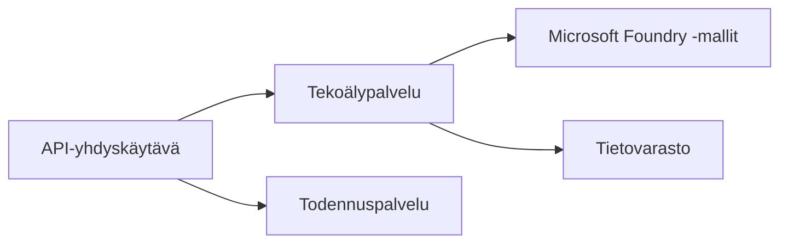
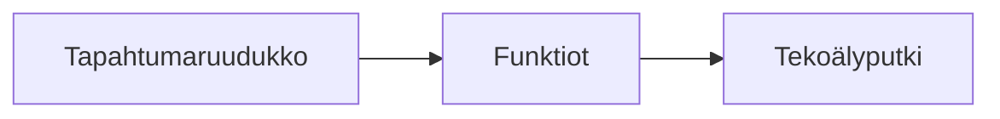

# Luku 8: Tuotanto- ja yritysmallit

**📚 Kurssi**: [AZD Aloittelijoille](../../README.md) | **⏱️ Kesto**: 2–3 tuntia | **⭐ Monimutkaisuus**: Edistynyt

---

## Yleiskatsaus

Tämä luku käsittelee yritystason käyttöönoton malleja, turvallisuuden koventamista, valvontaa ja kustannusten optimointia tuotannon tekoälykuormille.

## Oppimistavoitteet

Tämän luvun suorittamisen jälkeen osaat:
- Ota käyttöön monialueisia kestäviä sovelluksia
- Ota käyttöön yritystason turvallisuusmallit
- Määritä kattava valvonta
- Optimoi kustannukset laajassa mittakaavassa
- Ota käyttöön CI/CD-putkistot AZD:llä

---

## 📚 Oppitunnit

| # | Oppitunti | Kuvaus | Aika |
|---|--------|-------------|------|
| 1 | [Production AI Practices](production-ai-practices.md) | Yritystason käyttöönoton mallit | 90 min |

---

## 🚀 Tuotannon tarkistuslista

- [ ] Monialueinen käyttöönotto kestävyyttä varten
- [ ] Hallitut identiteetit todennusta varten (ei avaimia)
- [ ] Application Insights valvontaan
- [ ] Kustannusbudjetit ja hälytykset konfiguroitu
- [ ] Turvallisuusskannaus käytössä
- [ ] CI/CD-putkiston integrointi
- [ ] Kriisipalautussuunnitelma

---

## 🏗️ Arkkitehtuurimallit

### Malli 1: Mikropalveluinen tekoäly


### Malli 2: Tapahtumapohjainen tekoäly


---

## 🔐 Turvallisuuden parhaat käytännöt

```bicep
// Use managed identity
identity: {
  type: 'SystemAssigned'
}

// Private endpoints for AI services
properties: {
  publicNetworkAccess: 'Disabled'
  networkAcls: {
    defaultAction: 'Deny'
  }
}
```

---

## 💰 Kustannusten optimointi

| Strategia | Säästö |
|----------|---------|
| Skaalaa nollaan (Container Apps) | 60-80% |
| Käytä kulutuskerroksia kehityksessä | 50-70% |
| Aikataulutettu skaalaus | 30-50% |
| Varattu kapasiteetti | 20-40% |

```bash
# Aseta budjettihälytykset
az consumption budget create \
  --budget-name "AI-Budget" \
  --amount 500 \
  --category Cost \
  --time-grain Monthly
```

---

## 📊 Valvonnan asetukset

```bash
# Näytä lokit reaaliajassa
azd monitor --logs

# Tarkista Application Insights
azd monitor

# Näytä mittarit
az monitor metrics list --resource <resource-id>
```

---

## 🔗 Navigointi

| Suunta | Luku |
|-----------|---------|
| **Edellinen** | [Chapter 7: Troubleshooting](../chapter-07-troubleshooting/README.md) |
| **Kurssi valmis** | [Course Home](../../README.md) |

---

## 📖 Aiheeseen liittyvät resurssit

- [AI Agents Guide](../chapter-02-ai-development/agents.md)
- [Application Insights](../chapter-06-pre-deployment/application-insights.md)
- [Multi-Agent Solutions](../chapter-05-multi-agent/README.md)
- [Microservices Example](../../examples/microservices/README.md)

---

<!-- CO-OP TRANSLATOR DISCLAIMER START -->
**Vastuuvapauslauseke**:
Tämä asiakirja on käännetty käyttämällä tekoälykäännöspalvelua [Co-op Translator](https://github.com/Azure/co-op-translator). Vaikka pyrimme tarkkuuteen, huomioithan, että automatisoiduissa käännöksissä saattaa esiintyä virheitä tai epätarkkuuksia. Alkuperäistä asiakirjaa sen alkuperäisellä kielellä tulisi pitää määräävänä lähteenä. Tärkeissä asioissa suositellaan ammattimaista ihmiskäännöstä. Emme ole vastuussa tämän käännöksen käytöstä aiheutuvista väärinymmärryksistä tai virhetulkinnoista.
<!-- CO-OP TRANSLATOR DISCLAIMER END -->