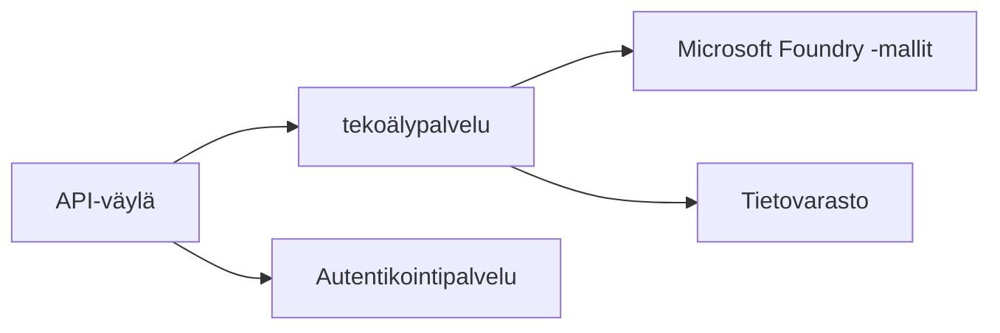
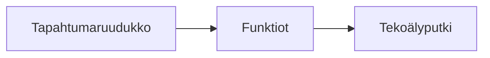

# Luku 8: Tuotanto- ja yritysmallit

**📚 Kurssi**: [AZD For Beginners](../../README.md) | **⏱️ Kesto**: 2–3 tuntia | **⭐ Vaikeustaso**: Edistynyt

---

## Yleiskatsaus

Tässä luvussa käsitellään yritystason käyttöön valmiita käyttöönotto‑malleja, turvallisuuden koventamista, valvontaa ja kustannusten optimointia tuotantotekoälykuormituksille.

> Varmennettu `azd 1.23.12`:lla maaliskuussa 2026.

## Oppimistavoitteet

Suorittamalla tämän luvun osaat:
- Ota käyttöön monialueisia (multi-region) resilientejä sovelluksia
- Toteuttaa yritystason turvallisuusmalleja
- Konfiguroida kattavan valvonnan
- Optimoida kustannuksia laajassa mittakaavassa
- Määrittää CI/CD‑putket AZD:llä

---

## 📚 Oppitunnit

| # | Oppitunti | Kuvaus | Aika |
|---|--------|-------------|------|
| 1 | [Tuotantotekoälyn käytännöt](production-ai-practices.md) | Yritystason käyttöönotto‑mallit | 90 min |

---

## 🚀 Tuotannon tarkistuslista

- [ ] Monialueinen käyttöönotto resiliencyä varten
- [ ] Hallittu identiteetti todennukseen (ei avaimia)
- [ ] Application Insights valvontaan
- [ ] Kustannusbudjetit ja hälytykset määritelty
- [ ] Turvallisuusskannaus käytössä
- [ ] CI/CD-putken integrointi
- [ ] Toipumissuunnitelma häiriötilanteissa

---

## 🏗️ Arkkitehtuurimallit

### Malli 1: Mikropalvelupohjainen tekoäly


### Malli 2: Tapahtumapohjainen tekoäly


---

## 🔐 Turvallisuuden parhaat käytännöt

```bicep
// Use managed identity
identity: {
  type: 'SystemAssigned'
}

// Private endpoints for AI services
properties: {
  publicNetworkAccess: 'Disabled'
  networkAcls: {
    defaultAction: 'Deny'
  }
}
```

---

## 💰 Kustannusten optimointi

| Strategy | Savings |
|----------|---------|
| Skaalaa nollaan (Container Apps) | 60-80% |
| Käytä kulutuskerroksia kehityksessä | 50-70% |
| Ajoitettu skaalaus | 30-50% |
| Varattu kapasiteetti | 20-40% |

```bash
# Aseta budjettihälytykset
az consumption budget create \
  --budget-name "AI-Budget" \
  --amount 500 \
  --category Cost \
  --time-grain Monthly
```

---

## 📊 Valvonnan asetukset

```bash
# Suoratoista lokit
azd monitor --logs

# Tarkista Application Insights
azd monitor --overview

# Näytä mittarit
az monitor metrics list --resource <resource-id>
```

---

## 🔗 Navigaatio

| Suunta | Luku |
|-----------|---------|
| **Edellinen** | [Luku 7: Vianmääritys](../chapter-07-troubleshooting/README.md) |
| **Kurssi valmis** | [Kurssin etusivu](../../README.md) |

---

## 📖 Aiheeseen liittyvät resurssit

- [Tekoälyagenttien opas](../chapter-02-ai-development/agents.md)
- [Application Insights](../chapter-06-pre-deployment/application-insights.md)
- [Moniagenttiratkaisut](../chapter-05-multi-agent/README.md)
- [Mikropalveluesimerkki](../../examples/microservices/README.md)

---

<!-- CO-OP TRANSLATOR DISCLAIMER START -->
**Vastuuvapauslauseke**:
Tämä asiakirja on käännetty tekoälykäännöspalvelulla [Co-op Translator](https://github.com/Azure/co-op-translator). Vaikka pyrimme tarkkuuteen, huomioithan, että automatisoiduissa käännöksissä saattaa esiintyä virheitä tai epätarkkuuksia. Alkuperäistä asiakirjaa sen alkuperäisellä kielellä tulisi pitää auktoritatiivisena lähteenä. Kriittisten tietojen osalta suositellaan ammattimaista ihmiskäännöstä. Emme ole vastuussa mahdollisista väärinymmärryksistä tai virheellisistä tulkinnoista, jotka johtuvat tämän käännöksen käytöstä.
<!-- CO-OP TRANSLATOR DISCLAIMER END -->