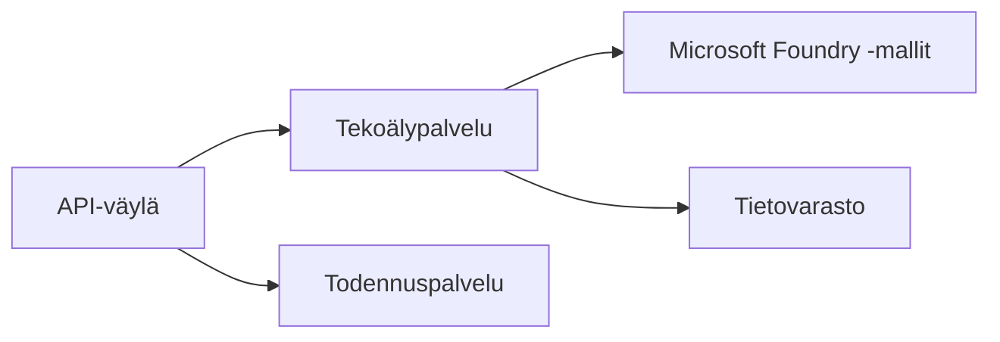
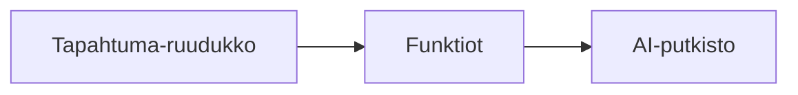

# Luku 8: Tuotanto- ja yritysmallit

**📚 Kurssi**: [AZD Aloittelijoille](../../README.md) | **⏱️ Kesto**: 2-3 tuntia | **⭐ Vaativuus**: Edistynyt

---

## Yleiskatsaus

Tässä luvussa käsitellään yrityskäyttöön sopivia käyttöönotto- (deployment) malleja, tietoturvan koventamista, valvontaa ja kustannusten optimointia tuotantotason AI-kuormituksille.

> Vahvistettu `azd 1.25.6` kesäkuussa 2026.

## Oppimistavoitteet

Tämän luvun läpikäytyäsi osaat:
- Käyttöönottaa monialueisia, vikasietoisia sovelluksia
- Toteuttaa yritystason tietoturvamalleja
- Määrittää kattavan valvonnan
- Optimoida kustannuksia suuressa mittakaavassa
- Asettaa CI/CD-putket AZD:llä

---

## 📚 Oppitunnit

| # | Oppitunti | Kuvaus | Aika |
|---|--------|-------------|------|
| 1 | [Tuotantotason AI-käytännöt](production-ai-practices.md) | Yrityksen käyttöönotto-mallit | 90 min |

---

## 🚀 Tuotannon tarkistuslista

- [ ] Monialueinen käyttöönotto vikasietoisuuden varmistamiseksi
- [ ] Hallittu identiteetti todennukseen (ei avaimia)
- [ ] Application Insights valvontaan
- [ ] Kustannusbudjetit ja hälytykset määritelty
- [ ] Tietoturvaskannaus käytössä
- [ ] CI/CD-putkien integrointi
- [ ] Toipumissuunnitelma

---

## 🏗️ Arkkitehtuurimallit

### Malli 1: Mikropalvelu-AI



### Malli 2: Tapahtumapohjainen AI



---

## 🔐 Tietoturvan parhaat käytännöt

```bicep
// Use managed identity
identity: {
  type: 'SystemAssigned'
}

// Private endpoints for AI services
properties: {
  publicNetworkAccess: 'Disabled'
  networkAcls: {
    defaultAction: 'Deny'
  }
}
```

---

## 💰 Kustannusten optimointi

| Strategia | Säästöt |
|----------|---------|
| Skaalaa nollaan (Container Apps) | 60-80% |
| Käytä kulutusperusteisia tasoja kehityksessä | 50-70% |
| Aikataulutettu skaalaus | 30-50% |
| Varattu kapasiteetti | 20-40% |

```bash
# Aseta budjettihälytykset
az consumption budget create \
  --budget-name "AI-Budget" \
  --amount 500 \
  --category Cost \
  --time-grain Monthly
```

---

## 📊 Valvonnan asetukset

```bash
# Seuraa lokivirtaa
azd monitor --logs

# Tarkista Application Insights
azd monitor --overview

# Näytä mittarit
az monitor metrics list --resource <resource-id>
```

---

## 🔗 Navigointi

| Suunta | Luku |
|-----------|---------|
| **Edellinen** | [Luku 7: Vianmääritys](../chapter-07-troubleshooting/README.md) |
| **Kurssi valmis** | [Kurssin etusivu](../../README.md) |

---

## 📖 Aiheeseen liittyvät resurssit

- [AI-agenttien opas](../chapter-02-ai-development/agents.md)
- [Application Insights](../chapter-06-pre-deployment/application-insights.md)
- [Moni-agenttiset ratkaisut](../chapter-05-multi-agent/README.md)
- [Mikropalveluesimerkki](../../examples/microservices/README.md)

---

<!-- CO-OP TRANSLATOR DISCLAIMER START -->
**Vastuuvapauslauseke**:
Tämä asiakirja on käännetty käyttämällä tekoälypohjaista käännöspalvelua [Co-op Translator](https://github.com/Azure/co-op-translator). Vaikka pyrimme tarkkuuteen, otathan huomioon, että automaattiset käännökset saattavat sisältää virheitä tai epätarkkuuksia. Alkuperäinen asiakirja sen alkuperäiskielellä on virallinen lähde. Tärkeissä asioissa suositellaan ammattimaista ihmiskäännöstä. Emme ole vastuussa tämän käännöksen käytöstä aiheutuvista väärinymmärryksistä tai tulkinnoista.
<!-- CO-OP TRANSLATOR DISCLAIMER END -->