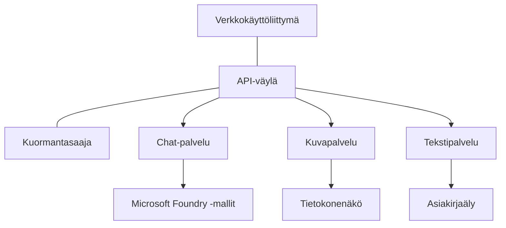

# Production AI Workload Best Practices with AZD

**Luku Navigointi:**
- **📚 Kurssin etusivu**: [AZD Aloittelijoille](../../README.md)
- **📖 Nykyinen luku**: Luku 8 - Production & Enterprise Patterns
- **⬅️ Edellinen luku**: [Luku 7: Vianmääritys](../chapter-07-troubleshooting/debugging.md)
- **⬅️ Myös liittyvää**: [AI-työpaja](ai-workshop-lab.md)
- **🎯 Kurssi suoritettu**: [AZD Aloittelijoille](../../README.md)

## Yleiskatsaus

Tämä opas tarjoaa kattavat parhaat käytännöt tuotantovalmiiden AI-työkuormien käyttöönottoon Azure Developer CLI:llä (AZD). Näihin käytäntöihin on koottu Microsoft Foundry Discord -yhteisön palautetta ja todellisia asiakasprojekteja koskevia oppeja, ja ne käsittelevät yleisimpiä tuotantotason AI-järjestelmien haasteita.

## Keskeiset ratkaistavat haasteet

Yhteisökyselymme tulosten perusteella kehittäjät kohtaavat seuraavia tärkeimpiä haasteita:

- **45%** kamppailee monipalveluisten AI-järjestelmien käyttöönotossa
- **38%** kohtaa haasteita tunnistetietojen ja salaisten arvojen hallinnassa  
- **35%** pitää tuotantovalmiutta ja skaalausta vaikeina
- **32%** tarvitsee parempia kustannusoptimointistrategioita
- **29%** vaatii parannuksia valvontaan ja vianmääritykseen

## Arkkitehtuurimallit tuotantotason AI:lle

### Malli 1: Mikropalvelupohjainen AI-arkkitehtuuri

**Milloin käyttää**: Monimutkaisiin AI-sovelluksiin, joissa on useita ominaisuuksia


**AZD Implementation**:

```yaml
# azure.yaml
name: enterprise-ai-platform
services:
  web:
    project: ./web
    host: staticwebapp
  api-gateway:
    project: ./api-gateway
    host: containerapp
  chat-service:
    project: ./services/chat
    host: containerapp
  vision-service:
    project: ./services/vision
    host: containerapp
  text-service:
    project: ./services/text
    host: containerapp
```

### Malli 2: Tapahtumaohjattu AI-käsittely

**Milloin käyttää**: Eräajot, dokumenttianalyysi, asynkroniset työnkulut

```bicep
// Event Hub for AI processing pipeline
resource eventHub 'Microsoft.EventHub/namespaces@2023-01-01-preview' = {
  name: eventHubNamespaceName
  location: location
  sku: {
    name: 'Standard'
    tier: 'Standard'
    capacity: 1
  }
}

// Service Bus for reliable message processing
resource serviceBus 'Microsoft.ServiceBus/namespaces@2022-10-01-preview' = {
  name: serviceBusNamespaceName
  location: location
  sku: {
    name: 'Premium'
    tier: 'Premium'
    capacity: 1
  }
}

// Function App for processing
resource functionApp 'Microsoft.Web/sites@2023-01-01' = {
  name: functionAppName
  location: location
  kind: 'functionapp,linux'
  properties: {
    siteConfig: {
      appSettings: [
        {
          name: 'FUNCTIONS_EXTENSION_VERSION'
          value: '~4'
        }
        {
          name: 'AZURE_OPENAI_ENDPOINT'
          value: '@Microsoft.KeyVault(VaultName=${keyVault.name};SecretName=openai-endpoint)'
        }
      ]
    }
  }
}
```

## Ajatuksia AI-agentin tilasta

Kun perinteinen verkkosovellus rikkoontuu, oireet ovat tuttuja: sivu ei lataudu, API palauttaa virheen tai käyttöönotto epäonnistuu. AI-vetoiset sovellukset voivat rikkoutua kaikilla samoilla tavoilla — mutta ne voivat myös käyttäytyä väärin hienovaraisemmin, ilman ilmeisiä virheilmoituksia.

Tämä osio auttaa rakentamaan mentaalisen mallin AI-työkuormien valvontaan, jotta tiedät mistä etsiä, kun asiat eivät tunnu olevan kunnossa.

### Miten agentin kunto eroaa perinteisen sovelluksen kunnosta

Perinteinen sovellus joko toimii tai ei toimi. AI-agentti voi vaikuttaa toimivan, mutta tuottaa huonoja tuloksia. Ajattele agentin kuntoa kahdella tasolla:

| Taso | Mitä tarkkailla | Minne katsoa |
|-------|--------------|---------------|
| **Infrastruktuurin kunto** | Toimiiko palvelu? Onko resurssit provisioitu? Ovatko päätepisteet saavutettavissa? | `azd monitor`, Azure Portal resource health, container/app logs |
| **Käyttäytymisen kunto** | Vastaako agentti tarkasti? Ovatko vastaukset ajallaan? Kutsutaanko mallia oikein? | Application Insights -jäljet, model call latency metrics, response quality logs |

Infrastruktuurin kunto on tuttu — se on sama mille tahansa azd-sovellukselle. Käyttäytymisen kunto on uusi kerros, jonka AI-työkuormat tuovat mukanaan.

### Minne katsoa, kun AI-sovellukset eivät toimi odotetusti

Jos AI-sovelluksesi ei tuota odotettuja tuloksia, tässä on käsitteellinen tarkistuslista:

1. **Aloita perusteista.** Toimiiko sovellus? Pääseekö se riippuvuuksiinsa? Tarkista `azd monitor` ja resurssien kunto kuten tekisit missä tahansa sovelluksessa.
2. **Tarkista malliyhteys.** Kutsutaanko sovelluksesi AI-mallia onnistuneesti? Epäonnistuneet tai aikakatkaistut mallikutsut ovat yleisin AI-sovellusten ongelmien syy ja näkyvät sovelluslokeissa.
3. **Katso mitä malli sai syötteenä.** AI-vastaukset riippuvat syötteestä (promptista ja mahdollisesta haetusta kontekstista). Jos tulos on väärä, syöte on yleensä väärä. Tarkista, lähettääkö sovelluksesi mallille oikeat tiedot.
4. **Tarkista vasteviive.** AI-mallikutsut ovat hitaampia kuin tyypilliset API-kutsut. Jos sovellus tuntuu hitaalta, tarkista onko mallivasteaikojen kasvu — se voi viitata rajoituksiin, kapasiteettiin tai aluekohtaiseen ruuhkaan.
5. **Seuraa kustannussignaaleja.** Odottamattomat piikit token-käytössä tai API-kutsuissa voivat viitata silmukkaan, väärin konfiguroituun promptiin tai liiallisiin uudelleenyrityksiin.

Sinun ei tarvitse hallita havaittavuustyökaluja heti. Avain on ymmärtää, että AI-sovelluksilla on ylimääräinen käyttäytymisen kerros seurattavana, ja azd:n sisäänrakennettu valvonta (`azd monitor`) antaa lähtökohdan molempien tasojen tutkimiseen.

---

## Turvallisuuden parhaat käytännöt

### 1. Zero-Trust -turvamalli

**Toteutusstrategia**:
- Ei palvelu-palvelu -viestintää ilman autentikointia
- Kaikki API-kutsut käyttävät hallittuja identiteettejä
- Verkon eristys yksityisillä päätepisteillä
- Vähimmän oikeuden käyttöoikeudet

```bicep
// Managed Identity for each service
resource chatServiceIdentity 'Microsoft.ManagedIdentity/userAssignedIdentities@2023-01-31' = {
  name: 'chat-service-identity'
  location: location
}

// Role assignments with minimal permissions
resource openAIUserRole 'Microsoft.Authorization/roleAssignments@2022-04-01' = {
  scope: openAIAccount
  name: guid(openAIAccount.id, chatServiceIdentity.id, openAIUserRoleDefinitionId)
  properties: {
    roleDefinitionId: subscriptionResourceId('Microsoft.Authorization/roleDefinitions', '5e0bd9bd-7b93-4f28-af87-19fc36ad61bd')
    principalId: chatServiceIdentity.properties.principalId
    principalType: 'ServicePrincipal'
  }
}
```

### 2. Turvallinen salaisuuksien hallinta

**Key Vault -integraatiomalli**:

```bicep
// Key Vault with proper access policies
resource keyVault 'Microsoft.KeyVault/vaults@2023-02-01' = {
  name: keyVaultName
  location: location
  properties: {
    tenantId: tenant().tenantId
    sku: {
      family: 'A'
      name: 'premium'  // Use premium for production
    }
    enableRbacAuthorization: true  // Use RBAC instead of access policies
    enablePurgeProtection: true    // Prevent accidental deletion
    enableSoftDelete: true
    softDeleteRetentionInDays: 90
  }
}

// Store all AI service credentials
resource openAIKeySecret 'Microsoft.KeyVault/vaults/secrets@2023-02-01' = {
  parent: keyVault
  name: 'openai-api-key'
  properties: {
    value: openAIAccount.listKeys().key1
    attributes: {
      enabled: true
    }
  }
}
```

### 3. Verkon turvallisuus

**Yksityisten päätepisteiden konfigurointi**:

```bicep
// Virtual Network for AI services
resource virtualNetwork 'Microsoft.Network/virtualNetworks@2023-04-01' = {
  name: vnetName
  location: location
  properties: {
    addressSpace: {
      addressPrefixes: ['10.0.0.0/16']
    }
    subnets: [
      {
        name: 'ai-services-subnet'
        properties: {
          addressPrefix: '10.0.1.0/24'
          privateEndpointNetworkPolicies: 'Disabled'
        }
      }
      {
        name: 'app-services-subnet'
        properties: {
          addressPrefix: '10.0.2.0/24'
          delegations: [
            {
              name: 'Microsoft.Web/serverFarms'
              properties: {
                serviceName: 'Microsoft.Web/serverFarms'
              }
            }
          ]
        }
      }
    ]
  }
}

// Private endpoints for all AI services
resource openAIPrivateEndpoint 'Microsoft.Network/privateEndpoints@2023-04-01' = {
  name: '${openAIAccountName}-pe'
  location: location
  properties: {
    subnet: {
      id: virtualNetwork.properties.subnets[0].id
    }
    privateLinkServiceConnections: [
      {
        name: 'openai-connection'
        properties: {
          privateLinkServiceId: openAIAccount.id
          groupIds: ['account']
        }
      }
    ]
  }
}
```

## Suorituskyky ja skaalaus

### 1. Automaattisen skaalaamisen strategiat

**Container Apps -automaattinen skaalaus**:

```bicep
resource containerApp 'Microsoft.App/containerApps@2023-05-01' = {
  name: containerAppName
  location: location
  properties: {
    configuration: {
      ingress: {
        external: true
        targetPort: 8000
        transport: 'http'
      }
    }
    template: {
      scale: {
        minReplicas: 2  // Always have 2 instances minimum
        maxReplicas: 50 // Scale up to 50 for high load
        rules: [
          {
            name: 'http-scaling'
            http: {
              metadata: {
                concurrentRequests: '20'  // Scale when >20 concurrent requests
              }
            }
          }
          {
            name: 'cpu-scaling'
            custom: {
              type: 'cpu'
              metadata: {
                type: 'Utilization'
                value: '70'  // Scale when CPU >70%
              }
            }
          }
        ]
      }
    }
  }
}
```

### 2. Välimuististrategiat

**Redis-välimuisti AI-vastauksille**:

```bicep
// Redis Premium for production workloads
resource redisCache 'Microsoft.Cache/redis@2023-04-01' = {
  name: redisCacheName
  location: location
  properties: {
    sku: {
      name: 'Premium'
      family: 'P'
      capacity: 1
    }
    enableNonSslPort: false
    minimumTlsVersion: '1.2'
    redisConfiguration: {
      'maxmemory-policy': 'allkeys-lru'
    }
    // Enable clustering for high availability
    redisVersion: '6.0'
    shardCount: 2
  }
}

// Cache configuration in application
var cacheConnectionString = '${redisCache.properties.hostName}:6380,password=${redisCache.listKeys().primaryKey},ssl=True,abortConnect=False'
```

### 3. Kuormantasapainotus ja liikenteen hallinta

**Application Gateway WAF:llä**:

```bicep
// Application Gateway with Web Application Firewall
resource applicationGateway 'Microsoft.Network/applicationGateways@2023-04-01' = {
  name: appGatewayName
  location: location
  properties: {
    sku: {
      name: 'WAF_v2'
      tier: 'WAF_v2'
      capacity: 2
    }
    webApplicationFirewallConfiguration: {
      enabled: true
      firewallMode: 'Prevention'
      ruleSetType: 'OWASP'
      ruleSetVersion: '3.2'
    }
    // Backend pools for AI services
    backendAddressPools: [
      {
        name: 'ai-services-pool'
        properties: {
          backendAddresses: [
            {
              fqdn: '${containerApp.properties.configuration.ingress.fqdn}'
            }
          ]
        }
      }
    ]
  }
}
```

## 💰 Kustannusoptimointi

### 1. Resurssien oikea mitoitus

**Ympäristökohtaiset määritykset**:

```bash
# Kehitysympäristö
azd env new development
azd env set AZURE_OPENAI_SKU "S0"
azd env set AZURE_OPENAI_CAPACITY 10
azd env set AZURE_SEARCH_SKU "basic"
azd env set CONTAINER_CPU 0.5
azd env set CONTAINER_MEMORY 1.0

# Tuotantoympäristö
azd env new production
azd env set AZURE_OPENAI_SKU "S0"
azd env set AZURE_OPENAI_CAPACITY 100
azd env set AZURE_SEARCH_SKU "standard"
azd env set CONTAINER_CPU 2.0
azd env set CONTAINER_MEMORY 4.0
```

### 2. Kustannusseuranta ja budjetit

```bicep
// Cost management and budgets
resource budget 'Microsoft.Consumption/budgets@2023-05-01' = {
  name: 'ai-workload-budget'
  properties: {
    timePeriod: {
      startDate: '2024-01-01'
      endDate: '2024-12-31'
    }
    timeGrain: 'Monthly'
    amount: 2000  // $2000 monthly budget
    category: 'Cost'
    notifications: {
      warning: {
        enabled: true
        operator: 'GreaterThan'
        threshold: 80
        contactEmails: [
          'finance@company.com'
          'engineering@company.com'
        ]
        contactRoles: [
          'Owner'
          'Contributor'
        ]
      }
      critical: {
        enabled: true
        operator: 'GreaterThan'
        threshold: 95
        contactEmails: [
          'cto@company.com'
        ]
      }
    }
  }
}
```

### 3. Tokenien käytön optimointi

**OpenAI kustannusten hallinta**:

```typescript
// Sovellustason tokenien optimointi
class TokenOptimizer {
  private readonly maxTokens = 4000;
  private readonly reserveTokens = 500;
  
  optimizePrompt(userInput: string, context: string): string {
    const availableTokens = this.maxTokens - this.reserveTokens;
    const estimatedTokens = this.estimateTokens(userInput + context);
    
    if (estimatedTokens > availableTokens) {
      // Lyhennä kontekstia, älä käyttäjän syötettä
      context = this.truncateContext(context, availableTokens - this.estimateTokens(userInput));
    }
    
    return `${context}\n\nUser: ${userInput}`;
  }
  
  private estimateTokens(text: string): number {
    // Karkeasti arvioiden: 1 token ≈ 4 merkkiä
    return Math.ceil(text.length / 4);
  }
}
```

## Valvonta ja havaittavuus

### 1. Kattava Application Insights -seuranta

```bicep
// Application Insights with advanced features
resource applicationInsights 'Microsoft.Insights/components@2020-02-02' = {
  name: applicationInsightsName
  location: location
  kind: 'web'
  properties: {
    Application_Type: 'web'
    WorkspaceResourceId: logAnalyticsWorkspace.id
    SamplingPercentage: 100  // Full sampling for AI apps
    DisableIpMasking: false  // Enable for security
  }
}

// Custom metrics for AI operations
resource aiMetricAlerts 'Microsoft.Insights/metricAlerts@2018-03-01' = {
  name: 'ai-high-error-rate'
  location: 'global'
  properties: {
    description: 'Alert when AI service error rate is high'
    severity: 2
    enabled: true
    scopes: [
      applicationInsights.id
    ]
    evaluationFrequency: 'PT1M'
    windowSize: 'PT5M'
    criteria: {
      'odata.type': 'Microsoft.Azure.Monitor.SingleResourceMultipleMetricCriteria'
      allOf: [
        {
          name: 'high-error-rate'
          metricName: 'requests/failed'
          operator: 'GreaterThan'
          threshold: 10
          timeAggregation: 'Count'
        }
      ]
    }
  }
}
```

### 2. AI-kohtainen valvonta

**Mukautetut kojelaudat AI-metrisille**:

```json
// Dashboard configuration for AI workloads
{
  "dashboard": {
    "name": "AI Application Monitoring",
    "tiles": [
      {
        "name": "OpenAI Request Volume",
        "query": "requests | where name contains 'openai' | summarize count() by bin(timestamp, 5m)"
      },
      {
        "name": "AI Response Latency",
        "query": "requests | where name contains 'openai' | summarize avg(duration) by bin(timestamp, 5m)"
      },
      {
        "name": "Token Usage",
        "query": "customMetrics | where name == 'openai_tokens_used' | summarize sum(value) by bin(timestamp, 1h)"
      },
      {
        "name": "Cost per Hour",
        "query": "customMetrics | where name == 'openai_cost' | summarize sum(value) by bin(timestamp, 1h)"
      }
    ]
  }
}
```

### 3. Terveystarkastukset ja käyttöajan seuranta

```bicep
// Application Insights availability tests
resource availabilityTest 'Microsoft.Insights/webtests@2022-06-15' = {
  name: 'ai-app-availability-test'
  location: location
  tags: {
    'hidden-link:${applicationInsights.id}': 'Resource'
  }
  properties: {
    SyntheticMonitorId: 'ai-app-availability-test'
    Name: 'AI Application Availability Test'
    Description: 'Tests AI application endpoints'
    Enabled: true
    Frequency: 300  // 5 minutes
    Timeout: 120    // 2 minutes
    Kind: 'ping'
    Locations: [
      {
        Id: 'us-east-2-azr'
      }
      {
        Id: 'us-west-2-azr'
      }
    ]
    Configuration: {
      WebTest: '''
        <WebTest Name="AI Health Check" 
                 Id="8d2de8d2-a2b0-4c2e-9a0d-8f9c9a0b8c8d" 
                 Enabled="True" 
                 CssProjectStructure="" 
                 CssIteration="" 
                 Timeout="120" 
                 WorkItemIds="" 
                 xmlns="http://microsoft.com/schemas/VisualStudio/TeamTest/2010" 
                 Description="" 
                 CredentialUserName="" 
                 CredentialPassword="" 
                 PreAuthenticate="True" 
                 Proxy="default" 
                 StopOnError="False" 
                 RecordedResultFile="" 
                 ResultsLocale="">
          <Items>
            <Request Method="GET" 
                     Guid="a5f10126-e4cd-570d-961c-cea43999a200" 
                     Version="1.1" 
                     Url="${webApp.properties.defaultHostName}/health" 
                     ThinkTime="0" 
                     Timeout="120" 
                     ParseDependentRequests="True" 
                     FollowRedirects="True" 
                     RecordResult="True" 
                     Cache="False" 
                     ResponseTimeGoal="0" 
                     Encoding="utf-8" 
                     ExpectedHttpStatusCode="200" 
                     ExpectedResponseUrl="" 
                     ReportingName="" 
                     IgnoreHttpStatusCode="False" />
          </Items>
        </WebTest>
      '''
    }
  }
}
```

## Toipuminen häiriötilanteista ja korkea käytettävyys

### 1. Monialueinen käyttöönotto

```yaml
# azure.yaml - Multi-region configuration
name: ai-app-multiregion
services:
  api-primary:
    project: ./api
    host: containerapp
    env:
      - AZURE_REGION=eastus
  api-secondary:
    project: ./api
    host: containerapp
    env:
      - AZURE_REGION=westus2
```

```bicep
// Traffic Manager for global load balancing
resource trafficManager 'Microsoft.Network/trafficManagerProfiles@2022-04-01' = {
  name: trafficManagerProfileName
  location: 'global'
  properties: {
    profileStatus: 'Enabled'
    trafficRoutingMethod: 'Priority'
    dnsConfig: {
      relativeName: trafficManagerProfileName
      ttl: 30
    }
    monitorConfig: {
      protocol: 'HTTPS'
      port: 443
      path: '/health'
      intervalInSeconds: 30
      toleratedNumberOfFailures: 3
      timeoutInSeconds: 10
    }
    endpoints: [
      {
        name: 'primary-endpoint'
        type: 'Microsoft.Network/trafficManagerProfiles/azureEndpoints'
        properties: {
          targetResourceId: primaryAppService.id
          endpointStatus: 'Enabled'
          priority: 1
        }
      }
      {
        name: 'secondary-endpoint'
        type: 'Microsoft.Network/trafficManagerProfiles/azureEndpoints'
        properties: {
          targetResourceId: secondaryAppService.id
          endpointStatus: 'Enabled'
          priority: 2
        }
      }
    ]
  }
}
```

### 2. Datan varmuuskopiointi ja palautus

```bicep
// Backup configuration for critical data
resource backupVault 'Microsoft.DataProtection/backupVaults@2023-05-01' = {
  name: backupVaultName
  location: location
  identity: {
    type: 'SystemAssigned'
  }
  properties: {
    storageSettings: [
      {
        datastoreType: 'VaultStore'
        type: 'LocallyRedundant'
      }
    ]
  }
}

// Backup policy for AI models and data
resource backupPolicy 'Microsoft.DataProtection/backupVaults/backupPolicies@2023-05-01' = {
  parent: backupVault
  name: 'ai-data-backup-policy'
  properties: {
    policyRules: [
      {
        backupParameters: {
          backupType: 'Full'
          objectType: 'AzureBackupParams'
        }
        trigger: {
          schedule: {
            repeatingTimeIntervals: [
              'R/2024-01-01T02:00:00+00:00/P1D'  // Daily at 2 AM
            ]
          }
          objectType: 'ScheduleBasedTriggerContext'
        }
        dataStore: {
          datastoreType: 'VaultStore'
          objectType: 'DataStoreInfoBase'
        }
        name: 'BackupDaily'
        objectType: 'AzureBackupRule'
      }
    ]
  }
}
```

## DevOps ja CI/CD -integraatio

### 1. GitHub Actions -työnkulku

```yaml
# .github/workflows/deploy-ai-app.yml
name: Deploy AI Application

on:
  push:
    branches: [main]
  pull_request:
    branches: [main]

jobs:
  test:
    runs-on: ubuntu-latest
    steps:
      - uses: actions/checkout@v4
      
      - name: Setup Python
        uses: actions/setup-python@v4
        with:
          python-version: '3.11'
          
      - name: Install dependencies
        run: |
          pip install -r requirements.txt
          pip install pytest
          
      - name: Run tests
        run: pytest tests/
        
      - name: AI Safety Tests
        run: |
          python scripts/test_ai_safety.py
          python scripts/validate_prompts.py

  deploy-staging:
    needs: test
    if: github.event_name == 'pull_request'
    runs-on: ubuntu-latest
    steps:
      - uses: actions/checkout@v4
      
      - name: Setup AZD
        uses: Azure/setup-azd@v1.0.0
        
      - name: Login to Azure
        uses: azure/login@v1
        with:
          creds: ${{ secrets.AZURE_CREDENTIALS }}
          
      - name: Deploy to Staging
        run: |
          azd env select staging
          azd deploy

  deploy-production:
    needs: test
    if: github.ref == 'refs/heads/main'
    runs-on: ubuntu-latest
    steps:
      - uses: actions/checkout@v4
      
      - name: Setup AZD
        uses: Azure/setup-azd@v1.0.0
        
      - name: Login to Azure
        uses: azure/login@v1
        with:
          creds: ${{ secrets.AZURE_CREDENTIALS }}
          
      - name: Deploy to Production
        run: |
          azd env select production
          azd deploy
          
      - name: Run Production Health Checks
        run: |
          python scripts/health_check.py --env production
```

### 2. Infrastruktuurin validointi

```bash
# scripts/validate_infrastructure.sh
#!/bin/bash

echo "Validating AI infrastructure deployment..."

# Tarkista, että kaikki vaaditut palvelut ovat käynnissä
services=("openai" "search" "storage" "keyvault")
for service in "${services[@]}"; do
    echo "Checking $service..."
    if ! az resource list --resource-type "Microsoft.CognitiveServices/accounts" --query "[?contains(name, '$service')]" -o tsv; then
        echo "ERROR: $service not found"
        exit 1
    fi
done

# Tarkista OpenAI-mallien käyttöönotot
echo "Validating OpenAI model deployments..."
models=$(az cognitiveservices account deployment list --name $AZURE_OPENAI_NAME --resource-group $AZURE_RESOURCE_GROUP --query "[].name" -o tsv)
if [[ ! $models == *"gpt-35-turbo"* ]]; then
    echo "ERROR: Required model gpt-35-turbo not deployed"
    exit 1
fi

# Testaa yhteys tekoälypalveluun
echo "Testing AI service connectivity..."
python scripts/test_connectivity.py

echo "Infrastructure validation completed successfully!"
```

## Tuotantovalmiuden tarkistuslista

### Tietoturva ✅
- [ ] Kaikki palvelut käyttävät hallittuja identiteettejä
- [ ] Salaisuudet tallennettu Key Vaultiin
- [ ] Yksityiset päätepisteet konfiguroitu
- [ ] Verkon turvaryhmät otettu käyttöön
- [ ] RBAC vähimmän oikeuden periaatteella
- [ ] WAF otettu käyttöön julkisilla päätepisteillä

### Suorituskyky ✅
- [ ] Automaattinen skaalaus konfiguroitu
- [ ] Välimuisti toteutettu
- [ ] Kuormantasapainotus asetettu
- [ ] CDN staattiselle sisällölle
- [ ] Tietokantayhteyksien yhteyspoolaus
- [ ] Tokenien käytön optimointi

### Valvonta ✅
- [ ] Application Insights konfiguroitu
- [ ] Mukautetut metriikat määritelty
- [ ] Hälytys säännöt asetettu
- [ ] Kojelauta luotu
- [ ] Terveystarkastukset toteutettu
- [ ] Lokien säilytyspolitiikat

### Luotettavuus ✅
- [ ] Monialueinen käyttöönotto
- [ ] Varmuuskopiointi- ja palautussuunnitelma
- [ ] Circuit breaker -mekanismit otettu käyttöön
- [ ] Uudelleenyritysasetukset konfiguroitu
- [ ] Hallittu degradaatio
- [ ] Terveystarkastus-päätepisteet

### Kustannusten hallinta ✅
- [ ] Budjetti-ilmoitukset konfiguroitu
- [ ] Resurssien oikea mitoitus
- [ ] Dev/test-alennukset käytössä
- [ ] Varatut instanssit ostettu
- [ ] Kustannusseurannan kojelauta
- [ ] Säännölliset kustannusarvioinnit

### Säädösten noudattaminen ✅
- [ ] Tietojen sijaintivaatimukset täytetty
- [ ] Tarkastuslokitus otettu käyttöön
- [ ] Noudattamispolitiikat sovellettu
- [ ] Turvallisuusperuslinjat toteutettu
- [ ] Säännölliset turvallisuusarvioinnit
- [ ] Häiriötilanteiden toimintasuunnitelma

## Suorituskykyvertailut

### Tyypilliset tuotantomittarit

| Mittari | Tavoite | Seuranta |
|--------|--------|------------|
| **Vasteaika** | < 2 sekuntia | Application Insights |
| **Käytettävyys** | 99.9% | Uptime monitoring |
| **Virheprosentti** | < 0.1% | Sovelluslokit |
| **Token-käyttö** | < $500/month | Cost management |
| **Samanaikaiset käyttäjät** | 1000+ | Kuormitustestaus |
| **Palautumisaika** | < 1 tunti | Disaster recovery tests |

### Kuormitustestaus

```bash
# Kuormitustestausskripti tekoälysovelluksille
python scripts/load_test.py \
  --endpoint https://your-ai-app.azurewebsites.net \
  --concurrent-users 100 \
  --duration 300 \
  --ramp-up 60
```

## 🤝 Yhteisön parhaat käytännöt

Perustuu Microsoft Foundry Discord -yhteisön palautteeseen:

### Yhteisön tärkeimmät suositukset:

1. **Aloita pienestä, skaalaa vähitellen**: Aloita perus-SKU:lla ja skaalaa käyttöasteen perusteella
2. **Valvo kaikkea**: Ota kattava valvonta käyttöön heti alusta alkaen
3. **Automatisoi turvallisuus**: Käytä infrastruktuuria koodina johdonmukaisen turvallisuuden varmistamiseksi
4. **Testaa perusteellisesti**: Sisällytä AI-kohtaiset testit työnkulkuusi
5. **Suunnittele kustannuksia varten**: Seuraa token-käyttöä ja ota budjetti-ilmoitukset käyttöön varhain

### Yleisiä sudenkuoppia, joita tulee välttää:

- ❌ API-avainten kovakoodaus koodiin
- ❌ Asianmukaisen valvonnan puuttuminen
- ❌ Kustannusoptimoinnin laiminlyönti
- ❌ Virhetilojen testaamisen laiminlyönti
- ❌ Käyttöönotto ilman terveystarkastuksia

## AZD AI CLI -komennot ja laajennukset

AZD sisältää kasvavan joukon AI-kohtaisia komentoja ja laajennuksia, jotka virtaviivaistavat tuotantotason AI-työnkulkuja. Nämä työkalut yhdistävät paikallisen kehityksen ja tuotantokäytön välisen aukon AI-työkuormissa.

### AZD-laajennukset AI:lle

AZD käyttää laajennusjärjestelmää lisätäkseen AI-kohtaisia kyvykkyyksiä. Asenna ja hallitse laajennuksia:

```bash
# Luettele kaikki saatavilla olevat laajennukset (mukaan lukien tekoäly)
azd extension list

# Asenna Foundry Agents -laajennus
azd extension install azure.ai.agents

# Asenna hienosäätölaajennus
azd extension install azure.ai.finetune

# Asenna mukautettujen mallien laajennus
azd extension install azure.ai.models

# Päivitä kaikki asennetut laajennukset
azd extension upgrade --all
```

**Saatavilla olevat AI-laajennukset:**

| Laajennus | Tarkoitus | Tila |
|-----------|---------|--------|
| `azure.ai.agents` | Foundry Agent Service -palvelun hallinta | Esikatselu |
| `azure.ai.finetune` | Foundry-mallin hienosäätö | Esikatselu |
| `azure.ai.models` | Foundry-kustomoidut mallit | Esikatselu |
| `azure.coding-agent` | Koodaamisagentin konfigurointi | Saatavilla |

### Agenttiprojektien alustaminen komennolla `azd ai agent init`

Komento `azd ai agent init` luo valmiin tuotantovalmiin AI-agenttiprojektin, joka on integroitu Microsoft Foundry Agent Serviceen:

```bash
# Alusta uusi agenttiprojekti agenttimanifestista
azd ai agent init -m <manifest-path-or-uri>

# Alusta ja kohdenna tiettyyn Foundry-projektiin
azd ai agent init -m agent-manifest.yaml --project-id <foundry-project-id>

# Alusta mukautetulla lähdekansiolla
azd ai agent init -m agent-manifest.yaml --src ./agents/my-agent

# Aseta Container Apps isännäksi
azd ai agent init -m agent-manifest.yaml --host containerapp
```

**Tärkeät valitsimet:**

| Valitsin | Kuvaus |
|------|-------------|
| `-m, --manifest` | Polku tai URI agentin manifestiin lisättäväksi projektiisi |
| `-p, --project-id` | Olemassa oleva Microsoft Foundry Project ID azd-ympäristöllesi |
| `-s, --src` | Hakemisto agenttimäärittelyn lataamista varten (oletus `src/<agent-id>`) |
| `--host` | Ylikirjoita oletushost (esim. `containerapp`) |
| `-e, --environment` | Käytettävä azd-ympäristö |

**Tuotantovinkki**: Käytä `--project-id`-valitsinta yhdistääksesi suoraan olemassa olevaan Foundry-projektiin, pitäen agenttikoodisi ja pilviresurssit linkitettyinä alusta alkaen.

### Model Context Protocol (MCP) komennolla `azd mcp`

AZD sisältää sisäänrakennetun MCP-palvelimen tuen (Alpha), joka mahdollistaa AI-agenttien ja työkalujen vuorovaikutuksen Azure-resurssiesi kanssa standardoidun protokollan kautta:

```bash
# Käynnistä MCP-palvelin projektillesi
azd mcp start

# Hallitse työkalun suostumusta MCP-toimintoihin
azd mcp consent
```

MCP-palvelin paljastaa azd-projektisi kontekstin — ympäristöt, palvelut ja Azure-resurssit — AI-pohjaisille kehitystyökaluille. Tämä mahdollistaa:

- **AI-avusteiset käyttöönotot**: Anna koodausagenteille mahdollisuus kysyä projektisi tilaa ja laukaista käyttöönottoja
- **Resurssien löytäminen**: AI-työkalut voivat löytää, mitä Azure-resursseja projektisi käyttää
- **Ympäristönhallinta**: Agentit voivat vaihtaa dev/staging/production -ympäristöjen välillä

### Infrastruktuurin generointi komennolla `azd infra generate`

Tuotantotason AI-työkuormille voit generoida ja mukauttaa Infrastructure as Code -määrittelyitä sen sijaan, että luottaisit automaattiseen provisiointiin:

```bash
# Luo Bicep/Terraform-tiedostot projektisi määritelmän perusteella
azd infra generate
```

Tämä kirjoittaa IaC:n levylle, jotta voit:
- Tarkistaa ja auditoida infrastruktuurin ennen käyttöönottoa
- Lisätä mukautettuja turvallisuuspolitiikkoja (verkkosäännöt, yksityiset päätepisteet)
- Integroida olemassa oleviin IaC-arviointiprosesseihin
- Versionhallita infrastruktuurin muutoksia erillään sovelluskoodista

### Tuotannon elinkaaron hookit

AZD-hookit antavat mahdollisuuden lisätä mukautettua logiikkaa jokaiseen käyttöönoton elinkaaren vaiheeseen — kriittistä tuotantotason AI-työnkuluissa:

```yaml
# azure.yaml - Production hooks example
name: ai-production-app
hooks:
  preprovision:
    shell: sh
    run: scripts/validate-quotas.sh    # Check AI model quota before provisioning
  postprovision:
    shell: sh
    run: scripts/configure-networking.sh  # Set up private endpoints
  predeploy:
    shell: sh
    run: scripts/run-ai-safety-tests.sh  # Run prompt safety checks
  postdeploy:
    shell: sh
    run: scripts/smoke-test.sh           # Verify agent responses post-deploy
services:
  agent-api:
    project: ./src/agent
    host: containerapp
    hooks:
      predeploy:
        shell: sh
        run: scripts/validate-model-access.sh  # Per-service hook
```

```bash
# Suorita tietty hook manuaalisesti kehityksen aikana
azd hooks run predeploy
```

**Suositellut tuotantohookit AI-työkuormille:**

| Hook | Käyttötapaus |
|------|----------|
| `preprovision` | Vahvista tilauksen kiintiöt AI-mallien kapasiteetille |
| `postprovision` | Konfiguroi yksityiset päätepisteet, ota mallipainot käyttöön |
| `predeploy` | Suorita AI-turvallisuustestit, validoi prompt-mallit |
| `postdeploy` | Suorita smoke-testit agentin vastauksille, varmista malliyhteydet |

### CI/CD-putken konfigurointi

Käytä `azd pipeline config` -komentoa yhdistääksesi projektisi GitHub Actionsiin tai Azure Pipelinesiin turvallisella Azure-autentikoinnilla:

```bash
# Määritä CI/CD-putki (interaktiivinen)
azd pipeline config

# Määritä tietyn tarjoajan avulla
azd pipeline config --provider github
```

Tämä komento:
- Luo service principalin vähimmän oikeuden periaatteella
- Konfiguroi federoidut tunnistetiedot (ei tallennettuja salaisuuksia)
- Generoi tai päivittää putken määrittelytiedoston
- Asettaa tarvittavat ympäristömuuttujat CI/CD-järjestelmääsi

**Tuotantotyönkulku pipeline-konfiguraatiolla:**

```bash
# 1. Ota tuotantoympäristö käyttöön
azd env new production
azd env set AZURE_OPENAI_CAPACITY 100

# 2. Määritä putkisto
azd pipeline config --provider github

# 3. Putkisto suorittaa azd deploy -komennon aina, kun main-haaraan tehdään push
```

### Komponenttien lisääminen komennolla `azd add`

Lisää inkrementaalisesti Azure-palveluja olemassa olevaan projektiin:

```bash
# Lisää uusi palvelukomponentti interaktiivisesti
azd add
```

Tämä on erityisen hyödyllinen tuotantotason AI-sovellusten laajentamisessa — esimerkiksi vektorihakupalvelun, uuden agenttipäätepisteen tai valvontakomponentin lisääminen olemassa olevaan käyttöönottoon.

## Lisäresurssit
- **Azure Well-Architected Framework**: [AI-työkuormien ohjeistus](https://learn.microsoft.com/azure/well-architected/ai/)
- **Microsoft Foundry -dokumentaatio**: [Viralliset ohjeet](https://learn.microsoft.com/azure/ai-studio/)
- **Yhteisön mallipohjat**: [Azure Samples](https://github.com/Azure-Samples)
- **Discord-yhteisö**: [#Azure channel](https://discord.gg/microsoft-azure)
- **Agenttitaidot Azurelle**: [microsoft/github-copilot-for-azure on skills.sh](https://skills.sh/microsoft/github-copilot-for-azure) - 37 avointa agenttitaitoa Azure AI:lle, Foundrylle, käyttöönottoon, kustannusoptimointiin ja diagnostiikkaan. Asenna editoriisi:
  ```bash
  npx skills add microsoft/github-copilot-for-azure
  ```

---

**Lukujen navigointi:**
- **📚 Kurssin etusivu**: [AZD For Beginners](../../README.md)
- **📖 Nykyinen luku**: Luku 8 - Tuotanto- ja yritysmallit
- **⬅️ Edellinen luku**: [Luku 7: Vianmääritys](../chapter-07-troubleshooting/debugging.md)
- **⬅️ Myös liittyvää**: [AI Workshop Lab](ai-workshop-lab.md)
- **� Kurssi suoritettu**: [AZD For Beginners](../../README.md)

**Muista**: tuotantotason tekoälytyökuormat vaativat huolellista suunnittelua, seurantaa ja jatkuvaa optimointia. Aloita näillä malleilla ja mukauta ne omiin vaatimuksiisi.

---

<!-- CO-OP TRANSLATOR DISCLAIMER START -->
**Vastuuvapauslauseke**:
Tämä asiakirja on käännetty käyttäen tekoälykäännöspalvelua [Co-op Translator](https://github.com/Azure/co-op-translator). Vaikka pyrimme tarkkuuteen, huomioithan, että automaattiset käännökset voivat sisältää virheitä tai epätarkkuuksia. Alkuperäistä asiakirjaa sen alkuperäiskielellä on pidettävä auktoritatiivisena lähteenä. Tärkeää tietoa varten suositellaan ammattimaista ihmiskäännöstä. Emme ole vastuussa tämän käännöksen käytöstä johtuvista väärinymmärryksistä tai virheellisistä tulkinnoista.
<!-- CO-OP TRANSLATOR DISCLAIMER END -->