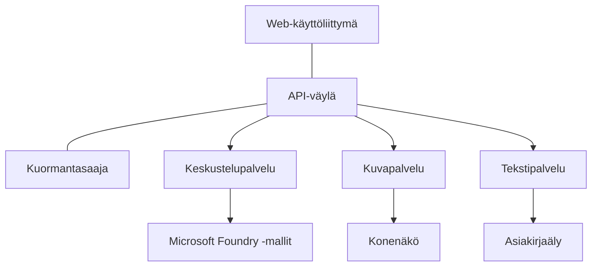

# Parhaat käytännöt tuotantotason tekoäintyökuormille AZD:llä

**Lukujen navigointi:**
- **📚 Kurssin etusivu**: [AZD Aloittelijoille](../../README.md)
- **📖 Nykyinen luku**: Luku 8 - Tuotanto- ja yritysmallit
- **⬅️ Edellinen luku**: [Luku 7: Vianmääritys](../chapter-07-troubleshooting/debugging.md)
- **⬅️ Myös liittyvää**: [AI-työpaja](ai-workshop-lab.md)
- **🎯 Kurssi valmis**: [AZD Aloittelijoille](../../README.md)

## Yleiskatsaus

Tämä opas tarjoaa kattavat parhaat käytännöt tuotantovalmiiden tekoäintyökuormien käyttöönottoon Azure Developer CLI:llä (AZD). Perustuen Microsoft Foundry Discord -yhteisön palautteeseen ja todellisiin asiakaskäyttöönottoihin, nämä käytännöt käsittelevät yleisimpiä haasteita tuotantotekoälyjärjestelmissä.

## Ratkaistavat keskeiset haasteet

Yhteisökyselymme tulosten perusteella kehittäjien yleisimmät haasteet ovat:

- **45%** kamppailee monipalveluisten tekoälyasennusten kanssa
- **38%** kohtaa ongelmia tunnistetietojen ja salaisuuksien hallinnassa  
- **35%** pitää tuotantovalmiutta ja skaalausta vaikeina
- **32%** tarvitsee parempia kustannusoptimointistrategioita
- **29%** tarvitsee parannettua valvontaa ja vianmääritystä

## Arkkitehtuurimallit tuotantotekoälylle

### Malli 1: Mikropalveluinen tekoälyarkkitehtuuri

**Milloin käyttää**: Monimutkaisiin tekoälysovelluksiin, joissa on useita toiminnallisuuksia


**AZD-toteutus**:

```yaml
# azure.yaml
name: enterprise-ai-platform
services:
  web:
    project: ./web
    host: staticwebapp
  api-gateway:
    project: ./api-gateway
    host: containerapp
  chat-service:
    project: ./services/chat
    host: containerapp
  vision-service:
    project: ./services/vision
    host: containerapp
  text-service:
    project: ./services/text
    host: containerapp
```

### Malli 2: Tapahtumapohjainen tekoälykäsittely

**Milloin käyttää**: Eräajot, asiakirja-analyysi, asynkroniset työnkulut

```bicep
// Event Hub for AI processing pipeline
resource eventHub 'Microsoft.EventHub/namespaces@2023-01-01-preview' = {
  name: eventHubNamespaceName
  location: location
  sku: {
    name: 'Standard'
    tier: 'Standard'
    capacity: 1
  }
}

// Service Bus for reliable message processing
resource serviceBus 'Microsoft.ServiceBus/namespaces@2022-10-01-preview' = {
  name: serviceBusNamespaceName
  location: location
  sku: {
    name: 'Premium'
    tier: 'Premium'
    capacity: 1
  }
}

// Function App for processing
resource functionApp 'Microsoft.Web/sites@2023-01-01' = {
  name: functionAppName
  location: location
  kind: 'functionapp,linux'
  properties: {
    siteConfig: {
      appSettings: [
        {
          name: 'FUNCTIONS_EXTENSION_VERSION'
          value: '~4'
        }
        {
          name: 'AZURE_OPENAI_ENDPOINT'
          value: '@Microsoft.KeyVault(VaultName=${keyVault.name};SecretName=openai-endpoint)'
        }
      ]
    }
  }
}
```

## Tekoälyagentin kunnon tarkastelu

Kun perinteinen web-sovellus rikkoutuu, oireet ovat tuttuja: sivu ei lataudu, API palauttaa virheen tai käyttöönotto epäonnistuu. Tekoälypohjaiset sovellukset voivat rikkoutua kaikilla näillä tavoilla—mutta ne voivat myös käyttäytyä huonosti hienovaraisemmilla tavoilla, jotka eivät tuota ilmeisiä virheilmoituksia.

Tämä osio auttaa rakentamaan mentaalisen mallin tekoäintyökuormien valvontaan, jotta tiedät mistä etsiä, kun asiat eivät vaikuta olevan kunnossa.

### Miten agentin kunto eroaa perinteisen sovelluksen kunnosta

Perinteinen sovellus joko toimii tai ei toimi. Tekoälyagentti voi näyttää toimivan mutta tuottaa huonoja tuloksia. Ajattele agentin kuntoa kahdessa kerroksessa:

| Kerros | Mitä seurata | Missä etsiä |
|-------|--------------|---------------|
| **Infrastruktuurin kunto** | Toimiiko palvelu? Onko resurssit provisioitu? Ovatko päätepisteet saavutettavissa? | `azd monitor`, Azure-portaalin resurssien terveydentila, kontti-/sovelluslokit |
| **Käytöksen kunto** | Vastaako agentti tarkasti? Ovatko vastaukset ajoissa? Kutsutaanko mallia oikein? | Application Insights -jäljet, mallikutsujen viiveen mittarit, vastausten laadun lokit |

Infrastruktuurin kunto on tuttu—se on sama mille tahansa azd-sovellukselle. Käytöksen kunto on uusi kerros, jonka tekoälytyökuormat tuovat mukanaan.

### Missä etsiä, kun tekoälysovellukset eivät käyttäydy odotetusti

Jos tekoälysovelluksesi ei tuota odotettuja tuloksia, tässä on käsitteellinen tarkistuslista:

1. **Aloita perusteista.** Toimiiko sovellus? Pääseekö se riippuvuuksiinsa? Tarkista `azd monitor` ja resurssien kunto kuten tekisit minkä tahansa sovelluksen kanssa.
2. **Tarkista malliyhteys.** Kutsutaanko sovelluksestasi onnistuneesti tekoälymallia? Epäonnistuneet tai aikakatkaistut mallikutsut ovat yleisin tekoälysovellusten ongelmien syy ja näkyvät sovelluksen lokeissa.
3. **Katso, mitä mallille lähetettiin.** Tekoälyn vastaukset riippuvat syötteestä (kehotteesta ja palautetusta kontekstista). Jos tulos on väärä, syöte on yleensä väärä. Tarkista, lähettääkö sovelluksesi mallille oikeat tiedot.
4. **Tarkista vastausten viive.** Tekoälymallikutsut ovat hitaampia kuin tyypilliset API-kutsut. Jos sovelluksesi tuntuu hitaalta, tarkista, ovatko mallin vasteajat kasvaneet—tämä voi viitata rajoituksiin, kapasiteettirajoihin tai alueen tason ruuhkautumiseen.
5. **Seuraa kustannussignaaleja.** Odottamattomat piikit token-käytössä tai API-kutsuissa voivat viitata silmukkaan, väärin konfiguroituun kehotteeseen tai liiallisiin uudelleenyrityksiin.

Sinun ei tarvitse hallita havaittavuustyökaluja heti. Tärkein opittu asia on, että tekoälysovelluksilla on ylimääräinen käyttäytymisen kerros seurattavana, ja azd:n sisäänrakennettu valvonta (`azd monitor`) antaa sinulle lähtökohdan molempien kerrosten tutkimiseen.

---

## Turvallisuuden parhaat käytännöt

### 1. Zero-trust -turvamalli

**Toteutusstrategia**:
- Ei palvelujen välistä viestintää ilman todennusta
- Kaikki API-kutsut käyttävät hallittuja identiteettejä
- Verkon eristäminen yksityisillä päätepisteillä
- Vähimmän etuoikeuden periaate

```bicep
// Managed Identity for each service
resource chatServiceIdentity 'Microsoft.ManagedIdentity/userAssignedIdentities@2023-01-31' = {
  name: 'chat-service-identity'
  location: location
}

// Role assignments with minimal permissions
resource openAIUserRole 'Microsoft.Authorization/roleAssignments@2022-04-01' = {
  scope: openAIAccount
  name: guid(openAIAccount.id, chatServiceIdentity.id, openAIUserRoleDefinitionId)
  properties: {
    roleDefinitionId: subscriptionResourceId('Microsoft.Authorization/roleDefinitions', '5e0bd9bd-7b93-4f28-af87-19fc36ad61bd')
    principalId: chatServiceIdentity.properties.principalId
    principalType: 'ServicePrincipal'
  }
}
```

### 2. Turvallinen salaisuuksien hallinta

**Key Vault -integrointimalli**:

```bicep
// Key Vault with proper access policies
resource keyVault 'Microsoft.KeyVault/vaults@2023-02-01' = {
  name: keyVaultName
  location: location
  properties: {
    tenantId: tenant().tenantId
    sku: {
      family: 'A'
      name: 'premium'  // Use premium for production
    }
    enableRbacAuthorization: true  // Use RBAC instead of access policies
    enablePurgeProtection: true    // Prevent accidental deletion
    enableSoftDelete: true
    softDeleteRetentionInDays: 90
  }
}

// Store all AI service credentials
resource openAIKeySecret 'Microsoft.KeyVault/vaults/secrets@2023-02-01' = {
  parent: keyVault
  name: 'openai-api-key'
  properties: {
    value: openAIAccount.listKeys().key1
    attributes: {
      enabled: true
    }
  }
}
```

### 3. Verkon turvallisuus

**Yksityisen päätepisteen määritys**:

```bicep
// Virtual Network for AI services
resource virtualNetwork 'Microsoft.Network/virtualNetworks@2023-04-01' = {
  name: vnetName
  location: location
  properties: {
    addressSpace: {
      addressPrefixes: ['10.0.0.0/16']
    }
    subnets: [
      {
        name: 'ai-services-subnet'
        properties: {
          addressPrefix: '10.0.1.0/24'
          privateEndpointNetworkPolicies: 'Disabled'
        }
      }
      {
        name: 'app-services-subnet'
        properties: {
          addressPrefix: '10.0.2.0/24'
          delegations: [
            {
              name: 'Microsoft.Web/serverFarms'
              properties: {
                serviceName: 'Microsoft.Web/serverFarms'
              }
            }
          ]
        }
      }
    ]
  }
}

// Private endpoints for all AI services
resource openAIPrivateEndpoint 'Microsoft.Network/privateEndpoints@2023-04-01' = {
  name: '${openAIAccountName}-pe'
  location: location
  properties: {
    subnet: {
      id: virtualNetwork.properties.subnets[0].id
    }
    privateLinkServiceConnections: [
      {
        name: 'openai-connection'
        properties: {
          privateLinkServiceId: openAIAccount.id
          groupIds: ['account']
        }
      }
    ]
  }
}
```

## Suorituskyky ja skaalaus

### 1. Automaattisen skaalaamisen strategiat

**Container Apps -automaattinen skaalaus**:

```bicep
resource containerApp 'Microsoft.App/containerApps@2023-05-01' = {
  name: containerAppName
  location: location
  properties: {
    configuration: {
      ingress: {
        external: true
        targetPort: 8000
        transport: 'http'
      }
    }
    template: {
      scale: {
        minReplicas: 2  // Always have 2 instances minimum
        maxReplicas: 50 // Scale up to 50 for high load
        rules: [
          {
            name: 'http-scaling'
            http: {
              metadata: {
                concurrentRequests: '20'  // Scale when >20 concurrent requests
              }
            }
          }
          {
            name: 'cpu-scaling'
            custom: {
              type: 'cpu'
              metadata: {
                type: 'Utilization'
                value: '70'  // Scale when CPU >70%
              }
            }
          }
        ]
      }
    }
  }
}
```

### 2. Välimuististrategiat

**Redis-välimuisti tekoälyn vastauksille**:

```bicep
// Redis Premium for production workloads
resource redisCache 'Microsoft.Cache/redis@2023-04-01' = {
  name: redisCacheName
  location: location
  properties: {
    sku: {
      name: 'Premium'
      family: 'P'
      capacity: 1
    }
    enableNonSslPort: false
    minimumTlsVersion: '1.2'
    redisConfiguration: {
      'maxmemory-policy': 'allkeys-lru'
    }
    // Enable clustering for high availability
    redisVersion: '6.0'
    shardCount: 2
  }
}

// Cache configuration in application
var cacheConnectionString = '${redisCache.properties.hostName}:6380,password=${redisCache.listKeys().primaryKey},ssl=True,abortConnect=False'
```

### 3. Kuormantasapainotus ja liikenteen hallinta

**Application Gateway WAF:n kanssa**:

```bicep
// Application Gateway with Web Application Firewall
resource applicationGateway 'Microsoft.Network/applicationGateways@2023-04-01' = {
  name: appGatewayName
  location: location
  properties: {
    sku: {
      name: 'WAF_v2'
      tier: 'WAF_v2'
      capacity: 2
    }
    webApplicationFirewallConfiguration: {
      enabled: true
      firewallMode: 'Prevention'
      ruleSetType: 'OWASP'
      ruleSetVersion: '3.2'
    }
    // Backend pools for AI services
    backendAddressPools: [
      {
        name: 'ai-services-pool'
        properties: {
          backendAddresses: [
            {
              fqdn: '${containerApp.properties.configuration.ingress.fqdn}'
            }
          ]
        }
      }
    ]
  }
}
```

## 💰 Kustannusoptimointi

### 1. Resurssien oikea mitoittaminen

**Ympäristökohtaiset asetukset**:

```bash
# Kehitysympäristö
azd env new development
azd env set AZURE_OPENAI_SKU "S0"
azd env set AZURE_OPENAI_CAPACITY 10
azd env set AZURE_SEARCH_SKU "basic"
azd env set CONTAINER_CPU 0.5
azd env set CONTAINER_MEMORY 1.0

# Tuotantoympäristö
azd env new production
azd env set AZURE_OPENAI_SKU "S0"
azd env set AZURE_OPENAI_CAPACITY 100
azd env set AZURE_SEARCH_SKU "standard"
azd env set CONTAINER_CPU 2.0
azd env set CONTAINER_MEMORY 4.0
```

### 2. Kustannusten seuranta ja budjetit

```bicep
// Cost management and budgets
resource budget 'Microsoft.Consumption/budgets@2023-05-01' = {
  name: 'ai-workload-budget'
  properties: {
    timePeriod: {
      startDate: '2024-01-01'
      endDate: '2024-12-31'
    }
    timeGrain: 'Monthly'
    amount: 2000  // $2000 monthly budget
    category: 'Cost'
    notifications: {
      warning: {
        enabled: true
        operator: 'GreaterThan'
        threshold: 80
        contactEmails: [
          'finance@company.com'
          'engineering@company.com'
        ]
        contactRoles: [
          'Owner'
          'Contributor'
        ]
      }
      critical: {
        enabled: true
        operator: 'GreaterThan'
        threshold: 95
        contactEmails: [
          'cto@company.com'
        ]
      }
    }
  }
}
```

### 3. Token-käytön optimointi

**OpenAI-kustannusten hallinta**:

```typescript
// Sovellustason tokenien optimointi
class TokenOptimizer {
  private readonly maxTokens = 4000;
  private readonly reserveTokens = 500;
  
  optimizePrompt(userInput: string, context: string): string {
    const availableTokens = this.maxTokens - this.reserveTokens;
    const estimatedTokens = this.estimateTokens(userInput + context);
    
    if (estimatedTokens > availableTokens) {
      // Lyhennä kontekstia, älä käyttäjän syötettä
      context = this.truncateContext(context, availableTokens - this.estimateTokens(userInput));
    }
    
    return `${context}\n\nUser: ${userInput}`;
  }
  
  private estimateTokens(text: string): number {
    // Karkeasti arvioiden: 1 token ≈ 4 merkkiä
    return Math.ceil(text.length / 4);
  }
}
```

## Seuranta ja havaittavuus

### 1. Kattava Application Insights -seuranta

```bicep
// Application Insights with advanced features
resource applicationInsights 'Microsoft.Insights/components@2020-02-02' = {
  name: applicationInsightsName
  location: location
  kind: 'web'
  properties: {
    Application_Type: 'web'
    WorkspaceResourceId: logAnalyticsWorkspace.id
    SamplingPercentage: 100  // Full sampling for AI apps
    DisableIpMasking: false  // Enable for security
  }
}

// Custom metrics for AI operations
resource aiMetricAlerts 'Microsoft.Insights/metricAlerts@2018-03-01' = {
  name: 'ai-high-error-rate'
  location: 'global'
  properties: {
    description: 'Alert when AI service error rate is high'
    severity: 2
    enabled: true
    scopes: [
      applicationInsights.id
    ]
    evaluationFrequency: 'PT1M'
    windowSize: 'PT5M'
    criteria: {
      'odata.type': 'Microsoft.Azure.Monitor.SingleResourceMultipleMetricCriteria'
      allOf: [
        {
          name: 'high-error-rate'
          metricName: 'requests/failed'
          operator: 'GreaterThan'
          threshold: 10
          timeAggregation: 'Count'
        }
      ]
    }
  }
}
```

### 2. Tekoälykohtainen seuranta

**Mukautetut kojetaulut tekoälymittareille**:

```json
// Dashboard configuration for AI workloads
{
  "dashboard": {
    "name": "AI Application Monitoring",
    "tiles": [
      {
        "name": "OpenAI Request Volume",
        "query": "requests | where name contains 'openai' | summarize count() by bin(timestamp, 5m)"
      },
      {
        "name": "AI Response Latency",
        "query": "requests | where name contains 'openai' | summarize avg(duration) by bin(timestamp, 5m)"
      },
      {
        "name": "Token Usage",
        "query": "customMetrics | where name == 'openai_tokens_used' | summarize sum(value) by bin(timestamp, 1h)"
      },
      {
        "name": "Cost per Hour",
        "query": "customMetrics | where name == 'openai_cost' | summarize sum(value) by bin(timestamp, 1h)"
      }
    ]
  }
}
```

### 3. Terveystarkastukset ja käyttöajan seuranta

```bicep
// Application Insights availability tests
resource availabilityTest 'Microsoft.Insights/webtests@2022-06-15' = {
  name: 'ai-app-availability-test'
  location: location
  tags: {
    'hidden-link:${applicationInsights.id}': 'Resource'
  }
  properties: {
    SyntheticMonitorId: 'ai-app-availability-test'
    Name: 'AI Application Availability Test'
    Description: 'Tests AI application endpoints'
    Enabled: true
    Frequency: 300  // 5 minutes
    Timeout: 120    // 2 minutes
    Kind: 'ping'
    Locations: [
      {
        Id: 'us-east-2-azr'
      }
      {
        Id: 'us-west-2-azr'
      }
    ]
    Configuration: {
      WebTest: '''
        <WebTest Name="AI Health Check" 
                 Id="8d2de8d2-a2b0-4c2e-9a0d-8f9c9a0b8c8d" 
                 Enabled="True" 
                 CssProjectStructure="" 
                 CssIteration="" 
                 Timeout="120" 
                 WorkItemIds="" 
                 xmlns="http://microsoft.com/schemas/VisualStudio/TeamTest/2010" 
                 Description="" 
                 CredentialUserName="" 
                 CredentialPassword="" 
                 PreAuthenticate="True" 
                 Proxy="default" 
                 StopOnError="False" 
                 RecordedResultFile="" 
                 ResultsLocale="">
          <Items>
            <Request Method="GET" 
                     Guid="a5f10126-e4cd-570d-961c-cea43999a200" 
                     Version="1.1" 
                     Url="${webApp.properties.defaultHostName}/health" 
                     ThinkTime="0" 
                     Timeout="120" 
                     ParseDependentRequests="True" 
                     FollowRedirects="True" 
                     RecordResult="True" 
                     Cache="False" 
                     ResponseTimeGoal="0" 
                     Encoding="utf-8" 
                     ExpectedHttpStatusCode="200" 
                     ExpectedResponseUrl="" 
                     ReportingName="" 
                     IgnoreHttpStatusCode="False" />
          </Items>
        </WebTest>
      '''
    }
  }
}
```

## Toipuminen häiriötilanteista ja korkea käytettävyys

### 1. Monialueinen käyttöönotto

```yaml
# azure.yaml - Multi-region configuration
name: ai-app-multiregion
services:
  api-primary:
    project: ./api
    host: containerapp
    env:
      - AZURE_REGION=eastus
  api-secondary:
    project: ./api
    host: containerapp
    env:
      - AZURE_REGION=westus2
```

```bicep
// Traffic Manager for global load balancing
resource trafficManager 'Microsoft.Network/trafficManagerProfiles@2022-04-01' = {
  name: trafficManagerProfileName
  location: 'global'
  properties: {
    profileStatus: 'Enabled'
    trafficRoutingMethod: 'Priority'
    dnsConfig: {
      relativeName: trafficManagerProfileName
      ttl: 30
    }
    monitorConfig: {
      protocol: 'HTTPS'
      port: 443
      path: '/health'
      intervalInSeconds: 30
      toleratedNumberOfFailures: 3
      timeoutInSeconds: 10
    }
    endpoints: [
      {
        name: 'primary-endpoint'
        type: 'Microsoft.Network/trafficManagerProfiles/azureEndpoints'
        properties: {
          targetResourceId: primaryAppService.id
          endpointStatus: 'Enabled'
          priority: 1
        }
      }
      {
        name: 'secondary-endpoint'
        type: 'Microsoft.Network/trafficManagerProfiles/azureEndpoints'
        properties: {
          targetResourceId: secondaryAppService.id
          endpointStatus: 'Enabled'
          priority: 2
        }
      }
    ]
  }
}
```

### 2. Datan varmuuskopiointi ja palautus

```bicep
// Backup configuration for critical data
resource backupVault 'Microsoft.DataProtection/backupVaults@2023-05-01' = {
  name: backupVaultName
  location: location
  identity: {
    type: 'SystemAssigned'
  }
  properties: {
    storageSettings: [
      {
        datastoreType: 'VaultStore'
        type: 'LocallyRedundant'
      }
    ]
  }
}

// Backup policy for AI models and data
resource backupPolicy 'Microsoft.DataProtection/backupVaults/backupPolicies@2023-05-01' = {
  parent: backupVault
  name: 'ai-data-backup-policy'
  properties: {
    policyRules: [
      {
        backupParameters: {
          backupType: 'Full'
          objectType: 'AzureBackupParams'
        }
        trigger: {
          schedule: {
            repeatingTimeIntervals: [
              'R/2024-01-01T02:00:00+00:00/P1D'  // Daily at 2 AM
            ]
          }
          objectType: 'ScheduleBasedTriggerContext'
        }
        dataStore: {
          datastoreType: 'VaultStore'
          objectType: 'DataStoreInfoBase'
        }
        name: 'BackupDaily'
        objectType: 'AzureBackupRule'
      }
    ]
  }
}
```

## DevOps ja CI/CD -integraatio

### 1. GitHub Actions -työnkulku

```yaml
# .github/workflows/deploy-ai-app.yml
name: Deploy AI Application

on:
  push:
    branches: [main]
  pull_request:
    branches: [main]

jobs:
  test:
    runs-on: ubuntu-latest
    steps:
      - uses: actions/checkout@v4
      
      - name: Setup Python
        uses: actions/setup-python@v4
        with:
          python-version: '3.11'
          
      - name: Install dependencies
        run: |
          pip install -r requirements.txt
          pip install pytest
          
      - name: Run tests
        run: pytest tests/
        
      - name: AI Safety Tests
        run: |
          python scripts/test_ai_safety.py
          python scripts/validate_prompts.py

  deploy-staging:
    needs: test
    if: github.event_name == 'pull_request'
    runs-on: ubuntu-latest
    steps:
      - uses: actions/checkout@v4
      
      - name: Setup AZD
        uses: Azure/setup-azd@v2
        
      - name: Login to Azure
        uses: azure/login@v1
        with:
          creds: ${{ secrets.AZURE_CREDENTIALS }}
          
      - name: Deploy to Staging
        run: |
          azd env select staging
          azd deploy

  deploy-production:
    needs: test
    if: github.ref == 'refs/heads/main'
    runs-on: ubuntu-latest
    steps:
      - uses: actions/checkout@v4
      
      - name: Setup AZD
        uses: Azure/setup-azd@v2
        
      - name: Login to Azure
        uses: azure/login@v1
        with:
          creds: ${{ secrets.AZURE_CREDENTIALS }}
          
      - name: Deploy to Production
        run: |
          azd env select production
          azd deploy
          
      - name: Run Production Health Checks
        run: |
          python scripts/health_check.py --env production
```

### 2. Infrastruktuurin validointi

```bash
# scripts/validate_infrastructure.sh
#!/bin/bash

echo "Validating AI infrastructure deployment..."

# Tarkista, että kaikki tarvittavat palvelut ovat käynnissä
services=("openai" "search" "storage" "keyvault")
for service in "${services[@]}"; do
    echo "Checking $service..."
    if ! az resource list --resource-type "Microsoft.CognitiveServices/accounts" --query "[?contains(name, '$service')]" -o tsv; then
        echo "ERROR: $service not found"
        exit 1
    fi
done

# Tarkista OpenAI-mallien käyttöönotot
echo "Validating OpenAI model deployments..."
models=$(az cognitiveservices account deployment list --name $AZURE_OPENAI_NAME --resource-group $AZURE_RESOURCE_GROUP --query "[].name" -o tsv)
if [[ ! $models == *"gpt-4.1-mini"* ]]; then
  echo "ERROR: Required model gpt-4.1-mini not deployed"
    exit 1
fi

# Testaa tekoälypalvelun yhteydet
echo "Testing AI service connectivity..."
python scripts/test_connectivity.py

echo "Infrastructure validation completed successfully!"
```

## Tuotantovalmiuden tarkistuslista

### Turvallisuus ✅
- [ ] Kaikki palvelut käyttävät hallittuja identiteettejä
- [ ] Salaisuudet tallennettu Key Vaultiin
- [ ] Yksityiset päätepisteet määritetty
- [ ] Verkon suojausryhmät toteutettu
- [ ] RBAC pienimmän etuoikeuden periaatteella
- [ ] WAF otettu käyttöön julkisissa päätepisteissä

### Suorituskyky ✅
- [ ] Automaattinen skaalaus konfiguroitu
- [ ] Välimuisti otettu käyttöön
- [ ] Kuormantasapainotus määritetty
- [ ] CDN staattiselle sisällölle
- [ ] Tietokantayhteyksien poolaus
- [ ] Token-käytön optimointi

### Seuranta ✅
- [ ] Application Insights konfiguroitu
- [ ] Mukautetut mittarit määritelty
- [ ] Hälytyssäännöt määritetty
- [ ] Kojelauta luotu
- [ ] Terveystarkastukset toteutettu
- [ ] Lokien säilytyskäytännöt

### Luotettavuus ✅
- [ ] Monialueinen käyttöönotto
- [ ] Varmuuskopiointi- ja palautussuunnitelma
- [ ] Circuit breakerit toteutettu
- [ ] Uudelleenyritysperiaatteet määritetty
- [ ] Hallittu degradaatio
- [ ] Terveystarkastus‑päätepisteet

### Kustannusten hallinta ✅
- [ ] Budjettihälytykset määritetty
- [ ] Resurssien oikea mitoittaminen
- [ ] Kehitys/testaus-alennukset käytössä
- [ ] Varatut instanssit hankittu
- [ ] Kustannusseurannan kojelauta
- [ ] Säännölliset kustannuskatselmukset

### Säännösten noudattaminen ✅
- [ ] Datan sijaintivaatimukset täytetty
- [ ] Tarkastuslokitus käytössä
- [ ] Vaatimustenmukaisuuskäytännöt otettu käyttöön
- [ ] Turvallisuuden perusasetukset toteutettu
- [ ] Säännölliset turvallisuusarvioinnit
- [ ] Tapahtumien käsittelysuunnitelma

## Suorituskyvyn vertailuarvot

### Tyypilliset tuotantomittarit

| Mittari | Tavoite | Seuranta |
|--------|--------|------------|
| **Vasteaika** | < 2 sekuntia | Application Insights |
| **Käytettävyys** | 99.9% | Käyttöajan seuranta |
| **Virheprosentti** | < 0.1% | Sovelluslokit |
| **Token-käyttö** | < $500/kk | Kustannusten hallinta |
| **Samanaikaiset käyttäjät** | 1000+ | Kuormitustestaus |
| **Palautumisaika** | < 1 tunti | Toipumistestit |

### Kuormitustestaus

```bash
# Kuormitustestausskripti tekoälysovelluksille
python scripts/load_test.py \
  --endpoint https://your-ai-app.azurewebsites.net \
  --concurrent-users 100 \
  --duration 300 \
  --ramp-up 60
```

## 🤝 Yhteisön parhaat käytännöt

Perustuen Microsoft Foundry Discord -yhteisön palautteeseen:

### Yhteisön tärkeimmät suositukset:

1. **Aloita pienesti, skaalaa asteittain**: Aloita perus-SKUilla ja skaalaa käyttömäärän perusteella
2. **Valvo kaikkea**: Ota kattava seuranta käyttöön heti alusta lähtien
3. **Automatisoi turvallisuus**: Käytä infrastruktuuria koodina yhdenmukaisen turvallisuuden varmistamiseksi
4. **Testaa perusteellisesti**: Sisällytä tekoälykohtaiset testit putkeesi
5. **Suunnittele kustannukset**: Seuraa token-käyttöä ja määritä budjettihälytykset ajoissa

### Yleiset sudenkuopat, joita välttää:

- ❌ API-avainten kovakoodaus koodiin
- ❌ Oikean seurannan puuttuminen
- ❌ Kustannusoptimoinnin laiminlyönti
- ❌ Virhetilanteiden testaamatta jättäminen
- ❌ Julkaiseminen ilman terveystarkastuksia

## AZD AI -CLI-komennot ja laajennukset

AZD sisältää kasvavan joukon tekoälykohtaisia komentoja ja laajennuksia, jotka virtaviivaistavat tuotantotekoälytyönkulkuja. Nämä työkalut yhdistävät paikallisen kehityksen ja tuotantokäyttöönoton tekoälykuormille.

### AZD-laajennukset tekoälylle

AZD käyttää laajennusjärjestelmää lisätäkseen tekoälykohtaisia ominaisuuksia. Asenna ja hallinnoi laajennuksia seuraavasti:

```bash
# Luettele kaikki saatavilla olevat laajennukset (mukaan lukien tekoäly)
azd extension list

# Tarkastele asennettujen laajennusten tietoja
azd extension show azure.ai.agents

# Asenna Foundryn agenttien laajennus
azd extension install azure.ai.agents

# Asenna hienosäätölaajennus
azd extension install azure.ai.finetune

# Asenna mukautettujen mallien laajennus
azd extension install azure.ai.models

# Päivitä kaikki asennetut laajennukset
azd extension upgrade --all
```

**Saatavilla olevat tekoälylaajennukset:**

| Laajennus | Tarkoitus | Tila |
|-----------|---------|--------|
| `azure.ai.agents` | Foundry Agent Service -palvelun hallinta | Esikatselu |
| `azure.ai.finetune` | Foundry-mallin hienosäätö | Esikatselu |
| `azure.ai.models` | Foundry-kustomoidut mallit | Esikatselu |
| `azure.coding-agent` | Koodausagentin konfigurointi | Saatavilla |

### Agenttiprojektien alustaminen komennolla `azd ai agent init`

Komento `azd ai agent init` luo tuotantovalmiin tekoälyagenttiprojektin, joka on integroitu Microsoft Foundry Agent Serviceen:

```bash
# Alusta uusi agenttiprojekti agentin manifestista
azd ai agent init -m <manifest-path-or-uri>

# Alusta ja valitse tietty Foundry-projekti
azd ai agent init -m agent-manifest.yaml --project-id <foundry-project-id>

# Alusta mukautetulla lähdekansiolla
azd ai agent init -m agent-manifest.yaml --src ./agents/my-agent

# Valitse Container Apps isännäksi
azd ai agent init -m agent-manifest.yaml --host containerapp
```

**Tärkeimmät valitsimet:**

| Valitsin | Kuvaus |
|------|-------------|
| `-m, --manifest` | Polku tai URI agentin manifestille, joka lisätään projektiisi |
| `-p, --project-id` | Olemassa olevan Microsoft Foundry -projektin tunnus azd-ympäristöllesi |
| `-s, --src` | Hakemisto agentin määritelmän lataamista varten (oletus `src/<agent-id>`) |
| `--host` | Ylikirjoita oletusisäntä (esim. `containerapp`) |
| `-e, --environment` | Käytettävä azd-ympäristö |

**Tuotantovinkki**: Käytä `--project-id`-valitsinta yhdistääksesi suoraan olemassa olevaan Foundry-projektiin, jolloin agenttikoodisi ja pilviresurssit ovat linkitetty heti alusta lähtien.

### Model Context Protocol (MCP) komennolla `azd mcp`

AZD sisältää sisäänrakennetun MCP-palvelintuen (Alpha), joka mahdollistaa tekoälyagenttien ja -työkalujen vuorovaikutuksen Azure-resurssiesi kanssa standardoidun protokollan kautta:

```bash
# Käynnistä projektisi MCP-palvelin
azd mcp start

# Tarkista nykyiset Copilotin suostumussäännöt työkalujen suorittamista varten
azd copilot consent list
```

MCP-palvelin paljastaa azd-projektisi kontekstin—ympäristöt, palvelut ja Azure-resurssit—tekoälyllä tehostetuille kehitystyökaluille. Tämä mahdollistaa:

- **Tekoälyavusteinen käyttöönotto**: Anna koodausagenteille mahdollisuus kysyä projektisi tilaa ja käynnistää käyttöönottoja
- **Resurssien löytäminen**: Tekoälytyökalut voivat löytää, mitä Azure-resursseja projektisi käyttää
- **Ympäristöjen hallinta**: Agentit voivat vaihtaa kehitys/staging/tuotanto-ympäristöjen välillä

### Infrastruktuurin generointi komennolla `azd infra generate`

Tuotantotekoälykuormille voit generoida ja mukauttaa Infrastructure as Code -malleja sen sijaan, että luottaisit automaattiseen provisiointiin:

```bash
# Luo Bicep/Terraform-tiedostot projektimääritelmästäsi
azd infra generate
```

Tämä kirjoittaa IaC:n levylle, jotta voit:
- Tarkastella ja auditoida infrastruktuuria ennen käyttöönottoa
- Lisätä mukautettuja turvallisuuskäytäntöjä (verkkosäännöt, yksityiset päätepisteet)
- Integroida olemassa oleviin IaC-tarkastusprosesseihin
- Versioida infrastruktuurimuutokset erillään sovelluskoodista

### Tuotantokierron koukut

AZD-koukut antavat mahdollisuuden lisätä mukautettua logiikkaa jokaisessa käyttöönoton elinkaaren vaiheessa—kriittistä tuotantotekoälytyönkuluissa:

```yaml
# azure.yaml - Production hooks example
name: ai-production-app
hooks:
  preprovision:
    shell: sh
    run: scripts/validate-quotas.sh    # Check AI model quota before provisioning
  postprovision:
    shell: sh
    run: scripts/configure-networking.sh  # Set up private endpoints
  predeploy:
    shell: sh
    run: scripts/run-ai-safety-tests.sh  # Run prompt safety checks
  postdeploy:
    shell: sh
    run: scripts/smoke-test.sh           # Verify agent responses post-deploy
services:
  agent-api:
    project: ./src/agent
    host: containerapp
    hooks:
      predeploy:
        shell: sh
        run: scripts/validate-model-access.sh  # Per-service hook
```

```bash
# Suorita tietty hook manuaalisesti kehityksen aikana
azd hooks run predeploy
```

**Suositellut tuotantokoukut tekoälytyökuormille:**

| Koukku | Käyttötapaus |
|------|----------|
| `preprovision` | Vahvista tilauksen kvotat AI-mallien kapasiteetille |
| `postprovision` | Konfiguroi yksityisiä päätepisteitä, ota mallipainot käyttöön |
| `predeploy` | Suorita tekoälyturvatestit, validoi kehotteiden mallit |
| `postdeploy` | Tee perustoimintotesti agentin vastauksille, varmista malliyhteydet |

### CI/CD-putken kokoonpano

Käytä `azd pipeline config` -komentoa yhdistääksesi projektisi GitHub Actionsiin tai Azure Pipelinesiin turvallisen Azure-todennuksen avulla:

```bash
# Määritä CI/CD-putki (interaktiivinen)
azd pipeline config

# Määritä tietyn palveluntarjoajan kanssa
azd pipeline config --provider github
```

Tämä komento:
- Luo palveluperiaatteen (service principal) vähimmän etuoikeuden pääsyllä
- Konfiguroi federoidut tunnistetiedot (ei tallennettuja salaisuuksia)
- Generoi tai päivittää putkikuvaustiedostosi
- Asettaa vaaditut ympäristömuuttujat CI/CD-järjestelmääsi

**Tuotantotyönkulku pipeline-konfiguraatiolla:**

```bash
# 1. Määritä tuotantoympäristö
azd env new production
azd env set AZURE_OPENAI_CAPACITY 100

# 2. Määritä putkisto
azd pipeline config --provider github

# 3. Putkisto suorittaa azd deploy -komennon aina, kun mainiin pusketaan
```

### Komponenttien lisääminen komennolla `azd add`

Lisää vaiheittain Azure-palveluita olemassa olevaan projektiin:

```bash
# Lisää uusi palvelukomponentti interaktiivisesti
azd add
```

Tämä on erityisen hyödyllistä tuotantotekoälysovellusten laajentamiseen—for example, adding a vector search service, a new agent endpoint, or a monitoring component to an existing deployment.

## Lisäresurssit
- **Azure Well-Architected Framework**: [AI workload guidance](https://learn.microsoft.com/azure/well-architected/ai/)
- **Microsoft Foundry Documentation**: [Official docs](https://learn.microsoft.com/azure/ai-studio/)
- **Community Templates**: [Azure Samples](https://github.com/Azure-Samples)
- **Discord Community**: [#Azure channel](https://discord.gg/microsoft-azure)
- **Agent Skills for Azure**: [microsoft/github-copilot-for-azure on skills.sh](https://skills.sh/microsoft/github-copilot-for-azure) - 37 avointa agenttitaitoa Azure AI:lle, Foundrylle, käyttöönottoon, kustannusoptimointiin ja diagnostiikkaan. Asenna editoriisi:
  ```bash
  npx skills add microsoft/github-copilot-for-azure
  ```

---

**Lukujen navigointi:**
- **📚 Kurssin etusivu**: [AZD For Beginners](../../README.md)
- **📖 Nykyinen luku**: Luku 8 - Tuotanto- ja yritysmallit
- **⬅️ Edellinen luku**: [Chapter 7: Troubleshooting](../chapter-07-troubleshooting/debugging.md)
- **⬅️ Myös liittyvää**: [AI Workshop Lab](ai-workshop-lab.md)
- **� Kurssi suoritettu**: [AZD For Beginners](../../README.md)

**Muista**: Tuotannon AI-työkuormat vaativat huolellista suunnittelua, valvontaa ja jatkuvaa optimointia. Aloita näillä malleilla ja mukauta niitä omiin vaatimuksiisi.

---

<!-- CO-OP TRANSLATOR DISCLAIMER START -->
**Disclaimer**:
Tämä asiakirja on käännetty tekoälykäännöspalvelulla [Co-op Translator](https://github.com/Azure/co-op-translator). Vaikka pyrimme tarkkuuteen, huomioithan, että automaattiset käännökset saattavat sisältää virheitä tai epätarkkuuksia. Alkuperäistä asiakirjaa sen alkuperäiskielellä tulee pitää auktoritatiivisena lähteenä. Kriittisten tietojen osalta suositellaan ammattimaista ihmiskäännöstä. Emme ole vastuussa tämän käännöksen käytöstä aiheutuvista väärinymmärryksistä tai virheellisistä tulkinnoista.
<!-- CO-OP TRANSLATOR DISCLAIMER END -->