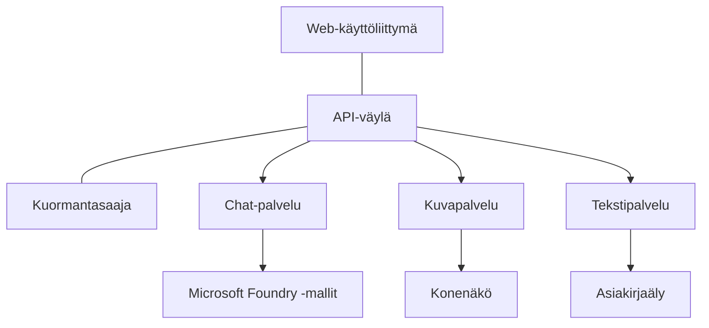

# Tuotantotason tekoälykuormien parhaat käytännöt AZD:n kanssa

**Chapter Navigation:**
- **📚 Kurssin etusivu**: [AZD For Beginners](../../README.md)
- **📖 Nykyinen luku**: Luku 8 - Tuotannon ja yritystason mallit
- **⬅️ Edellinen luku**: [Chapter 7: Troubleshooting](../chapter-07-troubleshooting/debugging.md)
- **⬅️ Myös liittyvä**: [AI Workshop Lab](ai-workshop-lab.md)
- **🎯 Kurssi valmis**: [AZD For Beginners](../../README.md)

## Yleiskatsaus

Tämä opas tarjoaa kattavat parhaat käytännöt tuotantovalmiiden tekoälykuormien sijoittamiseen Azure Developer CLI:llä (AZD). Näihin käytäntöihin on koottu Microsoft Foundry Discord -yhteisön palautetta ja todellisten asiakasasennusten oppeja, ja ne käsittelevät yleisimpiä haasteita tuotantotekoälyjärjestelmissä.

## Käsitellyt keskeiset haasteet

Yhteisökyselymme tulosten perusteella kehittäjät kohtaavat seuraavat tärkeimmät haasteet:

- **45%** kamppailee monipalveluisten tekoälykäyttöönottojen kanssa
- **38%** kohtaa ongelmia tunnistetietojen ja salaisuuksien hallinnassa  
- **35%** pitää tuotantokelpoisuutta ja skaalautuvuutta vaikeina
- **32%** tarvitsee parempia kustannusoptimointistrategioita
- **29%** vaatii parannettua valvontaa ja vianetsintää

## Arkkitehtuurimallit tuotantotekoälylle

### Malli 1: Mikropalveluarkkitehtuuri tekoälylle

**Milloin käyttää**: Monimutkaiset tekoälysovellukset, joissa on useita toiminnallisuuksia



**AZD:n toteutus**:

```yaml
# azure.yaml
name: enterprise-ai-platform
services:
  web:
    project: ./web
    host: staticwebapp
  api-gateway:
    project: ./api-gateway
    host: containerapp
  chat-service:
    project: ./services/chat
    host: containerapp
  vision-service:
    project: ./services/vision
    host: containerapp
  text-service:
    project: ./services/text
    host: containerapp
```

### Malli 2: Tapahtumapohjainen tekoälykäsittely

**Milloin käyttää**: Eräprosessi, asiakirja-analyysi, asynkroniset työnkulut

```bicep
// Event Hub for AI processing pipeline
resource eventHub 'Microsoft.EventHub/namespaces@2023-01-01-preview' = {
  name: eventHubNamespaceName
  location: location
  sku: {
    name: 'Standard'
    tier: 'Standard'
    capacity: 1
  }
}

// Service Bus for reliable message processing
resource serviceBus 'Microsoft.ServiceBus/namespaces@2022-10-01-preview' = {
  name: serviceBusNamespaceName
  location: location
  sku: {
    name: 'Premium'
    tier: 'Premium'
    capacity: 1
  }
}

// Function App for processing
resource functionApp 'Microsoft.Web/sites@2023-01-01' = {
  name: functionAppName
  location: location
  kind: 'functionapp,linux'
  properties: {
    siteConfig: {
      appSettings: [
        {
          name: 'FUNCTIONS_EXTENSION_VERSION'
          value: '~4'
        }
        {
          name: 'AZURE_OPENAI_ENDPOINT'
          value: '@Microsoft.KeyVault(VaultName=${keyVault.name};SecretName=openai-endpoint)'
        }
      ]
    }
  }
}
```

## Tekoälyagentin kunnon ajatteleminen

Kun perinteinen web-sovellus hajoaa, oireet ovat tuttuja: sivu ei lataudu, API palauttaa virheen tai käyttöönotto epäonnistuu. Tekoälyllä varustetut sovellukset voivat hajota samoilla tavoilla—mutta ne voivat myös toimia huonosti hienovaraisemmin, ilman ilmeisiä virheilmoituksia.

Tämä osio auttaa rakentamaan miellekartan tekoälykuormien valvontaan, jotta tiedät mistä etsiä, kun asiat eivät tunnu oikeilta.

### Miten agentin kunto eroaa perinteisen sovelluksen kunnosta

Perinteinen sovellus joko toimii tai ei toimi. Tekoälyagentti voi näyttää toimivan, mutta tuottaa huonoja tuloksia. Ajattele agentin kuntoa kahtena kerroksena:

| Taso | Mitä tarkkailla | Mistä etsiä |
|-------|--------------|---------------|
| **Infrastruktuurin kunto** | Onko palvelu käynnissä? Onko resurssit provisioitu? Ovatko päätepisteet saavutettavissa? | `azd monitor`, Azure Portal resource health, container/app logs |
| **Käyttäytymisen kunto** | Vastaaako agentti tarkasti? Ovatko vastaukset ajallaan? Kutsutaanko mallia oikein? | Application Insights traces, model call latency metrics, response quality logs |

Infrastruktuurin kunto on tuttu—se on sama minkä tahansa azd-sovelluksen kohdalla. Käyttäytymisen kunto on uusi kerros, jonka tekoälykuormat tuovat mukaan.

### Mistä etsiä, kun tekoälysovellukset eivät toimi odotetusti

Jos tekoälysovelluksesi ei tuota odotettuja tuloksia, tässä on käsitteellinen tarkistuslista:

1. **Aloita perusasioista.** Onko sovellus käynnissä? Pääseekö se riippuvuuksiinsa? Tarkista `azd monitor` ja resurssien kunto kuten tekisit minkä tahansa sovelluksen kanssa.
2. **Tarkista malliyhteys.** Kutsutaanko sovelluksesta onnistuneesti AI-mallia? Epäonnistuneet tai aikakatkaistut mallikutsut ovat yleisin aihe AI-sovellusongelmille ja näkyvät sovelluslokissa.
3. **Katso mitä malli sai.** Tekoälyn vastaukset riippuvat syötteestä (promptista ja mahdollisesta haetusta kontekstista). Jos tulos on väärä, syöte on yleensä väärä. Tarkista, lähettääkö sovelluksesi mallille oikeat tiedot.
4. **Arvioi vasteviive.** Mallikutsut ovat hitaampia kuin tyypilliset API-kutsut. Jos sovellus tuntuu hitailta, tarkista, ovatko mallivasteajat kasvaneet—se voi viitata rajoituksiin, kapasiteetin ylikuormitukseen tai alueeseen liittyvään ruuhkautumiseen.
5. **Seuraa kustannussignaaleja.** Odottamattomat piikit token-käytössä tai API-kutsuissa voivat kertoa silmukasta, väärin konfiguroidusta promptista tai liiallisista uudelleenyrittokerroista.

Sinun ei tarvitse hallita havaittavuustyökaluja heti. Keskeinen oivallus on, että tekoälysovelluksilla on ylimääräinen käyttäytymisen kerros seurattavana, ja azd:n sisäänrakennettu valvonta (`azd monitor`) tarjoaa lähtökohdan molempien tasojen tutkintaan.

---

## Turvallisuuden parhaat käytännöt

### 1. Zero Trust -turvamalli

**Toteutusstrategia**:
- Ei palvelu-palvelu -viestintää ilman todennusta
- Kaikki API-kutsut käyttävät hallittuja identiteettejä
- Verkkoeristys yksityisillä päätepisteillä
- Vähimmän oikeuden periaate käyttöoikeuksissa

```bicep
// Managed Identity for each service
resource chatServiceIdentity 'Microsoft.ManagedIdentity/userAssignedIdentities@2023-01-31' = {
  name: 'chat-service-identity'
  location: location
}

// Role assignments with minimal permissions
resource openAIUserRole 'Microsoft.Authorization/roleAssignments@2022-04-01' = {
  scope: openAIAccount
  name: guid(openAIAccount.id, chatServiceIdentity.id, openAIUserRoleDefinitionId)
  properties: {
    roleDefinitionId: subscriptionResourceId('Microsoft.Authorization/roleDefinitions', '5e0bd9bd-7b93-4f28-af87-19fc36ad61bd')
    principalId: chatServiceIdentity.properties.principalId
    principalType: 'ServicePrincipal'
  }
}
```

### 2. Turvallinen salaisuuksien hallinta

**Key Vault -integraatiomalli**:

```bicep
// Key Vault with proper access policies
resource keyVault 'Microsoft.KeyVault/vaults@2023-02-01' = {
  name: keyVaultName
  location: location
  properties: {
    tenantId: tenant().tenantId
    sku: {
      family: 'A'
      name: 'premium'  // Use premium for production
    }
    enableRbacAuthorization: true  // Use RBAC instead of access policies
    enablePurgeProtection: true    // Prevent accidental deletion
    enableSoftDelete: true
    softDeleteRetentionInDays: 90
  }
}

// Store all AI service credentials
resource openAIKeySecret 'Microsoft.KeyVault/vaults/secrets@2023-02-01' = {
  parent: keyVault
  name: 'openai-api-key'
  properties: {
    value: openAIAccount.listKeys().key1
    attributes: {
      enabled: true
    }
  }
}
```

### 3. Verkon turvallisuus

**Yksityisten päätepisteiden määritys**:

```bicep
// Virtual Network for AI services
resource virtualNetwork 'Microsoft.Network/virtualNetworks@2023-04-01' = {
  name: vnetName
  location: location
  properties: {
    addressSpace: {
      addressPrefixes: ['10.0.0.0/16']
    }
    subnets: [
      {
        name: 'ai-services-subnet'
        properties: {
          addressPrefix: '10.0.1.0/24'
          privateEndpointNetworkPolicies: 'Disabled'
        }
      }
      {
        name: 'app-services-subnet'
        properties: {
          addressPrefix: '10.0.2.0/24'
          delegations: [
            {
              name: 'Microsoft.Web/serverFarms'
              properties: {
                serviceName: 'Microsoft.Web/serverFarms'
              }
            }
          ]
        }
      }
    ]
  }
}

// Private endpoints for all AI services
resource openAIPrivateEndpoint 'Microsoft.Network/privateEndpoints@2023-04-01' = {
  name: '${openAIAccountName}-pe'
  location: location
  properties: {
    subnet: {
      id: virtualNetwork.properties.subnets[0].id
    }
    privateLinkServiceConnections: [
      {
        name: 'openai-connection'
        properties: {
          privateLinkServiceId: openAIAccount.id
          groupIds: ['account']
        }
      }
    ]
  }
}
```

## Suorituskyky ja skaalautuvuus

### 1. Automaattisen skaalaamisen strategiat

**Container Apps -automaattinen skaalaus**:

```bicep
resource containerApp 'Microsoft.App/containerApps@2023-05-01' = {
  name: containerAppName
  location: location
  properties: {
    configuration: {
      ingress: {
        external: true
        targetPort: 8000
        transport: 'http'
      }
    }
    template: {
      scale: {
        minReplicas: 2  // Always have 2 instances minimum
        maxReplicas: 50 // Scale up to 50 for high load
        rules: [
          {
            name: 'http-scaling'
            http: {
              metadata: {
                concurrentRequests: '20'  // Scale when >20 concurrent requests
              }
            }
          }
          {
            name: 'cpu-scaling'
            custom: {
              type: 'cpu'
              metadata: {
                type: 'Utilization'
                value: '70'  // Scale when CPU >70%
              }
            }
          }
        ]
      }
    }
  }
}
```

### 2. Välimuististrategiat

**Redis-välimuisti tekoälyvastauksille**:

```bicep
// Redis Premium for production workloads
resource redisCache 'Microsoft.Cache/redis@2023-04-01' = {
  name: redisCacheName
  location: location
  properties: {
    sku: {
      name: 'Premium'
      family: 'P'
      capacity: 1
    }
    enableNonSslPort: false
    minimumTlsVersion: '1.2'
    redisConfiguration: {
      'maxmemory-policy': 'allkeys-lru'
    }
    // Enable clustering for high availability
    redisVersion: '6.0'
    shardCount: 2
  }
}

// Cache configuration in application
var cacheConnectionString = '${redisCache.properties.hostName}:6380,password=${redisCache.listKeys().primaryKey},ssl=True,abortConnect=False'
```

### 3. Kuormantasapainotus ja liikenteen hallinta

**Application Gateway WAF:llä**:

```bicep
// Application Gateway with Web Application Firewall
resource applicationGateway 'Microsoft.Network/applicationGateways@2023-04-01' = {
  name: appGatewayName
  location: location
  properties: {
    sku: {
      name: 'WAF_v2'
      tier: 'WAF_v2'
      capacity: 2
    }
    webApplicationFirewallConfiguration: {
      enabled: true
      firewallMode: 'Prevention'
      ruleSetType: 'OWASP'
      ruleSetVersion: '3.2'
    }
    // Backend pools for AI services
    backendAddressPools: [
      {
        name: 'ai-services-pool'
        properties: {
          backendAddresses: [
            {
              fqdn: '${containerApp.properties.configuration.ingress.fqdn}'
            }
          ]
        }
      }
    ]
  }
}
```

## 💰 Kustannusoptimointi

### 1. Resurssien oikea mitoittaminen

**Ympäristökohtaiset määritykset**:

```bash
# Kehitysympäristö
azd env new development
azd env set AZURE_OPENAI_SKU "S0"
azd env set AZURE_OPENAI_CAPACITY 10
azd env set AZURE_SEARCH_SKU "basic"
azd env set CONTAINER_CPU 0.5
azd env set CONTAINER_MEMORY 1.0

# Tuotantoympäristö
azd env new production
azd env set AZURE_OPENAI_SKU "S0"
azd env set AZURE_OPENAI_CAPACITY 100
azd env set AZURE_SEARCH_SKU "standard"
azd env set CONTAINER_CPU 2.0
azd env set CONTAINER_MEMORY 4.0
```

### 2. Kustannusseuranta ja budjetit

```bicep
// Cost management and budgets
resource budget 'Microsoft.Consumption/budgets@2023-05-01' = {
  name: 'ai-workload-budget'
  properties: {
    timePeriod: {
      startDate: '2024-01-01'
      endDate: '2024-12-31'
    }
    timeGrain: 'Monthly'
    amount: 2000  // $2000 monthly budget
    category: 'Cost'
    notifications: {
      warning: {
        enabled: true
        operator: 'GreaterThan'
        threshold: 80
        contactEmails: [
          'finance@company.com'
          'engineering@company.com'
        ]
        contactRoles: [
          'Owner'
          'Contributor'
        ]
      }
      critical: {
        enabled: true
        operator: 'GreaterThan'
        threshold: 95
        contactEmails: [
          'cto@company.com'
        ]
      }
    }
  }
}
```

### 3. Tokenien käytön optimointi

**OpenAI-kustannusten hallinta**:

```typescript
// Sovellustason tokenien optimointi
class TokenOptimizer {
  private readonly maxTokens = 4000;
  private readonly reserveTokens = 500;
  
  optimizePrompt(userInput: string, context: string): string {
    const availableTokens = this.maxTokens - this.reserveTokens;
    const estimatedTokens = this.estimateTokens(userInput + context);
    
    if (estimatedTokens > availableTokens) {
      // Lyhennä kontekstia, älä käyttäjän syötettä
      context = this.truncateContext(context, availableTokens - this.estimateTokens(userInput));
    }
    
    return `${context}\n\nUser: ${userInput}`;
  }
  
  private estimateTokens(text: string): number {
    // Karkeasti arvioiden: 1 token ≈ 4 merkkiä
    return Math.ceil(text.length / 4);
  }
}
```

## Valvonta ja havaittavuus

### 1. Kattava Application Insights

```bicep
// Application Insights with advanced features
resource applicationInsights 'Microsoft.Insights/components@2020-02-02' = {
  name: applicationInsightsName
  location: location
  kind: 'web'
  properties: {
    Application_Type: 'web'
    WorkspaceResourceId: logAnalyticsWorkspace.id
    SamplingPercentage: 100  // Full sampling for AI apps
    DisableIpMasking: false  // Enable for security
  }
}

// Custom metrics for AI operations
resource aiMetricAlerts 'Microsoft.Insights/metricAlerts@2018-03-01' = {
  name: 'ai-high-error-rate'
  location: 'global'
  properties: {
    description: 'Alert when AI service error rate is high'
    severity: 2
    enabled: true
    scopes: [
      applicationInsights.id
    ]
    evaluationFrequency: 'PT1M'
    windowSize: 'PT5M'
    criteria: {
      'odata.type': 'Microsoft.Azure.Monitor.SingleResourceMultipleMetricCriteria'
      allOf: [
        {
          name: 'high-error-rate'
          metricName: 'requests/failed'
          operator: 'GreaterThan'
          threshold: 10
          timeAggregation: 'Count'
        }
      ]
    }
  }
}
```

### 2. Tekoälykohtainen valvonta

**Mukautetut kojelaudat tekoälymittareille**:

```json
// Dashboard configuration for AI workloads
{
  "dashboard": {
    "name": "AI Application Monitoring",
    "tiles": [
      {
        "name": "OpenAI Request Volume",
        "query": "requests | where name contains 'openai' | summarize count() by bin(timestamp, 5m)"
      },
      {
        "name": "AI Response Latency",
        "query": "requests | where name contains 'openai' | summarize avg(duration) by bin(timestamp, 5m)"
      },
      {
        "name": "Token Usage",
        "query": "customMetrics | where name == 'openai_tokens_used' | summarize sum(value) by bin(timestamp, 1h)"
      },
      {
        "name": "Cost per Hour",
        "query": "customMetrics | where name == 'openai_cost' | summarize sum(value) by bin(timestamp, 1h)"
      }
    ]
  }
}
```

### 3. Terveyden tarkistukset ja käyttöajan valvonta

```bicep
// Application Insights availability tests
resource availabilityTest 'Microsoft.Insights/webtests@2022-06-15' = {
  name: 'ai-app-availability-test'
  location: location
  tags: {
    'hidden-link:${applicationInsights.id}': 'Resource'
  }
  properties: {
    SyntheticMonitorId: 'ai-app-availability-test'
    Name: 'AI Application Availability Test'
    Description: 'Tests AI application endpoints'
    Enabled: true
    Frequency: 300  // 5 minutes
    Timeout: 120    // 2 minutes
    Kind: 'ping'
    Locations: [
      {
        Id: 'us-east-2-azr'
      }
      {
        Id: 'us-west-2-azr'
      }
    ]
    Configuration: {
      WebTest: '''
        <WebTest Name="AI Health Check" 
                 Id="8d2de8d2-a2b0-4c2e-9a0d-8f9c9a0b8c8d" 
                 Enabled="True" 
                 CssProjectStructure="" 
                 CssIteration="" 
                 Timeout="120" 
                 WorkItemIds="" 
                 xmlns="http://microsoft.com/schemas/VisualStudio/TeamTest/2010" 
                 Description="" 
                 CredentialUserName="" 
                 CredentialPassword="" 
                 PreAuthenticate="True" 
                 Proxy="default" 
                 StopOnError="False" 
                 RecordedResultFile="" 
                 ResultsLocale="">
          <Items>
            <Request Method="GET" 
                     Guid="a5f10126-e4cd-570d-961c-cea43999a200" 
                     Version="1.1" 
                     Url="${webApp.properties.defaultHostName}/health" 
                     ThinkTime="0" 
                     Timeout="120" 
                     ParseDependentRequests="True" 
                     FollowRedirects="True" 
                     RecordResult="True" 
                     Cache="False" 
                     ResponseTimeGoal="0" 
                     Encoding="utf-8" 
                     ExpectedHttpStatusCode="200" 
                     ExpectedResponseUrl="" 
                     ReportingName="" 
                     IgnoreHttpStatusCode="False" />
          </Items>
        </WebTest>
      '''
    }
  }
}
```

## Toipuminen katastrofeista ja korkea käytettävyys

### 1. Monialueinen käyttöönotto

```yaml
# azure.yaml - Multi-region configuration
name: ai-app-multiregion
services:
  api-primary:
    project: ./api
    host: containerapp
    env:
      - AZURE_REGION=eastus
  api-secondary:
    project: ./api
    host: containerapp
    env:
      - AZURE_REGION=westus2
```

```bicep
// Traffic Manager for global load balancing
resource trafficManager 'Microsoft.Network/trafficManagerProfiles@2022-04-01' = {
  name: trafficManagerProfileName
  location: 'global'
  properties: {
    profileStatus: 'Enabled'
    trafficRoutingMethod: 'Priority'
    dnsConfig: {
      relativeName: trafficManagerProfileName
      ttl: 30
    }
    monitorConfig: {
      protocol: 'HTTPS'
      port: 443
      path: '/health'
      intervalInSeconds: 30
      toleratedNumberOfFailures: 3
      timeoutInSeconds: 10
    }
    endpoints: [
      {
        name: 'primary-endpoint'
        type: 'Microsoft.Network/trafficManagerProfiles/azureEndpoints'
        properties: {
          targetResourceId: primaryAppService.id
          endpointStatus: 'Enabled'
          priority: 1
        }
      }
      {
        name: 'secondary-endpoint'
        type: 'Microsoft.Network/trafficManagerProfiles/azureEndpoints'
        properties: {
          targetResourceId: secondaryAppService.id
          endpointStatus: 'Enabled'
          priority: 2
        }
      }
    ]
  }
}
```

### 2. Datan varmuuskopiointi ja palautus

```bicep
// Backup configuration for critical data
resource backupVault 'Microsoft.DataProtection/backupVaults@2023-05-01' = {
  name: backupVaultName
  location: location
  identity: {
    type: 'SystemAssigned'
  }
  properties: {
    storageSettings: [
      {
        datastoreType: 'VaultStore'
        type: 'LocallyRedundant'
      }
    ]
  }
}

// Backup policy for AI models and data
resource backupPolicy 'Microsoft.DataProtection/backupVaults/backupPolicies@2023-05-01' = {
  parent: backupVault
  name: 'ai-data-backup-policy'
  properties: {
    policyRules: [
      {
        backupParameters: {
          backupType: 'Full'
          objectType: 'AzureBackupParams'
        }
        trigger: {
          schedule: {
            repeatingTimeIntervals: [
              'R/2024-01-01T02:00:00+00:00/P1D'  // Daily at 2 AM
            ]
          }
          objectType: 'ScheduleBasedTriggerContext'
        }
        dataStore: {
          datastoreType: 'VaultStore'
          objectType: 'DataStoreInfoBase'
        }
        name: 'BackupDaily'
        objectType: 'AzureBackupRule'
      }
    ]
  }
}
```

## DevOps ja CI/CD -integraatio

### 1. GitHub Actions -työnkulku

```yaml
# .github/workflows/deploy-ai-app.yml
name: Deploy AI Application

on:
  push:
    branches: [main]
  pull_request:
    branches: [main]

jobs:
  test:
    runs-on: ubuntu-latest
    steps:
      - uses: actions/checkout@v4
      
      - name: Setup Python
        uses: actions/setup-python@v4
        with:
          python-version: '3.11'
          
      - name: Install dependencies
        run: |
          pip install -r requirements.txt
          pip install pytest
          
      - name: Run tests
        run: pytest tests/
        
      - name: AI Safety Tests
        run: |
          python scripts/test_ai_safety.py
          python scripts/validate_prompts.py

  deploy-staging:
    needs: test
    if: github.event_name == 'pull_request'
    runs-on: ubuntu-latest
    steps:
      - uses: actions/checkout@v4
      
      - name: Setup AZD
        uses: Azure/setup-azd@v2
        
      - name: Login to Azure
        uses: azure/login@v1
        with:
          creds: ${{ secrets.AZURE_CREDENTIALS }}
          
      - name: Deploy to Staging
        run: |
          azd env select staging
          azd deploy

  deploy-production:
    needs: test
    if: github.ref == 'refs/heads/main'
    runs-on: ubuntu-latest
    steps:
      - uses: actions/checkout@v4
      
      - name: Setup AZD
        uses: Azure/setup-azd@v2
        
      - name: Login to Azure
        uses: azure/login@v1
        with:
          creds: ${{ secrets.AZURE_CREDENTIALS }}
          
      - name: Deploy to Production
        run: |
          azd env select production
          azd deploy
          
      - name: Run Production Health Checks
        run: |
          python scripts/health_check.py --env production
```

### 2. Infrastruktuurin validointi

```bash
# scripts/validate_infrastructure.sh
#!/bin/bash

echo "Validating AI infrastructure deployment..."

# Tarkista, että kaikki tarvittavat palvelut ovat käynnissä
services=("openai" "search" "storage" "keyvault")
for service in "${services[@]}"; do
    echo "Checking $service..."
    if ! az resource list --resource-type "Microsoft.CognitiveServices/accounts" --query "[?contains(name, '$service')]" -o tsv; then
        echo "ERROR: $service not found"
        exit 1
    fi
done

# Vahvista OpenAI-mallien käyttöönotot
echo "Validating OpenAI model deployments..."
models=$(az cognitiveservices account deployment list --name $AZURE_OPENAI_NAME --resource-group $AZURE_RESOURCE_GROUP --query "[].name" -o tsv)
if [[ ! $models == *"gpt-4.1-mini"* ]]; then
  echo "ERROR: Required model gpt-4.1-mini not deployed"
    exit 1
fi

# Testaa tekoälypalvelun yhteyksiä
echo "Testing AI service connectivity..."
python scripts/test_connectivity.py

echo "Infrastructure validation completed successfully!"
```

## Tuotantovalmiuden tarkistuslista

### Turvallisuus ✅
- [ ] Kaikki palvelut käyttävät hallittuja identiteettejä
- [ ] Salaisuudet tallennettu Key Vaultiin
- [ ] Yksityiset päätepisteet määritetty
- [ ] Verkkoturvaryhmät otettu käyttöön
- [ ] RBAC vähimmän oikeuden periaatteella
- [ ] WAF otettu käyttöön julkisissa päätepisteissä

### Suorituskyky ✅
- [ ] Automaattinen skaalaus määritetty
- [ ] Välimuisti otettu käyttöön
- [ ] Kuormantasapainotus asetettu
- [ ] CDN staattiselle sisällölle
- [ ] Tietokantayhteyksien poolaus
- [ ] Tokenien käytön optimointi

### Valvonta ✅
- [ ] Application Insights määritetty
- [ ] Mukautetut mittarit määritelty
- [ ] Hälytyssäännöt asetettu
- [ ] Kojelauta luotu
- [ ] Terveyden tarkistukset toteutettu
- [ ] Lokien säilytyskäytännöt

### Luotettavuus ✅
- [ ] Monialueinen käyttöönotto
- [ ] Varmuuskopiointi- ja palautussuunnitelma
- [ ] Circuit breaker -mekanismit toteutettu
- [ ] Uudelleenyrittosäännöt määritetty
- [ ] Hallittu degradaatio
- [ ] Terveyden tarkistus -päätepisteet

### Kustannusten hallinta ✅
- [ ] Budjettihälytykset määritetty
- [ ] Resurssien oikea mitoittaminen
- [ ] Dev/test -alennukset käytössä
- [ ] Varatut instanssit ostettu
- [ ] Kustannusseurannan kojelauta
- [ ] Säännölliset kustannustarkastelut

### Säädösten noudattaminen ✅
- [ ] Tietojen sijaintivaatimukset täytetty
- [ ] Audit-lokitus otettu käyttöön
- [ ] Sääntelyn mukaiset käytännöt otettu käyttöön
- [ ] Turvallisuuden perusasetukset toteutettu
- [ ] Säännölliset turvallisuusarvioinnit
- [ ] Häiriötilanteiden toimintasuunnitelma

## Suorituskykymittarit

### Tyypillisiä tuotantomittareita

| Mittari | Tavoite | Seuranta |
|--------|--------|------------|
| **Vasteaika** | < 2 seconds | Application Insights |
| **Saatavuus** | 99.9% | Uptime monitoring |
| **Virheprosentti** | < 0.1% | Application logs |
| **Token-käyttö** | < $500/month | Cost management |
| **Samanaikaiset käyttäjät** | 1000+ | Load testing |
| **Palautumisaika** | < 1 hour | Disaster recovery tests |

### Kuormatestaukset

```bash
# Kuormitustestausskripti tekoälysovelluksille
python scripts/load_test.py \
  --endpoint https://your-ai-app.azurewebsites.net \
  --concurrent-users 100 \
  --duration 300 \
  --ramp-up 60
```

## 🤝 Yhteisön parhaat käytännöt

Perustuu Microsoft Foundry Discord -yhteisön palautteeseen:

### Yhteisön tärkeimmät suositukset:

1. **Aloita pienestä, skaalaa vähitellen**: Aloita perus-SKU:illa ja skaalaa käytön perusteella
2. **Valvo kaikkea**: Ota kattava valvonta käyttöön alusta asti
3. **Automatisoi turvallisuus**: Käytä infrastruktuuria koodina johdonmukaiseen turvallisuuteen
4. **Testaa huolellisesti**: Sisällytä tekoälykohtaiset testit putkeesi
5. **Suunnittele kustannuksia**: Seuraa token-käyttöä ja määritä budjettihälytykset ajoissa

### Yleiset sudenkuopat vältettäväksi:

- ❌ API-avainten kovakoodaus koodiin
- ❌ Oikean valvonnan puute
- ❌ Kustannusoptimoinnin laiminlyönti
- ❌ Vikatilanteiden testaamatta jättäminen
- ❌ Julkaisu ilman terveyden tarkistuksia

## AZD AI -komennot ja laajennukset

AZD sisältää kasvavan joukon tekoälykohtaisia komentoja ja laajennuksia, jotka virtaviivaistavat tuotantotekoälytyönkulkuja. Nämä työkalut kurottavat eroa paikallisen kehityksen ja tuotantoon vientien välillä tekoälykuormien kohdalla.

### AZD-laajennukset tekoälylle

AZD käyttää laajennusjärjestelmää lisätäkseen tekoälykohtaisia ominaisuuksia. Asenna ja hallinnoi laajennuksia komennolla:

```bash
# Luettele kaikki saatavilla olevat laajennukset (mukaan lukien tekoäly)
azd extension list

# Tarkastele asennettujen laajennusten tietoja
azd extension show azure.ai.agents

# Asenna Foundry Agents -laajennus
azd extension install azure.ai.agents

# Asenna hienosäädön laajennus
azd extension install azure.ai.finetune

# Asenna mukautettujen mallien laajennus
azd extension install azure.ai.models

# Päivitä kaikki asennetut laajennukset
azd extension upgrade --all
```

**Saatavilla olevat AI-laajennukset:**

| Laajennus | Tarkoitus | Tila |
|-----------|---------|--------|
| `azure.ai.agents` | Foundry Agent Service -hallinta | Esikatselu |
| `azure.ai.skills` | Uudelleenkäytettävät agenttitaidot | Esikatselu |
| `azure.ai.connections` | Foundry-yhteydet (tietolähteet, työkalut) | Esikatselu |
| `azure.ai.finetune` | Foundry-mallin hienosäätö | Esikatselu |
| `azure.ai.models` | Foundry:n mukautetut mallit | Esikatselu |
| `azure.coding-agent` | Koodausagentin määritys | Saatavilla |

> `azure.ai.agents` -laajennus kehittyy nopeasti. Tämä kurssi on validoitu versiolle `0.1.40-preview`. Suorita `azd extension upgrade --all` ottaaksesi uusimman komentojoukon ja `azd extension show azure.ai.agents` vahvistaaksesi asennetun version.

**Mitkä ovat uudet `skills`- ja `connections`-laajennukset?**

Kaksi esikatselulaajennusta ilmestyi agenttityökalujen rinnalle ja niitä kannattaa ymmärtää aloittelijanakin:

- **`azure.ai.skills`** — A **skill** on uudelleenkäytettävä kyvykkyys (paketoitu työkalu tai käyttäytyminen), jonka voit liittää yhteen tai useampaan agenttiin sen sijaan, että toteuttaisit sen joka kerta uudelleen. Ajattele sitä jaettuna rakennuspalikkana: määrittele "etsi dokumenteista" tai "etsi tilaus" -taito kerran ja käytä sitä uudelleen agenttien välillä. Tämä pitää monen agentin järjestelmät (Luku 5) yhdenmukaisina ja välttää kopioi-liitä -ratkaisuja.
- **`azure.ai.connections`** — A **connection** on hallittu linkki Foundry-projektistasi ulkoiseen resurssiin, jota agenttisi tarvitsevat—tietolähde (kuten Azure AI Search), työkalupäätepiste tai toinen palvelu. Connections keskittävät sen, mistä ja miten agentit saavat tiedon, joten tunnistetiedot ja päätepisteet sijaitsevat yhdessä hallitussa paikassa sen sijaan, että ne leviävät koodiin.

Et tarvitse näitä ensimmäisten agenttien julkaisuun—pysy `azure.ai.agents`-laajennuksessa opetellessasi. Ota `skills` käyttöön, kun huomaat toistavasi samaa työkalua agenttien välillä, ja `connections`-laajennus kun useat agentit jakavat saman tietolähteen.

### Agenttiprojektien alustus komennolla `azd ai agent init`

Komento `azd ai agent init` luo tuotantovalmiin tekoälyagenttiprojektin, joka on integroitu Microsoft Foundry Agent Serviceen:

```bash
# Alusta uusi agenttiprojekti agentin manifestista
azd ai agent init -m <manifest-path-or-uri>

# Alusta ja määritä kohteeksi tietty Foundry-projekti
azd ai agent init -m agent-manifest.yaml --project-id <foundry-project-id>

# Alusta mukautetulla lähdekansiolla
azd ai agent init -m agent-manifest.yaml --src ./agents/my-agent

# Määritä Container Apps isäntäkohteeksi
azd ai agent init -m agent-manifest.yaml --host containerapp
```

**Keskeiset liput:**

| Lippu | Kuvaus |
|------|-------------|
| `-m, --manifest` | Polku tai URI agentin manifestiin lisättäväksi projektiisi |
| `-p, --project-id` | Olemassa oleva Microsoft Foundry -projektin tunnus azd-ympäristöllesi |
| `-s, --src` | Hakemisto agenttimääritelmän lataamiselle (oletus `src/<agent-id>`) |
| `--host` | Ylikirjoittaa oletusisäntä (esim. `containerapp`) |
| `-e, --environment` | Käytettävä azd-ympäristö |

**Tuotantovinkki**: Käytä `--project-id`-lippua yhdistääksesi suoraan olemassa olevaan Foundry-projektiin, jolloin agenttikoodisi ja pilvipalveluresurssit pysyvät linkittyneinä alusta alkaen.

### Agentin elinkaaren hallinta

Init-komennon lisäksi `azure.ai.agents`-laajennus tarjoaa komentoja isännöidyn agentin koko elinkaaren hallintaan—testaamiseen, arviointiin, optimointiin ja eläkkeelle siirtämiseen:

```bash
# Kutsu sijoitettua agenttia ja katso palvelimen vastausajat
# (kokonaisviive ja aika ensimmäiseen tavuun)
azd ai agent invoke

# Näytä käytössä olevan päätepisteen konfiguraatio ennen sen muuttamista
azd ai agent endpoint show

# Luo arviointiaineisto agentille
azd ai agent eval generate --dataset ./eval/dataset.jsonl

# Optimoi agentin ohjeet arviointidatasi perusteella
# (vaatii optimization_modelin agenttiprojektissa)
azd ai agent optimize

# Lataa koodipohjaisen isännöidyn agentin sijoitettu lähdekoodi
# (SHA-256-varmennuksella)
azd ai agent code download

# Poista isännöity agentti ja kaikki sen versiot
# (--force lopettaa aktiiviset istunnot)
azd ai agent delete --force
```

**Elinkaari yhdellä silmäyksellä:**

| Vaihe | Komento | Tuotantokäyttö |
|-------|---------|----------------|
| Test | `azd ai agent invoke` | Vahvista vastaukset ja mittaa latenssi ennen julkaisua |
| Inspect | `azd ai agent endpoint show` | Tarkista päätepisteen todennus/konfiguraatio; havaitse katkeavat muutokset varhain |
| Measure | `azd ai agent eval generate` | Rakenna toistettava arviointiaineisto todellisista jäljistä |
| Improve | `azd ai agent optimize` | Hio ohjeita mitatun laadun perusteella |
| Recover | `azd ai agent code download` | Hae täsmällinen tuotantoon otettu lähdekoodi auditointia/palomarollia varten |
| Retire | `azd ai agent delete --force` | Poista agentti ja sen versiot siististi |

> Nämä ovat esikatselukomentoja ja ne voivat muuttua laajennusjulkaisujen välillä. Suorita `azd ai agent --help` nähdäksesi täsmälliset alikomennot asennetussa versiossasi.

### Model Context Protocol (MCP) käyttäen `azd mcp`
AZD sisältää sisäänrakennetun MCP-palvelimen tuen (Alpha), jonka avulla tekoälyagentit ja -työkalut voivat olla vuorovaikutuksessa Azure-resurssiesi kanssa standardoidun protokollan kautta:
```bash
# Käynnistä projektisi MCP-palvelin
azd mcp start

# Tarkista nykyiset Copilotin suostumussäännöt työkalujen suorittamista varten
azd copilot consent list
```

MCP-palvelin paljastaa azd-projektisi kontekstin—ympäristöt, palvelut ja Azure-resurssit—tekoälypohjaisille kehitystyökaluille. Tämä mahdollistaa:

- **AI-avusteinen käyttöönotto**: Anna koodausagenteille mahdollisuus kysellä projektisi tilaa ja laukaista käyttöönottoja
- **Resurssien tunnistus**: Tekoälytyökalut voivat löytää, mitä Azure-resursseja projektisi käyttää
- **Ympäristöjen hallinta**: Agentit voivat vaihtaa kehitys/testaus/tuotantoympäristöjen välillä

### Infrastruktuurin luominen `azd infra generate`-komennolla

Tuotantotason tekoälytyökuormia varten voit generoida ja mukauttaa Infrastructure as Codeia (IaC) sen sijaan, että luottaisit automaattiseen provisiointiin:
```bash
# Luo Bicep/Terraform-tiedostot projektimääritelmästäsi
azd infra generate
```

Tämä kirjoittaa IaC:n levylle, jotta voit:
- Tarkastella ja auditoida infrastruktuuria ennen käyttöönottoa
- Lisätä mukautettuja tietoturvapolitiikkoja (verkkosäännöt, yksityiset päätepisteet)
- Integroi olemassa oleviin IaC-tarkastusprosesseihin
- Hallitse infrastruktuurin muutoksia versionhallinnassa erillään sovelluskoodista

### Tuotannon elinkaarin hookit

AZD-hookit antavat sinun lisätä mukautettua logiikkaa jokaiseen käyttöönoton elinkaaren vaiheeseen—kriittistä tuotantotason tekoälytyökuormille:
```yaml
# azure.yaml - Production hooks example
name: ai-production-app
hooks:
  preprovision:
    shell: sh
    run: scripts/validate-quotas.sh    # Check AI model quota before provisioning
  postprovision:
    shell: sh
    run: scripts/configure-networking.sh  # Set up private endpoints
  predeploy:
    shell: sh
    run: scripts/run-ai-safety-tests.sh  # Run prompt safety checks
  postdeploy:
    shell: sh
    run: scripts/smoke-test.sh           # Verify agent responses post-deploy
services:
  agent-api:
    project: ./src/agent
    host: containerapp
    hooks:
      predeploy:
        shell: sh
        run: scripts/validate-model-access.sh  # Per-service hook
```

```bash
# Suorita tietty hook manuaalisesti kehityksen aikana
azd hooks run predeploy
```

**Suositellut tuotannon hookit tekoälytyökuormille:**

| Hook | Use Case |
|------|----------|
| `preprovision` | Tarkista tilausrajoitukset AI-mallin kapasiteetille |
| `postprovision` | Konfiguroi yksityiset päätepisteet, ota käyttöön mallin painot |
| `predeploy` | Aja tekoälyn turvallisuustestit, validoi kehotemallit |
| `postdeploy` | Suorita savutesti agenttivastauksille, varmista malliyhteydet |

### CI/CD-putken konfigurointi

Käytä `azd pipeline config`-komentoa yhdistääksesi projektisi GitHub Actionsiin tai Azure Pipelinesiin turvallisella Azure-todennuksella:
```bash
# Määritä CI/CD-putki (interaktiivinen)
azd pipeline config

# Määritä tietyn palveluntarjoajan kanssa
azd pipeline config --provider github
```

Tämä komento:
- Luo service principalin, jolla on vähimmäisoikeudet
- Konfiguroi federoidut tunnistetiedot (ei tallennettuja salaisuuksia)
- Generoi tai päivittää putkikonfiguraatiotiedoston
- Asettaa tarvittavat ympäristömuuttujat CI/CD-järjestelmässäsi

#### Vaiheittain: ensimmäinen GitHub Actions -putkesi

Tässä on täydellinen läpikäynti toimivasta azd-projektista automatisoituihin käyttöönottoihin jokaisella pushilla.

**1. Varmista, että projektisi on GitHubissa**

```bash
git init
git add .
git commit -m "Initial azd project"
gh repo create my-ai-app --private --source=. --push
```

**2. Suorita pipeline config**

```bash
azd pipeline config --provider github
```

azd kysyy vuorovaikutteisesti:
- Kysy, mitä Azure-tilausta ja -ympäristöä haluat käyttää
- Luo Entra **app registration + service principal** putkea varten
- Määritä **federated credentials (OIDC)**—joten GitHub todentaa Azureen lyhytaikaisilla tokeneilla, eikä **salaisuuksia tallenneta**
- Työnnä tarvittavat **muuttujat** GitHub-repoosi (`AZURE_CLIENT_ID`, `AZURE_TENANT_ID`, `AZURE_SUBSCRIPTION_ID`, `AZURE_ENV_NAME`, `AZURE_LOCATION`)

**3. Ymmärrä generoitu työnkulku**

azd lisää `.github/workflows/azure-dev.yml`. Keskeiset osat näyttävät tältä:
```yaml
# .github/workflows/azure-dev.yml
on:
  push:
    branches: [ main ]
  workflow_dispatch:        # lets you run it manually too

permissions:
  id-token: write           # required for OIDC federated login
  contents: read

jobs:
  build:
    runs-on: ubuntu-latest
    env:
      AZURE_CLIENT_ID: ${{ vars.AZURE_CLIENT_ID }}
      AZURE_TENANT_ID: ${{ vars.AZURE_TENANT_ID }}
      AZURE_SUBSCRIPTION_ID: ${{ vars.AZURE_SUBSCRIPTION_ID }}
      AZURE_ENV_NAME: ${{ vars.AZURE_ENV_NAME }}
      AZURE_LOCATION: ${{ vars.AZURE_LOCATION }}
    steps:
      - uses: actions/checkout@v4
      - name: Install azd
        uses: Azure/setup-azd@v2
      - name: Log in with OIDC
        run: azd auth login --client-id "$AZURE_CLIENT_ID" --federated-credential-provider "github" --tenant-id "$AZURE_TENANT_ID"
      - name: Provision infrastructure
        run: azd provision --no-prompt
      - name: Deploy application
        run: azd deploy --no-prompt
```

**4. Varmista, että se toimii**
```bash
# Työnnä muutos käynnistääksesi putken
git commit -am "Trigger pipeline" --allow-empty
git push
```

Avaa GitHub-reposi **Actions**-välilehti ja seuraa, kuinka työnkulku suorittaa `azd provision` ja `azd deploy` automaattisesti.

> **Miksi federoidut tunnistetiedot ovat tärkeitä:** vanhemmissa putkissa tallennettiin asiakassalaisuus GitHubiin. OIDC-federoidut tunnistetiedot poistavat tuon salaisuuden kokonaan—GitHub pyytää lyhytaikaisen tokenin ajon aikana, mikä on sekä turvallisempaa että ei tarvitse kierrättää tai vuotaa. Tämä on oletus, jonka `azd pipeline config` määrittää.

> **Salaisuudet vs. muuttujat:** ei-salaisiksi luokiteltavat tunnisteet (`AZURE_CLIENT_ID`, jne.) asetetaan repoon **muuttujina**. Jos sovelluksesi todella tarvitsee salaisuuden rakennusvaiheessa, lisää se GitHubin **secret**-kohteeksi ja viittaa siihen `${{ secrets.NAME }}`—mutta suosii Key Vaultia + hallittua identiteettiä ajonaikana (katso [Luku 3](../chapter-03-configuration/authsecurity.md)).

**Tuotantotyönkulku `pipeline config`-asetuksella:**

```bash
# 1. Ota tuotantoympäristö käyttöön
azd env new production
azd env set AZURE_OPENAI_CAPACITY 100

# 2. Määritä putki
azd pipeline config --provider github

# 3. Putki suorittaa azd deploy -komennon aina, kun main-haaraan tehdään push
```

#### Vaiheittain: Azure DevOps -putket

Suositko Azure DevOpsia GitHub Actionsin sijaan? azd tukee sitä natiivisti `azdo`-providerilla. Prosessi on lähes identtinen—azd generoi putkitiedoston, luo palveluyhteyden ja kytkee todennuksen.

**1. Varmista, että sinulla on Azure DevOps -projekti**

Tarvitset organisaation ja projektin osoitteessa `https://dev.azure.com/<your-org>`. Luo Personal Access Token (PAT), jolla on **Build (Read & execute)**, **Code (Read & write)** ja **Service Connections (Read, query & manage)** -oikeudet—azd pyytää sitä sinulta.

**2. Konfiguroi putki**

```bash
azd pipeline config --provider azdo
```

azd suorittaa:
- Pyydä tietoja Azure DevOps -organisaatiostasi ja -projektistasi
- Luo (tai käytä uudelleen) **service connection** Azureen käyttäen service principalia
- Määritä **workload identity federation (OIDC)**, jotta asiakassalaisuutta ei tallenneta
- Commitoi `azure-dev.yml`-putkimäärittely repoosi

**3. Tarkista generoitu `azure-dev.yml`**

azd luo putken, joka provisioi ja ottaa käyttöön aina, kun `main`-haaraan tehdään push:
```yaml
# azure-dev.yml
trigger:
  - main

pool:
  vmImage: ubuntu-latest

steps:
  - task: setup-azd@1
    displayName: Install azd

  - script: azd provision --no-prompt
    displayName: Provision Infrastructure
    env:
      AZURE_SUBSCRIPTION_ID: $(AZURE_SUBSCRIPTION_ID)
      AZURE_ENV_NAME: $(AZURE_ENV_NAME)
      AZURE_LOCATION: $(AZURE_LOCATION)

  - script: azd deploy --no-prompt
    displayName: Deploy Application
    env:
      AZURE_SUBSCRIPTION_ID: $(AZURE_SUBSCRIPTION_ID)
      AZURE_ENV_NAME: $(AZURE_ENV_NAME)
      AZURE_LOCATION: $(AZURE_LOCATION)
```

**4. Mistä muuttujat tulevat**

azd tallentaa ympäristöarvot (`AZURE_ENV_NAME`, `AZURE_LOCATION`, `AZURE_SUBSCRIPTION_ID`) **variable group**-ryhmään Azure DevOpsissa, jotta putki voi lukea ne. Voit katsella ja muokata niitä kohdassa **Pipelines → Library**.

> **Sama OIDC-etu kuin GitHubissa:** `azdo`-provideri myös määrittää workload identity federationin oletuksena, joten service connectioniin ei tallenneta asiakassalaisuutta—Azure DevOps vaihtaa lyhytaikaisen tokenin ajon aikana. Anna `--auth-type client-credentials` vain, jos organisaatiosi ei vielä voi käyttää OIDC:tä.

**5. Suorita se**

```bash
git commit -am "Add Azure DevOps pipeline" --allow-empty
git push
```

Avaa Azure DevOpsin **Pipelines** nähdäksesi, kun `azd provision` ja `azd deploy` suoritetaan.

### Komponenttien lisääminen `azd add`-komennolla

Lisää Azure-palveluita vaiheittain olemassa olevaan projektiin:
```bash
# Lisää uusi palvelukomponentti interaktiivisesti
azd add
```

Tämä on erityisen hyödyllistä tuotantotason tekoälysovellusten laajentamiseen—esimerkiksi lisäämällä vektorihakupalvelu, uusi agentin päätepiste tai valvontakomponentti olemassa olevaan käyttöönottoon.

## Lisäresurssit

- **Azure Well-Architected Framework**: [AI-työkuormien ohjeistus](https://learn.microsoft.com/azure/well-architected/ai/)
- **Microsoft Foundry -dokumentaatio**: [Viralliset dokumentit](https://learn.microsoft.com/azure/ai-studio/)
- **Yhteisön mallipohjat**: [Azure Samples](https://github.com/Azure-Samples)
- **Discord-yhteisö**: [#Azure-kanava](https://discord.gg/microsoft-azure)
- **Agent Skills for Azure**: [microsoft/github-copilot-for-azure on skills.sh](https://skills.sh/microsoft/github-copilot-for-azure) - 37 avointa agenttitaitoa Azure AI:lle, Foundrylle, käyttöönotolle, kustannusoptimoinnille ja diagnostiikalle. Asenna editoriisi:
  ```bash
  npx skills add microsoft/github-copilot-for-azure
  ```

---

**Lukujen navigointi:**
- **📚 Kurssin etusivu**: [AZD For Beginners](../../README.md)
- **📖 Nykyinen luku**: Luku 8 - Tuotanto- ja yritysmallit
- **⬅️ Edellinen luku**: [Luku 7: Vianetsintä](../chapter-07-troubleshooting/debugging.md)
- **⬅️ Myös liittyvää**: [AI Workshop Lab](ai-workshop-lab.md)
- **� Kurssi valmis**: [AZD For Beginners](../../README.md)

**Muista**: Tuotantotason tekoälytyökuormat vaativat huolellista suunnittelua, seurantaa ja jatkuvaa optimointia. Aloita näillä malleilla ja mukauta niitä omiin vaatimuksiisi.

---

<!-- CO-OP TRANSLATOR DISCLAIMER START -->
**Vastuuvapauslauseke**:
Tämä asiakirja on käännetty käyttämällä tekoälypohjaista käännöspalvelua [Co-op Translator](https://github.com/Azure/co-op-translator). Vaikka pyrimme tarkkuuteen, otathan huomioon, että automaattiset käännökset saattavat sisältää virheitä tai epätarkkuuksia. Alkuperäinen asiakirja sen alkuperäiskielellä on virallinen lähde. Tärkeissä asioissa suositellaan ammattimaista ihmiskäännöstä. Emme ole vastuussa tämän käännöksen käytöstä aiheutuvista väärinymmärryksistä tai tulkinnoista.
<!-- CO-OP TRANSLATOR DISCLAIMER END -->